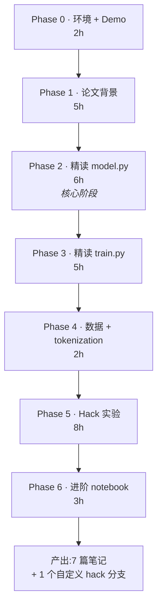

# 00 · nanoGPT 学习计划（路线图）

> 仿照 [`~/train_code_learning/`](../train_code_learning/) 的 Q&A 风格，给 nanoGPT 学习排一条 7 阶段的路。
>
> 配套笔记目录：[`notes/`](./notes/) — 每个 Phase 一个文件。
>
> 代码：[`nanoGPT/`](./nanoGPT/) · 论文：[`papers/`](./papers/)。

---

## 🔖 RESUME HERE（下次来从这里接）

> **暂停时间**:2026-07-01 周三晚（**S5.i fmt_N v2 加 depth → v5.1 direct test → v5.2 "transfer 效率不均"** ✅,commit `59f1d05`)
> **当前位置**:**depth 假设 direct 验证 3/4 subskill**——每 aux 50k 曝光让 2H/D/r per-step 都跳到 73-75%(完美对齐 fmt_M 的 70%)、parse_fail 39.5→7.0%;**但 c per-step 卡在 21%** cascade tail transfer 严重 broken —— 反预测。**v5.1 → v5.2 refinement**:coverage + depth + **subskill transfer 效率不均**(靠后 subskill 因 aux/main context 差异 transfer 失败)。**重大 implication**:S5.b loss_mask(之前被视为 "工程 detour")从 v5.2 视角看**可能是 c 的 direct fix**(loss_mask 用完整 main-task context 但只 supervise subskill output,直接消除 aux/main context 差异)。**下一步 primary**:S5.b loss_mask,预测 c per-step 21→60%+,em 40-60%

### 已完成 Phase 进度

| Phase | 笔记 | 行数 | 状态 |
|---|---|---|---|
| ✅ Phase 0 · 环境 + Demo | `notes/00_setup.md` | 865 | 2026-06-01 |
| ✅ Phase 1 · 论文背景(4 篇 + 11 个基础概念) | `notes/01_papers.md` | 1712 | 2026-06-02 |
| ✅ Phase 2 · 精读 model.py(4/4 Rounds) | `notes/02_model.md` | 2572 | 2026-06-23 |
| ✅ Phase 3 · 精读 train.py(3/3 Rounds) | `notes/03_train.md` | 2741 | 2026-06-24 |
| ✅ Phase 4 · 数据 + tokenization(1/1 Round) | `notes/04_data.md` | **1299** | **2026-06-24** |
| | **总计** | **9189 行** | |

### Phase 3 全 Round 收获总览

| Round | 章节 | 关键收获 |
|---|---|---|
| Round 1(2026-06-23) | §一 训练循环 + §二 DDP no_sync | 一个 iter 8 步;**前 K-1 次跳过 all-reduce 是省带宽不是降噪声**(用户答错纠正);单卡 `if ddp:` guard |
| Round 2(2026-06-24 上) | §四 LR 调度 + §五 数据加载 | 自写 `get_lr(it)` 无状态;**`min_lr=0.1×lr_max` 来自 GPT-3 paper**;`np.memmap` 惰性读;`pin_memory + non_blocking` 必须配对 |
| Round 3(2026-06-24 下) | §六 torch.compile + §七 DDP 启动 + §九 bench | `torch.compile` 4 阶段编译 ~1 分钟;**RANK 全局唯一,LOCAL_RANK 机内唯一**(`cuda:{local_rank}`);bench 比 train 快 10-20% |

### 顺带补回 §三 Q3.3

读 §三 时发现 Q3.3(`autocast` 包 forward 还是整 iter?)是 TODO,**回填补上**:autocast 只包 forward + loss,backward 由 autograd 自动用混合精度,optimizer.step **必须用 fp32**(Adam m/v 状态精度敏感)。

### Phase 2 全 Round 收获总览

| Round | 章节 | 关键收获 |
|---|---|---|
| Round 1(2026-06-03) | §一 LayerNorm + §二 CausalSelfAttention | 自定义 LN 支持 bias=False;c_attn 合并 QKV / flash / register_buffer mask |
| Round 2(2026-06-03) | §三 MLP + §四 Block | 4× 扩压 + GELU;**pre-norm `x = x + sublayer(LN(x))`** 梯度直通 |
| Round 3a(2026-06-10 上) | §五 GPT.__init__ | ModuleDict 跟 HF 对齐 / weight tying 省 31% / c_proj 缩 1/sqrt(2N) |
| Round 3b(2026-06-10 晚) | §六 GPT.forward | shape 流水 (B,T)→(B,T,n_embd)→(B,T,V) / cross_entropy = -L₁/N |
| Round 4(2026-06-23) | §七 generate + §八 optimizer + §九 from_pretrained | 没 KV cache / weight decay 2D 加 1D 不加 / fused AdamW 5 kernel→1 / Conv1D 要 `.t()` |

### Phase 4 收获总览(2026-06-24 下午)

14 道 Q&A 全填完,**用户答题表现是 Phase 1-4 最好的一次**!7 道里 5 道完全对(Q1.1 / Q1.2 / Q2.2 / Q4.1 / Q4.2 / Q5.1),2 道方向对需补(Q2.1 "聚类" → 实际是 BPE 贪心合并;Q3.1 "纯函数" 对 + 漏 Python GIL)。

核心收获:
- **uint16 是甜区**(0-65535 装 GPT-2 vocab=50257 刚刚好),GPT-4 / Llama 3 vocab > 65535 必须用 uint32
- **50257 = 256(byte) + 50000(BPE merge) + 1(EOT)**
- **char vs BPE 比值 3.32×**(相同文本),相同 block_size 下 BPE 看到 3-4× 上下文
- **多进程 tokenize 因为 Python GIL**(纯 CPU 任务多线程无效,必须多进程绕过)
- **跨文档采样无所谓**(causal mask 让模型自学"上下文断裂",同 Phase 3 Q5.2)
- **`.bin` 裸 binary 是甜区**(memmap 支持、文件最小、跨语言友好;npz/pt 都不能 memmap)

### Phase 5 起飞:Hack 实验(预计 8 小时,正式"学以致用")

Phase 5 是把 Phase 0-4 学到的东西**真正用起来**:

| 实验组 | 内容 | 预计时间 |
|---|---|---|
| **A. 超参实验** | block_size / n_layer / n_head / dropout 各扫几个点,看 val_loss 曲线 | 2h |
| **B. 架构改造** | 实现 RMSNorm 替换 LayerNorm + 对比 | 2h |
| **C. 架构改造 2** | 实现 RoPE 位置编码,替换 learned PE | 2h |
| **D. 进阶 hack** | 实现 GQA(Group Query Attention) / SwiGLU MLP | 2h |

最后产出:**1 个 hack 分支**(`hack-rope-rmsnorm` 或类似),技术博客一篇可以写。

### 怎么开始

```
直接跟我说:"开 Phase 5"

或者:"开实验"
```

我会:
1. 30 秒回顾 Phase 2-4 关键点
2. 让你选实验组(可以从超参实验开始,熟悉后再改架构)
3. **跟以前不同:这次更"动手",我帮你设计实验、写改造代码、对比结果**

**也可以选 Phase 6**(进阶 notebook + 对照 nanochat,3 小时,更偏阅读理解,适合不想动 GPU 的话)。

---

## 假设（请按实际修正）

| 维度 | 假设值 |
|---|---|
| 背景 | 熟 PyTorch、做过 e2e/Transformer 训练流水线；LLM 是新领域 |
| 学习目标 | **读懂 → 改得动 → hack 出新东西**，不要求复现 GPT-2 full pretrain |
| 每日投入 | 2.5h（下班后） / 6h（周末或专项） |
| GPU | A100 MIG dev pod（跑实验用），本地 CPU 也能跑 demo |
| 笔记风格 | Q&A + mermaid + 表格 |

## 总时长预估

| 节奏 | 总时长 | 日历周期 |
|---|---|---|
| **集中（6h/天）** | ~32 小时 | **5–6 天** |
| **业余（2.5h/天）** | ~32 小时 | **13–14 天（约 2 周）** |
| **碎片（1.5h/天）** | ~32 小时 | **22 天（约 3 周）** |

> 时长按"读懂 + 跑一遍 + 写笔记"算。如果 Phase 5 的 hack 实验深入展开（自己实现 RoPE/GQA/RMSNorm 并对比），额外再加 4–8h。

## 路线总览



## 各 Phase 一览

| Phase | 主题 | 时长 | 笔记 | 关键交付 |
|---|---|---|---|---|
| 0 | 环境 + Demo | 2h | [`notes/00_setup.md`](./notes/00_setup.md) | 跑出第一段莎士比亚采样 |
| 1 | 论文背景（Transformer/GPT-1/2/3） | 5h | [`notes/01_papers.md`](./notes/01_papers.md) | 4 篇论文对比表 + 4 个 Q&A |
| 2 | 精读 `model.py` | 6h | [`notes/02_model.md`](./notes/02_model.md) | `(B,T) → (B,T,V)` shape 流水图 + 5 个 Q&A |
| 3 | 精读 `train.py` + `configurator.py` + `bench.py` | 5h | [`notes/03_train.md`](./notes/03_train.md) | 训练循环时序图 + 5 个 Q&A |
| 4 | 数据 + tokenization | 2h | [`notes/04_data.md`](./notes/04_data.md) | 三套 prepare.py 对比表 |
| 5 | Hack 实验 | 8h | [`notes/05_hack.md`](./notes/05_hack.md) | 4 组实验记录 + 1 个 hack 分支 |
| 5+ | **鸡兔同笼专题**（Phase 5 具体化）| 7-8h | [`notes/07_chickens_rabbits.md`](./notes/07_chickens_rabbits.md) | mini-GPT + 自定义 prepare/eval + CoT/loss-mask/反序数字 4 个子实验 |
| 6 | 进阶 notebook + 对照 nanochat | 3h | [`notes/06_scaling.md`](./notes/06_scaling.md) | scaling laws 推导 + 模型规模反推 |

## 每日学习节奏


## 目录布局

```
nanogpt-study/
├── 00_learning_plan.md         ← 本文件
├── nanoGPT/                    ← 代码（hack 时另起分支，别动 master）
├── papers/                     ← 4 篇 PDF
└── notes/                      ← 7 篇阶段笔记
    ├── 00_setup.md
    ├── 01_papers.md
    ├── 02_model.md
    ├── 03_train.md
    ├── 04_data.md
    ├── 05_hack.md
    ├── 06_scaling.md
    └── 07_chickens_rabbits.md  ← Phase 5 具体化：鸡兔同笼推理 mini-GPT
```

## 风险 / 时间陷阱

| 陷阱 | 后果 | 规避 |
|---|---|---|
| 想完整复现 GPT-2（OpenWebText） | 4 天 × 8 A100，且 prepare 一次几小时 | **不做**。stick to shakespeare 系列 |
| 在 DDP 多卡上 debug | 排查时间易翻倍 | 先单卡跑通，DDP 留到最后或跳过 |
| `torch.compile` 首次 compile 卡几分钟 | 误以为挂了 | 先 `compile=False` 跑通再开 |
| 卡在 Flash Attention 内部细节 | 容易钻偏 | 黑盒看就行，知道它等价于 `softmax(QK^T/√d)·V` + causal mask 即可 |
| 想看懂 tiktoken BPE 训练细节 | 几小时出不来 | 这次只用、不研究 BPE 训练 |
| Phase 5 实验调超参停不下来 | 时间预算翻倍 | 设硬上限：每个超参点最多 2000 iter，不追极致 |

## 进度追踪

每完成一个 Phase，在下面打勾：

- [x] Phase 0 · 环境 + Demo ✅ 2026-06-01（耗时 ~4 小时，笔记 865 行）
- [x] Phase 1 · 论文背景 ✅ 2026-06-02（耗时 ~4 小时，笔记 1712 行,含 11 节基础概念 + 12 道 Q&A + 5 张对比表）
- [x] Phase 2 · 精读 `model.py` ✅ 2026-06-23（耗时 ~6 小时,4 个 Round 跨 3 周,笔记 2572 行,含 PyTorch 速查表 + 19 道 Q&A + 9 个深度 FAQ + 完整 HF 权重映射表 + estimate_mfu 详解 + init_from 调用方式）
- [x] Phase 3 · 精读 `train.py` ✅ 2026-06-24（耗时 ~5 小时,3 个 Round 跨 2 天,笔记 2741 行,含 26 道 Q&A 全填完 + 训练循环时序图 + DDP all-reduce 详解 + 混合精度数学完整推导 + autocast/GradScaler/fused AdamW 工程细节）
- [x] Phase 4 · 数据 + tokenization ✅ 2026-06-24（耗时 ~1.5 小时,1 个 Round 全收官,笔记 **1299 行**,14 道 Q&A 全填完 + 3 套 prepare.py 对比 + tokenization 5 维度影响 + BPE 50257 拆解）
- [ ] Phase 5 · Hack 实验
- [~] Phase 5+ · 鸡兔同笼专题（[`notes/07_chickens_rabbits.md`](./notes/07_chickens_rabbits.md)）— **S1-S4 + S5.a + 扩 H + S5.c/d/e/f/g/h/i + Q&A Round 1+2 完成 ✅** (2026-06-25 至 2026-07-01)；**结论迭代 v3 → v4 → v5 → v5.1 → v5.2**;S5.i 每 aux 50k 让 3/4 subskill (2H/D/r) 完美跳到 73-75% depth 假设加固,**但 c 卡 21%** cascade tail transfer broken → **v5.2 "coverage + depth + transfer 效率不均"**;S5.b loss_mask 从"工程 detour"升级为"c 的 direct fix candidate";对比表 10 行；分支 `hack/chickens-rabbits` commits `349ec8e`→`59f1d05` 共 12 个入库）；**下一步 primary**:S5.b loss_mask(v5.2 direct falsification test)
- [ ] Phase 6 · 进阶 notebook + 对照
