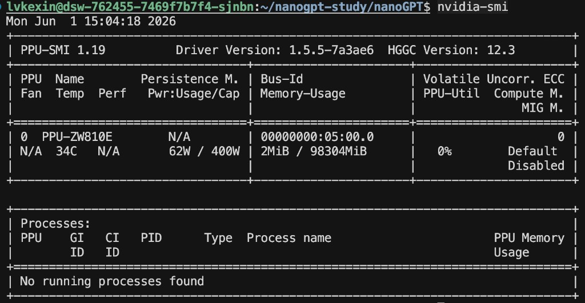
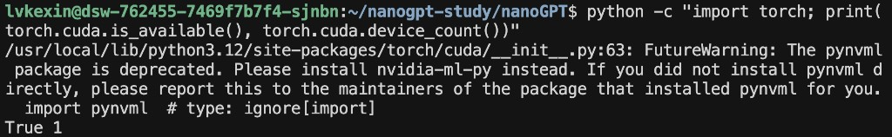
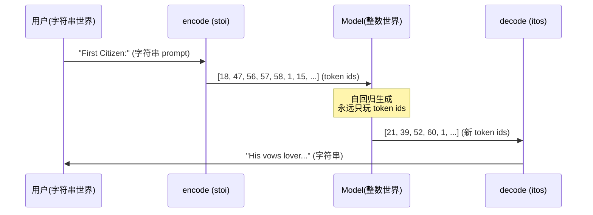
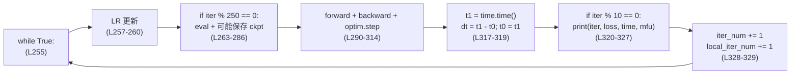
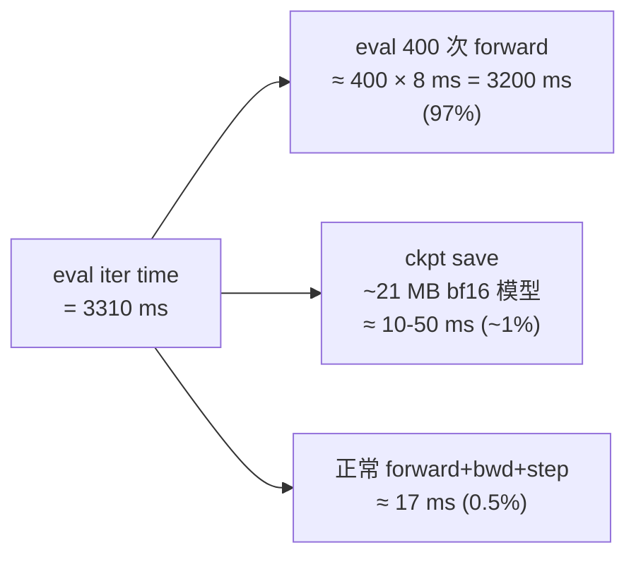
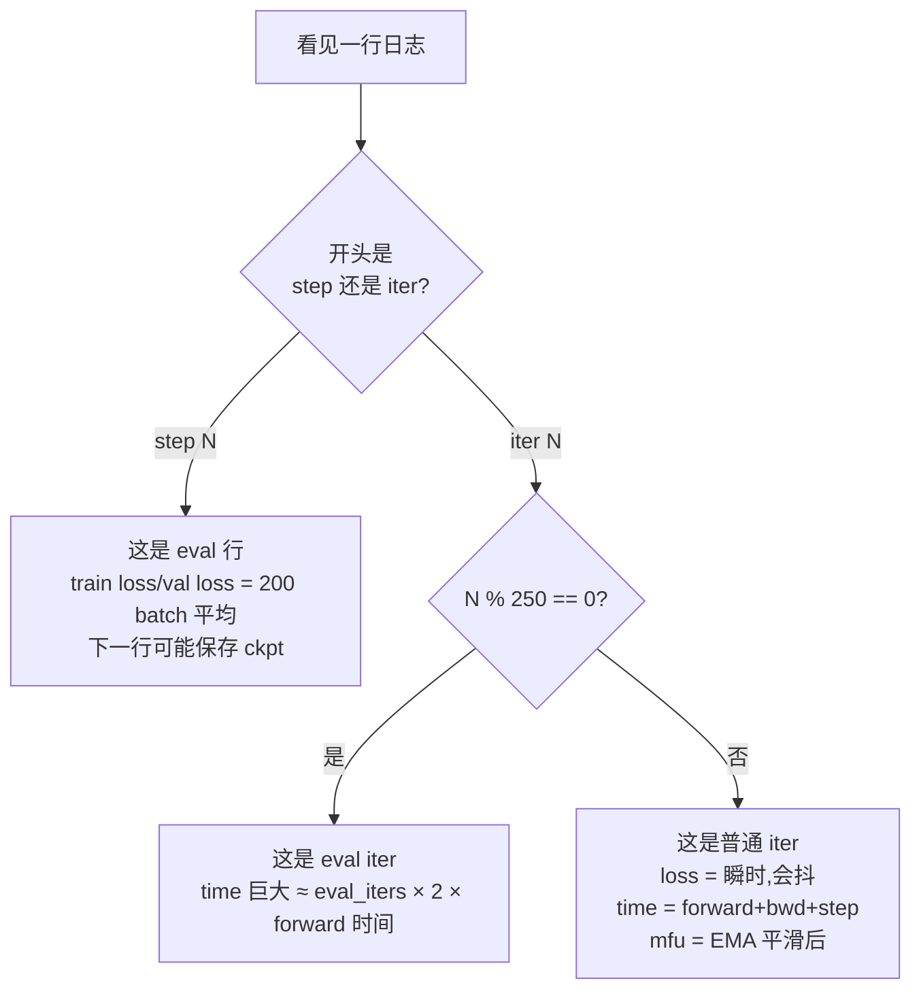
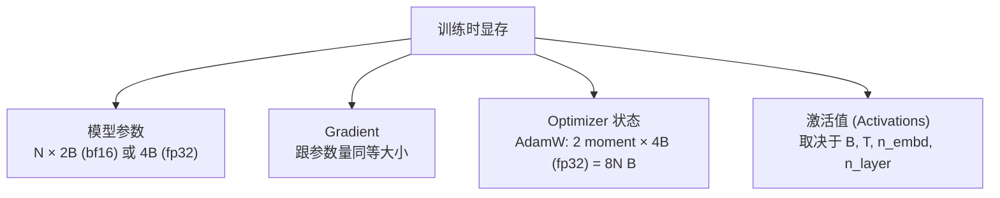
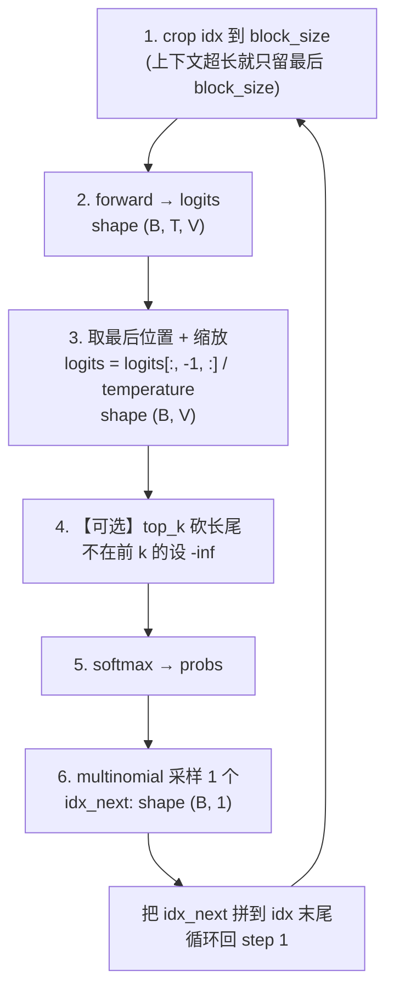
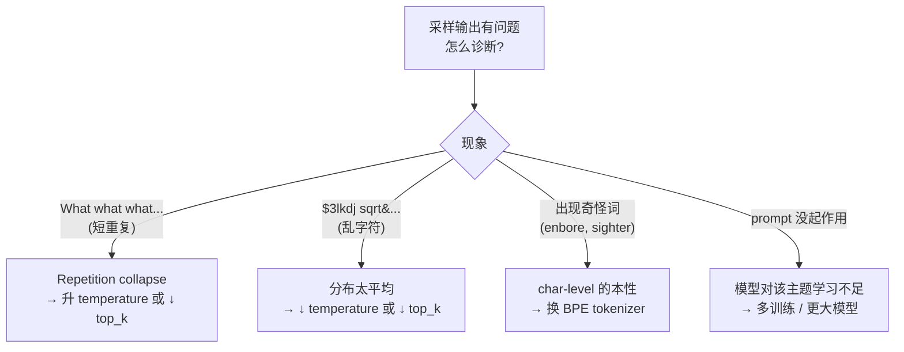

# 00 · 环境 + Demo 学习笔记（Q&A 版）

> Phase 0：跑出第一段莎士比亚采样，验证 nanoGPT 环境可用。
>
> 上游：`[../00_learning_plan.md](../00_learning_plan.md)` · 代码：`[../nanoGPT/](../nanoGPT/)`
>
> 预计时长：**2 小时**

---

## 执行记录


| 项            | 状态           | 备注                                                 |
| ------------ | ------------ | -------------------------------------------------- |
| 装依赖          | ✅ 2026-06-01 | 详见下方                                               |
| `prepare.py` | ✅ 2026-06-01 | 1,003,854 train + 111,540 val tokens               |
| 训练           | ⏳ 待跑         | `python train.py config/train_shakespeare_char.py` |
| 采样           | ⏳ 待跑         | `python sample.py --out_dir=out-shakespeare-char`  |


### 依赖现状

- 系统 Python 3.12 已自带:`torch 2.8.0`、`numpy 1.26.0`、`transformers 4.57.0`、`datasets 2.12.0`、`tiktoken 0.12.0`、`tqdm 4.67.1`、`requests 2.32.5`
- `wandb` 装在专属 venv:`~/.venvs/nanogpt-study/`(`--system-site-packages`,继承上面所有,只额外加 `wandb 0.27.0`)

```bash
# 激活 venv（想用 wandb 日志时）
source ~/.venvs/nanogpt-study/bin/activate

# 不用 wandb 直接系统 python3 也能跑（train.py 默认 wandb_log = False）
```

### 输出文件

```
nanoGPT/data/shakespeare_char/
├── input.txt        1.1 MB  原始莎士比亚文本
├── train.bin        2.0 MB  1,003,854 uint16 tokens（90%）
├── val.bin          218 KB  111,540 uint16 tokens（10%）
└── meta.pkl         703 B   { vocab_size: 65, itos, stoi }
```

### 实际解码（前 80 token）

```
First Citizen:
Before we proceed any further, hear me speak.

All:
Speak, speak.
```

（这是莎士比亚《科里奥兰纳斯》开头第一幕。）

---

## 总览：今天要干什么


| Step | 命令                                                                  | 产物                               | 耗时（A100） |
| ---- | ------------------------------------------------------------------- | -------------------------------- | -------- |
| 装依赖  | `pip install torch numpy transformers datasets tiktoken wandb tqdm` | —                                | ~3 min   |
| 准备数据 | `python data/shakespeare_char/prepare.py`                           | `train.bin`、`val.bin`、`meta.pkl` | <1 min   |
| 训练   | `python train.py config/train_shakespeare_char.py`                  | `out-shakespeare-char/ckpt.pt`   | ~3 min   |
| 采样   | `python sample.py --out_dir=out-shakespeare-char`                   | stdout 采样文本                      | <30s     |


## 一、安装 + 验证

### Q1.1：每个依赖各干什么？

**答**：7 个依赖在 nanoGPT 里分工很明确，**有 2 个是延迟导入**（不装也能跑非依赖路径）：

| # | 包 | 用途 | nanoGPT 里在哪用 | 不装行吗? |
|---|---|---|---|---|
| 1 | `torch` | 深度学习框架本体 | `model.py`、`train.py`、`sample.py`、`bench.py` 顶层 | ❌ 必装,核心 |
| 2 | `numpy` | 数值数组,读写 `.bin` token 流 | `train.py:get_batch`(memmap)、`prepare.py`(写 bin) | ❌ 必装 |
| 3 | `tiktoken` | OpenAI GPT-2 BPE tokenizer | `sample.py`、`data/shakespeare/prepare.py`、`data/openwebtext/prepare.py` | ⚠️ char-level 不需要,BPE 数据集必装 |
| 4 | `tqdm` | 进度条 | `data/openwebtext/prepare.py`(tokenize 几百万文档要看进度) | ⚠️ 只 openwebtext prep 用,其他场景可省 |
| 5 | `transformers` | HuggingFace 模型库 | `model.py:212` **延迟 import** — 仅在 `GPT.from_pretrained('gpt2*')` 时 | ✅ 不装也能跑(只要不调 from_pretrained) |
| 6 | `datasets` | HuggingFace 数据集库 | `data/openwebtext/prepare.py:8` | ✅ 不跑 openwebtext 就不用 |
| 7 | `wandb` | 训练日志可视化 | `train.py:246` **延迟 import** — 仅在 `wandb_log=True` 时 | ✅ 默认 `wandb_log=False`,不装也能跑 |

#### 细看 `torch` 在 nanoGPT 里用了什么

| 子模块 | 用途 | 关键调用点 |
|---|---|---|
| `nn.Module/Linear/Embedding/ModuleDict` | 搭模型 | `model.py` 全文 |
| `torch.optim.AdamW` + `fused=True` | 优化器 | `model.py:configure_optimizers` |
| `torch.compile` | PyTorch 2.0 图编译 | `train.py:198`(可选) |
| `torch.autocast(dtype=bfloat16)` | 混合精度 forward | `train.py:153` |
| `torch.nn.functional.scaled_dot_product_attention` | Flash Attention 路径 | `model.py:CausalSelfAttention.forward` |
| `torch.distributed` (DDP) | 多卡训练 | `train.py:DDP wrap` |
| `torch.cuda.amp.GradScaler` | fp16 时的梯度缩放(bf16 不用) | `train.py:GradScaler` |

#### 两个延迟导入的设计

```python
# train.py:245-247  — wandb 只在开关打开时才 import
if wandb_log and master_process:
    import wandb
    wandb.init(...)

# model.py:212  — transformers 只在 from_pretrained 时才 import
@classmethod
def from_pretrained(cls, model_type, override_args=None):
    ...
    from transformers import GPT2LMHeadModel  # lazy import
    ...
```

**好处**:基础训练(from-scratch + 不写 wandb)只要 `torch + numpy` 两个核心依赖就够了。`transformers` 和 `wandb` 各 ~300+ MB,延迟到真用时才付安装代价。

#### 我们 nanogpt-study 当前的依赖布局

```
系统 Python 3.12 已自带:
  torch 2.8.0, numpy 1.26.0, transformers 4.57.0,
  datasets 2.12.0, tiktoken 0.12.0, tqdm 4.67.1, requests 2.32.5

~/.venvs/nanogpt-study/  (--system-site-packages,继承上面所有)
  └── 额外装 wandb 0.27.0
```

> 不在 venv 里也能跑(因为系统 Python 已经够用),只是想用 wandb 时记得 `source ~/.venvs/nanogpt-study/bin/activate`。

#### 各 Phase 实际需要的依赖

| Phase | 必需 | 可选 |
|---|---|---|
| 0 · setup demo(shakespeare_char) | `torch numpy requests` | — |
| 0 · sample.py | + `tiktoken`(只有 BPE 模型才用) | — |
| 5 · 微调 GPT-2(`init_from='gpt2'`) | + **`transformers`** | — |
| 4 · OpenWebText prepare | + **`datasets` `tqdm`** | — |
| 任何 phase + wandb 日志 | + **`wandb`** | — |

### Q1.2：怎么验证 GPU 可用？

**答**：

**1、`nvidia-smi`** — 看驱动 + 显卡型号 + 显存



实测我这台 dev pod 跑出来的关键字段:
- **PPU-ZW810E**(国产加速卡,NVIDIA 兼容 API)
- 总显存 **98304 MiB ≈ 96 GB**,当前空闲(2 MiB used)
- 驱动 `PPU-SMI 1.19`,温度 34℃,功耗 62W / 400W
- "No running processes found" → 之前的训练已完全释放显存

**2、`python -c "import torch; print(torch.cuda.is_available(), torch.cuda.device_count())"`** — 看 PyTorch 能否看到 GPU



输出 `True 1` 表示 CUDA 可用且有 1 张可见的卡 ✓。

> 两道一起用:`nvidia-smi` 看**硬件 + 驱动**层,`torch.cuda` 看 **PyTorch 是否能通过驱动跟硬件对话**。两者都 OK 才能跑训练。

```bash
# nvidia-smi
# python -c "import torch; print(torch.cuda.is_available(), torch.cuda.device_count())"
```

---

## 二、prepare.py 做了什么

### Q2.1：`shakespeare_char/prepare.py` 输出的 `.bin` 文件长什么样？

> 🟢 **2026-06-01 苏格拉底式实战回填**(动手跑 prepare.py + 用 `np.fromfile` 直接看二进制 + 用 `np.memmap` 跟 `np.fromfile` 对比才搞清楚的）。

**答**：**裸 `uint16` 字节流**，无 header、无 dtype 元数据、无样本边界、无文档分隔。1MB 文本 → 100 万个整数 → 通过 `np.array.tofile()` 直接写 2MB 二进制文件。训练时用 `np.memmap` 而非 `np.fromfile` 读，这样 GB 级 .bin 也能不爆内存。

**详解**：

#### 一、prepare.py 的 4 行核心代码

```48:52:nanogpt-study/nanoGPT/data/shakespeare_char/prepare.py
# export to bin files
train_ids = np.array(train_ids, dtype=np.uint16)
val_ids = np.array(val_ids, dtype=np.uint16)
train_ids.tofile(os.path.join(os.path.dirname(__file__), 'train.bin'))
val_ids.tofile(os.path.join(os.path.dirname(__file__), 'val.bin'))
```

`np.array(...).tofile()` 跟 `np.save()` 的差别 —— **决定了 .bin 文件的"裸"性质**：

| 方法 | 文件结构 | 文件后缀 | 读取需要的信息 |
|---|---|---|---|
| `np.save(...)` | header 含 dtype + shape + version + 数据 | `.npy` | 自描述，只需 `np.load()` |
| `np.savez(...)` | zip 压缩多 array | `.npz` | 自描述 |
| **`np.array.tofile()`** | **纯数据，无任何元信息** | 任意（常用 `.bin`） | **必须外部告知 dtype 和 shape** |

#### 二、文件大小精确推算

```
1,003,854 tokens × 2 bytes/token (uint16) = 2,007,708 bytes = 1.91 MiB
```

`ls -lh` 把 1.91 MiB 四舍五入显示成 `2.0M`（注意是 MiB 不是 MB），看起来像 2.0 MiB 但精确数是 2,007,708 —— **无 overhead，无 padding，严格 N × 2 字节**。

#### 三、为什么 uint16 不用 uint8？

char-level 的 vocab_size=65 完全装得下 uint8（0-255）。但 nanoGPT 故意统一用 uint16，因为：

| Tokenizer | vocab_size | uint8 (256) 够？ |
|---|---|---|
| **char-level**（本次） | **65** | ✅ 够，但故意用 uint16 |
| BPE（`tiktoken('gpt2')`） | **50,257** | ❌ 必须 uint16 |
| Llama/GPT-4 大词表 | 100,000+ | 仍在 uint16 范围 |

**BPE 是什么（后面会用到）**：Byte Pair Encoding，GPT-2 的 tokenizer。不按字符也不按单词，而是按"高频子串"切。比如 `"playing"` 切成 `["play", "ing"]`。GPT-2 BPE 一共有 50,257 个 token。

**统一 uint16 的好处** —— `train.py:get_batch` 不用根据 dataset 改 dtype，代码统一。代价：char-level 浪费一半空间（2MB → 本来 1MB 就够），但小到可忽略。

#### 四、训练时怎么读 .bin？—— `np.memmap` 不是 list

```115:125:nanogpt-study/nanoGPT/train.py
data_dir = os.path.join('data', dataset)
def get_batch(split):
    # We recreate np.memmap every batch to avoid a memory leak, as per
    # https://stackoverflow.com/questions/45132940/numpy-memmap-memory-usage-want-to-iterate-once/61472122#61472122
    if split == 'train':
        data = np.memmap(os.path.join(data_dir, 'train.bin'), dtype=np.uint16, mode='r')
    else:
        data = np.memmap(os.path.join(data_dir, 'val.bin'), dtype=np.uint16, mode='r')
    ix = torch.randint(len(data) - block_size, (batch_size,))
    x = torch.stack([torch.from_numpy((data[i:i+block_size]).astype(np.int64)) for i in ix])
    y = torch.stack([torch.from_numpy((data[i+1:i+1+block_size]).astype(np.int64)) for i in ix])
```

**3 种读法对比**：

| 方式 | 数据在哪 | 内存占用 | 适合 |
|---|---|---|---|
| `list(...)` | RAM（Python int 对象，每个 16-28 字节） | **巨大** | < 1 MB |
| `np.fromfile(...)` | RAM（密集 uint16 数组） | 2 bytes × N | < 10 GB |
| **`np.memmap(...)`** | **虚拟内存，按需从磁盘 page in** | **极少**（操作系统 page cache） | **任意大，17 GB openwebtext 也能跑** |

**memmap 工作原理**：


为什么 nanoGPT 用 memmap：
1. **OpenWebText**：tokenize 完是 17 GB，`np.fromfile` 会 OOM
2. **shakespeare_char 1 MB**：其实 fromfile 也行，但**代码统一**：不管数据集多大都用同一个 get_batch

#### 五、"一个样本"怎么从 .bin 取出来？

```python
ix = torch.randint(len(data) - block_size, (batch_size,))            # 64 个随机起点
x = torch.stack([torch.from_numpy(data[i:i+block_size])     for i in ix])  # x: (64, 256)
y = torch.stack([torch.from_numpy(data[i+1:i+1+block_size]) for i in ix])  # y: (64, 256) = x 右移 1 位
```

- 从 `1,003,854 - 256 = 1,003,598` 个可能起点里**随机抽 64 个**
- 每个起点取连续 256 个 token 作样本
- `y` = `x` 右移 1 位（标准 causal LM 目标：**给 x[0..t]，预测 x[1..t+1]**）

⚠️ **关键陷阱**：起点完全随机，会**跨越文档边界**（因为 .bin 里根本没有边界标记）。比如可能取到 `"...end of doc. \n\n Start of next doc..."` 横跨。对 LLM 训练影响极小（模型自然处理），但要知道这个事实。

#### 六、动手验证（我已经跑过）

```bash
# 看前 50 个 token 整数
python3 -c "import numpy as np; t=np.fromfile('data/shakespeare_char/train.bin', dtype=np.uint16); print(t.shape, t[:50].tolist())"
# → (1003854,) [18, 47, 56, 57, 58, 1, 15, 47, 58, 47, 64, ...]

# 解码回原文
python3 -c "
import pickle, numpy as np
with open('data/shakespeare_char/meta.pkl','rb') as f: m=pickle.load(f)
t=np.fromfile('data/shakespeare_char/train.bin', dtype=np.uint16)
print(''.join(m['itos'][i] for i in t[:80]))"
# → 'First Citizen:\nBefore we proceed any further, hear me speak.\n\nAll:\nSpeak, speak.'
```

---

### Q2.2：`meta.pkl` 里存了什么？为什么需要它？

> 🟢 **2026-06-01 苏格拉底式实战回填**（被反问"stoi 和 itos 分别在哪一步用"才整理清楚 encode/decode 双向流的）。

**答**：三个键 `{vocab_size, itos, stoi}`，本质是 char-level 的"翻译手册"。**stoi**（string→integer）在 encode 端把 prompt/原文变成 token id；**itos**（integer→string）在 decode 端把模型生成的 id 变回字符。**vocab_size** 给模型 `nn.Embedding` 用。BPE 数据集不创建 meta.pkl，sample.py 自动 fallback 到 `tiktoken('gpt2')`。

**详解**：

#### 一、三个 key 的分工

| key | 类型 | 例子 | 用在哪里 |
|---|---|---|---|
| `vocab_size` | int | `65` | `train.py` 设置 `nn.Embedding(vocab_size, n_embd)` 的第一维 |
| `stoi` | dict[str, int] | `{'\n':0, ' ':1, ...}` | `prepare.py` 编码原文；`sample.py` 编码用户 prompt |
| `itos` | dict[int, str] | `{0:'\n', 1:' ', ...}` | `sample.py` 解码模型生成的 token ids |

#### 二、模型 vs 人：encode/decode 桥



> **模型本身永远只跟 token ids 打交道，不知道字符是什么**。`stoi` 和 `itos` 都是"桥"，把人类世界（字符串）和模型世界（整数）连起来。

#### 三、sample.py 的具体调用

```67:68:nanogpt-study/nanoGPT/sample.py
    encode = lambda s: [stoi[c] for c in s]
    decode = lambda l: ''.join([itos[i] for i in l])
```

- `encode("ROMEO:")` → `[30, 27, 25, 17, 27, 10]`（stoi 查表）
- 模型 forward + multinomial sample → 拿到一串新 token ids 比如 `[1, 35, 56, 47, 41, 43]`
- `decode([1, 35, 56, 47, 41, 43])` → `' Wrice'`（itos 查表，join）

#### 四、train.py 怎么用 meta.pkl？

```138:144:nanogpt-study/nanoGPT/train.py
meta_path = os.path.join('data', dataset, 'meta.pkl')
meta_vocab_size = None
if os.path.exists(meta_path):
    with open(meta_path, 'rb') as f:
        meta = pickle.load(f)
    meta_vocab_size = meta['vocab_size']
    print(f"found vocab_size = {meta_vocab_size} (inside {meta_path})")
```

train.py **只用 vocab_size，完全忽略 itos/stoi**。原因：

> 训练时输入的 token ids 已经在 `.bin` 里，不需要任何字符串解析。只在模型架构层面要知道 vocab_size 来：
> - 创建 `wte = nn.Embedding(vocab_size, n_embd)` 输入嵌入
> - 创建 `lm_head = nn.Linear(n_embd, vocab_size)` 输出投影

如果 `meta.pkl` 不存在，train.py 走默认值 `50304`（GPT-2 vocab 50257 向上取整对齐 64，优化矩阵乘性能）。

#### 五、删了 meta.pkl 会怎样？—— BPE 兜底

```57:74:nanogpt-study/nanoGPT/sample.py
# look for the meta pickle in case it is available in the dataset folder
load_meta = False
if init_from == 'resume' and 'config' in checkpoint and 'dataset' in checkpoint['config']:
    meta_path = os.path.join('data', checkpoint['config']['dataset'], 'meta.pkl')
    load_meta = os.path.exists(meta_path)
if load_meta:
    print(f"Loading meta from {meta_path}...")
    with open(meta_path, 'rb') as f:
        meta = pickle.load(f)
    stoi, itos = meta['stoi'], meta['itos']
    encode = lambda s: [stoi[c] for c in s]
    decode = lambda l: ''.join([itos[i] for i in l])
else:
    # ok let's assume gpt-2 encodings by default
    print("No meta.pkl found, assuming GPT-2 encodings...")
    enc = tiktoken.get_encoding("gpt2")
    encode = lambda s: enc.encode(s, allowed_special={"<|endoftext|>"})
    decode = lambda l: enc.decode(l)
```

行为对照表：

| 模型类型 | meta.pkl | 后果 |
|---|---|---|
| char-level 模型 + 有 meta.pkl | ✓ | 正常工作 |
| char-level 模型 + **删了** meta.pkl | ✗ | **完全错乱** —— fallback 用 BPE 解码 char-level 出的 ids，输出乱码 |
| BPE 模型（shakespeare/openwebtext） | ✗ 一开始就没创建 | **正常**，直接用 tiktoken 兜底 |

> 这就是为什么 `data/shakespeare/prepare.py` 和 `data/openwebtext/prepare.py` 都**没有** `meta.pkl` —— 它们用 tiktoken 标准 BPE，encode/decode 不需要本地存表。

#### 六、char-level 跟 BPE 的存储对照

| 维度 | char-level | BPE |
|---|---|---|
| vocab_size | 65（本数据集） | 50,257（GPT-2） |
| meta.pkl | ✓ 需要（自定义 itos/stoi） | ✗ 不需要（用 tiktoken） |
| 适合数据集 | 小（<1 MB），教学/调试 | 中-大（MB-TB） |
| token 长度 | 1 char = 1 token | 1 token ≈ 4 chars |
| 同样文本的 token 数 | 多 4× | 少 4× |
| 训练时 context 利用 | "近视" —— block_size=256 只覆盖 256 字符 | "远视" —— block_size=256 覆盖 ~1000 字符 |

---

## 三、训练日志

### Q3.1：训练日志里 `iter`、`loss`、`mfu` 各代表什么？

> 🟢 **2026-06-01 苏格拉底式实战回填**(自己跑 5000 iter + 4 轮反问才把日志的每个字段拆透）。

**答**:nanoGPT 的训练日志有**两种 print**:`iter X: ...`(每 `log_interval=10` 步一行,**瞬时**值)和 `step X: ...`(每 `eval_interval=250` 步一行,**平均**值,触发 eval 和可能的 ckpt 保存)。三个字段:

| 字段 | 含义 | 算法 |
|---|---|---|
| `iter N` | 第 N 次训练步(forward+backward+step 一次为一步) | `iter_num` 计数器,L328 处 `+=1` |
| `loss F` | 这一 iter **单 batch 的瞬时 loss**(不平均,带噪声) | `lossf = loss.item() * gradient_accumulation_steps`(L323) |
| `time T ms` | 这一 iter 的 **dt**:从上一次 t1 到这次 t1 之间的所有事 | `dt = t1 - t0`(L318) |
| `mfu P %` | **EMA 平滑**后的 Model FLOPs Utilization,**相对 A100 312 TFLOPS bf16 标杆** | EMA: `0.9·running + 0.1·new`,前 5 步跳过 |

**详解**:

#### 一、两种 print 的对照

| 维度 | Print A:`iter N: loss F, time T, mfu P` | Print B:`step N: train loss X, val loss Y` |
|---|---|---|
| 频率 | `log_interval = 10` → 每 10 iter 一行 | `eval_interval = 250` → 每 250 iter 一行 |
| loss 来源 | 当前训练 batch 一次 forward 算出来的 raw loss | `estimate_loss()`:`train`/`val` 各 200 batch 取**平均** |
| 用途 | 监控训练进度(噪声大,会上下抖) | 监控泛化能力(平滑可信,决定 ckpt 保存) |
| 代码位置 | `train.py:323-327` | `train.py:263-265` |

> **这就是为什么 iter 280: loss 1.9753,但 step 500: train loss 1.5270** —— 一个瞬时一个平均,且 step 500 那个 train_loss 用的是接近 iter 500 时的 200 batch,**比 iter 280 晚 220 步**,模型也更收敛了。

#### 二、`iter` 计数器



> `local_iter_num` 是另一个计数器 — 用来判断"前 5 步跳过 MFU 统计"(L324),resume 训练时也是从 0 开始,这样新进程也会重新 warm up。

#### 三、`time` 的内部分摊

`dt` 计时窗口覆盖一个完整 iter:**LR 更新 + 可能的 eval+save + forward+backward+step + log**。eval 在 `dt` **里面**,所以 eval 行的 time 会包含 eval 开销。

**实测对比**(用我自己 5000 iter 训练的数据):

| iter 类型 | 实测 time | 内部分摊 |
|---|---|---|
| 普通 iter(如 iter 280) | **17.04 ms** | forward+bwd+step(98%)+ log(2%) |
| eval iter(如 iter 500) | **3310.06 ms** | **eval 400 次 forward**(97%)+ ckpt save(<1%)+ forward+bwd(0.5%)|

**Fermi 估算**(让你确信 eval 是主因,不是 ckpt save):



> 400 次的来源:`estimate_loss()` 外层 `for split in ['train','val']`(2 次)× 内层 `for k in range(eval_iters)`(200 次)= 400 forward。但都是 `@torch.no_grad()` 下的,无 backward,大约比正常 iter 快一半,所以 ~8 ms/次。

**优化方向**:想减小 eval iter spike,改 `eval_iters` 不改 `eval_interval`。把 200 → 50,eval 时间降 4×,代价是 loss 估计噪声大一些(但定位 val 最低点足够)。

#### 四、`mfu` 的两层处理

详见 [`03_train.md` Q9.2](../notes/03_train.md#q92mfumodel-flops-utilization怎么算为什么-nanogpt-上-a100-大概在-50-60),要点:

1. **公式**:`mfu = flops_achieved / flops_promised = (实际跑出的 FLOPs/s) / 312e12`
2. **EMA 平滑**:`running_mfu = 0.9·hist + 0.1·new`,~10 步窗口
3. **前 5 步跳过**(`if local_iter_num >= 5`):

| 第几步 | 发生什么 | dt 异常? |
|---|---|---|
| 0 | `torch.compile` 第一次编译(整个模型 → graph → CUDA kernel),可能 10-60 秒 | 极慢 |
| 1 | 第一次 backward 触发 autograd graph 构建;cuDNN benchmark autotuner 选 kernel | 较慢 |
| 2-4 | CUDA memory pool 稳定化、kernel cache warm up | 略慢 |
| **5+** | 稳态:kernel 编译好、autotune 完成、内存稳定 | **正常** |

> 如果把第 0 步 30s 的 MFU(≈0.057%)纳入 EMA,需要 ~20-30 步才能爬回 22%。跳过前 5 步 = "**先让训练稳定下来,再开始记账**",这是 perf benchmark 通用 hygiene。

#### 五、五分钟阅读你的日志

下次你看到训练日志的任意一行,按这个流程解码:



### Q3.2：训练时显存占用大概是多少？跟 batch_size × block_size × n_embd² 的关系？

**答**:训练时显存 = **模型参数 + gradient + optimizer 状态 + 激活值**。前三项跟参数量 `N` 成正比(`N ∝ 12·n_layer·n_embd²`,跟 batch_size 无关);第四项激活值跟 `batch_size × block_size × n_embd × n_layer` 成正比 — **大模型时激活值占大头**。我的 baby GPT 实测占用 ~几百 MB。

**详解**:

#### 一、四块显存的来源



| 块 | 大小公式 | 跟 batch_size 有关吗? |
|---|---|---|
| 1. 模型参数 | `N × dtype_size`(bf16 训练时通常仍存 fp32 master 副本 4N) | ❌ 无关 |
| 2. Gradient | 同上,`N × 4B`(通常 fp32,backward 时累积) | ❌ 无关 |
| 3. Optimizer state(AdamW) | `2 × N × 4B = 8N B`(m, v 两个矩) | ❌ 无关 |
| 4. **Activations** | `≈ B × T × n_embd × n_layer × K`,K 是常数(~15-30) | ✅ **线性 × B,× T** |

> 1-3 是 "**static memory**",一开训练就分配,不随 batch 变;4 是 "**dynamic memory**",随 batch_size、context length 长大。

#### 二、参数量 `N` 的公式(忽略 embedding)

$$ N \approx 12 \cdot n_{layer} \cdot n_{embd}^2 $$

拆解:
- Attention 的 QKV 投影 + 输出投影:`4 · n_embd² · n_layer`
- MLP 中间层 4×:`2 · (n_embd × 4·n_embd) · n_layer = 8 · n_embd² · n_layer`
- 合计:`12 · n_layer · n_embd²`

#### 三、我的 baby GPT 显存估算

config:`n_layer=6, n_head=6, n_embd=384, block_size=256, batch_size=64`

**步骤 1:算参数量**

```
N(transformer 主体) ≈ 12 × 6 × 384² = 10.6 M
+ Embedding (vocab=65, wte+wpe) ≈ 65 × 384 + 256 × 384 = 0.12 M
≈ 10.7 M 参数
```

**步骤 2:静态部分**

| 块 | 大小 |
|---|---|
| 模型(fp32 master) | 10.7 M × 4 B ≈ **43 MB** |
| Gradient(fp32) | 10.7 M × 4 B ≈ **43 MB** |
| AdamW state(2 个 fp32 矩) | 10.7 M × 8 B ≈ **86 MB** |
| **小计 static** | **~172 MB** |

**步骤 3:激活值**(大头,跟 batch、seq 强相关)

Activations 在 transformer 里大致是:

```
≈ B × T × n_embd × n_layer × K
= 64 × 256 × 384 × 6 × ~20 (常数)
≈ 750 MB(无 Flash Attention)
```

**但你开了 Flash Attention**(`scaled_dot_product_attention` 自动启用),attention 的 `(B, n_head, T, T)` score 矩阵不再 materialize → 节省 `B × n_head × T² × n_layer × 2 = 64×6×256²×6×2 ≈ 290 MB`。

**实际激活值大约 ~300-500 MB**。

**步骤 4:合计**

```
总显存 ≈ static (172 MB) + activations (~400 MB) ≈ 600 MB ~ 700 MB
```

#### 四、跟 `batch_size × block_size × n_embd²` 的关系

题目暗示的关系**部分正确但不完整**:

| 显存块 | 跟 batch_size 关系 | 跟 block_size 关系 | 跟 n_embd 关系 |
|---|---|---|---|
| 静态(参数/grad/optim) | ❌ 无关 | ❌ 无关 | ✅ **二次方**(`n_embd²`) |
| Activations(无 Flash) | ✅ 线性 | ✅ **二次方**(因 attention 是 T²) | ✅ 线性 |
| Activations(有 Flash) | ✅ 线性 | ✅ 线性(去掉了 T²) | ✅ 线性 |

> 准确公式应该是:**静态 ∝ n_embd²·n_layer,激活 ∝ batch×block×n_embd·n_layer**(开 Flash 时);两者之间是个加法关系。

#### 五、用 PyTorch 实测显存(下次想确认时用这个)

```python
import torch
torch.cuda.reset_peak_memory_stats()
# ... 跑一个 train iter ...
peak_mb = torch.cuda.max_memory_allocated() / 1024 / 1024
print(f"Peak GPU memory: {peak_mb:.1f} MB")
```

或者训练时另开 terminal 跑 `watch -n 1 nvidia-smi`,看 Memory-Usage 字段实时变化。

#### 六、要省显存,优先动哪个旋钮?

| 想省显存,改这个 | 影响显存多少 | 影响训练效果 |
|---|---|---|
| ↓ `batch_size` | 线性下降激活 | 收敛慢、可能不稳;**可用 grad_accum 补偿** |
| ↓ `block_size` | 二次方(无 Flash) / 线性(有 Flash) | 短上下文,模型变笨 |
| ↓ `n_embd` | 二次方降参数 + 线性降激活 | 模型变小,变笨 |
| ↑ `gradient_accumulation_steps`(+ ↓ batch) | 激活线性下降,等效 batch 不变 | **效果不变,只是变慢** |
| 开 `gradient_checkpointing`(nanoGPT 没用,但 HF 库有) | 激活降至 ~1/sqrt(n_layer) | 变慢 30-50%,效果不变 |
| 模型用 bf16 而非 fp32(已默认) | 静态部分减半 | 几乎无影响 |

> 你想跑更大模型时,先开 grad_accum + Flash Attn,再考虑 grad_checkpointing,最后才动 batch_size。

---

## 四、采样

### Q4.1：`sample.py` 为什么默认 `temperature=0.8, top_k=200`？改成 `temperature=0.0` 会怎样？

> 🟢 **2026-06-01 苏格拉底式实战回填**（自己跑 5 个对照实验，亲眼看到 T=0.2 的 repetition collapse 和 char-level vocab=65 时 top_k=200 实际无效的陷阱）。

**答**：`temperature=0.8` 让分布稍微变尖（比 T=1 更保守），`top_k=200` 把长尾低概率 token 砍掉（只在前 200 个候选里采样）。两者配合 = "**稳一点又不死板**" 的经验值。`temperature=0` 在 nanoGPT 代码里会**除零报错**，真想 greedy decode 应该用 `temperature=1e-5` 或 `top_k=1`。但 char-level vocab=65 时 `top_k=200 > 65`，**top_k 实际完全失效**。

**详解**：

#### 一、`generate()` 自回归 6 步流程

每生成一个 token 完整流程（[`model.py`](../nanoGPT/model.py) L305-L328）：



#### 二、`logits.shape` 是 `(B, T, V)` 不是 `(B, T, n_embd)`

| 维度 | 是什么 | 来源 |
|---|---|---|
| B | batch_size | sample.py 里固定 1（一次只 sample 1 段） |
| T | 当前序列长度 | 每生成 1 个 token 就 +1 |
| **V** | **vocab_size**（你这次 = 65） | `lm_head = nn.Linear(n_embd, vocab_size)` 的输出维度 |

**关键**：logits[i, t, v] 代表"第 i 个样本、第 t 个位置上，下一个 token 选词表第 v 个的得分"。最后通过 softmax 才变成概率分布。

> 一个 sanity check：你 sample 时 `logits[:, -1, :]` shape = `(1, 65)`，65 个 logit 通过 softmax 变成 65 个概率，再 multinomial 选 1 个。如果不先经过 `lm_head` 把 n_embd=384 → vocab=65，你怎么从 384 个数里选 65 个字符之一？没法。

#### 三、`temperature` 的数学原理

`logits / T` 然后 softmax，对分布形状的影响：

| temperature | 数学效果 | 分布形状 | 采样行为 |
|---|---|---|---|
| **T = 1** | 不变 | 原始分布 | 标准 sampling |
| **T < 1**（如 0.8、0.5、0.2） | logits 被放大 | 变 **尖** | 偏向高概率 token（更保守） |
| **T → 0** | logits 放大到 inf | 一个 token 占 ~100% | **近 greedy**（始终选最大） |
| **T > 1**（如 1.5、5.0） | logits 被压缩 | 变 **平均** | 低概率 token 也容易被采（更随机） |

**自己跑感受一下**：

```python
import torch, torch.nn.functional as F
logits = torch.tensor([2.0, 1.0, 0.5, 0.1, -1.0])
for T in [0.1, 0.5, 1.0, 2.0, 5.0]:
    probs = F.softmax(logits / T, dim=0)
    print(f"T={T}: {probs.numpy().round(3)}")
# T=0.1: [1.    0.    0.    0.    0.   ]   ← 极尖
# T=0.5: [0.717 0.097 0.036 0.016 0.001]  ← 偏尖
# T=1.0: [0.581 0.214 0.130 0.087 0.029]  ← 默认
# T=2.0: [0.388 0.236 0.184 0.151 0.058]  ← 偏平
# T=5.0: [0.295 0.241 0.218 0.198 0.082]  ← 很平
```

#### 四、`top_k` 的数学原理

```320:322:nanogpt-study/nanoGPT/model.py
if top_k is not None:
    v, _ = torch.topk(logits, min(top_k, logits.size(-1)))
    logits[logits < v[:, [-1]]] = -float('Inf')
```

3 步：
1. `torch.topk(logits, k)` 返回前 k 个最大 logit 的**值**（v）和**索引**（不用）
2. `v[:, [-1]]` 是 top-k 中**第 k 名**（最小的入围者），相当于"录取分数线"
3. `logits < v[:, [-1]]` mask 出"落榜"位置，赋 `-inf`

**`-inf` 经 softmax 后变成 0** → multinomial **不会采到** 这些位置（同一个数学 trick，跟 attention 的 causal mask 一模一样，但 context 不同：这里是采样限制，attention 那里是看不见未来）。

#### 五、为什么默认 0.8 和 200 —— GPT-2 的经验值

- **temperature=0.8**：略 < 1，平衡"创造性"和"一致性"。GPT-2/3 论文里常用 0.7-0.9。
- **top_k=200**：从 GPT-2 vocab=50,257 里砍掉 99.6% 长尾，只在 top 200 内采样。GPT-2 作者实验得到。

但是 ——

#### 六、⚠️ 关键陷阱：char-level 时 `top_k=200` **完全失效**

你 vocab=65，top_k=200 > 65：

```python
min(top_k, logits.size(-1)) = min(200, 65) = 65  # 全部入围,无人被砍!
```

**等价配置对照表**：

| 你的实际设置 | 等效配置 | 说明 |
|---|---|---|
| `temperature=0.8, top_k=200`（默认） | `temperature=0.8` 无 top_k | top_k 完全 no-op |
| `temperature=0.8, top_k=10` | 真的截断 | 只在前 10 个里采，更集中 |
| `temperature=0.8, top_k=1` | greedy | 每次选最大，确定但单调 |

> 这是 char-level + 大 top_k 的陷阱：sample.py 默认参数为 BPE（vocab=50,257）设计，在 char-level 上 top_k 自动失效，**只有 temperature 在起作用**。

#### 七、`temperature=0` 为什么不能用？正确的 greedy decode 怎么写？

代码里 `logits / temperature`，T=0 时直接 **除零** → `inf` / 实际跑会 `RuntimeError` 或 `NaN`。

想做 greedy decode（确定性选最大），3 种正确写法：

| 方法 | 命令 | 原理 |
|---|---|---|
| 极小 T | `--temperature=0.0001` | 几乎所有概率集中到最大 logit |
| 硬截断 | `--top_k=1` | 只保留 top 1，multinomial 必然选它 |
| 改代码 | `idx_next = logits.argmax(dim=-1)` | 完全跳过 softmax/multinomial |

**注意**：greedy decode 在文本生成里通常**输出无聊**，且容易陷入 **repetition collapse**（你 T=0.2 实验已经看到了）—— 这就是为什么 sample.py 默认不用 greedy。

#### 八、5 个对照实验观察表（我跑的）

| 实验 | 命令 | 观察 |
|---|---|---|
| **E1 默认** | `temperature=0.8 top_k=200`（实际 top_k=no-op） | 莎士比亚 vibe + 编造词（`enbore`、`sighter`），格式正确 |
| **E2 低 T** | `temperature=0.2` | ⚠️ **repetition collapse**：`What, what a man a man a man of this?` —— 字典词变多但陷入循环 |
| **E3 高 T** | `temperature=1.5` | 输出**不像英语**了，乱字符多，结构散 |
| **E4 真 top_k** | `top_k=5`（真截断） | 比 E2 更集中但**避免 repetition collapse**（top 5 内随机抽，有逃出循环的机会） |
| **E5 prompt** | `--start="ROMEO:"` | 模型没"针对 ROMEO" —— char-level baby GPT 只学到结构没学到语义 |

#### 九、采样的 4 种典型失败模式（认识它们)



#### 十、现代采样方法（顺便了解，后面 nanochat 会用到）

| 方法 | 原理 | 优势 |
|---|---|---|
| **greedy** | 总是 argmax | 确定但单调，repetition |
| **temperature sampling** | softmax 前缩放 logits | 平衡创造性/一致性 |
| **top_k**（nanoGPT 用） | 硬截断到前 k | 简单高效，但 k 固定 |
| **top_p / nucleus**（GPT-4 / Claude 用） | 动态选累积概率 ≥ p 的最小集 | 适应不同上下文分布形状 |
| **min_p** | 截断到 max·min_p 阈值 | 解决 top_p 在尖锐分布下的 over-truncation |

> 你的 baby GPT vocab=65 太小，体会不到这些方法的差异；后面到 Phase 5 玩 GPT-2 124M 时再试。

---

### Q4.2：贴一段你的采样输出

> 🟢 **2026-06-01 实测**（baby GPT 训练 2000 iter，从 `out-shakespeare-char/ckpt.pt` 采样）

**E1 默认参数**（`temperature=0.8, top_k=200`，但 top_k 实际失效）：

```
How chance sort, rogue
That through now of that affair was ever enbore
The point to yourselves? Proceed by your settle
In the love of this foot hot.

MAMILLIUS:
What says that?

MARCIUS:
There is the matter?

Messenger:
You see your grace, let your seed seem a little fee,
And not twain your ears, to chast on him.

COMINIUS:
Do you go with us her?

COMINIUS:
O, good sir, be bound one so, he committed
To shake your sighter of father.

BRUTUS:
Her.

MENENIUS:
Pray you how'st a cause,
And you shall
```

**观察**：
| 学到的能力 | 没学到的能力 |
|---|---|
| ✅ 角色名 + 冒号格式（`COMINIUS:`、`BRUTUS:`） | ❌ 编造词（`enbore`、`sighter`、`how'st`） |
| ✅ 大小写规律（全大写角色名，首字母大写句子） | ❌ 语义连贯性（`Do you go with us her?` 应是 `here`） |
| ✅ 常见英文词组合 | ❌ 全局一致性（COMINIUS 连续两次） |
| ✅ 戏剧文本结构 | ❌ 真正的"剧情" |

> 这是训练 2000 iter、5 分钟、1 MB 文本的 baby GPT 的极限 —— **学会字符 n-gram + 文本结构，但没"词"的概念**。

**E2 低 temperature**（`temperature=0.2`）—— Repetition collapse 实例：

```
Clown:
What, what a man a man a man of this? a better
```

**观察**：经典 repetition collapse —— 概率集中到几个高频 token，陷入 `a → man → a → man` 循环。这是低 T 的著名失败模式。

---

## 五、关键坑

```
1. ⚠️ char-level 时 sample.py 默认 top_k=200 完全失效
   (vocab=65 < 200, min(200, 65) = 65, 等于无 top_k)。
   想真的截断要 top_k=5/10 这种小值。
   解释见 §四 Q4.1 第六节。

2. ⚠️ temperature=0 会除零报错。
   想 greedy decode 用 temperature=0.0001 或 top_k=1。

3. ⚠️ 低 temperature(< 0.3) 容易 repetition collapse:
   "a man a man a man..."。提 T 或换 top_k 即可。

4. ⚠️ char-level baby GPT 不"懂"角色名:
   --start="ROMEO:" 模型只继续符合"全大写名+冒号"格式,
   不会针对 ROMEO 这个具体角色生成。

5. ⚠️ ckpt.pt 在 IDE 里千万别点开看 —— 42 万行二进制
   "文本",会撑爆 extensionHost 几百 MB 内存。
```

---

## 六、自测题清单（毕业测试）

- 能口述：`prepare.py → train.py → sample.py` 三步各自的输入输出
- 能解释：`out-shakespeare-char/ckpt.pt` 里至少存了哪几样东西
- 能跑：把 `n_layer` 从 6 改成 4，重训 500 iter，loss 大致变化趋势
- 能修：如果 `python data/shakespeare_char/prepare.py` 报 `FileNotFoundError`，从哪查起？

## Deliverable

- 跑通完整 3 步
- 在本文件填完所有 Q&A
- 截一张采样输出贴在 §四

