# 01 · 论文背景（Transformer + GPT 系列）学习笔记（Q&A 版）

> Phase 1：读 4 篇论文，建立 GPT 的理论坐标系。
>
> 上游：[`../00_learning_plan.md`](../00_learning_plan.md) · PDF：[`../papers/`](../papers/)
>
> 预计时长：**5 小时**

---

## 总览：4 篇论文怎么排

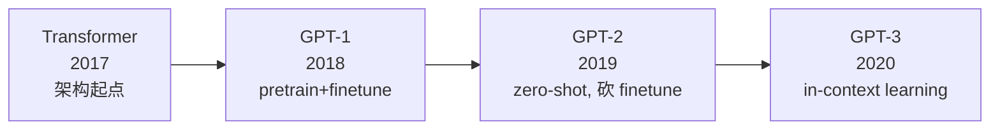

## 阅读重点

| 论文 | 路径 | 重点章节 | 跳过 |
|---|---|---|---|
| Attention is All You Need | [`../papers/attention-is-all-you-need-1706.03762.pdf`](../papers/attention-is-all-you-need-1706.03762.pdf) | §3.2 Attention、§3.4 PE、Fig. 1 | encoder-decoder cross attention 细节 |
| GPT-1 | [`../papers/gpt1-improving-language-understanding-by-generative-pretraining.pdf`](../papers/gpt1-improving-language-understanding-by-generative-pretraining.pdf) | §3 框架 | 下游任务 fine-tune 形式（仅扫一眼） |
| GPT-2 | [`../papers/gpt2-language-models-are-unsupervised-multitask-learners.pdf`](../papers/gpt2-language-models-are-unsupervised-multitask-learners.pdf) | §1, §2, §3.1 | WebText 构建细节 |
| GPT-3 | [`../papers/gpt3-language-models-are-few-shot-learners-2005.14165.pdf`](../papers/gpt3-language-models-are-few-shot-learners-2005.14165.pdf) | §1, §2, §3.1 | 后面海量 benchmark |

---

## 基础概念清单（先于速读读这个,后面论文才看得懂）

> 🟢 **2026-06-02 通过苏格拉底反问回填**：6 个底层概念被反问清楚后整理。读论文前先把这一节吃透,后面"预训练"、"自监督"、"L₁"、"cross-entropy" 等术语出现时不会再迷茫。

### 0.1 · 架构维度 vs 训练范式维度（两条正交维度,**最容易混淆**）

读 LLM 论文必须先把这两个维度分清,**它们是正交的,任意组合都有对应的模型**：

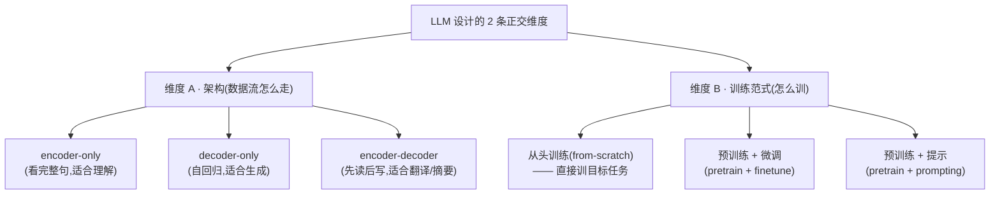

#### 2D 矩阵：每个真实模型在哪个格子

| 架构 \ 训练范式 | 从头训练 | 预训练 + 微调 | 预训练 + 提示 |
|---|---|---|---|
| **encoder-only** | (early BiLSTM-CRF) | **BERT** (2018)、RoBERTa | (少见) |
| **decoder-only** | (early RNN-LM) | **GPT-1** (2018) | **GPT-2** (2019)、**GPT-3** (2020)、LLaMA、Claude... |
| **encoder-decoder** | **原始 Transformer** (2017) | **T5** (2020)、BART (2019) | T5 也能做 zero-shot |

#### 关键纠正（常见误解）

| ❌ 误解 | ✅ 正解 |
|---|---|
| "原始 Transformer 也是预训练的" | 不是,直接训翻译任务,没有预训练阶段 |
| "encoder 是预训练用的" | encoder 是架构概念,不是训练阶段概念 |
| "GPT 是 decoder 所以不预训练" | GPT decoder-only **同样预训练**,只是用 causal LM 目标 |
| "BERT 是 encoder 所以不能生成" | 主因是 BERT 用了 MLM 不是 CLM,跟 encoder 没直接关系 |

> "预训练" 和 "decoder-only" **不在同一层次**,就像 "SUV 还是轿车?" vs "手动挡还是自动挡?" —— 两个独立问题。

---

### 0.2 · 预训练(Pre-training)是什么?

**定义**：在海量通用数据上"先训"一个基础模型,后续低成本迁移到具体任务。

**对比**：

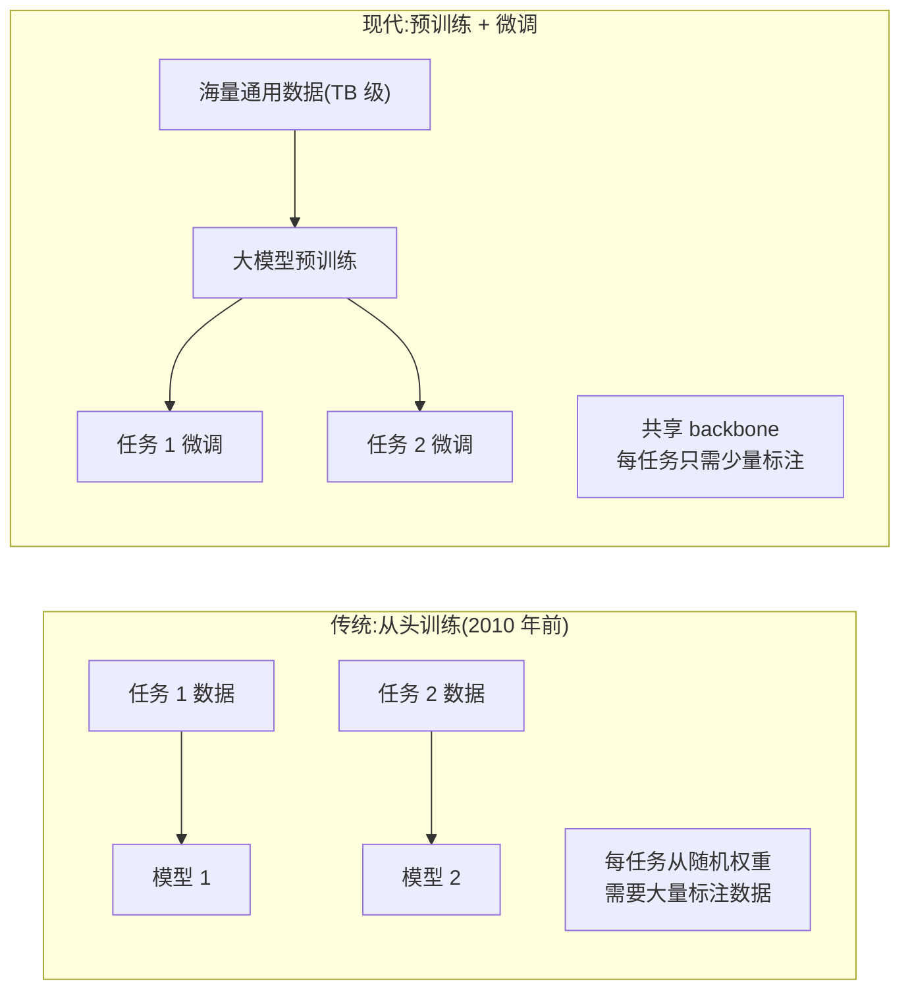

**3 个目的**：① 学通用模式(语法、常识)、② 数据效率高(下游用很少标注就行)、③ 节省算力(训一次用一万次)。

**预训练用什么架构?** 任意架构都可以预训练,**预训练是训练范式概念,不限于 MHA**：

| 模型 | 预训练架构 |
|---|---|
| BERT | Transformer encoder(用 MHA) |
| GPT | Transformer **decoder**(用 Masked MHA) |
| ResNet | CNN(没 MHA) |
| Word2Vec | 浅层神经网(没 MHA) |

---

### 0.3 · 监督 / 无监督 / 自监督

| 类型 | 数据形式 | "label" 哪来? | 典型任务 |
|---|---|---|---|
| **监督**(supervised) | (x, y) 配对 | **人工标注** | 分类、翻译、回归 |
| **无监督**(unsupervised) | 只有 x | **没有 label** | 聚类、PCA |
| **自监督**(self-supervised) | 只有 x,**y 可以自动从 x 衍生** | **从数据自动构造** | GPT pretrain、BERT MLM |

#### GPT 预训练严格说是 self-supervised,但常被宽泛叫"无监督"

```
原文: "今天 天气 真 好"

构造训练对:
  input  = "今天 天气 真"    ← 不需要人工标 "真" 是 label,直接从原文剪
  target = "天气 真 好"      ← 把原文右移一位

→ 没有人工标注,但有 supervisory signal,这叫 self-supervised
→ 因为不需要人工 label,常被叫"无监督预训练"
```

**关键洞察**：互联网上**任何文本都能用作数据**,所以 GPT-3 能用 300B token 训练 —— 这只有 self-supervised 才能做到。

---

### 0.4 · L₁ 公式 + cross_entropy 是同一件事(3 种说法等价)

**GPT-1 论文里的 L₁**：

$$
L_1(U) = \sum_i \log P(u_i \mid u_{i-k}, ..., u_{i-1}; \theta)
$$

读法：**给前面 k 个 token,模型对第 i 个 token 的预测概率取 log,所有位置求和**。

#### 手算一遍

假设原文 `U = "I love NLP"`,词表 `{I:0, love:1, NLP:2, hate:3, math:4}` 共 5 个词。

| 位置 i | 输入 | 真实 u_i | 模型 P(*) | P(真实) | log P |
|---|---|---|---|---|---|
| 0 | (起点) | "I" | [0.5, 0.1, 0.1, 0.2, 0.1] | 0.5 | -0.69 |
| 1 | "I" | "love" | [0.1, 0.6, 0.1, 0.1, 0.1] | 0.6 | -0.51 |
| 2 | "I love" | "NLP" | [0.05, 0.1, 0.7, 0.05, 0.1] | 0.7 | -0.36 |

**L₁ = -0.69 + (-0.51) + (-0.36) = -1.56**(优化目标是把这个数最大化,即趋近 0)

#### MLE → NLL → Cross-Entropy → PyTorch 代码 — 4 种说法等价

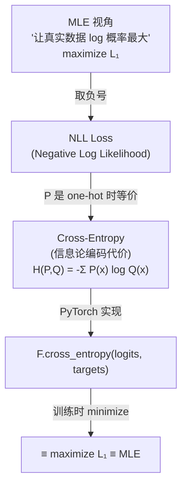

代码里就一行：

```python
# model.py:264
loss = F.cross_entropy(logits.view(-1, logits.size(-1)),  # (B·T, V)
                       targets.view(-1),                    # (B·T,)
                       ignore_index=-1)
```

minimize 这个 loss = maximize L₁ = 让训练数据的 log 概率最大化(MLE)。

**为什么 cross_entropy 等于 NLL?**

当 P 是 one-hot(真实 token 那一位 P=1,其他 0):

$$
H(P, Q) = -\sum_x P(x) \log Q(x) = -1 \cdot \log Q(\text{真实 token}) = -\log Q(\text{真实 token})
$$

所有位置求和:`Total CE = -Σᵢ log P(真实) = -L₁`。一模一样,只是符号反一下。

---

### 0.5 · Ensemble vs Multi-Head Attention(类比但不等价)

**Ensemble**: 多个独立训练的模型组合预测,投票/平均。例:Random Forest、XGBoost。

**Multi-head attention** 跟 ensemble 类似但**不等价**：

| | 真 ensemble | Multi-head attention |
|---|---|---|
| 模型独立? | ✅ 完全独立 | ❌ 共享 backbone,只 attention 头独立 |
| 数据独立? | ✅ 各自数据子集 | ❌ 同一数据 |
| 训练独立? | ✅ 各自训 | ❌ 一起反向传播 |
| **本质** | 多个模型投票 | **结构性多样化的单一模型** |

**Multi-head 的真正价值不是参数多,而是 inductive bias**：强制把 attention 分成 h 个独立子空间 → **结构上**鼓励学多种 attention pattern。

---

### 0.6 · Inductive Bias(归纳偏置)— 现代 LLM 的核心权衡

**定义**：模型在归纳学习时携带的"先验假设" —— 它倾向于学到什么样的模式。

#### 4 种架构的 inductive bias 对比

| 架构 | Inductive bias | 直觉 | 数据需求 |
|---|---|---|---|
| **CNN** | **平移不变 + 局部性** | "图像里物体在哪不重要,且像素跟邻居关系最大" | 中等 |
| **RNN** | **顺序性 + 时间一致** | "时间靠前的影响后面,信息一阶传递" | 中等 |
| **Transformer (raw)** | **几乎没有** — 只 permutation equivariance | "所有位置同等重要,需 PE 才能注入顺序" | **大!** |
| **Multi-head attention** | **多样性多专家** | "用 h 个独立子空间强制学多种模式" | 同 transformer |

#### Bitter Lesson — 现代 LLM 的"反潮流"

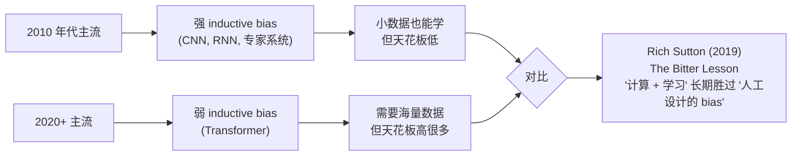

**为什么** Transformer 干掉 LSTM/CNN?**强 bias 在小数据时帮你"作弊",但限制了模型能表达的东西**。数据充足后,弱 bias + 大算力反而能学到更广的模式 —— 这就是为什么 LLM scaling 路线赢了。

> 你 `train_code_learning/01_learning.md` 里碰到的 inductive bias 例子:LaneTransform 沿弧长重采样(车道是几何曲线)、padding+mask(变长 → 定形)、ego-centric 坐标(免去坐标变换)。这些都是用 bias 帮模型"减负"的设计。

---

### 0.7 · 残差连接（Residual Connection）—— 让深网络能训的关键技巧

**来源**：ResNet（He et al. 2015）—— 深度神经网络的革命性发明。

**问题**：深度网络越深越难训(梯度消失/爆炸)。60 层比 30 层准确率反而低。

**解决**：不让网络学完整变换 `H(x)`,而是学**修正量** `f(x) = H(x) - x`(**残差**),然后:

$$
y = x + f(x) = x + \underbrace{(H(x) - x)}_{\text{残差}}
$$

#### 名字怎么来的

`f(x) = H(x) - x` 是"目标输出 - 输入"之间的**差**,数学上叫 **residual**(残留量)。

#### 整个结构

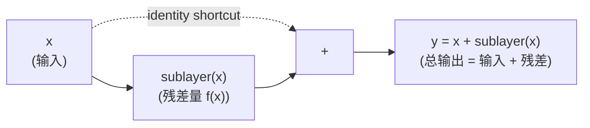

| 部分 | 数学 | 名字 |
|---|---|---|
| `x` | identity 直通 | **shortcut / skip connection** |
| `sublayer(x)` | 修正量 | **residual / 残差部分** |
| `x + sublayer(x)` | 完整输出 | **residual block / 残差块** |

#### 为什么有效 —— 反向梯度

| | 不带残差（plain network） | 带残差（ResNet/Transformer） |
|---|---|---|
| 反向梯度 ∂y/∂x | `f'(x)` —— 多层后可能消失成 0 | `1 + f'(x)` —— **identity 通道保留** |
| 能训多深? | ~10-30 层 | **数百层** |
| 学什么? | 直接学 H(x)（困难） | 学 H(x)-x（修正,容易） |

那个 `1`(identity)是 gradient 的"保险绳" —— 即使 sublayer 部分为 0,梯度也能传回去。

#### 在 Transformer 里的应用

```python
# nanoGPT model.py:Block.forward (实际写法)
def forward(self, x):
    x = x + self.attn(self.ln_1(x))  # ← residual + sublayer
    x = x + self.mlp(self.ln_2(x))   # ← residual + sublayer
    return x
```

每个 `x = x + sublayer(x)` 都是残差结构。pre-norm(LN 放 sublayer 内部)+ residual 是 GPT-2 起 deep transformer 训练稳定的核心技巧。

---

### 0.8 · BPE 全称、算法、训练流程

**BPE = Byte Pair Encoding（字节对编码）**

| 词 | 含义 |
|---|---|
| **Byte** | 操作单位是字节（字符） |
| **Pair** | 每次合并的是**一对**相邻 token |
| **Encoding** | 把文本编码成 token ID 序列 |

#### 算法核心（5 步）

```
1. 词表初始化 = 单字符 (a, b, c, ..., z, 空格, 标点)
2. 统计训练语料里**所有相邻字符对**的频率
3. 合并出现最多的 pair:
   比如 "th" 是最常见的 → 把 't' + 'h' 合成新 token 'th'
4. 更新词表(现在多了 'th'),回到第 2 步
5. 重复 K 次,直到达到目标词表大小(GPT-2: K ≈ 50,000)
```

#### 例子

```
原文:        "playing"
初始拆分:    ['p', 'l', 'a', 'y', 'i', 'n', 'g']      (7 个 token)
经过 BPE:    ['play', 'ing']                          (2 个 token)
GPT-2 编码:  [10617, 278]                              (查 vocab 得 ID)
```

#### BPE 的训练 ≠ 模型训练

**关键**：BPE 是一个**完全独立、预先训练好的 tokenizer**,跟 Transformer 架构无关。


**关键点**:
1. BPE tokenizer 训练**在前**（几小时-1 天）
2. Transformer model 训练**在后**（几天-几周）
3. 两者**完全独立**,**不共享梯度**,**不一起反向传播**
4. 训完之后**绑定使用** —— 用 GPT-2 model 必须用同一个 BPE

#### 各 LLM 的 BPE 来源对照

| 模型 | BPE 怎么来? | vocab_size |
|---|---|---|
| **GPT-2**（2019） | OpenAI 在 WebText 上**自己训** | 50,257 |
| **GPT-3**（2020） | **复用 GPT-2 的 BPE** | 50,257 |
| **Llama 1/2**（2023） | Meta 在自己语料上**重新训** SentencePiece | 32,000 |
| **GPT-4**（2023） | OpenAI 训了新的 cl100k_base BPE | 100,261 |

#### 在 Python 里用 tiktoken

```python
import tiktoken
enc = tiktoken.get_encoding("gpt2")   # ← 加载 OpenAI 预训练好的 BPE
ids = enc.encode("Hello, world!")     # → [15496, 11, 995, 0]
text = enc.decode(ids)                 # → "Hello, world!"
```

**核心理解**:**BPE 像字典,模型像 brain**。字典决定语言的"原子单位",一旦定下来就别动;brain 在字典基础上学怎么组合。两者**完全解耦**。

#### 三种 tokenizer 对比

| 维度 | char-level | **BPE** | word-level |
|---|---|---|---|
| vocab_size | 小（~65） | 中（~50k） | 大（~1M） |
| OOV（未登录词） | 无 | **无**（自适应拆） | **有**（新词标记 [UNK]） |
| 高频词压缩 | ❌ | ✅（`the`=1 token） | ✅ |
| 罕见词怎么办 | 字符拼 | **字符或子词拼** | [UNK] |
| 语义颗粒度 | 字符（无意义） | **子词**（接近词根/词缀） | 词 |
| 实际应用 | 教学、调试 | **真实 LLM 全用** | 早期 NLP |

---

### 0.9 · Fine-tune 完整流程

#### Fine-tune vs Pretrain 对照表

| 元素 | Pretrain | Fine-tune |
|---|---|---|
| **架构** | Transformer decoder | **完全一样!** |
| **初始权重** | 随机（`_init_weights`） | **从 pretrain 加载** |
| **数据** | 海量未标注文本（几 TB） | 任务标注数据（几 GB） |
| **目标函数** | causal LM（`L₁`） | 任务 specific（`L₂`）或 `L₂ + λ·L₁` |
| **学习率** | 高（~6e-4） | **低 10×-100×**（~1e-5） |
| **训练步数** | 几十万 step | 几千-几万 step |
| **可能加新层** | 否 | **可能加 task head**（分类、QA 等） |

#### 5 步流程

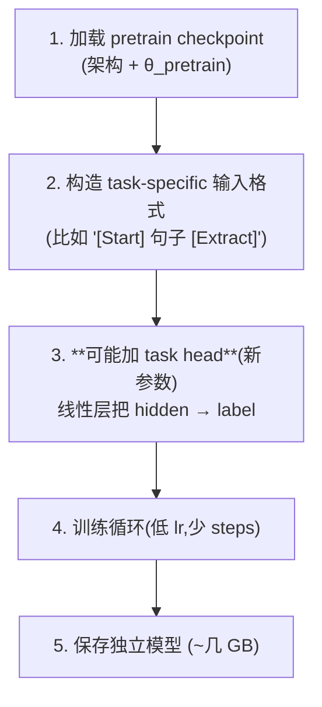

#### 代码示例（用 nanoGPT 做分类任务）

```python
# 1. 加载 pretrain
checkpoint = torch.load('out/ckpt.pt')
model = GPT(GPTConfig(**checkpoint['model_args']))
model.load_state_dict(checkpoint['model'])
# ↑ θ ← θ_pretrain（不是随机！）

# 2. 加 task head
model.classifier = nn.Linear(n_embd, num_classes)

# 3. 低 lr
optimizer = torch.optim.AdamW(model.parameters(), lr=1e-5)   # vs pretrain 的 6e-4

# 4. 训练循环
for batch in task_dataloader:
    x, y = batch
    hidden = model.forward_to_last_hidden(x)
    logits = model.classifier(hidden[:, -1, :])
    loss = F.cross_entropy(logits, y)
    loss.backward()
    optimizer.step()

# 5. 保存
torch.save(model, 'gpt_classifier.pt')
```

#### 为什么少量数据就能影响巨大?

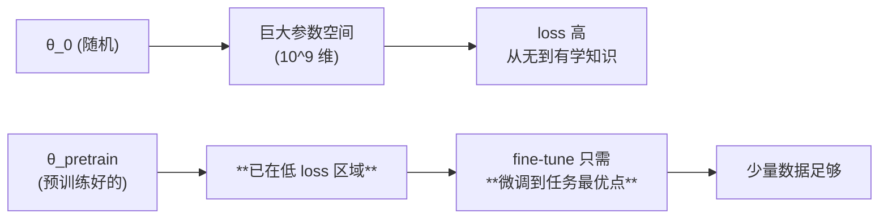

**类比**：精通中餐的厨师学意大利菜 —— 不需要重新学火候/刀工/调味,只需 10 个菜谱;但完全没做过菜的人,10 个菜谱学不会。

#### Catastrophic Forgetting（灾难性遗忘）

Fine-tune 训练步数过多 / lr 过大 → 模型忘记预训练学到的通用能力。

**防止方法**:
1. **小 lr**（fine-tune 用 1e-5,不用 1e-3）
2. **辅助 L₁ loss**（GPT-1 的 `L₃ = L₂ + λ·L₁`,提醒模型不要忘语言）
3. **少 step**（fine-tune 几千 step 而不是几十万）
4. **LoRA / 部分冻结**（直接不动原参数）

#### 现代 fine-tune 的几种 variant（你以后会遇到）

| 方法 | 怎么做 | 优势 |
|---|---|---|
| **Full fine-tune**（传统） | 更新所有参数 | 效果最好 |
| **LoRA** | 每层加低秩矩阵 ΔW = AB,只训 A、B | **省 99% 显存**,只训 1% 参数 |
| **Adapter tuning** | 每层插入小 adapter 模块 | 模块化,可拼装 |
| **Prompt tuning** | 只训 prompt 的 soft embedding | 极省 |

Llama / Claude / GPT 的 "fine-tune API" 大多是 LoRA 实现。

---

### 0.10 · zero-shot / one-shot / few-shot 对比

| 模式 | prompt 例子数 | prompt 长什么样? |
|---|---|---|
| **zero-shot** | **0** | `"Translate to French: cheese →"` |
| **one-shot** | 1 | `"sea otter → loutre de mer; cheese →"` |
| **few-shot**（k=5~100） | k | k 对（英,法） + 新输入 |
| **fine-tune**（对比） | 训练阶段 K_train 万个 | 推理阶段 0 例子,模型已经 task-specific |

#### 难度对比

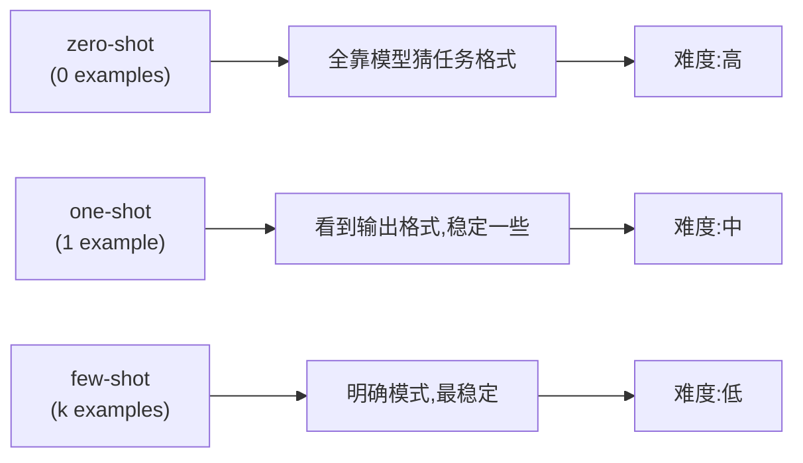

#### GPT-3 实证（Fig 3.1）

| 任务 | zero-shot | one-shot | few-shot (k=64) |
|---|---|---|---|
| Translation | 30% | 50% | 65% |
| Trivia QA | 60% | 70% | 80% |
| Reading comp | 40% | 50% | 65% |

→ **few-shot > one-shot > zero-shot**,但 zero-shot **也能 work**(只是差一点)。

#### GPT-2 vs GPT-3 演变

- **GPT-2**（2019）论文标题："Language Models are **Unsupervised Multitask Learners**" → 论证 zero-shot 也能 work
- **GPT-3**（2020）论文标题："Language Models are **Few-Shot Learners**" → 论证 few-shot >> zero-shot,且大模型差距更明显

---

### 0.11 · Scaling Laws / 涌现 / Bitter Lesson —— LLM 的"哲学三件套"

#### Scaling Laws（规模定律）—— Kaplan et al. 2020

LLM 的 loss 跟参数量 N、数据量 D、算力 C 满足 **power law（幂律）**:

$$
L(N) \approx \left(\frac{N_c}{N}\right)^{\alpha_N}, \quad \alpha_N \approx 0.076
$$

**直觉**:
- 模型大 10×,loss **按可预测的幂律降**
- 在 log-log 坐标系上是一**条直线**

```
log(loss)
   |
   |  ╲
   |   ╲   ← 这条线斜率固定(power law)
   |    ╲
   |_______╲____ log(N)
```

**重要意义**:训 LLM 前能**预测**"再加多少算力能降多少 loss"——"算力换性能"变成可预测工程。这是 OpenAI、Anthropic 敢花上亿美元训 GPT-4 的理论依据。

#### Step Function（阶跃函数）vs Power Law

```
平滑(power law):           阶跃(step):

y                          y
| \                        |     ____
|  \                       |    |
|   \___                   |    |
|       \                  |____|________
|________\__ x                            x
```

| | Power law | Step function |
|---|---|---|
| 形状 | 平滑曲线 | 突然跳变 |
| 可预测? | 是,可外推 | 否,有阈值 |
| 物理意义 | 量变 | **质变** |

#### Emergent Abilities（涌现能力）—— Wei et al. 2022

某些能力在 scale 跨过阈值后**突然出现**,看起来像 step function:

| 模型大小 | 数学题准确率 |
|---|---|
| 1B | 0%（随机） |
| 10B | 2%（还是随机） |
| 50B | 5% |
| **100B** | **50%** ← **突然跳变!** |
| 175B | 60% |

#### Measurement 假象（Schaeffer et al. 2023 "Mirage"）

但是,**涌现可能只是 measurement 二值化造成的假象**!

| 模型大小 | 实际 loss（平滑） | Accuracy（二值） |
|---|---|---|
| 1B | 8.0 | 答对吗? 否（0%） |
| 10B | 5.0 | 答对吗? 否（1%） |
| 100B | 2.0 | 答对吗? **是!（60%）** |

- 用 **loss** 看：模型**一直在平滑改进**（8 → 5 → 2）
- 用 **accuracy** 看：看起来**突然涌现**（0 → 0 → 60%）

**为什么 accuracy 跳变?** 因为有阈值 —— 模型需要 loss < 3.0 才能勉强答对,跨过这条线 accuracy 才从 0% 变 60%。

**Schaeffer 的结论**:"涌现"可能不是模型质变,而是 **离散化测量** 让平滑过程**看起来**像阶跃。

#### Bitter Lesson（痛苦的教训）—— Sutton 2019

**核心论点**:70 年 AI 历史的教训 —— **利用计算力(compute)的方法,长期胜过依赖人类先验知识(handcrafted features / inductive bias)的方法**。

| 时代 | 主流路线（强 bias） | 结局 |
|---|---|---|
| 1950-1980 | 专家系统（人工编程规则） | 输给统计方法 |
| 1980-2010 | 手工特征 + 简单 ML | 输给深度学习 |
| 2010-2017 | CNN/RNN（中等 inductive bias） | 在 NLP 上输给 Transformer |
| **2017-now** | **Transformer + scale** | 干掉一切 |

**为什么叫"痛苦"**?AI 研究员**喜欢**手工设计精巧机制,但**每次** scale 大了,简单方法都赢了 —— 研究员的"创意"输给"砸算力"。

#### 4 个概念怎么连起来

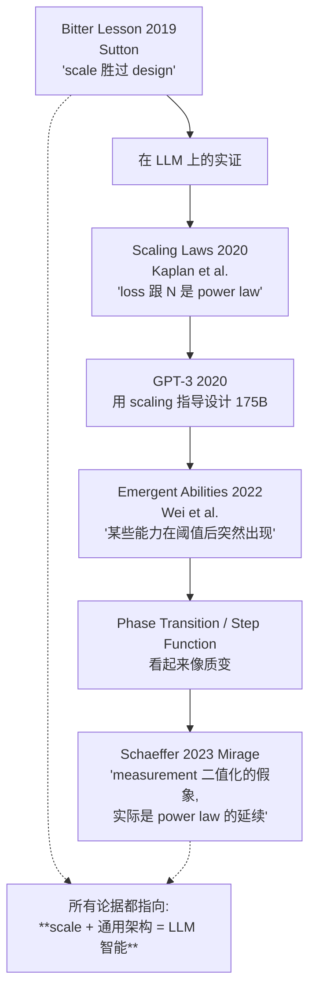

| 概念 | 一句话 |
|---|---|
| **Bitter Lesson** | scale 胜过 handcrafted bias（2019 Sutton 哲学） |
| **Scaling Laws** | loss 跟 N/D/C 是 power law（2020 Kaplan 实证） |
| **Emergent Abilities** | 某些能力在阈值后突然出现（2022 Wei） |
| **Phase Transition** | 描述涌现的术语,源自物理学的"相变" |
| **Step Function** | 突然跳变的函数形状,涌现的视觉表现 |
| **Mirage（海市蜃楼）** | Schaeffer 2023：涌现可能是 measurement 二值化的假象 |

---

## 速读指引：每篇 10-15 分钟（先看这个,再开 PDF）

> 🟢 **2026-06-01 速读 cheat sheet**：4 篇论文加起来 ~50 分钟读完，然后回头答 Q&A。重点是**带着问题读**，不要从头到尾爬。

### 📄 1. Attention is All You Need（Vaswani et al., 2017）— 15 min

**一句话**：抛弃 RNN/CNN，只用 self-attention + position encoding 搭一个 encoder-decoder，做机器翻译。GPT 把它砍掉一半（只留 decoder）。

**只看这几页**：

| 页/章 | 看什么 | 关键提取 |
|---|---|---|
| Abstract + Intro（§1） | 2 min | "purely on attention mechanism, dispensing with recurrence" —— 抛弃 RNN |
| **Fig. 1（架构图）** | 3 min | **左 encoder + 右 decoder**。GPT 只用右半边的下面部分（带 Masked MHA） |
| **§3.2.1 Scaled Dot-Product Attention** | 4 min | 4 个公式: Q·K^T → /√d_k → mask → softmax → ·V |
| §3.2.2 Multi-Head | 2 min | h 个并行的 attention，concat 后投影回 d_model |
| §3.4 Positional Encoding | 2 min | 用 sin/cos 给位置信息（GPT 没用这个，用 learned PE） |
| Table 1 复杂度对比 | 1 min | self-attention O(n²·d) vs RNN O(n·d²) —— 短序列 self-attention 更快 |
| 其他全部 | 0 min | 跳过（BLEU、训练设置、cross-attention） |

**核心公式**（脑子里能默写）：

$$
\text{Attention}(Q, K, V) = \text{softmax}\left(\frac{Q K^T}{\sqrt{d_k}}\right) V
$$

**带着这些问题读**：
- 为什么 `/√d_k`？(提示：d_k 大时 QK^T 方差大，softmax 容易饱和)
- causal mask 在 Fig. 1 哪个 box 里？(decoder 下方的 "Masked Multi-Head Attention")
- multi-head 跟单 head 的参数量差多少？(提示：相同！d_model = h × d_k)

---

### 📄 2. GPT-1：Improving Language Understanding by Generative Pre-Training（Radford et al., 2018）— 10 min

**一句话**：先用大规模未标注文本 **预训练** Transformer decoder（causal LM 目标），再在每个下游任务上 **监督微调**。证明 transfer learning 在 NLP 也行。

**只看这几页**：

| 章节 | 看什么 | 时间 |
|---|---|---|
| Abstract | 整篇 thesis | 1 min |
| **§3.1 Unsupervised pre-training** | causal LM loss: `L₁ = Σ log P(uᵢ \| uᵢ₋ₖ, ..., uᵢ₋₁; θ)` | 3 min |
| §3.2 Supervised fine-tuning | 加一个线性层，微调全部参数 | 2 min |
| §3.3 Task-specific transformations | Fig. 1：4 种任务的输入格式（classification、entailment、similarity、multiple choice） | 2 min |
| §4.2 实验结果 | 表格扫一眼，知道有效就行 | 1 min |
| 其他 | 跳过 | 1 min |

**核心 idea**：


**带着这些问题读**：
- GPT-1 跟 BERT 都用 Transformer，本质区别是什么？(提示：causal vs bidirectional)
- "Generative" pre-training 指的是什么？(提示：用语言建模 = 生成式目标)
- §3.2 里有个辅助 loss `L₂ + λL₁`，λ 是什么？(辅助 LM loss 帮助稳定 finetune)

---

### 📄 3. GPT-2：Language Models are Unsupervised Multitask Learners（Radford et al., 2019）— 12 min

**一句话**：把 GPT-1 scale up 到 1.5B，发现**根本不用 fine-tune**，只要在 prompt 里描述任务，模型就能 zero-shot 做下游任务。

**只看这几页**：

| 章节 | 看什么 | 时间 |
|---|---|---|
| Abstract + Intro（§1） | "language models begin to learn these tasks without any explicit supervision" | 2 min |
| §2 Approach | 核心思想：`P(output \| input, task)` —— 把任务也编码进文本 | 3 min |
| §2.1 Training Dataset | WebText 8M 文档（仅扫一眼） | 1 min |
| **§2.2 Input Representation（BPE）** | 字节级 BPE，vocab 50,257 | 2 min |
| §2.3 Model | 跟 GPT-1 差别（pre-norm、init scaling、深一倍） | 2 min |
| §3.1 LM 性能（Table 3） | 体会"无监督就达到 SOTA" | 1 min |
| 其他 zero-shot 实验 | 扫一眼即可 | 1 min |

**3 个 GPT-2 vs GPT-1 关键差异**：

| 维度 | GPT-1 | **GPT-2** |
|---|---|---|
| 参数量 | 117M | **117M → 1.5B**（4 个 size） |
| LayerNorm 位置 | post-norm | **pre-norm**（移到 sub-block 输入）— 训练更稳 |
| 输出 LN | 无 | **多加一个 final LayerNorm** |
| 初始化 | 标准 | **residual proj 用 0.02/√(2N) 缩放** |
| 范式 | pretrain + finetune | **pretrain only + zero-shot prompting** |
| Tokenizer | BPE | BPE（vocab 扩到 50,257） |

**带着这些问题读**：
- "Zero-shot" 具体是怎么做的？(提示：把任务编码到 prompt 文本里，比如 `"translate English to French: Hello → "`)
- 为什么 pre-norm 比 post-norm 训练更稳？(残差路径上没 LN，梯度直通)
- BPE 跟 char-level / word-level 折中？

---

### 📄 4. GPT-3：Language Models are Few-Shot Learners（Brown et al., 2020）— 15 min

**一句话**：把 GPT-2 scale 100× 到 175B 参数 + 海量数据，发现**少样本提示**(few-shot in-context learning)效果惊人 —— 不需要任何参数更新，几个 demo 就学会新任务。

**只看这几页（论文很长 75 页，必须挑）**：

| 章节 | 看什么 | 时间 |
|---|---|---|
| Abstract | 175B、in-context learning | 1 min |
| **§1 Intro + Fig. 1.1** | scaling hypothesis：参数量↑ → in-context learning 能力↑ | 4 min |
| **§2 Approach Fig. 2.1** | in-context learning 3 种模式：zero-shot / one-shot / **few-shot** 的 prompt 格式对比 | 3 min |
| §2.1 Model（Table 2.1） | 8 个 size：125M ~ 175B；scaling 用了哪些 trick | 2 min |
| §2.2 Training Data | 5 个数据源（Common Crawl、WebText2、Books1/2、Wikipedia），共 300B token | 1 min |
| Fig. 3.1 / Fig. 3.2 | 模型尺寸 vs 各任务性能曲线，强烈推荐看 | 2 min |
| §3-§5 大量 benchmark | 扫一眼，知道 GPT-3 在哪些任务上超越 fine-tuned SOTA | 1 min |
| §6 Limitations | 知道有就行 | 1 min |
| 其他 | 跳过 | 0 min |

**核心概念：in-context learning 的 3 种模式**

| 模式 | Prompt 形式 | 参数更新? |
|---|---|---|
| **zero-shot** | `"Translate to French: cheese →"` | ❌ |
| **one-shot** | `"sea otter → loutre de mer ↵ cheese →"` | ❌ |
| **few-shot**（k=10~100） | 10 个例子 + 新输入 | ❌ |
| Fine-tune（对比） | 训练集大量样本 | ✅ |

> **关键洞察**：few-shot 完全不更新参数，模型靠 attention 在 context 里"学"到任务，**仅靠 forward pass**。这是 LLM 的"涌现能力"(emergent abilities) 之一。

**带着这些问题读**：
- 为什么参数量从 1.5B (GPT-2) 跳到 175B 后 in-context learning 才"涌现"？(提示：scaling laws + Fig. 1.2 的 power law)
- few-shot 跟 fine-tune 在更新参数上有何根本区别？
- 175B 训了多少 token？(300B token —— 按 Chinchilla 反推，是欠训练的 by 13×)

---

## 综合对比表（读完 4 篇后回顾）

| 维度 | Transformer 2017 | GPT-1 2018 | GPT-2 2019 | GPT-3 2020 |
|---|---|---|---|---|
| 架构 | encoder-decoder | **decoder-only** | decoder-only(pre-norm) | decoder-only(同 GPT-2) |
| 参数量 | 65M (base) | 117M | 117M → 1.5B | 125M → **175B** |
| 预训练数据 | WMT (translation) | BookCorpus ~5GB | WebText ~40GB | Common Crawl 300B token |
| 下游适配 | 任务专用训练 | **pretrain + finetune** | **pretrain + zero-shot prompt** | **pretrain + few-shot in-context** |
| LayerNorm | post-norm | post-norm | **pre-norm** + 额外 final LN | 同 GPT-2 |
| Tokenizer | BPE (40k) | BPE (40k) | BPE (50,257) | BPE (50,257) |
| 关键 take-away | "Attention is all you need" | 大模型 + 迁移学习好用 | scale 起来后不需要 finetune | scale 到 175B，few-shot 涌现 |

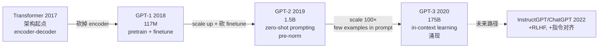

---

## 完成顺序

1. **先读 Transformer + GPT-1**（25 min）—— 这是基础
2. 中场我用苏格拉底问 3-4 道，校准你的理解
3. **再读 GPT-2 + GPT-3**（27 min）—— scaling 故事
4. 最后我用苏格拉底问 4-5 道
5. 回填整篇 `01_papers.md`

**告诉我你读完了 Transformer + GPT-1，我们就开始第一轮苏格拉底。**

---

## 一、Transformer：搞清楚 decoder-only 视角

> 🟢 **2026-06-02 苏格拉底 Round 1 实战回填**

### Q1.1：原始 Transformer 是 encoder-decoder，GPT 为什么是 decoder-only？去掉 encoder 影响了什么？

**答**：原始 Transformer 是 encoder-decoder,专做翻译(英 → 中):**encoder 读源语言,decoder 自回归生成目标语言**,中间靠 cross-attention 桥接。**GPT 砍掉整个 encoder + decoder 里的 cross-attention,只保留 Masked Self-Attention + FFN**,因为生成任务不需要"先读后写"。

**详解**：

#### 原始 Transformer 在做什么 —— 翻译


**关键**：原始 Transformer **不是预训练的**!它是**直接训练**做翻译,从头到尾在 WMT 数据上跑。

#### Decoder 里的 3 层 sub-block(原始版) vs GPT 版(2 层)

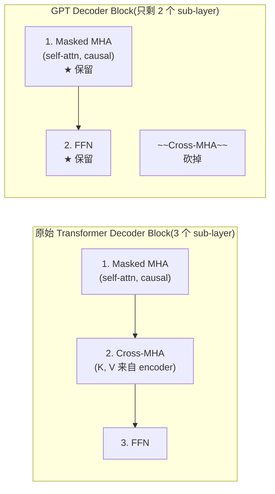

**GPT 删掉的是**：
1. **整个 encoder**(因为单向生成不需要"先读"源序列)
2. **decoder 中的 cross-attention**(因为没有 encoder 输出可看)

**保留的是**：**Masked MHA + FFN + LayerNorm + Residual**。

#### 对应 nanoGPT 代码

你跑的 `model.py:Block` 类就是 GPT 版 decoder block:

```python
class Block(nn.Module):
    def __init__(self, config):
        ...
        self.ln_1 = LayerNorm(config.n_embd, bias=config.bias)
        self.attn = CausalSelfAttention(config)  # ← Masked MHA
        self.ln_2 = LayerNorm(config.n_embd, bias=config.bias)
        self.mlp = MLP(config)  # ← FFN
```

只有 self-attention + MLP,没有 cross-attention。

---

### Q1.2：Scaled Dot-Product Attention 中 `/√d_k` 是干什么的？不除会怎样？

**答**：当 Q、K 是均值 0、方差 1 的独立分布,点积 `q·k` 有 d_k 项相加,**方差 = d_k**。d_k 大时 `QK^T` 数值大,softmax 容易**饱和成 one-hot**,梯度消失训不动。除以 `√d_k` 让方差归一化到 1,softmax 不会塌缩。

**详解**：

#### 数学推导

Q 的每一维 ~ N(0, 1),K 的每一维 ~ N(0, 1),独立:

$$
q \cdot k = \sum_{i=1}^{d_k} q_i k_i
$$

每项 `q_i · k_i` 方差 = 1,总方差 = `Σ Var = d_k`,标准差 = `√d_k`。

除以 `√d_k`:

$$
\text{Var}\left(\frac{q \cdot k}{\sqrt{d_k}}\right) = \frac{d_k}{d_k} = 1 \quad ✓
$$

#### softmax 饱和现象

如果不除,`d_k=64` 时点积值可能在 ±8 范围:`softmax([8, 0, 0, ..., 0]) ≈ [1, 0, 0, ..., 0]`(几乎完全 one-hot)。

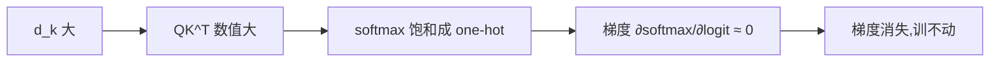

> 这是初始化时的状态。训练后 Q, K 不一定是标准正态,但 `/√d_k` 仍然是经验有效的归一化技巧。

---

### Q1.3：Multi-Head Attention 为什么比单头好？参数量有变化吗？

**答**：**参数量完全不变**!因为 `d_k = d_model / h`,h 个头的 W_Q/W_K/W_V 合起来 = single-head 的同样大小。Multi-head 的**真正价值不是参数变多,而是 inductive bias**:强制把 attention 分成 h 个独立子空间,**结构上**鼓励学多种 attention pattern。

**详解**：

#### 参数量精确算

| | W_Q, W_K, W_V 总参数 |
|---|---|
| **single-head**(d_model 直通) | 3 × d_model × d_model = 3·d_model² |
| **multi-head**(h 个 d_k=d_model/h 的头) | h × 3 × d_model × d_k = 3·d_model² ✓ |

加上 W_O(d_model × d_model)输出投影后,两者都是 **4·d_model² 参数**,完全一致。

#### "学不同维度信息" 不够准确

更精确的说法是 **inductive bias**:

| | single-head | multi-head |
|---|---|---|
| 数学能力 | 理论上能学任何 attention pattern | 同样能学,但被结构"强制分流" |
| 优化难度 | 优化器要在 d_model² 维空间里"找"对应模式 | 优化器在 h 个 d_k² 子空间各自找,**多样性几乎被结构强制保证** |
| 类比 | 一个员工干 8 种活 | 8 个员工各干 1 种活 |

**实验观察**:训练完的 multi-head model,各 head 学到的 attention pattern **真的不一样** —— 有的看语法依赖、有的看共指、有的看位置邻近。

> Multi-head ≈ "**用结构鼓励多样性**" 的工程 trick,跟 ensemble 类似但不等价(见基础概念 §0.5)。

---

### Q1.4：causal mask 在哪一步生效？为什么训练时可以一次喂完整序列、推理时却要逐 token？

**答**：**Mask 在 softmax 前作用于 attention scores 矩阵**:把"未来位置"对应的 `q·k` 设成 `-inf`,softmax 后变成 0,query 看不到未来 token。**训练**时一次喂完整序列,causal mask 让每个位置**只能看到自己及之前**,等价于"一次性算 256 个监督信号";**推理**时只能逐 token,因为下一个 token 还没生成,必须自回归。

**详解**：

#### Mask 在 attention 三步里的位置

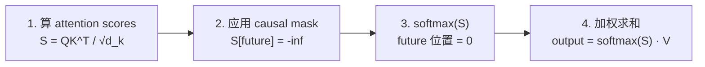

#### Causal mask 形状(三角矩阵)

对于序列长度 T=4:

```
mask:                attention 可见性:
[[0, -∞, -∞, -∞]      ┌─                ─┐
 [0, 0,  -∞, -∞]      │ 0: 只能看自己   │
 [0, 0,  0,  -∞]      │ 1: 看 0, 1     │
 [0, 0,  0,  0 ]]     │ 2: 看 0, 1, 2  │
                       │ 3: 看 0, 1, 2, 3│
                       └─                ─┘
```

#### 训练 vs 推理为何不同

| 阶段 | 输入 | 输出怎么用 | 为什么这样? |
|---|---|---|---|
| **训练** | 一次喂完整 256 token 序列 | 256 个位置**同时**算 loss(每个位置预测下一个) | 已有 ground truth,causal mask 保证每位置只看过去,无作弊 |
| **推理** | 逐 token 生成 | 只用最后一个位置的 logits 采样下一个 | 还没生成的 token **不存在**,必须 autoregressive |

#### Causal mask 在 nanoGPT 代码里

```python
# CausalSelfAttention.forward (model.py)
if self.flash:
    # Flash Attention 路径,内部自动应用 causal mask
    y = F.scaled_dot_product_attention(q, k, v, ..., is_causal=True)
else:
    # 手写路径
    att = (q @ k.transpose(-2, -1)) * (1.0 / math.sqrt(k.size(-1)))
    att = att.masked_fill(self.bias[:,:,:T,:T] == 0, float('-inf'))  # ← mask 在这
    att = F.softmax(att, dim=-1)
```

`self.bias` 是 register_buffer 注册的下三角矩阵,在 `__init__` 里用 `torch.tril(torch.ones(...))` 创建。

---

## 二、GPT-1：pretrain + finetune 范式

> 🟢 **2026-06-02 苏格拉底 Round 1 实战回填**

### Q2.1：GPT-1 的预训练目标是什么？为什么是"生成式"？

**答**：预训练任务叫 **Causal Language Modeling(CLM,自回归语言建模)**,目标函数是:

$$
L_1(U) = \sum_i \log P(u_i \mid u_{i-k}, ..., u_{i-1}; \theta)
$$

读法：**给前面 k 个 token,预测第 i 个 token,所有位置的 log 概率求和**(MLE)。"生成式"指**单向自回归**:模型生成新 token,而不是填空(MLM)/分类(supervised classification)。

**详解**：

#### CLM(GPT)vs MLM(BERT)对比

| 维度 | GPT / CLM(单向) | BERT / MLM(双向) |
|---|---|---|
| 训练任务 | 给左侧预测下一个 token | 把 15% token 随机 mask,用双向 context 预测 |
| Mask | causal mask(三角阵) | bidirectional mask(15% 随机) |
| 训练效率 | **每个位置都贡献 loss** | 只有 15% 位置贡献 loss |
| 推理 | 天然支持自回归**生成** | 不能直接生成,只能填空 |
| 适合下游 | **生成**(对话、补全、翻译) | **理解**(分类、QA、相似度) |

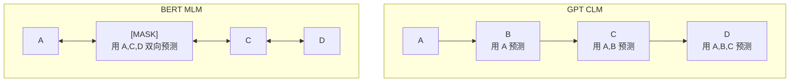

#### 为什么 GPT 选 CLM 而非 MLM

- 目标是**生成文本**,自回归是最自然的方式
- 训练-推理一致性:训练怎么预测,推理怎么生成,无 distribution shift
- 任意长度文本都能训练(每个 token 都是 supervisory signal),**数据效率比 MLM 高 6.5×**

#### "生成式"的两层含义

1. **训练时**:目标是"用前文生成下一个 token",所以训练目标本身就是生成
2. **推理时**:模型可以从 prompt 开始自回归地连续生成文本

这跟 BERT(只能填空,不能连续生成新内容)形成对比。

> 详细 MLE → cross_entropy 推导见基础概念 §0.4。

---

### Q2.2：下游任务怎么"接"GPT-1？输入格式是怎么改造的？

**答**：GPT-1 用 **pretrain + finetune** 两阶段范式。Finetune 时:
1. **保留预训练模型 backbone**,加一个**线性分类头**
2. **针对每种任务设计输入格式**(把任务结构编码进文本)
3. 用 `L₃ = L₂ + λ·L₁` 训(下游任务 loss + 辅助 LM loss)

**详解**：

#### Pretrain → Finetune 流程


#### 4 种任务的输入改造(GPT-1 Fig. 1)

| 任务 | 原始格式 | GPT-1 输入格式 |
|---|---|---|
| **Classification** | `(text, label)` | `[Start] text [Extract]` → 线性层 → label |
| **Entailment**(蕴含) | `(premise, hypothesis, label)` | `[Start] premise [Delim] hypothesis [Extract]` → 线性层 → entail/contradict/neutral |
| **Similarity** | `(s1, s2, label)` | 两次过模型(`s1 [Delim] s2` 和 `s2 [Delim] s1`),concat 后线性层 |
| **Multiple Choice** | `(context, question, [answers], label)` | 每个 answer 单独过模型,取 [Extract] 位的 logit,softmax 选最大 |

**关键设计**:用特殊 token(`[Start]`、`[Delim]`、`[Extract]`)把任务结构编码进文本,**模型架构不变**,只在最后加任务相关的小线性层。

#### 3 个 Loss 的关系

| 符号 | 名字 | 公式 | 用在哪 |
|---|---|---|---|
| **L₁** | unsupervised pre-training loss | `Σ log P(uᵢ \| uᵢ₋ₖ, ..., uᵢ₋₁)` | **预训练阶段** |
| **L₂** | supervised fine-tuning loss | `Σ log P(y \| x¹, ..., xᵐ)` | **微调阶段** —— 预测 label |
| **L₃** | combined loss | `L₂ + λ · L₁` | 微调时用 L₃,**额外加 λ·L₁** 作为辅助 LM loss |

#### 辅助 L₁ 的 3 个作用(论文 §3.2)

- 加速 finetune 收敛
- 提升泛化
- 防止微调时模型"忘了"预训练学到的语言模式(灾难性遗忘)

#### Q2.2.1(实战补充):nanoGPT 在做哪个?

**只做 L₁**,不做 L₂/L₃。nanoGPT 是 pretrain-only 框架。

代码对照(`model.py:264`):

```python
loss = F.cross_entropy(logits.view(-1, logits.size(-1)),  # logits = P(token | context)
                       targets.view(-1),                    # targets = next token
                       ignore_index=-1)
```

`F.cross_entropy(logits, targets)` 在数学上**就是** `-Σ log P(targets | logits)` = `-L₁`(见 §0.4 推导)。所以 **minimize cross_entropy = maximize L₁** = GPT-1 论文的预训练目标。

`targets` 怎么构造?看 `train.py:get_batch` L120-124:

```python
x = torch.stack([torch.from_numpy(data[i:i+block_size])     for i in ix])  # (B, T)
y = torch.stack([torch.from_numpy(data[i+1:i+1+block_size]) for i in ix])  # (B, T) = x 右移 1 位
```

| 位置 i | x(input) | y(target) |
|---|---|---|
| 0 | u₀ | **u₁** |
| 1 | u₁ | **u₂** |
| ... | ... | ... |
| 255 | u₂₅₅ | **u₂₅₆** |

**y = x 右移 1 位**,每个位置 i 的 logits 预测 y[i] = x[i+1] —— **完全就是 "给前面预测下一个"** —— 就是 GPT-1 的 L₁。

---

## 三、GPT-2：砍掉 finetune

> 🟢 **2026-06-02 苏格拉底 Round 2 实战回填**

### Q3.1：GPT-2 为什么砍掉 fine-tuning？它的 zero-shot 是怎么"做下游任务"的？

**答**：GPT-2 论证"**预训练好的语言模型已经隐式学到了各种任务模式**",所以**不需要 fine-tune**,只要把任务编码进 prompt 文本里,模型会**当成 causal LM 续写任务**自动输出答案。本质上 zero-shot **不是真的在"学"任务**,而是激活预训练阶段已经学到的对应模式。

**详解**：

#### 核心机制：把任务转成"续写任务"

GPT-2 是 **Causal Language Model**,训练时唯一任务就是**预测下一个 token**。zero-shot 利用这一点:

```python
prompt = "Translate to French: cheese →"
output = model.generate(prompt)
# 模型续写:"fromage"
```

模型为什么能"懂"翻译? —— **它在预训练时见过几亿份互联网文本**,里面**已经有海量类似的"任务描述 → 答案"模式**:

```
GPT-2 预训练时见过的真实文本片段:
  ─ "Translate to French: hello → bonjour, cheese → fromage..."
  ─ "Q: What's 2+3? A: 5"
  ─ "Tweet: I love this! Sentiment: positive"
  ─ "def fibonacci(n): if n<2: return n; return fib(n-1)+fib(n-2)"
```

→ 你给的 prompt **不是新模式**,GPT-2 是在做**模式补全**,不是"理解任务"。

#### 这种 zero-shot 的本质

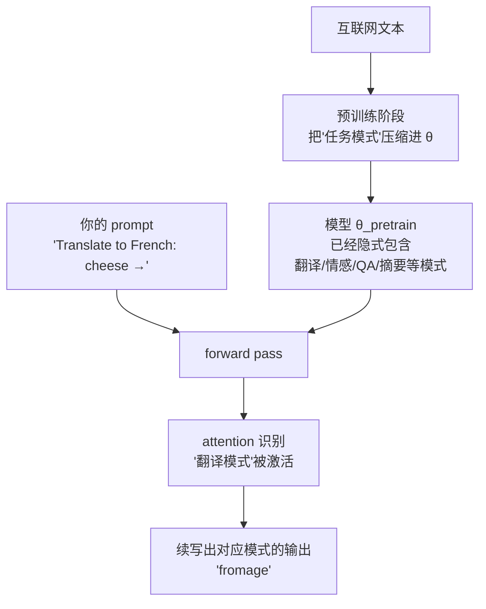

#### 跟 GPT-1 范式的对比

| | GPT-1（pretrain+finetune） | **GPT-2**（pretrain only + zero-shot） |
|---|---|---|
| 下游需要数据? | ✅ 标注数据 | ❌ **0 数据** |
| 下游需要 GPU 训? | ✅ 几小时-几天 | ❌ **直接推理** |
| 多任务怎么办? | 每任务一个模型 | **同一个模型,改 prompt 即可** |
| 模型 vs 数据 trade-off | 更小模型 + 更多任务数据 | **更大模型 + 海量预训练数据** |

#### 论文标题就是论证

GPT-2 论文标题:**"Language Models are Unsupervised Multitask Learners"** —— 即**语言模型本身就是无监督的多任务学习器**,只要 scale 够大,任务能力会从大量文本里"涌现"出来。

> 详细 zero-shot / few-shot 对比见基础概念 §0.10。

---

### Q3.2：GPT-2 跟 GPT-1 在架构上有哪些差别？（提示：层数、PE、LayerNorm 位置）

**答**：5 个关键改动:**pre-norm**(LN 从 sub-block 输出移到输入)、**额外的 final LayerNorm**、**residual 初始化 scaling**(用 0.02/√N)、**vocab 扩到 50,257**、**模型尺寸扩 12×**(117M → 1.5B)。其中**最重要的是 pre-norm**,它让深 transformer 训练更稳。

**详解**:

#### 5 处架构改动对照

| 维度 | GPT-1 | **GPT-2** |
|---|---|---|
| 参数量 | 117M | **117M → 1.5B**（4 个 size） |
| **LayerNorm 位置** | **post-norm** | **pre-norm**（移到 sub-block 输入） |
| 输出 LN | 无 | **多加一个 final LayerNorm** |
| 残差 proj 初始化 | 标准 | **0.02 / √(2·n_layer) 缩放** |
| vocab_size | ~40,000 | **50,257**（扩 BPE 词表） |
| 范式 | pretrain + finetune | **pretrain only + zero-shot prompt** |
| 训练数据 | BookCorpus ~5GB | WebText ~40GB（8× 大） |

#### pre-norm vs post-norm 的画图

```mermaid
flowchart TB
    subgraph POST["Post-norm（原始 Transformer / GPT-1）"]
        P1["x"] --> P2["+ sublayer(x)"]
        P2 --> P3["LN"]
        P3 --> P4["x_out"]
        P1 -.residual.-> P2
        Note1["residual 通路上<br/>经过 LN"]
    end
    subgraph PRE["Pre-norm（GPT-2 起）"]
        Q1["x"] --> Q2["LN"]
        Q2 --> Q3["sublayer"]
        Q3 --> Q4["+ x"]
        Q4 --> Q5["x_out"]
        Q1 -.residual.-> Q4
        Note2["residual 通路裸 x<br/>无 LN 拦截"]
    end
```

**数学表达**:

| Norm 位置 | 公式 |
|---|---|
| **Post-norm** | `x_out = LN(x + sublayer(x))` |
| **Pre-norm** | `x_out = x + sublayer(LN(x))` |

#### 为什么 pre-norm 训练更稳

反向梯度路径:

| | post-norm | pre-norm |
|---|---|---|
| 通过 N 层后梯度 | 每层都被 LN 缩放 → 累积 N 次 → 极不稳定 | residual 通路是 identity → **梯度几乎无损直通** |
| 训练深度上限 | ~12 层（更深需小心初始化） | **数百层无压力** |
| 是否需要 warmup? | 强依赖 | 弱依赖 |
| 数学保证 | 残差路径上有非线性变换 | **`∂y/∂x = I + ...`**,identity 通道保留 |

`I`（单位矩阵）就是 **identity shortcut**,保证梯度即使 sublayer 部分为 0,也至少有 `I` 这一项,gradient 不会消失。

#### 详细数学
对 pre-norm:

$$
\frac{\partial x_{out}}{\partial x} = I + \frac{\partial \text{sublayer}(\text{LN}(x))}{\partial x}
$$

那个 `I` 就是 identity 直通,**保证梯度有"保险绳"**。

> 关于 residual 的更深理解见基础概念 §0.7。

#### 在 nanoGPT 代码里

```python
# model.py:Block.forward (pre-norm 版)
def forward(self, x):
    x = x + self.attn(self.ln_1(x))  # ← LN 在 attn 之前(pre-norm)
    x = x + self.mlp(self.ln_2(x))   # ← LN 在 mlp 之前(pre-norm)
    return x
```

#### 残差 proj 初始化的 scaling

GPT-2 的 `_init_weights`(nanoGPT 复刻):
- 普通 Linear: `std=0.02`
- **residual proj**: `std=0.02 / √(2·n_layer)`(再缩 √(2L) 倍)

为什么? 防止 N 层 residual 加和后方差爆炸:`Var(N 个独立残差和)= N·Var(单个)`,所以单个 std 要除以 √N 抵消。

---

### Q3.3：BPE tokenization 跟 char-level、word-level 各自的折中是什么？

**答**:char-level 颗粒太细(token 多,context 短)、word-level 颗粒太粗(OOV 问题)。BPE 是**自适应中间方案**:**高频词压成 1 token,罕见词拆成子词**,既高效又永不 OOV。同样 1MB 莎士比亚文本,char-level 给 100 万 token,**BPE 只给 25 万 token(少 4 倍)**,意味着**同样 block_size 能看更远 context**。

**详解**：

#### 三种 tokenizer 全面对比

| 维度 | char-level | **BPE** | word-level |
|---|---|---|---|
| vocab_size | 小（~65） | 中（~50k） | 大（~1M） |
| OOV（未登录词） | 无 | **无**（自适应拆） | **有**（[UNK]） |
| 高频词压缩 | ❌ | ✅（`the`=1 token） | ✅ |
| 罕见词怎么办 | 字符拼 | **字符或子词拼** | [UNK] |
| 语义颗粒度 | 字符（无意义） | **子词**（接近词根/词缀） | 词 |
| 适合 | 教学、调试 | **真实部署** | 早期 NLP |

#### BPE 训练流程(独立于模型)

详见 §0.8。简言之:

```
1. 词表初始化 = 单字符
2. 数所有相邻字符对的频率
3. 合并最频繁的 pair
4. 重复 K 次直到 vocab_size 达到目标
```

**关键**:BPE 跟 Transformer 完全解耦,先训完 BPE 再用它 tokenize 数据再训 model。

#### 同一段 1MB 莎士比亚的 token 数

| Tokenizer | token 数 | 比例 |
|---|---|---|
| char-level | 1,003,854 | 1× |
| **BPE（gpt2）** | **~250,000** | **0.25×（少 4 倍）** |

为什么? **1 BPE token ≈ 4 chars 平均**(英语)。BPE 学会把 "the"、"ing"、"tion" 这种高频子串合并成 1 token。

#### 对 effective context length 的影响

`block_size = 256` 时:

| 模型 | tokens 数 | 等价 chars | 比喻 |
|---|---|---|---|
| char-level | 256 token = 256 char | 256 char | **"近视"** —— 只看到 ~半句话 |
| **BPE** | 256 token ≈ **1024 char** | **1024 char** | **"远视"** —— 能看到 ~一整段 |

**对长距离依赖的影响**:

```mermaid
flowchart LR
    A["BPE: block_size=256 token<br/>= 1024 char 上下文"] --> B["能 attend 到更远<br/>长距离依赖"]
    B --> C["语义连贯性更好<br/>例:段首 'I' 跟段尾 'me' 能 attend 上"]
    
    D["Char: block_size=256 token<br/>= 256 char 上下文"] --> E["只看到半句话<br/>跨句子 attention 难"]
    E --> F["容易生成局部正确<br/>但全局散漫的文本"]
```

#### 为什么真实 LLM 全用 BPE

| 维度 | char-level | **BPE** |
|---|---|---|
| 同 block_size 的 context 长度 | 短 | **长 4×** |
| 同 FLOPs 训练的有效 token 数 | 1× | **4×** —— 更高效 |
| 同 GPU 内存下能训的"语义内容" | 少 | **多** |
| 适合 | 教学、调试 | **真实部署**（GPT-2/3/4, LLaMA, Claude） |

> BPE 的全称、算法、训练流程详见基础概念 §0.8。

---

## 四、GPT-3：in-context learning

> 🟢 **2026-06-02 苏格拉底 Round 2 实战回填**

### Q4.1：in-context learning 跟 fine-tuning 在更新参数上有何根本区别？

**答**：**fine-tuning 在训练阶段用 gradient descent 更新参数(θ_pretrain → θ_task);in-context learning 完全在推理阶段,θ 一动不动,纯靠 attention 在 prompt 里"识别"已经在预训练阶段学到的任务模式**。本质上 in-context "learning" 不是真的在学习,而是**激活预训练时压进 θ 的模式**。

**详解**：

#### LLM 生命周期上的时间轴

```mermaid
flowchart TB
    A["Phase 1: PRETRAIN(预训练)"] --> A1["几天 ~ 几周训练<br/>几百-几千 GPU<br/>更新参数 θ_0 → θ_pretrain<br/>用海量未标注文本(causal LM)"]

    A1 --> B{"针对下游任务怎么做?"}

    B -->|"传统路线"| C["Phase 2A: FINE-TUNE"]
    C --> C1["几小时 ~ 几天训练<br/>1-N 个 GPU<br/>**更新参数 θ_pretrain → θ_task**<br/>用标注数据 + gradient descent"]
    C1 --> C2["Phase 3A: 推理<br/>用 θ_task 模型<br/>每个任务**有自己的模型**"]

    B -->|"GPT-3 路线"| D["Phase 2B: FEW-SHOT"]
    D --> D1["⚡ 直接进入推理阶段"]
    D --> D2["**没有训练步骤**<br/>**不更新参数 θ**<br/>**没 gradient,没 backprop**"]
    D --> D3["Phase 3B: 推理<br/>用同一个 θ_pretrain<br/>**所有任务共用一个模型**<br/>只是 prompt 不同"]
```

#### 完整对照表

| 维度 | Fine-tune | Few-shot（in-context） |
|---|---|---|
| **发生阶段** | 训练阶段（单独一段） | **推理阶段**（一次 forward） |
| **算力开销** | GPU 集群 × 数小时-数天 | **1 次 forward pass** |
| **参数变化** | θ_pretrain → θ_task（更新） | **完全冻结,θ 不动** |
| **数据需求** | 标注数据集（~10K-1M 样本） | **3-5 个 prompt 内的例子** |
| **梯度** | 有,backprop 更新参数 | **完全没有** |
| **每任务一个模型?** | ✅ 是,任务多了存储压力大 | ❌ **共享同一个模型** |
| **何时确立?** | 训练完才能用 | **prompt 一构造就能用** |

#### 具体场景：英 → 法翻译

**Fine-tune 流程**（GPT-1 路线,~1 天）:

```
1. 收集数据集（英,法）对,~100K 行
2. 格式化:"English: {eng} French: {fra}"
3. 训练循环(GPU,~6 小时):
   for batch in dataset:
       loss = cross_entropy(...)
       loss.backward()      # 算梯度
       optimizer.step()      # **更新 θ_pretrain → θ_translate**
4. 保存:torch.save(model, 'gpt_translator.pt')  # 多出一个模型
5. 推理:model_translator(english) → 法语
```

**Few-shot 流程**（GPT-3 路线,~1 秒）:

```
1. 不训练,不准备数据集
2. 构造 prompt（推理时直接写）:
   English: hello
   French: bonjour
   English: thank you
   French: merci
   English: cheese
   French:        ← 模型从这里开始 generate
3. forward pass:
   y = model.generate(prompt)
   # **无任何参数更新**
4. 输出:"fromage"
5. 同一个模型还能做:
   - 改 prompt 为"Sentiment of '...':" → 情感分析
   - 改 prompt 为"def fibonacci(n):" → 代码补全
   - **完全不用重训**
```

#### Q4.1 的"震撼点"

GPT-3 的革命性在于:**zero/few-shot 这种"看几个例子就会"的能力,完全在 forward pass 里通过 attention 实现,不动一个参数**。

```mermaid
flowchart LR
    A["大模型的 θ 已经压缩了<br/>互联网上几乎所有任务模式"] --> B["你给的 prompt<br/>例子 + 新输入"]
    B --> C["attention 在 prompt 里<br/>'识别' 你要的任务模式"]
    C --> D["forward pass 输出<br/>那个模式对应的答案"]
```

> 详细对比 zero/one/few-shot 见 §0.10;Fine-tune 流程细节见 §0.9。

---

### Q4.2：few-shot / one-shot / zero-shot 怎么用同一个模型实现？prompt 长什么样？

**答**：**同一个模型,只改 prompt 里给的例子数量**:zero-shot 给 0 个,one-shot 给 1 个,few-shot 给 k 个。模型本身不动,attention 在 prompt 里"识别"任务模式,生成对应输出。这种灵活性是 GPT-3 的核心卖点 —— **一个模型搞定一万种任务**。

**详解**：

#### 三种模式的 prompt 示例（翻译任务)

**zero-shot**（0 个例子）:
```
Translate English to French.
English: cheese →
```
模型直接续写:`fromage`

**one-shot**（1 个例子）:
```
Translate English to French.
English: sea otter → French: loutre de mer
English: cheese →
```
模型续写:`fromage`(看到一个例子,输出格式更稳)

**few-shot**（k=5 例子）:
```
Translate English to French.
English: sea otter → French: loutre de mer
English: peppermint → French: menthe poivrée
English: plush giraffe → French: girafe en peluche
English: hello → French: bonjour
English: thank you → French: merci
English: cheese →
```
模型续写:`fromage`(看到 5 个例子,模式完全确定)

#### GPT-3 论文 Fig 2.1 的关键洞察

```mermaid
flowchart LR
    A["zero-shot"] -->|"+1 example"| B["one-shot"]
    B -->|"+k examples"| C["few-shot (k=5~100)"]
    
    A1["难度:高<br/>全靠模型猜任务"] -.-> A
    B1["难度:中<br/>知道输出格式"] -.-> B
    C1["难度:低<br/>模式完全确定"] -.-> C
```

#### GPT-3 实证（Fig 3.1）

| 任务 | zero-shot | one-shot | few-shot (k=64) |
|---|---|---|---|
| Translation En→Fr | 30% | 50% | 65% |
| Trivia QA | 60% | 70% | 80% |
| Reading comp | 40% | 50% | 65% |

→ **few-shot > one-shot > zero-shot**,但 zero-shot 也能 work。

#### "看一眼例子就会" 的本质

```mermaid
flowchart TB
    A["预训练阶段<br/>(单次)"] --> A1["把'看到 demo 跟新输入<br/>模式识别' 这件事<br/>本身就 baked in θ"]
    A1 --> B["推理阶段<br/>(每次任务)"]
    B --> C["prompt 里几个例子<br/>触发 attention"]
    C --> D["attention 识别模式<br/>'哦,这是翻译,这种输出格式'"]
    D --> E["续写匹配的答案"]
```

#### GPT-2 vs GPT-3 演变

- **GPT-2**（2019）:论证 **zero-shot 也能 work**(论文标题:"Unsupervised Multitask Learners")
- **GPT-3**（2020）:论证 **few-shot >> zero-shot**,且**大模型差距更明显**(论文标题:"Few-Shot Learners")
- 后续 GPT-3.5/4/Claude 进一步:**长 context + chain-of-thought** prompt engineering 把 few-shot 推到极致

> Zero/one/few-shot 完整对比 + 数据,详见 §0.10。

---

### Q4.3：GPT-3 提到 scaling laws，模型从 125M 到 175B，loss 变化的趋势是？

**答**：loss 按 **power law(幂律)** 随参数量下降 —— 模型大 10×,loss 按可预测比例降(`L ∝ N^-α, α≈0.076`)。但一些下游能力(如 in-context learning)不是平滑下降,而是**在 100B+ 模型上突然涌现(emergent abilities)**,看起来像 step function。这种涌现现象既是 GPT-3 175B 选择尺寸的依据,也是 Bitter Lesson 的最强论据。

**详解**：

#### Scaling Laws (Kaplan et al. 2020)

LLM 的 loss 跟参数量 N 满足 power law:

$$
L(N) \approx \left(\frac{N_c}{N}\right)^{\alpha_N}, \quad \alpha_N \approx 0.076
$$

在 log-log 坐标系上是**一条直线**:

```
log(loss)
   |
   |  ╲
   |   ╲   ← 斜率固定(power law)
   |    ╲
   |_______╲____ log(N)
```

GPT-3 论文 Fig 1.2 / 1.3 / 3.1 / 3.2 大量展示这种 power law 关系。

#### GPT-3 8 个 size 的 loss 趋势

| 模型大小 | 参数 N | 训练时 loss(假设) | 趋势 |
|---|---|---|---|
| Small | 125M | ~3.4 | basline |
| Medium | 350M | ~3.0 | 降 12% |
| Large | 760M | ~2.7 | 降 23% |
| XL | 1.3B | ~2.5 | 降 27% |
| 2.7B | 2.7B | ~2.3 | 降 32% |
| 6.7B | 6.7B | ~2.1 | 降 38% |
| 13B | 13B | ~1.95 | 降 42% |
| 175B | 175B | ~1.7 | **降 50%** |

→ 这种"按可预测比例降"就是 scaling laws 的实证。

#### 但 ——下游能力可能是"涌现"的 (step function)

```mermaid
flowchart LR
    A["小模型(125M-1.3B)"] --> A1["zero-shot ≈ few-shot<br/>都很差<br/>'看不懂' prompt 例子"]
    B["中模型(1.3B-13B)"] --> B1["zero-shot < few-shot<br/>差距渐显"]
    C["大模型(175B+)"] --> C1["few-shot >> zero-shot<br/>'看明白' prompt 模式<br/>**涌现**"]
```

GPT-3 论文 Fig 1.2:**模型尺寸越大,few-shot 跟 zero-shot 的差距越大**(in-context learning 能力随 scale 涌现)。

#### 为什么 175B 才"涌现"?

3 种主流解释:

| 解释 | 论点 |
|---|---|
| **Free Capacity** | 小模型参数都被预测 next token 占满;大模型有"剩余容量"存 meta-learning 能力 |
| **Phase Transition** | 某些任务有"可用性阈值",loss 跨过阈值才能勉强答对 |
| **预训练模式覆盖** | 大模型见过更多种 task 的 in-context examples,有"在 prompt 里 follow 例子"的模式 |

#### Schaeffer Mirage (2023) 的反驳

"涌现"可能只是**measurement 二值化的假象**:

- 用 **loss** 看:模型一直平滑改进
- 用 **accuracy** 看:看起来突然涌现

| 模型大小 | Loss(平滑) | Accuracy(二值) |
|---|---|---|
| 1B | 8.0 | 0% |
| 10B | 5.0 | 1% |
| 100B | 2.0 | **60%**（突变） |

→ 模型 loss 是平滑的,但"答对 vs 答错"是离散的,所以看起来像阶跃。

#### Bitter Lesson 的关系

```mermaid
flowchart TB
    A["Rich Sutton 2019<br/>The Bitter Lesson"] --> A1["'弱 bias + 大 scale<br/>胜过人工设计的精巧 bias'"]
    A1 --> B["GPT 系列的实证"]
    B --> B1["GPT-1 117M:<br/>需要 finetune"]
    B1 --> B2["GPT-2 1.5B:<br/>砍 finetune,zero-shot 部分有效"]
    B2 --> B3["GPT-3 175B:<br/>few-shot 涌现,接近 finetune 水平"]
    B3 --> B4["GPT-4 估计 1T+:<br/>很多任务超越 finetune"]
```

涌现是 Bitter Lesson 的**最强论据** —— 你不需要给模型设计任何"in-context learning"机制,**只要 scale 足够,这种能力就自动浮现**。

#### Chinchilla 修正(2022,补充阅读)

Hoffmann et al. (2022) 的 Chinchilla 论文修正了 Kaplan 的 scaling laws:

- **Kaplan**: 给定算力 C,优先把 N(参数量)做大
- **Chinchilla**: D ≈ 20·N 才最优,**GPT-3 是欠训练 13×**

具体说,GPT-3 175B + 300B token 训练,按 Chinchilla 应该 175B + **3.5T** token。Chinchilla 70B 模型 + 1.4T token 训出来,性能跟 GPT-3 175B 持平,而推理便宜很多。

> 详细 Scaling Laws / 涌现 / Bitter Lesson 见基础概念 §0.11。

---

## 五、4 篇论文对比表

> 🟢 **2026-06-02 实战回填完整版**

### 5.1 · 4 篇论文核心维度对照

| 维度 | Transformer (2017) | GPT-1 (2018) | GPT-2 (2019) | GPT-3 (2020) |
|---|---|---|---|---|
| **架构** | encoder-decoder | decoder-only | decoder-only | decoder-only |
| **参数量** | 65M (base) / 213M (big) | 117M | 117M → **1.5B** | 125M → **175B** |
| **预训练数据** | **(不预训练)**，WMT 翻译语料 | BookCorpus **~5GB** | WebText **~40GB** | Common Crawl + WebText2 + Books1/2 + Wikipedia,**~570GB / 300B token** |
| **下游适配** | **从头训练翻译任务** | **pretrain + finetune** | **pretrain + zero-shot prompt** | **pretrain + few-shot in-context** |
| **LayerNorm 位置** | **post-norm** | **post-norm** | **pre-norm + 额外 final LN** | 同 GPT-2 |
| **Tokenizer** | BPE (~40k) | BPE (~40k) | BPE **(50,257)** | 同 GPT-2 |
| **训练目标** | translation cross-entropy | **L₁** (causal LM) + 微调时 **L₂ + λ·L₁** | **L₁ only** | **L₁ only** |
| **block_size** | 512 | 512 | 1024 | **2048** |
| **训练算力** | ~1 day on 8 GPUs | ~1 month on 8 GPUs | ~7 days on 256 TPU | ~1 month on thousands of GPUs (~$5M) |
| **关键 take-away** | "Attention is all you need" —— 抛弃 RNN/CNN | 大模型 + 预训练迁移学习好用 | scale 起来不需要 finetune | **scale 到 175B,few-shot 涌现** |

### 5.2 · 4 篇论文的"演进链"

```mermaid
flowchart LR
    A["Transformer 2017<br/>架构起点<br/>encoder-decoder"] -->|砍 encoder<br/>+ pretrain| B["GPT-1 2018<br/>117M<br/>pretrain + finetune"]
    B -->|scale up<br/>+ 砍 finetune<br/>+ pre-norm| C["GPT-2 2019<br/>1.5B<br/>zero-shot prompting"]
    C -->|scale 100×<br/>+ few examples in prompt| D["GPT-3 2020<br/>175B<br/>in-context learning 涌现"]
    D -.->|+ RLHF + 指令对齐| E["InstructGPT/ChatGPT 2022"]
    E -.->|更多 scale + 多模态| F["GPT-4 2023"]
```

### 5.3 · 各论文的 "灵魂论点"

| 论文 | 论文标题 / 核心论点 |
|---|---|
| **Transformer** | "Attention is All You Need" —— attention 机制本身就够,不需要 RNN |
| **GPT-1** | "Improving Language Understanding by Generative Pre-Training" —— 生成式预训练 + 监督微调 |
| **GPT-2** | "Language Models are **Unsupervised Multitask Learners**" —— scale 起来,LM 隐式学到了任务 |
| **GPT-3** | "Language Models are **Few-Shot Learners**" —— 175B + 例子 prompt,接近 finetune 水平 |

### 5.4 · 训练数据规模 vs 参数量(展示 scaling)

| 模型 | 参数 N | 训练 token D | D/N 比例 | Chinchilla 最优 D? |
|---|---|---|---|---|
| GPT-1 | 117M | ~1.3B | 11× | ~2.3B (偏少) |
| GPT-2 | 1.5B | ~10B | 6.7× | ~30B (偏少) |
| GPT-3 | 175B | 300B | 1.7× | **~3.5T (欠训 13×!)** |
| Chinchilla | 70B | 1.4T | 20× | ✓ 接近最优 |
| LLaMA-65B | 65B | 1.4T | 22× | ✓ 接近最优 |

→ GPT-3 当年**严重欠训练**(后来 Chinchilla 论文揭示),所以后续模型(Llama 系列)都在堆 token 而不是堆参数。

---

## 六、自测题清单（毕业测试）

> ⏳ 这些是给你**未来回顾用**的:学完 Phase 1 几天后,闭卷答得出来就真懂了。

### 6.1 · 基础概念(§0 内容)

- [ ] 能口述：架构维度 (encoder-only / decoder-only / encoder-decoder) 跟训练范式 (从头训练 / 预训练+微调 / 预训练+提示) 是正交的两个维度
- [ ] 能口述：原始 Transformer 2017 跟 GPT-1 2018 在训练范式上的根本差别
- [ ] 能口述：cross_entropy / NLL / MLE / L₁ 这 4 种说法是同一件事的不同视角
- [ ] 能口述：BPE 全称,以及它跟 model 是独立训练的
- [ ] 能口述：fine-tune 跟 from-scratch 在初始权重 / 数据量 / lr 上的差别
- [ ] 能口述：Bitter Lesson 的核心论点

### 6.2 · 架构细节

- [ ] 能口述：从 Transformer 到 GPT-3,架构上有哪些核心变化(≥3 条)
- [ ] 能口述：causal mask 在 attention 三步中具体把什么变成什么
- [ ] 能口述：pre-norm vs post-norm 在反向梯度流上的差别(为什么 pre-norm 训练更稳)
- [ ] 能口述：残差连接的 `1 + f'(x)` 为什么能防梯度消失
- [ ] 能口述：multi-head 跟 single-head 的参数量为什么完全一样(d_k = d_model/h)

### 6.3 · 训练范式

- [ ] 能口述：GPT-1 的 L₁ / L₂ / L₃ 三个 loss 各自用在哪
- [ ] 能口述：GPT-2 zero-shot 怎么"做下游任务"(续写视角)
- [ ] 能口述：GPT-3 的 in-context learning 和 fine-tuning 谁更新参数、谁不更新

### 6.4 · Scaling 与涌现

- [ ] 能口述：scaling laws 的 power law 形式以及它跟"算力换性能可预测性"的关系
- [ ] 能口述：emergent abilities 是什么、为什么 175B 才出现、Schaeffer "Mirage" 是怎么反驳的
- [ ] 能口述：Chinchilla 修正后,GPT-3 算欠训练还是过训练
- [ ] 能口述：Bitter Lesson 跟 scaling laws 的关系

### 6.5 · 跟实战代码连接

- [ ] 能口述：nanoGPT model.py 算的 cross_entropy 等价于 GPT-1 论文里的哪个 loss
- [ ] 能口述：nanoGPT 用的是 pre-norm 还是 post-norm,从代码哪里看出来
- [ ] 能口述：weight tying 是什么、为什么 GPT-2 用它、省了多少参数(留给 Phase 2 model.py 精读时回答)

## Deliverable

- [x] ✅ 填完 §一 Transformer Q1.1-Q1.4
- [x] ✅ 填完 §二 GPT-1 Q2.1-Q2.2 + Q2.2.1 实战补充
- [x] ✅ 填完 §三 GPT-2 Q3.1-Q3.3
- [x] ✅ 填完 §四 GPT-3 Q4.1-Q4.3
- [x] ✅ 完成 §五的对比表(含 4 个表格)
- [x] ✅ 完成 §0 基础概念清单(11 个子节)
- [ ] 几天后回头闭卷做 §六自测题
