# 02 · 精读 `model.py` 学习笔记（Q&A 版）

> Phase 2：把 `nanoGPT/model.py`（330 行）拆成 9 块逐块吃透。**这是核心阶段，慢慢来**。
>
> 上游：[`../00_learning_plan.md`](../00_learning_plan.md) · 代码：[`../nanoGPT/model.py`](../nanoGPT/model.py)
>
> 预计时长：**6 小时**

---

## 总览：model.py 的 9 个模块

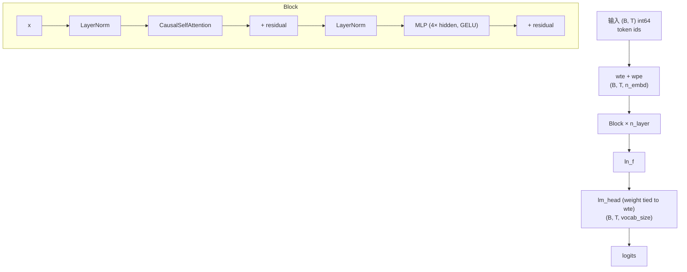

| 模块 | 行数 | 关键概念 |
|---|---|---|
| `LayerNorm` | ~10 | 自定义、为啥不用 `nn.LayerNorm` |
| `CausalSelfAttention` | ~40 | QKV 合并投影、`flash` 路径、tril buffer |
| `MLP` | ~10 | 4× hidden、GELU |
| `Block` | ~10 | **pre-norm**、residual 顺序 |
| `GPT.__init__` | ~30 | embedding、weight tying、`_init_weights` |
| `GPT.forward` | ~30 | 训练 vs 推理两条路径 |
| `GPT.generate` | ~20 | temperature / top-k / 自回归循环 |
| `configure_optimizers` | ~30 | weight decay 分组、fused AdamW |
| `from_pretrained` | ~50 | HF GPT-2 → nanoGPT 状态字典转换 |

---

## 一、LayerNorm（自定义版）

> 🟢 **2026-06-03 Phase 2 Round 1 实战回填**

### Q1.1：Karpathy 为啥自己写一个 `LayerNorm`，不用 `nn.LayerNorm`？

**答**：因为 PyTorch 内置的 `nn.LayerNorm` **不支持 `bias=False`** —— 它强制有 `bias` 参数,你只能让 bias 自由学,不能去掉。Karpathy 想要支持 `bias=False` 这种配置（GPT-2 起的现代 LLM 经验:`bias=False` 更省参数 + 训练更稳）,所以自己写一份。

**详解**:

```18:27:nanogpt-study/nanoGPT/model.py
class LayerNorm(nn.Module):
    """ LayerNorm but with an optional bias. PyTorch doesn't support simply bias=False """

    def __init__(self, ndim, bias):
        super().__init__()
        self.weight = nn.Parameter(torch.ones(ndim))
        self.bias = nn.Parameter(torch.zeros(ndim)) if bias else None

    def forward(self, input):
        return F.layer_norm(input, self.weight.shape, self.weight, self.bias, 1e-5)
```

#### 跟 `nn.LayerNorm` 的差别

| | `nn.LayerNorm`（PyTorch 内置） | nanoGPT 的自定义 LayerNorm |
|---|---|---|
| `bias=False` 支持? | ❌ 必须有 bias | ✅ 通过 `if bias else None` 跳过 |
| `weight` 初始化 | torch.ones | 同样 torch.ones |
| `bias` 初始化 | torch.zeros | torch.zeros（当 bias=True 时） |
| 内部实现 | `F.layer_norm(...)` | 同样调 `F.layer_norm(...)` |

→ **唯一差别就是支持 `bias=False`**。内部还是用 `F.layer_norm`,**性能跟内置版完全一样**。

#### 为什么现代 LLM 倾向 `bias=False`(3 个工程原因)

| 原因 | 说明 |
|---|---|
| **参数节省** | 大模型里 bias 累积起来不小,GPT-2 1.5B 模型如果所有 LN/Linear 都加 bias,**多几百万参数**,这些信息可以被 weight 等吸收 |
| **训练稳定性** | 实验发现 `bias=False` 在 LayerNorm 中**对训练稳定性有小幅提升**,尤其大模型 |
| **冗余消除** | LN 后面接 Linear,LN 的 bias 可以**被下游 Linear 的 weight 吸收**,数学上是冗余的 |

#### 实证趋势

- **GPT-2**（2019）开始 bias=False
- **Llama**（2023）全面用 bias=False + 改用 RMSNorm（更激进,去掉 mean center）
- **nanoGPT** 默认 `bias=False`（看 `GPTConfig` 即知）

> 这是个"小事但累积起来重要"的细节 —— 不会单独让模型变好,但一群这种细节决定大模型能否稳定训出来。

#### LayerNorm 公式（参考用）

$$
y = \gamma \cdot \frac{x - \mu}{\sigma + \epsilon} + \beta
$$

- `self.weight = γ`（scale，初始化为 1）
- `self.bias = β`（shift，初始化为 0；可选）
- 初始 γ=1, β=0 → LN 在初始时是 **identity 变换**,不改变输入分布

### Q1.2：LayerNorm 和 BatchNorm 在 NLP 里为啥选前者？

**答**：_TODO_

---

## 二、CausalSelfAttention

> 🟢 **2026-06-03 Phase 2 Round 1 实战回填**

### Q2.1：`c_attn` 这一个 `nn.Linear(n_embd, 3*n_embd)` 干了什么？为什么不写成 3 个独立的 `Wq/Wk/Wv`？

**答**：**把 Q、K、V 三个投影矩阵合并成一个大矩阵做 matmul**,数学上等价于 3 个独立 Linear（**参数量都是 3·d²**),但 GPU matmul **效率更高**（1 次 kernel launch vs 3 次,大 matmul 满 SM 利用率更高,实测加速 10-30%）。

**详解**:

```35:35:nanogpt-study/nanoGPT/model.py
        self.c_attn = nn.Linear(config.n_embd, 3 * config.n_embd, bias=config.bias)
```

#### 3 个 Linear vs 合并 1 个 Linear 的硬件差异

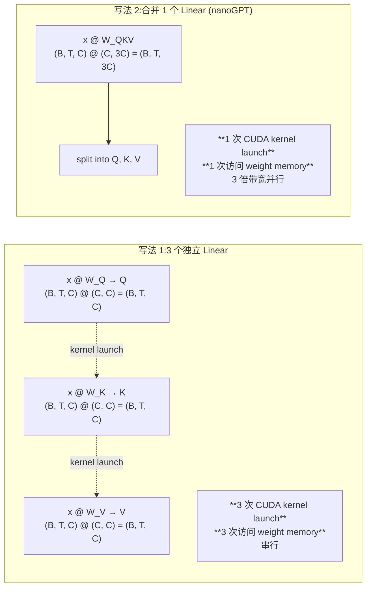

#### 数学等价性

| 维度 | 3 个独立 | 合并 1 个 |
|---|---|---|
| 总参数量 | `3 × d × d = 3d²` | `d × 3d = 3d²` | ✅ 一致 |
| 计算结果 | (Q, K, V) | split 后 (Q, K, V) | ✅ 完全等价 |

#### 实际加速

| 维度 | 3 个独立 Linear | 合并 Linear |
|---|---|---|
| CUDA kernel launch 次数 | 3 | **1** |
| Weight memory 访问 | 3 次小读 | **1 次大读**（缓存友好） |
| GPU 并行度 | 3 个独立小 matmul | **1 个大 matmul** 用满 SM |
| 实测加速(大模型) | baseline | **快 10-30%** |

> 这是个**矩阵乘融合(matmul fusion)** 的经典案例。现代 GPU(尤其有 tensor core 的)对大 matmul 性能远好于多个小 matmul。

#### split 怎么把 (B, T, 3C) 拆回 Q/K/V?

```56:56:nanogpt-study/nanoGPT/model.py
        q, k, v  = self.c_attn(x).split(self.n_embd, dim=2)
```

`split(size, dim=2)` 沿第 2 维（即最后一维）按 `size=n_embd` 切分:
- `(B, T, 3·n_embd)` → 3 个 `(B, T, n_embd)`
- 第一份是 Q,第二份是 K,第三份是 V（这是约定,不是 PyTorch 强制）

#### 附:nn.Linear 的 bias 参数

```python
nn.Linear(in_features, out_features, bias=True, device=None, dtype=None)
```

- `bias=True`（默认）:`y = Wx + b`
- `bias=False`:`y = Wx`,**没有偏置参数**

nanoGPT 整个 `model.py` 里所有 `nn.Linear` 都接受 `bias=config.bias`,统一用 `bias=False`（跟 LN 的设计哲学一致）。

---

### Q2.2：`q.view(B, T, self.n_head, C // self.n_head).transpose(1, 2)` 这个 reshape，每一维代表什么？

**答**:`(B, nh, T, hs)` 4 个维度分别是 **batch / n_head / 序列长度 / 每个 head 的维度**。`transpose(1, 2)` 把 nh 提到 T 前面,**因为 PyTorch matmul 只在最后两维做矩阵乘,前面所有维都当 batch broadcast 维**。这样 n_head 个 head 各自独立算 attention,互不干扰。

**详解**:

```56:59:nanogpt-study/nanoGPT/model.py
        q, k, v  = self.c_attn(x).split(self.n_embd, dim=2)
        k = k.view(B, T, self.n_head, C // self.n_head).transpose(1, 2) # (B, nh, T, hs)
        q = q.view(B, T, self.n_head, C // self.n_head).transpose(1, 2) # (B, nh, T, hs)
        v = v.view(B, T, self.n_head, C // self.n_head).transpose(1, 2) # (B, nh, T, hs)
```

#### Shape 流水图

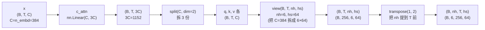

#### 每一维含义

| 维度 | 含义 | 你的 baby GPT 值 |
|---|---|---|
| **B** | batch size | 64 |
| **nh** | n_head（头数） | 6 |
| **T** | 序列长度（sequence length / time dim） | 256 |
| **hs** | head size（每个 head 的维度,即 d_k = C/nh） | 384/6 = 64 |

#### 为什么必须 `transpose(1, 2)`?(关键洞察)

PyTorch matmul 的规则:**只在最后两维做矩阵乘,前面所有维都当 batch broadcast 维**。

具体到 attention 里 `q @ k.transpose(-2, -1)`:

```
q.shape:                     (B, nh, T, hs)
k.transpose(-2, -1).shape:   (B, nh, hs, T)

@ 后的结果:                   (B, nh, T, T)
                              ↑ ↑  ↑  ↑
                              │ │  │  └─ matmul 后维
                              │ │  └──── matmul 前维
                              │ └─────── broadcast 维 (n_head 各自独立)
                              └───────── broadcast 维 (batch 各自独立)
```

#### 反例:如果不 transpose

如果不 transpose,shape 是 `(B, T, nh, hs)`:
- `q @ k^T` 会算 `(B, T, nh, hs) @ (B, T, hs, nh)` = `(B, T, nh, nh)` —— **完全错!**
- 不是 attention 矩阵 `(T, T)` 了

`transpose(1, 2)` 之后:
- `(B, nh, T, hs) @ (B, nh, hs, T)` = `(B, nh, T, T)` ✓
- 每个 head 各自得到一个 `(T, T)` attention 矩阵,**完美独立**

#### 一句话总结

> **multi-head attention 的本质 = 把 d_model 切成 nh 份,每份独立做一遍 attention**。reshape 是"切成 nh 份",transpose 是"把 nh 挪到 batch 维,让 PyTorch matmul 各自独立算"。

> 跟 Phase 1 Q1.3 (multi-head 参数量) 配套:**参数量没变**,但**计算结构变成 nh 个并行的"小 attention"**,这是 multi-head 的精妙之处。

---

### Q2.3：`flash=True` 路径下 causal mask 去哪了？跟手写路径等价吗？

**答**:flash 路径用 `is_causal=True` 参数告诉 `scaled_dot_product_attention` **内部自动应用 causal mask**,跟手写路径完全等价（数学上）。flash 还**内部融合了 √d_k 缩放 + softmax + matmul**,效率高很多。

**详解**:

```62:71:nanogpt-study/nanoGPT/model.py
        if self.flash:
            # efficient attention using Flash Attention CUDA kernels
            y = torch.nn.functional.scaled_dot_product_attention(q, k, v, attn_mask=None, dropout_p=self.dropout if self.training else 0, is_causal=True)
        else:
            # manual implementation of attention
            att = (q @ k.transpose(-2, -1)) * (1.0 / math.sqrt(k.size(-1)))
            att = att.masked_fill(self.bias[:,:,:T,:T] == 0, float('-inf'))
            att = F.softmax(att, dim=-1)
            att = self.attn_dropout(att)
            y = att @ v # (B, nh, T, T) x (B, nh, T, hs) -> (B, nh, T, hs)
```

#### 两条路径的完整对照

| Step | Flash 路径(L64) | 手写路径(L67-71) |
|---|---|---|
| 1. QK^T | 内部 | `(q @ k.transpose(-2, -1))` |
| 2. /√d_k 缩放 | **内部隐藏** | `* (1.0 / math.sqrt(k.size(-1)))` |
| 3. Causal mask | **`is_causal=True`** | `att.masked_fill(self.bias[:,:,:T,:T] == 0, float('-inf'))` |
| 4. softmax | 内部 | `F.softmax(att, dim=-1)` |
| 5. dropout | `dropout_p=...` | `self.attn_dropout(att)` |
| 6. @ V | 内部 | `att @ v` |

→ **数学上完全等价,只是 flash 把所有步骤融合在一个 CUDA kernel 里**。

#### 关键 3 点

**(a) `is_causal=True` 做了什么**?

底层等价于自动构造一个上三角 mask 并应用 -inf:

```python
# 概念上等价于:
mask = torch.tril(torch.ones(T, T)).bool()
att = att.masked_fill(~mask, float('-inf'))
```

跟手写路径的 L68 完全一样。

**(b) `/√d_k` 去哪了?**

flash 内部"自动"做了缩放(看函数名 `**scaled**_dot_product_attention` 就知道)。手写路径必须显式写 `* (1.0 / math.sqrt(k.size(-1)))`(回忆 Phase 1 Q1.2)。

**(c) 为什么 `-inf` 经 softmax 后变成 0?**

回忆 Phase 1 知识:**softmax 用 e^x 归一化**

```
softmax([1, 2, -inf, 3]) = [e^1, e^2, e^(-inf), e^3] / sum
                         = [e^1, e^2, 0,        e^3] / sum
                         = 归一化后的概率
                         
                         那个 -inf 位置 → 0,multinomial 永远不会采到
```

`masked_fill(... == 0, float('-inf'))` 利用这个性质把"未来位置"的 attention 权重清零。

#### Flash Attention 的物理优化(为啥它快)

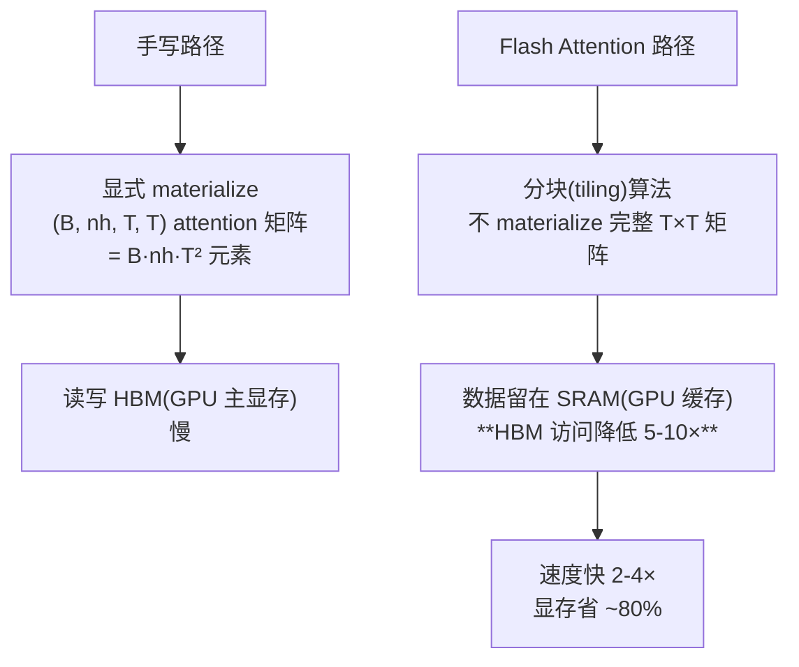

> Flash Attention 是 Tri Dao(2022)发明的优化算法,**核心思想:不要 materialize T×T attention 矩阵**,用分块算法在 SRAM 里增量计算。这是大模型训练的关键优化之一。

#### nanoGPT 怎么决定走哪条路径?

```45:50:nanogpt-study/nanoGPT/model.py
        # flash attention make GPU go brrrrr but support is only in PyTorch >= 2.0
        self.flash = hasattr(torch.nn.functional, 'scaled_dot_product_attention')
        if not self.flash:
            print("WARNING: using slow attention. Flash Attention requires PyTorch >= 2.0")
            # causal mask to ensure that attention is only applied to the left in the input sequence
            self.register_buffer("bias", torch.tril(torch.ones(config.block_size, config.block_size))
                                        .view(1, 1, config.block_size, config.block_size))
```

PyTorch ≥ 2.0 都有 SDPA,所以你跑训练时 **flash 路径走的**。手写路径只在 PyTorch 1.x 用。

#### 验证你确实走了 flash

```python
import torch.nn.functional as F
print(hasattr(F, 'scaled_dot_product_attention'))  # True → flash 路径
```

你 torch 2.8.0 上必然是 `True`。

---

### Q2.4：`self.register_buffer("bias", ...)` 为什么用 buffer 而不是 parameter？

**答**:**buffer 跟 parameter 的关键区别**:buffer **不参与梯度计算、不被 optimizer 更新**,但会被 `state_dict` 保存、跟 `model.to(device)` 一起搬到 GPU。causal mask 是个**固定不变的下三角矩阵**,根本不需要"学",所以用 buffer 最合适。

**详解**:

```49:50:nanogpt-study/nanoGPT/model.py
            self.register_buffer("bias", torch.tril(torch.ones(config.block_size, config.block_size))
                                        .view(1, 1, config.block_size, config.block_size))
```

> 注意:这个 `self.bias` **不是常规的 Linear 偏置项**,而是 **causal mask** —— 命名容易混淆,但这是 Karpathy 的代码风格。

#### Parameter vs Buffer 对照

| 特性 | `nn.Parameter` | `register_buffer` |
|---|---|---|
| `model.parameters()` 包含? | ✅ 是 | ❌ 否 |
| optimizer 会更新? | ✅ 是 | ❌ **永远不更新** |
| 参与 backward(`requires_grad`)? | ✅ 默认 True | ❌ 默认 False |
| `state_dict` 保存? | ✅ 是 | ✅ 是 |
| `model.to('cuda')` 跟着搬? | ✅ 是 | ✅ 是 |
| `model.train() / eval()` 影响? | 无 | 无 |
| 典型用途 | 权重 W、bias b、γ、β | **mask、running mean/var(BN)、固定查找表** |

→ 简单说:**buffer = "属于 model 的常量"**,跟着 model 走但不被训练。

#### causal mask 长什么样

```python
torch.tril(torch.ones(B, B)) ->
[[1, 0, 0, 0],
 [1, 1, 0, 0],
 [1, 1, 1, 0],
 [1, 1, 1, 1]]
```

- 下三角(包括对角线)= 1:**允许 attention**(可见的位置)
- 上三角 = 0:**屏蔽 attention**(未来位置)

`masked_fill(self.bias[:,:,:T,:T] == 0, float('-inf'))` 把"上三角 = 0"的位置填 `-inf`,softmax 后变 0。

#### `.view(1, 1, B, B)` 这两个 1 是什么?

**Broadcasting 准备**:把 `(B, B)` 变成 `(1, 1, B, B)`,前面加两个 size=1 的维度,**为了跟 attention scores 的 `(batch_size, n_head, T, T)` 在所有维度上对齐**。

```
att.shape          = (4,  12, 256, 256)
self.bias.shape    = (1,  1,  256, 256)  ← 前两维 size=1,会被广播到 (4, 12)
```

#### PyTorch broadcasting / unsqueeze 的标准术语

| 术语 | 含义 | 用法 |
|---|---|---|
| **Broadcasting**(广播) | NumPy/PyTorch 核心机制:size=1 的维度可以扩展到任意大小 | 默认自动发生 |
| **Unsqueeze**(取消挤压) | 在指定位置**插入 size=1 维** | `tensor.unsqueeze(0)` 在第 0 维加 size=1 |
| **View / Reshape** | 改变 shape(总元素数不变) | `tensor.view(1, 1, T, T)` |
| **`None` / `np.newaxis`** | 在 indexing 里插入 size=1 维 | `tensor[None, None, :, :]` 等价于 unsqueeze 两次 |

`.view(1, 1, B, B)` 跟以下写法**完全等价**:

```python
mask = torch.tril(torch.ones(B, B))   # shape (B, B)

# 4 种等价写法,都是 (B, B) → (1, 1, B, B):
mask.view(1, 1, B, B)
mask.unsqueeze(0).unsqueeze(0)
mask[None, None, :, :]
mask.reshape(1, 1, B, B)
```

#### 为什么 nanoGPT 用 view 而非 unsqueeze?

风格选择:`view(1, 1, B, B)` 一目了然地写出**目标 shape**,可读性高于"unsqueeze 两次"。两者性能完全一样(都是 metadata 操作,不复制数据)。

#### 一句话总结

> `register_buffer` 是 PyTorch 的工程 idiom:**"我这个 tensor 跟 model 绑定(state_dict、device 跟着走),但请不要把它当成可学习参数"**。常见于 mask、normalization 的 running stats、固定的 lookup table 等。

---

## 三、MLP

> 🟢 **2026-06-03 Phase 2 Round 2 实战回填**

### Q3.1：为什么中间层是 `4 * n_embd`？这个 4 是怎么来的？

**答**：4× 是 **Transformer 原论文(Vaswani 2017)的经验值**，**没有理论证明 4 最优**。MLP 在 Transformer 里负责"**token 内部信息消化**"（跟 attention 的"跨 token 信息混合"互补），需要足够大的中间维度来"扩展-非线性激活-压缩"。直接 `n_embd → n_embd` 容量不够,4× 扩张让 MLP 在更高维空间里学复杂模式,再 `c_proj` 选择性保留有用部分。

**详解**:

```78:92:nanogpt-study/nanoGPT/model.py
class MLP(nn.Module):

    def __init__(self, config):
        super().__init__()
        self.c_fc    = nn.Linear(config.n_embd, 4 * config.n_embd, bias=config.bias)
        self.gelu    = nn.GELU()
        self.c_proj  = nn.Linear(4 * config.n_embd, config.n_embd, bias=config.bias)
        self.dropout = nn.Dropout(config.dropout)

    def forward(self, x):
        x = self.c_fc(x)
        x = self.gelu(x)
        x = self.c_proj(x)
        x = self.dropout(x)
        return x
```

#### Shape 流水(你的 baby GPT,n_embd=384)

| Step | shape | 操作 |
|---|---|---|
| 输入 x | (B, T, **384**) | — |
| `c_fc(x)` | (B, T, **1536**) | Linear 把 dim 扩 4× |
| `gelu(x)` | (B, T, 1536) | 元素级 GELU(不改 shape) |
| `c_proj(x)` | (B, T, **384**) | Linear 压回原 dim |
| `dropout(x)` | (B, T, 384) | 元素级 dropout |
| 输出 | (B, T, 384) | 跟输入同 shape,可加残差 |

#### MLP 在 Transformer 里的角色

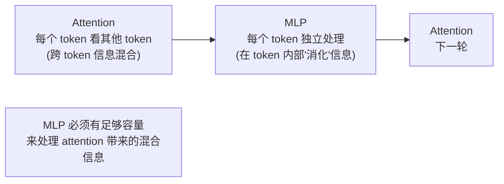

- **Attention 跨 token 混信息**(看全文,跨位置)
- **MLP 在 token 内部处理信息**(每个位置独立"消化")

#### "扩→压"的设计直觉

直接 `n_embd → n_embd`(无扩张):

```
x (B, T, 384) → Linear (B, T, 384) → GELU → Linear (B, T, 384)
                           ↑
                    没有"高维特征空间"
                    容量受限,表达力弱
```

扩 4×:

```
x (B, T, 384) → c_fc (B, T, 1536) → GELU → c_proj (B, T, 384)
                       ↑                          ↑
                把信息扩到高维                    再压回低维
                "feature engineering"             "选择性保留"
```

#### 类比

| | 直接 384→384 | 4× 扩展 384→1536→384 |
|---|---|---|
| 类比 | 在一个房间里整理东西 | **先把东西摊在大桌上分类**,**再选要的放回房间** |
| 容量 | 384² ≈ 150K 参数 | 4·384² · 2 ≈ 1.2M 参数 |
| 表达力 | 有限 | **大很多**(可学更复杂模式) |
| 非线性表达 | 一个 ReLU/GELU | **GELU 在 1536 维空间作用** |

#### 另一个视角:autoencoder 的反向

```
Autoencoder:    高维 → 压缩到瓶颈 → 重建回高维 (压缩学习)
MLP block:      低维 → 扩张到高维 → 投影回低维 (扩展学习)
```

可以理解为:**在高维空间中可以学到低维空间表达不出的模式**,再用 c_proj 选择性保留有用部分。

#### 其他模型的 ratio 选择

| 模型 | hidden_ratio | 备注 |
|---|---|---|
| Transformer 原论文 | **4** | 经验值,没有理论证明 |
| GPT-2/3/4 | 4 | 一直沿用 |
| Falcon | 4 | 同样 |
| **LLaMA / LLaMA-2** | **8/3 ≈ 2.67** | 用 SwiGLU 替代单个 Linear+GELU,**多了一个门控**,有效维度补偿 |
| Mistral | 8/3 | 跟 LLaMA 一样 |
| Gemma | 8 / 4(不同 size 不一样) | 实验得到 |

> **4 是惯例,不是定理**。现代研究表明 2-8 都有用,具体看激活函数 + 数据 + 算力 trade-off。

---

### Q3.2：GELU 跟 ReLU 在 transformer 里的差别？

**答**:**ReLU 是"硬截断"**(负数全砍成 0),**GELU 是"软概率门"**(允许小负值通过)。GELU 处处平滑可微、不会有"死神经元",负数区保留部分信息 —— 实证在 NLP 任务上**比 ReLU 高 1-2 个点**。从 BERT(2018)起,Transformer 默认 GELU。

**详解**:

#### 公式对比

| | 公式 | 可微性 | 负数区行为 |
|---|---|---|---|
| **ReLU** | `ReLU(x) = max(0, x)` | x=0 处**不可微**(梯度从 0 跳到 1) | **完全屏蔽**(=0,梯度=0) |
| **GELU** | `GELU(x) = x · Φ(x)`,Φ 是标准正态 CDF | **处处平滑可微** | **允许小负值通过**(带"概率"加权) |

GELU 的常用近似(PyTorch `nn.GELU` 内部用):

$$
\text{GELU}(x) \approx 0.5 x \left(1 + \tanh\left(\sqrt{\frac{2}{\pi}} \left(x + 0.044715 x^3\right)\right)\right)
$$

#### 图像对比

```
   y                              y
   |    /                         |     ╱
   |   /  ReLU                    |    ╱
   |  /   (尖角,负数全砍)         |   ╱   GELU (平滑)
   | /                            |  /
   |/                             | /  
───┼─────── x                  ───┼───/───── x
   |                              | / 
                                  |/  (负数允许小幅通过)
                                  |
```

**关键差异**:
- ReLU 是**硬截断** —— 负数信号全没了
- GELU 是**软概率门** —— 负数信号按概率衰减,允许一些通过

#### 3 个工程意义

| 维度 | ReLU | GELU |
|---|---|---|
| **Dead Neuron 问题** | 某神经元一直输出负数 → 永远 0 → **永远不更新** → "死神经元" | 总有非零梯度,**不会死** |
| **梯度平滑** | 突变(0 或 1) | **处处平滑**,优化器友好 |
| **小负值信息保留** | 全丢 | **保留一部分** — NLP 任务有意义 |
| **计算成本** | 极快(一个 max) | 稍慢(有 erf 或 tanh 近似) |
| **实证(NLP)** | 较差 | **明显更好**(BERT 起证实) |

#### 历史演变


> **BERT 论文实验**(Devlin 2018)首次证明 GELU 在 NLP 任务上比 ReLU 高 1-2 个点,从此 transformer 默认 GELU。**GELU 也叫 "Gaussian Error Linear Unit"**,把"按概率加权"的直觉数学化。

#### 思想直觉

ReLU 像"门卫": **要么放行(x>0),要么禁入(x<=0)**。
GELU 像"概率门": **按 x 的"自然程度"(用正态 CDF 衡量)加权放行**。

- x 很正(比如 +3): Φ(3) ≈ 0.999,GELU(x) ≈ x(全过)
- x = 0: Φ(0) = 0.5,GELU(0) = 0(过零)
- x 很负(比如 -3): Φ(-3) ≈ 0.001,GELU(x) ≈ 0(几乎不过)
- x = -0.5: Φ(-0.5) ≈ 0.31,GELU(-0.5) ≈ -0.15(**少量通过**,这就是 "smooth" 的来源)

---

## 四、Block

> 🟢 **2026-06-03 Phase 2 Round 2 实战回填(含 Phase 1 概念全打通)**

### Q4.1：nanoGPT 用的是 pre-norm 还是 post-norm？怎么从代码看出来？

**答**:**Pre-norm**。从 `Block.forward` 两行代码直接看出:**`self.ln_1(x)` 出现在 `self.attn(...)` 内部**(LN 包在 sublayer 输入端),**`x +` 部分是裸 x**(residual 通路上无 LN)。这就是 pre-norm 的两个识别特征。

**详解**:

```94:106:nanogpt-study/nanoGPT/model.py
class Block(nn.Module):

    def __init__(self, config):
        super().__init__()
        self.ln_1 = LayerNorm(config.n_embd, bias=config.bias)
        self.attn = CausalSelfAttention(config)
        self.ln_2 = LayerNorm(config.n_embd, bias=config.bias)
        self.mlp = MLP(config)

    def forward(self, x):
        x = x + self.attn(self.ln_1(x))
        x = x + self.mlp(self.ln_2(x))
        return x
```

#### 数学表达对照

| Norm 位置 | 公式 | nanoGPT 代码符合吗? |
|---|---|---|
| **Post-norm**（原始 Transformer / GPT-1） | `x_out = LN(x + sublayer(x))` | ❌ |
| **Pre-norm**（GPT-2 起 / nanoGPT） | `x_out = x + sublayer(LN(x))` | ✅ |

#### 三个识别特征(从代码看)

```python
x = x + self.attn(self.ln_1(x))
    ↑     ↑           ↑
    |     |           └─ LN 包在 attn 内部(对应 sublayer(LN(x)))
    |     └───────────── attn = sublayer
    └─────────────────── 裸 x,residual 通路无 LN
```

- (a) `self.ln_1(x)` 在 `self.attn(...)` **前**(作为 attn 的输入)
- (b) residual 通路上(`x +` 这部分)**没有 LN**
- (c) → 这是 **pre-norm**

#### 如果是 post-norm,代码会怎么写?

```python
# 反例:post-norm 写法(原始 Transformer / GPT-1)
def forward(self, x):
    x = self.ln_1(x + self.attn(x))    # ← LN 在最外面,包整个 add
    x = self.ln_2(x + self.mlp(x))      # ← 同上
    return x
```

注意:**LN 套在 `x + sublayer(x)` 外面**,residual 通路上有 LN 拦截。

#### 视觉对比(同一个 Block,两种 norm 路径)

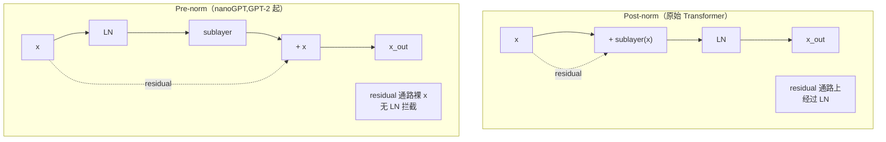

#### LN 用的是 nanoGPT 自定义版

`self.ln_1 = LayerNorm(config.n_embd, bias=config.bias)` —— 注意大写的 `LayerNorm` 来自本文件第 18 行的自定义类(支持 `bias=False`),**不是** PyTorch 的 `nn.LayerNorm`。

---

### Q4.2：pre-norm vs post-norm，深层训练稳定性差别在哪？

**答**:**pre-norm 让 residual 通路是"裸 x"(identity 直通),反向梯度通过 N 层后仍然几乎无损;post-norm 的 residual 通路上有 N 个 LN 层,梯度逐层被缩放,深网络梯度容易消失/爆炸**。这是 GPT-2 起所有大模型用 pre-norm 的根本原因 —— 数百层 transformer 也能稳定训练。

**详解**:

#### 反向梯度路径对比

**Post-norm**:`x_out = LN(x + sublayer(x))`

反向求导:
$$
\frac{\partial x_{out}}{\partial x} = \frac{\partial \text{LN}}{\partial \cdot} \cdot \left(I + \frac{\partial \text{sublayer}(x)}{\partial x}\right)
$$

→ 梯度被 LN 的雅可比缩放,**N 层后累积 N 次** → 不稳定。

**Pre-norm**:`x_out = x + sublayer(LN(x))`

反向求导:
$$
\frac{\partial x_{out}}{\partial x} = I + \frac{\partial \text{sublayer}(\text{LN}(x))}{\partial x}
$$

→ **`I`(单位矩阵)就是 identity shortcut**,保证梯度**至少有 `I` 这一项**,gradient 不会消失。

#### 对照表

| | post-norm | pre-norm |
|---|---|---|
| 通过 N 层后梯度 | 每层都被 LN 缩放 → 累积 N 次 → 极不稳定 | residual 通路是 identity → **梯度几乎无损直通** |
| 训练深度上限 | ~12 层（更深需小心初始化 + warmup） | **数百层无压力** |
| 是否需要 warmup? | 强依赖 | 弱依赖 |
| 收敛速度 | 较慢 | **较快** |

#### "identity shortcut" 的关键

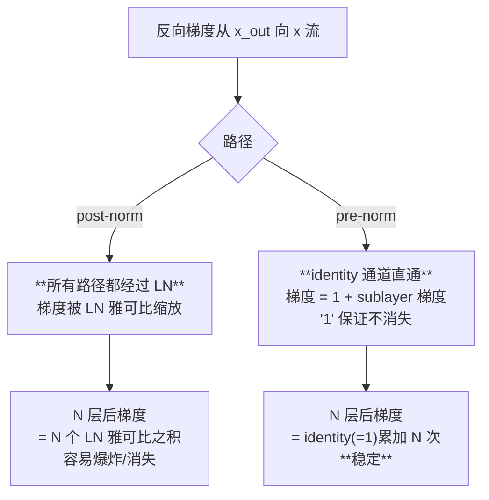

> 你昨天 Phase 1 Q3.2 已经看过这套推导,这次在 nanoGPT 代码上**精确验证** —— `model.py:104-105` 这两行的 `x = x + ...` 就是 pre-norm 的核心结构。

#### Block 的两行 forward — 综合解读(整合 §0.7 残差 + Q1.1 LN + Phase 1 Q3.2 pre-norm + Q1.3 multi-head + Q3 MLP)

```python
x = x + self.attn(self.ln_1(x))    # 行 1: attn 子层 + residual
x = x + self.mlp(self.ln_2(x))      # 行 2: mlp 子层 + residual
```

#### 每行 5 个组件标注

| 组件 | 行 1 里的位置 | 行 2 里的位置 |
|---|---|---|
| **残差**(§0.7) | `x +` 是 identity 通道,`self.attn(...)` 是 sublayer 修正量 | `x +` 同样;`self.mlp(...)` 是修正量 |
| **Pre-norm**(Phase 1 Q3.2) | `self.ln_1(x)` 在 attn 内部 | `self.ln_2(x)` 在 mlp 内部 |
| **LayerNorm**(Q1.1) | `ln_1 = 自定义 LayerNorm`,支持 bias=False | 同上 |
| **Multi-head Attention** | `self.attn(...)` —— c_attn 合并 QKV + flash + concat heads + c_proj | (不参与) |
| **GELU MLP**(Q3.1-Q3.2) | (不参与) | `self.mlp(...)` —— c_fc 扩 4× + GELU + c_proj 压回 |

#### 一句话总结 — GPT 标准配方为什么 work

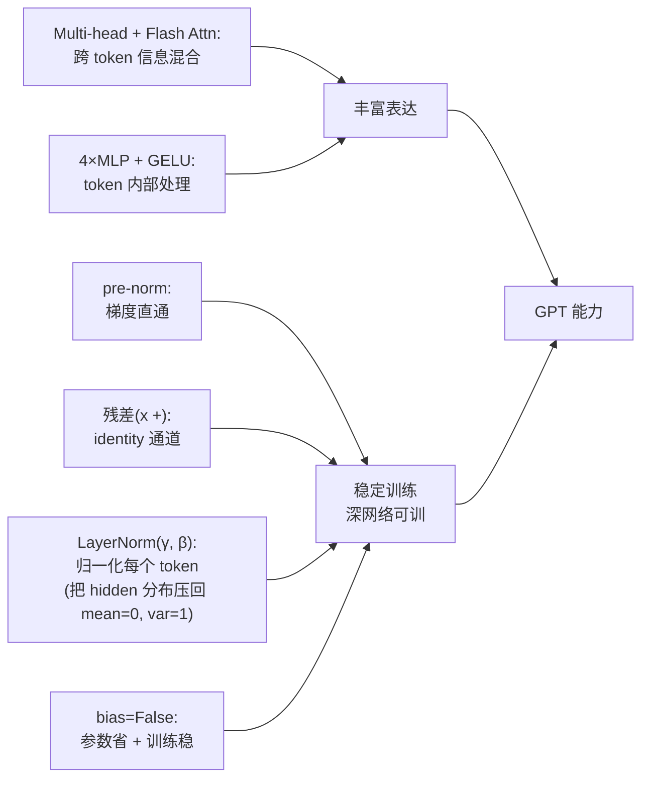

| 组件 | 解决什么问题? |
|---|---|
| **pre-norm** | 让 residual 通路无 LN,梯度直通到底层 → **训深网络不崩** |
| **residual** | identity shortcut → **梯度有"保险绳"**,不会消失 |
| **LayerNorm** | 每个 token 的 hidden state **归一化到 mean=0, var=1** → 防数值爆炸 |
| **Multi-head Attention** | **跨 token 混信息**,n 个 head 并行学多种 pattern |
| **4× MLP + GELU** | **token 内部"消化"** attention 带来的混合信息 |
| **`bias=False`** | 微小但累积的训练稳定性提升 |
| **Flash Attention** | 工程优化:不 materialize T×T 矩阵,**省显存 + 加速** |

**一句话**:

> **GPT 标准配方 = "信息混合(attention 跨 token)+ 信息消化(MLP 内 token)+ 残差直通(避免梯度消失)+ pre-norm 稳定(深网络可训)+ 数值归一化(LayerNorm 防爆)"**。

每个组件**单独看都不复杂**,但**叠加起来**就构成了能训百层、参数千亿、效果惊人的现代 LLM。这套配方从 GPT-2(2019)定型,5 年后基本没大改 —— **简单 + 通用 + scale 友好** = Bitter Lesson 的胜利。

---

## 五、GPT.__init__

> 🟢 **2026-06-10 Phase 2 Round 3 实战回填(含 7 个深度 FAQ 集成)**

### §5.0 · PyTorch "积木"速查表(读 GPT class 前必看)

下面 7 个 API 是 `GPT.__init__` + `GPT.forward` 的全部底座。

#### 1. `nn.Embedding(num_embeddings, embedding_dim)` —— 查找表

```python
emb = nn.Embedding(num_embeddings=65, embedding_dim=384)
# 内部存一个 (65, 384) 的可训练矩阵 W
# 输入 idx → 输出 W[idx]
```

| 参数 | 含义 | 例 |
|---|---|---|
| `num_embeddings` | **词汇表大小**(地址空间) | 65 |
| `embedding_dim` | **每个词的向量维度** | 384 |
| 内部 `weight` | shape `(num_embeddings, embedding_dim)` | `(65, 384)` |

**输入和输出**:

```python
idx = torch.randint(0, 65, (4, 256))   # shape (4, 256) 任意 shape,值是 token id
out = emb(idx)                          # shape (4, 256, 384) ← 输入末尾加 embedding_dim
```

> **vocab 不出现在输出 shape 里**!输出 shape 只是把输入 shape 末尾加上 `embedding_dim`。

#### 2. `nn.Linear(in_features, out_features, bias=True/False)` —— 全连接层

```python
fc = nn.Linear(in_features=384, out_features=65, bias=False)
# 内部权重 fc.weight: shape (out_features=65, in_features=384)
# 注意 PyTorch 的约定:weight 是 (out, in),不是 (in, out)!
```

**重要细节**:

```python
fc.weight.shape  # → (65, 384)   ← out 在前!
fc.bias.shape    # → (65,)        ← 跟 out 维度一致
```

**`nn.Linear` 跟 `nn.Embedding` 的 weight shape 一样!**(weight tying 的关键)

| | `nn.Embedding(65, 384)` | `nn.Linear(384, 65, bias=False)` |
|---|---|---|
| `.weight.shape` | **(65, 384)** | **(65, 384)** |

#### 3. `torch.nn.init.normal_(tensor, mean, std)` —— 正态分布填值

```python
torch.nn.init.normal_(tensor, mean=0.0, std=0.02)
# 用 N(mean=0, std=0.02) 重新填充 tensor 的所有元素(in-place!)
```

后缀 `_` 表示 **in-place 操作**(直接改 tensor,不返回新 tensor)。

**`std` = Standard Deviation(标准差)**,衡量正态分布的"宽窄":

| `std` | 99% 的值在哪里(3σ 规则) |
|---|---|
| `std=0.02` | [-0.06, +0.06] —— 紧凑 |
| `std=0.1` | [-0.3, +0.3] —— 中等 |
| `std=1.0` | [-3, +3] —— 大范围 |

#### 4. `nn.ModuleDict / nn.ModuleList` —— 容器

```python
self.transformer = nn.ModuleDict({
    'wte': nn.Embedding(...),
    'wpe': nn.Embedding(...),
})
# 用法:self.transformer.wte 或 self.transformer['wte']
```

```python
self.blocks = nn.ModuleList([Block(...) for _ in range(12)])
# 用法:self.blocks[0],或 for block in self.blocks: ...
```

**为啥不用普通 Python `dict` / `list`**?`nn.ModuleDict/List` 会**自动注册子 module**:
- `model.parameters()` 能遍历到它们
- `model.to('cuda')` 能搬走它们
- `model.state_dict()` 能保存它们

#### 5. `tensor.view(shape)` —— reshape 视图(不复制数据)

```python
x = torch.randn(4, 12, 256, 65)        # (4, 12, 256, 65)
y = x.view(-1, 65)                      # (12288, 65)  ← -1 自动算 = 4*12*256
```

**关键**:
- `view` 不复制数据,只改 shape 视图
- 必须保证 **总元素数不变**
- `-1` 让 PyTorch 自动算占位

#### 6. `F.cross_entropy(logits, targets)` —— softmax + NLL 一次完成

```python
import torch.nn.functional as F

# logits shape: (N, C)  ← N 个样本,C 个类别的得分
# targets shape: (N,)   ← N 个样本各自的真实类别 id(int)
loss = F.cross_entropy(logits, targets)
# = -log(softmax(logits)[target])  对所有 N 个样本平均
```

**等价的"手写版"**(理解用):

```python
probs = F.softmax(logits, dim=-1)
nll = -torch.log(probs[range(N), targets])
loss = nll.mean()
```

这就是 Phase 1 §0.4 学的 **cross_entropy ≡ NLL ≡ -L₁** 的代码实现。

#### 7. Broadcasting —— 自动维度对齐

```python
a = torch.zeros(2, 3, 4)      # (2, 3, 4)
b = torch.zeros(3, 4)          # (3, 4)
c = a + b                       # c.shape = (2, 3, 4)
# ↑ b 自动 broadcast 到 (1, 3, 4),再复制到 2
```

**规则**:从后往前对齐,size=1 的维度可扩展,缺失的维度当 size=1 处理。

---

### Q5.1:为什么用 `nn.ModuleDict` 而不是直接挂属性?

**答**:**两个原因 —— 主因是工程对齐 HuggingFace GPT-2 的参数命名结构**(这样 `from_pretrained` 加载 HF 权重时 key 直接匹配,不用做名字翻译);**辅因是代码组织**(把"transformer 主体"打包成一个逻辑组,`lm_head` 单独放外面 —— 因为它跟 wte 共享权重)。

**详解**:

```126:138:nanogpt-study/nanoGPT/model.py
        self.transformer = nn.ModuleDict(dict(
            wte = nn.Embedding(config.vocab_size, config.n_embd),
            wpe = nn.Embedding(config.block_size, config.n_embd),
            drop = nn.Dropout(config.dropout),
            h = nn.ModuleList([Block(config) for _ in range(config.n_layer)]),
            ln_f = LayerNorm(config.n_embd, bias=config.bias),
        ))
        self.lm_head = nn.Linear(config.n_embd, config.vocab_size, bias=False)
```

#### 5 个子组件含义

| key | 全称 | 是什么 | shape |
|---|---|---|---|
| **wte** | **w**ord **t**oken **e**mbedding | token id → 向量的查找表 | weight: `(vocab_size, n_embd)` = `(65, 384)` |
| **wpe** | **w**ord **p**osition **e**mbedding | 位置 id → 向量的查找表 | weight: `(block_size, n_embd)` = `(256, 384)` |
| **drop** | embedding dropout | 嵌入后的 dropout 防过拟合 | 无 weight |
| **h** | **h**idden layers(HF 风格简称) | n_layer 个 Block 串起来(你的:6 个) | 每个 Block ~1.77M 参数 |
| **ln_f** | **f**inal LayerNorm | 最后一层 LN,在出 lm_head 前归一化 | weight: `(384,)`, bias 可选 |

#### 结构展开

```
self.transformer (ModuleDict)
├── wte (Embedding)              ← 词嵌入 (vocab_size, n_embd)
├── wpe (Embedding)              ← 位置嵌入 (block_size, n_embd)
├── drop (Dropout)               ← embedding 后的 dropout
├── h (ModuleList)
│   ├── [0] Block
│   ├── [1] Block
│   ├── ...
│   └── [n_layer-1] Block
└── ln_f (LayerNorm)             ← 最后一层 LayerNorm
self.lm_head (Linear)            ← 单独放外面,跟 wte 共享权重
```

#### 关键:命名跟 HuggingFace GPT-2 完全对齐

nanoGPT 的参数名:
```
transformer.wte.weight
transformer.h.0.attn.c_attn.weight
transformer.h.0.attn.c_proj.weight
transformer.ln_f.weight
lm_head.weight
```

HuggingFace `GPT2LMHeadModel` 的参数名:
```
transformer.wte.weight                ← 完全一样
transformer.h.0.attn.c_attn.weight    ← 完全一样
transformer.h.0.attn.c_proj.weight    ← 完全一样
transformer.ln_f.weight               ← 完全一样
lm_head.weight                        ← 完全一样
```

→ `from_pretrained` 加载时按 key 直接 copy,**两边命名一模一样才能这么写**:

```python
sd[k].copy_(sd_hf[k])    # 用同一个 key 直接 copy
```

如果不用 ModuleDict 把 wte/wpe/h/ln_f 包到 `transformer.` 下,nanoGPT 这边参数名会变成 `wte.weight` 之类,**就要写一堆 name mapping**。Karpathy 故意这样设计。

#### "h" 这个奇怪名字哪来的?

**hidden layers** 的简称。神经网络有 3 类层:

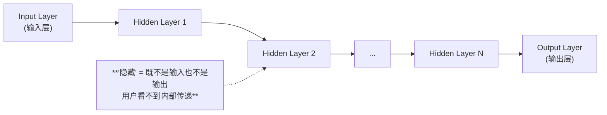

**对应到 GPT**:

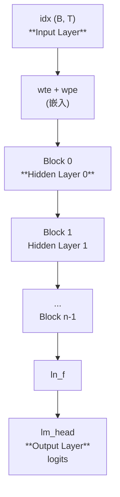

**`h` = 这些 hidden layers 的列表**。Karpathy 用 `h` 而非 `blocks` 或 `layers`,**直接抄 HuggingFace GPT-2 的命名**(为了 `from_pretrained` 兼容)。

#### `block_size` 是啥?为什么 `n_embd = 384` 不是 2 的幂?

**`block_size = 模型一次能看的最大序列长度`(context window 上限)**:
- 训练时每个样本的 T 维度 ≤ block_size
- 决定 **position embedding 表**的大小:`(block_size, n_embd)`
- 你的 baby GPT:`block_size = 256` → 模型一次看 256 个字符

| 模型 | block_size |
|---|---|
| nanoGPT shakespeare_char | **256** |
| GPT-2 | 1024 |
| GPT-3 | 2048 |
| GPT-4 | 8K-128K |

**`n_embd = 384` 为什么不是 2 的幂?**

**关键约束**:`n_embd 必须能被 n_head 整除`(因为 head_dim = n_embd / n_head)。

你的配置:`n_embd = 384, n_head = 6` → **head_dim = 64**(2 的幂)

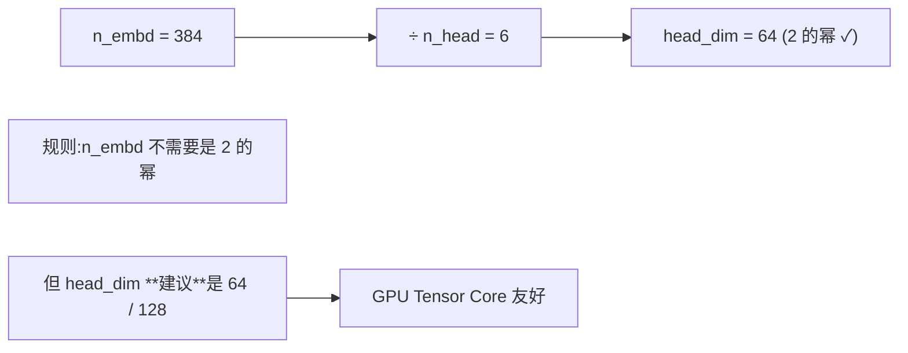

**现代 LLM 的 n_embd 选择**:

| 模型 | n_embd | n_head | head_dim |
|---|---|---|---|
| nanoGPT baby | **384** | 6 | 64 |
| GPT-2 124M | 768 | 12 | 64 |
| GPT-2 medium 350M | 1024 | 16 | 64 |
| GPT-2 XL 1.5B | 1600 | 25 | 64 |
| GPT-3 175B | **12288** | 96 | 128 |
| LLaMA-7B | 4096 | 32 | 128 |

→ **n_embd 不必是 2 的幂,只要被 n_head 整除**。head_dim 一般 64/128(GPU 友好)。

#### 每个 Block 内部参数怎么算?

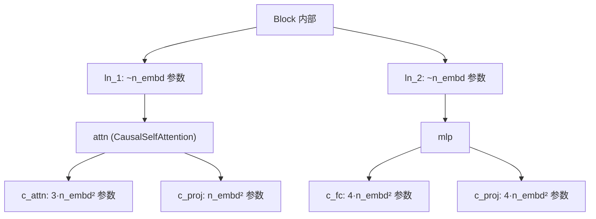

**精确算**(以 `n_embd=384` 为例):

| 组件 | 公式 | 你的 baby GPT |
|---|---|---|
| **ln_1** (γ, β) | `~n_embd` | 384 |
| **attn.c_attn** | `3 × n_embd²` | 442,368 |
| **attn.c_proj** | `n_embd²` | 147,456 |
| **ln_2** | 同 ln_1 | 384 |
| **mlp.c_fc** | `4 × n_embd²` | 589,824 |
| **mlp.c_proj** | `4 × n_embd²` | 589,824 |
| **每个 Block 合计** | **`12 × n_embd²` + 小量** | **~1.77M** |

**总参数量公式(忽略 embedding + LN)**:

$$
\boxed{N \approx 12 \cdot n_{\text{layer}} \cdot n_{\text{embd}}^2}
$$

**验算你的 baby GPT**(n_layer=6, n_embd=384):
```
Transformer 主体:  6 × 12 × 384² = 10,616,832  ≈ 10.6M
wte (tied):       65 × 384 = 24,960
wpe:              256 × 384 = 98,304
合计:             ~10.75M  ← 跟启动时 print 的 "10.65M" 对得上
```

**验算 GPT 系列**:

| 模型 | n_layer | n_embd | `12·L·d²` 预测 | 论文报告 |
|---|---|---|---|---|
| **GPT-2 124M** | 12 | 768 | **85M** | ~85M ✓ |
| GPT-3 175B | 96 | 12288 | **174B** | 175B ✓ |

#### 为啥 `lm_head` 放外面?

`lm_head` = **L**anguage **M**odel **head**(语言模型头)。

"Head" 在 ML 术语里 = 模型最后一层,**专门把内部表示映射到任务输出**:

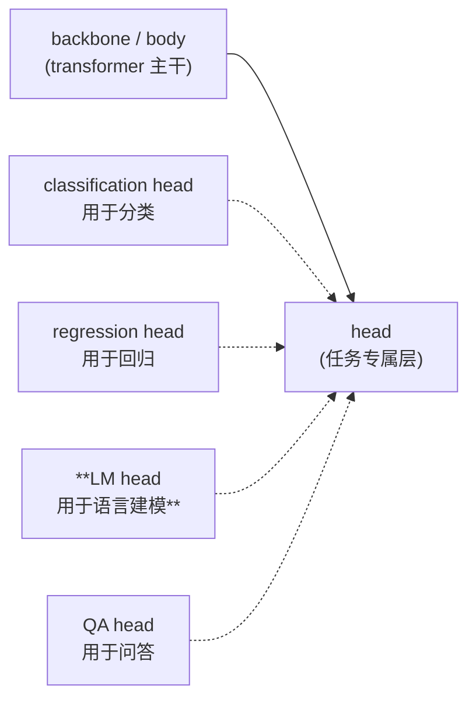

GPT 的 lm_head 是"**最后一公里**":hidden state → 词表上 vocab_size 个 logits → softmax 给出"下一个 token 是什么"的概率分布。

**放外面的两个原因**:
- **HF 命名习惯**:`lm_head` 一直就在 `transformer` 外面(任务头跟 backbone 解耦,可以换成分类头等)
- **Weight tying 的暗示**:`lm_head.weight` 跟 `transformer.wte.weight` 共享内存,**两份名字指一份数据**,放外面更清晰

---

### Q5.2:weight tying 是怎么生效的?省了多少参数?

**答**:**Python 的 `=` 对 nn.Parameter 是"赋同一个引用",不是 copy** —— 让两个名字指向同一份内存。所以 `wte.weight` 和 `lm_head.weight` 物理上**是同一个 Parameter 对象**,`model.parameters()` 只算一次,backward 时梯度自动累加到这份。对你的 baby GPT 省 25K 参数(占 ~50%);对 GPT-2 124M 省 38.6M(占 31%)。

**详解**:

```133:138:nanogpt-study/nanoGPT/model.py
        self.lm_head = nn.Linear(config.n_embd, config.vocab_size, bias=False)
        # with weight tying when using torch.compile() some warnings get generated:
        # "UserWarning: functional_call was passed multiple values for tied weights.
        # This behavior is deprecated and will be an error in future versions"
        # not 100% sure what this is, so far seems to be harmless. TODO investigate
        self.transformer.wte.weight = self.lm_head.weight # https://paperswithcode.com/method/weight-tying
```

#### "共享一份内存"和"共享一份参数"是同一件事

在 PyTorch 里,**"参数"(`nn.Parameter`)就是带 `requires_grad=True` 的 tensor 对象**,**保存在内存某个地址**。

```python
self.lm_head = nn.Linear(384, 65, bias=False)
# 内存里有一个 Parameter 对象 P1,地址 0x1000
# self.lm_head.weight = P1

self.transformer.wte.weight = self.lm_head.weight
# self.lm_head.weight 指向 P1 (0x1000)
# = 操作后,self.transformer.wte.weight 也指向 P1 (0x1000)
# **两者是同一个 Parameter 对象,只是有两个名字**
```

#### 验证(可在 Python 跑)

```python
print(id(model.lm_head.weight))            # 比如 140234567...
print(id(model.transformer.wte.weight))    # 140234567... (一模一样!)
print(model.lm_head.weight is model.transformer.wte.weight)  # True
```

#### 物理图

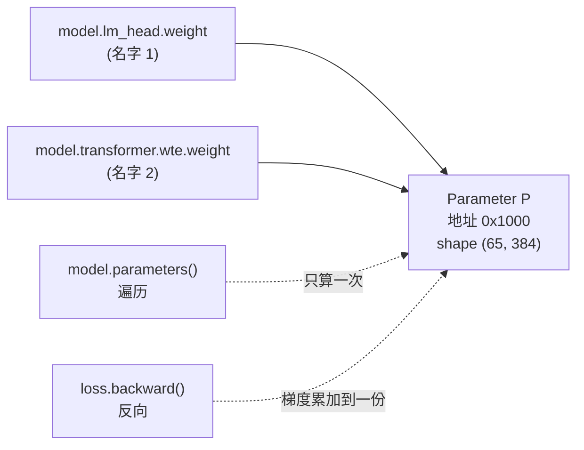

#### 关键后果

- ✅ `model.parameters()` 里**只算一次**这个 Parameter,不会重复
- ✅ 更新 `lm_head.weight` **等价于**更新 `wte.weight`(同一份内存)
- ✅ backward 时各路径梯度**自动累加到同一个 `.grad`**,只有一份

#### 省了多少参数?

| 模型 | vocab × n_embd | 没 tying | tying 后 | 省了 |
|---|---|---|---|---|
| 你的 baby GPT | 65 × 384 | 49,920(0.05M) | 24,960(0.02M) | 24,960(**~50%**) |
| GPT-2 124M | 50,257 × 768 | 77M | 38.5M | **38.5M(占总参数的 31%!)** |
| GPT-3 175B | 50,257 × 12,288 | 1.24B | 0.62B | 0.62B |

#### 为什么这种共享合理?

回忆 §0.4 双向对称:

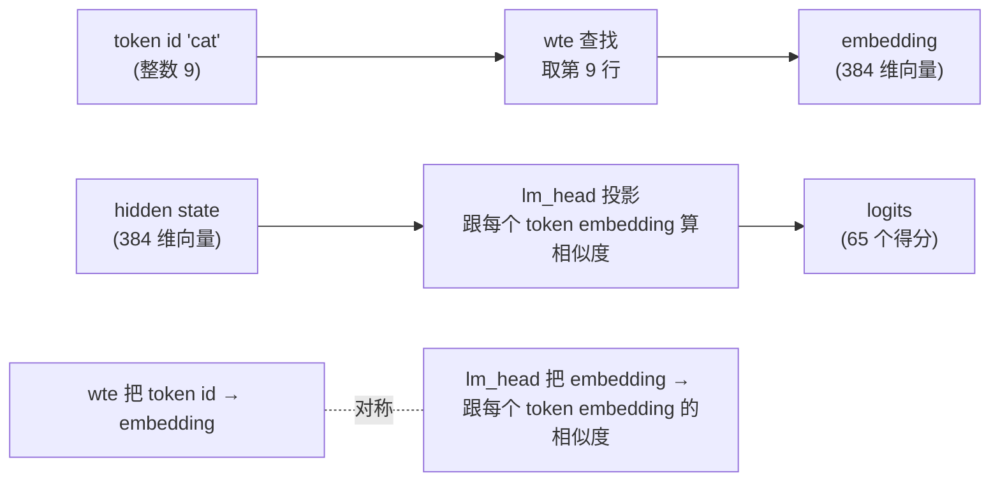

- **wte**:**id → embedding**(把数字翻译成向量)
- **lm_head**:**embedding → 跟每个 token embedding 的相似度**(数学上等价于 `hidden_state @ wte.T`)

如果它们共享同一个 W:`logits[i] = h @ W[i].T` = **h 跟 token i 的 embedding 的内积**。**语义上完全合理**:embedding 空间统一,encode 和 decode 用同一份 representation。

**Weight tying 不只省参数,还是个有用的归纳偏置**:"token A 的向量" 在 input 端和 output 端本来就该是同一个东西。

#### 为什么 `lm_head` 用 `bias=False`?

3 个工程原因:

| 理由 | 直觉 |
|---|---|
| **参数节省** | 大模型里 bias 累积起来不小,几百万参数,这些信息能被 weight 吸收 |
| **训练稳定性** | LayerNorm 用 `bias=False` 在大模型上**训得更稳**(无 bias 漂移) |
| **数学冗余** | LN 后接 Linear → LN 的 bias **能被下游 Linear 的 weight 吸收**,理论上不需要 |

**实证趋势**:
- Transformer 原论文:默认有 bias
- **GPT-2 起**:部分 bias=False
- **LLaMA 全系**:**全部 bias=False + RMSNorm**(更激进)
- **nanoGPT 默认**:bias=False

#### 一句话总结

**weight tying = 同一份参数,两个名字** = 省一半的 `vocab × n_embd` 参数 + 合理的归纳偏置。

---

### Q5.3:`std=0.02` vs `std=0.02/sqrt(2·n_layer)` —— 为什么 residual proj 要额外缩?

**答**:**只对 `c_proj.weight`(共 `2·n_layer` 个)用小 std**:每个 Block 一个 `attn.c_proj` + 一个 `mlp.c_proj`,即每个 sublayer 的"输出闸门"。**残差路径的 proj 要额外缩,是为了对抗 pre-norm 架构里 residual 累加导致的方差爆炸**:每个 sublayer 输出方差缩到 `1/(2N)`,经过 `2N` 次累加后,最终 x 的方差仍 `O(1)` 量级,深网络训练不失控。

**详解**:

```141:145:nanogpt-study/nanoGPT/model.py
        self.apply(self._init_weights)
        # apply special scaled init to the residual projections, per GPT-2 paper
        for pn, p in self.named_parameters():
            if pn.endswith('c_proj.weight'):
                torch.nn.init.normal_(p, mean=0.0, std=0.02/math.sqrt(2 * config.n_layer))
```

```162:168:nanogpt-study/nanoGPT/model.py
    def _init_weights(self, module):
        if isinstance(module, nn.Linear):
            torch.nn.init.normal_(module.weight, mean=0.0, std=0.02)
            if module.bias is not None:
                torch.nn.init.zeros_(module.bias)
        elif isinstance(module, nn.Embedding):
            torch.nn.init.normal_(module.weight, mean=0.0, std=0.02)
```

#### 逐行翻译

| 行 | 干什么 |
|---|---|
| L141 `self.apply(self._init_weights)` | 递归遍历每个子 module,各自调用 `_init_weights` |
| L162-168 `_init_weights` | Linear → weight `N(0, 0.02²)`、bias 置 0;Embedding → weight `N(0, 0.02²)` |
| L143-145 二次修改 | `apply` 之后,**只对 `c_proj.weight` 重新初始化**,std 改成 `0.02 / sqrt(2·n_layer)` |

#### 哪些权重用哪种 std(GPT-2 small,n_layer=12)

| 参数名 | std | 角色 |
|---|---|---|
| `transformer.wte.weight` | 0.02 | token embedding |
| `transformer.wpe.weight` | 0.02 | position embedding |
| `transformer.h.*.attn.c_attn.weight` | 0.02 | 合并的 QKV 投影 |
| `transformer.h.*.attn.c_proj.weight` | **0.02 / sqrt(24) ≈ 0.0041** | attn 输出投影(走 residual) |
| `transformer.h.*.mlp.c_fc.weight` | 0.02 | MLP 第一层(扩 4×) |
| `transformer.h.*.mlp.c_proj.weight` | **0.02 / sqrt(24) ≈ 0.0041** | MLP 输出投影(走 residual) |
| `lm_head.weight` | (跟 wte tied,不单独初始化) | — |

**观察**:**只有 2 类 Linear 用小 std**,共 `2 · n_layer = 24` 个矩阵。

#### `c_proj` 在哪?—— 两处

```
attn 内部:  c_attn (3 个 Linear 合并) → softmax → c_proj   ← 最后一层
mlp 内部:   c_fc → GELU → c_proj                          ← 最后一层
```

**c_proj 是 sublayer 的"输出闸门"**。控制了 c_proj 的输出方差,就控制了整个 sublayer 的输出方差,也就控制了 residual 累加的步长。中间层(c_attn, c_fc)的方差影响内部信号传播,但不直接决定 sublayer 输出方差。

#### 为啥要额外缩?—— 方差累积问题

回忆 Block 的 forward(Q4.1):

```python
x = x + self.attn(self.ln_1(x))
x = x + self.mlp(self.ln_2(x))
```

每个 Block 在 residual 通路上**累加 2 次**(一次 attn,一次 mlp)。N 层 Block 后,x 一共被累加了 **2N 次**。

**两个独立的、方差为 1 的 tensor 相加,结果方差是 2**(独立随机变量方差相加):

$$
\text{Var}(x + \text{sublayer}(x)) = \text{Var}(x) + \text{Var}(\text{sublayer}(x)) = 1 + 1 = 2
$$

经过 N 层(2N 次累加):

$$
\text{Var}(x_{\text{final}}) \approx 2N \cdot \text{Var}(x_0)
$$

**N=12 时,方差 ~24,std ~5**;深层 N=48 时,方差 ~96,std ~10。最后一层输入会非常"狂野",训练不稳定。

#### 解决方案

让每个 sublayer 输出方差缩到 `1/(2N)`,则:

$$
\text{Var}(x_{\text{final}}) \approx 1 + 2N \cdot \frac{1}{2N} = 2 = O(1)
$$

→ **方差不爆炸**。让 c_proj 的权重初始化 std 缩 `1/sqrt(2N)`:

$$
\text{std}_{\text{new}} = 0.02 \cdot \frac{1}{\sqrt{2 \cdot n\_layer}}
$$

**这就是 L145 那行代码的物理含义**!

#### 总览图

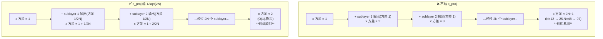

#### 历史出处

GPT-2 论文(Radford 2019)Section 2:

> *"A modified initialization which accounts for the accumulation on the residual path with model depth is used. We scale the weights of residual layers at initialization by a factor of 1/√N where N is the number of residual layers."*

(GPT-2 论文里 N 是 sublayer 总数 = `2 * n_layer`,所以 nanoGPT 写 `sqrt(2 * config.n_layer)`,直译。)

#### 一句话总结

**`std=0.02/sqrt(2·n_layer)` 是为了对抗 pre-norm 架构里 residual 累加导致的方差爆炸**。把每个 sublayer 输出的 std 缩 `1/sqrt(2N)`,经过 2N 次累加后,最终方差仍 O(1) 量级,深网络训练不失控。这是 GPT-2 论文 §2.3 的发明。

#### 跟 Q4.1 / Q4.2 的串联

回忆 Q4.2 说 pre-norm 的优势是 "residual 通路是裸 x,梯度直通,深网络可训"。但 pre-norm 也有副作用:**residual 累加会让 x 的方差线性增长**。GPT-2 论文用这个 `1/sqrt(2N)` 初始化技巧把这个副作用抑制住,完成"**pre-norm + 深网络稳定训练**"的最后一块拼图。

---

## 六、GPT.forward

> 🟢 **2026-06-10 Phase 2 Round 3 实战回填**

### §6.0 · forward 完整 shape 流水图(关键!)

设 `B=4, T=256, n_embd=384, vocab=50304, n_layer=6, block_size=1024`:

```
输入 idx: (4, 256)                                    ← (B, T) int64 token ids

  ↓ wte(idx)                                          wte = nn.Embedding(50304, 384)
tok_emb: (4, 256, 384)                                ← (B, T, n_embd)

  ↓ wpe(pos)  pos = arange(256) shape (256,)         wpe = nn.Embedding(1024, 384)
pos_emb: (256, 384)                                   ← (T, n_embd) 没有 B 维!

  ↓ tok_emb + pos_emb  (broadcasting)
x: (4, 256, 384)                                      ← (256, 384) 自动广播到 (4, 256, 384)

  ↓ drop(x)  (Dropout 不改 shape)
x: (4, 256, 384)

  ↓ for block in h: x = block(x)  (循环 6 次,每个 block 不改 shape)
x: (4, 256, 384)                                      ← 6 层后还是 (B, T, n_embd)

  ↓ ln_f(x)  (LayerNorm 不改 shape)
x: (4, 256, 384)

  ↓ 分支:
  ├─ 训练分支:lm_head(x)
  │   logits: (4, 256, 50304)                         ← (B, T, vocab)
  │
  └─ 推理分支:先取最后一位 x[:, [-1], :]: (4, 1, 384)
      再 lm_head(...)
      logits: (4, 1, 50304)                          ← (B, 1, vocab)
```

**3 个特别要注意的点**:

1. **Block 不改 shape**:`x = x + sublayer(x)` 必须同 shape 才能加。所以 6 个 Block **不改任何 shape**,n_layer 只是循环次数。
2. **wpe 输出 `(T, n_embd)` 没 B 维**:`pos = arange(T)` 是 `(T,)` 一维 tensor,broadcasting 自动把 pos_emb 复制 B 份(每个 batch 用同一套位置编码),节省内存。
3. **vocab 不出现在中间 shape 里**:vocab 只在 `wte`(查表地址空间)和 `lm_head`(输出维度)里出现。中间 transformer 主体一直是 `(B, T, n_embd)`。

---

### Q6.1:训练 vs 推理两条路径,代码怎么分支?

**答**:**判断 `targets is not None`**。训练时 `targets is not None` → 算所有 T 个位置的 logits 和 loss;推理时 `targets is None` → **只算最后一位的 logits**(节省 T 倍 `lm_head` 算力,因为推理只关心"下一个 token 是什么")。

**详解**:

```184:191:nanogpt-study/nanoGPT/model.py
        if targets is not None:
            # if we are given some desired targets also calculate the loss
            logits = self.lm_head(x)
            loss = F.cross_entropy(logits.view(-1, logits.size(-1)), targets.view(-1), ignore_index=-1)
        else:
            # inference-time mini-optimization: only forward the lm_head on the very last position
            logits = self.lm_head(x[:, [-1], :]) # note: using list [-1] to preserve the time dim
            loss = None
```

#### 训练分支(targets is not None)

```python
logits = self.lm_head(x)                                # x: (B, T, 384) → logits: (B, T, 50304)
loss = F.cross_entropy(logits.view(-1, logits.size(-1)),  # reshape to (B*T, 50304)
                       targets.view(-1),                   # reshape to (B*T,)
                       ignore_index=-1)
```

**每个位置都要算 logits**,因为每个位置都要预测下一个 token(都要贡献 loss)。

#### 推理分支(targets is None)

```python
logits = self.lm_head(x[:, [-1], :])      # x: (B, T, 384) → x[:, [-1], :]: (B, 1, 384) → logits: (B, 1, 50304)
loss = None
```

**推理时只算最后一个位置的 logits**,因为我们只关心"下一个 token 是什么"(`generate` 函数取最后位置的 logits 然后 sample)。

#### 为什么 `x[:, [-1], :]` 而不是 `x[:, -1, :]`?

**PyTorch 高级索引规则**:
- **整数索引 → 消除该维**
- **列表/切片索引 → 保留该维**

```python
x = torch.zeros(2, 3, 4)

x[:, 1, :].shape       # torch.Size([2, 4])     ← 整数索引,消除 T 维
x[:, [1], :].shape     # torch.Size([2, 1, 4])  ← 列表索引,保留 T 维 (size=1)
x[:, 0:1, :].shape     # torch.Size([2, 1, 4])  ← 切片也保留
```

Karpathy 用 `[-1]`(list)保留 T 维,**让推理跟训练的输出 shape 形式一致**(都是 `(B, T, V)`,只是推理时 T=1)。

#### 计算节省

| | 训练 | 推理 |
|---|---|---|
| `lm_head` 输入 shape | `(B, T, n_embd)` = `(1, 256, 384)` | `(B, 1, n_embd)` = `(1, 1, 384)` |
| `lm_head` matmul | (B·T) × n_embd × V = 256 × 384 × 50304 ≈ **4.9 GFLOPs** | 1 × 384 × 50304 ≈ **19 MFLOPs** |
| 加速 | baseline | **256× 加速**(对 lm_head 这一步) |

对你的 baby GPT(vocab=65)节省小,但对 GPT-2(vocab=50257)这是**巨大优化** —— 推理每生成一个 token 都用得上。

#### `tok_emb + pos_emb` 怎么相加?(Broadcasting)

```python
tok_emb = self.transformer.wte(idx)   # (b, t, n_embd) = (64, 256, 384)
pos_emb = self.transformer.wpe(pos)   # (t, n_embd)    = (256, 384)
x = self.transformer.drop(tok_emb + pos_emb)
```

按 broadcasting 规则,**从后往前对齐**:
- `n_embd`(384)对齐 ✓
- `t`(256)对齐 ✓
- `b` 维度 pos_emb 缺失 → 当成 size=1 → 自动扩到 b

最终 `tok_emb + pos_emb` shape `(64, 256, 384)`,**每个 batch 共享同一份 pos_emb,只有 tok_emb 不同**。

**不需要手动 unsqueeze**,broadcasting 自动处理。

---

### Q6.2:loss 是怎么算的?`ignore_index=-1` 干嘛用?

**答**:**`F.cross_entropy = -L₁ / N`** —— `softmax + NLL` 一次完成。它内部做 3 件事:对 logits 沿 vocab 维 softmax → 取真实 token 对应的概率 → 取负对数 → 对所有位置求平均。**最小化这个 loss ⇔ 最大化 GPT-1 论文里的 L₁**(只是多了个 `1/N` 平均)。**`ignore_index=-1`** 告诉函数"target=-1 的位置跳过",nanoGPT 实际没用上,留作通用兼容(给未来 padding/Masked LM/多任务场景用)。

**详解**:

```187:187:nanogpt-study/nanoGPT/model.py
            loss = F.cross_entropy(logits.view(-1, logits.size(-1)), targets.view(-1), ignore_index=-1)
```

#### Step 1:`view` 怎么 reshape

| 输入 | shape | 输出 | shape |
|---|---|---|---|
| `logits` | `(B, T, V)` = (64, 256, 65) | `logits.view(-1, V)` | `(B*T, V)` = (16384, 65) |
| `targets` | `(B, T)` = (64, 256) | `targets.view(-1)` | `(B*T,)` = (16384,) |

**为什么要 flatten?** `F.cross_entropy` 要求 logits 是 `(N, C)`,targets 是 `(N,)`。所以把 B 和 T 两维合并成 N = B·T。

#### Step 2:`F.cross_entropy` 内部分 3 步

**1. 对 logits 沿 vocab 维做 softmax**:

$$
p_i = \text{softmax}(\text{logits})_i = \frac{e^{\text{logits}_i}}{\sum_j e^{\text{logits}_j}}
$$

**2. 根据 target 取出对应类别的概率,取负对数**:

$$
\text{NLL}_i = -\log(p_i[\text{target}_i])
$$

**3. 对所有样本(N 个)求平均**:

$$
\text{cross\_entropy} = \frac{1}{N} \sum_{i=1}^{N} \text{NLL}_i = -\frac{1}{N} \sum_{i=1}^{N} \log P(u_i \mid \cdots)
$$

#### Step 3:对应 GPT-1 L₁ loss

**GPT-1 L₁ 公式**(Phase 1):

$$
L_1(\mathcal{U}) = \sum_i \log P(u_i \mid u_{i-k}, \ldots, u_{i-1}; \Theta)
$$

**目标**:最大化 L₁ ⇔ 最小化 -L₁ ⇔ 最小化 -L₁/N ⇔ **最小化 cross_entropy**。

$$
\boxed{\text{cross\_entropy} = -\frac{L_1}{N}}
$$

(N = B·T,平均到每个位置)

| 操作 | 数学 |
|---|---|
| 最大化 L₁ | ⇔ |
| 最小化 -L₁ | ⇔ |
| 最小化 -L₁/N(平均) | ⇔ |
| **最小化 cross_entropy** | ✅ 一致 |

**所以**:GPT 训练时 `loss.backward()` 反向传播的就是 `-L₁/N` 这个量的梯度,**跟 GPT-1 论文公式 1:1 对应**(只是多了个 1/N 平均,这是数值稳定性需要)。

#### 直觉理解:cross_entropy 在惩罚什么?

**模型给真实 token 分的概率越低,惩罚越重**。

| 模型对 target 的预测概率 | NLL = -log(p) | 解释 |
|---|---|---|
| p = 1.0 | 0 | 完全确信对的,无惩罚 |
| p = 0.5 | 0.69 | 50/50 不确定,有惩罚 |
| p = 0.1 | 2.3 | 给对的答案 10% 概率,惩罚较大 |
| p = 0.001 | 6.9 | 给对的答案 0.1% 概率,惩罚很大 |

#### `ignore_index=-1` 是什么意思?

**告诉 `F.cross_entropy`:如果 `targets[i] == -1`,这个位置的 loss 被跳过**(不计入 mean)。

```python
# 假设 targets 里有 -1:
targets = torch.tensor([3, -1, 7, -1, 2])
# F.cross_entropy(..., ignore_index=-1) 只算 [3, 7, 2] 这 3 个位置的 loss
```

**nanoGPT 实际场景**:**没用到** —— shakespeare_char 数据集里 targets 永远是合法 token id(0-64),不会出现 -1。

**为啥还留着?** **未来扩展**:
- 加 **padding**(变长序列填 -1 标记无效位置)
- 加 **Masked LM**(类似 BERT 的 mask 训练)
- **多任务**(忽略某些样本)

留这个参数就是为了**未来扩展时不用改 loss 这一行**,通用兼容。

---

### Round 3 自检清单

闭卷自测(几天后回来勾):

#### §5.0 PyTorch 基础

- [ ] `nn.Embedding(vocab, dim)` 的输出 shape 是?(输入 shape 末尾加 `dim`)
- [ ] `nn.Linear(in, out)` 的 weight shape 是?(`(out, in)`,**out 在前**)
- [ ] `std=0.02` 中的 std 是什么意思?(标准差)
- [ ] `torch.nn.init.normal_(...)` 的 `_` 后缀代表?(in-place)

#### §五 GPT.__init__

- [ ] `wte / wpe / drop / h / ln_f` 5 个 key 各代表什么?
- [ ] 为啥用 ModuleDict 不直接挂属性?(跟 HF 命名对齐)
- [ ] `lm_head` 是什么的简称?(Language Model head)
- [ ] weight tying 是 1 份参数还是 2 份?(**1 份**,两个名字)
- [ ] GPT-2 124M 用 weight tying 省了多少参数?(38.5M,占 31%)
- [ ] `c_proj` 在哪两个地方出现?(attn.c_proj + mlp.c_proj)
- [ ] 为啥要 `std=0.02/sqrt(2·n_layer)`?(防 residual 累加导致方差爆炸)

#### §六 GPT.forward

- [ ] 训练 vs 推理怎么分支?(`if targets is not None`)
- [ ] 推理时为啥只算最后一位 logits?(只关心下一个 token + 节省 T 倍 lm_head 算力)
- [ ] `x[:, [-1], :]` vs `x[:, -1, :]` 差别?(列表索引保留维,整数索引消除维)
- [ ] `tok_emb + pos_emb` 怎么相加?(broadcasting 自动)
- [ ] `cross_entropy = ?·L₁`(`-L₁/N`)
- [ ] `ignore_index=-1` 干嘛?(target=-1 跳过;nanoGPT 没用上,留作兼容)

#### Block 内部参数

- [ ] 每个 Block 参数量公式?(`12·n_embd²` + 小量 LN)
- [ ] 你的 baby GPT 总参数量?(~10.6M)
- [ ] GPT-2 124M 总参数量怎么算?(`12·12·768²` ≈ 85M)
- [ ] `n_embd=384` 为什么不是 2 的幂?(只要能被 n_head 整除即可,384=6·64)

---

## 七、GPT.generate

> 🟢 **2026-06-10 Phase 2 Round 4 实战回填**

### Q7.1：自回归循环每步都从头算一遍所有 attention 吗？有没有 KV cache？

**答**:**nanoGPT 故意没写 KV cache**,每步都从头算一遍所有 attention(L316 `self(idx_cond)` 是完整 forward)。**有 cache 时算力 O(N²),没 cache 是 O(N³)**,生成 1024 token 理论上慢 1024×。Karpathy 不做的原因:**教学优先,nanoGPT 训练才是重点**(训练时一次喂完整序列根本不需要 cache),generate 只是 demo 用,慢点没关系。

**详解**:

#### generate 的 7 步循环(逐行)

```305:328:nanogpt-study/nanoGPT/model.py
    @torch.no_grad()
    def generate(self, idx, max_new_tokens, temperature=1.0, top_k=None):
        for _ in range(max_new_tokens):
            # 步骤 1: crop (上下文超长则只留最后 block_size)
            idx_cond = idx if idx.size(1) <= self.config.block_size else idx[:, -self.config.block_size:]
            # 步骤 2: forward,得到所有位置的 logits
            logits, _ = self(idx_cond)
            # 步骤 3: 取最后一位 logits,除以 temperature
            logits = logits[:, -1, :] / temperature
            # 步骤 4: 【可选】top_k 过滤,把不在前 k 的设 -inf
            if top_k is not None:
                v, _ = torch.topk(logits, min(top_k, logits.size(-1)))
                logits[logits < v[:, [-1]]] = -float('Inf')
            # 步骤 5: softmax 变概率分布
            probs = F.softmax(logits, dim=-1)
            # 步骤 6: 从概率分布采样 1 个 token
            idx_next = torch.multinomial(probs, num_samples=1)
            # 步骤 7: 把新 token 拼到 idx 末尾
            idx = torch.cat((idx, idx_next), dim=1)
        return idx
```

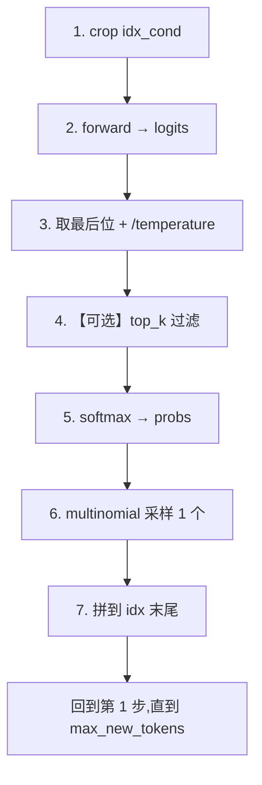

**关键**:**步骤 6 是真正"决定下一个 token 是什么"**,步骤 7 是"为下一次循环准备输入"。**没有这两步整个循环就不工作**。

#### 没有 KV cache 的具体后果

**Self-attention 中 Q 和 K 都从输入算出来**:

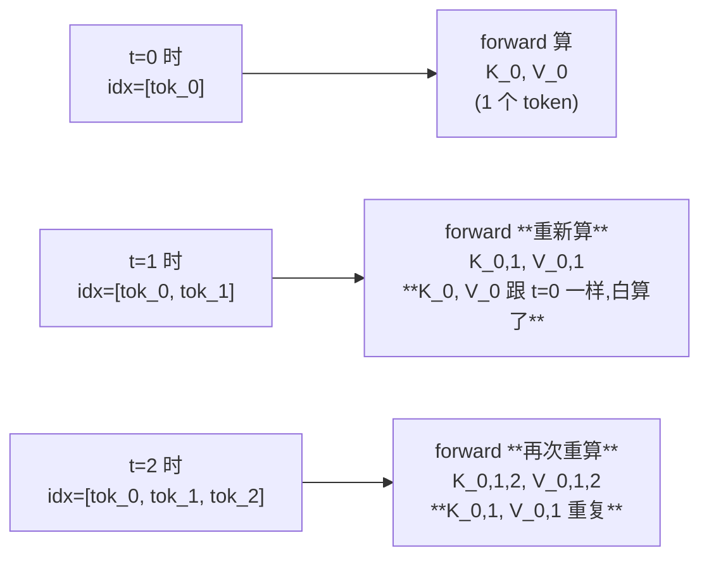

**算力对比**(生成 N 个 token):

| 实现 | 每步算力 | 总算力 | 类比 |
|---|---|---|---|
| **无 KV cache**(nanoGPT) | `O(t² · L · H · d)` | **`O(N³ · L · H · d)`** | 每次复习全书做下一题 |
| **有 KV cache** | `O(t · L · H · d)`(增量) | **`O(N² · L · H · d)`** | 复习一次,后面只做新增 |

对生成 1024 token,理论加速比 **~1024×**。

#### Karpathy 为啥不做?

**3 个原因**:

1. **教学优先**:nanoGPT 是"读懂 GPT 怎么工作"的教学代码,**KV cache 增加 50+ 行代码 + 复杂的 state 管理**,会模糊核心
2. **训练才是重点**:nanoGPT 主要用来**训**(训练时一次喂完整序列,根本不需要 cache);generate 只是 demo 用,慢点没关系
3. **优化哲学**:nanoGPT 的设计哲学是 "**简洁优于性能**"。要快用 vLLM、HuggingFace generate(都有 KV cache)

> 实际跑:nanoGPT generate 500 token ~ 30 秒(你 Phase 0 体验过)。如果换 KV cache 实现,~3 秒就够。但**学习的价值** > 速度。

#### 现代 LLM 推理框架都有 KV cache

| 框架 | KV cache | 备注 |
|---|---|---|
| **nanoGPT** | ❌ | 教学代码 |
| **HuggingFace transformers `generate`** | ✅ | `use_cache=True` 默认开 |
| **vLLM** | ✅ + paged attention | 工业级,推理 throughput 极高 |
| **llama.cpp** | ✅ | CPU/Apple Silicon 推理 |

---

### Q7.2：`idx_cond = idx if idx.size(1) <= block_size else idx[:, -block_size:]` 这行在干什么？

**答**:**确保输入序列长度不超过模型支持的 `block_size`**。如果当前 idx 长度 ≤ block_size,直接用;**超过则只留最后 block_size 个 token**(丢弃前面的)。这意味着**长生成时模型会"遗忘"早期对话**(超出 context window 的部分)。

**详解**:

```314:314:nanogpt-study/nanoGPT/model.py
            idx_cond = idx if idx.size(1) <= self.config.block_size else idx[:, -self.config.block_size:]
```

#### 何时触发?

你训练时 `block_size = 256`(模型支持的最大序列长度)。假设:

| 阶段 | `idx.size(1)` | `idx_cond.size(1)` | 行为 |
|---|---|---|---|
| 初始 prompt (10 token) | 10 | 10 | 全用,无裁剪 |
| 生成 100 token 后 | 110 | 110 | 全用,无裁剪 |
| 生成 246 token 后 | 256 | 256 | 全用,**临界点** |
| 生成 247 token 后 | 257 | **256**(裁掉第 0 个) | **开始裁剪** |
| 生成 500 token 后 | 510 | **256**(只留最后 256) | **前 254 个 token 被"遗忘"** |

#### `idx[:, -block_size:]` 的语义

PyTorch 切片:`-block_size:` = "从倒数第 block_size 个开始到末尾",**保留最后 block_size 个**。

```python
idx.shape = (B, 510)
idx[:, -256:].shape = (B, 256)  # 只留最后 256 个
```

#### 模型"丢失"的是什么?

**不是"后续 sequence"**(后续 token 还没生成),**是"前缀"**:

```
原 idx (510 长):  [tok_0, tok_1, ..., tok_253, tok_254, ..., tok_509]
                  ↑----------------↑          ↑----------------↑
                  这 254 个被丢弃              保留最后 256 个

idx_cond:                                     [tok_254, ..., tok_509]
```

**后果**:模型在生成第 511 个 token 时,**完全看不到** `tok_0` ~ `tok_253` 的信息。如果 prompt 在前面("ROMEO: ..."),长生成后模型可能"忘了"自己在演哪个角色。

#### 这是 fundamental 的限制吗?

**是 GPT-2 架构的硬限制**(position embedding 表只有 block_size 行)。后来的工作:

| 方案 | 怎么解决 |
|---|---|
| **更大的 block_size** | GPT-2: 1024,GPT-3: 2048,GPT-4: 8K-128K,Claude: 200K |
| **RoPE**(Rotary Position Embedding) | 不用 learned PE,直接用旋转编码,理论上可推广到任意长度 |
| **ALiBi** | 用线性偏置代替 PE,推广性更好 |
| **External memory / retrieval** | 把"遗忘"的内容存到外部数据库,按需查回来 |

nanoGPT shakespeare_char 用最简单的 learned PE + 硬截断,**够教学但不实用**。

---

### Q7.3：temperature、top_k 各自如何影响采样分布？

**答**:**temperature 软压缩**(`logits / T`,T<1 让分布变尖,T>1 让分布变平);**top_k 硬截断**(只保留前 k 个 logit,其他设 -inf,softmax 后 = 0)。两者配合使用 = 既保多样性又避免低质量采样。

**详解**:

详见 `notes/00_setup.md` Q4.1(Phase 0 你已经学过),这里精炼:

```318:322:nanogpt-study/nanoGPT/model.py
            logits = logits[:, -1, :] / temperature
            if top_k is not None:
                v, _ = torch.topk(logits, min(top_k, logits.size(-1)))
                logits[logits < v[:, [-1]]] = -float('Inf')
```

#### temperature 的影响

| temperature | 数学效果 | 分布形状 | 采样行为 |
|---|---|---|---|
| **T = 1** | 不变 | 原始分布 | 标准 sampling |
| **T < 1**(如 0.8、0.5、0.2) | logits 放大 | 变 **尖** | 偏向高概率 token(更保守) |
| **T → 0** | logits 放大到 inf | 一个 token 占 ~100% | **近 greedy**(始终选最大) |
| **T > 1**(如 1.5、5.0) | logits 压缩 | 变 **平均** | 低概率 token 也容易被采(更随机) |
| **T = 0** | **除零!** | — | **代码会报错**,要 greedy 用 T=1e-5 或 top_k=1 |

#### top_k 的影响

`top_k=k`:**只在前 k 个最可能的 token 里采样**,其他全部清零。

| top_k | 行为 |
|---|---|
| `None` | 不过滤,用完整 vocab |
| `k=1` | greedy,只选最大那个 |
| `k=200`(GPT-2 默认) | 砍掉长尾 99%,只在 top 200 里采 |
| `k > vocab_size` | **完全失效**(`min(k, vocab)` 取 vocab) |

#### 你 Phase 0 学过的关键陷阱

**char-level vocab=65,top_k=200 > 65 → top_k 完全失效!**

```python
min(top_k, logits.size(-1)) = min(200, 65) = 65  # 全员入围,无人被砍!
```

所以你的 sample.py 默认参数下,**只有 temperature 在起作用**,top_k 是 no-op。

#### 4 种典型失败模式(回顾 Phase 0)

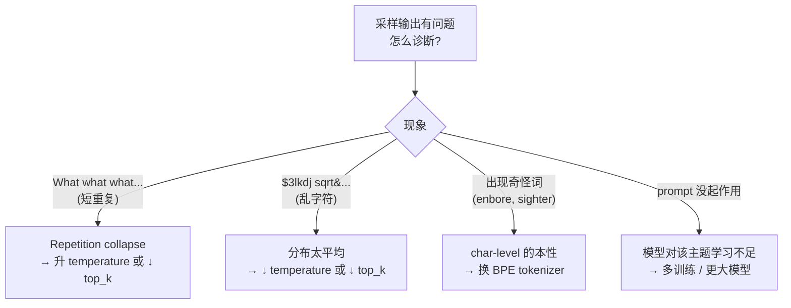

> 详细原理见 `notes/00_setup.md` Q4。

---

#### ⚠️ Round 4 答疑深化:temperature 方向**极易混**

**误区**:"temperature 越低分布越平?" ❌ **反了!温度越低分布越尖**(更确定),**温度越高分布越平**(更随机)。

**物理类比**(为啥叫"温度"):温度高 → 分子运动快 → 分布"涨开";温度低 → 分子运动慢 → 分布"凝聚"。这跟统计力学 Boltzmann 分布 $p \propto e^{-E/kT}$ 命名一致。

**用具体数字记忆**(假设 logits = `[2, 1, 0]`):

| temperature | 缩放后 logits | softmax 概率 | 分布形状 | 行为 |
|---|---|---|---|---|
| **T=0.1** | `[20, 10, 0]` | **`[1.0, 4.5e-5, 2e-9]`** | **极尖** | 几乎只选第 0 个 → 近 greedy |
| **T=1.0** | `[2, 1, 0]` | `[0.67, 0.24, 0.09]` | 默认 | 标准 sampling |
| **T=2.0** | `[1.0, 0.5, 0]` | `[0.51, 0.31, 0.18]` | 偏平均 | 低概率 token 更易被采 → 更随机 |

**为啥温度小让分布尖?数学直觉**:
- softmax 用 $e^x$ 放大差异:`logits / T` 让 `T` 小时分子被放大,大的更大、小的相对更小 → softmax 后差距悬殊
- `T` 大时分子被压缩,所有 logits 接近 → softmax 后趋于均匀

---

#### ⚠️ Round 4 答疑深化:`-float('Inf')` 是**负**无穷

`top_k` 过滤代码:

```python
logits[logits < v[:, [-1]]] = -float('Inf')
```

注意是 `-float('Inf')`(**负无穷**),不是 `float('Inf')`(正无穷)。

**为啥要负无穷**?**因为 `e^(-inf) = 0`**,softmax 后那些位置概率 = 0,采样永远不会采到:

```python
# softmax 内部
e^(-inf) = 0          # 这个 token 概率 = 0
e^(其他 logits)        # 正常计算
sum(...) = 只剩 top_k 的和
归一化 → top_k 内的概率重新归一到 1
```

如果用正无穷会怎样?那个位置会变成 `e^∞ = inf`,**softmax 算出 `inf/inf` = nan**,模型彻底崩。

---

### Q7.4 generate 关键 API + estimate_mfu(Round 4 答疑深化)

> Round 4 用户追问:"L326, L327 在做什么?需要逐行解释 generate"、"estimate_mfu 这个函数在干什么?为啥没地方调用?"

#### `torch.multinomial(probs, num_samples=1)` 详解

```326:326:nanogpt-study/nanoGPT/model.py
            idx_next = torch.multinomial(probs, num_samples=1)
```

**功能**:**按 probs 这个概率分布做加权随机抽样**,返回采到的 index。

```python
probs = torch.tensor([[0.7, 0.2, 0.1]])
torch.multinomial(probs, num_samples=1)
# 70% 概率返回 [[0]]
# 20% 概率返回 [[1]]
# 10% 概率返回 [[2]]
```

**类比抽奖**:probs 是号码的中奖概率,multinomial 转一次轮盘抽 1 个出来。

**`generate` 里的用法**:`probs.shape = (B, V)` 是 50257 个 token 的概率分布,`multinomial(probs, num_samples=1)` 在每个 batch 里采 1 个 token,返回 shape `(B, 1)` 的 token id。

> **Q7.3 的 temperature 和 top_k 调的就是这里的 probs 分布**。temperature/top_k 让 probs 更尖或更平,multinomial 按这个分布抽样。

#### `torch.cat((a, b), dim=1)` 详解

```328:328:nanogpt-study/nanoGPT/model.py
            idx = torch.cat((idx, idx_next), dim=1)
```

**功能**:**沿指定维度拼接两个 tensor**,其他维度 size 必须一致。

```python
a = torch.tensor([[1, 2, 3]])   # shape (1, 3)
b = torch.tensor([[4]])          # shape (1, 1)
torch.cat((a, b), dim=1)         # → [[1, 2, 3, 4]], shape (1, 4)
```

**`generate` 里的用法**:`idx.shape = (B, T)`,新采的 `idx_next.shape = (B, 1)`,`cat((idx, idx_next), dim=1)` 沿 T 维拼接,**idx 长度 +1**,变 `(B, T+1)`。

**每生成 1 个 token → idx 的 T 维 +1**。这就是为啥 Q7.2 需要 `idx_cond` 截断:**idx 一直在变长,可能超过 block_size**。

#### `@torch.no_grad()` 详解(L305)

```305:305:nanogpt-study/nanoGPT/model.py
    @torch.no_grad()
```

装饰器,**关闭这个函数内部的 autograd**(梯度追踪)。

- **训练**需要 autograd 算梯度,因为要 `loss.backward()`
- **推理**不需要,关掉省一半显存(不用存中间激活)
- nanoGPT 的 generate 是纯推理,装上 `@torch.no_grad()` 完全合理

#### generate 完整逐行表

| 行 | 代码 | 干什么 |
|---|---|---|
| L305 | `@torch.no_grad()` | 关闭 autograd,省显存 |
| L306 | `def generate(idx, max_new_tokens, temperature=1.0, top_k=None)` | 起始序列、新 token 数、温度、top_k |
| L312 | `for _ in range(max_new_tokens):` | 循环 N 次,每次生成 1 个 |
| L314 | `idx_cond = idx if ... else idx[:, -block_size:]` | 上下文超长就截断到 block_size |
| L316 | `logits, _ = self(idx_cond)` | 前向 forward,**走 `targets=None` 分支,只算最后位** |
| L318 | `logits = logits[:, -1, :] / temperature` | 取最后位 logits,缩放(温度调节) |
| L319-322 | top_k 过滤 | 把非 top_k 设 -inf |
| L324 | `probs = F.softmax(logits, dim=-1)` | softmax 变概率分布 |
| **L326** | `idx_next = torch.multinomial(probs, 1)` | **按概率抽样 1 个 token** |
| **L328** | `idx = torch.cat((idx, idx_next), dim=1)` | **新 token 拼到 idx 末尾,长度 +1** |
| L330 | `return idx` | 返回完整序列(prompt + 新生成) |

---

### Q7.5: `estimate_mfu` 是干啥的?谁调用?

> Round 4 用户追问:"estimate_mfu 这个函数在干什么?为啥没地方调用?"

**答**:**MFU = Model FLOPs Utilization**,**估算你的训练实际利用了 GPU 算力的多少百分比**。这是个**性能监控指标**,在 `train.py` 每个 log step 打印,让你知道训练是否高效。**模型定义里有这个方法,但调用方在外部**(train.py L325 / bench.py L115),所以 `model.py` 里搜不到调用。

**详解**:

```289:303:nanogpt-study/nanoGPT/model.py
    def estimate_mfu(self, fwdbwd_per_iter, dt):
        """ estimate model flops utilization (MFU) in units of A100 bfloat16 peak FLOPS """
        # first estimate the number of flops we do per iteration.
        # see PaLM paper Appendix B as ref: https://arxiv.org/abs/2204.02311
        N = self.get_num_params()
        cfg = self.config
        L, H, Q, T = cfg.n_layer, cfg.n_head, cfg.n_embd//cfg.n_head, cfg.block_size
        flops_per_token = 6*N + 12*L*H*Q*T
        flops_per_fwdbwd = flops_per_token * T
        flops_per_iter = flops_per_fwdbwd * fwdbwd_per_iter
        # express our flops throughput as ratio of A100 bfloat16 peak flops
        flops_achieved = flops_per_iter * (1.0/dt) # per second
        flops_promised = 312e12 # A100 GPU bfloat16 peak flops is 312 TFLOPS
        mfu = flops_achieved / flops_promised
        return mfu
```

#### MFU 是什么?

| 指标 | 含义 | A100 的值 |
|---|---|---|
| `flops_promised` | GPU 理论峰值算力 | 312 TFLOPS(bf16) |
| `flops_achieved` | 你每秒实际算了多少 FLOPs | 训练时实测 |
| **MFU = achieved / promised** | **利用率(0~1)** | GPT-3 训练时约 50%,nanoGPT shakespeare 大约 5-20% |

#### 公式拆解

```
flops_per_token = 6N + 12·L·H·Q·T
                   ↑      ↑
                   主体(forward+backward 每个参数 ~6 FLOPs)
                          attention 那部分专门加(因为不是 N 的简单函数)

flops_per_fwdbwd = flops_per_token × T   (一个 batch 里 T 个 token)
flops_per_iter   = flops_per_fwdbwd × fwdbwd_per_iter
                                       ↑
                                       gradient_accumulation_steps
flops_achieved   = flops_per_iter / dt   (每秒)
mfu              = flops_achieved / flops_promised
```

这个公式来自 [PaLM paper](https://arxiv.org/abs/2204.02311) Appendix B,**业界标准 MFU 计算法**。

#### 为啥要算 MFU?

- **训练效率诊断**:MFU 高 = 充分利用 GPU,MFU 低 = GPU 大部分时间在等数据/通信
- **业界基准**:**MFU > 50% 是优秀,< 20% 多半有优化空间**
- **优化方向**:更大 batch、更长 T、`torch.compile`、fused optimizer、bf16、Flash Attention 等

#### 调用位置(为啥 model.py 里搜不到?)

**`model.py` 里只定义,实际调用在外部脚本**:

```325:325:nanogpt-study/nanoGPT/train.py
            mfu = raw_model.estimate_mfu(batch_size * gradient_accumulation_steps, dt)
```

```115:115:nanogpt-study/nanoGPT/bench.py
        mfu = model.estimate_mfu(batch_size * 1 * num_steps, dt)
```

- **`train.py`**:训练时每个 log step 打印 MFU,让你看训练效率
- **`bench.py`**:专门的性能压测脚本,跑几步看 FLOPs 利用率

Phase 3 读 train.py 时会再看到。

> **设计哲学**:**模型定义层 vs 使用层分离**。`model.py` 定义"模型能算 MFU 这件事",**使用层(train.py)** 决定**何时调用、怎么用结果**(打印日志、做 alert 等)。这跟 `from_pretrained` 同理。

---

## 八、configure_optimizers

> 🟢 **2026-06-10 Phase 2 Round 4 实战回填**

### Q8.1：为什么 2D 参数（Linear、Embedding 的 weight）加 weight decay，1D 参数（LayerNorm γ/β、bias）不加？

**答**:**2D 参数是模型容量的主体**(matmul 用的 + Embedding),**不约束容易过拟合**,所以加 `weight_decay = 0.1`。**1D 参数(LayerNorm γ/β, bias)有特殊物理意义,不能 decay**:LayerNorm γ 初始为 1,decay 到 0 会让 LN 全部输出 = 0(网络瘫痪);bias 是零点漂移,约束无意义。`.dim()` 一键分组,简单优雅。

**详解**:

```263:279:nanogpt-study/nanoGPT/model.py
    def configure_optimizers(self, weight_decay, learning_rate, betas, device_type):
        param_dict = {pn: p for pn, p in self.named_parameters()}
        param_dict = {pn: p for pn, p in param_dict.items() if p.requires_grad}
        # 关键 2 行:
        decay_params = [p for n, p in param_dict.items() if p.dim() >= 2]
        nodecay_params = [p for n, p in param_dict.items() if p.dim() < 2]
        optim_groups = [
            {'params': decay_params, 'weight_decay': weight_decay},
            {'params': nodecay_params, 'weight_decay': 0.0}
        ]
```

#### 参数分类表(以 nanoGPT 为例)

| 参数 | shape | `.dim()` | 分类 |
|---|---|---|---|
| `transformer.wte.weight` | (vocab, n_embd) | **2** | ✅ decay |
| `transformer.wpe.weight` | (block_size, n_embd) | **2** | ✅ decay |
| `transformer.h.*.attn.c_attn.weight` | (3*n_embd, n_embd) | **2** | ✅ decay |
| `transformer.h.*.attn.c_proj.weight` | (n_embd, n_embd) | **2** | ✅ decay |
| `transformer.h.*.mlp.c_fc.weight` | (4*n_embd, n_embd) | **2** | ✅ decay |
| `transformer.h.*.mlp.c_proj.weight` | (n_embd, 4*n_embd) | **2** | ✅ decay |
| `transformer.h.*.ln_1.weight`(LN γ) | (n_embd,) | **1** | ❌ no decay |
| `transformer.h.*.ln_2.weight` | (n_embd,) | **1** | ❌ no decay |
| `transformer.ln_f.weight` | (n_embd,) | **1** | ❌ no decay |
| 任何 `.bias` 参数 | (n,) | **1** | ❌ no decay |

#### `.dim()` 直觉

- shape `(n_embd,)` → **1D**(一维向量)
- shape `(vocab, n_embd)` → **2D**(二维矩阵)
- shape `(B, T, n_embd)` → **3D**(三维张量)

#### 📝 Round 4 答疑深化:`p.dim()` vs `p.size()` vs `p.shape`

> Round 4 用户追问:"p.dim() 是啥意思,比较的是啥大于 2?"

**核心区别**:**`p.dim()` 是"几个维度",`p.size()` / `p.shape` 是"每个维度的 size"**。

```python
W = torch.zeros(50304, 768)

W.dim()        # 2                          ← 2 个维度(2D 矩阵)
W.shape        # torch.Size([50304, 768])   ← 每维 size
W.size()       # torch.Size([50304, 768])   ← 同 shape
W.size(0)      # 50304                      ← 第 0 维 size
W.size(1)      # 768                        ← 第 1 维 size
W.numel()      # 38,633,472                 ← 总元素数 50304 × 768
```

**`dim()` 和 `size()` 不能混**:

| 张量 | `.dim()` | `.shape` |
|---|---|---|
| scalar(标量) | 0 | `torch.Size([])` |
| vector(向量) `[1, 2, 3]` | 1 | `torch.Size([3])` |
| matrix(矩阵)`[[1,2],[3,4]]` | 2 | `torch.Size([2, 2])` |
| 3D tensor `(B, T, C)` | 3 | `torch.Size([4, 256, 384])` |

**`p.dim() >= 2`** = "**这是个矩阵(或更高维)**",在 nanoGPT 里这正好把"主权重矩阵"(2D)跟"标量/向量类参数"(1D)分开。

#### 跟 NumPy 的对应关系

| PyTorch | NumPy | 含义 |
|---|---|---|
| `tensor.dim()` | `arr.ndim` | 几个维度 |
| `tensor.shape` | `arr.shape` | 每维 size 元组 |
| `tensor.size()` | `arr.shape` | 同 shape(PyTorch 多一个 size() 方法) |
| `tensor.numel()` | `arr.size` | 总元素数(NumPy 这里命名反过来了!) |

⚠️ **NumPy 的 `arr.size` 是总元素数,PyTorch 的 `tensor.size()` 是 shape**,**互相打架,初学很容易混**。

#### weight decay 是什么

**weight decay = L2 正则化(regularization)**,让权重在每步更新时**朝 0 收缩**一点。

普通 AdamW 更新规则(简化):

$$
w_{t+1} = w_t - \text{lr} \cdot g_t
$$

加上 weight decay:

$$
w_{t+1} = w_t - \text{lr} \cdot (g_t + \lambda \cdot w_t) = (1 - \text{lr} \cdot \lambda) \cdot w_t - \text{lr} \cdot g_t
$$

其中 `λ` = weight_decay 系数(nanoGPT 默认 **0.1**)。

**等价于**:每步 w 先按 `(1 - lr·λ)` 收缩,再减梯度。

#### 直觉

```mermaid
flowchart LR
    A["无 weight decay"] --> A1["w 可以无限增长<br/>(没人约束)"]
    A1 --> A2["权重过大 → 过拟合<br/>(模型记住训练集而不是 generalize)"]
    
    B["有 weight decay"] --> B1["每步 w 朝 0 拉一点<br/>(类似橡皮筋)"]
    B1 --> B2["权重保持适中<br/>泛化能力更强"]
```

**物理意义**:**"奥卡姆剃刀"** —— 倾向于学小权重的模型(更简单),因为简单模型泛化更好。

#### 为啥 2D 加,1D 不加?

**2D 参数**(`weight`)是模型"容量"的主体:
- attention 的 W_Q, W_K, W_V, W_O
- MLP 的 W1, W2
- Embedding 表

→ **不约束容易过拟合**,所以加 weight decay。

**1D 参数**(LayerNorm γ/β, bias)**有特殊物理意义,加 decay 会破坏功能**:

| 参数 | 初始值 | 加 decay 会怎样 |
|---|---|---|
| **LayerNorm γ**(`ln_*.weight`) | **1** | 收缩到 0 → **LayerNorm 输出 = 0,整个网络瘫痪** |
| **LayerNorm β / bias** | 0 | 已经是 0,decay 无效;加上没害处也没用 |
| **`bias` (Linear)** | 0 | 同上,冗余 |

**LayerNorm γ 不能 decay 的关键**:

```
LayerNorm 公式:y = γ · (x - μ) / σ + β

γ 初始值 = 1 → y ≈ (x - μ) / σ
γ 被 decay 到 0 → y = 0 + β = β → **所有 token 的 LN 输出都一样!**
```

→ **LN 全瘫,模型废了**。所以 PyTorch 标准实践是 **LayerNorm γ/β 永远不 decay**。

#### 工程优雅

```python
decay_params = [p for n, p in param_dict.items() if p.dim() >= 2]
nodecay_params = [p for n, p in param_dict.items() if p.dim() < 2]
```

**用 `.dim()` 一键分组** —— 1D 参数恰好都是不该 decay 的(LN γ/β + bias),2D 参数恰好都是该 decay 的(matmul weight + embedding)。**简单优雅**。

#### 实证

HuggingFace、nanoGPT、Llama、所有现代 LLM 都遵循:
- **2D weight** → weight_decay = 0.1(或类似)
- **1D weight & bias** → weight_decay = 0

---

### Q8.2：`fused=True` 是什么？什么条件下能开？

**答**:`fused AdamW` 是**把 AdamW 的多个 element-wise 操作融合成 1 个 CUDA kernel**,减少 5 次 kernel launch + 5 次显存读写 → **加速 2-3×**。开启条件:**PyTorch ≥ 1.12 支持 + 必须在 CUDA 设备上**(CPU 没有这种优化)。nanoGPT 用 `inspect.signature` 检测当前 PyTorch 版本支不支持,**这是 duck typing 的好实践**。

**详解**:

```281:285:nanogpt-study/nanoGPT/model.py
        fused_available = 'fused' in inspect.signature(torch.optim.AdamW).parameters
        use_fused = fused_available and device_type == 'cuda'
        extra_args = dict(fused=True) if use_fused else dict()
        optimizer = torch.optim.AdamW(optim_groups, lr=learning_rate, betas=betas, **extra_args)
        print(f"using fused AdamW: {use_fused}")
```

#### `inspect.signature` 是什么?

```python
fused_available = 'fused' in inspect.signature(torch.optim.AdamW).parameters
```

逐项翻译:
- `torch.optim.AdamW` 是 AdamW 优化器类
- `inspect.signature(...)` 拿到函数/类的签名(参数列表)
- `.parameters` 是个 dict,key 是参数名
- `'fused' in ...` 检查这个 dict 里有没有名为 `fused` 的参数

#### 为啥要检查?

| PyTorch 版本 | AdamW 支持 fused? |
|---|---|
| < 1.12 | **没有** `fused` 参数,传了会报错 |
| ≥ 1.12 | 有 `fused=True/False` 参数 |
| ≥ 2.0 | fused 默认行为更稳健 |

#### 跟版本号判断对比(为啥用 inspect 更好)

```python
# 写法 1(脆):靠版本号
if torch.__version__ >= '1.12':
    fused = True  # ← 版本号字符串比较容易错(比如 '1.12.0a0')

# 写法 2(稳):靠 inspect(nanoGPT 用的)
if 'fused' in inspect.signature(torch.optim.AdamW).parameters:
    fused = True  # ← 直接看函数支不支持,版本无关
```

**这是 Python 工程的好习惯:duck typing(看能不能用,不看版本号)**。

#### Fused AdamW 是什么?

**核心思想**:把 AdamW 的多个 element-wise 操作融合成 1 个 CUDA kernel。

**普通 AdamW 每步做 5 件事**:

```mermaid
flowchart TB
    A["1. 算 m_t = β1·m + (1-β1)·g<br/>(动量,逐元素乘加)"] --> B["2. 算 v_t = β2·v + (1-β2)·g²<br/>(方差,逐元素乘加平方)"]
    B --> C["3. 算偏置修正 m_hat, v_hat<br/>(逐元素除)"]
    C --> D["4. weight decay: w = w - lr·λ·w<br/>(逐元素乘减)"]
    D --> E["5. 更新 w = w - lr · m_hat / (sqrt(v_hat) + eps)<br/>(逐元素加减乘除)"]
    
    Note["普通版:5 步,每步 1 个 CUDA kernel<br/>→ **5 次 kernel launch + 5 次显存读写**"]
```

**Fused AdamW**:

```mermaid
flowchart LR
    A["**1 个大 CUDA kernel**<br/>一次性做完上面 5 步<br/>所有 element-wise 操作融合"]
```

**对比**:

| | 普通 AdamW | Fused AdamW |
|---|---|---|
| CUDA kernel launch 次数 | 5 | **1** |
| 显存读写次数 | 5 次 | **1 次** |
| 每步耗时 | baseline | **快 2-3×** |
| 训练吞吐 | baseline | **总训练时间省 5-15%** |

#### 跟其他 fusion 优化的共通点

**Kernel fusion(内核融合)在现代 GPU 训练里到处都是**:

| 优化 | 融合什么 | 在哪学过 |
|---|---|---|
| `c_attn = nn.Linear(C, 3·C)` | 3 个 matmul → 1 个 matmul | Q2.1 |
| **Flash Attention** | softmax + matmul + mask 融合 | Q2.3 |
| **`fused AdamW`** | AdamW 的 5 步 element-wise 融合 | **本题** |
| **`torch.compile`** | 多个 op 自动融合(整个图) | Phase 0 |

**统一哲学**:**减少 kernel launch + 减少显存读写 = GPU 训练的核心优化**。

#### 为啥只在 CUDA 上开?

```python
use_fused = fused_available and device_type == 'cuda'
```

**CPU 没有 fused AdamW 实现**:
- CPU 的 AdamW 用 PyTorch C++ 实现,各步骤已经在一个函数里(不存在 kernel launch overhead 问题)
- "Fused" 是 **GPU 特定的优化**,CPU 上没意义
- PyTorch 在 CPU 上传 `fused=True` 会报错或被忽略

所以代码用 `device_type == 'cuda'` 做 guard。这跟 `c_attn` 合并、Flash Attention 都是**只有 GPU 才有意义**的优化。

---

## 九、from_pretrained

> 🟢 **2026-06-10 Phase 2 Round 4 实战回填**

### §9.0 from_pretrained 调用方式(Round 4 答疑深化)

> Round 4 用户追问:"nanoGPT 加载的是哪个 GPT-2?gpt2/medium/large/xl?从哪能看出来?这个函数为啥也没地方调用?"

**答**:**加载哪个由调用方传入的 `model_type` 字符串决定**(`'gpt2'` / `'gpt2-medium'` / `'gpt2-large'` / `'gpt2-xl'`,共 4 种)。**`model.py` 里只定义,实际调用在外部脚本**(train.py L185 / sample.py L49)。**通过外部配置文件的 `init_from` 变量触发**。

#### 加载哪个?4 种选择

```215:220:nanogpt-study/nanoGPT/model.py
        config_args = {
            'gpt2':         dict(n_layer=12, n_head=12, n_embd=768),  # 124M params
            'gpt2-medium':  dict(n_layer=24, n_head=16, n_embd=1024), # 350M params
            'gpt2-large':   dict(n_layer=36, n_head=20, n_embd=1280), # 774M params
            'gpt2-xl':      dict(n_layer=48, n_head=25, n_embd=1600), # 1558M params
        }[model_type]
```

| model_type | 参数 | 大小 | 推理显存(bf16) |
|---|---|---|---|
| `'gpt2'` | 12 层 / 12 头 / 768 | **124M**(small) | ~250MB |
| `'gpt2-medium'` | 24 / 16 / 1024 | **350M** | ~700MB |
| `'gpt2-large'` | 36 / 20 / 1280 | **774M** | ~1.5GB |
| `'gpt2-xl'` | 48 / 25 / 1600 | **1558M**(1.5B) | ~3GB |

#### 谁调用 `from_pretrained`?

**`model.py` 里不调用**,因为模型定义层不该决定"加载哪个权重",这是个**使用层决策**。

**sample.py 怎么调?**

```47:49:nanogpt-study/nanoGPT/sample.py
elif init_from.startswith('gpt2'):
    # init from a given GPT-2 model
    model = GPT.from_pretrained(init_from, dict(dropout=0.0))
```

**train.py 怎么调(用于 finetune)?**

```181:185:nanogpt-study/nanoGPT/train.py
elif init_from.startswith('gpt2'):
    print(f"Initializing from OpenAI GPT-2 weights: {init_from}")
    # initialize from OpenAI GPT-2 weights
    override_args = dict(dropout=dropout)
    model = GPT.from_pretrained(init_from, override_args)
```

#### `init_from` 这个变量从哪来?

| 来源 | 默认值 | 文件 |
|---|---|---|
| **train.py L41** | `'scratch'` | 从头训练 |
| **config/finetune_shakespeare.py L11** | `'gpt2-xl'` | finetune GPT-2 XL |
| **config/eval_gpt2*.py** | `'gpt2'`/`'gpt2-medium'`/`'gpt2-large'`/`'gpt2-xl'` | 评估对应 GPT-2 |

#### 怎么真正触发加载 GPT-2?

```bash
# 用 sample.py 直接拿 GPT-2 small 生成文本
python sample.py --init_from=gpt2

# 用 sample.py 拿最大的 GPT-2 XL
python sample.py --init_from=gpt2-xl

# 用 train.py 在 shakespeare 上 finetune gpt2-xl
python train.py config/finetune_shakespeare.py

# 评估 gpt2 在某数据集上的 perplexity
python train.py config/eval_gpt2.py
```

#### 为啥这种分层设计?

```mermaid
flowchart TB
    A["model.py<br/>(模型架构定义层)"] --> A1["GPT 类 + forward 逻辑 + init<br/>**只定义,不决策**"]
    A1 -.提供.-> B["sample.py / train.py<br/>(使用层)"]
    B --> B1["决定 init_from='gpt2' or 'scratch'<br/>**只决策,不定义**"]
    B1 -.读取.-> C["config/*.py<br/>(配置层)"]
    C --> C1["finetune_shakespeare.py: init_from='gpt2-xl'<br/>eval_gpt2.py: init_from='gpt2'<br/>..."]
```

**好处**:
1. **模块化**:换 backbone 只改 model.py,换训练策略只改 train.py
2. **配置驱动**:加新实验只加 config 文件,不动代码
3. **`@classmethod` 神奇之处**:可以**不实例化就调用**(`GPT.from_pretrained('gpt2')` vs `model = GPT(); model.from_pretrained(...)`)

---

### Q9.1：HF 的 GPT-2 用 `Conv1D`，nanoGPT 用 `nn.Linear`，权重转换为啥要 `.t()` 转置？

**答**:**HF 的 Conv1D 跟"卷积"半毛钱关系都没有 —— 它就是个 nn.Linear,但 weight shape 跟 nn.Linear 正好相反**(Conv1D: `(in, out)`;nn.Linear: `(out, in)`)。所以 copy 时必须 `.t()` 行列对调。这是 OpenAI 当年 TensorFlow 移植过来的历史命名 + 历史包袱,**不要被名字误导**。

**详解**:

```245:254:nanogpt-study/nanoGPT/model.py
        transposed = ['attn.c_attn.weight', 'attn.c_proj.weight', 'mlp.c_fc.weight', 'mlp.c_proj.weight']
        # basically the openai checkpoints use a "Conv1D" module, but we only want to use a vanilla Linear
        # this means that we have to transpose these weights when we import them
        assert len(sd_keys_hf) == len(sd_keys), f"mismatched keys: {len(sd_keys_hf)} != {len(sd_keys)}"
        for k in sd_keys_hf:
            if any(k.endswith(w) for w in transposed):
                # special treatment for the Conv1D weights we need to transpose
                assert sd_hf[k].shape[::-1] == sd[k].shape
                with torch.no_grad():
                    sd[k].copy_(sd_hf[k].t())
```

#### HF Conv1D 究竟是什么?

**关键:HF 的 Conv1D 跟"卷积"半毛钱关系都没有 —— 它就是个 nn.Linear**。

HF Conv1D 源码(简化版):

```python
# transformers/pytorch_utils.py 里大约这样:
class Conv1D(nn.Module):
    def __init__(self, nf, nx):
        super().__init__()
        self.nf = nf  # ← 输出维度
        self.nx = nx  # ← 输入维度
        self.weight = nn.Parameter(torch.empty(nx, nf))  # ← shape (in, out)!!
        self.bias = nn.Parameter(torch.zeros(nf))
    
    def forward(self, x):
        # x.shape = (..., nx)
        size_out = x.size()[:-1] + (self.nf,)
        x = torch.addmm(self.bias, x.view(-1, x.size(-1)), self.weight)  # x @ W + b
        x = x.view(*size_out)
        return x
```

#### Conv1D vs nn.Linear 关键差异

| | **HF Conv1D** | **PyTorch nn.Linear** |
|---|---|---|
| `weight.shape` | **(in, out)** | **(out, in)** |
| forward | `x @ W + b` | `x @ W.T + b`(内部自动 .T) |
| 数学输出 | 完全一样 | 完全一样 |

→ **两者只是 weight 的"行列约定"相反**,数学等价。

#### 为啥叫 Conv1D?(历史包袱)

OpenAI 当年是从 TensorFlow 移植过来的,**TF 里 conv1d 在某种 weight ordering 下跟 dense layer 等价**,于是 OpenAI 就这么命名了。

HuggingFace 复刻 GPT-2 时也用 Conv1D 保持 weight 格式兼容(可以直接 load OpenAI 的 .ckpt),**这成了历史包袱**,被一代代 LLM 库继承下来。

**Karpathy 的 nanoGPT 用 nn.Linear**(更"PyTorch-native"),所以加载 HF 权重时要把 `(in, out)` → `(out, in)` 转一下。

#### 代码逐行解读

```python
# Step 1: 定义需要转置的 4 类 key 名称
transposed = ['attn.c_attn.weight', 'attn.c_proj.weight', 'mlp.c_fc.weight', 'mlp.c_proj.weight']

# Step 2: 遍历 HF 的所有 key
for k in sd_keys_hf:
    if any(k.endswith(w) for w in transposed):
        # Step 3a: 在 transposed 列表里 → 转置后 copy
        assert sd_hf[k].shape[::-1] == sd[k].shape  # ← 验证 reverse 后相等
        with torch.no_grad():
            sd[k].copy_(sd_hf[k].t())              # ← .t() 行列对调
    else:
        # Step 3b: 不在 → 直接 copy
        assert sd_hf[k].shape == sd[k].shape       # ← 验证 shape 直接一致
        with torch.no_grad():
            sd[k].copy_(sd_hf[k])
```

#### 关键 API

**`sd_hf[k].shape[::-1]`**:
- `[::-1]` 是 Python 切片语法,对 tuple/list 是 "reverse"
- 例:`(768, 2304)[::-1]` → `(2304, 768)`

**`.t()` 转置**:
- 对 2D 张量是行列对调
- 等价于 `.transpose(0, 1)`
- 例:`(768, 2304).t()` → `(2304, 768)`

**`with torch.no_grad():`**:
- 临时关闭 gradient tracking
- 因为我们在做 weight 初始化,**不需要计算梯度**
- 否则 `copy_` 会被记录在 autograd graph 里,浪费内存

---

### Q9.2：哪些权重是直接 copy、哪些要 transpose？给一张映射表

**答**:**只有 HF 用 Conv1D 实现的 4 类 weight 要转置**(attn.c_attn / attn.c_proj / mlp.c_fc / mlp.c_proj —— 都是线性变换矩阵)。**其他权重(Embedding / LayerNorm / 所有 bias)直接 copy**,因为 HF 这些地方用的 nn.Embedding / nn.LayerNorm 跟 PyTorch 标准一致,或者是 1D 向量(转置无意义)。

**详解**:

#### HF GPT-2 vs nanoGPT 完整映射表(以 GPT-2 124M 为例)

| HF 路径 | nanoGPT 路径 | HF 模块 | shape (HF) | shape (nano) | 操作 |
|---|---|---|---|---|---|
| `transformer.wte.weight` | `transformer.wte.weight` | nn.Embedding | (50257, 768) | (50257, 768) | **copy**(同) |
| `transformer.wpe.weight` | `transformer.wpe.weight` | nn.Embedding | (1024, 768) | (1024, 768) | **copy**(同) |
| `transformer.h.*.ln_1.weight` | `transformer.h.*.ln_1.weight` | nn.LayerNorm | (768,) | (768,) | **copy**(同) |
| `transformer.h.*.ln_1.bias` | `transformer.h.*.ln_1.bias` | nn.LayerNorm | (768,) | (768,) | **copy**(同) |
| **`transformer.h.*.attn.c_attn.weight`** | **同名** | **Conv1D** | **(768, 2304)** | **(2304, 768)** | **`.t()` 转置 + copy** |
| `transformer.h.*.attn.c_attn.bias` | 同名 | Conv1D bias | (2304,) | (2304,) | **copy**(1D 无转置) |
| **`transformer.h.*.attn.c_proj.weight`** | **同名** | **Conv1D** | **(768, 768)** | **(768, 768)** | **`.t()` 转置 + copy**(对称矩阵 shape 一样但元素位置不同!) |
| `transformer.h.*.attn.c_proj.bias` | 同名 | Conv1D bias | (768,) | (768,) | **copy** |
| `transformer.h.*.ln_2.weight` | 同名 | nn.LayerNorm | (768,) | (768,) | **copy** |
| `transformer.h.*.ln_2.bias` | 同名 | nn.LayerNorm | (768,) | (768,) | **copy** |
| **`transformer.h.*.mlp.c_fc.weight`** | **同名** | **Conv1D** | **(768, 3072)** | **(3072, 768)** | **`.t()` 转置 + copy** |
| `transformer.h.*.mlp.c_fc.bias` | 同名 | Conv1D bias | (3072,) | (3072,) | **copy** |
| **`transformer.h.*.mlp.c_proj.weight`** | **同名** | **Conv1D** | **(3072, 768)** | **(768, 3072)** | **`.t()` 转置 + copy** |
| `transformer.h.*.mlp.c_proj.bias` | 同名 | Conv1D bias | (768,) | (768,) | **copy** |
| `transformer.ln_f.weight` | 同名 | nn.LayerNorm | (768,) | (768,) | **copy** |
| `transformer.ln_f.bias` | 同名 | nn.LayerNorm | (768,) | (768,) | **copy** |
| `lm_head.weight` | (跟 wte tied) | — | (50257, 768) | (50257, 768) | **不单独 copy**(weight tying) |

#### 规律图

```mermaid
flowchart TB
    A["GPT-2 所有 weight"] --> B{"HF 用什么 module?"}
    B -->|"Conv1D<br/>(4 类)"| C["**weight 形状跟 nn.Linear 相反**<br/>需要 .t() 转置"]
    B -->|"nn.Embedding<br/>(wte, wpe)"| D["形状完全一致<br/>直接 copy"]
    B -->|"nn.LayerNorm<br/>(所有 ln_*)"| E["形状完全一致<br/>直接 copy"]
    B -->|"任何 bias<br/>(1D 向量)"| F["1D 张量无所谓 transpose<br/>直接 copy"]
```

#### 4 类需要转置的 weight 的共同点

```python
transposed = [
    'attn.c_attn.weight',    # Q/K/V 合并投影
    'attn.c_proj.weight',    # attention 输出投影
    'mlp.c_fc.weight',       # MLP 第一层
    'mlp.c_proj.weight',     # MLP 第二层
]
```

**它们都是"线性变换矩阵"(matmul 用的)**。其他参数:
- **Embedding** 是查找表,不是 matmul
- **LayerNorm γ/β** 是 element-wise scale/shift,不是 matmul
- **bias** 是 1D 向量,转置等于不变

**所以转置规则的本质 = "HF 用 Conv1D 的 weight 都要转,其他不用"**。

#### 实战:加载 GPT-2 124M 跑一段

```python
# 一行加载预训练 GPT-2 124M
model = GPT.from_pretrained('gpt2')  

# 现在你的 nanoGPT 模型有了 124M 参数,可以直接生成英文
# 而你只用了 5 分钟训自己的 baby GPT(10.6M 莎士比亚)

# 用它做点啥:
# 1. 直接 generate
# 2. 在你的领域数据上 finetune
# 3. 给它装个分类头,做下游任务
```

**from_pretrained 是 nanoGPT 提供的"作弊通道"**:不用花几天训自己的 GPT-2,**直接用 OpenAI 训好的**。

---

### Round 4 自检清单

闭卷自测:

#### §七 generate

- [ ] generate 7 步循环顺序是什么?
- [ ] 没 KV cache 算力是 O(N³),有 cache 是 O(N²),为啥 Karpathy 不做?
- [ ] `idx_cond` crop 是丢弃前缀还是后缀?长生成会"遗忘"什么?
- [ ] temperature 跟 top_k 区别?(软压缩 vs 硬截断)

#### §八 configure_optimizers

- [ ] weight decay 数学公式?(`w = (1 - lr·λ) · w - lr · g`)
- [ ] 物理意义?(L2 正则化,防过拟合)
- [ ] 为啥 2D 加 decay,1D 不加?(2D 是模型容量主体;1D 加 decay 会瘫痪 LN)
- [ ] LayerNorm γ 初始为 1,如果被 decay 到 0,LN 输出变成什么?(全等于 β,所有 token 输出一样)
- [ ] `fused AdamW` 加速的本质?(kernel fusion,5 步 → 1 个 CUDA kernel)
- [ ] 为啥只在 CUDA 上开?(CPU 没有 kernel launch overhead 问题)

#### §九 from_pretrained

- [ ] HF Conv1D 是真的卷积吗?(不是,是 nn.Linear 的同义词,只是 weight shape 相反)
- [ ] 哪 4 类 weight 要 `.t()` 转置?(c_attn, c_proj × 2, c_fc, c_proj 都是 matmul 矩阵)
- [ ] 为啥 Embedding / LayerNorm / bias 不用转置?(Embedding/LN shape 一致;bias 是 1D 转置无意义)
- [ ] `inspect.signature` 比 `torch.__version__` 判断好在哪?(duck typing,版本无关)

---

## 十、综合：Shape 流水图

> 自己画一张：输入 `(B, T)` → 每一层每一步的 shape → 输出 logits `(B, T, V)`。建议手画拍照贴这里。

```
TODO: 贴图或文字描述
```

---

## 十一、关键约定与常见坑

```
1. （TODO）weight tying 后 lm_head 没有独立 bias 也没有 weight，要靠 wte
2. （TODO）你实际踩到的坑
```

---

## 十二、自测题清单（毕业测试）

- [ ] 闭卷画出 `(B, T) → (B, T, V)` 全 shape 流水图
- [ ] 闭卷写出 `CausalSelfAttention.forward` 的伪代码（不看源码）
- [ ] 解释 `_init_weights` 里 residual proj 的 `std=0.02/sqrt(2*n_layer)` 的物理含义
- [ ] 解释 weight tying 为什么不引发训练不稳定
- [ ] 解释 `configure_optimizers` 为什么 LayerNorm 不加 wd

## Deliverable

- [ ] 填完所有 Q&A
- [ ] §十的 shape 流水图
- [ ] §九的权重映射表完整
