# 03 · 精读 `train.py` + `configurator.py` + `bench.py` 学习笔记（Q&A 版）

> Phase 3：拆掉训练循环的 9 个组件，搞清楚现代 LLM 训练的每个工程细节。
>
> 上游：[`../00_learning_plan.md`](../00_learning_plan.md) ·
> 代码：[`../nanoGPT/train.py`](../nanoGPT/train.py)、[`../nanoGPT/configurator.py`](../nanoGPT/configurator.py)、[`../nanoGPT/bench.py`](../nanoGPT/bench.py)
>
> 预计时长：**5 小时**

---

## 总览：训练循环时序

```mermaid
sequenceDiagram
    participant M as main process
    participant L as LR scheduler
    participant D as data loader
    participant G as GPU
    participant Ck as checkpoint

    M->>L: get_lr(iter)
    L-->>M: warmup or cosine
    M->>M: eval_iters? → estimate_loss
    M->>D: get_batch('train')
    D-->>G: x, y → cuda non_blocking
    loop grad_accum_steps
        M->>G: autocast(bfloat16) forward
        G-->>M: loss
        M->>G: backward (last micro-step: sync; rest: no_sync)
    end
    M->>G: clip_grad_norm
    M->>G: optimizer.step
    M->>G: optimizer.zero_grad(set_to_none=True)
    M->>Ck: 每 eval_interval 保存 ckpt
```

## 9 个组件

| # | 组件 | 关注点 |
|---|---|---|
| 1 | 训练循环骨架 | iter → eval → forward+bwd → step |
| 2 | 梯度累积 | DDP `no_sync()` 的位置 |
| 3 | 混合精度 | `autocast(bfloat16)` vs `fp16 + GradScaler` |
| 4 | LR 调度 | warmup（线性） + cosine decay |
| 5 | 数据加载 | `np.memmap` + 随机起点抽样 |
| 6 | `torch.compile` | mode、首次编译、回退 |
| 7 | DDP 启动 | `torchrun`、`rank`、`local_rank` |
| 8 | `configurator.py` | `exec()` 改全局变量 |
| 9 | `bench.py` | 计时 + MFU 反算 |

---

## 一、训练循环骨架

### Q1.1：从代码上看，一个 iter 完整走过哪些"门"？画时序图

> 🟢 **2026-06-23 Phase 3 Round 1 实战回填**

**答**:**一个 iter 走 8 步,其中 2 步是条件分支**。顺序:**(1) 设 LR → (2)【条件】每 eval_interval 才 eval+ckpt → (3)【条件】eval_only 早退 break → (4) grad_accum K 个 micro_step 循环(forward + loss/K + 异步预取 + backward) → (5)【条件】grad_clip → (6) optimizer step → (7) zero_grad → (8) 时间/日志/MFU**。

**详解**:

```249:314:nanogpt-study/nanoGPT/train.py
# training loop
X, Y = get_batch('train') # fetch the very first batch
t0 = time.time()
local_iter_num = 0 # number of iterations in the lifetime of this process
raw_model = model.module if ddp else model # unwrap DDP container if needed
running_mfu = -1.0
while True:

    # determine and set the learning rate for this iteration
    lr = get_lr(iter_num) if decay_lr else learning_rate
    for param_group in optimizer.param_groups:
        param_group['lr'] = lr

    # evaluate the loss on train/val sets and write checkpoints
    if iter_num % eval_interval == 0 and master_process:
        losses = estimate_loss()
        ...
        if losses['val'] < best_val_loss or always_save_checkpoint:
            ...
            torch.save(checkpoint, os.path.join(out_dir, 'ckpt.pt'))
    if iter_num == 0 and eval_only:
        break

    # forward backward update
    for micro_step in range(gradient_accumulation_steps):
        if ddp:
            model.require_backward_grad_sync = (micro_step == gradient_accumulation_steps - 1)
        with ctx:
            logits, loss = model(X, Y)
            loss = loss / gradient_accumulation_steps
        X, Y = get_batch('train')
        scaler.scale(loss).backward()
    if grad_clip != 0.0:
        scaler.unscale_(optimizer)
        torch.nn.utils.clip_grad_norm_(model.parameters(), grad_clip)
    scaler.step(optimizer)
    scaler.update()
    optimizer.zero_grad(set_to_none=True)
```

#### 一个 iter 的 8 步清单

```
Step 1. 设置 LR        → get_lr(iter_num) + 改 optimizer.param_groups['lr']

Step 2. 判断要不要 eval  → if iter_num % eval_interval == 0 and master_process:
                          ├─ 是 → estimate_loss() + wandb log + 可能存 ckpt
                          └─ 否 → 跳过这块

Step 3. 判断要不要早退  → if iter_num == 0 and eval_only: break
                          (eval_only 模式下用,只跑 eval 不训练)

Step 4. grad accum 循环  → for micro_step in range(K):
                          · (DDP) 设 require_backward_grad_sync
                          · autocast 内 forward + loss/K
                          · 异步预取下个 batch
                          · scaler.scale(loss).backward()

Step 5. (可选)梯度裁剪  → if grad_clip != 0.0:
                          scaler.unscale_(optimizer)
                          torch.nn.utils.clip_grad_norm_(model.parameters(), grad_clip)

Step 6. 优化器 step     → scaler.step(optimizer) + scaler.update()

Step 7. 清梯度          → optimizer.zero_grad(set_to_none=True)

Step 8. 时间统计 + 日志  → t1 - t0 算 dt,打印 step / loss / lr / mfu
```

#### Step 类型对照

| 步骤 | 类型 | 含义 |
|---|---|---|
| 1, 4, 6, 7, 8 | 顺序执行(每次必做) | 每次 iter 都跑 |
| **2** | 条件分支(菱形) | 只在 `iter_num % eval_interval == 0` 时进 eval |
| **3** | 条件分支(菱形) | 只在 `eval_only=True` 时才会 break |
| 5 | 可选(配置开关) | `grad_clip != 0.0` 时才裁剪 |

#### 关键洞察 1:Step 4 里"异步预取"是个隐藏的性能优化

```299:303:nanogpt-study/nanoGPT/train.py
        with ctx:
            logits, loss = model(X, Y)
            loss = loss / gradient_accumulation_steps # scale the loss to account for gradient accumulation
        # immediately async prefetch next batch while model is doing the forward pass on the GPU
        X, Y = get_batch('train')
```

`X, Y = get_batch(...)` 在 **forward 之后、backward 之前**。目的是:**GPU 算 backward 时,CPU 异步去加载下个 batch**,两条流水线 overlap。

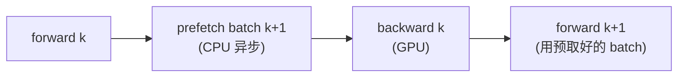

配合 `pin_memory=True` + `non_blocking=True`(`get_batch` 内部),**数据加载几乎完全被 GPU 计算"遮蔽"**。

#### 关键洞察 2:Step 2 的 eval 不是每个 iter 都做

很多人(包括第一次答题的你)以为"每个 iter 都算 train/val loss" — **不对**,这太贵了。**默认每 250 iter 才进一次** eval 分支(`eval_interval = 250`)。

> 详见 Q1.4 的实战分析(eval 比训练还慢,~6.8s vs 4.25s)。

#### 关键洞察 3:Step 7 `optimizer.zero_grad` 必不可少

```python
optimizer.zero_grad(set_to_none=True)
```

**PyTorch 的硬规则**:`backward()` 会把梯度 **累加** 到 `.grad`(`+=`),不主动清零下次会跟旧梯度叠加 → 等价于错乱的学习率。

- `set_to_none=True`:把 `.grad` 设成 `None`(比设成 0 tensor 快,省一次写 0 操作)
- 现代 PyTorch 推荐用 `set_to_none=True`

### Q1.2：`gradient_accumulation_steps` 改变什么、不改变什么？

> 🟢 **2026-06-23 Phase 3 Round 1 实战回填**

**答**:**改变了"看多少样本才 step 一次"(有效 batch size = K × batch_size),不改变梯度数学**。grad accum 通过**多次 backward 累加梯度,再 1 次 step**,等价于"用 K×batch_size 的大 batch 一次性算"。**显存只占 1/K**,代价是 K 倍 forward+backward 时间。`loss / K` 是为了让累加后的梯度等于"大 batch 的平均梯度",不除等价于学习率乘 K。

**详解**:

```292:305:nanogpt-study/nanoGPT/train.py
    for micro_step in range(gradient_accumulation_steps):
        if ddp:
            model.require_backward_grad_sync = (micro_step == gradient_accumulation_steps - 1)
        with ctx:
            logits, loss = model(X, Y)
            loss = loss / gradient_accumulation_steps # scale the loss to account for gradient accumulation
        # immediately async prefetch next batch while model is doing the forward pass on the GPU
        X, Y = get_batch('train')
        # backward pass, with gradient scaling if training in fp16
        scaler.scale(loss).backward()
```

#### 有效 batch size 公式

设 `gradient_accumulation_steps=K`,`batch_size=B`,DDP 卡数 = `N`:

$$
\text{effective\_batch\_size} = K \times B \times N
$$

| 配置 | K | B | N | 有效 batch |
|---|---|---|---|---|
| nanoGPT shakespeare_char(单卡) | 1 | 64 | 1 | 64 |
| nanoGPT 默认 train.py | 40 | 12 | 1 | 480 |
| nanoGPT GPT-2 复现(8 卡 A100) | 5 | 12 | 8 | **480**(同上,但快 8 倍) |

#### grad accum vs 直接大 batch 的对照

设 `K=4`, `B=12`,跟"直接 batch=48"对比:

| 维度 | grad accum (4×12) | 直接大 batch (48) |
|---|---|---|
| 每次 optimizer step 看的样本数 | 48 | 48 |
| 梯度数学 | **完全等价**(无 BatchNorm 的网络) | 同 |
| **显存峰值** | **占 12 样本的显存(1/K)** | 占 48 样本的显存 |
| 吞吐 | 慢(K 次 fwd+bwd) | 快(1 次,但显存压力大) |
| 适用场景 | **显存装不下大 batch** | 显存足够 |

**核心价值**:**grad accum 是免费的显存"扩容法"**。代价是 K 倍 forward+backward 时间,但当 GPU 装不下大 batch 时,这是唯一选项。

#### `loss / K` 为啥要除?(关键!)

**因为 `backward()` 会把梯度 _累加_ 到 `param.grad`**,不除 K 等于隐式放大了 K 倍学习率。

**对比两种写法**:

```python
# ❌ 错(不除 K):
for i in range(K):
    loss_i = forward(micro_batch_i)
    loss_i.backward()           # grad += dL_i/dW
# 此时 W.grad = sum(dL_i/dW) = K * average(dL_i/dW)
optimizer.step()                # W -= lr * K * avg_grad   ← 隐式 lr × K!

# ✅ 对(除 K):
for i in range(K):
    loss_i = forward(micro_batch_i)
    (loss_i / K).backward()     # grad += (1/K) * dL_i/dW
# 此时 W.grad = (1/K) * sum(dL_i/dW) = average(dL_i/dW)
optimizer.step()                # W -= lr * avg_grad   ← 跟大 batch 一致
```

**除 K 让 gradient norm 跟"大 batch 一次性算"完全一致**,不然要重新调 lr,违背"grad accum 应该跟大 batch 等价"的设计哲学。

#### 改变 vs 不改变 总结表

| 维度 | grad_accum_steps 改变? |
|---|---|
| 有效 batch size | ✅ 变(乘 K) |
| 梯度方向 | ❌ 不变(还是大 batch 的方向) |
| 学习率行为 | ❌ 不变(因为 loss/K) |
| 单次 optimizer step 的"learning signal" | ❌ 不变(跟大 batch 等价) |
| **显存占用** | ✅ **不变(微 batch 大小不变)** |
| 训练 wall-clock 时间 | ✅ 变(K 倍 fwd+bwd) |
| 总训练步数(for max_iters 来说) | ❌ 不变 |

#### 实战经验

- **显存紧张**:增大 K,减小 batch_size,保持有效 batch 不变
- **GPU 跑不满(MFU 低)**:减小 K,增大 batch_size(更大 matmul → MFU 上升)
- **跨 DDP 卡数迁移**:N 卡 → 2N 卡时,batch_size 不变,K 减半,有效 batch 保持
- **lr scaling**:常用 `lr = base_lr * sqrt(effective_batch / 256)`(linear/sqrt scaling rule)

### Q1.3：`if iter_num == 0 and eval_only: break` 这行在测什么场景？

> 🟢 **2026-06-23 Phase 3 Round 1 实战回填**

**答**:**`eval_only=True` 是"只评估不训练"模式**。典型场景:**已经训完模型存了 ckpt,只想跑一遍 val/test 看 metric**。`iter_num=0` 时进入 eval 分支算完 loss、打印结果,然后这行 break **直接退出训练循环**,**整个 train.py 一个 iter 都没真正训**。

**详解**:

```287:288:nanogpt-study/nanoGPT/train.py
    if iter_num == 0 and eval_only:
        break
```

#### 工作流程

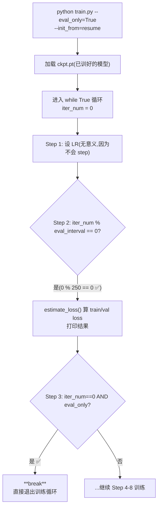

**注意**:必须**先**经过 Step 2 的 eval 分支(打印 loss),**再**到 Step 3 的 break。两步顺序不能反 —— 否则只 break 不打印 loss。

#### 典型使用场景

```bash
# 场景 1: 评估自己训的 ckpt
python train.py config/eval_my_model.py \
    --init_from=resume --eval_only=True

# 场景 2: 评估 HF 预训练 GPT-2
python train.py config/eval_gpt2.py
# eval_gpt2.py 内部设置了 init_from='gpt2', eval_only=True

# 场景 3: 评估自己训的 + benchmark MFU(不真训)
python train.py --eval_only=True --init_from=resume
```

#### 配套 config 文件

nanoGPT 自带 4 个 eval 专用 config(用 `init_from='gpt2*'` + `eval_only=True`):

```8:9:nanogpt-study/nanoGPT/config/eval_gpt2.py
init_from = 'gpt2'
eval_only = True
```

可以快速对比 GPT-2 各 size 在你的数据集上的 perplexity,不用每次手敲参数。

#### 为啥这个设计?

如果不加 `if iter_num == 0 and eval_only: break`:
- `eval_only=True` 时,train.py 会进入正常训练循环,**白训一通**
- 用户其实只想看 loss 一次,不想浪费 GPU

加上这行**优雅地把"评估流程"嵌入到训练流程里**,避免单独写一个 `evaluate.py`(代码复用)。

### Q1.4（实战补充）：`eval_interval = 250` 和 `always_save_checkpoint = False` 怎么配合工作？250 是怎么来的？

> 🟢 **2026-06-01 实战回填**(自己跑完 5000 iter，看日志才搞清楚为什么磁盘上的 `ckpt.pt` 是 iter 2000 的快照而不是 iter 5000）。

**答**：`eval_interval` 是**多久检查一次** val loss 的频率（iter 单位），`always_save_checkpoint=False` 是**只在 val 改善时才覆写 ckpt** 的开关 —— 两者配合实现 "**自动留下 val 最优的那一份**"，专治小数据集过拟合。`250` 不是公式算出来的，是 `max_iters ÷ 评估点数 ≈ 5000 ÷ 20` 的经验值。

**详解**：

三个相关参数（来自 [`config/train_shakespeare_char.py`](../nanoGPT/config/train_shakespeare_char.py) L5-L10）：

| 参数 | 含义 | 默认值（你这次） |
|---|---|---|
| `eval_interval` | 每多少个 train iter 跑一次 eval（算 train/val loss 平均） | 250 |
| `eval_iters` | 每次 eval 时从 train/val 各抽多少 batch 算平均（降噪） | 200 |
| `always_save_checkpoint` | eval 完后是否无条件保存；False = 只在 val 改善时存 | False |

**关键源码**（[`train.py`](../nanoGPT/train.py) L262-L286）：

```262:286:nanogpt-study/nanoGPT/train.py
    # evaluate the loss on train/val sets and write checkpoints
    if iter_num % eval_interval == 0 and master_process:
        losses = estimate_loss()
        print(f"step {iter_num}: train loss {losses['train']:.4f}, val loss {losses['val']:.4f}")
        if wandb_log:
            wandb.log({...})
        if losses['val'] < best_val_loss or always_save_checkpoint:
            best_val_loss = losses['val']
            if iter_num > 0:
                checkpoint = {...}
                print(f"saving checkpoint to {out_dir}")
                torch.save(checkpoint, os.path.join(out_dir, 'ckpt.pt'))
```

**工作流程**：

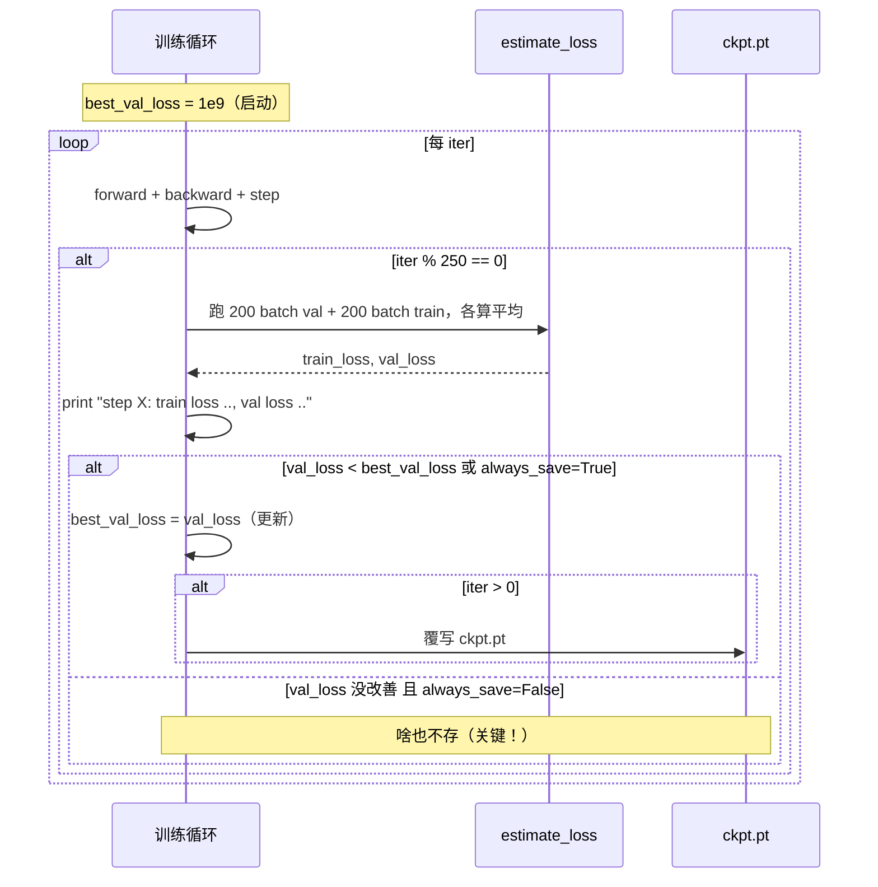

**我这次训练的实际表现**（读终端日志，每 250 iter 一行）：

| step | train loss | val loss | best 更新? | saved? |
|---|---|---|---|---|
| 500 | 1.5270 | 1.7273 | ✅ | ✅ |
| 1000 | 1.2737 | 1.5163 | ✅ | ✅ |
| 1500 | 1.1554 | 1.4783 | ✅ | ✅ |
| 1750 | 1.1063 | 1.4772 | ✅ | ✅ |
| **2000** | **1.0625** | **1.4768** | ✅ | ✅ **最后一次保存** |
| 2250 | 1.0121 | 1.4893 | ❌（反弹） | ❌ |
| 3000 | 0.8721 | 1.5299 | ❌ | ❌ |
| 5000（终） | 0.6302 | 1.6962 | ❌ | ❌ |

train_loss 一路降到 0.63，但 val_loss 在 iter 2000 触底（1.4768）后持续反弹 —— **典型过拟合曲线**。`ckpt.pt` 自动锁在 iter 2000 那一刻，没被后面的烂模型覆盖。

**`250` 这个数字怎么来的？**

不是公式，是经验启发。两个对立约束：

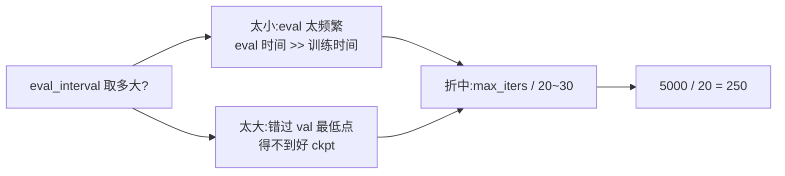

对照 nanoGPT 自带其他 config：

| 配置 | eval_interval | max_iters | 评估点数 | 备注 |
|---|---|---|---|---|
| `train_shakespeare_char.py`（**这次**） | 250 | 5000 | 20 | 小数据集易过拟合，密集监控 |
| `train_gpt2.py` / `train.py` 默认 | 2000 | 600,000 | 300 | GPT-2 pretrain，数据多不易过拟合 |
| `finetune_shakespeare.py` | 5 | 20 | 4 | 微调 20 步，基本每步评估 |

**eval 开销估算**（用我自己的数据）：
- 一次 eval = `eval_iters × (train+val) × iter_time` = `200 × 2 × 17ms` ≈ **6.8s**
- 250 iter 训练 = `250 × 17ms` ≈ **4.25s**
- **eval 比训练还慢！** 但换来精确捕捉 val 最低点 → 值

加速 trick：把 `eval_iters` 从 200 降到 50，eval 时间降 4×，loss 估计噪声会大一点但够用。

**4 种组合的合理性**：

| 组合 | 行为 | 适用 |
|---|---|---|
| `always_save=True` + `eval_interval` 大（如 2000） | 每次 eval 都存，无论好坏 → 留最后一次 | 不易过拟合的大数据预训练 |
| `always_save=False` + `eval_interval` 小（如 250） | 频繁检查，只在 val 改善时存 → 留历史最佳 | **小数据集易过拟合（你这次）** |
| `always_save=True` + `eval_interval` 小 | 频繁存+频繁覆盖最后版本 | 不太合理 |
| `always_save=False` + `eval_interval` 大 | 检查太稀疏，可能漏 val 最低点 | 也不合理 |

**一句话总结**：`eval_interval` 控制"看多频繁"，`always_save_checkpoint` 控制"要不要无条件存"。两者配合 = early stopping 的"软"版本（不停训练，但只保存最佳）。

---

## 二、梯度累积 + DDP no_sync

### Q2.1：DDP 在 `loss.backward()` 时默认会发生什么？

> 🟢 **2026-06-23 Phase 3 Round 1 实战回填**

**答**:**DDP(Distributed Data Parallel)在 `backward()` 反向传梯度时,在每个梯度算完的瞬间自动触发 NCCL all-reduce**,把这个梯度在所有卡上求和并取平均,然后写回每张卡的 `.grad`。**结果是所有卡的梯度完全一致 → optimizer.step() 后所有卡的权重也一致**。这是 DDP 保证"N 卡跑出 1 份模型"的核心机制。

**详解**:

#### DDP 的工作模型

**DDP = 数据并行**,N 张卡上各跑一份模型(权重完全一样),但**每张卡处理不同 batch 的数据**:

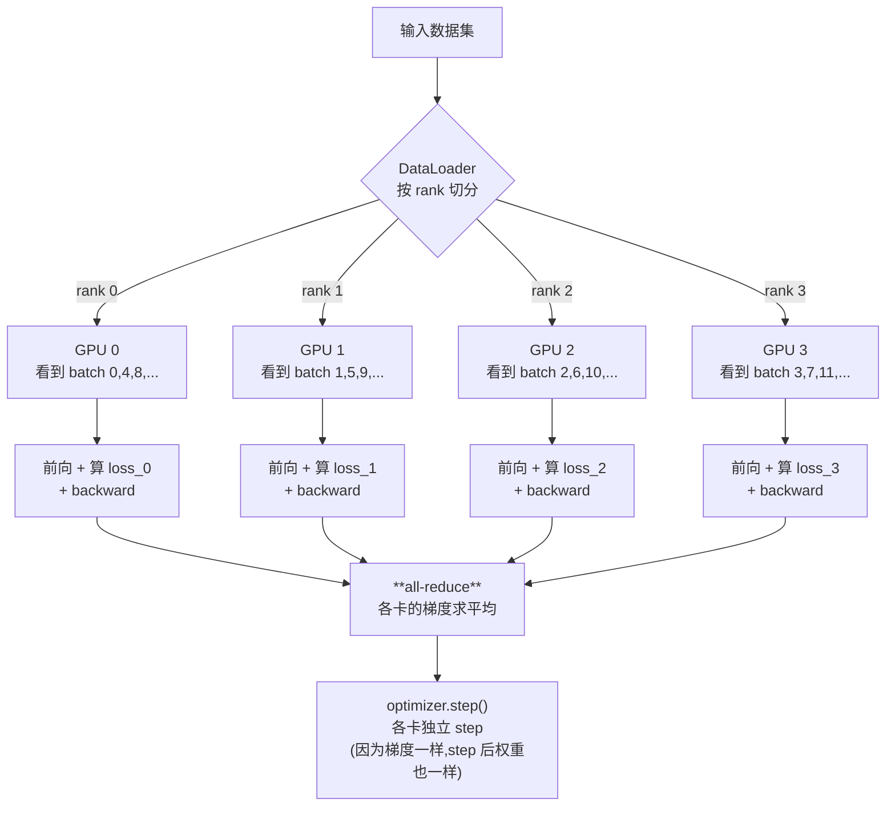

#### `loss.backward()` 内部发生了什么?

**关键魔法**:**`backward()` 沿计算图反向传梯度时,DDP 注册的 hook 在每个梯度算完的瞬间,自动触发 NCCL `all-reduce`**。

伪代码(简化):

```python
# 每张卡都跑这段
loss.backward()    # 触发 autograd 反向

# autograd 内部(DDP hook):
for each layer (从输出层向输入层反向):
    grad = compute_local_gradient()       # 算本卡的梯度
    grad_synced = all_reduce(grad)        # 所有卡的同名梯度求平均 ← 关键
    param.grad = grad_synced              # 写回本卡的 .grad
```

#### `all-reduce` 是什么?

**N 张卡上的同名梯度,求和(或求平均),然后广播回每张卡**。NCCL 用 **Ring 算法**做的,通信复杂度 `O(2N)` 而不是朴素的 `O(N²)`。

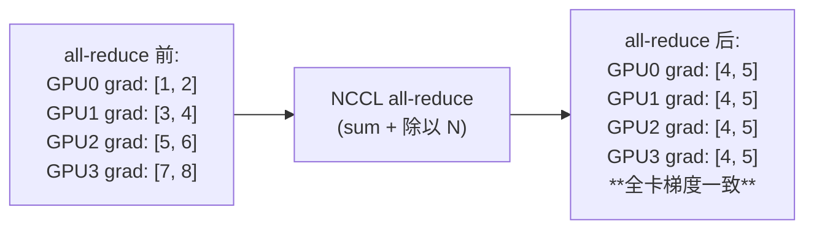

#### 为啥这样设计?— 数学一致性

如果**不做** all-reduce,每张卡 step 后会**漂移**:
- 各自看到不同 batch → 梯度不同 → step 后权重不同 → 下一轮 forward 算出不同的 loss → 越漂越远
- 一份模型变成 N 份不一样的模型,**等于跑了 N 个独立单卡训练**,白瞎多卡

DDP 通过**每次 backward 都做 all-reduce 同步梯度**,保证:**所有卡的 `.grad` 一样 → step 后所有卡的 `.weight` 一样 → 模型保持一致**。

#### 等价于 N×batch_size 的大 batch

| | 单卡 batch=B | DDP N 卡 batch=B 各卡 |
|---|---|---|
| 每次 step 看到样本 | B | **N × B** |
| 梯度 | 自己的 batch 梯度 | **N 卡梯度求平均 = 等价于 NB 大 batch 的梯度** |
| 通信开销 | 0 | 每次 backward N-1 次 all-reduce |
| 显存 | 1 份 | 每卡 1 份(权重在所有卡上各存一份) |

#### 跟 Q2.2 / Q2.3 的伏笔

- **Q2.2**:每次 backward 都触发 all-reduce **不一定都需要**。当用 grad_accum 时,前 K-1 次的 all-reduce **白费带宽**(梯度会被下一次 backward 立刻覆盖累加)。所以 Karpathy 用 `require_backward_grad_sync` 跳过。
- **Q2.3**:`require_backward_grad_sync` 是 DDP wrapper 特有属性,**单卡 model 没有**,所以单卡跑 `model.require_backward_grad_sync = ...` 会 AttributeError → 用 `if ddp:` guard 保护。

#### 关键工程数据

| 通信 op | 典型时间(8 卡 A100, 100M 参数) |
|---|---|
| 单次 all-reduce(100M params) | ~10-100 ms |
| 每个 backward 触发的 all-reduce | N 个参数 tensor × N-1 次通信 |
| 占总训练时间比例 | **10-30%**(模型越大,通信占比越大) |

→ 这就是为啥 Q2.2 的"前 K-1 次省 all-reduce"这么重要 — **能省 K-1 倍通信时间**。

### Q2.2：grad_accum 中前 `K-1` 次为什么要 `model.no_sync()`、第 `K` 次为什么不要？

> 🟢 **2026-06-23 Phase 3 Round 1 实战回填(含答错纠正)**

**答**:**前 K-1 次的 all-reduce 浪费带宽,不是"梯度噪声大"**。每次 `backward()` 默认会触发 all-reduce,但**前 K-1 次的同步结果会被下一次 backward 立刻累加覆盖**,等于做了 K-1 次无意义的通信。所以前 K-1 次禁用 grad sync,只在最后一次同步累加好的总梯度。**数学上等价(K 次本地累加 + 1 次同步 == K 次同步累加),但通信开销少了 K-1 倍**。

#### ⚠️ 答题时的常见误解(回填记录)

> 学习时第一直觉:"前 K-1 次的梯度不准、噪声大,所以不该同步"。
>
> **这是错的**。前 K-1 次的梯度本身没问题(就是单 micro batch 的局部梯度),跟"噪声"没关系。
>
> **真正原因**:**all-reduce 是网络通信,开销不小;前 K-1 次同步的结果立刻被覆盖,白白浪费带宽**。

**详解**:

```292:305:nanogpt-study/nanoGPT/train.py
    for micro_step in range(gradient_accumulation_steps):
        if ddp:
            # in DDP training we only need to sync gradients at the last micro step.
            # the official way to do this is with model.no_sync() context manager, but
            # I really dislike that this bloats the code and forces us to repeat code
            # looking at the source of that context manager, it just toggles this variable
            model.require_backward_grad_sync = (micro_step == gradient_accumulation_steps - 1)
        with ctx:
            logits, loss = model(X, Y)
            loss = loss / gradient_accumulation_steps # scale the loss to account for gradient accumulation
        # immediately async prefetch next batch while model is doing the forward pass on the GPU
        X, Y = get_batch('train')
        # backward pass, with gradient scaling if training in fp16
        scaler.scale(loss).backward()
```

#### 梯度累积的核心原理

回想:**`loss.backward()` 会把梯度 _累加_ 到 `param.grad`**(`+=`,不是覆盖)。grad accum 就是利用这个累加性:

```python
for micro_step in range(K):
    loss_i = forward(micro_batch_i) / K
    loss_i.backward()           # grad += dL_i/dW * (1/K)

# 此时 param.grad = (1/K) * sum_{i} dL_i/dW = 平均梯度
optimizer.step()                 # 等价于"大 batch 一次性算梯度"
```

#### 关键问题:每次 backward 都 all-reduce 会怎样?

如果**不禁掉 grad sync**,每次 `loss_i.backward()` 都会触发 DDP all-reduce:

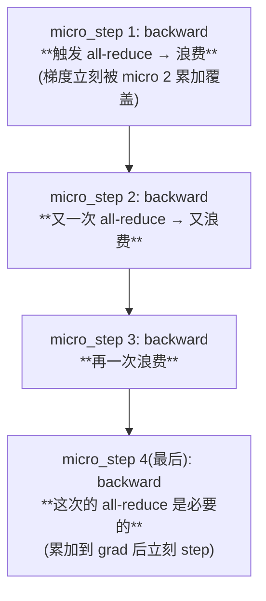

**前 K-1 次的 all-reduce 不是错,只是没意义** —— 因为同步完的梯度还会被下一次 backward 累加,**等于刚同步好就被改了**。

#### 性能影响(关键!)

| | K=1(无 grad accum) | K=4,每次都同步 | K=4,只最后同步 |
|---|---|---|---|
| all-reduce 次数 / step | 1 | **4** | **1** |
| 通信开销 | baseline | **4×** | baseline |
| 数学结果 | — | 一样 | 一样 |

**all-reduce 是网络通信,每次开销 ~10-100 ms**(看模型大小)。`K=8` 时不优化等于多花 7× 通信时间,**训练 throughput 严重下降**。

#### 代码怎么实现?— 巧用 `require_backward_grad_sync`

**逐 micro_step**(设 K=4):

| micro_step | `require_backward_grad_sync` 的值 | backward 时触发 all-reduce? |
|---|---|---|
| 0 | `(0 == 3)` = **False** | ❌ 不触发(梯度只在本卡累加) |
| 1 | `(1 == 3)` = **False** | ❌ 不触发 |
| 2 | `(2 == 3)` = **False** | ❌ 不触发 |
| **3 (最后一次)** | `(3 == 3)` = **True** | ✅ **触发(同步累加好的总梯度)** |

**`require_backward_grad_sync`** 是 DDP wrapper 暴露的一个 boolean flag,**False 时禁用 all-reduce hook**,True 时正常 hook。

#### 等价于官方推荐的 `with model.no_sync():` 上下文管理器

PyTorch 官方写法是这样:

```python
# 官方推荐(冗长):
for micro_step in range(K):
    if micro_step < K - 1:
        with model.no_sync():
            loss = ...
            loss.backward()
    else:
        loss = ...
        loss.backward()
```

Karpathy 直接用 `require_backward_grad_sync = (...)` 一行搞定,**少一层缩进、代码更扁平**。代码注释也写了原因:

```
# the official way to do this is with model.no_sync() context manager, but
# I really dislike that this bloats the code and forces us to repeat code
# looking at the source of that context manager, it just toggles this variable
```

#### 一句话总结(防遗忘)

> **grad accum 中前 K-1 次 backward 关掉 grad sync,只让最后一次同步,是因为前 K-1 次的 all-reduce 结果立刻会被后续 backward 累加覆盖,白白浪费带宽**。数学上等价,但通信开销少 K-1 倍。

#### 数学验证:本地累加 + 1 次同步 == K 次同步累加

| 写法 A:K 次同步累加 | 写法 B:本地累加 + 1 次同步 |
|---|---|
| Step 1: backward, all-reduce → 各卡 grad = (1/N) Σ_n g_n^(1) | Step 1: backward, **本地** → 卡 i 的 grad = g_i^(1) |
| Step 2: backward, all-reduce → 各卡 grad += (1/N) Σ_n g_n^(2) | Step 2: backward, 本地 → 卡 i 的 grad = g_i^(1) + g_i^(2) |
| Step K(最后):各卡 grad = (1/N) Σ_n Σ_k g_n^(k) | Step K(最后):backward, all-reduce → 各卡 grad = (1/N) Σ_n Σ_k g_n^(k) |

→ **两种结果完全一样**。写法 B 只是把"分 K 次通信"合并成"1 次大通信"。

### Q2.3：单卡环境下 `no_sync()` 调用还存在吗？

> 🟢 **2026-06-23 Phase 3 Round 1 实战回填**

**答**:**不存在**。Karpathy 用 `if ddp:` guard 把整个 grad sync 控制块包起来,单卡训练 `ddp=False`,这行根本不执行。**更深一层:单卡 model 没有 `require_backward_grad_sync` 这个属性**(它是 DDP wrapper 才有),硬执行会 AttributeError。

**详解**:

```292:298:nanogpt-study/nanoGPT/train.py
    for micro_step in range(gradient_accumulation_steps):
        if ddp:
            # in DDP training we only need to sync gradients at the last micro step.
            # the official way to do this is with model.no_sync() context manager, but
            # I really dislike that this bloats the code and forces us to repeat code
            # looking at the source of that context manager, it just toggles this variable
            model.require_backward_grad_sync = (micro_step == gradient_accumulation_steps - 1)
```

#### `if ddp:` 这个 guard 起的作用

| 训练模式 | `ddp` 的值 | 这行执行吗? |
|---|---|---|
| 单卡训练(直接 `python train.py`) | `False` | ❌ 整个 if 块跳过 |
| 多卡 DDP(`torchrun --nproc_per_node=N`) | `True` | ✅ 执行 |

#### `ddp` 怎么判断的?(预告 Q7.1)

```python
ddp = int(os.environ.get('RANK', -1)) != -1
```

`torchrun` 启动时会自动设环境变量 `RANK`(每个 worker 的全局编号)。如果没设 = 不是 DDP 启动 = 单卡。

#### 单卡为啥要 guard?— `require_backward_grad_sync` 是 DDP wrapper 特有属性

PyTorch 的 DDP 是通过 `model = DDP(model, device_ids=[...])` 把原始 model **包一层 wrapper**:

```python
# 多卡 DDP
if ddp:
    model = DDP(model, device_ids=[ddp_local_rank])
    # 现在 model 是 DistributedDataParallel 类型
    # 这个 wrapper 有 require_backward_grad_sync 属性

# 单卡(没这步)
# model 还是原始 GPT 类型,**没有** require_backward_grad_sync 属性
```

如果单卡训练不做 guard,硬跑 `model.require_backward_grad_sync = ...` 会:

```python
AttributeError: 'GPT' object has no attribute 'require_backward_grad_sync'
```

(实际 PyTorch 不会立刻报错,因为 Python 允许动态加属性,但**这个属性根本没人读,白设了**;严格点的封装会报错。)

#### 单卡训练真正发生了什么?

**单卡训练里整个 grad accum 循环简化为**:

```python
for micro_step in range(K):
    # if ddp 整个块跳过
    with ctx:
        logits, loss = model(X, Y)
        loss = loss / K
    X, Y = get_batch('train')
    scaler.scale(loss).backward()
```

每次 backward 只在本卡累加梯度,**没有 all-reduce、没有跨卡同步、没有 NCCL 通信** —— 因为根本没有第二张卡!`require_backward_grad_sync` 这个概念在单卡场景下**没有意义**。

#### 为啥 Karpathy 不写 `model = wrap_for_grad_accum(model) if not ddp else DDP(model)` 之类的统一抽象?

**因为没必要**。单卡的"梯度累加"是 PyTorch 内置行为(`backward()` 默认就累加),不需要任何 wrapper。**唯一的差别在多卡:多卡默认会触发 all-reduce,要主动禁掉**。

Karpathy 用 `if ddp:` 一个 guard 解决,代码扁平,可读性好。这是个**"差异化分支"的优雅写法**。

#### 自检:能说出 3 种"DDP 行为跟单卡不同"的点吗?

| 行为 | 单卡 | DDP |
|---|---|---|
| `backward()` 是否触发跨卡通信? | ❌ | ✅ all-reduce |
| `model` 的类型 | `GPT`(原始) | `DistributedDataParallel`(wrapper) |
| 访问原始 model 的方式 | `model` 直接 | **`model.module`**(`raw_model = model.module if ddp else model`) |
| `model.require_backward_grad_sync` | ❌ 没有这个属性 | ✅ wrapper 提供 |
| checkpoint 保存什么? | `model.state_dict()` | `raw_model.state_dict()`(不存 wrapper 那层) |

这 5 个差异是写 DDP 代码时反复要意识到的。

---

## 三、混合精度

### Q3.1：bfloat16 vs fp16 在数值范围/精度上的差别？

> 🟢 **2026-06-01 苏格拉底式实战回填**(被反问"什么是 dynamic range,为什么 bf16 精度比 fp16 低范围却大"才搞清楚的）。

**答**:**同样 16 bits 的预算,bf16 把"细看"挪给"远看"**。fp16 = `1+5+10`(范围窄,精度高),bf16 = `1+8+7`(范围**跟 fp32 一样**,精度低)。LLM 训练里 dynamic range 比精度重要,所以 bf16 是首选。

**详解**:

#### 一、定义 dynamic range vs precision

任何浮点数都是 **科学计数法**:

```
x = (-1)^符号 × 1.mantissa × 2^(exponent - bias)
       └ 1 bit ┘  └─ 决定精度 ─┘  └─── 决定范围 ───┘
```

| 概念 | 由谁决定 | 直觉 |
|---|---|---|
| **Dynamic range(动态范围)** | **指数位数** | "最大数 / 最小非零数"比 = **尺子有多长** |
| **Precision(精度)** | **尾数位数** | 同一量级内能分多细 = **尺子刻度有多密** |

#### 二、三种格式的位分配

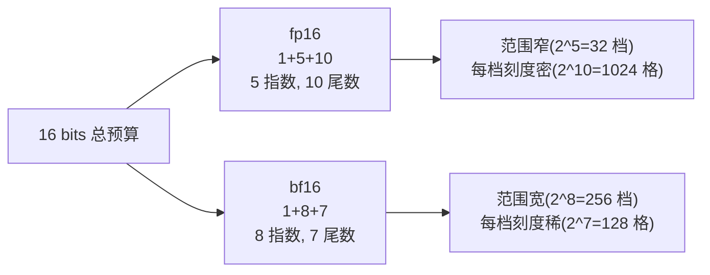

| 格式 | 总 | 符号 | **指数** | **尾数** | 范围 | 精度(相对步长) |
|---|---|---|---|---|---|---|
| fp32 | 32 | 1 | **8** | **23** | ~1e-38 ~ ~3e38 | 2^-23 ≈ 1.2e-7(极细) |
| **fp16** | 16 | 1 | **5** | **10** | **~6e-5 ~ ~6.5e4(窄)** | 2^-10 ≈ 1e-3(~3 位有效数字) |
| **bf16** | 16 | 1 | **8** | **7** | **~1.2e-38 ~ ~3.4e38(=fp32)** | 2^-7 ≈ 8e-3(~2 位有效数字) |

**关键洞察**:
- **bf16 的指数位数跟 fp32 完全一样(都是 8)** → 范围跟 fp32 一样大
- bf16 **用尾数换范围** — 7 bits 尾数 < fp16 的 10 bits → 精度比 fp16 还低
- fp16 反过来,**用范围换精度** — 5 bits 指数让它只能在小范围内"看得清"

#### 三、用尺子的比喻

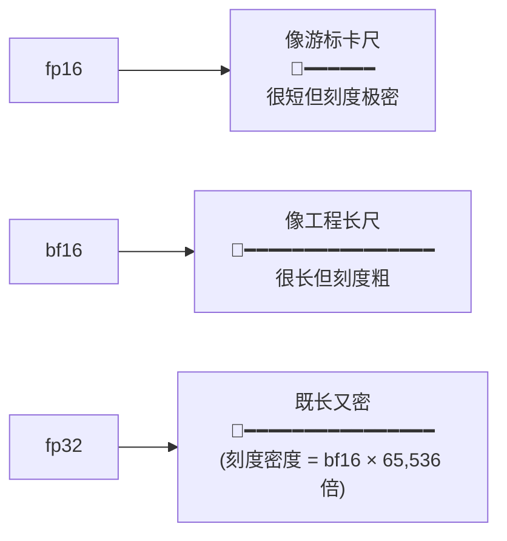

#### 四、用具体数字感受差异

**例 1:能否表示 1.0?**

| 格式 | 1.0 旁边的下一个可表示数 | 步长 |
|---|---|---|
| fp16 | 1.0009765625 | **0.001** |
| bf16 | 1.0078125 | **0.008**(粗 8 倍) |

> 表示 1.x 时,**bf16 跳得粗 8 倍 — 精度差**。

**例 2:能否表示 gradient = 1e-7?**

| 格式 | 1e-7 |
|---|---|
| fp16 | ❌ **下溢成 0**(< 下限 6.1e-5) |
| bf16 | ✅ 没问题(远 > 下限 1.2e-38) |

> 这就是 **gradient 在 fp16 下被下溢成 0 的根本原因** — 范围太窄。

**例 3:能否表示 1e10?**

| 格式 | 1e10 |
|---|---|
| fp16 | ❌ **上溢到 inf**(> 上限 6.5e4) |
| bf16 | ✅ 没问题(远 < 上限 3.4e38) |

#### 五、为什么 LLM 选 bf16

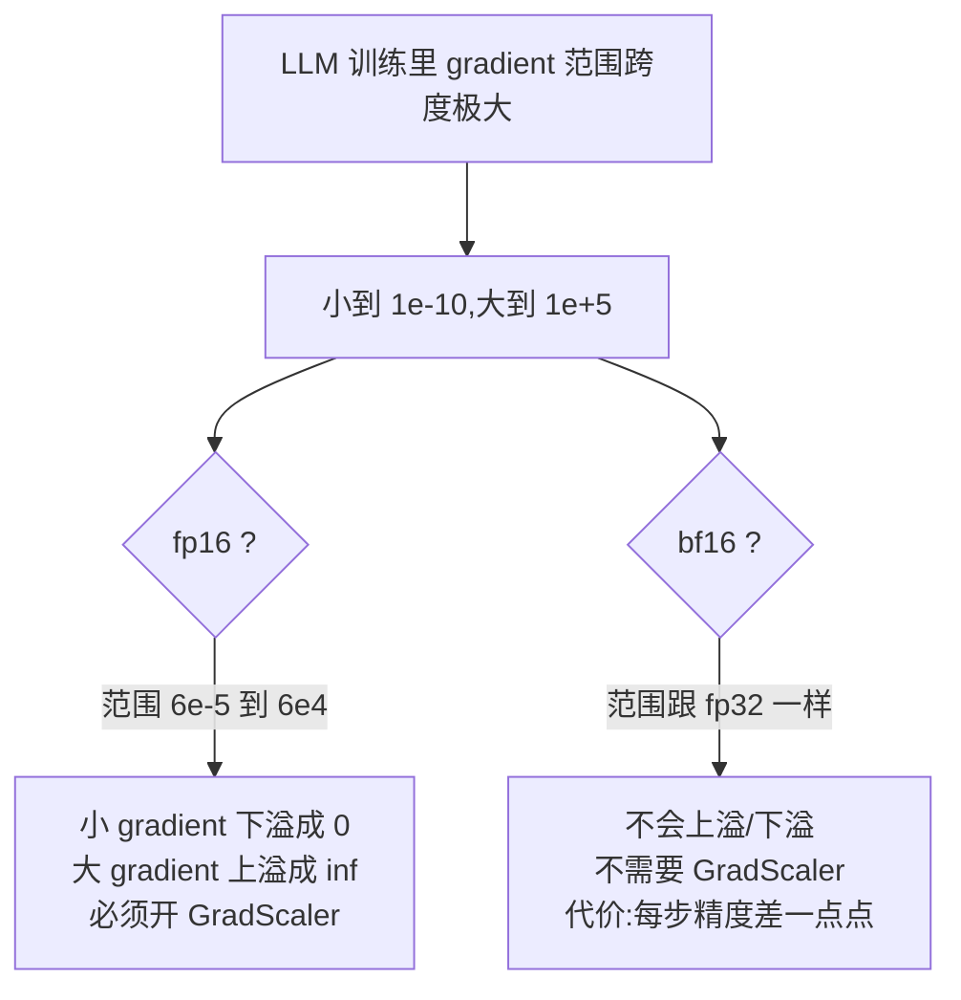

**精度差一点点为什么不要紧?**
- gradient 是 `1.5e-7` 还是 `1.51e-7`,对参数更新影响 < 万分之一
- 但 gradient 是 `1.5e-7` 还是 **`0`**,影响 = 100% 失败
- **只要范围够,精度差一点完全可接受**

**bf16 是 Google Brain 为深度学习专门设计的**(2018),核心理念:
> "**与其用 fp16 假装高精度,不如把指数位拉到跟 fp32 一样,牺牲尾数换稳定训练**"

#### 六、何时反而选 fp16?

虽然 LLM 用 bf16,但有几个场景 fp16 仍在用:
- 移动端推理(老 GPU 不支持 bf16,只支持 fp16)
- 小模型 / CV 模型(数值范围跨度没那么大,精度更重要)
- T4 / V100 等较老的 NVIDIA 卡(没有 bf16 硬件加速)

A100 / H100 / 你这次的 PPU-ZW810E 都有 bf16 Tensor Core,所以 bf16 = **跟 fp16 一样快 + 数值稳定**,完胜。

---

### Q3.2：为什么 bf16 不需要 `GradScaler`，fp16 需要？

> 🟢 **2026-06-01 苏格拉底式实战回填**(从 train.py L196 的代码注释 `If enabled=False scaler is a no-op` 顺藤摸瓜搞清楚的）。

**答**:fp16 的范围太窄(`~6e-5 到 ~6.5e4`),gradient 容易下溢成 0,所以要先把 loss **放大 N 倍**,backward 出的 gradient 也放大 N 倍,逃过下溢区,optimizer 用之前再 unscale 还原 — 这就是 `GradScaler`。bf16 范围跟 fp32 一样宽,gradient 永远不会下溢,**`GradScaler` 完全是 no-op**。

**详解**:

#### 一、fp16 下 gradient 下溢的真实场景

```mermaid
sequenceDiagram
    autonumber
    participant FWD as forward (fp16)
    participant BWD as backward (fp16)
    participant OPT as optimizer.step

    FWD->>FWD: 算 loss = 2.3
    BWD->>BWD: 算 ∂loss/∂param ≈ 1e-7
    Note over BWD: ❌ 1e-7 < fp16 下限 6e-5<br/>→ 直接下溢成 0
    BWD-->>OPT: gradient = 0
    OPT->>OPT: param -= lr × 0 = 不更新
    Note over OPT: 模型停止学习,但你看不到报错
```

#### 二、GradScaler 的工程解法 — 把 loss 放大 N 倍

```mermaid
sequenceDiagram
    autonumber
    participant FWD as forward (fp16)
    participant SC as GradScaler
    participant BWD as backward
    participant OPT as optimizer.step

    FWD->>FWD: 算 loss = 2.3
    FWD->>SC: scaler.scale(loss)
    SC-->>BWD: 放大后的 loss = 2.3 × 2^15 ≈ 7.5e4
    BWD->>BWD: 算 ∂(scaled_loss)/∂param ≈ 1e-7 × 2^15 ≈ 3.3e-3
    Note over BWD: ✅ 3.3e-3 远大于 fp16 下限<br/>→ 不下溢,正常存进 fp16
    SC->>SC: scaler.unscale_(optimizer)<br/>把 gradient 除回 2^15
    SC->>OPT: scaler.step(optimizer)<br/>= optimizer.step()
    SC->>SC: scaler.update()<br/>(如果检测到 inf/nan 就减小 N,否则增大 N)
```

> **N 是动态调整的** — 训练过程中 GradScaler 会监测有没有 inf/nan,有就 ÷2 缩,没就慢慢 ×2 增,自适应找到最优放大因子。

#### 三、bf16 为什么不需要这套?

`bfloat16` 的范围 `~1.2e-38 到 ~3.4e38` 跟 fp32 一样宽,gradient 在这个范围内**永远不会下溢**:

| 典型 gradient 量级 | fp16 命运 | bf16 命运 |
|---|---|---|
| 1e-5 | ⚠️ 接近下限 | ✅ |
| 1e-7 | ❌ 下溢成 0 | ✅ |
| 1e-10 | ❌ 下溢成 0 | ✅ |
| 1e-30 | ❌ 下溢成 0 | ✅ |
| 1e-40 | ❌ 下溢 | ⚠️ 接近 bf16 下限 |

所以 bf16 训练**不需要任何放大/缩小**,直接 backward 即可。

#### 四、nanoGPT 是怎么实现的(精彩的 null object 设计)

```196:196:nanogpt-study/nanoGPT/train.py
scaler = torch.cuda.amp.GradScaler(enabled=(dtype == 'float16'))
```

- `dtype == 'float16'` → `enabled=True` → 真的 GradScaler
- `dtype == 'bfloat16'` → `enabled=False` → **scaler 变成 no-op**(所有 method 都直接返回,不做任何事)

L195 的注释直说了:

```195:195:nanogpt-study/nanoGPT/train.py
# initialize a GradScaler. If enabled=False scaler is a no-op
```

所以训练循环里的这几行:

```305:312:nanogpt-study/nanoGPT/train.py
        scaler.scale(loss).backward()
    # clip the gradient
    if grad_clip != 0.0:
        scaler.unscale_(optimizer)
        torch.nn.utils.clip_grad_norm_(model.parameters(), grad_clip)
    # step the optimizer and scaler if training in fp16
    scaler.step(optimizer)
    scaler.update()
```

**在 bf16 训练里实际等价于**:

```python
loss.backward()
if grad_clip != 0.0:
    torch.nn.utils.clip_grad_norm_(model.parameters(), grad_clip)
optimizer.step()
# scaler.update() 啥也不做
```

#### 五、为什么这种设计好

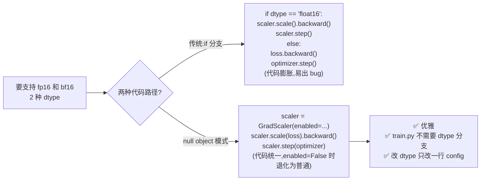

这是 **null object pattern** — `enabled=False` 时整个 scaler 退化成"装样子"的占位符,所有方法都是空操作,但调用接口保持不变。

#### 六、一句话总结(给你写 notes 用)

> bf16 范围跟 fp32 一样,gradient 不会下溢,所以**不需要 GradScaler**;fp16 范围窄(6e-5 ~ 6.5e4),gradient 容易下溢成 0,所以**必须先放大 loss 再 backward**(GradScaler 的本质)。nanoGPT 用 null object 模式统一两种代码路径 — `scaler = GradScaler(enabled=(dtype=='float16'))`,bf16 时整个 scaler 是 no-op。

### Q3.3：`autocast(dtype=torch.bfloat16)` 包住的是 forward 还是整个 iter？

> 🟢 **2026-06-24 Phase 3 Round 3 实战回填(顺带补的 §三 收尾)**

**答**:**只包 forward**(`logits, loss = model(X, Y)` 这一行),**不包 backward 和 optimizer.step**。原因:**autocast 是"前向时把高精度 op 降到低精度"的上下文**,backward 时 autograd 自动用相同的混合精度规则,不需要再包;optimizer.step 必须用 fp32(优化器内部状态如 Adam 的 m, v 用 fp32 才稳)。

**详解**:

```112:112:nanogpt-study/nanoGPT/train.py
ctx = nullcontext() if device_type == 'cpu' else torch.amp.autocast(device_type=device_type, dtype=ptdtype)
```

#### `ctx` 在哪用?

```299:305:nanogpt-study/nanoGPT/train.py
        with ctx:
            logits, loss = model(X, Y)
            loss = loss / gradient_accumulation_steps # scale the loss to account for gradient accumulation
        # immediately async prefetch next batch while model is doing the forward pass on the GPU
        X, Y = get_batch('train')
        # backward pass, with gradient scaling if training in fp16
        scaler.scale(loss).backward()
```

**注意位置**:
- ✅ `with ctx:` 包**包含** `model(X, Y)` + `loss = loss / K`(forward + loss 缩放)
- ❌ **不包** `scaler.scale(loss).backward()`(backward 在 ctx 外)
- ❌ **不包** `scaler.step(optimizer)`(更不可能包,在循环外)

#### 完整的混合精度流程

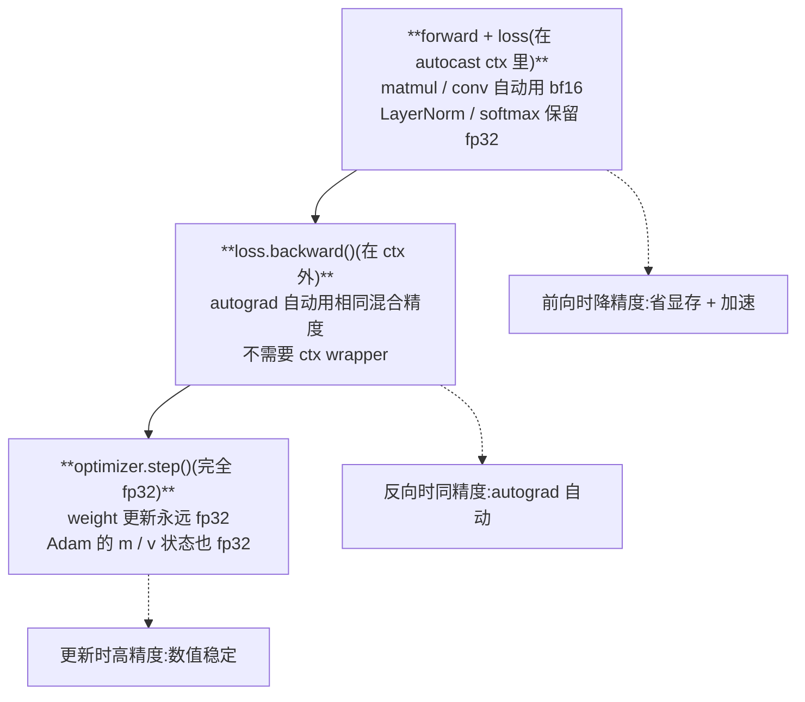

#### autocast 内部干啥?

`torch.amp.autocast` 进入这个 context 后,**所有 PyTorch op 被 dispatch 到混合精度版本**:

| op 类型 | 在 autocast 内的行为 |
|---|---|
| **matmul / conv / linear** | **自动降到 bf16**(节省显存,GPU 跑得快) |
| **LayerNorm / softmax / log** | **保留 fp32**(数值敏感的 op,降精度会 NaN) |
| **加法 / 乘法等简单 op** | **跟随输入 dtype** |

**规则是 PyTorch 内置的**(`torch.amp` 的 dispatch 表),用户不用手动配置。

#### 为啥不包 backward?

**autograd 内部自动处理混合精度**:
- forward 时某 op 用了 bf16 → autograd 记录这个事实
- backward 时反向算该 op 的梯度也用 bf16
- **不需要在 backward 外面套 autocast**

**实际测试**:

```python
# 写法 1(nanoGPT):
with autocast():
    loss = model(x)
loss.backward()        # 不在 autocast 内,但 autograd 仍用混合精度

# 写法 2(冗余):
with autocast():
    loss = model(x)
    loss.backward()    # 也对,但里外两个 with 没区别
```

**两者结果完全一样**。Karpathy 选写法 1(更简洁,backward 不在 with 块内)。

#### 为啥 optimizer.step 必须 fp32?

**Adam 优化器内部状态**(`m`, `v`)需要高精度:

```python
# AdamW 更新规则
m = β1 * m + (1 - β1) * grad           # 一阶动量
v = β2 * v + (1 - β2) * grad**2        # 二阶动量
w -= lr * m / (sqrt(v) + eps)          # 用 m, v 更新 w
```

如果 `m` 和 `v` 用 bf16:
- bf16 只有 ~3 位有效数字,**`m` 的累积误差会严重**(尤其是 `(1-β1)` 这种 ~1e-1 量级的小数)
- 训练后期 `m` 跟 0 之间的差异在 bf16 下表示不出来,**模型停止收敛**

**所以 PyTorch 强制 optimizer.step 用 fp32**(weight 保留 fp32 master copy,bf16 是 forward 临时降的副本)。这就是 **"mixed precision training"** 的本质 —— **存 fp32,算 bf16,更新 fp32**。

#### `nullcontext()` 是啥?

```python
ctx = nullcontext() if device_type == 'cpu' else torch.amp.autocast(...)
```

`nullcontext` 是 Python 标准库的"啥也不做的 context manager":

```python
with nullcontext():     # 等价于直接写代码,不进任何上下文
    do_something()
```

**作用**:让代码兼容 CPU 和 GPU。
- GPU 时:`ctx = autocast(...)`,进入混合精度
- CPU 时:`ctx = nullcontext()`,啥也不做(CPU 上 bf16 没意义,不开 autocast)

`with ctx:` 这一行在两种场景下都能跑,代码统一。

#### 一句话总结

> **autocast 只包 forward + loss 计算,backward 由 autograd 自动用相同混合精度,optimizer.step 必须用 fp32**(Adam 内部状态精度敏感)。这就是 "mixed precision training" 的标准 pattern:**存 fp32(master),算 bf16(forward 临时降),更新 fp32(optimizer)**。`nullcontext` 让代码 CPU/GPU 兼容。

---

## 四、LR 调度

### Q4.1：nanoGPT 自己实现了 warmup + cosine，不用 `torch.optim.lr_scheduler.*`，为什么？

> 🟢 **2026-06-24 Phase 3 Round 2 实战回填**

**答**:**4 个理由,核心是"无状态函数 vs 有状态对象"**。Karpathy 选自己写 13 行 `get_lr(it)` 纯函数,**不依赖任何内部状态**,带来 4 个好处:(1) **无状态 → 没有"state 不一致"bug**;(2) **resume 训练只需 `iter_num`,不用存 `scheduler.state_dict()`**;(3) **跟 grad accum 配合无歧义**(用 iter_num 计数,跟 micro_step 解耦);(4) **改算法 1 分钟**(改函数即可,不用继承 `_LRScheduler` 类)。

**详解**:

#### 对比两种写法

**PyTorch 标准写法**(看起来"高级"):

```python
warmup_sched = LinearLR(optimizer, start_factor=1/warmup_iters, total_iters=warmup_iters)
cosine_sched = CosineAnnealingLR(optimizer, T_max=lr_decay_iters - warmup_iters, eta_min=min_lr)
sched = SequentialLR(optimizer, [warmup_sched, cosine_sched], milestones=[warmup_iters])

for iter_num in range(max_iters):
    train_step()
    sched.step()    # ← 推进 scheduler
```

**nanoGPT 写法**(简洁裸露):

```230:242:nanogpt-study/nanoGPT/train.py
# learning rate decay scheduler (cosine with warmup)
def get_lr(it):
    # 1) linear warmup for warmup_iters steps
    if it < warmup_iters:
        return learning_rate * (it + 1) / (warmup_iters + 1)
    # 2) if it > lr_decay_iters, return min learning rate
    if it > lr_decay_iters:
        return min_lr
    # 3) in between, use cosine decay down to min learning rate
    decay_ratio = (it - warmup_iters) / (lr_decay_iters - warmup_iters)
    assert 0 <= decay_ratio <= 1
    coeff = 0.5 * (1.0 + math.cos(math.pi * decay_ratio)) # coeff ranges 0..1
    return min_lr + coeff * (learning_rate - min_lr)
```

```python
for iter_num in range(max_iters):
    lr = get_lr(iter_num)
    for pg in optimizer.param_groups: pg['lr'] = lr
    train_step()
```

#### 理由 1:**无状态函数 vs 有状态对象**(最核心)

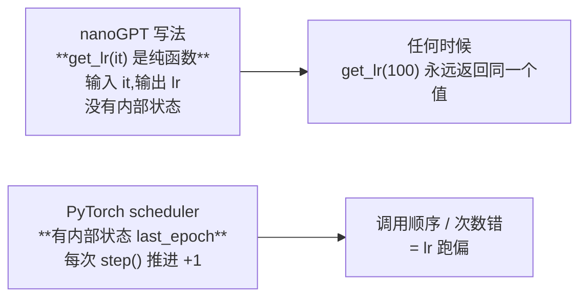

**有状态的麻烦**:scheduler 内部维护 `last_epoch` 这个计数器,**只有 `scheduler.step()` 才推进**。常见 bug:
- 不小心 `step()` 多调一次 → lr 提前一步
- 用了 grad accum 但 `step()` 在 micro_step 里调 → lr 跑得太快
- 临时用了 `optimizer.zero_grad()` → 不小心干扰了状态

**无状态的好处**:`get_lr(iter_num)` 是纯函数,**`print(get_lr(123))` 就能看 iter=123 的 lr**,无副作用。

#### 理由 2:**resume 训练超简单**

| | nanoGPT 写法 | PyTorch scheduler |
|---|---|---|
| 需要存的状态 | 只要 `iter_num`(已经在 ckpt 里) | 还要 `scheduler.state_dict()`(单独存) |
| resume 后怎么续 lr? | `lr = get_lr(iter_num)` 直接算 | `sched.load_state_dict(ckpt['sched'])` + 注意 last_epoch 计数 |
| 改 schedule 后能续训吗? | ✅ 可以(改 `get_lr` 函数即可) | ❌ 难(scheduler 内部状态跟新算法不匹配) |

实际 ckpt 字典:

```277:284:nanogpt-study/nanoGPT/train.py
                checkpoint = {
                    'model': raw_model.state_dict(),
                    'optimizer': optimizer.state_dict(),
                    'model_args': model_args,
                    'iter_num': iter_num,
                    'best_val_loss': best_val_loss,
                    'config': config,
                }
```

**注意:没有 `scheduler` 这一项**。因为 nanoGPT 的 lr 完全由 `iter_num` 决定,resume 只需要恢复 iter_num。

#### 理由 3:**跟 grad accum 配合无歧义**

PyTorch scheduler 的 `step()` 该在哪调?

```python
for iter_num in range(max_iters):
    for micro_step in range(K):    # grad accum
        loss.backward()
        # scheduler.step() 在这调? ← 不对,会推进太快 K 倍
    optimizer.step()
    # scheduler.step() 在这调? ← 对,但要确保只调一次
```

**容易出 bug 的点**。nanoGPT 用 `iter_num`(外层循环计数)算 lr,**跟 micro_step 解耦**,根本不存在这个问题。

#### 理由 4:**改算法 1 分钟**

想换 cosine 为 **linear decay**?改 13 行函数,把 `coeff = 0.5 * (1 + cos(...))` 改成 `coeff = 1 - decay_ratio` 即可。

PyTorch scheduler 想加 hack?要继承 `_LRScheduler` 写新类,实现 `get_lr()` 方法,跟内部状态机打交道,**调试起来痛苦**。

#### Karpathy 的哲学

他在 nanoGPT README 里多次提:**少抽象、多裸露、改起来快**。PyTorch scheduler 是"通用工业品",nanoGPT 用的是"研究人员手撸版"。这种哲学贯穿整个 nanoGPT:
- 不用 PyTorch DataLoader(用 `np.memmap` + `get_batch`)
- 不用 PyTorch scheduler(用 `get_lr`)
- 不用 PyTorch profile(用 `bench.py`)
- 不用 abstract Dataset 类(直接读 .bin)

**"看到代码每一行都知道在干啥"**,这是 nanoGPT 的核心价值,也是为啥它适合学习。

### Q4.2：手工设置 `param_group['lr'] = lr` 这种"硬改"方式跟 `LRScheduler.step()` 区别？

> 🟢 **2026-06-24 Phase 3 Round 2 实战回填**

**答**:**硬改是函数式无状态(`lr = f(iter_num)`),scheduler 是状态机(`step()` 推进 `last_epoch`)**。硬改把"lr 计算"完全裸露在外层循环,scheduler 把它封装在对象内部。前者**可调试性高、resume 简单、跟 grad accum 无冲突**,后者**抽象层级高、容易跟 PyTorch 其他 API 集成**。nanoGPT 选硬改是为了**简洁优于抽象**。

**详解**:

#### 完整对照表

| 维度 | 硬改 `pg['lr'] = lr` | scheduler.step() |
|---|---|---|
| **范式** | **函数式**:`lr = f(iter_num)` | **状态机**:`step()` 推进 |
| **lr 来源** | 显式调用 `get_lr(it)` | 内部根据 last_epoch 算 |
| **状态在哪** | 在用户代码里(`iter_num`) | 在 scheduler 对象里(`scheduler.last_epoch`) |
| **抽象层级** | **裸露**(每行代码看得见) | **封装**(行为藏在对象里) |
| **resume** | 只需 `iter_num` | 还要存 `scheduler.state_dict()` |
| **可调试性** | 高(`print(get_lr(123))` 直接看) | 低(要 introspect scheduler 内部) |
| **bug 多发点** | 几乎没有 | step() 调多/调少,跟 grad accum 配合时容易错 |

#### 类比

| | 硬改 | scheduler |
|---|---|---|
| 比喻 | **看着地图自己走**(每步问"我在哪") | **坐自动驾驶**(车自己决定何时变道) |
| 适用 | 研究、需要灵活控制 | 工业稳定流程 |
| 出错时 | 一眼看出问题(代码裸露) | 要拆 scheduler 看 |

#### nanoGPT 的"硬改"具体咋干

```257:260:nanogpt-study/nanoGPT/train.py
    # determine and set the learning rate for this iteration
    lr = get_lr(iter_num) if decay_lr else learning_rate
    for param_group in optimizer.param_groups:
        param_group['lr'] = lr
```

**逐行翻译**:
1. `get_lr(iter_num)` 算出这个 iter 该用啥 lr
2. `optimizer.param_groups` 是个 list(2 个 group:decay / no_decay,见 Q8 章节)
3. 遍历每个 group,**直接覆盖 `pg['lr']` 这个 dict 字段**
4. 下次 `optimizer.step()` 用的就是这个新 lr

#### 为啥"硬改" `pg['lr']` 能起效?(底层机制)

PyTorch optimizer 内部就是用 `param_groups[i]['lr']` 来算更新的:

```python
# AdamW 内部伪代码
for group in optimizer.param_groups:
    lr = group['lr']           # ← 直接读这个字段
    for p in group['params']:
        p.data -= lr * (...)   # ← 用读出来的 lr 更新
```

**所以"硬改" `pg['lr']` 等价于改 optimizer 的当前 lr,简单粗暴有效**。

#### 跟 Round 3a 学过的"前向只读 W"对照

回忆 Phase 2 Q5.2:**前向计算不修改 W**。这里说的"硬改"也不是"前向时改",而是**在 iter 开始时(forward 之前)修改 lr**,然后 forward / backward / step 都用这个新 lr。**修改时机很重要**:

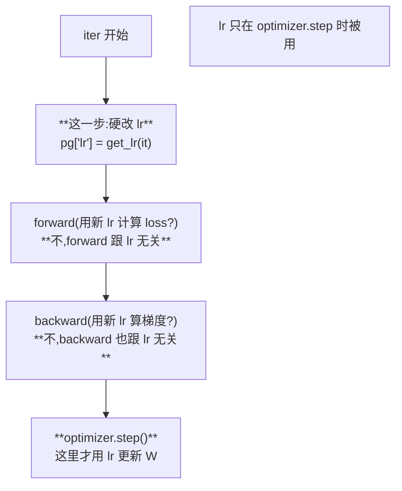

**lr 只影响 optimizer.step,所以在 iter 开始时改完,后面 step 时就用新 lr**。

#### Karpathy 风格:`scheduler` 重命名为函数

如果你跟 nanoGPT 学过的几个"函数式重写":

| Python class 抽象 | nanoGPT 函数式 |
|---|---|
| `LRScheduler.step()` | `lr = get_lr(it); pg['lr'] = lr` |
| `Dataset + DataLoader` | `get_batch(split)` |
| `nn.LayerNorm`(强制 bias) | 自定义 `LayerNorm` 类 |
| `nn.MultiheadAttention`(复杂) | `CausalSelfAttention`(直接写) |

**核心思想**:**抽象 = 隐藏,隐藏 = 难懂**。教学代码反着来:**少抽象、多裸露**。

### Q4.3：`min_lr` 设到 0.1×`learning_rate` 的经验来自哪？

> 🟢 **2026-06-24 Phase 3 Round 2 实战回填**

**答**:**GPT-3 paper(Brown et al. 2020)Appendix B 表 2 直接写明 "decay cosine to 10% of peak lr"**,nanoGPT 抄过来。**直觉:lr=0 模型彻底停学,留 10% 让模型后期"慢慢调"**,既保住 cosine 衰减效果又给微调留空间。实证:**0.1 比 0 略好,但差异不大,是约定俗成不是定理**。

**详解**:

#### 你的答 ✅(部分对)

> "lr 衰减到 0 就学不动了" — 完全对!
>
> "0.1 经验值不知道从哪里来" — 补一下出处。

#### 出处:GPT-3 paper(2020)

GPT-3 paper(Brown et al. 2020)Appendix B 表 2 写明:

> *"learning rate is decayed using a cosine schedule, with a minimum value at 10% of the maximum"*

这是 nanoGPT 抄过来的(Karpathy 直说仿照 GPT-2/GPT-3 默认):

| Model | learning_rate(峰值) | min_lr(底值) | 比值 |
|---|---|---|---|
| GPT-3(原 paper) | 不同 size 不一样 | 各自 10% | **0.1** |
| **nanoGPT GPT-2 复现** | **6e-4** | **6e-5** | **0.1** |
| Llama 1 / 2 | 不同 | 也是 max 的 10% | **0.1** |
| Chinchilla(Hoffmann 2022) | 不同 | 同 | **0.1** |

**整个 LLM 训练社区都用这个 0.1**,成了默认值。

#### 数学:cosine decay 到 min_lr,不是 0

```238:242:nanogpt-study/nanoGPT/train.py
    decay_ratio = (it - warmup_iters) / (lr_decay_iters - warmup_iters)
    assert 0 <= decay_ratio <= 1
    coeff = 0.5 * (1.0 + math.cos(math.pi * decay_ratio)) # coeff ranges 0..1
    return min_lr + coeff * (learning_rate - min_lr)
```

**公式拆解**:

$$
\text{lr}(t) = \text{min\_lr} + \frac{1}{2}(1 + \cos(\pi \cdot \text{decay\_ratio})) \cdot (\text{learning\_rate} - \text{min\_lr})
$$

边界:
- `decay_ratio=0` → `cos(0)=1` → `coeff=1` → `lr = min_lr + 1 × (lr_max - min_lr) = lr_max`(开始衰减点)
- `decay_ratio=1` → `cos(π)=-1` → `coeff=0` → `lr = min_lr + 0 = min_lr`(底值)

**关键**:**衰减的下界是 `min_lr` 不是 0**!如果想衰减到 0,应该是 `coeff * learning_rate`,但 nanoGPT 是 `min_lr + coeff * (learning_rate - min_lr)`。

#### 为啥后期还需要 lr?(3 个直觉)


1. **梯度变小但仍有信号**:模型接近收敛时,梯度变小,**但不为零**。一个非零的 lr 还能继续微调
2. **`step_size = lr × grad_norm` 经验法则**:理想的 step_size 是 ~1e-3。后期 grad_norm 变小,要保持 step_size 不变就要保持 lr 不太小
3. **vs lr → 0 的实验对比**:GPT-3 paper 试过 lr 衰减到 0,**最终 val loss 略差**(差几个 perplexity 点),所以 0.1 成了惯例

#### 不是定理,是约定

| 比值 | 实证表现 | 备注 |
|---|---|---|
| 0(衰减到 0) | 略差 | 训练彻底停止 |
| **0.1** | **基准** | GPT-3、Llama、Chinchilla 都用这个 |
| 0.5 | 没必要这么大 | 衰减效果不明显 |
| 1.0(不衰减) | 远差 | 没 cosine,后期不稳 |

#### 数学直觉:cosine 函数为啥好用?

cosine 在 `[0, π]` 区间:
- `cos(0) = 1`(开始时全 lr)
- `cos(π/2) = 0`(中点时 0.5 × lr_max + 0.5 × min_lr ≈ 0.55 × lr_max)
- `cos(π) = -1`(结束时 min_lr)

**为啥不用 linear**(简单线性衰减)?**cosine 在开始和结束附近变化慢,中间变化快**:

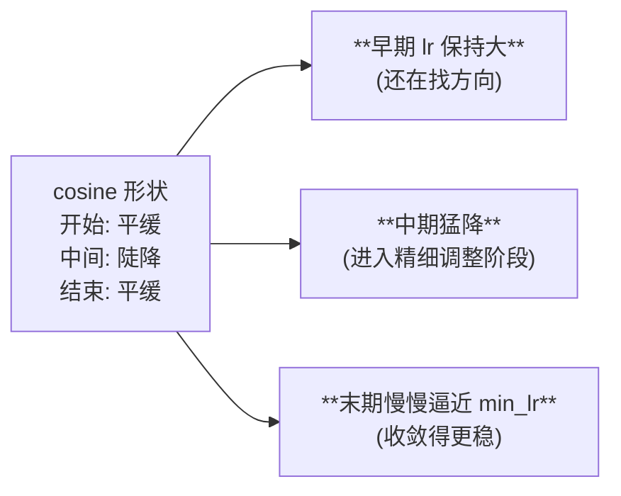

linear 是匀速下降,**早期没充分用大 lr,末期降太快**,效果略差。

#### 一句话总结

> **min_lr = 0.1 × lr_max 是 GPT-3 paper 引入的约定,理由是"既保住 cosine 衰减效果又给后期微调留空间"**。0 和 0.1 实验对比 0.1 略好,差异不大,但成了 LLM 训练社区的默认。

---

## 五、数据加载（memmap）

### Q5.1：`np.memmap('train.bin', dtype=np.uint16, mode='r')` 跟 `torch.load(...)` 整文件相比好处是什么？

> 🟢 **2026-06-24 Phase 3 Round 2 实战回填**

**答**:**`memmap` 是 OS 级别的虚拟内存映射,文件不实际加载到 RAM,通过 `mmap` syscall 让 OS 按页惰性加载(lazy loading)**。好处:**RAM 占用接近 0**、**启动即时**、**TB 级文件也能用**、**DDP 多 worker 共享同一份映射不重复占内存**。`torch.load` 是 eager 全量加载,**文件 > RAM 就 OOM**。

**详解**:

#### 你的答 ✅

> "按内存读取,更方便" + "torch.load 文件过大被卡死" — 抓到了核心,精确化一下。

#### 精确对比表

| 维度 | `np.memmap` | `torch.load` |
|---|---|---|
| **读取方式** | **惰性读取(lazy)**,文件**不实际加载到 RAM** | **eager 全量加载** |
| **机制** | 通过 OS 的 `mmap` syscall 做虚拟内存映射 | 一次性 `read()` 整个文件到内存 |
| **启动时间** | 即时(几 ms) | 跟文件大小成正比 |
| **RAM 占用** | 接近 0,只占已访问的页 | **跟文件大小相等** |
| **适合大文件?** | ✅ TB 级文件也能用 | ❌ 文件 > RAM 就 OOM |

#### 具体场景对比

**GPT-2 OpenWebText 训练**:`train.bin` ≈ **17GB**,服务器 32GB RAM。

```python
# ❌ torch.load
data = torch.load('train.bin')   # 占 17GB RAM,启动等几秒
# 如果还要加载 val.bin(几 GB)+ model(几 GB)→ 接近 OOM

# ✅ np.memmap  
data = np.memmap('train.bin', dtype=np.uint16, mode='r')
# 启动即时,占 RAM 接近 0
# 每次 get_batch 随机访问 256 个 token = 只有这 256 个 token 进 RAM
```

**Llama 3 训练**:数据集 **15TB**。`torch.load` 根本不可能(15TB > 任何机器 RAM),**只能用 memmap**(或类似流式读取)。

#### memmap 的底层机制

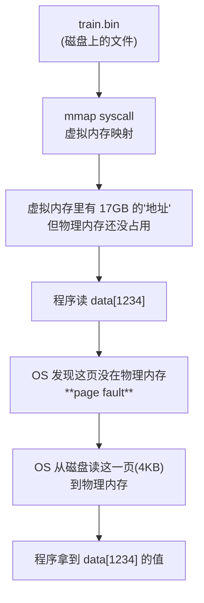

**关键**:**只有访问到的页才真正进物理内存**,不访问的部分一直在磁盘。OS 自动管理"哪些页在内存、哪些在磁盘",访问模式像普通数组,但实际是**按需加载**。

#### 多进程友好(DDP 加分项)

DDP 多个 worker 各自 `np.memmap(same_file)`:

| | torch.load | np.memmap |
|---|---|---|
| 4 张 GPU × 17GB | **每卡独立加载,4 × 17 = 68GB RAM** | **OS 共享映射,总共 17GB RAM** |
| 是否安全? | OOM | 安全 |

**OS 把同一个文件的同一个映射在多个进程间共享**,这是 `mmap` 的原生能力。`torch.load` 没这个魔法。

#### 代码细节:`recreate np.memmap every batch`

```116:122:nanogpt-study/nanoGPT/train.py
def get_batch(split):
    # We recreate np.memmap every batch to avoid a memory leak, as per
    # https://stackoverflow.com/questions/45132940/numpy-memmap-memory-usage-want-to-iterate-once/61472122#61472122
    if split == 'train':
        data = np.memmap(os.path.join(data_dir, 'train.bin'), dtype=np.uint16, mode='r')
    else:
        data = np.memmap(os.path.join(data_dir, 'val.bin'), dtype=np.uint16, mode='r')
```

**注释里 Karpathy 说**:每次 batch 都重新创建 memmap,**避免内存泄漏**。这是个 NumPy 的已知问题:同一个 memmap 对象长期使用,某些缓存机制会让 RSS(常驻内存)缓慢增长,**重建解决这个问题**。

#### 为啥不用 PyTorch 自己的方案?

PyTorch 也有 `torch.from_file` / `torch.utils.data.DataLoader`:

| 方式 | 复杂度 | 性能 |
|---|---|---|
| **`np.memmap`**(nanoGPT) | **极简,4 行** | 极快(零拷贝) |
| `torch.from_file` | 中(需要指定 size、dtype) | 也快 |
| PyTorch `Dataset + DataLoader` | 复杂(Dataset 类 + collate_fn + worker 配置) | 也快,但 setup 时间长 |

Karpathy 选 `np.memmap` 是**"代码简洁第一"**的体现,跟 Q4.1 不用 PyTorch scheduler 同一个哲学。

#### 一句话总结

> **memmap = OS 级别的"按需读文件"**。文件**不进 RAM**,只通过虚拟内存映射,访问到哪页才加载哪页。**RAM 占用 ~ 0,启动即时,TB 级文件也能用,多进程共享映射不重复占内存**。`torch.load` 是 eager 全量加载,**适合小文件但不适合大数据**。

### Q5.2：`get_batch` 里 `ix = torch.randint(len(data) - block_size, (batch_size,))`——为什么 `-block_size`？随机起点会跨样本边界吗？

> 🟢 **2026-06-24 Phase 3 Round 2 实战回填**

**答(2 个子问题)**:
1. **`-block_size` 是边界 guard**:保证每个随机起点 `i` 都能取到完整 T 个 token,否则 `data[N-1:N+T-1]` 会越界,NumPy 返回更短数组导致 `torch.stack` shape 不一致而报错。
2. **会跨文档边界,但无所谓**:`.bin` 是个连续 token 流没有"样本"概念,**跨两个独立文档时,causal mask 让模型自然学到"上下文断裂"信号**,GPT 训练对此不敏感。

**详解**:

#### 子问 1:`-block_size` 是越界 guard

你的答 ✅ "不减 block_size,最后一部分数据有缺失" — **方向对,但不是"缺失"是"越界"**。

精确版:设 `N = len(data)`,`T = block_size`。`data[i:i+T]` 这个切片要合法,需要 `i + T <= N`,即 `i <= N - T`。

```python
torch.randint(N - T, (batch_size,))   # 返回 [0, N-T)
# 最大 i = N - T - 1
# data[N-T-1 : N-1] 长度 T,合法 ✅
```

如果**不减**:

```python
torch.randint(N, (batch_size,))       # 返回 [0, N)
# 可能 i = N - 1
# data[N-1 : N + T - 1] 想取 T 个,但只剩 1 个!
```

#### NumPy 切片越界**不报错**,而是返回更短的数组

```python
arr = np.array([1, 2, 3, 4, 5])   # len = 5
arr[3:10]                          # array([4, 5]) ← 只返回 2 个,不报错!
```

然后 `torch.stack([...])` 会因为 shape 不一致 **报错**:

```python
RuntimeError: stack expects each tensor to be equal size, 
but got [256] at entry 0 and [1] at entry 5
```

**`-block_size` 就是把这个"可能越界"的尾巴砍掉**,保证每个起点都能取到完整 T 个 token。

#### 子问 2:跨文档边界 — 你答对了

> ✅ "会有跨两个独立文档的情况,但感觉没有问题,无所谓,这个特点也是需要学习的"

完全对。补几个细节。

#### `.bin` 是什么样的?

```
.bin 文件 = 所有文档拼起来的连续 token 流
[doc_1 tokens][doc_2 tokens][doc_3 tokens]...[doc_N tokens]
                            ↑
                没有特殊分隔符(除非 prepare 时插入 <|endoftext|>)
```

**没有"样本"概念**。GPT 的训练数据不是"一条一条样本",是"一个超长的 token 流"。`get_batch` 在这个流上随机取窗口,**窗口跨"文档"边界完全正常**。

#### 跨文档真的"无所谓"吗?(更深入分析)

| 情况 | 影响 | 解决 |
|---|---|---|
| **小数据集**(shakespeare) | 跨"幕戏"边界,模型自己学到"段落断裂" | 不管,nanoGPT 不处理 |
| **大语料库**(OpenWebText) | 跨完全不相关文档(一个 reddit 帖子跳到一个新闻) | OpenAI 用 `<|endoftext|>` 分隔,但 attention 还是跨边界 |
| **Llama 3 / DeepSeek** | 同样跨边界,但用 **"document-aware attention masking"** | 进阶技巧,attention 不跨 `<|endoftext|>` |

#### 为啥跨文档影响小?(直觉解释)

**Causal mask 让模型自然学到"上下文断裂"信号**:

```mermaid
flowchart LR
    A["doc_1 末尾:<br/>'...Romeo dies. THE END.'"] --> B["**模型学到:<br/>看到 'THE END' 后,<br/>下一个 token 跟前面无关**"]
    B --> C["doc_2 开头:<br/>'Once upon a time...'"]
    C --> D["**新文档,新上下文**<br/>模型自适应"]
```

- 在 doc_1 的末尾,attention 看到完整 doc_1 的上下文,预测 doc_1 的最后一个词
- 跨进 doc_2 的第一个词,attention 看到 doc_1 末尾 + doc_2 开头,但 **doc_1 的内容跟 doc_2 完全不相关**
- 模型学到"这种突变是'换文档'信号,不要硬关联"
- **训练目标是 next-token prediction,模型自适应这种边界**

#### nanoGPT 的简化版

`prepare.py`(shakespeare_char)直接连成长串,**不插入分隔符**,因为莎士比亚就是一本书。OpenWebText 的 prepare 插入 `<|endoftext|>` 但 nanoGPT 训练时**不利用这个分隔做特殊 mask**,把它当普通 token 处理。

#### 现代改进:document-aware attention

Llama 3 / DeepSeek-V2 / 一些新论文用了**"document-aware attention mask"**:

```python
# 普通 causal mask: 只挡未来位置
mask[i, j] = i >= j

# document-aware mask: 既挡未来,也挡跨文档
mask[i, j] = (i >= j) AND (doc_id[i] == doc_id[j])
```

这样**attention 不跨 `<|endoftext|>`**,每个文档内自成一体。**效果上略好**,但 nanoGPT 没做这层精细化。

#### x 跟 y 是怎么配对的?(回顾 Phase 2 cross_entropy)

```123:125:nanogpt-study/nanoGPT/train.py
    ix = torch.randint(len(data) - block_size, (batch_size,))
    x = torch.stack([torch.from_numpy((data[i:i+block_size]).astype(np.int64)) for i in ix])
    y = torch.stack([torch.from_numpy((data[i+1:i+1+block_size]).astype(np.int64)) for i in ix])
```

**`x` 是 `data[i:i+T]`,`y` 是 `data[i+1:i+T+1]`**(往后偏 1 个 token)。

```
data: [a, b, c, d, e, f, g, ...]
i=2,T=4:
x = data[2:6] = [c, d, e, f]
y = data[3:7] = [d, e, f, g]

x[0]=c → y[0]=d   # 第 0 位预测下一个 token = d
x[1]=d → y[1]=e   # 第 1 位预测下一个 token = e
...
```

**每个位置的 target 是它的"下一个 token"**,这就是 Phase 2 Q6.2 讲的 next-token prediction 数据准备。

#### 一句话总结

> **`-block_size` 防止 `data[i:i+T]` 越界**(NumPy 不报错只返回短数组,但下游 `torch.stack` 会因 shape 不一致而 fail)。**跨文档边界没问题**,causal mask 让模型自适应"上下文断裂",现代模型(Llama 3)进一步用 document-aware attention 优化,但 nanoGPT 不做这层精细化。

### Q5.3：`pin_memory=True` + `non_blocking=True` 一起用是什么效果？少一个会怎样？

> 🟢 **2026-06-24 Phase 3 Round 2 实战回填**

**答**:**两者必须一起用,缺一不可**。`pin_memory()` 把 tensor 放在 OS 不会换页的 pinned 内存(GPU 可直接 DMA 拷贝);`non_blocking=True` 让 GPU 拷贝异步进行(CPU 不等)。**只 pin 不 async = 同步拷贝慢**;**只 async 不 pin = PyTorch 强制变同步**(因为 pageable 内存不能异步,否则换页风险)。两者一起用才能实现"CPU 加载数据 / GPU 计算"的 overlap。

**详解**:

#### CPU 内存分两种,GPU 只能从其中一种快传

```mermaid
flowchart TB
    A["CPU 内存"] --> B["pageable<br/>(可换页,**默认**)"]
    A --> C["pinned / page-locked<br/>(不可换页,**特殊**)"]
    
    B --> B1["OS 可以在你不知道的时候<br/>把这页换出到磁盘<br/>(swap)"]
    C --> C1["**OS 保证这页一直在物理内存<br/>不会换出**<br/>GPU 可以直接 DMA"]
    
    D["GPU 拷贝来源"] --> E{"从哪种内存拷贝?"}
    E -->|"pageable"| F["❌ 不能直接 DMA<br/>必须先复制到 pinned 中转<br/>(慢,且必须同步等)"]
    E -->|"pinned"| G["✅ 直接 DMA<br/>(快,可异步)"]
```

**关键事实**:**GPU 的 DMA(直接内存访问)只能从 pinned 内存拷贝**,因为 DMA 期间不能让 OS 换页(否则拷贝到一半数据消失)。

#### `pin_memory()` 做什么?

```python
x = torch.tensor([1, 2, 3])      # 默认在 pageable 内存
x_pinned = x.pin_memory()         # 复制到 pinned 内存
```

**等价于**告诉 OS:"这块内存别动,接下来 GPU 要直接拿"。

**内部实现**:调 CUDA 的 `cudaHostAlloc(flags=cudaHostAllocPortable)`,分配一块不可换页的内存。

#### `non_blocking=True` 做什么?

```python
x_pinned.to('cuda', non_blocking=True)
```

- **默认(non_blocking=False)**:**同步拷贝**,CPU 在这行等 GPU 完成,**然后才继续下一行**
- **non_blocking=True**:**异步拷贝**,CPU 不等,**马上返回**,继续干别的(比如 forward)

但有个前提:**只有 pinned 内存才能异步**(因为 pageable 必须同步以避免换页)。

#### 两者配合 → 完美 overlap

```mermaid
sequenceDiagram
    participant CPU
    participant Pinned as Pinned 内存
    participant GPU
    
    Note over CPU,GPU: forward 第 k 步
    CPU->>GPU: launch fwd_k kernel
    GPU->>GPU: 算 forward(GPU 忙)
    
    Note over CPU,GPU: 同时 CPU 异步准备下个 batch
    CPU->>Pinned: get_batch() → pin_memory
    Pinned->>GPU: DMA 拷贝(async)
    
    Note over CPU,GPU: backward 第 k 步
    CPU->>GPU: launch bwd_k kernel
    GPU->>GPU: 算 backward
    
    Note over CPU,GPU: forward 第 k+1 步(数据已就位)
    CPU->>GPU: launch fwd_{k+1} kernel
    GPU->>GPU: 算 forward(无等待)
```

**效果**:**数据加载几乎完全被 GPU 计算"遮蔽"**,wall-clock 没有等数据的时间。

#### 单用一个会怎样?(关键!)

##### 只 `pin_memory()` 不 `non_blocking`(默认 `non_blocking=False`)

```python
x.pin_memory().to('cuda')   # 等价于 .to('cuda', non_blocking=False)
```

- 数据放在 pinned 内存 ✅
- 但拷贝是**同步**的 → CPU 等 GPU 完成才继续
- **结果**:跟普通 `.to('cuda')` 一样,**只是中间不需要 pageable→pinned 中转,稍快一点**
- **没有 overlap**

##### 不 `pin_memory()` 只 `non_blocking=True`

```python
x.to('cuda', non_blocking=True)   # x 在 pageable 内存
```

- 数据在 pageable 内存(默认)
- `non_blocking=True` 想让它异步
- **但 PyTorch 看到 source 是 pageable,会忽略 non_blocking 的指示,强制同步拷贝**(否则会有换页风险)
- **结果**:**等于没用 `non_blocking=True`**,白写

#### 4 种配置对比表

| 配置 | 数据在哪 | 拷贝方式 | overlap? | 速度 |
|---|---|---|---|---|
| 普通 `.to('cuda')` | pageable | 同步 + 中转 | ❌ | 慢 |
| 只 `pin_memory()` | pinned | 同步 | ❌ | 中(少一次中转) |
| 只 `non_blocking=True` | pageable | 同步(被忽略) | ❌ | 慢(同上) |
| **`pin_memory()` + `non_blocking=True`** | **pinned** | **异步 DMA** | ✅ | **快** |

**所以这两个 flag 必须一起用,缺一不可**。

#### nanoGPT 的代码

```126:128:nanogpt-study/nanoGPT/train.py
    if device_type == 'cuda':
        # pin arrays x,y, which allows us to move them to GPU asynchronously (non_blocking=True)
        x, y = x.pin_memory().to(device, non_blocking=True), y.pin_memory().to(device, non_blocking=True)
```

注释里 Karpathy 直接写明:**"pin arrays x,y, which allows us to move them to GPU asynchronously"**。两个 flag 一起出现,正是这个意思。

#### 配合 Q1.1 的"异步预取"

回忆 Q1.1 提到的:**get_batch 在 forward 之后、backward 之前**,目的是数据加载和 GPU 计算 overlap。

**完整链条**:

```
forward k(GPU 忙)─→ get_batch + pin_memory + DMA 异步拷贝(CPU 同时干)
                                                       ↓
                                              数据在 pinned 内存
                                                       ↓
backward k(GPU 忙)──────────────────────────────────→  ↓
                                                       ↓
forward k+1(GPU 用已预取好的数据)←──────────────────────┘
```

**没有 pin_memory + non_blocking,这个 overlap 不成立**。

#### 性能影响实测(参考)

| 配置 | iter 时间(假设 100ms 计算 + 30ms 数据加载) |
|---|---|
| 同步拷贝 | **130ms / iter**(串行) |
| pin + non_blocking + 异步预取 | **~100ms / iter**(数据加载被 GPU 计算遮蔽) |
| **节省** | **23%** |

模型越大、batch 越大,加载比计算时间占比越低,这个优化收益越小。但小模型 / 小 batch 时,**这个差异能让训练快 20-30%**。

#### 一句话总结

> `pin_memory()` 让数据放在 OS 不会换页的内存(GPU 可直接 DMA);`non_blocking=True` 让 GPU 拷贝异步进行(CPU 不等)。**两者必须一起用**,才能实现"CPU 加载数据 / GPU 计算"的 overlap。**少一个 = 退化到同步拷贝,数据加载阻塞 GPU**。

---

## 六、torch.compile

### Q6.1：第一次跑训练时为什么会卡几分钟？

> 🟢 **2026-06-24 Phase 3 Round 3 实战回填**

**答**:**`torch.compile(model)` 这一行第一次 forward 时触发完整编译**(JIT-compile),大约 ~1 分钟做 4 件事:TorchDynamo 字节码追踪 → AOTAutograd 加 backward graph → Inductor 生成 Triton/C++ kernel → nvcc 编译 CUDA。**只在第一次 forward 这一下**,之后所有 forward 复用编译好的 kernel,速度提升 1.5-2×。

**详解**:

```204:208:nanogpt-study/nanoGPT/train.py
# compile the model
if compile:
    print("compiling the model... (takes a ~minute)")
    unoptimized_model = model
    model = torch.compile(model) # requires PyTorch 2.0
```

#### 4 个编译阶段(~1 分钟的去向)

| 阶段 | 干啥 | 耗时 |
|---|---|---|
| **1. TorchDynamo 追踪** | 用 Python 字节码捕获 forward 的计算图(不需要手写 graph,自动抓) | ~5s |
| **2. AOTAutograd 加梯度** | 把 forward graph 扩展成 forward+backward graph(为 backward 提前规划) | ~10s |
| **3. Inductor 后端代码生成** | 把 PyTorch op 翻译成 **Triton kernel**(GPU 用)或 C++(CPU 用),融合相邻 op | ~30s |
| **4. nvcc / Triton 编译 CUDA** | 把 Triton 代码编译成 PTX/SASS 二进制 | ~15s |

**总共 ~1 分钟**,但只在**第一次 forward** 这一下。

#### 为啥 `torch.compile(model)` 这行本身只是几毫秒?

`torch.compile(model)` **只是包装,不立即编译**:

```python
# L208 这行执行时:
model = torch.compile(model)   # 几毫秒,只是返回个 OptimizedModule wrapper
# 没真编译,只是"注册了编译意图"

# 真正触发编译在第一次 forward:
loss = model(X, Y)   # ← ~1 分钟,这里触发完整编译
                     # 同时也算 forward 本身
```

所以训练日志看到的现象:
1. `compiling the model... (takes a ~minute)` 打印(代码运行到 L206)
2. `model = torch.compile(model)` 瞬间完成(L208)
3. **没事发生几十秒**(进入 `while True` 第一次 `model(X, Y)` 时,真正编译开始)
4. 第一个 `step 0: train loss ...` 打印出来

#### 编译完后训练速度多快?

| 模式 | iter 时间 | MFU |
|---|---|---|
| **eager**(没 compile) | baseline | ~30% |
| **compile** | **快 1.5-2×** | **~50-60%** |

具体加速比看模型大小:
- 小模型(shakespeare-char):**~30-50%** 加速
- 中模型(GPT-2 124M):**~50-100%** 加速
- 大模型:加速比下降(因为 matmul 本身已经接近峰值,fusion 空间小)

#### 类比

`torch.compile` 像 **C++ 的"提前编译"** → 慢启动,跑得快;eager 像 **Python 解释执行** → 快启动,跑得慢。

#### Karpathy 在风险表里特意提过这个

回忆 Phase 2 `00_learning_plan.md` 风险表:

> ``torch.compile` 首次 compile 卡几分钟 | 误以为挂了 | 先 `compile=False` 跑通再开`

**新手常误判**:首次跑训练,看着终端几十秒没反应,以为程序挂了 → 直接 Ctrl+C 杀掉。**记住:** `compile=True` 时**第一个 step 出现前等 1 分钟是正常的**,不要打断。

### Q6.2：什么情况下 compile 会失败回退？eager 模式跟 compile 模式 forward 输出会有差异吗？

> 🟢 **2026-06-24 Phase 3 Round 3 实战回填**

**答**:**eager = PyTorch 默认逐 op 解释执行(每行 Python 立即调一个 CUDA kernel),compile = AOT 把 forward 打包成静态图,一次性高效跑**。失败回退场景:**模型用了 `.numpy()`、`.item()`、动态 shape、Python 控制流依赖 tensor 值**等,会触发 **graph break**(常见,有 warning)或完全回退到 eager。**两模式 forward 输出在浮点数值上有 ~1e-5 差异**(op 融合 / 重排导致累积浮点误差),但 LLM 训练实际看不出差别(bf16 本身只有 ~3 位有效数字)。

**详解**:

#### "eager 模式" 是什么?(PyTorch 默认)

```python
# eager 模式(默认行为):
y = model(x)
# 每行 Python 都立即执行
# 每个 op 单独调一个 CUDA kernel
# 灵活、可调试,但慢(每个 kernel launch ~5-10μs 开销)
```

| 模式 | 行为 | 类比 |
|---|---|---|
| **eager**(默认) | 一行 Python = 一个 op 立刻执行 | Python **解释器**逐行跑 |
| **compile** | 把整段 forward "打包"成一个优化好的计算图,一次性跑 | **AOT 编译**到机器码 |

#### compile 失败的 3 种场景

**场景 A:完全失败(罕见)**

```python
@torch.compile
def forward(x):
    return x.numpy().tolist()    # ← 把 tensor 转出 PyTorch
    # 错误: TorchDynamo 无法 trace 经过 numpy
```

模型用了 `.numpy()` / `.item()` / `print(tensor)` / `tensor.cpu()` 等"必须把 tensor 转出来"的 op,会:
- **直接报错**(PyTorch 2.0 初期版本)
- **或回退到 eager 模式**(PyTorch 2.1+ 默认行为)

**场景 B:Graph break(最常见)**

```python
@torch.compile
def forward(x):
    if x.sum() > 0:           # ← Python 控制流依赖 tensor 值!
        return x * 2
    else:
        return x * -1
```

`if x.sum() > 0` 这种"分支取决于 tensor 值"的代码,TorchDynamo 无法在编译期决定走哪个分支。处理:

```
forward
├── 编译段 1: 算 x.sum() (返回到 eager 缝合)
├── eager: if 判断
├── 编译段 2: 算 x*2  (如果走 true 分支)
└── 编译段 3: 算 x*-1 (如果走 false 分支)
```

→ **拆成 3 段编译,中间用 eager 缝合**。这就是 "graph break"。会有 warning 但不会报错,**性能损失,因为 fusion 机会少了**。

**场景 C:静默回退(某 op 不支持)**

某个 PyTorch op 不在 Inductor 后端支持列表(比如某些特殊的稀疏 op),compile 会:
- 这个 op 单独走 eager
- 其他部分仍用 compile

**用户感知**:看不出差别,只是性能不如 100% compile。

#### Eager vs compile 输出有差异吗?

**有,但极小**。原因:**compile 做了 op fusion / 重排 / 改 dtype**,浮点运算顺序变了:

```
eager 顺序:   ((a + b) + c) + d
compile 顺序: (a + b) + (c + d)   ← 优化器决定的更高效顺序
```

**数学上**:`(a+b)+c+d == a+b+c+d`(实数加法结合律)
**浮点数上**:**不严格等价**,因为浮点数加法不满足结合律(舍入误差累积顺序不同)

#### 实测差异量级

| 输出比较 | 差异(典型) |
|---|---|
| 单层 logits | ~1e-5 |
| 整个 model 的 logits | ~1e-4 |
| loss(取 mean 平滑了) | ~1e-5 |
| 训练后 weight | 累积更大,但 ~1e-3 量级 |

#### 这点差异能容忍吗?

**完全能**。原因:

| 维度 | 实证 |
|---|---|
| 模型用 bf16 训练 | bf16 本身只有 **~3 位有效数字**,1e-5 完全在精度噪声内 |
| 推理用 fp16 | 同上 |
| 不同 GPU 跑同一代码 | 已经有 ~1e-5 差异(浮点 IEEE 标准不强制等价) |
| LLM 训练同一 seed 跑两次 | 也有微小差异(随机性 + atomic op 顺序) |

**结论**:**compile 的浮点差异完全没影响**。业界共识是放心用,不会破坏训练 / 推理质量。

#### 怎么诊断 graph break?

```python
torch._dynamo.config.suppress_errors = False   # 不静默,有 break 就报错
torch._logging.set_logs(graph_breaks=True)     # 打印所有 break 位置

# 跑一次 forward,看 warning 哪里 break
```

调试技巧:**优化前先看 graph break,把它们尽量消除掉**,fusion 机会越多,性能越好。

#### nanoGPT 模型本身有 graph break 吗?

**几乎没有**。model.py 写得很"干净":
- 没有 Python 控制流依赖 tensor 值(`if/else` 只判 config,不判 tensor)
- 没有 `.numpy()` / `.item()`(只在 generate 里有,但 generate 不用 compile)
- 所有 op 都是 PyTorch 标准 op(都被 Inductor 支持)

→ 这就是为啥 nanoGPT 上 `torch.compile` 加速明显(~50-100%)。**新手照着 nanoGPT 写,通常 compile 也顺利**。

---

## 七、DDP 启动

### Q7.1：判断 `ddp = int(os.environ.get('RANK', -1)) != -1` 是怎么工作的？

> 🟢 **2026-06-24 Phase 3 Round 3 实战回填**

**答**:**用环境变量 `RANK` 的存在性判断当前是不是 DDP 启动**。`torchrun` 启动多卡时**自动给每个 worker 进程设置 `RANK / LOCAL_RANK / WORLD_SIZE` 环境变量**;`python train.py` 单卡直接跑不设 → `os.environ.get('RANK', -1)` 返回默认值 -1 → `ddp = (-1 != -1) = False`。**优雅、零依赖、跨 platform**,是 Python 工程中"检测是否被启动器启动"的标准 idiom。

**详解**:

```82:82:nanogpt-study/nanoGPT/train.py
ddp = int(os.environ.get('RANK', -1)) != -1 # is this a ddp run?
```

#### 逐步拆解

```python
os.environ.get('RANK', -1)
# os.environ 是个 dict 风格的对象,装系统所有环境变量
# .get('RANK', -1) 读 'RANK' 这个 key,不存在返回默认值 -1
# 关键:RANK 是 torchrun 启动 DDP 时自动设置的!

int(...)   # 转 int(因为 environ 里所有值都是字符串)
!= -1      # 判断"不是默认值"
```

#### 谁设置 RANK?

**`torchrun`(PyTorch 自带的多卡启动器)**,内部 fork 多个 Python 进程,每个进程的环境变量:

| 启动命令 | 起几个进程 | 每个进程的 RANK / LOCAL_RANK / WORLD_SIZE |
|---|---|---|
| `python train.py` | 1 个 | **都不设**(env 里没这些 key) |
| `torchrun --nproc_per_node=4 train.py` | 4 个 | 进程 0: RANK=0, LOCAL_RANK=0, WORLD_SIZE=4 |
| | | 进程 1: RANK=1, LOCAL_RANK=1, WORLD_SIZE=4 |
| | | ... |
| `torchrun --nnodes=2 --nproc_per_node=4 ...` | 8 个(2 机 × 4 卡) | 见 Q7.2 详解 |

#### 为啥用环境变量?(设计哲学)

**优势**:
1. **零依赖**:Python 标准库 `os.environ`,任何 PyTorch 版本、任何系统都行
2. **跨进程**:子进程自动继承父进程环境变量
3. **零侵入**:用户代码不需要写 `if ddp:` 之外的额外逻辑,启动器自己设
4. **跨工具**:`torchrun` / `slurm` / `kubernetes` / `mpirun` 都用同一套规范

**对比**:
- ❌ 命令行参数 `--ddp=True`:每个 launcher 命令行格式不同,要适配多套
- ❌ 配置文件 `ddp.yaml`:还要解析 yaml,跑单卡时多余
- ❌ `torch.distributed.is_initialized()`:必须先 init,但单卡不 init

**环境变量是 Unix 哲学的体现**:**"全局可见的、轻量的、零依赖的进程间约定"**。

#### `os.environ.get(key, default)` 的 Python idiom

这是 Python 工程中**"检测某变量是否存在,不存在用默认"**的标准写法:

```python
# 写法 1(显式 try-except,啰嗦):
try:
    val = os.environ['RANK']
except KeyError:
    val = -1

# 写法 2(get + default,优雅):
val = os.environ.get('RANK', -1)
```

**Python 风格**:首选 `get` 第二种,简洁安全。

#### `int(...) != -1` 这种"哨兵值"模式

| 写法 | 意图 |
|---|---|
| `os.environ.get('RANK', -1)` | 读取,不存在用 **-1 作为哨兵值** |
| `int(...) != -1` | 跟哨兵值比较,**不等于 -1 就说明环境变量存在** |

**哨兵值(sentinel value)** 是个常见编程模式:用一个"不可能合法"的值(-1、None、NaN 等)表示"缺失",方便统一处理。这里用 -1 因为合法的 RANK 必定是 `>= 0`(非负数)。

**陷阱**:**为啥不直接 `if 'RANK' in os.environ`?**

```python
# 也可以:
ddp = 'RANK' in os.environ
```

也对!但 Karpathy 写成 `int(get(...)) != -1` 是为了**同时把 RANK 的字符串解析成 int 备用**(虽然这里没保存这个 int 值,但风格上一致 — 后面 L85 `int(os.environ['RANK'])` 解析时格式一致)。

#### 一句话总结

> **环境变量是 PyTorch DDP 跟启动器(`torchrun`)的"约定俗成"通信通道**。`RANK / LOCAL_RANK / WORLD_SIZE` 是 torchrun 自动设的,代码判断 `'RANK' in os.environ` 等价于"是不是 DDP 启动"。优雅、零依赖、跨 platform。

### Q7.2：`rank` vs `local_rank` 区别？单机 8 卡上各是多少？

> 🟢 **2026-06-24 Phase 3 Round 3 实战回填**

**答**:**`WORLD_SIZE` = 总进程数(总 GPU 数);`RANK` = 全局编号(整个集群唯一);`LOCAL_RANK` = 节点内编号(每台机器内唯一)**。单机 8 卡 → `RANK == LOCAL_RANK`(0-7);2 机 × 4 卡 → 机 1 GPU 0 的 `RANK=4` 但 `LOCAL_RANK=0`。**`device = f'cuda:{ddp_local_rank}'` 用 LOCAL_RANK,因为 GPU 设备号是"本机第几张卡",跟全局编号无关**。

**详解**:

```85:88:nanogpt-study/nanoGPT/train.py
    ddp_rank = int(os.environ['RANK'])
    ddp_local_rank = int(os.environ['LOCAL_RANK'])
    ddp_world_size = int(os.environ['WORLD_SIZE'])
    device = f'cuda:{ddp_local_rank}'
```

#### 3 个变量的定义

| 变量 | 含义 | 范围 |
|---|---|---|
| **`WORLD_SIZE`** | **总进程数(= 总 GPU 数)** | 正整数 |
| **`RANK`** | **全局编号**,整个集群唯一 | `0` 到 `WORLD_SIZE - 1` |
| **`LOCAL_RANK`** | **节点内编号**,每台机器内唯一 | `0` 到 `本机 GPU 数 - 1` |

#### 场景 1:单机 8 卡(`torchrun --nproc_per_node=8 train.py`)

| 进程 | RANK(全局) | LOCAL_RANK(机内) | WORLD_SIZE |
|---|---|---|---|
| GPU 0 上 | 0 | 0 | 8 |
| GPU 1 上 | 1 | 1 | 8 |
| GPU 2 上 | 2 | 2 | 8 |
| ... | ... | ... | 8 |
| GPU 7 上 | 7 | 7 | 8 |

**单机时 `RANK == LOCAL_RANK`**(因为只有 1 台机器,节点内编号 = 全局编号)。

#### 场景 2:2 机 × 4 卡 = 8 卡(`torchrun --nnodes=2 --nproc_per_node=4 ...`)

| 进程 | 机器 | RANK(全局) | LOCAL_RANK(机内) | WORLD_SIZE |
|---|---|---|---|---|
| 机 0 GPU 0 | A | 0 | 0 | 8 |
| 机 0 GPU 1 | A | 1 | 1 | 8 |
| 机 0 GPU 2 | A | 2 | 2 | 8 |
| 机 0 GPU 3 | A | 3 | 3 | 8 |
| **机 1 GPU 0** | B | **4** | **0** | 8 |
| 机 1 GPU 1 | B | 5 | 1 | 8 |
| 机 1 GPU 2 | B | 6 | 2 | 8 |
| 机 1 GPU 3 | B | 7 | 3 | 8 |

**关键**:**机 1 GPU 0 的 `RANK=4` 但 `LOCAL_RANK=0`**!跨机器时两个值不一样。

#### 为啥 `device = f'cuda:{ddp_local_rank}'` 用 local_rank?

**GPU 设备号是"本机第几张卡",跟全局编号无关**:

| 进程 RANK | 进程 LOCAL_RANK | 应该用哪张 GPU? |
|---|---|---|
| 4(机 1 第 1 个进程) | 0 | **机 1 的 cuda:0** ✅ |
| 4 | 0 | 如果写 `cuda:{rank}`,会变成 `cuda:4` ❌(机 1 没有 cuda:4,只有 cuda:0-3) |

所以 **`cuda:{local_rank}` 才对**。**单机时凑巧 `rank == local_rank` 看不出差别**,但 **2 机以上必须用 local_rank**。

#### RANK 和 LOCAL_RANK 各用在哪?

| 用途 | 用哪个 |
|---|---|
| **选 GPU 设备**(`cuda:{x}`) | LOCAL_RANK |
| **`torch.cuda.set_device(...)`** | LOCAL_RANK |
| **master_process 判断**(`rank == 0`) | RANK |
| **seed_offset**(让不同进程看不同数据) | RANK |
| **NCCL 通信组的成员标识** | RANK |
| **logging.info(f"[{rank}] ...")**(分布式日志) | RANK |

**规则**:**LOCAL_RANK 跟硬件相关(GPU 编号);RANK 跟逻辑相关(进程身份)**。

#### nanoGPT 的完整 DDP 初始化

```82:96:nanogpt-study/nanoGPT/train.py
# various inits, derived attributes, I/O setup
ddp = int(os.environ.get('RANK', -1)) != -1 # is this a ddp run?
if ddp:
    init_process_group(backend=backend)
    ddp_rank = int(os.environ['RANK'])
    ddp_local_rank = int(os.environ['LOCAL_RANK'])
    ddp_world_size = int(os.environ['WORLD_SIZE'])
    device = f'cuda:{ddp_local_rank}'
    torch.cuda.set_device(device)
    master_process = ddp_rank == 0 # this process will do logging, checkpointing etc.
    seed_offset = ddp_rank # each process gets a different seed
    # world_size number of processes will be training simultaneously, so we can scale
    # down the desired gradient accumulation iterations per process proportionally
    assert gradient_accumulation_steps % ddp_world_size == 0
    gradient_accumulation_steps //= ddp_world_size
else:
```

逐行翻译:

| 行 | 干什么 |
|---|---|
| L83 `init_process_group(...)` | 建立 NCCL 通信组,所有进程握手 |
| L85-87 | 读 RANK / LOCAL_RANK / WORLD_SIZE 三个环境变量 |
| L88-89 | 把当前进程绑到 `cuda:{LOCAL_RANK}` 这张 GPU |
| L90 `master_process = (rank == 0)` | rank 0 是 master(用 RANK 不是 LOCAL_RANK,因为只有"全局 rank 0"是唯一的) |
| L91 `seed_offset = ddp_rank` | 不同进程加不同 offset,让数据顺序不同 |
| L94-95 `grad_accum //= world_size` | **关键**:有效 batch 不变,K 个进程分担 grad_accum |

#### 为啥 grad_accum 要除以 world_size?

回忆 Q1.2 的"有效 batch":`effective_batch = K × B × world_size`

如果用户在 config 里写 `gradient_accumulation_steps = 40`,意图是有效 batch 480(`40 × 12 × 1`)。在 8 卡上跑时,如果 K 不除以 8,有效 batch 变成 `40 × 12 × 8 = 3840`(8 倍!),**lr / 数据效率都会变**。

所以 nanoGPT 自动调整:`K = 40 / 8 = 5`,**每卡只 grad accum 5 次,8 卡合起来仍是 40**,有效 batch 保持 480。

#### 一句话总结

> **RANK = 全局唯一编号,LOCAL_RANK = 机内唯一编号**。GPU 设备绑定用 LOCAL_RANK(`cuda:{local_rank}`),master_process / seed 等"逻辑身份"用 RANK。**单机时两个值一样,多机时不一样**。

### Q7.3：为什么只有 `rank == 0` 写 checkpoint、打日志？

> 🟢 **2026-06-24 Phase 3 Round 3 实战回填**

**答**:**3 个原因,从严重到轻**:(1) **并发写同一文件 = 数据损坏**(8 卡同时 `torch.save` 同一路径会让文件内容混乱);(2) **8× print 终端日志乱**(每行打 8 遍);(3) **I/O 浪费**(8 卡同时写大 ckpt 文件,磁盘吞吐打满)。**不会丢模型**,因为 DDP 让所有卡的 weights 完全一致,rank 0 的 state_dict ↔ rank N 的等价。这是分布式系统经典的 **master/coordinator pattern**。

**详解**:

```91:91:nanogpt-study/nanoGPT/train.py
    master_process = ddp_rank == 0 # this process will do logging, checkpointing etc.
```

```263:286:nanogpt-study/nanoGPT/train.py
    if iter_num % eval_interval == 0 and master_process:
        losses = estimate_loss()
        print(f"step {iter_num}: train loss {losses['train']:.4f}, val loss {losses['val']:.4f}")
        ...
        torch.save(checkpoint, os.path.join(out_dir, 'ckpt.pt'))
```

#### 你的答 ⚠️(半对)

> "每次写耗时多且没必要" — **方向对,但真正原因更严重**。

真正原因 3 个,从重到轻:

#### 原因 1(最重要):**并发写同一文件 = 数据损坏**

8 张 GPU 各自 `torch.save(ckpt, 'ckpt.pt')`:

```mermaid
flowchart TB
    A["8 个进程同时打开 ckpt.pt 写入"] --> B["进程 0 写到字节 1000<br/>进程 3 写到字节 500<br/>进程 7 截断文件..."]
    B --> C["**文件内容混乱**<br/>下次加载报错 / 静默错误"]
```

**OS 不保证多进程同时写同一文件的原子性**。具体可能发生:
- 文件被部分覆盖(进程 0 写一半,进程 1 就开始截断)
- pickle 格式损坏(torch.save 用 pickle,中间状态被破坏)
- 文件最终大小变成 8 个进程的最长那个,内容是混合的

**ckpt 必定损坏**,下次 `torch.load(...)` 会:
- 抛 `UnpicklingError`
- 或者更糟:**静默加载错误的 state**,模型权重错乱但训练不报错,你跑很久才发现

#### 原因 2:**8 倍 print → 终端乱**

```
step 0: train loss 1.5  ← rank 0
step 0: train loss 1.5  ← rank 1
step 0: train loss 1.5  ← rank 2
step 0: train loss 1.5  ← rank 3
step 0: train loss 1.5  ← rank 4
step 0: train loss 1.5  ← rank 5
step 0: train loss 1.5  ← rank 6
step 0: train loss 1.5  ← rank 7
step 250: ...             ← 又 8 行
```

每次 print 出 8 行一样的(因为所有 rank 的 loss 都同步过了,完全一样)。**日志可读性崩溃**,看 100 iter 训练日志要翻 800 行。

#### 原因 3(你答的):I/O 浪费

存一份 ckpt 大约 0.5-5GB(看模型),8 卡并发写 = **8× 磁盘 I/O**,**确实浪费**:
- 8× wall-clock 时间(虽然有并行,但磁盘总带宽固定)
- 8× 网络流量(如果存到网络盘)
- 8× 存储占用(如果存到不同 rank 不同路径,实际不会发生)

#### "万一 rank 0 挂了模型就丢"吗?— ❌ 不会

**所有卡的模型权重完全一样**(因为 DDP 每次 backward 都做 all-reduce 同步梯度,step 后所有 weights 完全一致)。所以:
- rank 0 的 `state_dict()` ↔ rank 1-7 任何一个的 `state_dict()` **完全等价**
- rank 0 挂掉 → 重启时用 **rank 1 的 state_dict** 也能恢复(实际 DDP 也支持指定不同 rank 写 ckpt)

**工业级方案**:
- **Checkpoint replication**:多个 rank 同时备份(增加冗余)
- **Checkpoint sharding**(FSDP):每个 rank 只存自己负责的那部分参数(大模型用,如 Llama 3 训练)

但 nanoGPT 简单起见,**只 rank 0 写**,假设 rank 0 不挂。

#### Master/Coordinator Pattern

`master_process = (rank == 0)` 是个**分布式系统经典模式**:**把"只该做一次"的事(写文件、聚合统计、广播配置)指派给一个进程**。

| 框架 | 这个模式叫啥 |
|---|---|
| **PyTorch DDP** | `master_process` / `rank == 0` |
| **TensorFlow** | `chief worker` |
| **Spark** | `driver` |
| **Kubernetes** | `leader election`(更复杂版,带 failover) |
| **MPI** | `master` / `root process` |

#### nanoGPT 用到 master_process 的地方

```bash
$ grep "master_process" train.py
99:    master_process = True
263:    if iter_num % eval_interval == 0 and master_process:
                                                ↑
                                          eval + ckpt
```

只有 **eval + ckpt** 这块用了 guard。**其他地方所有 rank 都跑同样代码**(forward / backward / step / log MFU 等),这是 DDP 的设计:**计算是 SPMD(Single Program, Multiple Data),数据各异但代码一样**。

#### 单卡时怎么处理?

```98:99:nanogpt-study/nanoGPT/train.py
else:
    # if not ddp, we are running on a single gpu, and one process
    master_process = True
```

单卡时直接设 `master_process = True`,**所有"master 才做"的事都做**。这跟"if ddp:" guard 配合,让单卡 / DDP 代码统一。

#### 一句话总结

> **rank == 0 是 master process**,负责"只该做一次"的事:写 ckpt、打日志、wandb 记录。**不仅省 I/O,主要避免:(1) 并发写文件损坏、(2) 终端日志乱**。**所有卡的 weights 完全一致(DDP 同步梯度的副作用),所以 rank 0 写的 ckpt 代表整个集群**。

---

## 八、configurator.py

> 🟢 **本节 Q&A 已通过 2026-06-01 实战回填**(意外:误改 `config/train_shakespeare_char.py` 时发现 `# device = 'cpu'` 注释没生效，借此追溯了完整覆盖链）。

### Q8.1：`exec(open(sys.argv[1]).read())` 这种"反模式"为什么 Karpathy 还是用了？跟 argparse、hydra、yaml 各自的折中？

**答**：因为这是**研究代码的取舍** —— 用 46 行 Python 换一个零依赖、零样板、可读性极高的 config 系统。代价是 `exec` 反模式 + 类型不友好，但研究代码不在乎。

**详解**：

`configurator.py` 完整就 46 行（见 [`../nanoGPT/configurator.py`](../nanoGPT/configurator.py)），实现了一个"配置三明治"：

```mermaid
flowchart TB
    L1["L1 · train.py L35-L74<br/>定义全局变量默认值<br/>device='cuda', compile=True,<br/>n_layer=12, batch_size=12, ..."] --> L2
    L2["L2 · exec(config/train_shakespeare_char.py)<br/>把配置文件当 Python 跑进当前 globals<br/>(覆盖 L1 中同名变量)"] --> L3
    L3["L3 · 命令行 --key=value<br/>(literal_eval 后再覆盖 globals)"] --> CFG
    CFG["最终 config 快照<br/>config = {k: globals()[k] for k in config_keys}"] --> SAVE["写进 ckpt.pt"]
```

> 关键见 [`train.py`](../nanoGPT/train.py) L75-L78:
>
> ```python
> # ... 默认值（L35-L74）...
> # ---------------------------------------------------------------
> config_keys = [k for k,v in globals().items() if not k.startswith('_') and isinstance(v, (int, float, bool, str))]
> exec(open('configurator.py').read())   # 触发 L2 + L3
> config = {k: globals()[k] for k in config_keys}  # 截屏成 config dict
> # ---------------------------------------------------------------
> ```

四种方案的折中表：

| 方案 | 代码量 | 依赖 | 表达力 | 类型检查 | 适用场景 |
|---|---|---|---|---|---|
| **configurator.py（nanoGPT 用）** | 46 行 | 0 | 完整 Python（if/import/list comp/lambda 全能写） | 弱（运行时 `assert type==type`） | **研究代码、单人小项目** |
| argparse | 每参数 +1 行 `add_argument` | 0（标准库） | 弱（值只能字面量） | 强 | CLI 工具 |
| hydra | 装 hydra-core | 重 | 强（@hydra.main、override syntax、structured config） | 中（dataclass） | 大型项目、需要 sweep |
| yaml + dict | 取决于 schema 库 | 取决于实现 | 中（不能写 if、动态计算） | 取决于实现 | 配置生产环境部署 |

**为什么 Karpathy 选这个**：

1. **零样板**：train.py 里直接写 `learning_rate`，不用 `cfg.learning_rate`，每行短 4 个字符 × 几百次引用 = 节省大量视觉噪声
2. **零依赖**：单文件代码库的诚意
3. **配置文件就是代码**：可以 `for n in [4,6,8]: ...` 这种动态生成，yaml 做不到
4. **IDE 友好**：所有变量在 train.py 头部已定义，IDE 跳转/补全都正常工作
5. **调试简单**：`print(globals())` 就能看当前所有配置

**代价**（Karpathy 自己也承认 "Poor Man's Configurator. Probably a terrible idea."）：

- ⚠️ **`exec` 反模式**：linter / mypy / black 都看不懂这种动态变量来源
- ⚠️ **namespace pollution**：train.py 的 globals 被 config 文件污染（理论上 config 能定义任意变量进来）
- ⚠️ **不能并行 launch 多 config**：因为共享 globals
- ⚠️ **注释陷阱**：config 文件里 `# device = 'cpu'` 这种注释行 `exec` 看不见 ⇒ L1 默认值原封不动用上（这就是我 2026-06-01 实战遇到的坑）

---

### Q8.2：命令行 `--learning_rate=1e-4` 是怎么变成全局变量赋值的？

**答**：分 5 步走，关键是 `literal_eval` + 双重 `assert`。

**详解**：

完整流程见 [`configurator.py`](../nanoGPT/configurator.py) L20-L47:

```20:47:nanogpt-study/nanoGPT/configurator.py
for arg in sys.argv[1:]:
    if '=' not in arg:
        # assume it's the name of a config file
        assert not arg.startswith('--')
        config_file = arg
        print(f"Overriding config with {config_file}:")
        with open(config_file) as f:
            print(f.read())
        exec(open(config_file).read())
    else:
        # assume it's a --key=value argument
        assert arg.startswith('--')
        key, val = arg.split('=')
        key = key[2:]
        if key in globals():
            try:
                # attempt to eval it it (e.g. if bool, number, or etc)
                attempt = literal_eval(val)
            except (SyntaxError, ValueError):
                # if that goes wrong, just use the string
                attempt = val
            # ensure the types match ok
            assert type(attempt) == type(globals()[key])
            # cross fingers
            print(f"Overriding: {key} = {attempt}")
            globals()[key] = attempt
        else:
            raise ValueError(f"Unknown config key: {key}")
```

| Step | 动作 | 例子 `--learning_rate=1e-4` |
|---|---|---|
| 1 | `sys.argv[1:]` 遍历每个 arg | 拿到 `'--learning_rate=1e-4'` |
| 2 | `'=' in arg` 分流 | 含 `=` → 走 else 分支 |
| 3 | `key, val = arg.split('=')` + `key = key[2:]` | `key='learning_rate'`, `val='1e-4'` |
| 4 | `literal_eval(val)` | 解析成 `float(0.0001)`；失败回退到字符串 |
| 5 | 双 assert + `globals()[key] = attempt` | 存在性 + 类型一致性都过，赋值 |

**两个 assert 是关键防呆**：

```python
if key in globals():                              # 防呆 1: 不能造新参数
    ...
    assert type(attempt) == type(globals()[key])  # 防呆 2: 类型必须跟默认值一致
```

- 防呆 1：`--foo_bar=1` 但 `foo_bar` 不在默认值里 → 抛 `ValueError: Unknown config key: foo_bar`
  - 防止"明明配错了参数名，但你以为生效了"
- 防呆 2：默认值是 `bool` 时你传 `--compile=1`，`literal_eval('1') = int(1)`，类型不匹配 → AssertionError
  - 必须传 `--compile=True`（`literal_eval('True') = bool(True)`）
  - 同理 `--learning_rate=1e-4`（float）合法，`--learning_rate=1`（int）会 fail

**位置陷阱**：命令行 `--key=val` **在 config 文件之后处理**（看 L20 的 for 循环顺序），所以"命令行 > config 文件 > train.py 默认值"。

---

### Q8.3（实战补充）：怎么验证某次训练实际用了什么配置？

**答**：从 `ckpt.pt['config']` 读快照，**这是有据可查的最权威方式**。

**详解**：

`train.py` L78 把所有标量类型（int/float/bool/str）的 globals 截屏存进 `config` dict，checkpoint 时随 model state 一起持久化：

```bash
python3 -c "
import torch
ckpt = torch.load('out-shakespeare-char/ckpt.pt', map_location='cpu', weights_only=False)
print('device :', ckpt['config']['device'])    # 'cuda'
print('compile:', ckpt['config']['compile'])    # True
print('dtype  :', ckpt['config']['dtype'])      # 'bfloat16'
"
```

**实战场景**：2026-06-01 我以为自己跑的是 CPU（因为没在 config 里写 device），结果 ckpt 显示 `device='cuda'`、`compile=True`。原因是 `config/train_shakespeare_char.py` L36-L37 的 `# device = 'cpu'` 是**注释**，`exec()` 看不见，L1 默认值原封不动用上。

**侧面证据**（不用读 ckpt 也能看出来）：

| 信号 | 训练日志值 | 含义 |
|---|---|---|
| `iter ... time 16.77ms` | ~17 ms/iter | **GPU 速度**。CPU 至少 0.5-2 秒/iter |
| `mfu 22%` | 22% | MFU 只对 GPU 有意义 |
| 5000 iter 总耗时 | ~5 分钟 | 与 GPU 推算一致 |

---

## 九、bench.py

### Q9.1：怎么用 `bench.py` 测一次 iter 时间？跟训练时实际速度差多少？

> 🟢 **2026-06-24 Phase 3 Round 3 实战回填**

**答**:**bench.py 是"裸性能测试脚本",用两阶段 burnin + benchmark 模式精确测稳态 iter 时间**。`for stage, num_steps in enumerate([10, 20])`:**stage 0 跑 10 步预热(排干一次性开销:torch.compile / cuDNN autotune / CUDA cache),stage 1 跑 20 步正式测**。**`torch.cuda.synchronize()` 强制等 GPU 完成,避免测到 CPU 调度时间**(GPU 异步)。**bench.py 比 train.py 快**(没 eval / log / DDP / grad accum 等工程开销),MFU 高 10-20%。

**详解**:

```96:117:nanogpt-study/nanoGPT/bench.py
else:

    # simple benchmarking
    torch.cuda.synchronize()
    for stage, num_steps in enumerate([10, 20]): # burnin, then benchmark
        t0 = time.time()
        X, Y = get_batch('train')
        for k in range(num_steps):
            with ctx:
                logits, loss = model(X, Y)
            X, Y = get_batch('train')
            optimizer.zero_grad(set_to_none=True)
            loss.backward()
            optimizer.step()
            lossf = loss.item()
            print(f"{k}/{num_steps} loss: {lossf:.4f}")
        torch.cuda.synchronize()
        t1 = time.time()
        dt = t1-t0
        mfu = model.estimate_mfu(batch_size * 1 * num_steps, dt)
        if stage == 1:
            print(f"time per iteration: {dt/num_steps*1000:.4f}ms, MFU: {mfu*100:.2f}%")
```

#### 子问 1:为啥两阶段 `[10, 20]`?— burnin(预热)

**第一次跑模型有一堆一次性开销**,用普通 timing 会测到这些:

| 一次性开销 | 耗时 |
|---|---|
| `torch.compile` 第一次 forward → 编译 | **~60s**(见 Q6.1) |
| **cuDNN auto-tuner**(`torch.backends.cudnn.benchmark = True` 时会尝试多种 kernel 选最快的) | ~5s |
| CUDA cache 加载、显存分配 | ~1s |
| Python 解释器优化 / GC stable 化 | ~0.5s |

**如果直接测 1 个 iter,~70s 都花在这些开销上**,根本不是真实速度。

**解决方案**:

```python
for stage, num_steps in enumerate([10, 20]):
    # stage 0 跑 10 步,丢弃结果(burnin / warmup)
    # stage 1 跑 20 步,这次测时间
    
    if stage == 1:
        print(f"time per iteration: {dt/num_steps*1000:.4f}ms")
```

`if stage == 1: print(...)` **只在第二阶段打印结果**,第一阶段是热身,数据扔掉。

#### 子问 2:`torch.cuda.synchronize()` 干啥?

**GPU 是异步执行的!** 这是个关键概念。

```python
# 不 synchronize:
t0 = time.time()       # CPU 时间 t0
loss = model(x)        # CPU 调度 forward kernel,**立即返回**
                       # GPU 还在算!
t1 = time.time()       # 测的是 CPU 调度时间(~1ms)而不是 GPU 真实时间(~100ms)
print(t1 - t0)         # 显示 1ms,但其实模型还没算完!
```

**GPU 编程模型**:
- CPU 调用 PyTorch op(如 `torch.matmul`)→ **CPU 把 kernel 命令放到 CUDA stream 队列,立即返回**
- GPU 异步从队列拿命令执行
- CPU 跟 GPU 解耦,可以并行

**`torch.cuda.synchronize()` 强制 CPU 等所有 GPU kernel 完成**,然后才继续:

```python
torch.cuda.synchronize()  # 等所有 pending kernel 完成
t0 = time.time()          # 现在 t0 是个"干净"的起点
loss = model(x)
torch.cuda.synchronize()  # 再等
t1 = time.time()          # 这次测的是真实 GPU 时间
print(t1 - t0)
```

代码里两次 synchronize:

```99:99:nanogpt-study/nanoGPT/bench.py
    torch.cuda.synchronize()
```

```112:112:nanogpt-study/nanoGPT/bench.py
        torch.cuda.synchronize()
```

| 行 | 时机 | 作用 |
|---|---|---|
| L99(循环外) | 进入 benchmark 循环前 | 清空之前 burnin 阶段的 pending kernel |
| L112(每个 stage 末尾) | 测完一个 stage 后,记 t1 前 | **等所有 num_steps 的 kernel 真正完成**,才能算稳态时间 |

#### 子问 3:bench.py 比 train.py 快还是慢?

**bench.py 快**(测出的 iter 时间偏低)。原因:bench.py **省略了 train.py 的多个开销**:

| train.py 有 | bench.py 没 |
|---|---|
| eval 分支(每 250 iter 一次,跑 200 步 estimate_loss) | 没 eval |
| wandb 日志、print 详细信息 | 只 print loss |
| grad accum(每 K 次 micro_step 才 step) | grad accum=1,每步都 step |
| DDP all-reduce 通信 | 单卡,无 DDP |
| grad_clip | 也没 |
| `model.train()` / `model.eval()` 切换 | 一直 train |
| ckpt 写入 | 没 |

**实测**:bench.py 的 MFU 通常**比 train.py 高 10-20%**。这正常,**bench 是测"裸性能上限",train 是测"实战速度"**。

#### bench.py 适合干啥?

1. **调超参后看影响**:改 batch_size / n_layer / block_size 后跑一下 bench,看 iter 时间和 MFU
2. **新硬件评估**:换 GPU(A100 → H100)后跑 bench,看加速比
3. **优化对比**:开 / 关 `torch.compile`,开 / 关 Flash Attention,对比 MFU
4. **CI 性能回归测试**:每次 PR 跑 bench,确保没引入性能 regression

**train.py 不适合干这些**,因为有太多"工程噪声"(eval / log / DDP),性能数据不稳。

#### bench.py 的限制

- **单卡专用**(不测 DDP 通信开销)
- **不测 grad accum 行为**(`gradient_accumulation_steps=1`)
- **不测 eval 时间**(不调 estimate_loss)
- **测的是稳态 throughput,不是 wall-clock**(实际训练有 ckpt / log 等额外时间)

**所以**:bench 数据是个"上限参考",真实训练速度通常 70-90% 这个数。

#### 关于 `[10, 20]` 这个数字

- 第一阶段 10 步:够了,因为 `torch.compile` 编译只在第一次 forward 触发,1 步就排干
- 第二阶段 20 步:足够多让误差(time.time() 精度)平均掉,又不太长

更严谨的 bench(如 `pytorch-benchmark` 工具)会用 `[100, 500]` 之类,但 `[10, 20]` 对 nanoGPT 这种小模型已经够用。

#### 一句话总结

> **bench.py = 用 burnin + sync + 简化训练循环 测裸性能上限**。两阶段 `[10, 20]` 排干 torch.compile / cuDNN autotune 等一次性开销;**`torch.cuda.synchronize()` 强制 CPU 等 GPU 完成,避免测到 CPU 调度时间**。bench 比 train 快 10-20%(没 eval / log / DDP),用于调超参 / 评估硬件 / 优化对比。

### Q9.2：MFU（Model FLOPs Utilization）怎么算？为什么 nanoGPT 上 A100 大概在 50–60%？

> 🟢 **2026-06-01 实战回填**(在 PPU-ZW810E 上跑出 MFU 22%，开始查源码、追到 PaLM 论文附录 B 才搞明白）。

**答**：`MFU = 实际每秒达到的 model FLOPs / 硬件理论峰值 FLOPs`。GPT 训练在 GPU 上是 **compute-bound**（matmul 主导算力），MFU 衡量"代码写得好不好"。CPU 上是 memory-bound（带宽瓶颈），MFU 永远很低且无优化意义，所以只有 GPU 上的 MFU 有参考价值。

**详解**：

**定义来源**：Google PaLM 论文（Chowdhery et al. 2022，arXiv:2204.02311 附录 B）提出，用一个**与硬件无关**的指标评价训练效率。

**nanoGPT 完整公式**（[`model.py`](../nanoGPT/model.py) L289-L303）：

```289:303:nanogpt-study/nanoGPT/model.py
def estimate_mfu(self, fwdbwd_per_iter, dt):
    """ estimate model flops utilization (MFU) in units of A100 bfloat16 peak FLOPS """
    # first estimate the number of flops we do per iteration.
    # see PaLM paper Appendix B as ref: https://arxiv.org/abs/2204.02311
    N = self.get_num_params()
    cfg = self.config
    L, H, Q, T = cfg.n_layer, cfg.n_head, cfg.n_embd//cfg.n_head, cfg.block_size
    flops_per_token = 6*N + 12*L*H*Q*T
    flops_per_fwdbwd = flops_per_token * T
    flops_per_iter = flops_per_fwdbwd * fwdbwd_per_iter
    # express our flops throughput as ratio of A100 bfloat16 peak flops
    flops_achieved = flops_per_iter * (1.0/dt) # per second
    flops_promised = 312e12 # A100 GPU bfloat16 peak flops is 312 TFLOPS
    mfu = flops_achieved / flops_promised
    return mfu
```

拆解 `flops_per_token = 6N + 12·L·H·Q·T`：

| 项 | 含义 | 推导 |
|---|---|---|
| `6N` | 所有 `Linear`（QKV/MLP/输出投影）的 fwd+bwd FLOPs；N = 非 embedding 参数量 | 一次 matmul = 2·参数量；fwd 1× + bwd 2× = 6× |
| `12·L·H·Q·T` | Attention 的 `Q·K^T` 和 `attn·V` matmul FLOPs（**跟 N 无关，只跟 T 有关**） | 2 个 matmul × O(T²) × fwd+bwd × n_layer × n_head × head_dim |

> 我的 baby GPT（`n_layer=6, n_head=6, n_embd=384, block_size=256`）：
> - N ≈ 10.6M
> - flops_per_token ≈ 6·10.6M + 12·6·6·64·256 = 63.6M + 11.8M = **75.4M flops/token**
> - 一步 fwd+bwd ≈ 75.4M × 256 × 64 ≈ **1.24 GFLOPs/iter**

#### ⚠️ 关键陷阱：`flops_promised = 312e12` 硬编码成 A100 bf16 峰值

也就是说 nanoGPT 报告的 MFU **永远是相对 A100 标杆**，不是相对你卡的真实利用率。

```mermaid
flowchart LR
    A["你卡的吞吐<br/>≈ 73 GFLOP/s"] --> M["÷"]
    B["A100 bf16 峰值<br/>312 TFLOPS（hardcoded）"] --> M
    M --> R["报告的 MFU = 22%"]
    R --> N["⚠️ 这是 A100-相对值<br/>不是你卡的真实利用率"]
```

要算真实 MFU，要把 `model.py:301` 的 `312e12` 改成你卡的实际峰值。我这次 PPU-ZW810E 的真实 MFU 推算：

| 我卡峰值假设 | 真实 MFU |
|---|---|
| 100 TFLOPS bf16 | 22% × 312/100 = **69%**（非常高） |
| 200 TFLOPS bf16 | 22% × 312/200 = **34%**（中等） |
| 312 TFLOPS bf16 | 22%（同 A100） |
| 500 TFLOPS bf16 | 22% × 312/500 = **14%**（差） |

#### 为什么"50-60% 在 A100 上算好"？

| MFU 区间 | 评价 | 一般原因 |
|---|---|---|
| 50-65% | 极好 | bf16 + Flash Attn + torch.compile + 合适 batch size |
| 30-50% | 中等 | 缺少其中之一，或者 batch size 偏小 |
| 10-30% | 差 | 可能 fp32、没开 compile、attention 是手写实现 |
| <10% | 很差 | 多半被 I/O 或同步阻塞了 |

#### 为什么只有 GPU 有意义的 MFU

| 维度 | GPU | CPU |
|---|---|---|
| **峰值 FLOPS 是否明确?** | ✅ 厂商手册写死（A100 bf16 = 312 TFLOPS，Tensor Core 满负荷下） | ❌ 难定义；AVX-512 vs AMX vs SSE 各有峰值，差异 10× |
| **瓶颈在哪?** | LLM 训练 = 大 matmul 主导 → **compute-bound** → MFU 才有意义 | LLM 在 CPU 上 = **memory-bound**，算力远没跑满 |
| **专用算力单元** | Tensor Core（bf16 matmul 专用，几乎所有 LLM 算力都靠它） | AMX 仅 Sapphire Rapids+ 才有；普通 CPU 靠 AVX-512，利用率受限 |
| **典型 MFU 范围** | 50-65%（好）、30-50%（中）、<20%（差） | <5%，且基本恒定 |
| **MFU 作为优化指标** | ✅ 是。开 Flash Attn、torch.compile、bf16、增大 batch 都为了提 MFU | ❌ 否。CPU "提 MFU" ≈ "压榨 AVX 利用率"，但实际瓶颈是 DRAM 带宽，方向不同 |

**深层原因**：MFU 是"算力利用率"指标，**适用前提是算力是瓶颈**。GPU 跑 LLM 是经典 compute-bound，MFU 有意义；CPU 跑 LLM 是 memory-bound，MFU 永远很低，且提高它不能加速训练（因为不是真正的瓶颈）。

**优化方向对比**：

| 平台 | 瓶颈 | 优化方向 |
|---|---|---|
| GPU | Compute（matmul） | 提 MFU：Flash Attn、bf16、compile、Tensor Parallel |
| CPU | Memory bandwidth | 提带宽利用率：cache 友好、量化、reduce memory traffic |

> 这也是为什么 LLM 在 CPU 上跑 inference 流行 INT8/INT4 量化 —— 直接砍带宽需求，比"提 MFU"管用得多。

---

## 十、关键约定与常见坑

```
1. （TODO）grad_accum 改了，effective batch size 改了，LR 要不要跟着改？
2. （TODO）`torch.compile` 跟 checkpoint resume 一起用的坑
3. （TODO）DDP 单卡也能跑，但 rank=-1 时分支怎么走

4. 【configurator 注释陷阱】config 文件里的注释行 `# device = 'cpu'`
   不会被 exec() 看到，L1 默认值 device='cuda' 原封不动用上。
   想强制 CPU 必须真的解开注释，或者命令行加 --device=cpu。
   验证方式：读 ckpt['config']['device']。

5. 【configurator 类型一致性】--key=val 走 literal_eval，类型必须跟
   默认值精确匹配。--compile=1 会因 int != bool 直接 assert fail，
   必须写 --compile=True。

6. 【最权威配置查证】训练完想知道实际用了什么配置，看 ckpt.pt 里的
   config dict（train.py L78 截屏存进去）。不要看 config 文件，
   因为命令行还能再覆盖。
```

---

## 十一、自测题清单（毕业测试）

- [ ] 闭卷画训练循环时序图（包括 grad accum、DDP sync、autocast）
- [ ] 解释为什么用 bfloat16 而非 fp16（什么时候反过来）
- [ ] 解释 `np.memmap` 在小文件场景下不适用的原因
- [ ] 解释 `param_group['lr'] = lr` 这种手工调度的两个隐藏好处

## Deliverable

- [ ] 填完所有 Q&A
- [ ] §总览那张时序图改成你自己的版本
