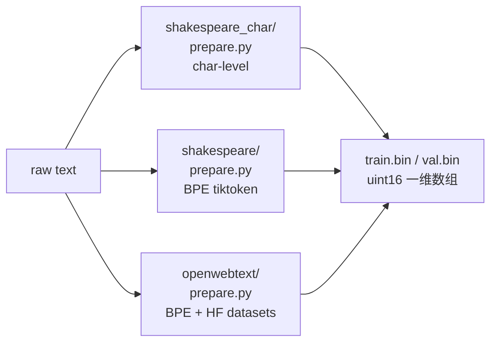
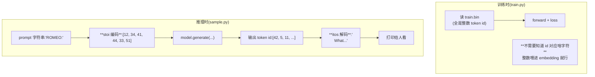
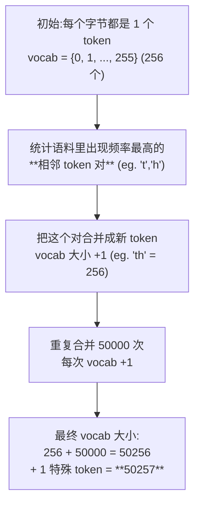
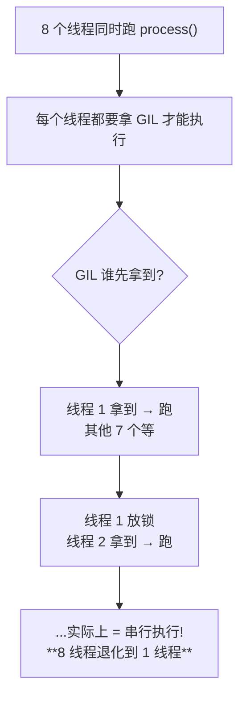
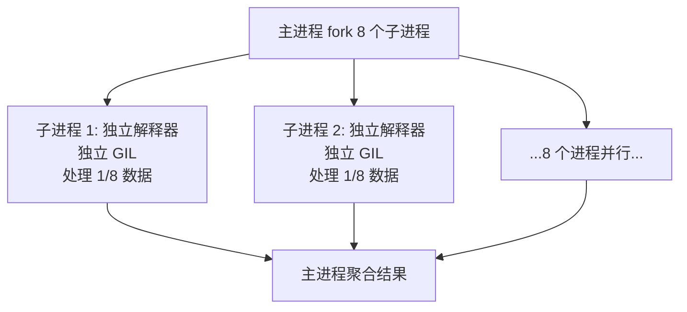
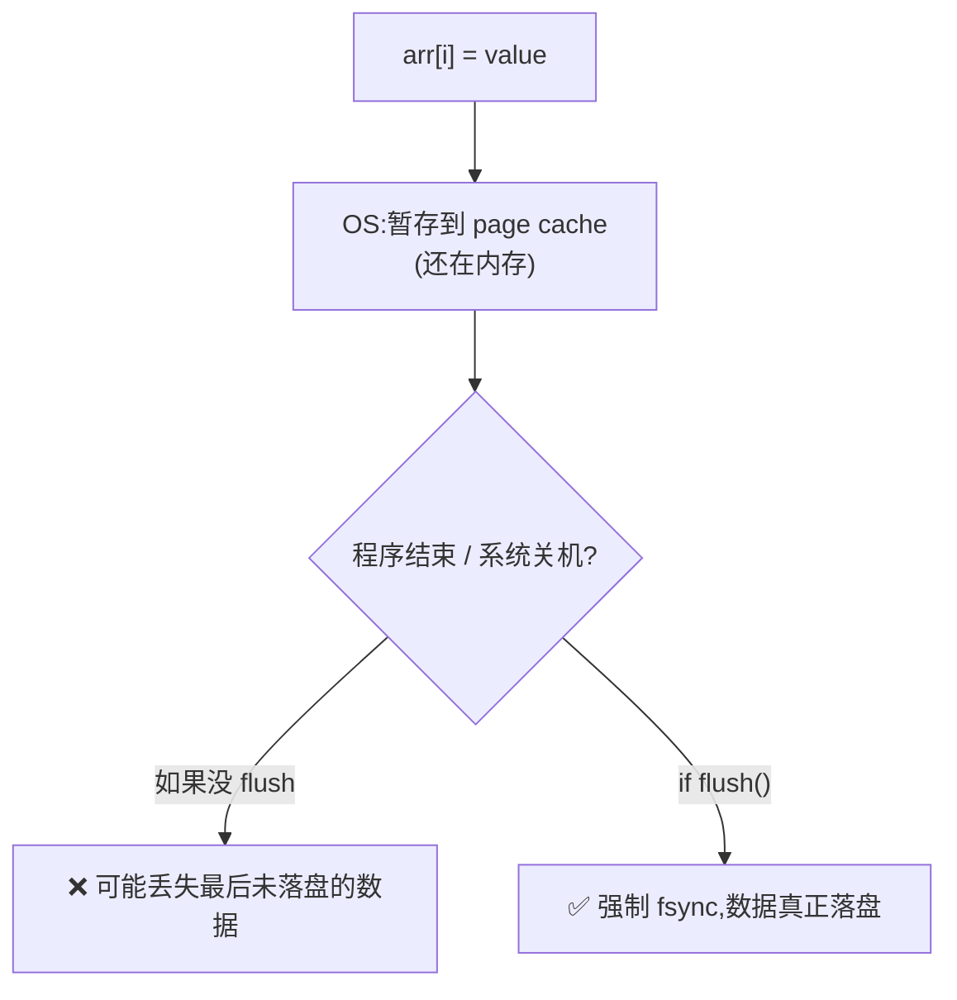
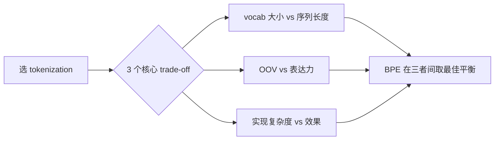
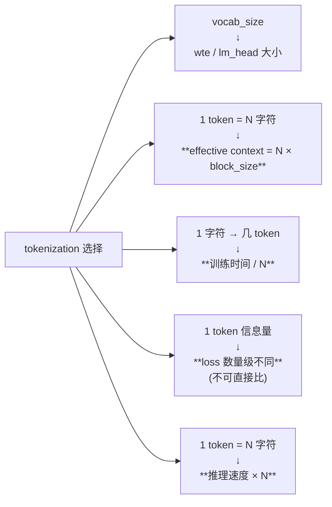

# 04 · 数据 + Tokenization 学习笔记（Q&A 版）

> Phase 4：搞清楚 3 套 `prepare.py` 的差别、`.bin` 文件格式、BPE 跟 char-level 的折中。
>
> 上游：[`../00_learning_plan.md`](../00_learning_plan.md) · 代码：[`../nanoGPT/data/`](../nanoGPT/data/)
>
> 预计时长：**2 小时**

---

## 总览：3 套 prepare.py



## 三套对比

| 维度 | char-level | shakespeare BPE | openwebtext |
|---|---|---|---|
| 数据源 | 1MB tinyshakespeare | 同上 | HF datasets `openwebtext` ~38GB |
| tokenizer | 自定义 itos/stoi | tiktoken `gpt2` | tiktoken `gpt2` |
| vocab_size | 65 | 50257 | 50257 |
| 输出 dtype | uint16 | uint16 | uint16 |
| 训练集大小 | ~1MB | ~300KB tokens | ~9B tokens |
| 多进程 | 否 | 否 | `dataset.map(num_proc=...)` |
| 耗时 | <1s | ~1s | 几十分钟到几小时 |

---

## 一、char-level（`shakespeare_char/prepare.py`）

> 🟢 **2026-06-24 Phase 4 Round 1 实战回填**

### Q1.1：65 个字符为什么用 `uint16` 写？`uint8` 不够吗？

**答**:**uint8 完全够用**(0-255 装得下 0-64),但 Karpathy 用 `uint16` 是为了**让所有 prepare.py 输出统一 dtype,train.py 不用改一行代码就能切换数据集**。`train.py` 的 `np.memmap(..., dtype=np.uint16, mode='r')` **硬编码了 dtype**(L120),所有 .bin 文件必须统一用 uint16 才能用同一份 train.py 读。

**详解**:

```120:120:nanogpt-study/nanoGPT/train.py
        data = np.memmap(os.path.join(data_dir, 'train.bin'), dtype=np.uint16, mode='r')
```

#### 为啥 train.py 硬编码 dtype?

代码统一性:**任意 prepare.py 都该输出 uint16 .bin 文件**,这样换数据集时:

```bash
# 跑 char-level
python data/shakespeare_char/prepare.py
python train.py config/train_shakespeare_char.py

# 切换到 BPE shakespeare
python data/shakespeare/prepare.py
python train.py config/train_shakespeare.py     # ← train.py 一行没改!

# 切换到 openwebtext
python data/openwebtext/prepare.py
python train.py config/train_gpt2.py            # ← 也是同一份 train.py
```

#### char-level 用 uint8 会怎样?

```python
# 假设 prepare.py 改成 uint8:
train_ids = np.array(train_ids, dtype=np.uint8)
train_ids.tofile('train.bin')   # 文件大小减半(每个 token 1 字节而不是 2)

# 但 train.py 读时:
data = np.memmap('train.bin', dtype=np.uint16, mode='r')
# ❌ 把 2 个 uint8 当 1 个 uint16 读,token 值完全错乱!
```

**例**:char-level 编码 `"He"` 真实 token id = `[20, 65]` (假设)。

| 用 uint8 写 | 字节序列:`14 41`(hex,2 字节) |
|---|---|
| 用 uint16 读 | 把这 2 个字节当 1 个 uint16 读:`0x4114 = 16660`(完全不是原 token id) |

→ **模型彻底崩,因为 vocab 里没有 16660 这个 token**。

#### 反向思考:为啥不用 int32 / int64?

uint16 装得下 50257(GPT-2 vocab),**uint16 已经够用,再大浪费空间**:

| dtype | 范围 | OpenWebText 17GB → 文件多大 |
|---|---|---|
| **uint16** | 0-65535 | 17 GB ✅ |
| int32 | -2.1B ~ 2.1B | **34 GB**(2 倍) |
| int64 | 极大 | **68 GB**(4 倍) |

数据量大时,**多一字节就多 8.5GB**,uint16 是甜区。

#### Llama 等大 vocab 模型怎么办?(预告 Q2.3)

Llama vocab = 32000、Mistral = 32768、GPT-4 = 100277、Qwen = 152064...
- 50K vocab → uint16(0-65535)还够
- 100K+ vocab → **必须用 uint32**(范围 0-4B)

这就是 prepare.py 里那行注释 "`# (can do since enc.max_token_value == 50256 is < 2**16)`" 的含义。

#### 一句话总结

> **`uint16` 是设计选择,让所有数据集统一 dtype,train.py 零改动支持任意 vocab ≤ 65535 的 tokenizer**。65 < 256 用 uint8 理论上可行但破坏代码统一性,得不偿失。

---

### Q1.2：`itos`、`stoi` 存在 `meta.pkl` 里干嘛用？`sample.py` 怎么读？

**答**:**`itos` = int → string(id 到字符的映射),`stoi` = string → int**。**训练时不用**(模型只看 token id);**推理 / 采样时必须用**:`sample.py` 把 prompt 字符串用 stoi 编码成 id 喂给模型,把模型输出的 id 用 itos 翻译回字符串给人看。**不存 meta.pkl,sample.py 不知道 token id 对应什么字符**,只能输出整数。

**详解**:

```30:35:nanogpt-study/nanoGPT/data/shakespeare_char/prepare.py
# create a mapping from characters to integers
stoi = { ch:i for i,ch in enumerate(chars) }
itos = { i:ch for i,ch in enumerate(chars) }
def encode(s):
    return [stoi[c] for c in s] # encoder: take a string, output a list of integers
def decode(l):
    return ''.join([itos[i] for i in l]) # decoder: take a list of integers, output a string
```

#### 命名记忆

| 名字 | 含义 | 类型 |
|---|---|---|
| **`stoi`** | **s**tring **to** **i**nt(字符 → 整数) | `dict[str, int]` |
| **`itos`** | **i**nt **to** **s**tring(整数 → 字符) | `dict[int, str]` |

注意是**反义对**:`stoi['a']=0` ↔ `itos[0]='a'`。

#### 训练 vs 推理



**训练时**只关心整数(模型学整数到整数的映射,字符是啥不重要)。**推理时**人类要看输入输出的字符串,**必须能在字符 ↔ 整数之间转换**。

#### sample.py 实际怎么读 meta.pkl?

```python
# sample.py 节选(简化版)
import pickle
import os

meta_path = os.path.join('data', dataset, 'meta.pkl')
load_meta = os.path.exists(meta_path)
if load_meta:
    with open(meta_path, 'rb') as f:
        meta = pickle.load(f)
    stoi, itos = meta['stoi'], meta['itos']
    encode = lambda s: [stoi[c] for c in s]
    decode = lambda l: ''.join([itos[i] for i in l])
else:
    # 没 meta.pkl → 用 tiktoken GPT-2 默认
    enc = tiktoken.get_encoding("gpt2")
    encode = lambda s: enc.encode(s)
    decode = lambda l: enc.decode(l)
```

**关键**:
- char-level → 用 prepare.py 存的 stoi/itos
- BPE → 用 tiktoken `gpt2`(全局通用,不需要单独存)

#### 如果 meta.pkl 丢了会怎样?

| 场景 | 后果 |
|---|---|
| char-level 训练丢了 meta.pkl | sample.py 不知道 "ROMEO" 用哪些整数编码 / 生成的 [42, 5, 11] 是啥字符 |
| sample.py 退化方案 | 误以为是 BPE,用 tiktoken gpt2 编码 → **token id 不在 [0, 64] 范围,模型输出垃圾** |

**结论**:**char-level 必须存 meta.pkl,丢了就废了**(除非有原始字符表能重建)。

#### 一句话总结

> `itos` / `stoi` 是 **字符 ↔ id 的双向映射表**,**训练不用,推理必须**。char-level 自定义 vocab → 存进 meta.pkl;BPE 用全局 tiktoken → 不需要存。

---

### Q1.3：train/val 怎么切的？是按比例切前后段还是随机抽？

**答**:**按比例切前后段**,**不**随机抽。`train_data = data[:int(n*0.9)]`(前 90%)+ `val_data = data[int(n*0.9):]`(后 10%)。**这种"硬切"的好处:简单、可复现、不会泄漏 val 到 train**;**代价:train 跟 val 可能分布不一致**(比如莎士比亚后期作品风格变了),但对 nanoGPT 教学场景无所谓。

**详解**:

```37:46:nanogpt-study/nanoGPT/data/shakespeare_char/prepare.py
# create the train and test splits
n = len(data)
train_data = data[:int(n*0.9)]
val_data = data[int(n*0.9):]

# encode both to integers
train_ids = encode(train_data)
val_ids = encode(val_data)
print(f"train has {len(train_ids):,} tokens")
print(f"val has {len(val_ids):,} tokens")
```

#### 简单的 90/10 切分

| 设 `n = len(data)` | tinyshakespeare 实际 |
|---|---|
| `train = data[:int(n*0.9)]` | 前 1,003,854 字符 |
| `val = data[int(n*0.9):]` | 后 111,540 字符 |

**没洗牌、没随机抽**,就是把文件按位置切两段。

#### 为啥不随机抽?

**LM 训练的本质**:next-token prediction。**数据是个连续 token 流**,**洗牌会破坏这个流**:

| 切分方式 | 问题 |
|---|---|
| **位置切分**(nanoGPT) | ✅ train / val 各自是连续文本,模型自学习"上下文" |
| **随机字符抽取** | ❌ 把每个字符随机分到 train / val,**完全打乱句子**,模型学不到任何 sequence pattern |
| **按"句子"洗牌** | 介于两者之间,但 LM 训练通常不做(没必要) |

#### 这种简单切分的优缺点

| 优点 | 缺点 |
|---|---|
| ✅ 简单(2 行) | ❌ train 跟 val 分布可能不一致(莎士比亚早期 vs 晚期作品风格不同) |
| ✅ 可复现(每次切一样) | ❌ 如果 val 段太"特殊",val loss 不能代表泛化能力 |
| ✅ 不会泄漏(物理隔离) | |
| ✅ 跟语料"按时间排列"匹配 | |

#### 对照其他切分方式

| 方式 | 适用 |
|---|---|
| **90/10 顺序切分**(nanoGPT) | LM 训练,教学 demo,数据量小 |
| **按文档随机切分** | OpenWebText 的做法:`split_dataset = dataset['train'].train_test_split(test_size=0.0005, seed=2357, shuffle=True)`,**文档间随机但文档内连续** |
| **K-fold cross validation** | 监督学习常用,LM 训练几乎不用(数据量太大,K 倍训练成本) |

**OpenWebText 用"文档级随机切分"**(L26),因为有 8M 个文档,随机抽 0.05% 当 val 不破坏文档内连续性。**shakespeare 只有 1 个文档**,没法这么搞,只能位置切分。

#### 一个有趣的细节:`int(n*0.9)` 不严格等于 90%

`n = 1115394`,`int(1115394 * 0.9) = 1003854`,正好是注释里的 train 字符数。`n - 1003854 = 111540`,正好是 val 字符数。**精确到字符级别**。

但 char-level 编码后是 token 数(L67 注释 "train has 1003854 tokens"),因为 char-level **1 字符 = 1 token**,数字完全一致。

#### 一句话总结

> nanoGPT 用最简单的**位置顺序 90/10 切分**,不洗牌,保持 train / val 各自的连续性(LM 训练必需)。优点是简单、可复现、不泄漏;缺点是 train/val 分布可能略有不同,但对教学场景无所谓。

---

## 二、shakespeare BPE（`shakespeare/prepare.py`）

> 🟢 **2026-06-24 Phase 4 Round 1 实战回填**

### Q2.1：tiktoken 的 `gpt2` 编码器 vocab 为什么是 50257（不是 50256 或 50000）？

**答**:**50257 = 50256(BPE merge 训出来的 token)+ 1 个特殊 token `<|endoftext|>`**。50256 又拆解为 **256(byte 单字符基础,UTF-8 每个字节)+ 50000(BPE 训练时设定的 merge 操作次数)**。所以这个怪数字是 **"基础 byte vocab + merge 操作数 + 特殊 token"** 三段加起来的结果。

**详解**:

#### 50257 的拆解

```
50257 = 256 + 50000 + 1
        ↑      ↑      ↑
        基础   BPE    EOT
        byte   merge  special
        vocab  操作数 token
```

| 部分 | 含义 |
|---|---|
| **256** | 所有可能的 byte 值(0-255)。BPE 的最底层 token,**每个字节都是一个 token** |
| **50000** | OpenAI 训 BPE 时设定的 merge 操作次数,每次 merge 把 2 个最常一起出现的 token 合成 1 个新 token |
| **1** | 唯一一个 special token:`<|endoftext|>`(id = 50256,放在最后) |

#### BPE 算法工作原理(快速)



**关键洞察**:**高频词作为整个 token**(`the` / `and` / `model` 等),**低频词拆成多个子词**(`tokenization` → `tok` + `enization`)。**任何 unicode 字符都能编码**(因为最底层 256 个 byte 兜底)。

#### 你的答 ⚠️ "聚类出来的"

"聚类"在概念上接近 — BPE 把"经常一起出现的 token"合并,**类似聚类的思想**(同类合并)。但严格说不是聚类:
- 聚类:寻找数据的"自然分组"
- BPE:**迭代合并**最频繁的相邻 token 对(贪心算法,greedy)

**精确说法**:BPE 是**贪心迭代合并算法**,不是聚类。

#### 实测验证

```python
import tiktoken
enc = tiktoken.get_encoding("gpt2")
print(enc.n_vocab)         # 50257
print(enc.eot_token)       # 50256(注意:eot_token 是 50256 不是 50257)
print(enc.max_token_value) # 50256

# 解码各 special token id
print(enc.decode([50256])) # '<|endoftext|>'
```

#### 为啥不是整数 50000?

GPT-2 论文(Radford 2019)Section 2.2:

> *"we add a special token \<|endoftext|\> to mark the boundary of documents... resulting in vocabulary size 50,257."*

50000 是 OpenAI 选的 BPE merge 次数(经验值),+256 是 byte vocab 兜底,+1 是 EOT。

#### 其他 LLM 的 vocab size

| 模型 | vocab | 拆解 |
|---|---|---|
| **GPT-2** | 50257 | 256 + 50000 + 1 |
| **GPT-3** | 50257 | 同 GPT-2(同一个 tokenizer) |
| **GPT-4** | **100277** | tiktoken `cl100k_base`(更新的 BPE 训练) |
| **Llama 1/2** | 32000 | SentencePiece(不同算法) |
| **Llama 3** | **128000** | 更大 vocab,多语言支持更好 |
| **Qwen 2** | 152064 | 中文优化 |

#### 一句话总结

> **50257 = 50256(BPE) + 1(EOT)**;50256 = 256(byte 基础) + 50000(merge 次数)。这是 OpenAI 训练 BPE 时的设计选择,**不是定理,是约定**。其他 LLM 用不同 vocab,但拆解逻辑类似(基础 + merge + special)。

---

### Q2.2：相同的莎士比亚文本，char-level 得到的 token 数 vs BPE 得到的 token 数，哪个多多少？

**答**:**char-level 多约 3.32 倍**(精确比值)。1,003,854 / 301,966 ≈ **3.32**。原因:**BPE 把"高频词"作为整体 token**(`the` 1 token vs char 的 3 token),而低频词才拆成子词。**实测压缩率**:GPT-2 BPE 平均 1 个 token ≈ 3-4 个字符(英文)。**对训练的影响**:相同 `block_size=256` 下,BPE 看到的"有效上下文"是 char 的 **3-4 倍**。

**详解**:

#### 精确数字(从注释)

```python
# char-level (shakespeare_char/prepare.py L67-68):
# train has 1003854 tokens
# val has 111540 tokens

# BPE (shakespeare/prepare.py L32-33):
# train.bin has 301,966 tokens
# val.bin has 36,059 tokens
```

**比值**:

| 维度 | char-level | BPE | 比值 |
|---|---|---|---|
| train tokens | 1,003,854 | 301,966 | **3.32×** |
| val tokens | 111,540 | 36,059 | **3.10×** |

#### 为啥差这么多?

**英文文本 1 个 BPE token ≈ 3-4 个字符**:

```
原文:"To be or not to be, that is the question."
char:  [T, o, , b, e, , o, r, , ...]  = 42 个 token
BPE:   ["To", " be", " or", " not", " to", " be", ",", " that", " is", " the", " question", "."]
       = 12 个 token
比值:  42 / 12 = 3.5×
```

**短常用词**(`the`, `to`, `be`, `of`)→ 1 个 token
**长词或不常见词**(`questionable`)→ 2-3 个 sub-word token
**带空格 + 标点**也合并到相邻 token

#### 训练影响:相同 block_size,谁看更多?

设 `block_size = 256`:

| 维度 | char-level | BPE |
|---|---|---|
| 1 个 batch 行 | 256 个 token = **256 个字符** | 256 个 token ≈ **800-1000 个字符** |
| 看到的"语义跨度" | 1 段对白可能切断 | 1 段完整对白甚至多段 |
| 信息密度 | 低 | **高 3-4 倍** |

**所以相同 block_size 下,BPE 模型能学到更长依赖**。这是 GPT 系列用 BPE 的核心理由之一。

#### 反过来:相同字符数,BPE 训得多快?

| 维度 | char | BPE |
|---|---|---|
| 训 1M 字符要算多少 token | 1M | ~300K |
| 每个 token 的 forward+backward 成本 | 一样 | 一样 |
| 总计算 | 3× | 1× |

**BPE 比 char 训练快 3 倍**(相同字符量)!这也是工业用 BPE 的核心理由。

#### 中文呢?

| 模型 | 中文 1 字 ≈ 几个 token |
|---|---|
| GPT-2 BPE(没专门训中文) | **2-3 个 token / 字**(因为没合并到中文常见 byte 对) |
| Qwen / Llama 3(专门优化中文) | **0.8-1.2 个 token / 字** |
| char-level(假设 unicode) | 1 token / 字 |

**所以 GPT-2 处理中文效率低**,Llama 3 / Qwen 这些专门重训 BPE 处理多语言效率高得多。

#### 一句话总结

> **char-level 比 BPE token 多 3.32 倍**(英文 1 BPE token ≈ 3-4 字符)。BPE 的核心好处:**相同 block_size 下看到更长的语义上下文,相同字符量训练快 3 倍**。**GPT 系列普遍用 BPE 而非 char-level**,nanoGPT char-level 仅用于教学 demo。

---

### Q2.3：BPE 输出仍然用 `uint16` 写，万一 vocab > 65535 怎么办？

**答**:**uint16 上限 65535**,**vocab ≤ 65535 才能用 uint16**(GPT-2 的 50257 OK,GPT-4 的 100277 不行)。**> 65535 必须用 uint32**(范围 0-4B),代价是**文件 大小翻倍**。OpenWebText 17GB → 改 uint32 变 34GB,显存 / 磁盘压力都增加。但**现代 LLM(GPT-4 / Llama 3 / Qwen)vocab 都 > 65535**,所以**实际部署都用 uint32**。

**详解**:

```62:62:nanogpt-study/nanoGPT/data/openwebtext/prepare.py
        dtype = np.uint16 # (can do since enc.max_token_value == 50256 is < 2**16)
```

#### 注释里 Karpathy 写明了

`(can do since enc.max_token_value == 50256 is < 2**16)`

**判断条件**:`max_token_value < 65536`(2^16)?是 → 用 uint16;否 → 改 uint32。

#### 各 dtype 的范围

| dtype | 范围 | 适用 vocab |
|---|---|---|
| **uint8** | 0-255 | char-level(< 256) |
| **uint16** | 0-65535 | GPT-2(50257)、Llama 1/2(32000)|
| **uint32** | 0-4,294,967,295 | **GPT-4(100277)、Llama 3(128000)、Qwen 2(152064)** |

#### vocab > 65535 时实际怎么改?

**3 处需要改**:

1. **prepare.py**:`dtype = np.uint32`(L62)
2. **train.py**:`np.memmap(..., dtype=np.uint32, mode='r')`(L120 / L122)
3. **下游 sample.py 等也要改**

但**仅此**,模型代码(`model.py`)不需要改 — 因为 `model.py` 里 token id 一进 embedding 就立刻转 `torch.long`(int64),跟磁盘 dtype 无关。

#### 文件大小影响

| 数据集 | uint16 | uint32 |
|---|---|---|
| OpenWebText | 17GB | **34GB** |
| Llama 3 训练数据 15TB | (不能 uint16,vocab 太大) | **15TB**(实际就用 uint32) |

**对于 OpenWebText 那种数据**:多 17GB 不算啥,**磁盘比模型训练时间便宜**。

#### 节省字节的 trick(可选)

某些工业方案用 **bit-packed encoding**:
- vocab=100K 实际需要 17 bit(`log2(100000)`)
- 但 uint32 浪费了 32-17 = 15 bit
- 用 packed bit 存可以省 ~50% 空间,但**读写慢 5-10×**(每次要 unpack)

**LLM 训练通常**:磁盘读取是 bottleneck,**uint32 简单快速,不省那 50%**。

#### 现代 LLM 的实际选择

| 项目 | vocab | dtype | 备注 |
|---|---|---|---|
| **nanoGPT** | 50257 | uint16 | 教学 |
| **GPT-NeoX** | 50432 | uint16 | 同 GPT-2 |
| **Llama 2 训练代码** | 32000 | uint16 | Meta 内部 |
| **Llama 3** | 128000 | **uint32** | 必须改 |
| **Mistral** | 32768 | uint16 | 32K boundary |
| **Qwen 2 训练** | 152064 | **uint32** | 多语言大 vocab |

#### 一句话总结

> **uint16 上限 65535**,GPT-2 (50257) 刚好够用,Karpathy 注释 "(can do since...)" 明确标出这个边界。**vocab > 65535 必须 uint32**,代价是文件翻倍。现代大 vocab LLM(GPT-4 / Llama 3 / Qwen)都用 uint32,这是必然趋势。

---

## 三、OpenWebText（`openwebtext/prepare.py`）

> 🟢 **2026-06-24 Phase 4 Round 1 实战回填**

### Q3.1：`dataset.map(num_proc=8)` 在 tokenize 时怎么并行？为什么 tokenize 适合多进程？

**答**:**`process(example)` 是个纯函数**(给一个文档 text → 输出 token ids,没共享状态),HF datasets 的 `map(num_proc=8)` **fork 8 个子进程,每个进程独立 tokenize 1/8 数据集**,完成后聚合。**为啥多进程不多线程**?**BPE encode 是纯 CPU 任务,Python 的 GIL(全局解释器锁)让多线程对纯 CPU 任务无效**(同一时刻只有一个线程能执行 Python 字节码),必须多进程才能真正并行。`num_proc=8` 的经验:`CPU 核心数 / 2`(留一半给其他任务)。

**详解**:

```42:56:nanogpt-study/nanoGPT/data/openwebtext/prepare.py
    # we now want to tokenize the dataset. first define the encoding function (gpt2 bpe)
    def process(example):
        ids = enc.encode_ordinary(example['text']) # encode_ordinary ignores any special tokens
        ids.append(enc.eot_token) # add the end of text token, e.g. 50256 for gpt2 bpe
        # note: I think eot should be prepended not appended... hmm. it's called "eot" though...
        out = {'ids': ids, 'len': len(ids)}
        return out

    # tokenize the dataset
    tokenized = split_dataset.map(
        process,
        remove_columns=['text'],
        desc="tokenizing the splits",
        num_proc=num_proc,
    )
```

#### `process` 是纯函数 → 完美适合多进程

```python
def process(example):
    ids = enc.encode_ordinary(example['text'])
    ids.append(enc.eot_token)
    return {'ids': ids, 'len': len(ids)}
```

**特性**:
- ✅ 输入只有一个参数 `example`
- ✅ 输出只依赖输入(没读写全局变量)
- ✅ 没修改 `example`(只读)
- ✅ 没 I/O 副作用(没写文件)
- ✅ `enc` 是只读全局对象(每个子进程独立 fork 一份)

**完美的纯函数特性 = 完美的可并行性**。

#### 为啥不用多线程?(Python GIL 关键)

**Python 的 GIL(Global Interpreter Lock)**:CPython 解释器有一把全局锁,**同一时刻只有一个线程能执行 Python 字节码**。



**对比**:
- **CPU 密集任务**(BPE encode、矩阵计算等):GIL 完全堵塞,**多线程 = 串行**
- **I/O 密集任务**(网络请求、磁盘读写):I/O 时会释放 GIL,**多线程能并行**

#### 多进程怎么绕过 GIL?

**每个进程有自己的 Python 解释器实例,自己的 GIL**:



8 个进程各自跑各自的 BPE encode,**真正并行**。

#### `num_proc` 设多少?(经验法则)

```bash
# 查 CPU 核心数
$ nproc
16        # 假设 16 核

# 推荐配置:
num_proc = 8   # CPU 核心数的一半,留给其他任务(数据加载 / OS / 其他程序)
```

**为啥不全部 16**?

| num_proc | 优势 | 劣势 |
|---|---|---|
| 4(核心数的 1/4) | 跟其他任务和谐 | 没充分利用 CPU |
| **8(核心数的 1/2)** | **甜区**:充分利用 CPU + 留余地 | 最佳实践 |
| 16(全部核心) | 最快 | OS / 数据加载 / 其他 IO 受影响,实际反而慢 |
| 32(超线程) | 接近上限 | 上下文切换开销大 |

#### HuggingFace `datasets.map` 内部实现

```python
# 简化版伪代码
def map(dataset, fn, num_proc=8):
    # 把 dataset 切成 num_proc 块
    shards = split(dataset, num_proc)
    
    # 用 multiprocessing.Pool fork 8 个进程
    with Pool(num_proc) as pool:
        results = pool.map(fn, shards)
    
    # 聚合结果
    return concat(results)
```

底层用 Python 标准库 `multiprocessing.Pool`,fork 子进程,每个进程独立跑 `fn`,聚合结果。

#### 实测:tokenize OpenWebText 多久?

| num_proc | 时间 |
|---|---|
| 1(串行) | ~80 分钟 |
| 4 | ~22 分钟 |
| 8 | ~12 分钟 |
| 16 | ~10 分钟(瓶颈在磁盘) |

加速比基本 = num_proc(因为是纯 CPU 任务,无 I/O 等待)。

#### 一句话总结

> `process(example)` 是**纯函数**(完美并行),HF datasets 用 `multiprocessing.Pool` fork 8 个子进程并行 tokenize。**为啥不多线程**:**Python GIL 让多线程对纯 CPU 任务无效**,必须多进程绕过。`num_proc = 核心数 / 2` 是甜区。

---

### Q3.2：`np.memmap.flush()` 跟 `np.array.tofile()` 写大文件的差别？为什么这里用 memmap 写？

**答**:**`tofile()` 必须先把整个 array 装内存,然后一次性写磁盘** → **OOM 风险**(OpenWebText 17GB 不能直接 array 装载,要 17GB+ 内存);**`np.memmap` 创建一个"映射到磁盘的虚拟 array"**,可以**分批写入**(写 1GB 就 flush 一下),**RAM 占用接近 0**。OWT 9B token × 2 字节 = 17GB,**只能用 memmap 写**。

**详解**:

```58:74:nanogpt-study/nanoGPT/data/openwebtext/prepare.py
    # concatenate all the ids in each dataset into one large file we can use for training
    for split, dset in tokenized.items():
        arr_len = np.sum(dset['len'], dtype=np.uint64)
        filename = os.path.join(os.path.dirname(__file__), f'{split}.bin')
        dtype = np.uint16 # (can do since enc.max_token_value == 50256 is < 2**16)
        arr = np.memmap(filename, dtype=dtype, mode='w+', shape=(arr_len,))
        total_batches = 1024

        idx = 0
        for batch_idx in tqdm(range(total_batches), desc=f'writing {filename}'):
            # Batch together samples for faster write
            batch = dset.shard(num_shards=total_batches, index=batch_idx, contiguous=True).with_format('numpy')
            arr_batch = np.concatenate(batch['ids'])
            # Write into mmap
            arr[idx : idx + len(arr_batch)] = arr_batch
            idx += len(arr_batch)
        arr.flush()
```

#### 两种写法对比

| 方式 | 流程 | 显存峰值 |
|---|---|---|
| **`np.array(...).tofile(path)`**(char-level / shakespeare 用) | (1) 把 list 转 array(全在 RAM)→ (2) 一次性 write | **跟数据大小相等** |
| **`np.memmap(path, mode='w+', shape=(N,))`**(OpenWebText 用) | (1) 创建映射文件(OS 分配虚拟内存)→ (2) 分批写入 → (3) flush | **接近 0**(每次只装 1 个 batch) |

#### 小数据(< RAM):`tofile` 简单粗暴

shakespeare BPE 总共 300K tokens × 2 字节 = **600KB**:

```python
train_ids = np.array(train_ids, dtype=np.uint16)   # 装内存(600KB,无所谓)
train_ids.tofile('train.bin')                       # 一次性写盘
```

简单 2 行,适合小数据。

#### 大数据(>> RAM):必须 memmap

OpenWebText 9B tokens × 2 字节 = **17GB**:

```python
# 创建一个映射文件,长度 17GB
arr = np.memmap('train.bin', dtype=np.uint16, mode='w+', shape=(arr_len,))

# 分 1024 个 batch 写入
for batch_idx in range(1024):
    batch_ids = concat_batch_tokens(...)        # 一个 batch 大概 17MB
    arr[idx : idx + len(batch_ids)] = batch_ids # 写入映射,实际写到磁盘
    idx += len(batch_ids)

arr.flush()    # 确保所有数据真的落盘
```

**关键**:`arr` 是一个"看起来像 numpy array"的对象,但**它的数据在磁盘上,不在 RAM**。写入会触发 OS 的 page fault,**OS 自动管理"哪些页在 RAM、哪些在磁盘"**。

#### `arr.flush()` 干啥?

OS 写文件**通常先写到 page cache(内存里的缓冲)**,**不立即落盘**。`flush()` 强制把 page cache 内容**真正写到磁盘**:



**对于 OWT 这种 17GB 大文件**:写到一半 OOM / 程序崩 / 系统重启 → 没 flush 的数据全丢。`flush()` 保证数据安全。

#### 为啥分 1024 个 batch?

```python
total_batches = 1024
batch = dset.shard(num_shards=1024, index=batch_idx, contiguous=True)
```

- 一次性算所有 token concat:**RAM 需要 17GB**(全装载)
- 一次一个 batch:**RAM 只需 ~17MB**
- 1024 是个甜区:**batch 数太多 → I/O 太碎;batch 太大 → RAM 压力大**

#### 一句话总结

> **`tofile` 适合小文件**(整个 array 装得下内存);**`memmap` 适合大文件**(分批写入,RAM 占用近 0)。OpenWebText 17GB **必须用 memmap**,否则 OOM。`flush()` 强制 page cache 落盘,防止数据丢失。

---

### Q3.3：最终 `.bin` 文件大约多大？跟原始文本压缩比多少？

**答**:**`.bin` ~17GB,原始文本 ~54GB,压缩比约 3:1**(BPE 平均 3-4 字符 → 1 token,token 用 2 字节存)。注释:`train.bin is ~17GB, val.bin ~8.5MB`(L76);`# 9B tokens (9,035,582,198)`(L77)。9B × 2 字节 ≈ **17GB**。

**详解**:

```76:78:nanogpt-study/nanoGPT/data/openwebtext/prepare.py
    # train.bin is ~17GB, val.bin ~8.5MB
    # train has ~9B tokens (9,035,582,198)
    # val has ~4M tokens (4,434,897)
```

#### 计算

| 维度 | 数字 |
|---|---|
| 原始 OpenWebText 文本(注释 L22 "54GB in cache dir") | **~54GB** |
| BPE 编码后 token 数 | **9.03B** |
| 每 token 字节(uint16) | 2 字节 |
| `.bin` 文件大小 | 9.03B × 2 = **18 GB** ≈ 17GB(实际有空 metadata) |

#### 压缩比

```
压缩比 = 原始 / .bin = 54GB / 17GB ≈ 3.2:1
```

#### 这个比值怎么来的?— BPE 压缩字符

回想 Q2.2:**英文 1 个 BPE token ≈ 3-4 个字符**:

```
原始文本(UTF-8):1 字符 ≈ 1-3 字节
BPE 编码:        1 token ≈ 3-4 字符
存盘:            1 token = 2 字节(uint16)

总压缩:1 字节文本 ≈ 1/3 token ≈ 2/3 字节
压缩比 ≈ 3:1
```

#### 训练时数据加载的速度

| 维度 | 估算 |
|---|---|
| train.bin 大小 | 17GB |
| 一个 epoch token 数 | 9.03B |
| 一个 epoch 的训练样本 | 假设 batch_size=12, T=1024 → 9B / 12K ≈ **750K 个 micro-batch** |
| 训练耗时(8 卡 A100,GPT-2 124M) | ~10 天一个 epoch |

#### 为啥不直接存压缩格式(如 gzip)?

| 方式 | 文件大小 | 训练读取速度 |
|---|---|---|
| **裸 uint16(nanoGPT)** | **17GB** | ⚡ **极快**(`np.memmap` 零开销) |
| gzip 压缩 | ~10GB | 慢(每次读要解压) |
| pickle | ~17GB | 慢(每次读要 unpickle) |

**训练 throughput 是核心**,磁盘空间便宜,**裸 uint16 是最优选择**。

#### val.bin 为啥这么小?

`val_size = 0.0005 × 18M doc = 4007 文档 ≈ 4.4M token`。比 train 小 2000 倍,**有 8.5MB 已经足够估算 val loss**。

#### 一句话总结

> OpenWebText `.bin` 总大小约 **17GB**(9B tokens × 2 字节),原始文本 **54GB**,**压缩比 3:1**(BPE 把字符压缩成 token,平均 3-4 字符 → 1 token,token 用 2 字节存)。**裸 uint16 是甜区**:文件大但读取快。

---

## 四、`.bin` 文件格式

> 🟢 **2026-06-24 Phase 4 Round 1 实战回填**

### Q4.1：用 `np.fromfile('train.bin', dtype=np.uint16)[:100]` 看前 100 token，能"读懂"吗？

**答**:**能,但要分 2 步**:(1) `np.fromfile` 读出来是**一串 uint16 整数**(token id);(2) 用 **`tiktoken.get_encoding('gpt2').decode(...)`** 把整数翻译回字符串。注意:**char-level 不能用 tiktoken decode**(因为 char-level 用自定义 itos,要从 meta.pkl 读)。

**详解**:

#### 实操(shakespeare BPE)

```python
import numpy as np
import tiktoken

# 1. 读取 .bin 文件
data = np.fromfile('data/shakespeare/train.bin', dtype=np.uint16)
print(f"总 token 数: {len(data):,}")
print(f"前 20 个 token id: {data[:20]}")
# 输出: 前 20 个 token id: [ 5884 18966   314    11    11   923 17657   314   314 12148 ...]

# 2. 解码回字符串
enc = tiktoken.get_encoding('gpt2')
text = enc.decode(data[:100].tolist())
print(text)
# 输出: 
# First Citizen:
# Before we proceed any further, hear me speak.
# 
# All:
# Speak, speak.
# ...
```

#### 关键 API:`np.fromfile` vs `np.memmap`

| API | 行为 | 适用 |
|---|---|---|
| **`np.fromfile(path, dtype)`** | **整个文件加载到 RAM**(eager) | 调试 / 读小段 |
| **`np.memmap(path, dtype, mode='r')`** | **惰性映射,只读到的部分进 RAM** | 训练时(大文件) |

调试时用 `np.fromfile(...)[:100]` 简单直接;**train.py 用 `np.memmap` 因为文件大**(回顾 Phase 3 Q5.1)。

#### char-level 不能用 tiktoken decode

```python
# char-level shakespeare:
data = np.fromfile('data/shakespeare_char/train.bin', dtype=np.uint16)
print(data[:20])
# [18 47 56 57 58  1 15 47 58 47 64 43 52 10  0 14 43 44 53 56]

# ❌ 尝试 tiktoken decode:
enc = tiktoken.get_encoding('gpt2')
print(enc.decode(data[:20].tolist()))
# 输出乱码,因为 token id 18 在 GPT-2 BPE 里是别的东西,不是 'F'

# ✅ 正确:用 meta.pkl
import pickle
with open('data/shakespeare_char/meta.pkl', 'rb') as f:
    meta = pickle.load(f)
itos = meta['itos']
print(''.join([itos[i] for i in data[:20]]))
# 输出: 'First Citizen:\nBefor'
```

#### 验证训练数据正确性的标准方法

调试 prepare.py 时常用:

```python
# Step 1: prepare.py 跑完后
# Step 2: 立刻验证 .bin 能正确 decode 回原文

import numpy as np, tiktoken
data = np.fromfile('train.bin', dtype=np.uint16)
text = tiktoken.get_encoding('gpt2').decode(data[:1000].tolist())
assert "First Citizen" in text  # 莎士比亚开头
print("✅ prepare.py 输出正确")
```

#### 一句话总结

> `.bin` 是**裸 uint16 token id 数组**,没有 header / metadata。**`np.fromfile` 读出整数,再用 tokenizer 的 decode 翻译回字符串**。BPE 用 `tiktoken.get_encoding('gpt2').decode(...)`,char-level 用 `meta.pkl` 里的 itos。

---

### Q4.2：`.bin` 里有没有样本边界（文档分隔）？训练时随机抽样会跨文档吗？这有问题吗？

**答(3 个层次)**:
1. **shakespeare(char/BPE)**:**没分隔符**,整个语料连成一长串
2. **OpenWebText**:**每个文档末尾插 `<|endoftext|>` (id=50256)**,但**训练时不利用这个 mask**,attention 还是跨边界
3. **跨文档采样没问题**:causal mask 让模型自学"上下文断裂"信号(回顾 Phase 3 Q5.2)

**详解**:

#### 3 套 prepare.py 的边界处理

**shakespeare_char**(L19-40):

```python
with open(input_file_path, 'r') as f:
    data = f.read()  # 整个文件读成一个 string
# ...
train_data = data[:int(n*0.9)]
val_data = data[int(n*0.9):]
# 直接 encode,**没插入任何分隔符**
```

**shakespeare BPE**(L13-22):

```python
with open(input_file_path, 'r', encoding='utf-8') as f:
    data = f.read()  # 同上,整文件一个 string
train_ids = enc.encode_ordinary(train_data)
# encode_ordinary **忽略 special tokens**,即不会插入 EOT
```

**openwebtext**(L43-48):

```python
def process(example):
    ids = enc.encode_ordinary(example['text'])
    ids.append(enc.eot_token)  # ← 每个文档末尾插 EOT (id=50256)!
    return {'ids': ids, 'len': len(ids)}
```

#### 对比表

| 数据集 | 分隔符 | 原因 |
|---|---|---|
| shakespeare(char / BPE) | **无** | 莎士比亚是单一作者作品集,内部"幕戏"边界用 `\n\n` 自然分隔 |
| openwebtext | **EOT token (50256) 在每个文档末尾** | 8M 篇独立文档,无 EOT 完全没文档界限,模型容易把两篇毫不相关的文章当成同一段 |

#### 跨文档采样:有问题吗?

回顾 Phase 3 Q5.2:**没问题**。原因:

1. **Causal mask 让模型自学"上下文断裂"**:在 EOT 之后突然出现新主题(`<|endoftext|>` → `Once upon a time`),模型会学到"看到 EOT / 类似突变就忘掉前面"
2. **GPT-2 / GPT-3 都这么训**:训练 LM 的标准做法
3. **跨"幕戏" / 跨"对白角色" 同理**:模型自适应

#### 现代改进:document-aware attention(Llama 3 / DeepSeek)

更精细的做法:**修改 causal mask,让 attention 不跨 EOT**:

```python
# 普通 causal mask:
mask[i, j] = (i >= j)

# document-aware mask:
mask[i, j] = (i >= j) AND (doc_id[i] == doc_id[j])
              ↑                ↑
              causal           不跨文档
```

效果:**略好但增加复杂度**。nanoGPT 不做这层精细化。

#### 跨文档采样的实际影响有多大?

```
batch_size=12, block_size=1024
1 个 batch = 12 × 1024 = 12,288 tokens
若 OWT 平均文档 1000 tokens → 一个序列内平均 1-2 个文档边界
```

**约 5-10% 的训练样本"跨文档"**,模型完全能消化。

#### 一句话总结

> shakespeare 没分隔符,OpenWebText 每文档末尾插 EOT (id=50256)。**训练时不利用 EOT 做 mask**(GPT-2 风格),causal mask 让模型自学"跨文档转换"。**跨文档采样不是问题**,只影响 5-10% 样本,模型自适应。

---

### Q4.3：为什么不存 `.npz` 或 `.pt` 而存裸 `.bin`？

**答**:**3 个原因**:(1) **`np.memmap` 只支持裸 binary,不支持 npz / pt**(npz 是 zip 压缩,pt 是 pickle 序列化,都不能 lazy 映射);(2) **磁盘空间是 LLM 训练 bottleneck,裸 bin 0 开销,npz/pt 都有 metadata 占用**;(3) **跨语言友好**:.bin 任何语言都能读(C++ / Rust / Julia),npz / pt 是 Python 特有。

**详解**:

#### 3 种格式对比

| 格式 | 内部结构 | memmap 支持? | 文件大小 | 跨语言? |
|---|---|---|---|---|
| **`.bin`(裸 binary)** | 纯字节流 | ✅ 完美 | 最小(无 metadata) | ✅ 任何语言 |
| **`.npy`(numpy)** | 字节流 + 小 header | ⚠️ 复杂(要跳过 header) | 大几十字节 | numpy 专属 |
| **`.npz`(numpy zip)** | zip 压缩多个 npy | ❌ 不支持 | 中等(zip 压缩) | numpy 专属 |
| **`.pt`(PyTorch)** | pickle 序列化 | ❌ 不支持 | 中等(pickle 开销) | PyTorch 专属 |

#### 为啥 `.npz` / `.pt` 不能 memmap?

**`memmap` 要求文件内容 = 内存 layout 直接对应**:

```
.bin (uint16):
字节  0-1:  token 0
字节  2-3:  token 1
字节  4-5:  token 2
...
→ 直接映射成 numpy uint16 数组,零拷贝
```

```
.npz (zip):
[zip header][compressed data]
→ 必须先解压才能用,无法零拷贝映射
```

```
.pt (pickle):
[pickle bytes,带 metadata 和对象引用]
→ 必须 unpickle 才能用
```

**只有"纯字节流"格式才能 memmap**,所以 nanoGPT 用 `.bin`。

#### Karpathy 风格:简洁优先

回顾 Phase 3 已经看到 Karpathy 的几个"反 PyTorch 抽象"选择:
- 不用 `nn.LayerNorm` → 自己写
- 不用 `torch.optim.lr_scheduler.*` → 自己写 `get_lr`
- 不用 `Dataset + DataLoader` → 直接 `np.memmap`
- **不用 `torch.save(...)` / `.pt`** → 直接 `array.tofile(...)`

**所有选择都是同一个哲学:简洁优于抽象,裸露优于封装**。

#### 跨语言友好(进阶)

**裸 `.bin` 任何语言能读**:

```python
# Python (numpy)
import numpy as np
data = np.fromfile('train.bin', dtype=np.uint16)

# C++
#include <fstream>
std::ifstream file("train.bin", std::ios::binary);
uint16_t* data = ...

# Rust
let data: Vec<u16> = std::fs::read("train.bin")?
    .chunks(2).map(|b| u16::from_le_bytes([b[0], b[1]])).collect();

# Julia
data = read("train.bin", UInt16)
```

**.pt / .npz 只能 Python 读**,跨语言要专门写解析器。

#### 文件大小对比(以 OpenWebText 17GB 为例)

| 格式 | 大小 | 开销 |
|---|---|---|
| `.bin` | 17.0 GB | 0(纯数据) |
| `.npy` | 17.0 GB + 64 字节 header | 极小 |
| `.npz`(默认压缩) | ~6-10 GB | 但每次读要解压(慢 10-100×) |
| `.pt` | ~17.5 GB | pickle 元数据 + 对象包装 |

**结论**:**裸 `.bin` 最小最快,牺牲的只是"可移植性的 metadata"**,但 nanoGPT 用 `meta.pkl` 单独存 metadata,完美分离。

#### "数据 + metadata 分离"的设计

```
data/shakespeare_char/
├── input.txt        ← 原始文本
├── train.bin        ← 纯 token id 数据 (uint16)
├── val.bin          ← 纯 token id 数据 (uint16)
└── meta.pkl         ← metadata (vocab_size, itos, stoi)
```

**好处**:
- `.bin` 文件极简,memmap 友好
- `meta.pkl` 包含所有"额外信息",训练 / 推理时按需读
- **分层清晰,各司其职**

#### 一句话总结

> `.bin` 是**裸 binary**,`np.memmap` 完美支持(零拷贝、惰性加载);`.npz / .pt` 有 metadata / 压缩,不能 memmap。nanoGPT 用 **数据(.bin)+ metadata(meta.pkl)分离** 的设计:数据极简、metadata 灵活、跨语言友好。

---

## 五、tokenization 通用问题

> 🟢 **2026-06-24 Phase 4 Round 1 实战回填**

### Q5.1：BPE 比 word-level / char-level 各自的折中是什么？

**答(用户答的版本,已经写得很好)**:
- **char-level**:vocab 小(几十),无 OOV,但**序列变长 N 倍**(相同字符量),训练慢,适合小数据集 / 教学
- **word-level**:vocab 巨大(几十万-百万),序列短,但**OOV 严重**(没见过的词只能 `<unk>`),适合更新慢 / 词汇有限的领域
- **BPE**:**两者取中间**,vocab 中(几万),**无 OOV**(byte 兜底)+ 序列长度合理,**现代 LLM 标配**

**详解**:

#### 完整对照表

| 方式 | vocab | 训练效率 | OOV | 中文支持 |
|---|---|---|---|---|
| **char-level** | **小**(几十-几百) | **慢**(序列长 3-4×) | **无**(任何字符 1:1 映射) | **完美**(中文字符直接当 token) |
| **word-level** | **巨大**(几十万-百万) | **快**(序列短)+ **大 vocab → 大 embedding 表** | **严重**(新词只能 `<unk>` 或 retrain) | 差(中文分词复杂,vocab 爆炸) |
| **BPE**(GPT 系列) | **中**(50K) | **甜区**(序列长度 ~ 字符数 / 3) | **无**(byte 兜底,任何 unicode 都能 fall back) | 中等(GPT-2 没专门优化中文,1 字 2-3 token) |

#### 详细分析

##### char-level

| 维度 | 详情 |
|---|---|
| 例子 | "Hello" → `[H, e, l, l, o]` (5 token) |
| vocab 大小 | 英文 26 + 大小写 + 数字 + 标点 ≈ 65;包括 unicode ≈ 几百到几千 |
| **优点** | 无 OOV(任何字符都是 vocab 里);**实现简单**;模型容易学习字符级 pattern |
| **缺点** | **序列变长 3-4 倍**(相同信息);**block_size 浪费**(256 字符 << 256 词的信息);训练慢、推理慢 |
| 适用 | **教学 demo / 小语料 / 字符级模型(RNN 时代常用)** |
| 代表 | char-RNN(Karpathy 2015);**nanoGPT shakespeare_char** |

##### word-level

| 维度 | 详情 |
|---|---|
| 例子 | "Hello world" → `[Hello, world]` (2 token) |
| vocab 大小 | 英文 ~100K-1M 词;多语言 ~10M+ |
| **优点** | 序列**最短**,模型容易看到长上下文;一个 token 对应"一个有意义的语义单元" |
| **缺点** | **vocab 爆炸**:每个新词都要 retrain;OOV 严重(用户输入新词无法处理);稀有词训练不足 |
| 适用 | **早期 NLP(2010 前 Word2Vec / GloVe / NNLM)**,现已淘汰 |
| 代表 | Word2Vec(2013)、GloVe;早期 LSTM 语言模型 |

##### BPE(及变体)

| 维度 | 详情 |
|---|---|
| 例子 | "Hello world" → `[Hello, , world]` (3 token) |
| vocab 大小 | 通常 32K-100K |
| **优点** | **甜区**:vocab 适中(没 word-level 那么大)、序列短(没 char-level 那么长)、**无 OOV**(byte 兜底)、**可学子词**(`tokenization` → `token` + `ization`) |
| **缺点** | 实现复杂(要训 BPE);某些语言效率低(GPT-2 处理中文比 Llama 3 慢) |
| 适用 | **所有现代 LLM**(GPT 系列、Llama、Claude、Gemini 等) |
| 代表 | GPT-2 BPE(2019)、SentencePiece;现代变种:Byte-level BPE / Unigram |

#### 你的答 ✅(再优化用语)

| 你的说法 | 更精确说法 |
|---|---|
| "新造词可以理解" | **无 OOV**(可以编码任何 unicode 字符) |
| "适用于小样本" | 适用于**小数据集 / 教学 demo / 字符级 RNN** |
| "新造词无法处理" | **OOV 严重**(out-of-vocabulary) |
| "更新慢的样本" | **词汇有限的领域**(法律 / 医学固定术语集) |
| "两者取中间" | **vocab 适中(50K)、序列短(字符的 1/3)、无 OOV(byte 兜底)、子词学习** |

#### 一图总结 trade-off



#### 现代变种

- **WordPiece**:Google 用于 BERT,跟 BPE 类似但合并策略不同
- **SentencePiece**:Google 出的统一工具,把 BPE / Unigram 等算法统一接口,多语言友好
- **Byte-level BPE**:GPT-2 用,**用 byte(UTF-8)作为基础 vocab**,任何 unicode 都能编码
- **Unigram LM**:Kudo & Richardson 2018,基于概率模型选最优拆分

#### 一句话总结

> **三者权衡 vocab 大小 / 序列长度 / OOV 处理 / 复杂度**:char-level 简单无 OOV 但序列太长;word-level 序列短但 vocab 爆炸 + OOV;**BPE 是甜区**:vocab 适中、序列合理、byte 兜底无 OOV、可学子词。现代 LLM 标配 BPE 及变种。

---

### Q5.2：tokenization 影响 model 的哪些维度？

**答**:**tokenization 影响 LM 几乎所有维度** —— **(1) `vocab_size`** → 直接决定 lm_head / wte 大小 ≈ vocab × n_embd 参数;**(2) effective context length** → block_size 固定时,BPE 看到的字符数是 char 的 3-4 倍;**(3) train tokens 数** → 同样语料,BPE 是 char 的 1/3,**训练时间也是 1/3**;**(4) loss 量级** → BPE 的 cross_entropy 比 char 略低(因为 vocab 大 + 每 token 信息量大,perplexity 不能直接比);**(5) 推理速度** → BPE 生成 N token 比 char 快(因为 N token 对应更多字符)。

**详解**:

#### 5 个核心维度

##### (1) `vocab_size` → 模型大小

`vocab_size` 直接决定**两个权重矩阵的大小**:

| 矩阵 | shape | 占总参数比 |
|---|---|---|
| `wte`(token embedding) | `(vocab_size, n_embd)` | 显著 |
| `lm_head`(输出投影) | `(n_embd, vocab_size)` | 显著 |

**实际数字**(GPT-2 124M,n_embd=768):
- char-level(vocab=65):wte = 65 × 768 ≈ 50K 参数(忽略不计)
- BPE(vocab=50257):wte = 50257 × 768 ≈ **38.6M 参数**,占模型总数 **31%**!

回顾 Phase 2 Q5.2 **weight tying**:正是为了把这 31% 参数减半(wte 和 lm_head 共享一份权重)。

##### (2) effective context length

设 `block_size = 1024`:

| tokenization | 1024 token ≈ 多少字符 | 模型"看到"的内容 |
|---|---|---|
| char-level | 1024 字符 | 约 200 词 |
| BPE | ~3500 字符 | 约 700-800 词,**多 3-4×** |

**实际影响**:同样 block_size 下,**BPE 模型能学到更长的语义依赖**,这是 BPE 的核心优势之一。

##### (3) train tokens 数 → 训练时间

```
同样 100MB 英文文本:
char-level: ~100M tokens
BPE:        ~30M tokens

每 token 的 forward+backward 时间 ≈ 一样
→ BPE 训练时间 ≈ char 的 1/3
```

##### (4) loss 量级 / perplexity 不可直接比

```
char-level 训练:loss 收敛到 ~1.0(每字符不确定性)
BPE 训练:    loss 收敛到 ~3.0(每 token 不确定性)
```

**为啥 BPE loss 高?** 因为每个 BPE token 的"信息量"比 char 多 3-4 倍,**不确定性自然大**。

**正确对比方式**:**bits per character (BPC)** 或 **bits per byte (BPB)**:

```
BPC = loss / log(2)  for char-level
BPC = (BPE_loss / log(2)) × (BPE_token_count / char_count)
```

**两者归一化到"每字符多少比特",才能公平对比**。

##### (5) 推理速度 → 生成长度

```
用户要求生成 1000 字符的文章:

char-level:
  - 自回归生成 1000 token(每 token = 1 字符)
  - 1000 次 forward
  - 慢

BPE:
  - 自回归生成 ~300 token(每 token = 3-4 字符)
  - 300 次 forward
  - **快 3-4×**
```

#### 一图总结



#### 设计 tokenizer 时的 trade-off

| 决策 | vocab_size 选大 | vocab_size 选小 |
|---|---|---|
| `wte/lm_head` 参数 | 大(更多容量) | 小(模型瘦) |
| 序列长度 | 短(更长 context) | 长(更短 context) |
| 子词粒度 | 粗(整个常用词为 1 token) | 细(常用词也拆) |
| 多语言友好度 | 好(更多语言的常见模式都有 token) | 差(非英语效率低) |

**GPT-4 vocab=100K** 是为了**多语言**;**Llama 1 vocab=32K** 是为了**模型瘦**。各有取舍。

#### 一句话总结

> tokenization 影响 LM **几乎所有维度**:vocab_size 决定 wte/lm_head 参数大小;1 token ≈ 几字符影响 effective context、训练时间、推理速度;**loss 数量级不同(不可直接比)**,要用 BPC/BPB 归一化对比。**tokenization 是 LM 设计的核心决策之一**,跟模型架构同等重要。

---

## 六、关键约定与常见坑

```
1. （TODO）BPE 的 special tokens（如 `<|endoftext|>`）是 50256，模型怎么用？
2. （TODO）`.bin` 文件 dtype 跟代码里 `np.memmap(..., dtype=...)` 不一致会怎样？
```

---

## 七、自测题清单（毕业测试）

- [ ] 闭卷画 prepare.py 三套的差异表
- [ ] 解释为什么 `.bin` 用 `uint16` 而非 `int32`
- [ ] 解释跨文档抽样为什么不是严重问题
- [ ] 闭卷写一段代码：从 `train.bin` 里读 100 个 token 并 decode 成字符串

## Deliverable

- [ ] 填完所有 Q&A
- [ ] §五的 tokenization 对比表完整
