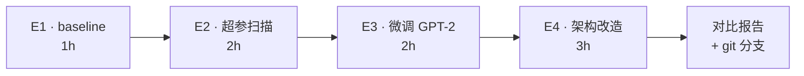

# 05 · Hack 实验记录（Q&A 版）

> Phase 5：4 组实验，从超参扫描到架构改造。**纸上谈兵到此结束，开始动手**。
>
> 上游：[`../00_learning_plan.md`](../00_learning_plan.md) · 代码：[`../nanoGPT/`](../nanoGPT/)
>
> 预计时长：**8 小时（可拆 2 天）**

---

## 总览：4 组实验



| 实验 | 时长 | 目的 | 衡量指标 |
|---|---|---|---|
| E1 baseline | 1h | 建立锚点 | val_loss、采样质量 |
| E2 超参扫描 | 2h | 找到 loss/cost 敏感维度 | val_loss vs 显存 vs 时间 |
| E3 微调 GPT-2 | 2h | from-scratch vs finetune | 收敛曲线 |
| E4 架构改造 | 3h | 自己造个变种 | 跟 baseline 对比 |

---

## E1 · Baseline（不改任何东西）

### 设置

```
config:  config/train_shakespeare_char.py（不改）
iter:    5000
device:  TODO (A100 MIG ? CPU ?)
```

### 结果

| 指标 | 值 |
|---|---|
| 训练耗时 | _TODO_ |
| best val_loss | _TODO_ |
| 显存峰值 | _TODO_ |
| MFU | _TODO_ |

### 采样

```
TODO: 贴一段
```

---

## E2 · 超参扫描

### 扫描矩阵

| 实验 ID | n_layer | n_head | n_embd | block_size | val_loss | 显存 | 时间 |
|---|---|---|---|---|---|---|---|
| baseline | 6 | 6 | 384 | 256 | _TODO_ | _TODO_ | _TODO_ |
| E2.1 | 4 | 6 | 384 | 256 | _TODO_ | _TODO_ | _TODO_ |
| E2.2 | 8 | 6 | 384 | 256 | _TODO_ | _TODO_ | _TODO_ |
| E2.3 | 6 | 4 | 384 | 256 | _TODO_ | _TODO_ | _TODO_ |
| E2.4 | 6 | 8 | 384 | 256 | _TODO_ | _TODO_ | _TODO_ |
| E2.5 | 6 | 6 | 384 | 128 | _TODO_ | _TODO_ | _TODO_ |
| E2.6 | 6 | 6 | 384 | 512 | _TODO_ | _TODO_ | _TODO_ |

> 每个点跑 2000 iter 即可（找趋势，不追极致）。

### Q2.1：哪个维度对 val_loss 影响最大？哪个对显存影响最大？

**答**：_TODO_

### Q2.2：把 `n_head=4` 跟 `n_head=8` 比，`n_embd` 不变的话每 head 维度怎么变？loss 对此敏感吗？

**答**：_TODO_

### Q2.3：加大 `block_size` 会显著加显存——为什么？（提示：attention 矩阵 (T,T)）

**答**：_TODO_

---

## E3 · 微调 GPT-2 124M

### 设置

```
config:  config/finetune_shakespeare.py
init_from: 'gpt2'
iter:    20  (default in config)
```

### Q3.1：第一步 loss 跟 from-scratch 比，差多少倍？为什么？

**答**：_TODO_

### Q3.2：BPE tokenizer 在莎士比亚上的 tokens-per-iter 跟 char-level 比，多还是少？

**答**：_TODO_

### Q3.3：微调采样 vs from-scratch 采样，哪种更像"莎士比亚"？

**答**：_TODO_

```
TODO: 两种采样各贴一段
```

---

## E4 · 架构改造（任选一）

### 选择哪条路？

- [ ] (a) LayerNorm → **RMSNorm**（LLaMA 同款，去掉 mean）
- [ ] (b) learned PE → **RoPE**（旋转位置编码）
- [ ] (c) MHA → **GQA**（grouped query attention，省 KV）

### 实现笔记

```python
# TODO: 贴你的实现 diff 或核心代码
```

### 对比

| 指标 | baseline | hacked |
|---|---|---|
| 参数量 | _TODO_ | _TODO_ |
| val_loss @ 2000 iter | _TODO_ | _TODO_ |
| 推理速度（tok/s） | _TODO_ | _TODO_ |
| 显存 | _TODO_ | _TODO_ |

### Q4.1：改完之后 `from_pretrained` 还能加载 HF GPT-2 吗？哪些层会失败？

**答**：_TODO_

### Q4.2：理论上 (a)/(b)/(c) 各自的好处来自哪？你的实验里观察到了吗？

**答**：_TODO_

---

## 五、git 分支记录

```bash
cd ~/nanogpt-study/nanoGPT
git checkout -b hack/<your-name>
# ... 改 model.py ...
git commit -am "feat: replace LayerNorm with RMSNorm"
```

分支名：`TODO`
关键 commit：`TODO`

---

## 六、关键坑

```
1. （TODO）改完 model.py 后跟 from_pretrained 不兼容，得 catch 哪些 KeyError
2. （TODO）超参点跑太多时间不够，怎么砍
```

---

## 七、自测题清单（毕业测试）

- [ ] 能在 30 分钟内复现一组超参扫描（自动化脚本就更好）
- [ ] 能解释为什么 finetune 第一步 loss 就明显低于 from-scratch
- [ ] 能解释你做的架构改造在数学上等价 / 不等价于原版

## Deliverable

- [ ] 填完所有 Q&A
- [ ] 4 张实验结果表
- [ ] 1 个 git 分支 + commit hash
- [ ] 一段 hack 后的采样输出
