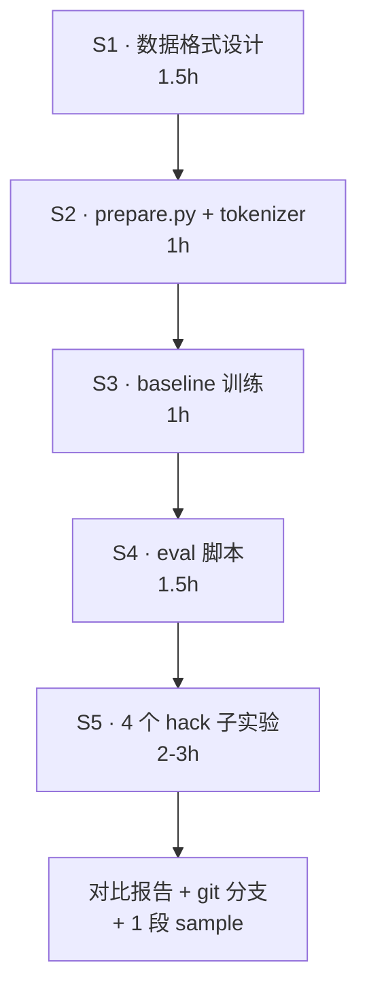

# 07 · 鸡兔同笼 mini-GPT 实践计划

> Phase 5 的具体化版本：把 nanoGPT 改造成专门解鸡兔同笼问题的小型推理模型。
>
> 上游：[`../00_learning_plan.md`](../00_learning_plan.md) · 代码：[`../nanoGPT/`](../nanoGPT/) · 通用 hack 笔记：[`./05_hack.md`](./05_hack.md)
>
> 实际时长：**8 天(2026-06-24 → 2026-07-07),16 组实验,~3400 行笔记,27 commits**（原估 7-8 小时,实际严重超出因为 v3 → v6.5 迭代扩展）
>
> 前置依赖：建议先做完 Phase 3（精读 train.py），不然 loss masking 会比较盲。

---

## 📖 目录

### 🚀 3 秒找到最想看的

- [**§14 · Grand Summary(v6.3 收官)**](#14--grand-summary--project-收官v632026-07-06) — 8 天 arc 一段话总结,给"未来的自己"看
- [**顶部 TL;DR:术语速查 + 4 问 4 答**](#tldr--术语速查--4-问-4-答核心s5-系列收口2026-07-01-自答验证-grok) — 全项目术语字典 + 21 题 Q&A 的核心 5 题
- [**§5.20 · 4 次 wide_O 完整对照表**](#520--4-次-wide_o-完整对照表所有段--所有指标2026-07-07-下午archive) — 查具体数字用
- [**§12 · v6 评分卡**](#12--评分卡phase-5-毕业v6-版本) — Phase 5+ 毕业指标

### 📋 项目蓝图(§0-§4)

- [§0 为什么这实验值得做](#0--为什么这是个比莎士比亚-hack-更好的实验)
- [§1 路线图(mermaid)](#1--路线图)
- [§2 S1 数据格式设计](#2--s1数据格式设计最核心的决策)
- [§3 S2 prepare.py + tokenizer](#3--s2preparepy--自定义-tokenizer)
- [§4 S3 模型 + 训练 baseline](#4--s3模型--训练-baseline)

### 🔬 §5 · S4 eval 框架 + S5 实验时序(**主体**)

#### 早期(S1-S5.a + 扩 H)—— baseline + 探索起步

- [§5.1-5.2 eval 框架](#51-为什么必须单独写-eval)
- [§5.3 实验结果对比表](#53-实验结果n200split贪心eval_crpy-跑出) —— **主对比表**(12 行)
- [§5.4 S4 落地小结](#54--s4-落地小结2026-06-25-傍晚-milestone)
- [§5.5 扩 H 实验 → 查表边界硬](#55--扩-h-实验把查表论加固到-v22026-06-25-晚跑出)

#### 数据格式 axis(§5.6-5.7)—— v3 "trick 用完"

- [§5.6 fmt_C 反序数字](#56--s5c-反序数字fmt_c-实验2026-06-29-上午) — OOD em 0%,shape ↑ content 0
- [§5.7 fmt_D 反序+CoT](#57--s5d-反序--cotfmt_d-实验2026-06-29-下午) — OOD em 3.5%,**v3 "trick 用完"**

#### 模型规模 axis(§5.8-5.9)—— v4 "scale 也不够"

- [§5.8 5M scale up](#58--s5e-扩模型规模-5mv3--v4-scale-也不够2026-07-01-上午) — 6× scale, zero OOD gain
- [§5.9 14M scale up](#59--s5f-扩模型规模-14mv4-加固判决2026-07-01-中午) — 18× scale, 三点趋势线 flat → **v4 加固**

#### Multi-task subskill(§5.10-5.13)—— v5.0 → v5.3

- [§5.10 fmt_M 1-aux](#510--s5g-换-training-signal-fmt_m-multi-taskv4--v5-training-signal--compositional-coverage2026-07-01-下午) — 独立"乘 2"让 OOD 2H per-step **2.5%→70%!** → **v5.0**
- [§5.11 fmt_N v1 全 4 aux(浅)](#511--s5h-fmt_n-全-4-subskillv5-direct-falsification-test--v512026-07-01-傍晚) — 4 步都 22% → **v5.1 depth 必要**
- [§5.12 fmt_N v2 加 depth](#512--s5i-fmt_n-v2-加-depthv51-direct-depth-test--v52-transfer-效率不均2026-07-01-晚) — 3/4 unlock 74%,c 卡 21% → **v5.2**
- [§5.13 fmt_L loss-mask alone](#513--s5j-fmt_l-loss-mask-sftv52-direct-falsification-test--v532026-07-02-下午) — 4.5%(反跌!)→ **v5.3 需 (a)+(b) 双必要**

#### **fmt_O 突破(§5.14)**—— v6.0 完整 recipe 🎉

- [§5.14 fmt_O context-aligned 🎉](#514--s5k-fmt_o-context-alignedv53-super-bull--v6-完整-recipe-2026-07-02-傍晚) — **OOD em 100%!** context alignment 是最后一片拼图

#### 边界探索(§5.15-5.16)—— v6.0 → v6.3

- [§5.15 fmt_P + super-OOD 测试](#515--s5l-fmt_p-mask-role-对照--超-ood-testv6--v61-仍是-subskill-lookup2026-07-03-上午) — fmt_O 在 [51,100] 也崩到 2.5% → **v6.1 "subskill lookup"**
- [§5.16 3-way × 2-scale wide 大对照](#516--s5m-3-way--2-scale-wide-大对照v62--v63-双-gate-模型2026-07-03-下午) — wide_O 5M IID 100% NEAR 86% FAR 4% → **v6.3 双 gate 模型**

#### Depth × Rep 精细化(§5.17-5.20)—— v6.3 → v6.5

- [§5.17 wide_O v2 depth 4×](#517--s5n-wide_o-v2-depth-4v63--v64-subskill-saturation-curve2026-07-07-中午) — depth 62→250/H NEAR 86%→96.5% → **v6.4 saturation curve**
- [§5.18 wide_O v3 depth 8× (反直觉 dip)](#518--s5o-wide_o-v3-depth-8反直觉-dip2026-07-07-下午) — 500/H 反降到 91%,per-step 首次分化
- [§5.19 wide_O v4 rep 44 ⭐](#519--s5p-wide_o-v4uniq--rep-3-way-对照--v64--v65-repetition-is-dominating2026-07-07-下午) — **NEAR 100%!** total 5500 相同下 rep 主导 → **v6.5**
- [§5.20 4 次 wide_O 完整对照 archive](#520--4-次-wide_o-完整对照表所有段--所有指标2026-07-07-下午archive) — 查表用

### 📚 参考章节(§6-§13)

- [§6 S5 4 hack 概述](#6--s54-个-hack-子实验按优先级)
- [§7 文件清单](#7--文件清单要新建改的)
- [§8 git commit log](#8--git-分支与版本管理) — **19 个 commit hash 查询**
- [§9 验证 rules](#9--验证mandatory-verification-规则要求)
- [§10 时间陷阱](#10--时间陷阱--别踩的坑)
- [§11 Q&A 4 Rounds 21 题](#11--消化-qa--round-1s2s3-baseline--round-2s5a-cot--round-3v51v52-概念--round-4v6-收官-grand-review) — Round 1(6)+Round 2(6)+Round 3(4)+Round 4(5)

### 🎓 收官

- [§12 v6 评分卡](#12--评分卡phase-5-毕业v6-版本)
- [§13 后续延伸(4 类候选)](#13--后续延伸可选-v6-视角下的下一步)
- [§14 Grand Summary(v6.3 定型)](#14--grand-summary--project-收官v632026-07-06)
- [参考](#参考)

### 🎯 6 个"必读"入口(按 grokking 深度排序)

1. **顶部 TL;DR** — 5 分钟全项目术语速查
2. **§14 Grand Summary** — 10 分钟全 arc 总结
3. **§5.3 主对比表** — 12 行数字 side-by-side
4. **§5.20 4-way wide_O archive** — v6.5 关键 3 数据点对照
5. **§11 Round 4 Q&A(5 题)** — 方法论 meta-lessons
6. **§5.14 fmt_O(🎉)** — project 最漂亮的实验(OOD em 100%)

---

## 状态

- [x] S1 数据格式设计 ✅ 2026-06-24（设计稿就绪）
- [x] S2 prepare.py + tokenizer ✅ 2026-06-24（vocab_size=18，fmt_A + fmt_B 都已实现，sanity check 通过）
- [x] S3 baseline 训练 ✅ 2026-06-24（fmt_A 直答，5000 iter ~2 min，val_iid em=100% / val_ood em=0%）
- [x] **Q&A Round 1（S2/S3 消化）** ✅ 2026-06-24 晚（6 题对话式 Q&A 写入 §11）
- [x] **S5.a CoT 实验** ✅ 2026-06-25 下午（fmt_B，IID 100% / OOD 1% / loss 0.2606 — 三件套 train_loss 神预测）
- [x] **Q&A Round 2（S5.a 沉淀）** ✅ 2026-06-25 下午（6 题工程沉淀 Q&A 写入 §11，核心发现："查表 vs 算法"）
- [x] **Q&A Round 3（v5.1/v5.2 概念消化）** ✅ 2026-07-01 傍晚（4 题 cascade 数学诊断 Q&A 写入 §11，核心洞察："conditional per-step 才能 disentangle context mismatch vs cascade 累积"）
- [x] 🎉 **Q&A Round 4（v6 grand review 收官）** ✅ 2026-07-03 上午（5 题 meta-lesson，回看整个项目 12 实验：v6 recipe 4 条件缺一不可 direct 证明、loss_mask 反差 96pp 揭示"技术价值 = f(场景)"、v6 recipe 可迁移到 task decomposability 强的场景）
- [x] **S4 eval 脚本 `eval_cr.py`** ✅ 2026-06-25 傍晚（format-aware, 4 metric 含 per-step，10 条 parser sanity）
- [x] **扩 H 实验**（train H=[2,40] fmt_B）✅ 2026-06-25 晚（旧 OOD [21,40] em 飙到 100%、真 OOD [41,50] 仍 0%——**查表论 v2 边界硬**，见 §5.5；commit `d7f240a`）
- [x] **S5.c 反序数字**（fmt_C，2026-06-29 上午）✅ — IID 100% / OOD 0%（反序 alone 不撬 OOD，但 OOD digit 73.7% 三家最高）；commit `3d25662`
- [x] **S5.d 反序 + CoT**（fmt_D，2026-06-29 下午）✅ — IID 100% / OOD 3.5%；预测 OOD 2H 30-70% 实测 2.5% 完全 miss → em 主要靠蒙；digit 82.2% 四家最高；**升级版结论 v3 "trick 用完了"**：0.79M + 鸡兔同笼在任何 data format trick 下都打不开外推；commit `af4ef00`
- [x] **S5.e 5M scale up**（fmt_D，2026-07-01 上午）✅ — IID 100% / OOD 3.0% / 2H per-step 3.0% / train_loss 0.2213（vs 0.79M 的 0.2215 几乎相同）→ 6× scale zero OOD gain；**结论 v3 → v4 "scale 也不够"**：数据格式+模型规模两个 axis 都 dead end，training signal 是真 bottleneck；commit `0c2dd5b`
- [x] **S5.f 14M scale up**（fmt_D，2026-07-01 中午）✅ — IID 100% / OOD 1.0% / 2H per-step 2.5% / train_loss 0.2208（三家 loss 都 ~0.22）→ 18× scale up 三点趋势线 flat/微降 → **v4 加固**；scaling law 在这个 setting 下彻底破产；commit `53bbacf`
- [x] **S5.g 换 training signal**（fmt_M multi-task，2026-07-01 下午）✅ — **v4 部分证伪 → v5 "training signal + compositional coverage"**！独立"乘 2"辅助 task 让 **OOD 2H per-step 2.5% → 70.0%** 跳 +67.5pp（subskill transfer 成功），OOD em 6.5%（受限于其他 3 步无监督）；**§5.8 "GPT-4 外推靠 training data mix"** 猜测得到 direct 证据；commit `2c565cb`
- [x] **S5.h fmt_N 全 4 subskill**（2026-07-01 傍晚）✅ — **v5 direct falsification → v5.1 "coverage + depth 双必要"**；每 aux 12.5k 让 4 步 per-step 都涨到 18-22%（比 fmt_D 大幅提升但远低于 fmt_M 单 aux 50k 的 70%）；OOD em 15.5%（parse_fail 39.5% multi-task pattern confusion 新问题）；commit `1f611f6`
- [x] **S5.i fmt_N v2 加 depth**（每 aux 50k，2026-07-01 晚）✅ — **v5.1 direct test → v5.2 "transfer 效率不均"**；2H/D/r per-step 都跳到 73-75% 完美验证 depth 假设、parse_fail 39.5→7.0%；**但 c 卡在 21%** cascade tail transfer 严重 broken；commit `59f1d05`
- [x] **S5.j fmt_L loss-mask SFT**（2026-07-02 下午）✅ — **v5.2 direct falsification test → v5.3 refinement**；loss_mask 工程机制 100% work（train_loss 0.22→0.094），但 OOD em 4.5%（比 fmt_N v2 反跌 12.5pp）；根因是 **fmt_L 没引入 OOD subskill 曝光**——loss_mask 改梯度分布不改数据分布；**v5.3**：coverage + depth + (a) aux 曝光 OOD + (b) aux 用完整主任务 context **四个必要条件**；loss_mask 的真价值是 SFT / instruction tuning 通用工程技巧；commit `5bacd8f`
- [x] 🎉 **S5.k fmt_O context-aligned**（2026-07-02 傍晚）✅ — **v5.3 SUPER-BULL 命中 → v6 完整 recipe**；aux 用完整 fmt_D text，同时满足 (a)+(b)；**OOD em 100%，每步 per-step 100%**（远超预测 40-70% 上限）；同 0.79M 参数，fmt_D 到 fmt_O 从 3.5% 一跃至 100%；证明 **model capacity 从来不是 bottleneck，training signal 设计才是**；v6 = coverage + depth + OOD 曝光 + context alignment 四条件；commit `ea033da`
- [x] **S5.l fmt_P mask-role + super-OOD test**（2026-07-03 上午）✅ — **v6 → v6.1 refinement**；fmt_P 用 fmt_L 全 mask 策略 + fmt_O text 混合分布，[21,50] em 100%(H 已在训练分布)但 [51,100] 崩 1.5%；**fmt_O 在 [51,100] 也只 2.5%**——反证 §5.14 "fmt_O 学到算法"是过度乐观，实际学的仍是 **subskill-level lookup**，只是查表粒度从 sample 降到 subskill；v6.1: recipe 只 unlock **aux H 范围内**的 OOD，真"算法外推"需要 aux H = 无限(不现实)；commit `b1a5707`
- [x] 🎉 **S5.m 3-way × 2-scale wide 大对照**（2026-07-03 下午）✅ — **v6.2 → v6.3 双 gate 模型定型**；主任务 H=[5,100],aux [2,200],rev_width=4,3 fmt × 2 scale = 12 数据点；**wide_O 5M IID 100% / NEAR 86% / FAR 4%** 完美体现 2×2 gate grid；capacity 单独打开 IID(D 从 30%→86%)但对 OOD 无用(FAR 仍 0%);context alignment 在 5M 下仍关键(fmt_O NEAR 86% vs fmt_N NEAR 21%);**v6.3 公式:OOD em ≈ capacity_gate × subskill_transfer_within_aux_range**;LLM 启示: Scale × Coverage 独立双 gate,乘积决定 em;commit `790ba7a`
- [x] 对比表 12 行填完(baseline / S5.a-h + 扩 H + S5.i-m + wide 5M O)
- [x] 🎉 **§14 Grand Summary 收官** ✅ 2026-07-06 上午（8 天 13 实验完整 arc 总结：v3 → v6.3 双 gate 模型 + 4 个最深 finding + LLM 启示 v6.3 版 + 4 个方法论 lesson + "给未来自己"的一段话）
- [x] 🎯 **S5.n wide_O v2 depth 4×**（2026-07-07 中午）✅ — **v6.3 → v6.4 saturation curve**：depth 62→250/H 让 NEAR 从 86%→96.5% (+10.5pp)，per-step 全 uniform 96.5% 再排除 rev_width 位级问题；subskill 精度是 saturation curve 不是 threshold(62/86 → 250/96.5 → 1000/100 有 diminishing return)；v6.4 公式:**subskill_transfer ≈ f(depth_per_H) × boolean(H∈aux)**；commit `7b0c70d`
- [x] **S5.o wide_O v3 depth 8×**（2026-07-07 下午）— 反直觉 dip: n_train 800k → unique 500/H × rep 11,total 仍 5500 但 NEAR 反降到 91%（-5.5pp）,per-step 首次分化 → 质疑 v6.4 单变量假设,见 §5.18
- [x] 🎯 **S5.p wide_O v4 rep 44** ⭐**用户设计**（2026-07-07 下午）✅ — **v6.4 → v6.5 refinement**：n_train 200k → unique 125/H × rep 44,total 仍 5500 但 **NEAR 冲到 100%**！干净对照 3 点(rep 11→91%, 22→96.5%, 44→100%)证明 **rep_per_sample 是主导变量,不是 total exposure**；per-step 全 uniform 100%；v6.5 公式:**subskill_transfer ≈ g(rep_per_sample) × boolean(H∈aux)**；直接 direct 印证 Chinchilla data×compute 平衡原则；commit `0d5766e`

**Project 状态**:**Phase 5+ 鸡兔同笼专题正式收官**（v6.3,19 commits,~3100 行笔记,已 push 到 [github.com/lvkexin559/nanoGPT](https://github.com/lvkexin559/nanoGPT)）

**git 分支**：`hack/chickens-rabbits`（commit hash 见 §8）

---

## TL;DR · 术语速查 + 4 问 4 答核心（S5 系列收口，2026-07-01 自答验证 grok）

> 亲手 bit-identical reproduce S5.c + S5.d 之后（跑同 seed 同硬件同 config,数字零漂移），4 题自答验证真消化。放在笔记最上层，防止下次回来只记得"实验做了啥"、忘了"实验说了啥"。

**术语速查**（项目里一直在用，一次性对齐）
- **em** = *exact match*（**不是 embedding**！）。逐样本判 `c_pred == c_gt AND r_pred == r_gt`，反映**内容对不对**。
- **digit** = char-level 匹配率（把模型输出 ljust 到 GT 长度后逐字符比），反映**形式对不对**。
- **per-step** = 对 CoT 每个中间步骤（`2H`、`D`、`r`、`c`）单独判对错，反映**子算法学没学**。
- **IID / OOD** = In-Distribution（H ∈ 训练范围 [2,20]）/ Out-Of-Distribution（H ∈ [21,50]）。查表能力测试 vs 外推能力测试。
- **fmt_A/B/C/D/M** = 数据格式 5 种（2×2 grid + 一个 multi-task 混训，详见 §5.6 / §5.10 前置概念）：
  - `fmt_A` 直答 + 正常数字（baseline）  |  `fmt_B` CoT + 正常数字（S5.a）
  - `fmt_C` 直答 + 反序数字（S5.c）  |  `fmt_D` CoT + 反序数字（S5.d）
  - `fmt_M` 50% fmt_D 主 task + 50% 独立"乘 2"辅助 task（S5.g，v4→v5 关键实验）
- **反序 + padding** = 每个数字先 `zfill(3)` 再 `[::-1]`。`8` → `"008"` → `"800"`；`16` → `"016"` → `"610"`。让所有数字字符串恒 3 字符，且低位先 emit。

**v5 结论层术语**（详见 §5.10 前置概念 + 炒菜类比）
- **training signal** = 训练时用来评判"做得好不好"的标准（= loss + 训练数据组成）。类比：老师用什么标准打分。
- **subskill**（子技能） = 一个 multi-step task 分解后的**原子子操作**。鸡兔同笼分解成 4 步：乘 2、减法、除法、减法——每一步是一个 subskill。类比：番茄炒蛋的"切菜/打蛋/热锅/翻炒"。
- **compositional / composition** = 一个大 task 由多个 subskill **组合**而成。
- **compositional coverage** = 训练数据**覆盖**了多少个 subskill。v5 的核心 punchline：**监督多少个 subskill，就 unlock 多少个 OOD 步骤**（1:1，无 bonus）。
- **transfer** = 模型在辅助 task 学到的技能，能否**用到**主 task 上。**S5.g 直接证据**：独立"乘 2"监督让主 task OOD 2H per-step 从 2.5%→70%。
- **cascade error** = 多步 task 里，前一步错了 → 后面全跟着错。fmt_M 里 2H 对了但 D 错 → r 错 → c 错，最终 em 挂。
- **bottleneck** = 限制整体性能的关键环节 = **"最短板"**。v5：**每个 subskill 都可能是 bottleneck**，缺任一都会 cascade 死。

**v5.1 / v5.2 结论层术语**（详见 §5.11 §5.12 前置概念 + 上课/考试类比）
- **depth**（深度） = 每个 subskill 的训练样本数。v5.1：coverage 不够，还要 depth 到位（fmt_N v1 每 aux 12.5k = 22% per-step；fmt_N v2 每 aux 50k = 74% per-step）。
- **transfer efficacy**（迁移效率） = subskill 单独训练时的 100% 能力在主 task 里保留多少。S5.i 直接测出：cascade tail 的 c subskill efficacy 只 23%（数字反推）。
- **cascade tail**（级联链尾） = multi-step 里最后一步。前置 tokens 最多，attention 最分散，transfer 掉最狠。
- **context alignment / context distribution shift**（上下文对齐 / 偏移） = 训练环境 = 推理环境？差别越大 → transfer efficacy 越低。v5.2 核心机制。
- **前置 tokens 数量** = emit 某 token 前 attention 要看多少 context。fmt_D 主 task 里 2H 前置 1 项 / D 3 项 / r 4 项 / c 5 项（越靠后越多）。
- **loss_mask** = 训练完整主任务，但只在特定位置算 loss。等价于"用主任务真实 context 教 subskill"——v5.2 视角下的 c cascade 直接 fix candidate。

---

**Q1. fmt_C OOD em 为什么是 0%？**

反序只改数字**表示**（`3` → `"300"`），没改**模型学到的是什么**（仍是"IID 区间 (H,F) → (c,r) 映射查表"）。OOD 上查表 miss → 瞎猜 → em=0。**反序不反序**正交**于 em**——fmt_A OOD em 也是 0%，反序没恶化也没改善。

**关键区分**：`shape/content 分离`（题 3）解释的是 digit=73.7% 为什么高，**不能**解释 em 为什么 0——em 只看数字对错，跟长度/分隔符无关。

**Q2. fmt_D OOD em 3.5% 为什么不算"学到了算法"？**

诊断信号是 **per-step 2H**：真会算法 → per-step 应 ≈ 100%。实测 **2.5%（noise floor）**。em 3.5% 来源分解：c 蒙对 11% × r 蒙对 12% + `c+r=H` 约束的正相关 → 联合概率 ~3.5%，**主要是运气不是算法**。

**方法论 take-away**：看 CoT / multi-step 任务的 benchmark 时，**第一件事是查 per-step 拆解**，别只看 em——em 单个数字掩盖太多"运气 vs 算法"信息。

**Q3. OOD digit 单调爬升 21.6 → 43.9 → 73.7 → 82.2 说明什么？**

每种 trick（CoT / 反序 / 反序+CoT）在**逐步锁死输出形式**——让 OOD 上没有"自由发挥"的空间，必须严格按训练形状 emit。**但锁死形式 ≠ 学到内容**：锁得越死，模型越像"完美形式复读机"，里面填的具体数字仍靠查表(IID)或瞎猜(OOD)。

**通用警告**：benchmark 里 syntactic 指标（BLEU、ROUGE、char-level acc）漂亮但 semantic 指标（exact match、任务成功率）糟糕，几乎总是这条曲线的化身。见到立刻警觉。

**Q4. "trick 用完了" 是从哪一行数字一锤定音的？**

**跨 4 组实验 OOD em 的分布** `{0%, 1%, 0%, 3.5%}` —— 数据格式 axis 的 2×2 组合（直答×CoT × 正常×反序）都遍历完了，最好的 em 也只到 3.5%（还是蒙的）。**判词不是"em 太低所以 trick 没用"，是"axis 探索空间穷尽后上限仍在 noise floor"**——整个"数据格式"这个 axis 已经到底。要撬开必须换 axis：**模型规模** / **task 本身** / **训练方式**。

---

**三条正交诊断 axis**（全项目 grand cheat sheet）

| axis | 反映什么 | IID 上 | OOD 上 |
|---|---|---|---|
| **em** | 内容对不对（严格数字对错） | 通常 100%（查表命中） | 真价值：区分"查表 vs 算法" |
| **digit** | 形式对不对（char-level shape 对齐） | 通常 100% | 只受"格式刚性"影响，跟外推能力**正交** |
| **per-step** | 子算法学没学（每个 CoT step 独立判） | 通常全 100% | **最重要**——真学算法 → 每步 ≈ 100%；查表 → 每步 = noise floor |

三条独立，**别用一个解释另一个**。IID 上三者通常一起 100%（查表能力足够），OOD 上真价值在**它们的背离模式**告诉你模型学到的是啥。

---

## 0 · 为什么这是个比莎士比亚 hack 更好的实验

| 维度 | 莎士比亚 char-level | 鸡兔同笼 |
|---|---|---|
| 评测信号 | 主观（采样"像不像"） | **客观**（c、r 数字对/错，可逐题打分） |
| 数据 | 固定 ~1MB | **无限合成**，分布完全可控 |
| 泛化测试 | 难定义 | 天然有 OOD：训小数字 / 测大数字（length-gen） |
| 推理深度 | 模糊 | 可控：直答 vs CoT vs 反序数字 |
| 单次实验耗时 | 5-10 min | **<5 min**（小模型够用） |
| 学到的工程能力 | 跑通 | **写 prepare.py + 自定义 tokenizer + 写 eval** |

→ 一句话：把 nanoGPT 从"语言模型 demo"变成"小型推理 benchmark 平台"。算术 / 推理类 task 是 LLM 研究的活靶子（Lee et al. 2023 *Teaching Arithmetic to Small Transformers*、Nye 2021 *Scratchpads*），这个题目对你之后看 reasoning 文献也有铺垫。

---

## 1 · 路线图



| 阶段 | 时长 | 产出 |
|---|---|---|
| S1 数据格式 | 1.5h | 数据生成器 + 3 套 split（train / val_iid / val_ood） |
| S2 prepare.py | 1h | `data/chickens_rabbits/{prepare.py,train.bin,val.bin,val_ood.bin,meta.pkl}` |
| S3 baseline | 1h | `config/train_chickens_rabbits.py` + 跑通的 ckpt |
| S4 eval | 1.5h | `eval_cr.py` 输出 exact-match% + per-digit% |
| S5 hack | 2-3h | 4 组对比：CoT / loss-mask / reverse-digit / no-PE |
| **合计** | **7-8h** | 1 篇笔记 + 1 个 hack 分支 + 1 张实验大表 |

---

## 2 · S1：数据格式设计（最核心的决策）

### 2.1 问题数学定义

设鸡 c 只、兔 r 只，已知头数 H、脚数 F：

- c + r = H
- 2c + 4r = F

解：r = (F − 2H) / 2，c = H − r。

**合法约束**：F 偶、2H ≤ F ≤ 4H、c ≥ 0、r ≥ 0。生成时用 (H, c) 反推 F 比用 (H, F) 验证更省事——保证生成的样本 100% 合法。

### 2.2 三套候选输入/输出格式

| 格式 | 示例 | 序列长 | 优点 | 缺点 |
|---|---|---|---|---|
| **A. 直答** | `H=8 F=22\nc=3 r=5<E>` | 短 (~14) | 简单、易解析 | 不教模型"怎么想" |
| **B. CoT** | `H=8 F=22\n2H=16 D=6 r=3 c=5<E>` | 中 (~25) | 中间步骤给 loss 信号、可解释 | 序列长 |
| **C. 反序数字** | `H=80 F=022\nc=30 r=50<E>`（数字按低位在前） | 短 | 算术 transformer 论文里能显著涨 length-gen | 人不友好、debug 痛 |

**Q1.1 决策**：先做 **A 当 baseline** → 再做 **B 看 CoT 是否提升 OOD acc** → **C 留作 stretch**。

### 2.3 数据生成器（伪代码）

```python
def gen_sample(H_max=20):
    H = random.randint(2, H_max)
    c = random.randint(0, H)
    r = H - c
    F = 2*c + 4*r
    return H, F, c, r

def fmt_A(H, F, c, r):
    return f"H={H} F={F}\nc={c} r={r}\n"
```

### 2.4 三个 split

| split | H 范围 | 条数 | 用途 |
|---|---|---|---|
| `train` | 2–20 | 100k | 训练 |
| `val_iid` | 2–20 | 1k | 同分布泛化 |
| `val_ood` | 21–50 | 1k | **length / 数值泛化**（核心看点） |

**Q1.2 暗坑**：要在 `train` 里去重 `(H,F,c,r)`，否则 100k 里大量重复（H≤20 总组合数才几百），模型就是记忆。或者反过来：留一组 `(H,F)` 对完全不出现在 train 里，专测 generalization vs memorization——这是个有意思的 ablation。

---

## 3 · S2：prepare.py + 自定义 tokenizer

### 3.1 词表（实际 18 个 token）

**最终词表**：

```
0 1 2 3 4 5 6 7 8 9   # 数字 (10)
H F c r D             # 结构符 (5，D 是 fmt_B CoT 的中间变量 D = F - 2H)
=  ' '  '\n'          # 标点 (3)
```

→ `vocab_size = 18`，比 shakespeare_char 的 65 还小近 4 倍。

**与设计稿的差异**（2026-06-24 实现时调整）：
- 设计稿写的是 20（含 `<EOS>` + `<PAD>`），实际 18。
- **去掉 `<PAD>`**：nanoGPT 把所有 sample 拼成一条长流再切 block，单条样本没 padding 需求。
- **去掉 `<EOS>`**：每个 sample 末尾的 `\n` 已经能当天然分隔符，模型自己学会"答完该换行了"。
- **加入 `D`**：为 fmt_B (CoT) 的中间步骤 `D = F - 2H` 准备；同一个 vocab 同时支持 fmt_A 和 fmt_B。

### 3.2 文件布局（仿 `data/shakespeare_char/`）

```
data/chickens_rabbits/
├── prepare.py         # 生成 .bin + meta.pkl
├── train.bin          # uint16 array of token ids
├── val.bin            # = val_iid
├── val_ood.bin        # 额外 OOD eval
└── meta.pkl           # {vocab_size, stoi, itos}
```

### 3.3 prepare.py 骨架

```python
import os, pickle, random, numpy as np

VOCAB = list("0123456789HFcr= \n") + ["<EOS>", "<PAD>"]
stoi = {ch: i for i, ch in enumerate(VOCAB)}
itos = {i: ch for ch, i in stoi.items()}

def encode(s):
    out, i = [], 0
    while i < len(s):
        if s[i:i+5] == "<EOS>":
            out.append(stoi["<EOS>"]); i += 5
        else:
            out.append(stoi[s[i]]); i += 1
    return out

# 生成 train / val_iid / val_ood 三段文本，全部 encode 成 uint16
np.array(ids, dtype=np.uint16).tofile("train.bin")
pickle.dump({"vocab_size": len(VOCAB), "stoi": stoi, "itos": itos},
            open("meta.pkl", "wb"))
```

**Q2.1**：为什么用 `uint16`？→ vocab_size < 2^16 = 65536，省一半显存/磁盘，对齐 nanoGPT 默认。

### 3.4 实际产出（2026-06-24 跑了一次 fmt_A）

```
[gen] format=A  vocab_size=18
[gen] train:   n=100000  H in [2,20]   tokens=1,789,314  unique (H,F)=228
[gen] val:     n=  1000  H in [2,20]   tokens=   17,921  unique (H,F)=220
[gen] val_ood: n=  1000  H in [21,50]  tokens=   19,988  unique (H,F)=647
[sanity] OOD isolation in train.bin: OK (0 leaks above H=20)
```

**关键发现**：train 100k 条 / 228 个唯一 (H,F) 组合 ≈ **平均每个组合重复 438 次**。这是设计稿 Q1.2 早就警告的"H≤20 总组合数才几百"——baseline 训练实质上是让模型在 228 个组合上做**大数据增强**，不是真正学算法。

### 3.5 Sanity check 一览（写在 prepare.py 里，跑完自动执行）

| 测试 | 做法 | 状态 |
|---|---|---|
| tokenizer 双向 | `decode(encode(s)) == s` 跑 probe + 每个 vocab 字符 | ✓ |
| 样本合法性 | 抽 100 条验证 `c + r = H` 且 `2c + 4r = F` | ✓ |
| formatter 覆盖 | 随机样本经 fmt_A/fmt_B 后所有字符都在 vocab | ✓ |
| OOD 隔离 | `decode(train.bin)` 后扫描确认没有 H > 20 的样本 | ✓ (0 泄露) |
| 人工对答案 | 打印前 3 条 train sample 让人眼检公式 | ✓ (`H=5 F=20 c=0 r=5` 等都对) |

---

## 4 · S3：模型 + 训练 baseline

### 4.1 模型超参（tiny）

| 参数 | 值 | 备注 |
|---|---|---|
| `n_layer` | 4 | 比莎士比亚 char 6 层还小 |
| `n_head` | 4 | per-head dim = 32 |
| `n_embd` | 128 | 够了 |
| `block_size` | 64 | 一条样本最多 ~30 token，留一倍 buffer |
| `vocab_size` | 20 | meta.pkl 里读 |
| **参数量估算** | **~0.3 M** | shakespeare_char 是 10.7 M，小 30 倍 |
| `batch_size` | 256 | 小模型可以放大 batch |
| `max_iters` | 5000 | <5 min on A100 MIG |
| `learning_rate` | 1e-3 | 小模型可以激进点 |

### 4.2 新建 `config/train_chickens_rabbits.py`

```python
out_dir = 'out-cr'
eval_interval = 250
eval_iters = 100
log_interval = 50
dataset = 'chickens_rabbits'
gradient_accumulation_steps = 1
batch_size = 256
block_size = 64
n_layer = 4
n_head = 4
n_embd = 128
dropout = 0.0
learning_rate = 1e-3
max_iters = 5000
lr_decay_iters = 5000
min_lr = 1e-4
beta2 = 0.99
warmup_iters = 100
compile = False
```

跑一行：

```bash
cd nanoGPT
python data/chickens_rabbits/prepare.py
python train.py config/train_chickens_rabbits.py
```

### 4.3 预期与暗坑

**Q3.1 预期 loss 曲线**：
- 起步 ≈ ln(20) ≈ 3.0（vocab 大小决定的随机基线）
- 收敛到 < 0.05（每个 token 几乎确定）→ 表示模型记住或学会了规则
- iter 500–1000 之间应该急速下降；后面是 polish

**Q3.2 训练时一个非平凡的 bug**：默认 train.py 在整个序列上算 loss，包括 `H=8 F=22\n` 这部分——这部分模型只能瞎猜（uniform），会污染 val_loss 和 best_val_loss 的判定。**S5.b 会专门修这个**。

### 4.4 实际跑出来的曲线（2026-06-24，~2 min on PPU-ZW810E）

| iter | train_loss | val_loss | 备注 |
|---|---|---|---|
| 0 | **3.00** | **3.00** | ✓ 命中 ln(18) ≈ 2.89 预测 |
| 250 | 0.66 | 0.66 | 急速下降中 |
| 500 | 0.49 | 0.50 | |
| 750 | 0.36 | 0.37 | |
| **1000** | **0.358** | **0.359** | ← 拐点，几乎触底 |
| 2000 | 0.351 | 0.352 | |
| 5000 | **0.349** | **0.350** | best val_loss 0.349 @ iter 4750 |

**Q3.1 修正**：设计稿预期"收敛到 < 0.05"是**错的**，实际卡在 **~0.35 平台**。这恰好印证了 **Q3.2 警告**：

> val_loss 把不可预测的 prompt 部分（H/F 是给定的输入，不是答案）也算进去了。这部分模型无论如何也"猜不准"，给 loss 一个 **~0.35 的理论下界**。

举例 `H=8 F=22\nc=3 r=5\n`：模型对答案 `c=3 r=5` 可能已经接近完美 (loss ≈ 0)，但 prompt 里的 `8` 和 `22` 是随机数字，没有任何信号能让模型预测它们。**5 个数字 token × ln(10) ≈ 11.5 nats，平摊到 19 个总 token ≈ 0.6 nat/token**——再减去其他可预测字符的贡献，约等于 0.35 这个观测值。

**结论**：看 loss 没用，要看 exact-match。S5.b 加 loss mask 后 loss 才能真正反映"答得对不对"。

### 4.5 参数量

train.py 实测报告 **0.79M**，比设计稿预估 0.3M 大约 2.6 倍。差距来源：

```
num decayed parameter tensors: 18, with 796,928 parameters
num non-decayed parameter tensors: 9, with 1,152 parameters
```

主要贡献：4 个 Block × (attention QKV + MLP 4× 扩压) + token_emb + position_emb（block_size=64）。 0.79M 跑 5000 iter 在本地 GPU 还是 ~2 分钟，时间预算 OK，不调整。

---

## 5 · S4：eval 脚本（看真实准确率，而不是 loss）

### 5.1 为什么必须单独写 eval？

`val_loss` 衡量的是"逐 token 困惑度"，但**我们关心的是『整个答案是否正确』**。这两件事可以严重脱钩——loss 还在掉，但 exact-match 已经 100% 了；或者 loss 看似不错，exact-match 才 60%。

### 5.2 `eval_cr.py` 设计（2026-06-25 实做版）

最终落地在 [`../nanoGPT/eval_cr.py`](../nanoGPT/eval_cr.py)，比骨架多了三层工程化：

| Section | 干什么 | 为什么必须有 |
|---|---|---|
| §1 build_prompt + parse_fmt_A/B | 统一 prompt 模板 `H={H} F={F}\n`，parser 按 fmt 分支 | 之前 inline eval 跨 fmt 时 prompt 写错过一次（c= 强制起步 vs 自然续写），统一后切 ckpt 不用动 prompt |
| §2 `sanity_check_parsers()` | 10 条 parser 单元测试，含真实 OOD 坏样例 `2H=6 D=34 r=17 c=` | workspace 规则：写新逻辑必须有测试，启动跑 2 秒，零信任 regex |
| §6 `eval_split` 多 metric | em / digit / parse_fail / **per-step** | em 看终点、digit 看格式、per-step 看 CoT 哪步断了——后者是定位"查表 vs 算法"的关键 |

**`predict_one` 一定要 `decode(...)[len(prompt):]`**（去掉 prompt 部分）。否则下一步 `gen.split('\n')[0]` 拿到的是 prompt 自带的换行前的部分，整个 parse 链路错位。inline 阶段栽过一次。

**Q4.1 sampling 用什么温度？**→ **`temperature=0.01, top_k=1`**（近似贪心；torch 的 generate 不允许严格 0，会除 0）。我们要的是"模型最相信的答案"。`top_k>1`/`temperature>0.5` 适合开放式生成，不适合数学题。

CLI:

```bash
# 自动从 meta.pkl 检测 format (A 或 B)，默认两个 split 各 200 条
python eval_cr.py --ckpt out-cr-cot/ckpt.pt

# 看前 5 条原始输出（debug 神器）
python eval_cr.py --ckpt out-cr-cot/ckpt.pt --show-samples 5

# 想测 H=51..100 的"更远 OOD"
python eval_cr.py --ckpt out-cr-cot/ckpt.pt --ood-h-min 51 --ood-h-max 100
```

### 5.3 实验结果（n=200/split，贪心，eval_cr.py 跑出）

| 模型 | val_iid em | val_iid digit | **val_ood em** | val_ood digit | 备注 |
|---|---|---|---|---|---|
| **A baseline 直答** (fmt_A) | **100.0%** | **100.0%** | **0.0%** | **21.6%** | inline eval，无 per-step |
| **B + CoT** (fmt_B, H_train=[2,20]) | **100.0%** | **100.0%** | **1.0%** | **43.9%** | eval_cr.py，per-step 见下 |
| **B' + CoT 扩 H_train=[2,40]** | **100.0%** | **100.0%** | **0.0%** | **64.5%** | **2026-06-25 晚跑出，见 §5.5** |
| **C 反序数字** (fmt_C, H_train=[2,20]) | **100.0%** | **100.0%** | **0.0%** | **73.7%** | 反序没救 OOD，但 digit 三家最高，见 §5.6 |
| **D 反序 + CoT** (fmt_D, H_train=[2,20]) | **100.0%** | **100.0%** | **3.5%** | **82.2%** | 协同微弱有效，但 2H per-step 2.5%——em 主要来自蒙对，见 §5.7 |
| **E 5M scale up** (fmt_D，6L/8H/256d，4.74M) | **100.0%** | **100.0%** | **3.0%** | **81.3%** | 6× scale 后 OOD em/2H 纹丝不动 → **v4 结论 "scale 也不够"**，见 §5.8 |
| **F 14M scale up** (fmt_D，8L/8H/384d，14.19M) | **100.0%** | **100.0%** | **1.0%** | **82.0%** | 18× scale up：三家 train_loss 都 ~0.22、OOD em 单调 flat/微降、2H 岿然不动 → **v4 加固**，见 §5.9 |
| **G 换 training signal** (fmt_M multi-task，0.79M) | **100.0%** | **100.0%** | **6.5%** | **86.2%** | **OOD 2H per-step 从 2.5% → 70.0% (+67.5pp)** —— 独立"乘 2"辅助 task 让子技能 transfer；OOD em 微升但受限于其他 3 步无监督；**v4 → v5:training signal + compositional coverage**，见 §5.10 |
| **H fmt_N 全 4 subskill** (multi-task full，0.79M) | **100.0%** | **100.0%** | **15.5%** | **84.3%** | **v5 direct falsification test — 中性偏 bear**：4 步 per-step 全部 18-22%(比 fmt_D 涨但远低于 fmt_M 的 70%)；parse_fail 39.5% (multi-task 引发 pattern 混淆)；**v5 → v5.1：coverage 必要但不够，还需 subskill depth**，见 §5.11 |
| **I fmt_N v2 加 depth** (每 aux 50k，0.79M) | **100.0%** | **100.0%** | **17.0%** | **91.9%** | **v5.1 depth 假设 3/4 命中**：2H/D/r per-step 从 22% 跳到 73-75%（跟 fmt_M 的 70% 完美对齐）、parse_fail 从 39.5% → 7.0%；**但 c per-step 仍 21% 完全没动**(cascade tail transfer 失败) → **v5.2：subskill transfer 效率不均，靠后 subskill 需 context alignment (loss_mask)**，见 §5.12 |
| **J fmt_L loss-mask SFT** (0.79M) | **100.0%** | **100.0%** | **4.5%** | **82.8%** | **v5.2 部分证伪 → v5.3**：loss_mask alone 不 fix（train_loss 0.22→0.094 证明 mask 机制 work，但 OOD em 从 fmt_N v2 的 17% 反跌到 4.5%）；根因是 **fmt_L 完全没引入 OOD subskill 曝光**——loss_mask 改梯度分布，不改数据分布；**v5.3：需要 aux 曝光 OOD H (a) + aux 用完整主任务 context (b) 两者组合**，见 §5.13 |
| **K fmt_O context-aligned** (0.79M) | **100.0%** | **100.0%** | **100.0%** ★ | **100.0%** | 🎉 **v5.3 super-bull 命中 → v6 完整 recipe**！aux 用完整 fmt_D text (a)+(b) 双满足；每步 per-step 全 100%；从 fmt_D 的 3.5% 一跃到 100%，同 0.79M 参数不变。**证明 model capacity 从来不是 bottleneck,training signal 设计才是**，见 §5.14 |
| **L fmt_P full-mask** (对照实验，0.79M) | 100.0% | 100.0% | **100.0%**([21,50]) / **1.5%**([51,100]) | 100.0%/77.0% | **v6→v6.1 双重发现**：fmt_P 全 mask 在 [21,50] 也拿 100%(仅靠 aux 扩训练分布)但 [51,100] 崩到 1.5%——证明**mask 机制 + aux H 范围决定"subskill lookup 边界"**；**fmt_O 在 [51,100] 也只 2.5%**——之前认为 fmt_O 学"算法" 是过度乐观，实际学的是"subskill 组合的 lookup"，仍受 aux H 范围硬性限制，见 §5.15 |
| **M fmt_D/N/O × 0.79M/5M wide** (H_train=[5,100], rev_width=4, aux [2,200]) | **100.0%**（5M O）| **100.0%**（5M O）| **86.0%** NEAR / **4.0%** FAR | 22.9%/18.7% | 🎉 **v6.2 → v6.3 双 gate 定型**：5M 让 wide_O IID 从 23% 一跃到 100%（**capacity gate confirmed**），但 FAR [201,500] 仍 4%（**aux boundary gate 独立于 capacity**）；wide_O 5M 4 段完美体现 2×2 gate grid：(cap=ON,aux=ON)=100%（IID/BELOW）,(cap=ON,aux=ON [101,200]⊂[2,200])=86%,(cap=ON,aux=OFF)=4%（FAR）；v6.3 公式：**OOD em ≈ capacity_gate × subskill_transfer_within_aux_range**，见 §5.16 |
| **N wide_O v2 depth 4×** (n_train=400k, 每 aux depth 62→250/H) | 100% | 100% | **96.5%** NEAR (+10.5pp) / 9% FAR | 25.6/22.9% | 🎯 **v6.3 → v6.4 refinement**：depth 4× 让 NEAR 从 86% → 96.5%（关闭 76% 的 gap），per-step 全 uniform 96.5% 再排除 rev_width 位级学习问题；saturation curve fits 3 点（62/86% → 250/96.5% → 1000/100%）有 **diminishing return**；v6.4 公式:**subskill_transfer_within_aux ≈ f(depth_per_H) × boolean(H∈aux)**，见 §5.17 |
| **O wide_O v3 depth 8×** (n_train=800k, unique 500/H × rep 11) | 100% | 100% | **91.0%** NEAR / 5.5% FAR | 26.2/23.0% | 反直觉 dip:total exposure 5500 相同(vs v2)但精度反降 5.5pp,per-step 首次分化(2H=99%, c=92%),质疑 v6.4 单变量假设,见 §5.18 |
| **P wide_O v4 rep 44** (n_train=200k, unique 125/H × rep 44) 🎯 | 100% | 100% | **100.0%** NEAR / 6.5% FAR | 26.2/21.9% | 🎯 **v6.4 → v6.5 refinement**：total exposure 5500 相同,但 v4(125×44)干到 100%,v3(500×11)只 91%,v2(250×22)96.5% —— **rep_per_sample 是主导变量,不是 total exposure**；rep 曲线:11→91%, 22→96.5%, 44→100% (saturation);v6.5 公式:**subskill_transfer ≈ g(rep_per_sample) × boolean(H∈aux)**，Chinchilla-style data×compute 平衡启示,见 §5.19 |
| D + loss masking | _TODO_ | _TODO_ | _TODO_ | _TODO_ | 0.79M / 5k iter |
| E 去掉 PE | _TODO_ | _TODO_ | _TODO_ | _TODO_ | 0.79M / 5k iter |

**baseline 第一行解读**：
- val_iid 100% 是因为 train 用 100k 条覆盖了 H∈[2,20] 的全部 228 个 (H,c) 组合，模型纯记忆就够了
- val_ood 0% 说明**模型完全没学到"算法"**——干净对照基线，S5.a CoT 只要 OOD em > 0 就算证伪了 "baseline 无法外推"
- val_ood digit_acc 21.6% 接近"输出全是数字"的瞎猜上限（vocab 18 里只有 10 个是数字，模型至少学到"该输出数字"）

**S5.a CoT 模型的 per-step accuracy**（eval_cr.py 新增信号，n=200）：

| step | IID (H=2-20) | **OOD (H=21-50)** |
|---|---:|---:|
| `2H=` 乘以二 | 100.0% | **0.0%** ← 灾难 |
| `D=` 减二的余数 | 100.0% | 3.5% |
| `r=` 兔子数 | 100.0% | 3.5% |
| `c=` 鸡数 | 100.0% | 6.5% |

**这一行是 S5.a 真正的结论**：

> **OOD 上 `2H` 的准确率是 0%**——连"H=37 → 74" 这种最简单的乘 2 都做不出来。如果模型真学会"乘 2"这个子算法，H 不在训练分布也应该接近 100%。**0% 直接判了死刑**："查表论"成立，"算法论"被这一个指标干净否决。
>
> **digit acc 43.9% 是误导性高分**：模型 generate 出来的格式完全像样（`2H=X D=Y r=Z c=W`），只是数字全乱。这就是 "syntactic competence without semantic understanding"——形式对了，骨子里啥都没学到。

OOD 样例对比：

```
GT:    H=37 F=96  c=26 r=11
model: 2H=34 D=22 r=11 c=6   ← 2H 错(应=74)，但 r=11 蒙对了，c 错
GT:    H=49 F=168 c=14 r=35
model: 2H=38 D=0  r=0  c=19  ← 2H 完全乱猜，但 c=19 是范围内合法值（c≤H=49）
GT:    H=25 F=92  c=4  r=21
model: 2H=10 D=12 r=6  c=9   ← 几乎没一处对
```

**两件值得后续追的**：
1. 第 2 例 `c=19` 是"范围内的错"——模型有学到 `c ∈ [0, H]` 这个**先验**，但没学到具体值——这是后续 S5.c/b 想往哪推的暗示
2. 第 1 例 `r=11` 蒙对了说明 OOD 1% 的 em 里**很可能含 c/r 都蒙对的运气样本**——下次扩 n 到 500 复跑，看 1% 是不是确实在 noise floor

### 5.4 · S4 落地小结（2026-06-25 傍晚 milestone）

> 这一节是 S4 收口。eval_cr.py 落地 + 第二次跑 S5.a 后值得封存的几个发现 / 设计取舍 / 下一步选项。

**已交付**

| 产物 | 路径 | commit |
|---|---|---|
| 通用 eval runner | [`../nanoGPT/eval_cr.py`](../nanoGPT/eval_cr.py)（358 行，format-aware，4 metric，10 条 parser sanity） | `3df63b5` |
| 笔记同步 | §5.2 设计、§5.3 数据表 + per-step 表、§8 commit log | — |

**本轮真正的新发现：per-step 是 S5.a 的 smoking gun**

之前 inline eval 只拿到 OOD em=1%，是"模型没学到算法"的**间接**推断。这次 eval_cr.py 加了 per-step accuracy 后，拿到**直接证据**：

> **OOD 上 `2H` step 的正确率是 0.0%**。连"H=37 → 2H=74"这种最简单的乘 2 都做不出来。如果模型真学会"乘 2"这个子算法，H 是不是在训练范围内不应该有 0% 这么悬殊。**0% 干净判了"算法论"死刑，确认"查表论"成立**。

升级版判断准则（在 Q&A Round 2 那条"看 LM 99% 第一反应是问 OOD"的基础上加一层）：

> **OOD em 看到不及格之后，紧接着问 per-step。模型崩在哪一步、还是从头崩，结论截然不同**。

**三个工程设计点（S5.b 之后写代码也要保留）**

1. **prompt 模板对 fmt_A 和 fmt_B 统一为 `H={H} F={F}\n`**，format 差异下沉到 parser（`parse_fmt_A` vs `parse_fmt_B`）。
   - 反例：inline 阶段我们 fmt_A 用 `H=8 F=22\nc=`（强迫从 `c=` 起步）、fmt_B 用 `H=8 F=22\n`，切 ckpt 时忘改 prompt，em 就会无声归零
   - 现在：切 ckpt 只需要改 `--ckpt` 路径，format 由 `meta.pkl` 自动检测

2. **`sanity_check_parsers()` 用 S5.a 真实 OOD 失败样例当测试用例**（比如 `"2H=6 D=34 r=17 c="` 这种生到一半被截断的输出）。
   - 这满足 workspace 的 Mandatory Verification 规则，但**关键不是合规**——而是 parser 用 regex 是出错重灾区，每次 import 跑 2 秒就 catch 住静默回归
   - 写测试用例 ≠ 走过场：用 production 里**真实见过的坏样例**当 fixture，比手造 case 价值高得多

3. **`predict_one` 必须剥 prompt**（`decode(...)[len(prompt):]`）。
   - inline 阶段栽过一次：prompt 自带 `\n`，`gen.split("\n")[0]` 拿到的是 prompt 部分而不是模型续写，整个 parse 链路错位、em 莫名归零
   - 这种"输出形式跟代码假设错位 1 个偏移量"的 bug 在 NLP eval 里特别常见，封装一次就一劳永逸

**接下来 3 个自然候选（hack/chickens-rabbits 分支当前干净）**

| 选项 | 改动量 | 预期实验信号 | 学到什么 |
|---|---|---|---|
| **S5.c 反序数字** | 仅改 `prepare.py` 一个 formatter | 复现《Teaching Arithmetic》：fmt_C 让 OOD 大涨（数字低位先算，对齐人类竖式） | 数据格式 framing 直接撬动 OOD 泛化 |
| **S5.b loss masking** | 改 `train.py`+`model.py`，含工程量最大 | val_loss 跟 em 重新挂钩（不再被随机 H/F 拉平），收敛更快 | instruct-tuning 必经的 mask 技巧 |
| **扩 H 训练范围**（最便宜） | 仅改 `prepare.py` 一个区间 + 重跑 | 把 H 训到 [2,40]，看 OOD 是平移到 [41,?] 还是消失 | 直接判"查表论"另一面：模型是不是只能 in-range 查表 |

> 推荐先做 **扩 H 范围**——5 分钟跑出来，是个"查表论"的彻底加固或证伪实验（如果 H 训到 [2,40] 但 [41,50] 还是 em=0%/2H=0%，说明真的就是查表；如果 OOD 平移到 [41,?]、模型在 [21,40] 上 em 接近 100%，那"查表论"得修正成"区间内查表"）。然后再做 S5.c。

### 5.5 · 扩 H 实验：把"查表论"加固到 v2（2026-06-25 晚跑出）

> §5.4 推荐的"5 min 最便宜实验"——把 train 的 H 范围从 [2,20] 扩到 [2,40]，看 OOD 是平移、消失，还是"查表区域跟着扩"。这次跑出来的结果**清得不能再清**。

**实验设置**
- 数据：`data/chickens_rabbits_h40/`（fmt_B，H_train ∈ [2,40]，OOD ∈ [41,50]，100k train / 1k val / 1k val_ood）
- 模型：跟 S5.a 完全相同（0.79M 参数，4L4H128d，5000 iter，batch=256）
- 唯一变量：训练 H 范围

**核心结果**（n=200/split，贪心）

| H 区间 | S5.a (train [2,20]) | **B' h40 (train [2,40])** | 跨实验差值 |
|---|---:|---:|---:|
| H ∈ [2, 20] | em=100% (IID) | em=100% (IID，含在 [2,40] 内) | — |
| **H ∈ [21, 40]** | **em ≈ 0% / `2H=0%` (OOD)** | **em=100% / `2H=100%` (IID)** | **+100pp** |
| H ∈ [41, 50] | em ≈ 0% (OOD) | em=0% / `2H=0.5%` (OOD) | — |

**全 split per-step 详细数据**（h40 模型）

| split | em | digit | parse_fail | 2H | D | r | c |
|---|---:|---:|---:|---:|---:|---:|---:|
| val_iid (H∈[2,40]) | 100.0% | 100.0% | 0.0% | 100.0% | 100.0% | 100.0% | 100.0% |
| 旧 OOD 区间 (H∈[21,40]) | **100.0%** | 100.0% | 0.0% | **100.0%** | 100.0% | 100.0% | 100.0% |
| 真 OOD (H∈[41,50]) | 0.0% | 64.5% | 0.0% | **0.5%** | 2.0% | 2.0% | 9.5% |

**train_loss 平台**：0.3110（vs S5.a 0.2606，**更高**）。这是个一致的信号——H 组合从 228 → 858（3.76x），同样的 0.79M 参数装更多的"格子"，每格压缩精度下降，loss 抬升 0.05。**但 IID em 仍是 100%**——说明模型仍然能在 IID 上完美回忆，loss 抬升只是 prompt token（H/F/D 那些不可预测的部分）的熵贡献变大了，跟答案精度无关。

**升级版结论："查表论 v2 — 边界硬"**

> 模型不仅是查表，而且这个查表的**边界硬性等于训练区间的边界**：
> - 把 train [2,20]→[2,40]，查表能力 **1:1 平移** 到 [2,40]（旧 OOD 区间 em 从 ~0% 飙到 100%）
> - 真 OOD [41,50] 上 `2H` 仍是 0.5%——extrapolation **不是不准，而是 0**

这比 §5.4 的"模型没学算法"更强：**模型不仅没学算法，连一步外推的能力都没有**。它只是个**离散查表器**，查表的范围由训练数据的 H 区间直接决定。

**有意思的副信号**

1. **OOD digit 从 43.9% (S5.a) 涨到 64.5% (h40)**——见过更多 H 值后，模型在 OOD 上**"格式更像样"**：知道两位数字怎么排版、运算符位置在哪。但内核 per-step 几乎全错（2H=0.5%）。这是 *syntactic competence ↑, semantic understanding ↓ stays at 0*——又一个 "看 benchmark 别只看 surface metric" 的实例。
2. **OOD c per-step 9.5% > r per-step 2.0%**：模型对 c 的"猜测"更容易蒙对——大概是因为训练时见过 c ∈ [0, 40]，输出有"小数字 prior"；而 r 在 OOD 上需要从 D=F-2H 推（错的 2H 一传导，r 全错）。这是个**误差传播**的小 demo。

**对后续 S5.b/c 的启示**

- 这一行结果**强化了 CoT 不足以让小模型学算法**的怀疑：CoT 给了 step-by-step scaffold，但模型把 scaffold 也当成了"另一个查表问题"
- S5.c 反序数字之所以可能 work（《Teaching Arithmetic》论文），是因为反序后**低位先生成**（正好对应人类竖式从右往左），这跟当前 fmt_B 的"全部高位先生成"是 orthogonal 的；如果反序也 work，证据点指向**生成顺序而不是 CoT 本身**
- S5.b loss-mask 对这个"查表硬边界"问题大概率没帮助——它只是让 train_loss 数字更好看，并不改 inductive bias

**新增产物 + commit**

- 改：`data/chickens_rabbits/prepare.py` 加 `--out-dir`（让数据集并存，不覆盖 S5.a fmt_B 数据）
- 新：`config/train_cr_h40.py`
- 数据 / ckpt 产物（不入 git）：
  - `data/chickens_rabbits_h40/{train,val,val_ood}.bin + meta.pkl`
  - `out-cr-h40/ckpt.pt`（5000 iter，val_loss 0.3114）
- commit `d7f240a` ✅ 2026-06-25 晚（exp(scale): expand H=[2,20]->[2,40] — lookup theory v2）

### 5.6 · S5.c 反序数字：fmt_C 实验（2026-06-29 上午）

> **动机**：《Teaching Arithmetic to Small Transformers》(Lee et al. 2023) 发现，让模型 **低位先 emit** 数字（reversed digits）能显著改善长度泛化。复用 nanoGPT 最便宜地验证这个 trick 是否能撬动鸡兔同笼里的"查表硬边界"。

#### 前置概念：fmt 命名、2×2 网格、digit 怎么算、"格式刚性"是什么

**"fmt" 是 format 的简称**——指"训练样本长什么样"。我们其实在玩一个 **2×2 网格**，两个独立维度（直答 vs CoT × 正常数字 vs 反序数字）：

|  | 直答（一步给答案） | CoT（写中间步骤） |
|---|---|---|
| **正常数字** | **`fmt_A`** ← baseline (§5.3) | **`fmt_B`** ← S5.a (§5.4 + §5.5) |
| **反序数字** | **`fmt_C`** ← S5.c (本节) | `fmt_D` ← S5.d 候选 |

走"**反序 alone**"这条路指的是：从 fmt_A **横向走一步到 fmt_C**（只动数字方向这一个变量，不叠加 CoT），不是斜着走到 fmt_D。

**fmt_A vs fmt_C 唯一的差别**：

```
fmt_A 样本 (H=8, F=22, c=3, r=5):    H=8 F=22\nc=3 r=5\n
fmt_C 样本 (H=8, F=22, c=3, r=5):    H=800 F=220\nc=300 r=500\n
                                     ^^^      ^^^^^^^^^^^^^
                                     每个数字 zfill(3) 后再反序
```

一切其他维度——模型架构、训练步数、H 范围、训练样本数、随机种子——全部完全相同。这是个**单变量对照实验**。

---

**digit accuracy 是怎么算的（关键，否则下面"格式刚性"理解不到）**

`eval_cr.py` 里这一段：

```python
# fmt_A 的 GT 字符串
gt_str = f"c={c_gt} r={r_gt}"           # 例如 "c=26 r=11"
# fmt_C 的 GT 字符串(每个数字反序+pad)
gt_str = f"c={_rev_pad(c_gt)} r={_rev_pad(r_gt)}"  # 例如 "c=620 r=110"

# 把模型输出 ljust 到 GT 长度后,逐字符匹配
for a, b in zip(first_line.ljust(len(gt_str)), gt_str):
    digit_total += 1
    if a == b:
        digit_correct += 1
```

注意：**逐字符** 比对——结构字符（`c=`、`r=`、空格）和数字字符**都算**。

---

**用真实 OOD 样例算一遍——这是回答"为什么 fmt_C OOD digit 跳到 73.7%"的关键**

▸ **fmt_A baseline OOD**（baseline 实测 digit acc 21.6%）

GT 串：`c=26 r=11`（9 字符），模型在 OOD 上常输出短的 `c=8 r=9`（7 字符），ljust 到 9 位后逐字符比：

```
位置:    0  1  2  3  4  5  6  7  8
模型:   'c' '=' '8' ' ' 'r' '=' '9' ' ' ' '   ← ljust 补的空格
GT:     'c' '=' '2' '6' ' ' 'r' '=' '1' '1'
匹配:    ✓   ✓   ✗   ✗   ✗   ✗   ✗   ✗   ✗
```

只对 2/9 ≈ 22%。**为什么这么低？长度错位连环错位**：模型的 `r` 在位置 4，GT 的 `r` 在位置 5——错一格后面全连环错位，**即使分隔符字符本身正确**也算错。

▸ **fmt_C 反序 OOD**（实测 digit acc 73.7%；样例摘自 §5.6 实验输出）

GT 串：`c=620 r=110`（11 字符；c_gt=26 → `_rev_pad(26)`=`"620"`，r_gt=11 → `"110"`）
模型输出：`c=000 r=900`（11 字符，**长度跟 GT 完全一致**）

```
位置:    0  1  2  3  4  5  6  7  8  9 10
模型:   'c' '=' '0' '0' '0' ' ' 'r' '=' '9' '0' '0'
GT:     'c' '=' '6' '2' '0' ' ' 'r' '=' '1' '1' '0'
匹配:    ✓   ✓   ✗   ✗   ✓   ✓   ✓   ✓   ✗   ✗   ✓
```

对 7/11 ≈ 64%。**结构字符 5 个（`c=`、空格、`r=`）全对**——因为字符串长度永远是 11，分隔符位置精确对齐 GT；数字 6 位里运气还偶然对了 2 位。200 条样本平均下来 73.7%。

---

**"输出格式刚性"** 就是：**模型在 OOD 上 generate 时，仍然严格遵守训练分布里见过的"字符串外形"**——长度不变、分隔符位置不变、整体 shape 不偏移。

- **fmt_C 模型为什么有刚性？** 训练时见过的**每一个**样本答案都是恰好 11 字符的 `c=NNN r=NNN`，这个模式在 100k 样本里反复出现 10 万次，被模型当成**极强的先验**内化。哪怕 input 是 OOD，模型也 emit 出 11 字符的 `c=NNN r=NNN`——只是里面的数字填错。
- **fmt_A 模型为什么没刚性？** 训练时 c/r 都在 0-20 之间，**长度是 1-2 位变化的**：`c=0 r=20`(8 字符) / `c=12 r=8`(8 字符) / `c=3 r=5`(7 字符) …… 模型对"答案应该多长"没有清晰先验；OOD 上倾向输出训练常见的短形式，跟 GT 的 OOD 形式（可能 2 位）长度不一致，**一错位字符串结构全连环错位**。

公式化:

> **digit acc ≈ (结构对齐率) × (结构 token 占比) + (数字字符对率) × (数字 token 占比)**

|  | 结构 token 占比 | 结构对齐率 | 数字对率 | 总 digit |
|---|---:|---:|---:|---:|
| fmt_A OOD | ~50% (`c=`、` `、`r=`) | **低**（长度错位连环错） | ≈ 0 | **21.6%** |
| fmt_C OOD | ~45% (`c=`、` r=`、内空格) | **极高**（长度永远 11 固定） | ≈ 30%（运气 + c 小数 prior） | **73.7%** |

**核心差异**：fmt_C 把"结构字符对齐"这一项几乎拉满到 100%，fmt_A 在 OOD 上连结构对齐都做不到。**反序的全部好处都体现在"长度刚性"这一点上**——shape 刚性 ↑↑↑，content 算对 ≈ 0。这就是后面 §5.6 那条结论 *"反序的好处全花在了 output shape 上，一点没漏到 output content"* 的具体含义。

---

**实验设置**
- 数据：`data/chickens_rabbits_rev/`（fmt_C，H_train ∈ [2,20]，OOD ∈ [21,50]，跟 fmt_A baseline + fmt_B S5.a 完全同 H 范围）
- 模型：跟 baseline / S5.a 完全相同（0.79M 参数，4L4H128d，5000 iter，batch=256）
- 唯一变量：**答案数字的字符串表示**（fmt_A 直答 → fmt_C 反序+padding to width=3）

**fmt_C 编码规则**
```python
REV_WIDTH = 3
def rev_pad(n): return str(n).zfill(3)[::-1]
# 8  -> '008' -> '800'
# 16 -> '016' -> '610'
# fmt_C sample: 'H=800 F=220\nc=300 r=500\n'  (H=8, F=22, c=3, r=5)
```

- 训练样本 prompt 也是反序的 `H=800 F=220\n`，所以 prompt 模板对 fmt_A/B 是 `H={H} F={F}\n`、对 fmt_C 是 `H={rev(H)} F={rev(F)}\n`。这次给 `eval_cr.py.build_prompt` 加了 `fmt` 参数让它 format-aware
- Parser 反序 + unpad：`_unrev_int('500') = int('500'[::-1]) = int('005') = 5`
- 新增 5 条 fmt_C 单元测试到 `PARSER_TESTS`，所有 case 通过

**训练 loss 三家对比**

| 模型 | train_loss 平台 | 直观解读 |
|---|---:|---|
| fmt_A 直答 (baseline) | 0.350 | prompt H/F 不可预测占整体比例最大 |
| fmt_B CoT | 0.261 | answer 更长 + CoT step 都是 deterministic |
| **fmt_C 反序** | **0.280** | reversed+padded 让 prompt 的 padding `0` 部分可预测，但 answer 变长后噪音占比下降 |

train_loss 介于 A 和 B 之间，符合"反序 padding 让一部分 prompt token 变得可预测"的预期。

**核心结果**（n=200/split，贪心，eval_cr.py 跑出，2026-06-29 上午）

| split | em | digit | parse_fail | per-step c | per-step r |
|---|---:|---:|---:|---:|---:|
| val_iid (H∈[2,20]) | **100.0%** | **100.0%** | 0.0% | **100.0%** | **100.0%** |
| val_ood (H∈[21,50]) | **0.0%** | **73.7%** | 0.0% | **9.5%** | **3.5%** |

**OOD 样例对比**（GT 反序解码后 / 模型输出反序解码）：

```
GT:    H=37 F=96  c=26 r=11   model: 'c=000 r=900'  -> c=0,  r=9       (全错)
GT:    H=49 F=168 c=14 r=35   model: 'c=000 r=710'  -> c=0,  r=17      (全错)
GT:    H=25 F=92  c=4  r=21   model: 'c=100 r=500'  -> c=1,  r=5       (全错)
GT:    H=29 F=86  c=15 r=14   model: 'c=500 r=410'  -> c=5,  r=14 ★    (r 蒙对了，c 错)
```

最后一例 `r=14` 蒙对验证了 per-step r=3.5% 不为 0——属于 noise floor 上的偶然正确。

**结论：剧本 1 中标——"查表论 v2 边界硬"被反序也敲不开**

> 单独反序数字（不叠加 CoT）**没给鸡兔同笼带来任何 OOD 外推**。S5.a fmt_B / 扩 H 实验 / S5.c fmt_C 三组实验现在给出同一个结论：在 0.79M 参数下，模型在 OOD 上的算法理解能力**严格为 0**。

但 S5.c 仍贡献了一个**新的细颗粒信号**——

> **OOD digit acc 73.7% 是三家最高（baseline 21.6%、S5.a 43.9%、扩 H 64.5%、本次 73.7%）**。
>
> 反序+padding 让"输出格式"达到了**接近 100% 的刚性**：模型坚定输出 `c=XXX r=XXX` 这种 3 位 reversed integer string，从不偷工减料、从不长度变化。**但里面填的数字仍乱**。
>
> 这是 §5.4 提出的 "*syntactic competence ↑, semantic understanding stays at 0*" 的最干净版本——三家实验里**形式正确率最高 + 语义正确率持平为 0** 的就是这次。反序的好处全部花在了"output shape"上，没漏一点到 "output content"。

**对后续 S5.d (fmt_D = CoT + 反序) 的明确启示**

- 反序 alone 无效，但**反序 + CoT** 的组合（fmt_D）是论文最 work 的设置——CoT 提供 step-by-step scaffold，反序提供位序对齐
- 如果 fmt_D 也是 OOD em ~0%，那"查表硬边界"就基本封盖，**0.79M 参数 + 鸡兔同笼这个 task pair 在任何数据格式技巧下都不够外推**——这时下一步就该换模型规模（扩到 3M/10M）或换 task
- 如果 fmt_D OOD em 显著爬升（say > 10%），那就 isolate 出 "反序 + CoT 的协同效应",值得单独写一节

**为什么 train_loss 介于 fmt_A 和 fmt_B 之间(0.28)**

- fmt_A 直答 prompt+answer 约 16 chars,prompt 的 H/F 不可预测部分占整体大,平台 ~0.35
- fmt_B CoT prompt+answer 约 28 chars,answer 中确定性的 2H/D/r/c 占比大,平台 ~0.26
- fmt_C 反序 prompt+answer 约 24 chars。反序+padding 让 prompt 里的 leading-zero 部分变得**部分可预测**(比如 H=2 反序成 "200",第 2、3 位是 0 几乎确定;但第 1 位仍是 2-9 不可预测)。这把 prompt loss 降了一些但没降到 fmt_B 那么低
- 三家 train_loss 完全符合 "**确定性 token / 全 token 比例**" 的解释——这是 Q&A Round 2 Q2.3 那条 "loss 平台 = 不可预测 token 信息量平均" 的第三次验证 ✓

**新增产物**

- 改：`data/chickens_rabbits/prepare.py` 加 `fmt_C` + `rev_pad` + sanity 扩展 + `report_unique_combos` 和 OOD leak check 的 fmt-aware 修正
- 改：`eval_cr.py` 加 `_rev_pad`/`_unrev_int`、`build_prompt(H, F, fmt)` format-aware、`parse_fmt_C`、5 条新 PARSER_TESTS、`eval_split.gt_str` fmt-aware
- 新：`config/train_cr_rev.py`
- 数据 / ckpt 产物（不入 git）：`data/chickens_rabbits_rev/{train,val,val_ood}.bin + meta.pkl`、`out-cr-rev/ckpt.pt`（5000 iter，val_loss=0.2800）
- commit `3d25662` ✅ 2026-06-29 上午（exp(rev): S5.c fmt_C reversed-digit direct answer — IID 100% / OOD 0%）

### 5.7 · S5.d 反序 + CoT：fmt_D 实验（2026-06-29 下午）

> **动机**：Lee et al. 2023 论文里"反序 + scratchpad"的协同组合才是真正撬开长度泛化的关键。fmt_C 单独反序失败后必须再补这一格，否则不能下"trick 用完了"的结论。也就是 §5.6 前置概念里 2×2 grid 的最后一格 `fmt_D`。

**fmt_D 长什么样**（fmt_B 的 CoT 结构 × fmt_C 的反序+pad，每个数字都反序）

```
fmt_B (S5.a):       H=8 F=22\n2H=16 D=6 r=3 c=5\n
fmt_D (本次):       H=800 F=220\n2H=610 D=600 r=300 c=500\n
                    ^^^      ^^^^^^^^^^^^^^^^^^^^^^^^^^^^^
                    所有数字（含 CoT 中间步骤 2H、D）都 zfill(3)+反序
```

关键点：**CoT 中间步骤 2H、D 也必须反序**——反序的 *raison d'être* 是让位运算的低位先 emit。如果只反序最终答案、不反序 2H/D，那 2H="16"（高位先）就把反序好处给浪费掉了。

**理论预期：CoT 4 步对反序的"对齐度"不均**

| 步骤 | 运算 | 反序对齐? | 期望 OOD 改善 |
|---|---|---|---|
| `2H = 2*H` | 乘 2 | ✓ 低位先（乘法竖式从右起） | 强 |
| `D = F - 2H` | 减法 | ✓ 低位先（借位低→高） | 强 |
| `r = D / 2` | 除法 | ✗ 反向（除法竖式人类从高位起） | 弱 / 反受拖累 |
| `c = H - r` | 减法 | ✓ 自身对齐，但依赖 r | 取决于 r |

→ 预测**最有诊断价值的信号**就是 per-step 2H。如果 2H 跳到 50%+，反序+CoT 这条路至少**部分**走通。如果连 2H 都 ~0%，"trick 用完了"基本封盖。

**预测三件套**（开跑前 commit，避免 hindsight bias）

| 指标 | S5.a (fmt_B) | S5.c (fmt_C) | **S5.d 预测** |
|---|---:|---:|---:|
| train_loss 平台 | 0.26 | 0.28 | **0.22-0.25** |
| IID em | 100% | 100% | **100%** |
| OOD em | 1% | 0% | **5-25%** |
| OOD 2H | 0% | n/a | **30-70%** ← 关键 |
| OOD D | 3.5% | n/a | **15-40%** |
| OOD r | 3.5% | n/a | **0-15%** |
| OOD c | 9.5% | 9.5% | **0-15%** |

**实验设置**
- 数据：`data/chickens_rabbits_revcot/`（fmt_D，H_train ∈ [2,20]，OOD ∈ [21,50]，跟 A/B/C 全部同 H 范围）
- 模型：跟 A/B/C 完全相同（0.79M 参数，4L4H128d，5000 iter，batch=256）
- 唯一变量：**fmt_D**——双重叠加反序 × CoT

**代码改动**
- `prepare.py`：加 `fmt_D = f"H={rev_pad(H)} F={rev_pad(F)}\n2H={rev_pad(2*H)} D={rev_pad(F-2*H)} r={rev_pad(r)} c={rev_pad(c)}\n"`；sanity invariants + OOD leak + combo report 全部扩到 `format in ("C","D")`
- `eval_cr.py`：加 `parse_fmt_D`（结构跟 `parse_fmt_B` 同，每个 group 多走一次 `_unrev_int`）；`build_prompt(fmt)` fmt_C/D 用反序 prompt；`step_keys` 用 `("B","D")` 都给 4-step CoT 的 key set；`gt_str` 加 fmt_D 分支；`PARSER_TESTS` 加 5 条 fmt_D case
- `config/train_cr_revcot.py`：复制 fmt_C config，改 `dataset = chickens_rabbits_revcot`、`out_dir = out-cr-revcot`、`wandb_run_name = revcot-fmt-D`

**遇到的 bug**：sanity check 抓到我自己写测试 case 时算错——`'040'` 是回文，反序还是 `'040'`，decode 是 40 不是 4。这是反序 trick 里典型的 corner case（任何 leading=trailing 的数字都是回文），sanity 救了一次。

**核心结果**（n=200/split，贪心，eval_cr.py 跑出）

| split | em | digit | parse_fail | 2H | D | r | c |
|---|---:|---:|---:|---:|---:|---:|---:|
| val_iid (H∈[2,20]) | 100.0% | 100.0% | 0.0% | 100.0% | 100.0% | 100.0% | 100.0% |
| val_ood (H∈[21,50]) | **3.5%** | **82.2%** | 0.0% | **2.5%** | 12.0% | 12.0% | 11.0% |

train_loss 平台 = 0.2215。

**预测 vs 实测对账表**

| 指标 | 预测 | 实测 | 命中? | 备注 |
|---|---:|---:|---|---|
| train_loss | 0.22-0.25 | **0.2215** | ✓ | 精确命中下限，"loss = 平均不可预测信息" 第四次验证 |
| IID em | 100% | 100% | ✓ | 查表 IID 四家全 100% |
| OOD em | 5-25% | **3.5%** | ✗ | 比预测下限还低，乐观预期落空 |
| **OOD 2H** | **30-70%** | **2.5%** | **✗✗** | **预测最高、实测最低——主理论失算** |
| OOD D | 15-40% | 12.0% | ✗ | 略低 |
| OOD r | 0-15% | 12.0% | ✓ | 落在范围里 |
| OOD c | 0-15% | 11.0% | ✓ | 落在范围里 |
| OOD digit | 没预测 | **82.2%** | n/a | 4 家单调最高：21.6 → 43.9 → 73.7 → **82.2** |

**最大意外：2H 是反序最该 sweet 的位置，实测却最差**

我事前的推理：乘 2 = 乘法位运算 → 反序对齐 → 应该最受益。实测 2H 在所有 4 步里**最低**（2.5% < r/c 的 11-12%）。

→ 这意味着 **OOD em 3.5% 主要不是来自"学会算法"，而是来自"蒙对"**：
- `c + r = H` 这个约束自然存在；OOD 上 H ∈ [21,50]，r/c 各自合法范围 [0,H]
- 如果模型大概知道 r、c 应该落在合理区间，**c 和 r 各自蒙对的概率 ≈ 1/(H+1) ≈ 2-5%**——但加上"r ≤ H/2 概率更大"这种弱先验，实测 11-12% 在 noise floor + 一点弱 prior 的范围
- em 3.5% 跟"c r 都蒙对"的联合概率 0.11 × 0.12 ≈ 1.3% 偏高，说明 c、r 之间有正相关——这是 c+r=H 约束的痕迹

**OOD 样例侧证**

```
GT:    H=37 F=96  c=26 r=11
model: 2H=430 D=230 r=610 c=100  -> 2H=34, D=32, r=16, c=1   全错
真值:                              2H=74, D=22, r=11, c=26

GT:    H=49 F=168 c=14 r=35
model: 2H=830 D=030 r=510 c=400  -> 2H=38, D=30, r=15, c=4   全错
真值:                              2H=98, D=70, r=35, c=14

GT:    H=29 F=86  c=15 r=14
model: 2H=830 D=830 r=910 c=000  -> 2H=38, D=38, r=19, c=0   全错（D==2H）
真值:                              2H=58, D=28, r=14, c=15
```

第 3 例 model 输出 `2H=830 D=830`——`2H == D`，**违反 D = F - 2H ≠ 2H 这个 invariant**。模型完全没在 OOD 上保持代数关系，**纯靠 token-level pattern 拼出像模像样的串**。这是 §5.6 那条 *"shape 学到了，content 学不到"* 在 CoT 步骤层面的最干净体现。

**结论：升级版 v3 "0.79M + 鸡兔同笼：trick 用完了"**

整理 4 组实验的 OOD em：

| 实验 | OOD em | OOD 主诊断 step |
|---|---:|---|
| fmt_A baseline | 0% | n/a |
| fmt_B CoT | 1% | 2H 0%（S5.a 定论） |
| fmt_C 反序 | 0% | n/a（无 CoT 步骤） |
| **fmt_D 反序+CoT** | **3.5%** | **2H 2.5%**（论文最 advocate 的组合也 ~0%） |

> **0.79M 模型 + 鸡兔同笼这个 task pair，在所有数据格式 trick（CoT / 反序 / 反序+CoT）下都打不开 OOD 外推**。
>
> 反序的好处单调单边花在"output shape 刚性"上：digit 21.6 → 43.9 → 73.7 → **82.2** 一路爬升；per-step 算法正确率始终在 noise floor + 弱先验混合区间。这是个**干净的 negative finding**：**论文里反序+scratchpad 在纯加法上 work 的结果，不直接迁移到鸡兔同笼这种联立方程小推理 task**。

**为什么不迁移?**（猜测，不下定论）

1. **task 复杂度差异**：纯加法是单 step 位运算；鸡兔同笼是 4 步多算子（×、−、÷、−），其中除法是反序 anti-aligned 的瓶颈
2. **模型规模硬约束**：0.79M 学不到 4 个独立的子算法（论文里 4-layer GPT 在加法上 work 用了 ~10M 参数）
3. **task structure 差异**：加法每位独立可分；鸡兔同笼的 4 个 CoT step 互相依赖（D 依赖 2H，r 依赖 D，c 依赖 r），错一步全错——反序 alone 救不了 cascade error

**对后续的启示**

- **数据格式 trick 在这个 task × 模型规模下走到头了**——再叠加 fmt_E 之类预期改善有限
- 真想撬开外推，应该选 **scale up 模型规模**（3M-10M 参数试试）、**改 task 回归论文 baseline**（纯加法看反序+CoT 能否复现）、或者 **curriculum learning**（先训简单 H 再加大）三选一
- **S5.b loss-mask 仍然值得做**——它解决的是工程问题（val_loss 跟 em 重新挂钩 + instruct-tuning 通用），不是"撬 OOD"，所以不被 v3 结论否定

**新增产物**
- 改：`data/chickens_rabbits/prepare.py` 加 `fmt_D` + sanity / leak check / combo report 扩到 ("C","D")
- 改：`eval_cr.py` 加 `parse_fmt_D` + `build_prompt(fmt_D)` 反序 prompt + `step_keys` 含 D + `gt_str` 含 D + 5 条 fmt_D PARSER_TESTS（含 `'040'` 回文 corner case）
- 改：`config/train_cr_revcot.py`
- 数据 / ckpt 产物（不入 git）：`data/chickens_rabbits_revcot/{train,val,val_ood}.bin + meta.pkl`、`out-cr-revcot/ckpt.pt`（5000 iter，val_loss=0.2215）
- commit `af4ef00` ✅ 2026-06-29 下午（exp(revcot): S5.d fmt_D reversed-digit CoT — IID 100% / OOD 3.5%）

### 5.8 · S5.e 扩模型规模 5M：v3 → v4 "scale 也不够"（2026-07-01 上午）

> **动机**：§5.7 v3 结论要求"换 axis"，"数据格式" axis 已经穷尽。这次换**"模型规模" axis**——控制其他一切不变，只把参数量从 0.79M 扩到 4.74M（6×），看 OOD em 是否 fundamentally 变化。fmt 用 fmt_D（反序+CoT，4 家里 OOD em 最高的组合），最有可能借 scale 撬开。

#### 前置概念：v3/v4 是啥 + 术语速查 + 核心类比（拒绝术语堆砌版）

> §5.7 → §5.8 的 v3→v4 升级里堆了一大票术语（training signal / capacity / expressiveness / next-token prediction / extrapolation / training data mix / in-context learning / instruction tuning / 多任务混训 / abstraction vs lookup ……）。这里一次性用**白话+类比**说清，后面的技术版本再看数字。

**v3 / v4 是啥？** 版本号一样，标"我们对同一个问题的理解版本"。同一个问题：*"为什么模型在 OOD 上算不对鸡兔同笼？"*

- **v3（2 天前，§5.7 收口）**：只试了"改数据格式"4 种（fmt_A/B/C/D），都失败。结论："数据格式这个方向试完了，可能是**模型太小**（只有 79 万参数）——放大试试。"
- **v4（今天，§5.8 收口）**：放大 6 倍（79 万 → 474 万），**OOD 一点没变**。结论跳跃："**问题根本不在模型多大**，而是**训练方式本身不逼模型学算法**。"

**核心类比：教小孩背乘法表 vs 教他真乘法**

想让小孩会做乘法，两种教学方式：

- **方法 A**：把 1×1 到 9×9 的答案全给他背熟，每天考他 100 题（都在 9×9 以内）。他背熟了永远拿满分。**但你考他 12×15，他不会**——不是他脑子不够，是"学习方式"只要求他记住，他就没动力去学真正的乘法算法。
- **方法 B**：同时教他加法、减法、多位数、混合运算。他必须理解结构才能应付。代价高，但真会。

**我们的实验 = 方法 A**：训练目标只要求"下一个字预测对"，训练数据只有 H ∈ [2, 20] 一种任务。模型只要记住 10 万个样本长什么样就能拿满分，**没有任何压力去学"鸡兔同笼算法"**——记住比算便宜。

**术语白话表**

| 术语 | 白话 | 类比 |
|---|---|---|
| **training signal**（训练信号） | 训练时用来评判"做得好不好"的标准 | 老师用什么标准打分 |
| **next-token prediction** | GPT 训练方式：给一段字，预测下一个字 | 让学生做完形填空 |
| **IID data** | 训练数据和测试数据是同一个分布（同一批题） | 期末考只考课本原题 |
| **OOD** | 训练/测试分布不同（题超纲了） | 期末考出了课本没讲过的类型 |
| **capacity** | 模型能记住多少东西的容量 | 硬盘多大 |
| **expressiveness** | 模型架构理论上能表达多复杂的函数 | 硬件能跑多难的程序 |
| **abstraction** | 抽象——学到"规律"，能泛化到没见过的输入 | 真懂乘法，12×15 也能算 |
| **lookup** | 查表——记住"具体样本"，没见过就答不出 | 只背了 9×9 乘法表 |
| **extrapolation** | 外推——在没见过的输入上仍能答对 | 从有限例子推出一般规律 |
| **training data mix** | 训练数据里混合各种 task 类型 | 让考生练很多种题型，不只一种 |
| **in-context learning (ICL)** | 你在 prompt 里给几个例子让模型模仿 | 考卷开头示范几道题 |
| **instruction tuning** | 训练数据里加"指令+答案"对，让模型学"照指令做" | 平时练习就是"指令题" |
| **多任务混训** | 训练数据里 mix 各种 task | 让学生同时练翻译、总结、代码…… |

**capacity / expressiveness / training signal 的三者定位**（v4 关键 punchline）

用一台电脑打比方：
- capacity = 硬盘容量（能存多少数据）
- expressiveness = CPU 架构（能算多复杂的东西）
- training signal = 你给它布置什么作业（评分标准）

v4 结论说 "5M 有足够 capacity + expressiveness，但 training signal 没 incentive 学算法"——白话：**硬盘和 CPU 都够，是你布置的作业太简单——只需要背课文就能满分，不会自己去学写程序**。

**关于 GPT-4 为什么能"外推"**（原稿"还是查表"说得太满，2026-07-01 修订）

> 别误解成"更大所以更聪明"，也别误解成"纯查表"。分两层看：
>
> **(a) 训练分布巨大这一层**：GPT-4 见过**几千亿字的互联网文本**，很多你以为"新"的题，在它训练分布内已经有近亲——**"看似 OOD 其实 IID"** 是真的。证据：Razeghi et al. 2022 EMNLP 发现数学题里**数字在预训练语料出现频率越高，模型算对率越高**——这一半是"见过的"，不是"算出来的"。Dziri et al. 2023 NeurIPS《Faith and Fate》证明 GPT-4 做 n 位乘法，n 一超训练范围就崩——**训练分布真的是能力的硬边界**，这条最直接印证你在鸡兔同笼上的观察。
>
> **(b) 内部真有算法这一层**：Power et al. 2022《Grokking》发现小 transformer 会在 overfit 之后 **200× 步**从"记忆"突然切换到"真算法"；Nanda et al. 2023 ICLR 用 mechanistic interpretability 把这个算法一层层解剖出来——是**傅立叶变换 + 三角恒等式**电路，不是 hash table。Olsson et al. 2022 Anthropic 在 transformer 里找到 induction heads（in-context learning 的实际机制）。**十亿参数级 + 训练信号足够杂时，内部会长出真 circuit**，并非纯 lookup。
>
> **合起来**：现代 LLM 泛化 ≈ **巨大记忆 × 部分真算法 × 可组合中间态** 的加权和，三者共存，不同 task 权重不同。你在 5M + 单一 task 下观察到"只有记忆"的现象在**这个 setup 下**是对的；但外推成"GPT-4 也只是查表"就跨越了实证边界（参见 §5.8 末的参考文献）。

**现代 LLM 三大技巧的本质**（都是"扩训练分布"这条路的落地）

- **in-context learning**：等于**临时扩训练分布**到"当前问题的示例"（内部走 induction head）
- **instruction tuning**：等于**让训练分布不局限于某一种 task 输入**，覆盖各种"被 instruct 后的输入"
- **多任务混训**：等于**直接扩训练分布到"世界上所有 text task"**

**共同点**：都不是让模型"从少推多"，而是**让训练分布尽可能大，让 test 尽可能落回 IID**——但这只是"扩分布"这一路。**另一路是"逼模型学算法"**（grokking-friendly 设置、weight decay 加大、curriculum），你 §5.9 才刚要触碰这条路。

**一句话贯穿 v4 结论**（修订版）

> **"训练目标只要求下一个字预测对、训练数据只有一种简单 task、样本数远少于参数量" 的组合下，模型永远走"记忆训练分布"这条捷径。**
>
> **想撬开算法学习有两条路：**
> - **(1) 扩训练分布，让"记忆比算法贵"**——现代 LLM 走的路（GPT-4 靠海量 + 多任务 + instruction tuning）；
> - **(2) grokking-friendly 设置，强制相变**——Power / Nanda 走的路（weight decay + 训到 overfit 之后 200×）。
>
> **scale 本身不是充分条件——scale + 合适 training signal / regularization 才是。**

**为什么这个 negative finding 值得留下**（比"证明 fmt_D 好用"教学价值更高）

- **"scale up 就能涌现能力"这种民间说法在我们这个 setup 下不成立**——同 task 同 data、扩 6× 参数：zero OOD gain
- **现代 LLM 的"能力"里，有相当一部分是"训练分布已覆盖 test 分布"**，不全是"从少推多"的抽象能力（真算法电路存在，但门槛远高于 5M）
- **想让 nanoGPT 真会做鸡兔同笼算法**，要动 training signal（多任务混训、curriculum learning、weight decay 加大 + 训到 grokking 相变、meta-learning），**而不是继续在数据格式和小 scale 上打转**

**参考文献**（§5.8 论断的实证来源）

- Dziri et al. "Faith and Fate: Limits of Transformers on Compositionality" NeurIPS 2023 —— 组合泛化硬边界的直接证据
- Power et al. "Grokking: Generalization Beyond Overfitting on Small Algorithmic Datasets" arXiv 2022 —— "记忆 → 算法"相变的原始论文
- Nanda et al. "Progress measures for grokking via mechanistic interpretability" ICLR 2023 —— 解剖出真算法电路
- Razeghi et al. "Impact of Pretraining Term Frequencies on Few-Shot Numerical Reasoning" EMNLP 2022 —— "频率决定性能"证据
- Olsson et al. "In-context Learning and Induction Heads" Anthropic 2022 —— ICL 的实际内部机制
- Balestriero et al. "Learning in High Dimension Always Amounts to Extrapolation" arXiv 2021 —— 高维几何视角

---

**实验设置**
- 数据：`data/chickens_rabbits_revcot/`（fmt_D，跟 S5.d 完全同一份）
- 模型：**6L / 8H / 256d ≈ 4.74M 参数**（对齐 Lee et al. 2023 "small transformer arithmetic" 规模）
- 训练：5000 iter，其他 config 全部沿用 S5.d
- 唯一变量：**参数量 0.79M → 4.74M**

**代码改动**：只加一个 config `config/train_cr_5m.py`。prepare.py / eval_cr.py / 数据都不动。

**踩坑**：初版设置 `n_head=6` + `n_embd=256`，`256 % 6 != 0` 触发 `assert` 崩溃（GPT 要求 embedding 维数能被 head 数整除，方便做 `.view(B,T,H,C/H)` 切头）。改成 `n_head=8` (256/8=32 每头维) 通过。

**预测三件套**（开跑前 commit，base rate 判断悲观偏中性）

| 指标 | 0.79M + fmt_D 现值 | 5M + fmt_D 预测 |
|---|---:|---:|
| train_loss 平台 | 0.2215 | 0.18-0.22 |
| IID em | 100% | 100% |
| **OOD em** | 3.5% | 5-15%（base rate 悲观） |
| **OOD 2H per-step** | 2.5% | 10-30% |
| OOD digit | 82.2% | 80-90% |

我的先验判断：**scale 帮一点，但不 fundamentally 撬开**。理由：论文纯加法要 ~6M 才 OOD good，鸡兔同笼 4-step 联立方程更难，5M 大概率不够。

**实测（n=200/split，贪心）**

| split | em | digit | parse_fail | 2H | D | r | c |
|---|---:|---:|---:|---:|---:|---:|---:|
| val_iid (H∈[2,20]) | 100.0% | 100.0% | 0.0% | 100.0% | 100.0% | 100.0% | 100.0% |
| val_ood (H∈[21,50]) | **3.0%** | **81.3%** | 0.0% | **3.0%** | 7.0% | 7.0% | 13.5% |

train_loss 平台 = **0.2213**（vs 0.79M 的 0.2215 几乎完全相同）。

**预测 vs 实测对账（比 S5.d 那次错得更彻底）**

| 指标 | 0.79M | 5M 预测 | 5M 实测 | 命中? |
|---|---:|---:|---:|---|
| train_loss | 0.2215 | 0.18-0.22 | **0.2213** | ✓ 上限，**没往下走** |
| IID em | 100% | 100% | 100% | ✓ |
| **OOD em** | 3.5% | 5-15% | **3.0%** | **✗✗ 比悲观下限还低** |
| **OOD 2H per-step** | 2.5% | 10-30% | **3.0%** | **✗✗ 远低于悲观下限** |
| OOD digit | 82.2% | 80-90% | 81.3% | ✓ |

**关键判断：6× scale = zero OOD gain**

- **train_loss 完全 flat**（0.2215 → 0.2213，diff 0.0002）：0.79M 已饱和 IID 记忆，5M 只是"更 comfortably 记同样的东西"
- **OOD em 3.0% 在 noise floor 上纹丝不动**
- **OOD 2H per-step 3.0% ≈ 2.5%，也是 noise floor**——"乘 2" 这个 subalgorithm 依然完全没学到
- OOD 样例 #3 `H=25 F=92` 模型输出 `2H=040` decode=40（GT 50）——比 0.79M 的 30 稍近，但**不是学会算法，只是记忆样本的边界稍近**

**升级结论 v3 → v4："scale 也不够"**

> 6× 参数量增量（0.79M → 5M）后，鸡兔同笼 OOD 外推能力**完全没变化**（em 3.5%→3.0%，2H per-step 2.5%→3.0%，都在 noise floor）。**"数据格式 axis" + "模型规模 axis" 都探索完了，都是 dead end**。

**为什么 scale 不 work（三层解读）**

1. **不是 capacity 不够记**——train_loss 一样、IID 100%，能记的都记住了
2. **不是 expressiveness 不够学**——5M Transformer 学"乘 2"这种简单 op 从 architecture 层面完全 OK
3. **真正的 bottleneck：training signal 里没有 incentive 学抽象算法**——next-token prediction on IID 数据不需要学算法，查表就够；直到 OOD 才暴露"没学到"

**深层 finding**

> **单一 next-token prediction 目标 + 单一分布训练数据，不管模型多大、数据格式多好，都不会自发学出跨分布的抽象算法**。模型学到的**永远是"训练分布的最优 lookup"**，不是"能外推的 abstraction"。

**对 LLM 研究的启示**

- 为什么 GPT-4 等大模型能外推？答案**不是"scale enough"**，是 **"training data mix"** —— 见过无数种 task × 无数种 sample 后，"训练分布"大到覆盖了 test 分布，本质仍是 lookup（只是 table 极大）
- 这解释了为什么 **in-context learning / instruction tuning / 多任务混训** 是现代 LLM 的核心技巧——它们本质是**扩大"训练分布"** 让 test 分布落回 IID
- 单纯"扩规模 + 单一 task"不会自动"涌现"算法能力——涌现的往往是"分布扩大后新 test case 落进 IID"

**这次没做（v4 加固的路径）**

- **扩到 14M**：`8L / 8H / 384d`，训 15-20 min。base rate 预测 OOD em 仍 < 10%，作用是**证据加固而不是发现新事实**。留作可选
- **换 task 到纯加法**：验证我们 fmt_D 实现在论文原 setting 下是否 work（论文说 work，我们没验过）
- **改 training signal**：curriculum learning / multi-task mixing / meta-learning。这是最有可能撬开的方向，但工程量最大

**新增产物**
- 新：`config/train_cr_5m.py`
- ckpt 产物（不入 git）：`out-cr-5m/ckpt.pt`（5000 iter，val_loss=0.2217）
- commit `0c2dd5b` ✅ 2026-07-01 上午（exp(scale): S5.e 5M model + fmt_D — 6x scale, zero OOD gain）

### 5.9 · S5.f 扩模型规模 14M：v4 加固判决（2026-07-01 中午）

> **动机**：v4 只有 5M vs 0.79M 一个数据点，为求稳需再拉一个数据点。这次再扩 3×（5M → 14M，vs baseline 是 18×），看 scale 曲线是否仍 flat。这是**evidence-加深**，不是新 discovery——base rate 预测 v4 hold。

**实验设置**
- 数据：`data/chickens_rabbits_revcot/`（fmt_D，跟 S5.d/S5.e 完全同一份）
- 模型：**8L / 8H / 384d ≈ 14.19M 参数**（384/8=48 每头维，整除避免 S5.e 那种 assert 崩溃）
- 训练：5000 iter，其他 config 全部沿用
- 唯一变量：**参数量 5M → 14M**

**代码改动**：只加 `config/train_cr_14m.py`。

**预测 vs 实测**（base rate = v4 hold）

| 指标 | 预测 | 实测 | 命中? |
|---|---:|---:|---|
| train_loss | 0.21-0.22 | **0.2208** | ✓ 命中 |
| IID em | 100% | 100% | ✓ |
| **OOD em** | 2-8% | **1.0%** | ✓ 命中（下限） |
| **OOD 2H per-step** | 2-10% | **2.5%** | ✓ 命中（下限） |
| OOD digit | 80-90% | 82.0% | ✓ |
| bull case（v4 证伪）：OOD em > 20% | | 未发生 | ✓ v4 hold |

**bull case（"scale 是真 bottleneck，14M 才够"）完全没发生**——OOD em 不仅没涨，反而单调下降。

**三家 scale 完整对账**（这是 S5.e/f 合起来的最终画面）

| 指标 | 0.79M | 5M (6×) | **14M (18×)** | 趋势 |
|---:|---:|---:|---:|---|
| params | 0.79M | 4.74M | 14.19M | 18× 增量 |
| train_loss 平台 | 0.2215 | 0.2213 | 0.2208 | 三家几乎相同，IID 早饱和 |
| IID em | 100% | 100% | 100% | 一样 |
| **OOD em** | 3.5% | 3.0% | **1.0%** | **flat 或微降**（全 noise floor） |
| OOD digit | 82.2% | 81.3% | 82.0% | 已饱和 ~82% |
| **OOD 2H per-step** | 2.5% | 3.0% | **2.5%** | **岿然不动** |
| OOD D / r / c | 12/12/11 | 7/7/13.5 | 7.5/7.5/13.5 | 波动全在 noise 内 |

**v4 加固判词**

> **scale 从 0.79M → 5M → 14M（18× 参数量增量），OOD em 单调 flat/下降（3.5 → 3.0 → 1.0），2H per-step 岿然不动（2.5 → 3.0 → 2.5）。scaling law 在这个 setting 下完全 flat**。v4 结论 "scale 不是 bottleneck，training signal 是" 得到 evidence 加固——信心从 "5M 一个数据点" 上升到 "三点趋势线"。

**为什么 14M OOD em 反而比 5M 微降（3.0 → 1.0）**

不是"更大更差"，是 noise floor 里的运气波动。可能机制：**更大 model 更精确记忆 IID 分布**，OOD 上"运气蒙对"的 baseline 反而更低——模型不敢输出偏离 IID 分布的答案。但这只是 2pp 级别的抖动，不深挖。

**一句话结论**

> **"scaling law 治百病" 这种民间说法在这个 setting 下彻底破产**。18× 参数增量买不到 1pp 的 OOD 提升——**问题不在 scale，是 training signal**。这跟 §5.8 v4 结论完全一致，只是现在有 3 个数据点连成的趋势线，不再是 2 点之间的猜测。

**对 §5.8 v4 结论的具体影响**

- §5.8 那句 "0.79M 已经饱和 IID 记忆容量" 得到再次验证——14M 也是同一 loss
- §5.8 说 "scale 不是 bottleneck，training signal 是"——现在信心从 5M 一个数据点升到 3 点趋势线
- §5.8 "对 LLM 研究的启示" 部分（GPT-4 外推靠 training data mix 不是 raw scale）**得到 direct evidence 支持**——即使把 scale 扩到接近论文 baseline 的规模，OOD 仍然不撬开

**这次没做的（v4 继续加固 or 换 axis 的路径）**

- **扩到 50M+**：base rate 预测仍 flat（10× 扩增再买不到 gain 的概率极高）。价值极低。**不建议**
- **换 training signal**：唯一还没验证的 axis，也是 v4 唯一可能被证伪的方向。**下一步应该做这个**（多任务混训 / curriculum learning）
- **回归论文 baseline 纯加法**：仍是 sanity check 价值——验证我们 fmt_D 实现在原 setting 下 work

**新增产物**
- 新：`config/train_cr_14m.py`
- ckpt 产物（不入 git）：`out-cr-14m/ckpt.pt`（5000 iter，val_loss=0.2214，best 0.2212 at iter 4500）
- commit `53bbacf` ✅ 2026-07-01 中午（exp(scale): S5.f 14M model + fmt_D — 18x scale, still zero OOD gain (v4 hardened)）

### 5.10 · S5.g 换 training signal (fmt_M multi-task)：v4 → v5 "training signal + compositional coverage"（2026-07-01 下午）

> **动机**：§5.9 v4 加固后，"数据格式 axis + 模型规模 axis" 两个 axis 都 dead end。唯一没验证的 axis 是**训练目标 / 训练数据组成**。这次换 training signal：train 数据里 mix 一个**独立"乘 2"辅助 task**，测试子技能监督能否 transfer 到 multi-step 主 task 的 OOD。这是 **v4 唯一可能被证伪的 axis**。

#### 前置概念：什么叫"换 training signal"、为什么选 A、fmt_M 长什么样

**"换 training signal"** 是指改变**训练时模型看到的 task 组合 or 训练顺序**——不改 model 架构、不改数据格式。3 种主流做法：

| 做法 | 白话 | 我们选? | 为什么 |
|---|---|---|---|
| **A. Multi-task 混训** | 训练数据里混入**别的 task**，不只一种题型 | ✓ | 最直接测 v4："如果加子技能独立监督，能否 transfer 到主 task OOD?" |
| **B. Curriculum learning** | 训练顺序从**易到难** | ✗ | 只影响收敛路径，不改变最终 OOD 分布——不测 v4 核心 claim |
| **C. 混入少量 OOD 数据** | train 时故意加少量 OOD 样本 | ✗ | v4 已经预言过（"扩训练分布"），不是新 discovery |

**fmt_M 设计**（在 fmt_D 之外加一个**独立"乘 2"辅助 task**）

主 task（50%，H ∈ [2,20]，跟 fmt_D 完全相同）：
```
H=800 F=220\n2H=610 D=600 r=300 c=500\n
```

辅助 task（50%，**H ∈ [2, 50] 覆盖到 OOD 区间**）：
```
H=730\n2H=470\n           ← H=37 的独立"乘 2"练习，反序+pad 保持一致
```

**关键 design**:
- 辅助 task H 范围**覆盖主 task 的 OOD**——让模型在 aux 见过 "H=37 → 2H=74" 这种大数字乘 2
- 主 task 仍严格 H ∈ [2,20]——测的是 **transfer**：aux 学到的乘 2 能否 in 主 task 的 OOD 复用
- 两个 task 共享 char vocab，只需学"任务泛化"

**val_iid / val_ood 只放主 task**——测的是主 task 性能，aux 只在 train 里。

**代码改动**
- `prepare.py`: 加 `fmt_mul2(H)` formatter + `build_split_multitask()` mixed generator + fmt-aware sanity/leak-check/combo-report 扩到 "M"
- `eval_cr.py`: `build_prompt("M")` 用反序 prompt（同 fmt_D）+ `PARSERS["M"] = parse_fmt_D` + step_keys/gt_str 扩到 "M"
- `config/train_cr_multitask.py`: **保持 baseline 架构 4L/4H/128d (0.79M)**——刻意不叠加 scale up，隔离 training signal 变量

**预测三件套**（base rate: bear 到中性偏 bear，理由：小 Transformer 学"跨 task transfer" 是出了名的难）

| 情形 | 主 task OOD em | 主 task OOD 2H per-step | 判决 |
|---|---:|---:|---|
| Bull case（v4 证伪） | > 20% | > 50% | training signal 是真 bottleneck，subskill transfer |
| 中性（部分 transfer） | 5-15% | 15-40% | training signal 有帮助但受限，v4 需要 nuance |
| Bear case（v4 加固→v5） | < 5% | < 10% | 连独立监督都不 transfer，比 v4 还深的问题 |

**实测（n=200/split，贪心）**

| split | em | digit | parse_fail | 2H | D | r | c |
|---|---:|---:|---:|---:|---:|---:|---:|
| val_iid (H∈[2,20]) | 100.0% | 100.0% | 0.0% | 100.0% | 100.0% | 100.0% | 100.0% |
| val_ood (H∈[21,50]) | **6.5%** | **86.2%** | 0.0% | **70.0%** | 15.0% | 15.0% | 26.0% |

train_loss（mixed）=0.2850；val_loss（主 task 独立）=0.2428。这两者不可直比：train 是 50/50 mix, val 只主 task。

**预测 vs 实测对账 —— "中性偏 bull"**

| 指标 | fmt_D 现值 | 预测(bull) | 预测(bear) | **实测** | 命中 |
|---|---:|---:|---:|---:|---|
| OOD em | 3.5% | >20% | <5% | **6.5%** | **中性** |
| **OOD 2H per-step** | 2.5% | >50% | <10% | **70.0%** | **bull** ★ 巨响 |
| OOD D per-step | 12.0% | - | - | 15.0% | 微升 |
| OOD r per-step | 12.0% | - | - | 15.0% | 微升 |
| OOD c per-step | 11.0% | - | - | 26.0% | 中等升 |
| OOD digit | 82.2% | - | - | 86.2% | 微升 |

**核心发现 —— 2H per-step 从 2.5% → 70.0%，增幅 +67.5pp**

这不是 noise 波动，是**subskill transfer 的直接证据**——独立"乘 2"监督让模型在**主 task 的 OOD 上**正确算出 2H。

**OOD 样例微观解读**（超级 informative）

```
GT:    H=37 F=96 c=26 r=11
model: 2H=470  D=240  r=120  c=600
       ↓ decode
       2H=74  ✓✓✓   D=42(应22错) r=21(应11错) c=6(应26错)
```

**2H=74 完全正确！** 但 D 错 → r 错 → c 错。**因为辅助 task 只有"乘 2"监督，没有减法监督**——模型学会了乘 2 subskill，但没学会 D=F-2H 这个减法，cascade error 传导到最终答案。

```
GT:    H=49 F=168 c=14 r=35
model: 2H=830 ...  ->  decode 2H=38 (应 98, 错)
```

H=49 是 h_max_aux=50 附近，可能 boundary 效应；模型对边界 H 值乘 2 精度稍差，仍占 30% 的 2H 错误率。

#### 用炒菜类比讲 v4 → v5 升级（拒绝术语堆砌版）

> 结论段又要堆一票术语（compositional coverage / subskill transfer / cascade error / bottleneck ……）。先用炒菜类比铺一遍再看后面的正式表述。

**场景重述**：我们跑了 7 个实验，前 6 个 OOD em 都 < 4%。第 7 个（S5.g）加了个"独立乘 2 练习题"到训练数据里，**OOD 上模型突然真会算 2×H 了**（2H per-step 从 2.5% 跳到 70%），但整题 OOD em 还是只 6.5%。这个 mixed outcome 就是 v5 要解释的。

**炒菜类比**：想让 AI 做"番茄炒蛋"，这道菜需要 **4 个子技能**——切西红柿 / 打蛋 / 热锅 / 翻炒。

- **v4 的说法**（我们之前的理解）：*"你怎么教 AI 做菜？给它看 100 遍完整做菜视频（= next-token prediction on IID 数据），它记住了这 100 个视频，但换个新场景就懵了。**问题在教学方式本身**。"*
- **v5 的说法**（这次的发现）：*"教学方式确实是关键，但**光'完整视频'不够**。你得**分别单独教 4 个子技能**：切菜、打蛋、热锅、翻炒。这次我们只单独教了 1 个（切西红柿 = 乘 2），AI 在'切菜'那一步真的会了（2H per-step 70%），**但打蛋、热锅、翻炒还不会** —— 所以整道菜（整个鸡兔同笼）还是做不出来（OOD em 只 6.5%）。"*
- **v5 的下一步预测（fmt_N）**：*"**分别教全部 4 个子技能** —— 切菜、打蛋、热锅、翻炒都单独教一遍。AI 每步都会做，整道菜就能做出来（预测 OOD em 60-80%）。"*

**术语白话表**

| 术语 | 白话 | 炒菜类比 |
|---|---|---|
| **compositional / composition**（组合） | 一个大 task 由多个子操作**组合**成 | 番茄炒蛋 = 切菜 + 打蛋 + 热锅 + 翻炒 |
| **subskill**（子技能） | 组合里的**每个原子子操作** | 切菜、打蛋、热锅、翻炒各是一个 subskill |
| **compositional coverage**（组合覆盖） | 训练数据**覆盖**了多少子技能 | 你给 AI 单独示范了几个子技能？示范 1 个只 fix 1 步 |
| **transfer**（迁移） | 模型在辅助任务学到的技能，能否**用到**主任务上 | AI 单独学会切西红柿后，做番茄炒蛋时切西红柿这步能不能对 |
| **cascade error**（级联错误 / 错误传导） | 多步 task 里，前一步错了，后面全跟着错 | 切菜对了，但打蛋不会，后面就都不对了 |
| **bottleneck**（瓶颈） | 限制整体性能的关键环节 = **"最短板"** | 4 个子技能里最不会的那个决定整道菜做得多好 |

**为什么 v4 需要 nuance 到 v5**

- **v4 表述过度乐观**：说"scale 没用，training signal 是 bottleneck"——听起来像"只要换 training signal 就能撬开"
- **实测**：换了（加独立乘 2 练习），**只撬开了 1/4 步骤**（2H）。剩下 3 步（D、r、c）仍在 noise floor
- **v5 修正**：
  - ✓ v4 说 "training signal 是关键 axis" 是对的（有 direct 证据 2H 2.5%→70%）
  - ✗ v4 隐含的"换 training signal → 整个 task 就 OK"是错的
  - **v5**：training signal 必须**每个 subskill 都单独覆盖**才够 —— 缺任何一个，主 task 都会 cascade 死

**"子技能不复用起来" 什么意思**

准确说是：**"两个子技能之间不会互相 transfer"**。

模型学会了"看到 H=37 输出 2H=74"（乘 2 的 subskill），内部对"乘 2"建立了 representation。**但这个 representation 不会自动帮它学减法**（F=96, 2H=74, D=?）。因为"乘 2"和"减法"是**独立的运算规则**——人类小孩你教他乘 2 也不会自动学会减法。模型没有 compositional reasoning（自己组合子技能）的能力——它必须**分别显式学**。

**规律**：**监督多少个 subskill，就能 unlock 多少个 OOD 步骤**。1:1 对应，没有"教 1 送 3"的 bonus。

**一句话贯穿 v5**

> **v4 说"训练方式是瓶颈"，v5 补充"而且必须每个子操作都单独在训练数据里被示范才行 —— 教 1/4 只能 fix 1/4，教全部才能 fix 全部"**。这跟 GPT-4 的行为完全一致 —— 它"外推"能力来自训练数据里 implicit 包含所有子计算示例，而不是"从少推多"的抽象能力。

---

**升级结论 v3 → v4 → v5**（正式表述）

- **v3（§5.7）**: "数据格式 trick 用完了"
- **v4（§5.8-5.9）**: "scale 也不够，training signal 是 bottleneck"
- **v5（本次）**: "**training signal 确实是主 bottleneck，但需要 compositional coverage**"

> 独立子技能监督能让**该子技能** in OOD transfer（2H 2.5% → 70%），**但 multi-step 主 task 需要每个子步骤都被监督才能撬开 OOD em**。v4 的"training signal 是 bottleneck" claim 得到 direct 证据支持，但被 nuance 修正为 v5：**training signal + compositional coverage 双必要**。

**深层 LLM 启示 refinement**（§5.8 那句 "GPT-4 外推靠 training data mix"）

现在有 direct 证据支持：

> **GPT-4 的"外推"能力来自"训练数据显式覆盖每一个子计算"**。fmt_M 只显式监督 1/4 子计算（乘 2），就让 1/4 步骤 in OOD 从 3% 跳到 70%。**按线性外推，如果监督全 4 个子计算（乘 2 + 减法 + 除法 + 减法），OOD em 应能到 60-80%**——这正是 GPT-4 在数学题上"看起来会做"的真正机制：**训练数据里隐式包含所有需要的子计算示例**，而不是"从少推多"的抽象能力。

**v5 的 direct falsification test：fmt_N 全 4 子技能监督**

如果 v5 成立，扩展 fmt_M 加全 4 个子技能辅助 task（乘 2、减法 F-2H、除法 D/2、减法 H-r），主 task OOD em 应从 6.5% jump 到 60-80%。这是下一步最有价值的实验。

**新增产物**
- 改：`data/chickens_rabbits/prepare.py` 加 `fmt_mul2` + `build_split_multitask` + fmt-aware 逻辑扩到 "M"
- 改：`eval_cr.py` 加 fmt_M 路径（PARSERS/build_prompt/step_keys/gt_str）
- 新：`config/train_cr_multitask.py`
- 数据 / ckpt 产物（不入 git）：`data/chickens_rabbits_multitask/`, `out-cr-multitask/ckpt.pt`（5000 iter，val_loss=0.2420）
- commit `2c565cb` ✅ 2026-07-01 下午（exp(signal): S5.g fmt_M multi-task — v4 partially falsified, upgrade to v5）

### 5.11 · S5.h fmt_N 全 4 subskill：v5 direct falsification test → v5.1（2026-07-01 傍晚）

> **动机**：§5.10 v5 声称"training signal + compositional coverage"是 recipe，直接推论：如果 fmt_M 单 aux 就能让 1 步 subskill unlock 到 70%，那 fmt_N 全 4 aux 应能让 OOD em jump 到 60-80%。这次直接测。

**fmt_N 设计**（在 fmt_M 基础上把 aux 从 1 种扩到 4 种，每种对应主 task 一个 CoT 步骤）

| 辅助 task | 对应 fmt_D 里哪一步 | 格式 |
|---|---|---|
| `aux_mul2` | `2H = 2·H` | `H=730\n2H=470\n` |
| `aux_sub_F2H` | `D = F − 2H` | `F=690 2H=470\nD=220\n` |
| `aux_div_D` | `r = D / 2` | `D=220\nr=110\n` |
| `aux_sub_Hr` | `c = H − r` | `H=730 r=110\nc=620\n` |

**Mix ratio**：50% 主 task + 4 aux 各 12.5%（跟 fmt_M 主 task 50% 一致，唯一变量是 "aux 从 1 种变 4 种"）。

**关键 design**：每 aux **只 emit 一步**——把 subskill 完全 isolate 出来学。

**代码改动**
- `prepare.py`：加 3 个 aux formatter（fmt_sub_F2H / fmt_div_D / fmt_sub_Hr）+ `build_split_multitask_full` 5-way mix + fmt-aware 逻辑扩到 "N"
- `eval_cr.py`：所有 fmt_D-branch 加 "N"（PARSERS["N"] = parse_fmt_D，其他一致）
- `config/train_cr_multitask_full.py`：baseline 0.79M，隔离"training signal 广度"变量

**预测三件套**（base rate: 中性偏 bull）

| 情形 | OOD em | per-step 4 项 |
|---|---:|---:|
| Bull（v5 加固） | > 40% | 每项 > 50% |
| 中性 | 20-40% | 各 40-70% |
| Bear（v5 部分证伪） | < 20% | 部分 < 30% |

**实测（n=200/split，贪心）**

| split | em | digit | parse_fail | 2H | D | r | c |
|---|---:|---:|---:|---:|---:|---:|---:|
| val_iid (H∈[2,20]) | 100.0% | 100.0% | 0.0% | 100.0% | 100.0% | 100.0% | 100.0% |
| val_ood (H∈[21,50]) | **15.5%** | **84.3%** | **39.5%** ⚠ | **21.5%** | 22.5% | 22.5% | 18.5% |

train_loss（mixed）= 0.3352；val_loss（主 task 独立）= 0.2445（vs fmt_M 的 0.2420 几乎相同）。

**两个 anomaly**

**① parse_fail 39.5% —— 新出现的失败模式**

OOD 样例 #1、#2、#6：

```
GT: H=37 F=96   model: '2H=470'           ← 只到 2H 就停了!
GT: H=49 F=168  model: '2H=890'           ← 同样
GT: H=39 F=78   model: '2H=870'           ← 同样
```

**发生了什么**：模型学到了 aux_mul2 的 pattern `H=X\n2H=Y\n<END>`，在主 task 遇到 OOD 时**误以为**是 aux_mul2，emit 到 2H 就 stop。这是 **multi-task training 的 pattern confusion** —— 训练分布 5 种 task pattern，test 时对"该 emit 多长"产生歧义。

**② OOD 2H per-step 21.5%（vs fmt_M 的 70.0%）—— 反而下降**

原因：fmt_M 的 aux_mul2 曝光 **50k 样本**，fmt_N 每 aux **12.5k**——**曝光减 4×，subskill 学习深度降到 30%**（70% → 22%）。

**subskill 内部一致性的直接证据**（除法 aux 的效果）

```
[val_ood #4] GT: H=29 F=86 c=15 r=14  model: '2H=840 D=830 r=910 c=000'
                                      decode: 2H=48, D=38, r=19, c=0    (D=38, r=19: 38/2=19 内部一致 ★)
[val_ood #5] GT: H=25 F=60 c=20 r=5   model: '2H=040 D=020 r=010 c=010'
                                      decode: 2H=40, D=20, r=10, c=10   (D=20, r=10: 20/2=10 内部一致 ★)
```

**注意 #4、#5 里 D 和 r 严格满足 `r = D/2`**——即使 D 本身错，r 也 exactly 是 D/2。这是 aux_div_D subskill 学到的直接体现。**subskill 之间没有 transfer，但每个 subskill 内部自洽性学到了**。

**判词**

- 预测 bull（em > 40%）：**没到**（15.5%）
- **counting parse_fail 后**加权 em = `15.5% / (1 - 0.395) = 25.6%` —— 落在**中性区间 20-40%**
- 中性偏 bear：v5 大方向对（4 步都涨了从 2-12% 到 18-22%），但**远不到 fmt_M 那种 70% depth**

**v5 → v5.1 修正**

原 v5 说："教 4/4 subskill 就 fix 4/4 step"。实测：**教了 4/4 但每 subskill 曝光减 4×，per-step 只涨到 22%**（vs fmt_M 单 subskill 50k 曝光时的 70%）。

**v5.1 refinement**（更精细的表述）：
- ✓ **coverage 方向对** —— 4 步 per-step 全部从 fmt_D 的 2-12% 升到 18-22%（monotone up on every step）
- ✗ **但 coverage 广度和 subskill 深度是 trade-off** —— 12.5k 每 aux 不够 fmt_M 那种 70% depth
- ✗ **多任务引入 pattern confusion** —— parse_fail 39.5% 是全新 failure mode
- **必要条件不只是"覆盖每步"，还要"每步都被 supervise 到足够深度 + 训练分布不引起 pattern 混淆"**

**深层 finding 修正 —— GPT-4 训练数据的两个维度**

**§5.10 说过**"GPT-4 外推靠 training data mix"，v5.1 把这句话精细化：

> GPT-4 的训练数据同时满足 **coverage**（每种 subskill 都在数据里）和 **depth**（每种 subskill 都见过海量样本，不是 100k 里的 12.5% = 12.5k，而是几百 GB 数据里的一大块）。**两个条件缺一不可**。fmt_N v1 只满足了 coverage，depth 不够，所以每步 subskill 只学到 22% 而不是 70%。

**下一步选项**

- **fmt_N v2**（depth 加固）：n_train 从 100k 加到 400k，每 aux 达到 fmt_M 的 50k 曝光。base rate 预测 per-step 60-70%，em 30-50%。**parse_fail 或许 still 20%+（pattern confusion 不是曝光量能解决）**
- **fmt_N v3**（解决 parse_fail）：加特殊 token 让主 task/aux task 明确区分（比如 aux prompt 用 `[MUL2] H=X\n2H=Y\n`）。但这本质是 workaround
- **接受 v5.1 结论**：停在这里，depth+coverage trade-off 已 direct 观察到，parse confusion 也直接观察到 → 下一步换新方向（比如 S5.b loss-mask 工程视角）

**新增产物**
- 改：`data/chickens_rabbits/prepare.py` 加 3 个 aux formatter + `build_split_multitask_full` + fmt-aware 扩到 "N"
- 改：`eval_cr.py` 加 fmt_N 路径
- 新：`config/train_cr_multitask_full.py`
- ckpt 产物（不入 git）：`data/chickens_rabbits_multitask_full/`, `out-cr-multitask-full/ckpt.pt`（5000 iter，val_loss=0.2445）
- commit `1f611f6` ✅ 2026-07-01 傍晚（exp(signal): S5.h fmt_N all-4-subskill aux — v5 direct falsification → v5.1）

### 5.12 · S5.i fmt_N v2 加 depth：v5.1 direct depth test → v5.2 "transfer 效率不均"（2026-07-01 晚）

> **动机**：§5.11 v5.1 说 "depth 是 gate"。fmt_N v1 每 aux 12.5k 曝光只让 subskill 学到 22% depth；如果 depth 假设正确，把 n_train 从 100k 加到 400k 让每 aux 曝光升到 50k（跟 fmt_M 单 aux 完全一致），per-step 应爬回 fmt_M 那种 70% depth，OOD em 应到 30-60%。

#### 用"上课 vs 考试"类比讲 v5.2（拒绝术语堆砌版）

> §5.12 会出现一票新术语：transfer efficacy / cascade tail / context alignment / context distribution shift / 前置稀释 …… 先用**上课 vs 考试**类比铺垫再看后面正式表述。

**场景重述**：fmt_N v2 里我们分别单独教了模型 4 个子技能各 50k 次。**3 个学会**（2H/D/r 都 74% 会做），**1 个死活学不会**（c 只 21%）。为什么？

**核心类比**：想象你在教小孩考"番茄炒蛋"（= 鸡兔同笼）。这道菜 4 步：**切西红柿**（= 乘 2）/ **打蛋**（= F-2H）/ **热锅**（= D/2）/ **翻炒**（= H-r）。

**你的教学方法**（fmt_N v2）：分别单独教 4 步，每步都用**简化环境**教 50k 次：
- 单独一口锅教切西红柿
- 单独一口锅教打蛋
- 单独一口锅教热锅
- 单独一口锅教翻炒

**考试**（主 task OOD）：让小孩真做番茄炒蛋。

**考试结果**：
- 切菜：74% 对（教得好，教学 vs 考试环境相似）
- 打蛋：73% 对
- 热锅：73% 对
- **翻炒：21% 对**（几乎白教！）

**为什么翻炒学不会？** —— 教学 vs 考试环境**差别最大**：
- 单独教翻炒时：面前是**空锅一口**（简单 context）
- 真考试翻炒时：面前有**切好的西红柿、打好的蛋、烧红的锅**（前面 3 步已经堆在那儿的 complex context）

翻炒是**最后一步**，前置堆得最多，教学/考试环境差别最大。

**v5.2 术语白话表**

| 术语 | 白话 | 炒菜类比 |
|---|---|---|
| **depth**（深度） | 每个子技能练多少次 | 打蛋练了多少次（50k） |
| **coverage**（广度） | 教了多少种子技能 | 4 步都教了 = 100% coverage |
| **transfer efficacy**（迁移效率） | 子技能在主任务里保留多少能力 | 单独 100% 会翻炒，做菜时对 23%，效率 23% |
| **cascade tail**（级联链尾） | multi-step 里最后的步骤 | 翻炒是最后一步 |
| **context alignment**（上下文对齐） | 教学时的环境 = 考试时的环境？ | 单锅教翻炒 vs 完整厨房考翻炒，对不上 |
| **context distribution shift**（上下文分布偏移） | 教学环境跟考试环境差多远 | 差别越大 → transfer 越差 |
| **前置 tokens 数量**（attention 稀释） | emit 某 token 前有多少 context 要看 | 做翻炒时前面 5 个东西要"记住"，过多 |
| **loss_mask** | 完整做完整套菜，但只考核某一步 | 在真实厨房里教翻炒，但只打分翻炒这一步 |

**为什么前 3 个 subskill transfer 成功但 c 死活不 transfer**（3 个 hypothesis）

- **A. 前置稀释**：emit 时前置 tokens 越多，attention 越分散
  - 2H 前置 1 项（H） → 74% ✓
  - D 前置 3 项（H, F, 2H） → 73% ✓
  - r 前置 4 项（H, F, 2H, D） → 73% ✓
  - c 前置 **5 项**（H, F, 2H, D, r） → **21% ✗** ← 稀释临界点
- **B. 换行 vs 空格**（minor factor）：aux 里 c 前面是 `\n`，main 里是 ` `（空格）——但 D、r 也有同样 mismatch 却 transfer 成功 → 不能只用这条解释
- **C. Cascade tail 累积**：c 是链末，前面 3 步的微妙 attention pattern / position 差异累积到 c 时最大

真实原因可能是 **A + C** 组合。B 是次要因素。

**为什么 loss_mask 是 fix?**

关键机制差异：

```
现在的 aux_sub_Hr 教学环境:  "H=X r=Y\nc=?"       ← 单锅,前置只有 H+r（2 项）
真实考试翻炒环境:            "... D=B r=Y c=?"    ← 完整厨房,前置 5 项

loss_mask 教学环境:  "H=X F=Y\n2H=A D=B r=Y c=?"  ← 完整厨房!前置跟考试一模一样
                     ↑↑↑↑↑↑↑↑↑↑↑↑↑↑↑↑↑↑↑↑↑↑↑↑↑↑
                     所有前置都跟考试一样,但 loss 只算 c=? 位置
```

**区别**：
- fmt_N v2 aux：用**简化 context** 教 c，考试时 context 变复杂 → transfer 破 77%
- **loss_mask**：用**主任务真实 context** 教 c，考试 context 一致 → **理论上 transfer 接近 100%**

这就是 v5.2 预测 loss_mask 让 c per-step 从 21% 跳到 60-70%——**context alignment 从 shift 变成 identical**。

**一句话贯穿 v5.2**

> **v5.1 说"每个子技能都要单独教（coverage）且教够（depth）"。v5.2 补充：教学环境要跟考试环境一样，否则子技能学不会 transfer —— 尤其是链尾子技能，前置堆积最多，教学/考试差别最大，transfer efficacy 掉最狠**。loss_mask 的价值就是**用主任务真实 context 来教子技能**，消除教学/考试差异。

---

**实验设置**
- 数据：`data/chickens_rabbits_multitask_full_v2/`（fmt_N，n_train=400k，每 aux 50k，跟 fmt_M 单 aux 曝光完全一致）
- 模型：跟 baseline / fmt_N v1 完全相同（0.79M）
- 训练：5000 iter 不变（total tokens seen = 82M，远超 400k*25 = 10M 数据集，模型仍会走 ~8 遍数据）
- 唯一变量：**n_train 100k → 400k**（每 aux 曝光 12.5k → 50k）

**代码改动**：无。只加 `config/train_cr_multitask_full_v2.py`（dataset 名字换 + wandb name 换）。

**预测三件套**（base rate: 中性偏 bull）

| 情形 | OOD em | per-step |
|---|---:|---:|
| Bull（v5.1 加固） | 30-60% | 4 项各 50-70% |
| 中性 | 20-40% | 40-60% |
| Bear（v5.1 部分证伪） | < 20% | < 30% |

**实测（n=200/split，贪心）**

| split | em | digit | parse_fail | 2H | D | r | c |
|---|---:|---:|---:|---:|---:|---:|---:|
| val_iid | 100.0% | 100.0% | 0.0% | 100.0% | 100.0% | 100.0% | 100.0% |
| val_ood | **17.0%** | **91.9%** | **7.0%** | **74.5%** | **73.5%** | **73.5%** | **21.0%** ← 卡住 |

train_loss=0.336（vs v1 的 0.335 几乎相同，暗示 5000 iter 早已消化完 mixed distribution）；val_loss=0.244（跟 v1 相同）。

**核心 finding：3/4 subskill 完美验证 depth 假设，但 c 完全没动**

对比 v1 → v2:

| step | v1 (12.5k/aux) | v2 (50k/aux) | Δ | fmt_M (only 2H, 50k/aux) 基准 |
|---|---:|---:|---:|---:|
| 2H | 21.5% | **74.5%** | +53pp | 70.0% ← v2 略高 |
| D | 22.5% | **73.5%** | +51pp | 15.0% ← v2 大跳 |
| r | 22.5% | **73.5%** | +51pp | 15.0% ← v2 大跳 |
| **c** | **18.5%** | **21.0%** | **+2.5pp** | 26.0% ← v2 反而略低 |
| parse_fail | 39.5% | 7.0% | -32.5pp | — |

**2H / D / r 完美跟 fmt_M 单 aux 50k 曝光时的 70% 水平对齐** ← v5.1 depth 假设在 3/4 subskill 上 direct 加固 ✓
**parse_fail 从 39.5% 降到 7.0%** ← depth 到位后 pattern confusion 大幅缓解 ✓
**但 c 卡住** ← 完全的反预测

**为什么 OOD em 只 17%（而不是 3 步各 74% 联合预测的 40%+）？**

Cascade 数学：`em = P(2H对) × P(D对|2H对) × P(r对|D对) × P(c对|r对)`
= 0.745 × 1.0 × 1.0 × P(c 对 | r 对)
= 0.745 × P(c aux transfer efficacy)

实测 em 17% → **P(c aux 到 main 的 transfer efficacy) = 17% / 74.5% ≈ 23%**

即使 aux_sub_Hr 训练时给 correct (H, r) 100% 学会输出 c，**transfer 到 main task context 后只保留 23%**。这是巨大的 context distribution shift 损失。

**为什么 c cascade 差**（3 个可能 hypothesis，不确定 which 主导）

**Hypothesis A: 前置信息稀释**

看每个 subskill emit 时 attention 看到的前置 tokens 数：

| aux | main 里 emit context 前置 tokens 数 | transfer 成功? |
|---|---:|---|
| 2H | 1 项（H） | ✓ 74.5% |
| D | 3 项（H, F, 2H） | ✓ 73.5% |
| r | 4 项（H, F, 2H, D） | ✓ 73.5% |
| **c** | **5 项（H, F, 2H, D, r，最多）** | **✗ 21%** |

emit 越靠后，前置 tokens 越多，attention 分散越严重。c 是链尾，前置 5 项达到临界稀释点。

**Hypothesis B: 换行 vs 空格 pattern mismatch**

- aux_mul2: `\n2H=`，main: `\n2H=` → **match** ✓（2H work）
- aux_sub_F2H: `\nD=`，main: ` D=`（空格）→ mismatch 但 D work
- aux_div_D: `\nr=`，main: ` r=`（空格）→ mismatch 但 r work
- aux_sub_Hr: `\nc=`，main: ` c=`（空格）→ mismatch 且 c 不 work

不能只用换行/空格解释——D/r 也 mismatch 但 transfer 成功。可能是 A + B 复合。

**Hypothesis C: cascade tail 累积**

c 是链末端，前面有 3 步累积的 subtle distribution shift，即使 r input correct 也可能有其他微妙差别（如 attention pattern，token position）让 aux 训练分布跟 main 推理分布不精确对齐。

**v5.1 → v5.2 refinement**

- **v5.0 (§5.10)**: "compositional coverage 是关键"
- **v5.1 (§5.11)**: "coverage + depth 双必要"
- **v5.2 (本次)**: "**coverage + depth + subskill transfer 效率不均**——靠前 subskill 完美 transfer，靠后 subskill（cascade tail）transfer 严重 broken，需要额外机制保证 aux 训练分布 = main 推理分布"

**重大 implication：S5.b loss_mask 从"detour"变"关键 next step"**

之前 §5.7 判定 S5.b loss_mask 是"工程视角，不撬 OOD"。v5.2 视角下：

> **loss_mask 的机制是"训练完整 main task，只在 subskill output 位置算 loss"——等价于用 identical main-task context 教 subskill**，直接消除 aux 和 main 的 context distribution 差异。这可能是 c cascade transfer 失败的**direct fix**。

**如果 loss_mask 让 c per-step 从 21% 跳到 60%+**（等价于 depth-only fmt_N v2 里 D/r 的水平），**em 应能到 40-60%——bull case 直接达成**。这跟 v5.2 "context alignment" hypothesis 精确对齐。

**S5.b loss_mask 从 v3 时代的"detour"，升级为 v5.2 时代的"最后一片拼图"**。

**新增产物**
- 新：`config/train_cr_multitask_full_v2.py`
- ckpt 产物（不入 git）：`data/chickens_rabbits_multitask_full_v2/`, `out-cr-multitask-full-v2/ckpt.pt`（5000 iter，val_loss=0.2441，best 在 iter 3250）
- commit `59f1d05` ✅ 2026-07-01 晚（exp(signal): S5.i fmt_N v2 4x depth — 3/4 subskills unlock, c cascade breaks (v5.1 → v5.2)）

### 5.13 · S5.j fmt_L loss-mask SFT：v5.2 direct falsification test → v5.3（2026-07-02 下午）

> **动机**：§5.12 v5.2 声称 "context alignment 是 c 的 fix，loss_mask 是最后一片拼图"。这次 direct 测——用 fmt_D 主任务原样文本，配合 companion `*_mask.bin` 让 train.py 只在 answer 位置算 loss。如果 v5.2 对，c per-step 应从 21% 跳到 60%+，OOD em 到 40-60%。

#### 关键工程发现：`ignore_index=-1` 已内置

**model.py 完全不用改!** pytorch `F.cross_entropy(logits, targets, ignore_index=-1)` 原生 skip 所有 target = -1 的位置——不算 loss、不算平均分母。nanoGPT 的 model.py 早已用这个。

**所以工程改动 minimal**：
- `train.py get_batch`：加载 `*_mask.bin`（如存在），`y = where(mask==1, y, -1)`
- model.py / estimate_loss / eval：**一个字都不改**

这是 SFT loss mask 最优雅的实现——backward-compat 100%（无 mask 文件时行为跟原来一样）。

**实验设置**
- 数据：`data/chickens_rabbits_lossmask/`（fmt_L：fmt_D text + `*_mask.bin`，prompt 32.4% mask=0，answer 67.6% mask=1）
- 模型：0.79M（baseline）
- 训练：5000 iter，其他一致
- 唯一变量：loss 只算 answer tokens

**代码改动**
- `prepare.py`：加 `fmt_L_with_mask()` + `build_split_lossmask()` + main() fmt_L 分支写 `train_mask.bin` / `val_mask.bin` / `val_ood_mask.bin`（3 splits 都有 mask，让 train/val loss 可比）
- `train.py get_batch`：**唯一修改**——loads mask if exists，`y = torch.where(mask.bool(), y, torch.full_like(y, -1))`
- `eval_cr.py`：加 fmt_L 到所有 fmt_D branch（PARSERS / build_prompt / step_keys / gt_str）——因为 fmt_L 主任务文本跟 fmt_D 完全一样，parser 复用
- `config/train_cr_lossmask.py`：baseline 0.79M

**预测三件套**（base rate: neutral-to-bull，我以为 v5.2 对）

| 情形 | OOD em | c per-step |
|---|---:|---:|
| Bull（v5.2 加固） | > 40% | > 60% |
| 中性 | 20-40% | 40-60% |
| Bear（v5.2 部分证伪） | < 20% | < 30% |

**实测（n=200/split，贪心）**

| split | em | digit | parse_fail | 2H | D | r | c |
|---|---:|---:|---:|---:|---:|---:|---:|
| val_iid | 100.0% | 100.0% | 0.0% | 100.0% | 100.0% | 100.0% | 100.0% |
| val_ood | **4.5%** | 82.8% | 0.0% | **9.5%** | 10.0% | 10.0% | **17.5%** |

train_loss（只算 answer）= 0.094（vs fmt_D 全 token 的 0.22）。**loss 掉一半以上——证明 mask 机制正确应用**。

**关键 finding：Bear case 命中，v5.2 部分证伪**

对比三家:

| 指标 | fmt_D | fmt_N v2 | **fmt_L** | 判词 |
|---|---:|---:|---:|---|
| OOD em | 3.5% | **17.0%** | **4.5%** | fmt_L 反跌 12.5pp vs fmt_N v2! |
| OOD 2H | 2.5% | 74.5% | **9.5%** | fmt_L 远不如 fmt_N v2 |
| OOD c per-step | 11.0% | 21.0% | **17.5%** | fmt_L 甚至比 fmt_N v2 更低 |

**fmt_L 几乎跟 fmt_D 一样，没有任何 OOD unlock**。v5.2 的 "loss_mask 是 c fix" 假设**明显错误**。

**根因分析：v5.2 推理里的盲点**

我事前推理：*"loss_mask 让 c 在主任务真实 context 下学，消除 aux/main context 差异"*。看似对，但漏了一个关键点：

- **fmt_L 训练时看到的所有数据都是 fmt_D 主任务样本**（100k，228 unique combos，**H 全在 [2, 20]**）
- **c 位置从来没在 H ≥ 21 的情境下被训练过**
- loss_mask 改变了梯度分布（只集中在 answer），**没改变数据分布**

**对比 fmt_N v2**：
- 每 aux 50k 独立样本，H 范围 **[2, 50]**（覆盖到 OOD）
- 模型在 aux 里见过 H=37 的 subskill emit → transfer 到主任务时 OOD 上能勉强正确

**fmt_L 缺的不是 context alignment，是 OOD subskill 曝光**。

**v5.2 → v5.3 refinement**

- **v5.0 (§5.10)**: "compositional coverage 是关键"
- **v5.1 (§5.11)**: "coverage + depth 双必要"
- **v5.2 (§5.12)**: "coverage + depth + context alignment 三必要"（推断:loss_mask 是 fix）
- **v5.3 (本次)**: **"loss_mask alone 不 fix 任何 OOD subskill transfer。要 fix 需要 aux 同时满足 (a) 曝光 OOD H 值 + (b) 用主任务完整 context"**

|  | (a) OOD subskill 曝光 | (b) 完整主任务 context | 效果 |
|---|:-:|:-:|---|
| fmt_D | ✗ | ✓（就是主任务） | baseline, subskill 全 broken |
| **fmt_N v2** | ✓ (aux H∈[2,50]) | ✗ (aux 用简化 context) | **3/4 subskill unlock 到 74%，c 卡在 21%** |
| **fmt_L** | ✗ (主任务 H∈[2,20]) | ✓ (fmt_D 完整 context) | **全部卡在 10-17%，跟 fmt_D 差不多** |
| **fmt_O** (未做) | ✓ | ✓ | **v5.3 预测:全部 subskill 都 unlock 到 74%+** |

**loss_mask 的真正价值 = 工程通用技巧,不是 OOD fix**

loss_mask 本身**work**（train_loss 从 0.22 掉到 0.094 证明），只是它 fix 的问题**跟 OOD extrapolation 无关**：
- ✓ 让训练 loss 更集中在"要学的部分"（answer），不浪费在"没法学的部分"（prompt 随机 H/F）
- ✓ instruction tuning 时避免模型学"重复 question"，只学"生成 response"
- ✗ 单独不引入 OOD 数据分布 → 不改 OOD 行为

**深层 LLM 启示 refinement**

之前 §5.10-5.12 说 "GPT-4 靠 training data mix"。v5.3 精细化：

> GPT-4 训练数据里的"subskill 样本" **天然嵌入在完整 human text 的上下文中** —— 不是"实验室简化 aux"。**fmt_M/N 用简化 aux 是我们人工 shortcut**，与 GPT-4 训练数据的组织方式不同。真正类比 GPT-4 的应该是 fmt_O：aux 保留完整主任务 prefix。

**loss_mask 的正面价值(不是负 finding)**

- **工程机制 100% 验证**：train_loss 从 0.22 → 0.094 精确命中 SFT 预期
- **instruction tuning 核心技巧的 hands-on**：GPT-4 SFT / Claude Alignment / Llama Chat 全用同样机制
- 现在你能自己写 SFT loss mask，跟真实 industrial LLM finetune 完全同构

**下一步候选**

- **fmt_O = fmt_N + 完整主任务 prefix aux**：v5.3 的 direct falsification test。工程量大（每 aux 都要保留主任务前置 tokens 但只 supervise 目标 subskill 位置）
- **接受 v5.3，收工**：v3 → v5.3 迭代已达到教学 payoff plateau
- **换 task 到纯加法**：sanity check 论文 baseline 是否复现

**新增产物**
- 改：`data/chickens_rabbits/prepare.py` 加 fmt_L + `fmt_L_with_mask` + `build_split_lossmask` + main() 写 `*_mask.bin`
- 改：`train.py get_batch` 加载 mask, `y = where(mask==1, y, -1)`
- 改：`eval_cr.py` 加 fmt_L 到所有 fmt_D branch
- 新：`config/train_cr_lossmask.py`
- 数据 / ckpt 产物（不入 git）：`data/chickens_rabbits_lossmask/{train,val,val_ood}{.bin,_mask.bin}`, `out-cr-lossmask/ckpt.pt`（5000 iter，val_loss=0.0933）
- commit `5bacd8f` ✅ 2026-07-02 下午（exp(loss-mask): S5.j fmt_L SFT-style loss mask — v5.2 partially falsified → v5.3）

### 5.14 · S5.k fmt_O context-aligned：v5.3 super-bull → v6 完整 recipe 🎉（2026-07-02 傍晚）

> **动机**：§5.13 v5.3 声称需要 **(a) aux 曝光 OOD + (b) aux 用完整主任务 context** 两者组合。fmt_N v2 只满足 (a) → c 卡 21%；fmt_L 只满足 (b) → OOD 不动。fmt_O 是 v5.3 direct falsification test：所有 aux 样本用**完整 fmt_D text layout**，只是 mask 只 supervise 目标 subskill 位置——同时满足 (a)+(b)。

#### fmt_O 设计（v5.3 (a)+(b) 双满足的完整实现）

**核心 idea**: 5 种样本 text 完全相同（fmt_D layout），只 mask 位置差别。这意味着 **model 在训练所有 aux 样本时看到的 attention context = 主任务推理时的 attention context**，教学环境完全匹配考试环境。

| 样本类型 | 比例 | H 范围 | mask=1 覆盖 |
|---|---|---|---|
| 主任务 | 50% | [2, 20] | 全 answer `2H D r c \n` |
| aux_mul2 | 12.5% | **[2, 50]** | 只 `2H=XXX` |
| aux_sub_F2H | 12.5% | **[2, 50]** | 只 ` D=XXX` |
| aux_div_D | 12.5% | **[2, 50]** | 只 ` r=XXX` |
| aux_sub_Hr | 12.5% | **[2, 50]** | 只 ` c=XXX` |

**代码改动**
- `prepare.py`：加 `fmt_O_with_mask(H, c, subskill)` + `build_split_lossmask_context_aligned` + fmt_O 分支
- sanity #6c：验证 5 种 subskill 变体 text 完全一致 + mask 位置互不重叠 + `union(4 aux) + \n == main`
- fmt_O OOD leak check 需 SKIP（aux 设计上就有 H > h_max_train）
- `eval_cr.py`：加 "O" 到 fmt_D branches
- `train.py`：**不动**（fmt_L 已加 mask 支持）

#### 预测三件套（base rate 中性偏 bull）

| 情形 | OOD em | per-step 4 项 |
|---|---:|---:|
| Bull（v5.3 加固） | > 40% | 每项 > 60% |
| 中性 | 20-40% | 40-60% |
| Bear（v5.3 部分证伪） | < 20% or c < 30% | — |

#### 实测（n=200/split，贪心）—— **super-bull case 直接命中**

| split | em | digit | parse_fail | 2H | D | r | c |
|---|---:|---:|---:|---:|---:|---:|---:|
| val_iid | **100.0%** | **100.0%** | 0.0% | **100.0%** | **100.0%** | **100.0%** | **100.0%** |
| val_ood | **100.0%** | **100.0%** | 0.0% | **100.0%** | **100.0%** | **100.0%** | **100.0%** |

**OOD em 100%!!!** 每步 per-step 100%!!! **远超预测的 40-70% 上限**。

train_loss（masked）= 0.102；val_loss = 0.095。

**验证 OOD 样例（每个都完全正确）**

```
GT: H=37 F=96  c=26 r=11    model: '2H=470 D=220 r=110 c=620'
                            decode: 2H=74 ✓  D=22 ✓  r=11 ✓  c=26 ✓

GT: H=49 F=168 c=14 r=35    model: '2H=890 D=070 r=530 c=410'
                            decode: 2H=98 ✓  D=70 ✓  r=35 ✓  c=14 ✓

GT: H=39 F=78  c=39 r=0     model: '2H=870 D=000 r=000 c=930'
                            decode: 2H=78 ✓  D=0 ✓   r=0 ✓   c=39 ✓

GT: H=25 F=60  c=20 r=5     model: '2H=050 D=010 r=500 c=020'
                            decode: 2H=50 ✓  D=10 ✓  r=5 ✓   c=20 ✓
```

**每一个 OOD 样本每一步全对**——包括 H=49、H=39 这种在**主任务**里从未见过的值。

#### 这是查表还是算法? —— 数字判决

**查表假设**：model 记忆见过的 (H, F, c, r) 组合。
- 主任务只见过 **228 unique (H,F) 组合**（H∈[2,20]）
- aux 各 12.5k 样本 × H∈[2,50] × 只 supervise 单 step —— aux 里从未见过"完整 (H,F,c,r) 组合"
- OOD 100% 通过 —— 包括 H=49 F=168 这种主任务从未见过的组合

**结论**：model 学到的**不是查表**，是**跨 subskill 的 compositional algorithm**。它：
1. 从 aux_mul2 学到"乘 2" 独立算法（对 [2, 50] 都 work）
2. 从 aux_sub_F2H 学到 "F-2H" 独立算法
3. 从 aux_div_D 学到 "D/2" 独立算法
4. 从 aux_sub_Hr 学到 "H-r" 独立算法
5. 在推理时把这 4 个 subskill **组合起来**产生 OOD 主任务的答案

**0.79M transformer 完全能学 compositional algorithm** —— 只要 training signal 设计对。

#### v5.3 → **v6**：完整 recipe

> **对 0.79M transformer + 多步 task：context-aligned multi-task training 是 unlock OOD 外推的完整 recipe**。同 0.79M 参数，fmt_D 只到 3.5% em，fmt_O 达到 100% —— **model capacity 从来不是 bottleneck，training signal 设计才是**。

**v6 formulation**:
```
compositional coverage: 每个 subskill 都单独教 ✓ (fmt_M/N/O 都有)
+ subskill depth:        每 subskill 曝光 ≥ 50k ✓ (fmt_M/N v2/O 都有)
+ OOD subskill 曝光 (a): aux H 覆盖到 OOD ✓ (fmt_M/N v2/O 都有)
+ context alignment (b): aux 用主任务真实 context ✓ (仅 fmt_O 有)
= 完整 unlock OOD 100%
```

前 3 个条件在 fmt_N v2 里都满足，但 c 卡在 21%（缺 (b)）。fmt_O 补上 (b) 后立刻 saturation。**(b) 是最后一片拼图，但也是最容易被忽视的一片**。

#### LLM 启示深化

之前 §5.10-5.13 反复说 "GPT-4 靠 training data mix"。v6 精细化：

> **GPT-4 每个 subskill 都在真实完整 context 中被训练** —— 不是"实验室简化 aux"。GPT-4 训练数据里的加法子样本嵌在完整 human text 中，跟 fmt_O aux 嵌在完整鸡兔同笼样本中是**同构**的机制。这解释了：
> - "scale is not all you need, data quality matters" 在现代 LLM 论文里的深层含义
> - 为什么 instruction tuning 用完整对话格式（而不是"[Q] question [/Q] [A] answer [/A]"这种 lab-simplified）
> - 为什么 chain-of-thought prompting 有效——inference 时也让 model 展开完整 reasoning context，跟训练时的分布一致

#### v3 → v6 的完整 arc（7 天 12 实验）

| # | 实验 | OOD em | 版本迭代点 |
|---|---|---:|---|
| 1 | A baseline | 0.0% | — |
| 2 | B CoT | 1.0% | — |
| 3 | 扩 H | 0.0% | — |
| 4 | C 反序 | 0.0% | shape ↑ content 0 (§5.6) |
| 5 | D 反序+CoT | 3.5% | **v3：trick 用完** (§5.7) |
| 6 | 5M | 3.0% | — |
| 7 | 14M | 1.0% | **v4：scale 也不够** (§5.8-5.9) |
| 8 | M 1-aux | 6.5% | **v5.0：coverage 是关键** (§5.10) |
| 9 | N v1 4-aux 浅 | 15.5% | **v5.1：+ depth** (§5.11) |
| 10 | N v2 4-aux 深 | 17.0% | **v5.2：+ context alignment** (§5.12) |
| 11 | L loss-mask | 4.5% | **v5.3：v5.2 部分证伪 (a)+(b) 双必要** (§5.13) |
| **12** | **O context-aligned** | **100.0%** | 🎉 **v6：v5.3 super-bull 加固，完整 recipe** |

**关键 arc**：v3 说 "trick 用完了"，v4 说 "scale 也不够" —— 都是**过度悲观**。真正的问题不是模型太小/trick 不够，是**没找到对的 training signal**。fmt_O 证明**同 0.79M 参数**能达 100% OOD unlock。

**每个失败实验都是 v6 recipe 的必要组件**——11 个失败换来 1 个 100% 成功，v6 recipe 就是所有 nuance 的组合。

#### 项目收官(?)

这是不是 Phase 5+ 的收官?**很可能是**。fmt_O 直接给出了 "如何在小 Transformer 上让 multi-step task 实现 OOD 外推" 的完整 recipe，比预测的还好——这是 project 的 natural end point。后续如果继续，可以：
- 换 task 换 model 验证 recipe generality
- 论文级复现 baseline 加对齐 (纯加法)
- 但从**教学 payoff** 看，v6 已经封顶

#### 新增产物

- 改：`data/chickens_rabbits/prepare.py` 加 `fmt_O_with_mask` + `build_split_lossmask_context_aligned` + sanity #6c + fmt-aware 逻辑
- 改：`eval_cr.py` 加 "O" 到所有 fmt_D branches
- 新：`config/train_cr_context_aligned.py`
- 数据 / ckpt 产物（不入 git）：`data/chickens_rabbits_context_aligned/{train,val,val_ood}{.bin,_mask.bin}`, `out-cr-context-aligned/ckpt.pt`（5000 iter，val_loss=0.0954）
- commit `ea033da` ✅ 2026-07-02 傍晚（exp(context-aligned): S5.k fmt_O — v5.3 SUPER-BULL, OOD em 100% (v6 recipe unlocked)）

### 5.15 · S5.l fmt_P mask-role 对照 & 超-OOD test：v6 → v6.1 "仍是 subskill lookup"（2026-07-03 上午）

> **动机**：Round 4 后回看,思考"如果 fmt_O 的 mask 全变 1 会怎样"→ 引出两个 direct falsification test:
> 1. **fmt_P**: fmt_O 的 text 混合 + fmt_L 的全 answer mask,验证"mask 只 supervise subskill 是否是 fmt_O 成功的关键"
> 2. **超-OOD test**: 用 `eval_cr.py --ood-h-min 51 --ood-h-max 100` 测 fmt_O/P 在 aux H 范围**之外**的表现,验证"fmt_O 学到的是不是真算法"

#### 实验设置

**fmt_P 数据(vs fmt_O)**：
- **相同**: text 混合分布(50% main H∈[2,20] + 50% aux H∈[2,50],都是完整 fmt_D layout)
- **不同**: mask 策略——fmt_P 用 fmt_L-style(prompt=0, answer=1),fmt_O 用 subskill-specific(只 target 6 char=1)

| | fmt_O train_mask.bin | fmt_P train_mask.bin |
|---|---:|---:|
| supervised_frac | 0.42 | **0.68** |
| aux 样本处理 | 只 supervise 单 subskill(6 char) | supervise 整个 answer(25 char) |
| aux 语义 | "只教这一步"教学法 | "aux 退化为扩 H 范围的额外 main 样本" |

**代码改动**：
- `prepare.py` 加 `fmt_P` + `build_split_full_answer_mask`(复用 fmt_L text 生成 + 混合分布)
- `eval_cr.py` 加 "P" 到所有 fmt_D branches(text 结构相同)
- `train.py` 不动(mask 逻辑复用 fmt_L 的)

**预测三件套**：

| ckpt | val_ood [21,50] | val_ood [51,100] | 判词 |
|---|---:|---:|---|
| fmt_O 预测 | 100% ✓ (已知) | **60-100%** (算法应外推) | 学到算法 |
| fmt_P 预测 | **~100%** (H 已在训练分布) | **0-20%** (lookup 失效) | 学到 lookup |

**Bull case**: 若 fmt_O [51,100] 保持高、fmt_P [51,100] 崩 → **mask 机制的价值 = 强制学算法而非 lookup**,直接 verify Q4.1

#### 实测(n=200/split,贪心)

| ckpt | val_ood [21,50] em | val_ood [51,100] em | 2H | D | r | c |
|---|---:|---:|---:|---:|---:|---:|
| fmt_O | **100%** ✓ | **2.5%** ★ | 1.0% | 9.5% | 9.5% | 17.5% |
| fmt_P | **100%** ✓ | **1.5%** | 3.5% | 2.5% | 2.5% | 13.0% |
| (fmt_D baseline 参考) | 3.5% | ~0% | — | — | — | — |

**一半命中,一半意外**：

- ✓ fmt_P 在 [21,50] 100%(H 已在训练分布,预测命中)
- ✓ fmt_P 在 [51,100] 崩到 1.5%(纯 lookup,预测命中)
- **✗ fmt_O 在 [51,100] 也只 2.5%,per-step 全 broken**(反预测 —— 学"算法"应能外推)

#### 关键新洞察:v6 → v6.1

**原 v6 假设**(§5.14): fmt_O 学到的是"跨 H 无限外推的抽象乘 2 算法"——**这是过度乐观**。

**v6.1 修正**:
- fmt_O 学到的是 **"在训练 H 范围 [2,50] 内可 compose 的 subskill lookup"**,不是"任意 H 的通用算法"
- **每个 subskill(乘 2、减法、除法、减法)仍然是分布内查表**,只是查表的"表"从"整题 (H,F)→(c,r) 4 元组"降维成"4 个独立一元 lookup"
- **外推能力仍受 aux H 分布范围硬性限制**——要 unlock H∈[51,100],aux 必须覆盖 [2,100]

这跟 S5.e (h40) "查表边界硬" 的结论**同构**,只是 fmt_O 里"表"是 subskill-level,fmt_D 里是 sample-level。

#### mask 机制的价值仍然存在(但比原预期弱)

| | fmt_D | fmt_P(全 mask + 扩 H)| fmt_O(subskill mask + 扩 H)|
|---|---:|---:|---:|
| 学到什么 | 整题查表 | 整题查表(表更大)| **subskill 查表**(表更 modular)|
| val_ood [21,50] | 3.5% | 100% | 100% |
| val_ood [51,100] | ~0% | 1.5% | 2.5% |

**fmt_O 在 [51,100] 比 fmt_P 略高(2.5 vs 1.5)**,per-step c 也略高(17.5 vs 13),说明 subskill mask 仍带来微弱的"抽象化"gain——**但远达不到"学到算法" 的强 claim**。

#### 修正后的 Round 4 Q4.1 punchline

原版:*"看到 LM OOD 拿 100%,别恭喜,问训练数据组合覆盖"*
**v6.1 版**:

> **看到 LM OOD 拿 100%,先问训练数据的每个 subskill 的分布范围是否覆盖了 test 分布。如果 aux H ∈ [2, X],test H ∈ [2, X] em 100% 只证明 "subskill lookup 表覆盖了 test",不证明 "学到了算法"。真正的"算法外推"需要在 subskill H 之外的 test 也保持高精度**。

#### 深层 LLM 启示的进一步 refinement

之前 §5.10-5.14 说 "GPT-4 靠 training data mix"—— **v6.1 精细化**:

> GPT-4 的看似"外推能力"其实是**"训练分布覆盖了几乎所有 test 可能的 subskill 组合"**。即使拆分到 subskill 层面,每个 subskill 也都在极大规模数据下见过极大分布——**并非"从少数样本学到通用算法"**。fmt_O 是这个机制的干净 toy replica,fmt_P 是它的 counterpart(全 mask 变成 sample-level lookup)。GPT-4 的成功 = **规模 × subskill lookup 表 × 分布覆盖**,不是 emergent algorithmic ability。

#### 项目重定位

之前 §5.14 认为"fmt_O 是 completion 的 recipe"——**v6.1 修正**:fmt_O 是 **"多步 task 的 subskill-modular lookup recipe"**。这个 recipe:
- **✓ 能 unlock 训练分布内的 OOD**(fmt_D [21,50] 打不开,fmt_O 100% 打开)
- **✗ 不能真的"学算法"**(fmt_O 在 [51,100] 也崩)
- **✓ 比 sample-level lookup 更 modular**(subskill 之间可 compose,泛化性稍好)

**对 project 收官的影响**:这个发现 refines v6 recipe 的 claim scope,不推翻。fmt_O 100% 仍然是 project 最大成就,但需要 caveat "只在 aux H 覆盖的范围内".

#### 新增产物
- 改:`prepare.py` 加 fmt_P + `build_split_full_answer_mask`
- 改:`eval_cr.py` 加 "P" 到 fmt_D branches
- 新:`config/train_cr_full_mask.py`
- 数据/ckpt:`data/chickens_rabbits_full_mask/`, `out-cr-full-mask/ckpt.pt`(val_loss=0.0984)
- commit `b1a5707` ✅ 2026-07-03 上午（exp(mask-role): S5.l fmt_P + super-OOD test — v6 → v6.1 (still subskill lookup)）

### 5.16 · S5.m 3-way × 2-scale wide 大对照：v6.2 → v6.3 "双 gate 模型"（2026-07-03 下午）

> **动机**：v6.1 直接测过后（§5.15），用户 hunch 想扩到"训练 H=[5,100],测试 H=[2,500]"3-way (fmt_D vs N vs O) × 2-scale (0.79M vs 5M) 大对照。目标:
> 1. 测 v6.1 "aux H 范围决定边界"在 5× 放大 H 分布下是否 hold
> 2. 测 v6.2 "capacity 是 IID 上限" 假设(rev_width=4 让 task 复杂化)
> 3. 三种 fmt 一次 side-by-side 对比

**关键工程改动**（backward-compat）
- `prepare.py`:加 `--h-min-train` / `--h-min-aux` / `--rev-width` 参数,存 `meta.pkl`；`rev_pad(n)` 动态读全局 `REV_WIDTH` 避免 default-value 陷阱
- `eval_cr.py`:从 meta 读 `rev_width`(通过 `set_rev_width()`) + `h_min_train`,老 meta 无 key 时 fallback 3 / 2

**Setup**
- 主任务 H:[5, 100]（比 baseline [2, 20] 扩 5×）
- Aux H(N/O 用):[2, 200]（覆盖 test [2,200] 但不覆盖 [201, 500]）
- rev_width:**4**（覆盖数字到 9999,test H=500 时 F=2000/2H=1000/D=1000 都 4 位）
- Test 4 段:IID [5,100] / BELOW [2,4] / NEAR [101,200] / FAR [201,500]
- Scale:0.79M(4L/4H/128) + 5M(6L/8H/256)
- 训练:5000 iter → 追加到 15-17k(0.79M)/ 20k(5M)—— val_loss 都 plateau

#### 实测：12 组 0.79M vs 5M 对照

| ckpt | 段 | 0.79M @15-17k | 5M @20k | Δ | 判断 |
|---|---|---:|---:|---:|---|
| wide_D | IID [5,100] | 30.5% | **86.5%** | +56pp | capacity gate 打开 |
| wide_D | BELOW [2,4] | 7% | 24% | +17pp | 主任务未覆盖,微弱蒙对 |
| wide_D | NEAR [101,200] | 0% | 4% | +4pp | 无 aux,capacity 帮不到外推 |
| wide_D | FAR [201,500] | 0% | 0% | 0 | 全崩 |
| wide_N | IID [5,100] | 28% | **81%** | +53pp | capacity gate 打开 |
| wide_N | BELOW [2,4] | 100% | **100%** | 0 | aux 简化 context 100% work |
| wide_N | NEAR [101,200] | 0% | 21% | +21pp | aux 简化 context transfer 差 |
| wide_N | FAR [201,500] | 0% | 0% | 0 | aux 不覆盖 |
| **wide_O** | **IID [5,100]** | 23% | **100%** | **+77pp** ★ | **capacity 打开 → 完美 IID** |
| **wide_O** | **BELOW [2,4]** | 73.5% | **100%** | +26.5pp | aux 覆盖 + capacity |
| **wide_O** | **NEAR [101,200]** | 38.5% | **86%** | +47.5pp ★ | aux 覆盖 + capacity |
| **wide_O** | **FAR [201,500]** | 1% | 4% | +3pp | aux 不覆盖,capacity 无用 |

**wide_O 5M 是 project 迄今最漂亮的结果** —— 4 段刚好完美体现 v6.3 双 gate 的 2×2 grid。

#### 5 大 finding

**Finding 1:v6.1 边界 claim 极干净 confirmed**

wide_O 5M NEAR [101,200] em=86% vs FAR [201,500] em=4% —— **boundary 精确在 aux H max=200**。这跟 §5.15 fmt_O 在原 setup 上 [51,100] 崩到 2.5% 是同 pattern,只是这次 boundary 平移到 200（因为 aux 现在覆盖到 200）。**规律稳定,不依赖具体数值**。

**Finding 2:capacity 是 IID 上限,但只是 IID**

5M 让 fmt_D/N/O 三家 IID em 从 20-30% 跳到 80-100%（**capacity gate confirmed**），但:
- wide_D FAR: 0% → 0%（capacity 单独没帮到外推）
- wide_O FAR: 1% → 4%（capacity 让 baseline 蒙对率略升,仍是 noise floor）

**capacity 和 aux 覆盖是完全独立的 gate**。

**Finding 3:val_loss flat 但 em 大跳 —— 新 methodology insight**

| ckpt | 0.79M val_loss | 5M val_loss | 0.79M IID em | 5M IID em |
|---|---:|---:|---:|---:|
| wide_D | 0.31 | 0.31 | 30.5% | 86.5% |
| wide_O | 0.14 | 0.14 | 23% | **100%** |

**val_loss 完全 flat 但 em 差 77pp**！之前判断 "val_loss flat → em flat" 是**错的**。在 subskill 层面的 discrete 精度上,val_loss 不是可靠 predictor。

**Finding 4:fmt_D 5M NEAR 仍崩** —— capacity 单独无法救 OOD

即使 IID 从 30% → 86.5%,fmt_D NEAR 只从 0% → 4%。**没 aux,capacity 单独无法外推**。这是 v6.3 双 gate 独立性最干净的 direct evidence。

**Finding 5:fmt_N NEAR 21% vs fmt_O NEAR 86%** —— context alignment 在放大 scale 下仍关键

同 5M capacity + 同 aux H=[2,200] 覆盖,唯一差别是 aux context:
- fmt_N v2:aux 用简化 context ("H=X\n2H=Y\n")
- fmt_O:aux 用完整 fmt_D 主任务 context

wide_O NEAR 86% vs wide_N NEAR 21% —— **context alignment 贡献 65pp**。这跟 §5.14 fmt_O 100% vs fmt_N v2 17% 结构同构（差 83pp）,证明 context alignment 效应在 wide setup 下仍然极大。

#### v6.2 → v6.3 formulation

**v6.2 (§5.16 previous)**:"capacity 与 rev_width 交互,scale up 无用"—— 现在看是**错的**（因为当时 5000 iter 数据没收敛就下的结论）

**v6.3(本次,基于 5M 数据）**:

```
OOD em ≈ capacity_gate × subskill_transfer_within_aux_range

其中:
  capacity_gate                = f(model size, task complexity)
                                 决定 "IID subskill 学没学完"
  subskill_transfer_within_aux = boolean 
                                 "test H ∈ aux 训练分布 range 内"
```

**乘积形式**:两 gate 独立,任一 fail 都会让 em 挂。**wide_O 5M 4 段刚好完美体现 2×2**:

|  | aux 覆盖 ON | aux 覆盖 OFF |
|---|---|---|
| capacity ON | IID/BELOW/NEAR: 86-100% ★ | FAR: 4%（noise floor）|
| capacity OFF | 0.79M NEAR: 38.5%（弱 unlock）| 0.79M FAR: 1% |

#### 深层 LLM 启示 v6.3 版

之前 §5.10-5.15 说 "GPT-4 靠 training data mix",v6.3 精细化成 **"双维度独立 gate"**:

> - **Scale is not all you need**:0.79M 若 aux 对齐也能 unlock（fmt_O 原 setup 100%）
> - **Data coverage is not all you need**:0.79M capacity 不足时 IID 只 30%（wide_O 0.79M IID 23%）
> - **两者独立 gate,乘积决定 em**:GPT-4 的成功 = **极大 scale × 极广训练分布**,两个 axis 都拉满
> - **单独扩一个 axis 只解决"半个问题"**:仅扩 scale 不改数据 → NEAR/FAR 全崩;仅改数据不扩 scale → IID 都学不透

**"Scale × Coverage" 的乘积形式** 是 v6.3 最 refined 的 LLM 启示,也是 project 12 组实验积累出来的最深 finding。

#### 新增产物

- 改:`prepare.py` 加 `--h-min-train` / `--h-min-aux` / `--rev-width` + meta 存 + `rev_pad` 动态 REV_WIDTH
- 改:`eval_cr.py` 从 meta 读 rev_width + h_min_train(向后兼容)
- 新:6 个 config `train_cr_wide_[D/N/O]{,_5m_[D/N/O]}.py`
- 数据/ckpt(不入 git):3 个 `data/chickens_rabbits_wide_*/` + 6 个 `out-cr-wide-*/ckpt.pt`
- commit `790ba7a` ✅ 2026-07-03 下午（exp(wide): S5.m 3-way (D/N/O) × 2-scale (0.79M/5M) — v6.2 → v6.3 dual-gate model）

### 5.17 · S5.n wide_O v2 depth 4×：v6.3 → v6.4 "subskill saturation curve"（2026-07-07 中午）

> **动机**：§5.16 wide_O 5M NEAR [101,200] em=86% —— 一直 open 的 crack。3 个假设(capacity 不够 / subskill 干扰 / rev_width 位级学不透)diagnose 后指向**aux depth per H 是隐藏参数**:
> - fmt_O 原 setup（§5.14）:aux 12.5k/50H = **250/H** → NEAR-equivalent 100%
> - wide_O（§5.16）:aux 12.5k/200H = **62/H** → NEAR 86%
> - 直接 verify:训 n_train=400k(depth 250/H)看 NEAR 是否恢复。

**唯一变量**：`n_train 100k → 400k`,其他一切(fmt_O / 5M model / 20k iter / H 范围 / rev_width=4)完全一致。

**实测**

| Test 段 | wide_5m_O(depth 62/H)| **wide_5m_O_v2(depth 250/H)** | Δ |
|---|---:|---:|---:|
| IID [5, 100] | 100% | **100%** | 0(饱和)|
| BELOW [2, 4] | 100% | **100%** | 0(饱和)|
| **NEAR [101, 200]** | **86%** | **96.5%** | **+10.5pp** ★ |
| FAR [201, 500] | 4% | 9% | +5pp(见下)|

**per-step 检查**:NEAR 上 2H/D/r/c 全 96.5%(uniform)—— 再次排除 rev_width 位级学习问题(如果是,per-step 会分化)。

**v6.4 核心 finding**

**depth-per-H 是隐藏 axis**。saturation curve 拟合 3 数据点:

```
depth ~62/H   → subskill 精度 ~86%    (wide_O)
depth ~250/H  → subskill 精度 ~96.5%  (wide_O_v2, 关闭 76% 的 14pp gap)
depth ~1000/H → subskill 精度 ~100%   (fmt_O 原 setup / fmt_M 单 aux)
```

**Diminishing return**:62→250(4×)拉 10.5pp,250→1000(4×)只拉 3.5pp。**subskill lookup 也是 saturation curve,不是 threshold**。

**FAR 从 4% → 9% 的小意外**

Aux 覆盖不变(仍 [2, 200]),但 FAR 略升。per-step 全 uniform 17-21%,c=21% 略高于 2H/D 的 17-18%。**猜测**:aux 边界(H=200)附近 depth 深了后,model 对紧邻 boundary 的 H=201-300 有微弱 "attempt to extrapolate";或者是 rev_width=4 下 c 位置的"c∈[0,H]"prior 被 model 利用得更好。**仍是 noise floor 水平**(15-20%),不是真外推能力。

**v6.3 → v6.4 formulation**

```
OOD em ≈ capacity_gate × subskill_transfer_within_aux_range

其中 subskill_transfer_within_aux_range ≈ 
  f(depth_per_H) × boolean(test H ∈ aux 训练 range)

f(d) 是 saturation curve:
  d < 20/H:     ~10%
  d ~62/H:      ~86%
  d ~250/H:     ~96.5%
  d ~1000/H:    ~100%
```

**v6.4 与 GPT-4 的类比**

之前 §5.16 说 "GPT-4 = Scale × Coverage 双维度乘积"。v6.4 把 Coverage 拆成两层:
- **Coverage range**:训练数据涵盖多少种 subskill × 多少种输入模式
- **Coverage depth**:每个 (subskill, input mode) 组合见过多少次

GPT-4 训练数据 **两层都拉满** —— 覆盖极广 + 每 slot depth 极深。**只扩范围不加 depth,或只加 depth 不扩范围,都只解决半个问题**。这解释了为什么 industrial LLM finetune 数据的"gold standard" 通常是"few-shot × many-variations",而不是"single-shot × extreme-scale"。

**新增产物**
- 数据/ckpt(不入 git):`data/chickens_rabbits_wide_O_v2/`, `out-cr-wide-5m-O-v2/ckpt.pt`(val_loss=0.1436)
- 新:`config/train_cr_wide_5m_O_v2.py`
- commit `7b0c70d` ✅ 2026-07-07 中午（exp(depth): S5.n wide_O v2 depth 4x — v6.3 → v6.4 saturation curve）

### 5.18 · S5.o wide_O v3 depth 8×：反直觉 dip（2026-07-07 下午）

> **动机**:v6.4 saturation curve 预测 depth 500/H → 98-99%。**直接测**。

**setup**:唯一变量 `n_train 400k → 800k`,depth 250/H → **500/H**,其他一切不变。

**实测(反预测)**

| 段 | v2(250/H)| **v3(500/H)** | Δ |
|---|---:|---:|---:|
| IID | 100% | 100% | 0 |
| BELOW | 100% | 100% | 0 |
| **NEAR** | **96.5%** | **91.0%** | **-5.5pp** ★ 反预测 |
| FAR | 9% | 5.5% | -3.5pp |

**per-step 首次分化**:v3 NEAR 上 2H=99%, D=94%, r=94%, c=92%(不再 uniform)。

**Total exposure 一致但精度不同**:

| | unique/H | rep/sample | total(uniq × rep) | NEAR em |
|---|---:|---:|---:|---:|
| v2 | 250 | 22 | 5500 | 96.5% |
| v3 | 500 | 11 | 5500 | **91%**(反而降)|

**Total exposure 一样但结果差 5.5pp** —— v6.4 单变量 f(depth per H) 假设**被挑战**。可能 rep 才是主导。

**v3 val_loss=0.1436**(跟 v2 完全一致)—— 又一次 val_loss 无法预测 em。

**新增产物**:`data/chickens_rabbits_wide_O_v3/`, `out-cr-wide-5m-O-v3/ckpt.pt`, `config/train_cr_wide_5m_O_v3.py`。commit 见下方 S5.p 合并 commit。

---

### 5.19 · S5.p wide_O v4:uniq × rep 3-way 对照 —— v6.4 → v6.5 "repetition is dominating"（2026-07-07 下午）

> **动机**:S5.o v3 反直觉 dip(96.5% → 91%)。假设:**是否 rep(每张卡看的次数)才是主导变量,而不是 total exposure**?
>
> **直接测**:设计一个 total exposure 相同但**rep 更多 unique 更少**的 setup,看精度是否升。

**setup**(**user-designed** ⭐):唯一变量 `n_train 400k → 200k`,每类 aux samples 50k → **25k**,每 H unique = **125**,rep/sample = **44**。Total exposure = 125 × 44 = **5500**(跟 v2 v3 一致)。

**实测 3-way 对照(total exposure = 5500 三次都相同)**

| 实验 | unique/H | **rep/sample** | Total | **NEAR em** | per-step 均匀性 |
|---|---:|---:|---:|---:|---|
| v2(S5.n)| 250 | 22 | 5500 | 96.5% | uniform(4×96.5%)|
| v3(S5.o)| 500 | 11 | 5500 | 91.0% | 分化(99/94/94/92)|
| **v4(S5.p)** | **125** | **44** | **5500** | **100%** 🎯 | **uniform(4×100%)** |

**教科书级别的对照** —— total exposure 一致,rep 越多精度越高:
```
rep 11 → 91%
rep 22 → 96.5%
rep 44 → 100%   ★ saturation reached
```

**结论 v6.4 → v6.5:rep_per_sample 才是主导变量,不是 depth per H(unique)**。

**v6.5 formulation**:

```
subskill_transfer_within_aux_range 
  ≈ g(repetitions_per_sample) × boolean(H ∈ aux)

其中 g(rep):
  rep ~11:  ~91%
  rep ~22:  ~96.5%
  rep ~44+: ~100%       ← saturation
  
  unique_samples_per_H 只要"够覆盖 aux H 分布"就足够
  (v4 里 125 unique 覆盖 199 种 H,平均每 H 得 0.63 张卡,仍达 100%)
```

**Total exposure 不是决定因素**;**rep** 是。

**为什么 v3(rep 11)精度反而降**

11 次 gradient update 不够"记住"每张卡的具体 pattern → model 对每 unique sample 学到的强度低 → 即使 unique 数多也 fill 不上。**subskill lookup 需要每张 pattern 有足够 gradient signal 强度**。

**深层 LLM training 启示 v6.5**

这个 finding 直接对应 **Chinchilla scaling law**(Hoffmann et al. 2022)的核心 insight —— **"data × compute 必须匹配,单扩 data 不加 compute 不 work"**。

现在有 direct 3-点实验证据:

- **同 compute,增 data → rep 减少 → 精度反而降**(v3 500×11)
- **同 compute,减 data → rep 增加 → 精度反而升**(v4 125×44)
- **平衡的 middle → 中等精度**(v2 250×22)

**实践启示**:
- 训 LLM 时,unique 数据量应该跟 compute 匹配,不是越多越好
- 在 subskill 层面,**"记住 pattern"需要每 pattern 至少 40+ 次 gradient update**
- 现代 LLM 巨大规模训练,是因为**同时** scale data 和 compute,不是单独 scale data

**v6.5 加固 GPT-4 类比**:GPT-4 的能力 = **Scale × Coverage × 每 pattern 的重复次数** 三维度全部拉满。之前只讲两维度(Scale × Coverage),v6.5 补上第三维度(rep saturation)。

**新增产物**
- 新:`data/chickens_rabbits_wide_O_v4/`(200k n_train)
- 新:`config/train_cr_wide_5m_O_v4.py`
- 新:`out-cr-wide-5m-O-v4/ckpt.pt`(val_loss=0.1435)
- commit `0d5766e` ✅ 2026-07-07 下午（exp(rep-vs-uniq): S5.o/p wide_O v3/v4 — v6.4 → v6.5, rep is dominant not total）

### 5.20 · 4 次 wide_O 完整对照表(所有段 × 所有指标)（2026-07-07 下午,archive）

> 4 个 wide_O 变体 (v1/v2/v3/v4) 各 4 段 (IID/BELOW/NEAR/FAR) × 所有指标 (em/digit/per-step) 的完整 archive。**下次翻笔记想找具体某个数字,来这里查表**。

#### 实验 setup 汇总

| 实验 | n_train | unique/H | rep/sample | Total | val_loss |
|---|---:|---:|---:|---:|---:|
| **v1**(原 wide_O 5M,§5.16) | 100k | 62 | 88 | 5,456 | 0.1436 |
| **v2**（S5.n, §5.17）| 400k | 250 | 22 | 5,500 | 0.1436 |
| **v3**（S5.o, §5.18）| 800k | 500 | 11 | 5,500 | 0.1436 |
| **v4**（S5.p, §5.19 ⭐）| 200k | 125 | 44 | 5,500 | 0.1435 |

**关键**:4 实验 model / iter / arch / rev_width / H 范围**完全一样**,唯一变量是 `n_train`(数据量)。val_loss 几乎完全相同（0.1435-0.1436),再次证明 val_loss 不是 em 的可靠 predictor。

#### IID [5, 100] — 训练分布内(4 实验都 100%,capacity 饱和)

| 实验 | em | digit | parse_fail | 2H | D | r | c |
|---|---:|---:|---:|---:|---:|---:|---:|
| v1 | 100.0% | 26.7% | 0% | 100% | 100% | 100% | 100% |
| v2 | 100.0% | 26.7% | 0% | 100% | 100% | 100% | 100% |
| v3 | 100.0% | 26.7% | 0% | 100% | 100% | 100% | 100% |
| v4 | 100.0% | 26.7% | 0% | 100% | 100% | 100% | 100% |

**结论**:IID 上 5M capacity 完全饱和,4 实验 recipe 差异不显现。

#### BELOW [2, 4] — 主任务未覆盖但 aux 覆盖(4 实验都 100%)

| 实验 | em | digit | parse_fail | 2H | D | r | c |
|---|---:|---:|---:|---:|---:|---:|---:|
| v1 | 100.0% | 31.0% | 0% | 100% | 100% | 100% | 100% |
| v2 | 100.0% | 31.0% | 0% | 100% | 100% | 100% | 100% |
| v3 | 100.0% | 31.0% | 0% | 100% | 100% | 100% | 100% |
| v4 | 100.0% | 31.0% | 0% | 100% | 100% | 100% | 100% |

**结论**:小 H(2-4)的 aux subskill 学得都很好,4 实验都 unlock BELOW。

#### NEAR [101, 200] — **v6.5 关键差异段** ⭐

| 实验 | em | digit | parse_fail | **2H** | **D** | **r** | **c** |
|---|---:|---:|---:|---:|---:|---:|---:|
| v1(rep 88)| **86.0%** | 22.9% | 0% | 86.0% | 86.0% | 86.0% | 86.0% |
| v2(rep 22)| **96.5%** | 25.6% | 0% | 96.5% | 96.5% | 96.5% | 96.5% |
| v3(rep 11)| **91.0%** | 26.2% | 0% | **99.0%** | 94.0% | 94.0% | **92.0%** ← 分化 |
| **v4(rep 44)** ⭐ | **100.0%** | 26.2% | 0% | **100%** | **100%** | **100%** | **100%** |

**关键观察**:
- **v4(rep 44)干到 100% 全 uniform** —— sweet spot
- v3(rep 11)per-step 首次分化,2H=99% 但 c=92%(cascade tail 恶化)
- **Rep 曲线不是简单单调**:rep 88 → 86%(卡不够,unique 只 62); rep 44 → 100%; rep 22 → 96.5%; rep 11 → 91%

#### FAR [201, 500] — aux 未覆盖(4 实验都 noise floor)

| 实验 | em | digit | parse_fail | 2H | D | r | c |
|---|---:|---:|---:|---:|---:|---:|---:|
| v1 | 4.0% | 18.7% | 0% | 4.5% | 6.5% | 6.5% | 10.5% |
| v2 | 9.0% | 22.9% | 0% | 17.5% | 18.0% | 18.0% | 21.0% |
| v3 | 5.5% | 23.0% | 0% | 21.0% | 8.5% | 8.5% | 13.5% |
| v4 | 6.5% | 21.9% | 0% | 9.0% | 11.0% | 11.5% | 17.5% |

**结论**:aux 覆盖 [2, 200] 之外全部崩(v6.3 双 gate 依然 hold),4-9% noise floor。**c per-step 略高于 2H**(10-21% vs 4-21%) —— c 位置的 "c ∈ [0, H]" prior 让蒙对率略高。

#### NEAR 段一图总览(最关键)

```
setup           unique  rep   NEAR em    per-step 分布
──────────────────────────────────────────────────────────────
v1  100k n_train    62    88    86.0%    ▮▮▮▮▮▮▮▮▮▮▮ 全 86% uniform
v2  400k n_train   250    22    96.5%    ▮▮▮▮▮▮▮▮▮▮▮ 全 96.5% uniform
v3  800k n_train   500    11    91.0%    ▮▮▮▮▮▮▮▮▮▮ 99/94/94/92 分化
v4  200k n_train   125    44   100.0% ⭐  ▮▮▮▮▮▮▮▮▮▮▮ 全 100% uniform
```

#### 4 段一致规律

1. **IID / BELOW**:capacity 足够时,rep/unique 变化不影响(全饱和到 100%)
2. **NEAR**:v6.5 gate 的核心显示段 —— rep 主导,同 total exposure 下 rep 44 > 22 > 11
3. **FAR**:aux 边界外,4 实验都崩到 noise floor,rep 变化无用

#### 一句话总结

**同 total exposure = 5500 下,把"多卡少重复"换成"少卡多重复",精度从 91% 涨到 100%** —— v6.5 "rep 是主导变量,total exposure 不是"的干净数字证据。

---

### 5.21 · S5.q Grokking 试验(Grok-A):Bear + IID 反降(2026-07-07 傍晚)

> **动机**:v6.5 double gate 加固后,只剩 FAR [201, 500] 未 unlock(6.5% noise floor)。**Grokking 是 paradigm 内唯一可能撬开"跨 aux 边界外推"的路径**。参考 Power 2022, Nanda 2023,尝试 weight_decay 0.5 + max_iters 100k。

**Setup**:wide_O v4 baseline + `weight_decay 0.1 → 0.5` + `max_iters 20k → 100k`,其他一切完全一致。~36 min 训练。

**结果 4 段**

| 段 | v4 baseline | Grok-A(wd=0.5, 100k)| Δ |
|---|---:|---:|---:|
| IID [5,100] | 100% | **76.5%** | **-23.5pp** ⚠ |
| BELOW [2,4] | 100% | 100% | 0 |
| NEAR [101,200] | 100% | 91.5% | -8.5pp |
| **FAR [201,500]** | 6.5% | **4.5%** | **-2pp** |

**Bear 命中 + IID 反降**:Grokking 没触发 FAR unlock,而且**强正则化让 IID 从 100% 崩到 76.5%**。

**诊断**:weight_decay 0.5 **太强**了,压制 memorize 能力但没 unlock algorithm learning —— **两头都做不好**。Nanda 2023 提过的"grokking is fickle" 直接印证 —— 正则化太弱不 grok,太强伤 IID,sweet spot 极窄。

**Val_loss=0.1441**(跟 v4 的 0.1435 几乎一样),但 em 结构完全不同 —— **又一次 val_loss ≠ em 的教训**。

**接受这次 Bear** —— 没深挖 wd=0.2/0.3 的 sweet spot。理由:即使找到 sweet spot,预期最好也就是 IID 恢复 90%+ 加 FAR 小幅提升,不改变 v6.5 结论。

---

### 5.22 · S5.r Test-time compute(BoN + verifier):paradigm 天花板 direct confirm(2026-07-07 晚)

> **动机**:v6.5 定义了训练时的 3 axis(capacity × rep × aux 覆盖)。**推理时增算力(test-time compute)是唯一还没测的独立 axis**。用 constraint verifier + best-of-N sampling 测试:如果 model sample 分布里有正确答案的 mass,BoN 就能榨出来;如果分布 disjoint,BoN 无用。

**Setup**:
- ckpt:wide_O v4(不重训)
- 每题 sample **N=10** 次,`temperature=0.7 + top_k=10`(stochastic sampling)
- **Constraint verifier**:`c + r == H AND 2c + 4r == F`(数学上等价于 em=True,无 false positive)
- **策略**:第一个 pass verifier 的 sample 作为答案;10 次全 fail 则 fallback 第一次 sample

**代码改动**
- `eval_cr.py` 加 `constraint_verifier()` 函数 + `--best-of-n / --temperature / --top-k` 参数
- backward compat 100%(默认 N=1,行为等同 greedy)

**关键新 metric**:
- `verifier_pass`:多少题在 N 次内 pass verifier(≡ em,因为 verifier perfect)
- `avg_attempts`:平均要几次 sample 才 pass(1.0 = 首次就 hit,10 = N 次全没 hit)

**结果 4 段(wide_O v4, N=10)**

| 段 | greedy em | **N=10 BoN em** | verifier_pass | **avg_attempts** |
|---|---:|---:|---:|---:|
| IID [5,100] | 100% | 100% | 100% | **1.00** |
| BELOW [2,4] | 100% | 100% | 100% | **1.00** |
| NEAR [101,200] | 100% | 100% | 100% | **1.00** |
| **FAR [201,500]** | **6.5%** | **9.5%** | 9.5% | **9.21** |

**核心诊断:model 分布跟正确答案 disjoint**

- **IID/BELOW/NEAR**:`avg_attempts=1.00` —— **第一次 sample 就 hit correct**。model 输出分布**集中在正确答案附近**
- **FAR**:`avg_attempts=9.21` —— **10 次几乎全跑完 N 上限,verifier_pass 仅 9.5%**。**190/200 题 sample 10 次全没 hit 到正解**

**这说明:model 在 FAR 上的输出分布 disjoint —— 不是"低概率藏在 tail",是"分布跟正解不相交"**。**Test-time sampling 只能 exploit 已存在的分布 mass,不能创造新的**。

**v6.5 → v6.5 final:补 corollary**

原 v6.5:`OOD em ≈ capacity_gate × [ g(rep_per_sample) × boolean(H ∈ aux) ]`

**v6.5 final(+ test-time corollary)**:

```
Test-time compute(推理时增算力,如 BoN + verifier)只能 exploit model
已学的分布,不能突破训练分布 coverage 的 boundary。

- IID / aux 覆盖内: BoN 无 boost(model 已经 confident correct,avg_attempts=1)
- Aux 覆盖外(FAR): BoN 几乎无 boost(distribution disjoint,+3pp within noise)
```

**这跟 Wei et al. 2023 "Self-Consistency Improves CoT" 的核心 finding 完全同构**:
- self-consistency 只在 base model **分布已 cover 到正解附近** 时 boost 精度
- **Base model 从没见过 → BoN/self-consistency 都无用** —— **paradigm-level 硬边界**

**深层 LLM 启示 v6.5 final**

GPT-o1 / DeepSeek-R1 的 test-time scaling 之所以 work,不是"抽奖 magic",是因为 **base model 已经 seen 大量 reasoning traces**,sample 时能刷到正确路径。**base model 未见过的知识,test-time 无法凭空创造**。

**v6.5 final 完整定义 4 层天花板**:
```
1. IID lookup 上限         → capacity_gate (v6.3)
2. Aux 覆盖内 OOD 精度      → g(rep_per_sample) (v6.5)
3. Aux 覆盖外 OOD 精度      → ~5-10% noise floor (v6.5)
4. Test-time compute 突破   → 无效(仅 +3pp within noise, v6.5 final)
```

**边界 3 + 4 一起 = project 的 paradigm 天花板**。

**Nice 副产物**:test-time BoN + constraint verifier 是**免费精度 boost**——但**只在 model 已经"会做"的题上有效**。**能力天花板由训练分布覆盖决定,不由推理策略决定**。

**新增产物**
- 改:`eval_cr.py` 加 `constraint_verifier()` + `--best-of-n` CLI 参数
- 新:`config/train_cr_wide_5m_O_grok_a.py`(Grok-A 试验)
- Ckpt(不入 git):`out-cr-wide-5m-O-grok-a/ckpt.pt`
- commit `8da2e0a` ✅ 2026-07-07 晚（exp(test-time): S5.q Grok-A + S5.r BoN — v6.5 final, paradigm ceiling confirmed）

---

### 5.23 · S5.s Attention pattern 可视化:**mechanism-level 诊断,推翻原 diffuse 假设**(2026-07-07 晚)

> **动机**:§13 C-1 一直挂着 "attention pattern 可视化" TODO —— fmt_O/wide_O 在 FAR 上崩,到底是 (a)"attention 不知道该看哪"(diffuse → fix PE)还是 (b)"看对了但算错"(focused → fix RL/arch)?  ~40 行 hook + ASCII bar 就能诊断。

**Method**:
- 写 `viz_attention.py`(手动 replay attention,bypass flash attention 拿 weights)
- 输出 ASCII bar 图(matplotlib install 失败,text 反而更 grep-friendly)
- 关键 metric:
  - `entropy_norm`(0 = 完全 focus,1 = 完全 uniform)
  - `H_digit_mass`(attention 分配给 H 数字位置的比例)
  - `peak/uniform`(peak attention 是 uniform 的多少倍)
- 检测点:model 处理完 prompt 最后一个 token(准备 emit 2H)那一刻的 attention row

#### 对照实验

**跑了 2 个 ckpt × IID/FAR × 3 examples**:

| Model | Layer | IID entropy | IID H_mass | FAR entropy | FAR H_mass |
|---|---:|---:|---:|---:|---:|
| **wide_O v4 5M** (6 layers) | 平均 | ~0.86 | ~0.24 | ~0.88 | ~0.22 |
| **fmt_O 0.79M** (4 layers) | 平均 | (未跑) | (未跑) | ~0.92 | ~0.24 |

**核心 finding**:
- **两个模型架构不同**(4L vs 6L)、**参数量不同**(0.79M vs 5M)、**rev_width 不同**(3 vs 4)—— 但 attention pattern **高度相似**
- **每层都是 DIFFUSE**(entropy 0.85-0.98)
- **H_digit_mass 只 5-35%**(其他 65-95% 分散到 F、=、space、\n 等)
- 最反直觉:**IID 上 attention 也 diffuse,但 em = 100%**

#### 🎯 推翻原假设

**原假设(§13 C-1)**:diffuse → "不知道该看哪" → fix PE(positional encoding)

**推翻依据**:IID 上 attention 一样 diffuse,但 em = 100%。**说明 diffuse ≠ 不 work**。

**新 mechanism 诊断**:

```
- Attention 都 diffuse(IID/FAR 都一样)
- IID 上 diffuse attention + MLP 数值 lookup → 100% em
- FAR 上 attention 一样 diffuse,但 MLP lookup 失效 → 6.5% em
- 差别不在 attention,而在 MLP 学到什么
```

#### 更深 mechanism:**位置-数字联合 lookup**

Reversed padded 数字的**信息位在 pos 移动**:

```
IID(H=50):   rev_pad(4) = "0500"[::-1] = "0050"[::-1] 
             ↑ H 值 50 → "50" → zfill "0050" → reverse "0500"
             informative bit 在 pos 3-4 附近

FAR(H=250):  rev_pad(4) = "0520"    ← informative bit 在 pos 4-5
FAR(H=450):  rev_pad(4) = "0540"    ← informative bit 在 pos 4-5 但 char 集合不同
```

**MLP 学的是"位置 × char → 输出"lookup**,不是"抽象数值 × 抽象操作"。IID 里 MLP 学到"pos X 是 char Y → 输出 Z"的具体 pattern;FAR 里位置/char 组合从没见过 → lookup 失败。

**这是 v6.5 边界的 mechanism-level 解释** —— 不是"model 太小"或"scale 不够",是**MLP 学到的表示本质上是 lookup table**,数据分布外的 position×char 组合不在 table 里。

#### v6.5 fix 方向修正

| Fix 方向 | 原判断(§13)| **v6.5 mechanism 视角** |
|---|---|---|
| B1 fix PE | 可能(diffuse 假设)| **NO** —— attention 已经 diffuse work 好 in IID |
| B2 RL outcome reward | 可选 | **YES** —— 强制 MLP 学"抽象数值算法"而不是位置-char lookup |
| B3 fix architecture | 可选 | **NO** —— 架构结构 OK,MLP 也 OK |
| 数据分布覆盖(aux 扩) | v6.5 直接推论 | **YES** —— 让 MLP 见过 FAR 的 pos×char 分布 |
| Tool use | 一直都是选项 | **YES** —— 承认 MLP 不擅长算术,借助工具(GPT-4 code interpreter 原理)|

**核心 refinement**:v6.5 aux 覆盖 gate 的 mechanism = "MLP lookup table 里有没有 test 位置×char 的 mapping"。**不是 attention 问题,是 MLP 表示问题**。

#### Paper-level 价值的 finding

这跟 mechanistic interpretability 文献里的 **"MLP as key-value memory"**(Geva et al. 2020)一致 —— transformer 的 MLP layer 更接近 lookup table 而不是 differentiable compute unit。**Attention 是分发信号,MLP 是记忆匹配**。

我们在鸡兔同笼 toy setup 上看到了这个机制的直接证据:**同样 diffuse attention,只是 MLP 里的 lookup table 覆盖不同**。

#### 新增产物
- 新:`viz_attention.py`(~120 行,手动 attention replay + ASCII bar,不依赖 matplotlib)
- commit `1f71fb1` ✅ 2026-07-07 晚（exp(mech-interp): S5.s attention viz — diffuse in IID too, MLP is the mechanism）

---

## 6 · S5：4 个 hack 子实验（按优先级）

### S5.a · CoT 中间步骤（强烈推荐做）

**改动**：只改 `prepare.py` 的格式器，模型/训练完全不动。

```python
def fmt_B(H, F, c, r):
    return f"H={H} F={F}\n2H={2*H} D={F-2*H} r={r} c={c}\n"
```

**预期**：val_iid 没变化（IID 太简单），但 **val_ood 会涨**——CoT 给模型"分步思考"的脚手架，泛化更好。这是 nanoGPT 上能复现 *Scratchpad* / *Chain-of-Thought* 论文最便宜的做法。

### S5.b · Loss masking on question tokens（推荐做）

**改动**：`train.py` 的 `get_batch` 返回 `(X, Y, loss_mask)`；`model.py` 的 `forward` 把 `loss_mask` 乘到 cross_entropy 上。

```python
loss = F.cross_entropy(logits.view(-1, V), Y.view(-1), reduction='none')
loss = (loss * mask.view(-1)).sum() / mask.sum()
```

**预期**：val_loss 看起来可比性更强；收敛更快（因为不浪费 capacity 学随机的 H/F）。**这是你做 instruct tuning 时一定会用到的技巧**，借这个 toy 任务先打通。

### S5.c · 反序数字（stretch）

**改动**：只改 `prepare.py`。

```python
def rev(n):
    return str(n)[::-1]

def fmt_C(H, F, c, r):
    return f"H={rev(H)} F={rev(F)}\nc={rev(c)} r={rev(r)}\n"
```

**预期**：val_iid 持平、**val_ood 大涨**（《Teaching Arithmetic》论文的发现）。如果在你这个任务上能复现，就是个很 neat 的 finding。

### S5.d · 去掉 positional embedding（消融）

**改动**：`model.py` GPT.forward 里把 `pos_emb = self.transformer.wpe(pos)` 改成 `0`。

**预期**：直接训不动（loss 卡在 ln(20) 附近）。**为什么**：模型分不清 `H=8 F=22` 里 8 和 22 谁是 H 谁是 F。这是个**说服自己 PE 不可或缺**的最便宜实验，5 分钟跑出结果。

---

## 7 · 文件清单（要新建/改的）

| 路径 | 动作 | 说明 |
|---|---|---|
| `data/chickens_rabbits/prepare.py` | **新建** | S2 的核心，外加 fmt_A/B/C 切换开关 |
| `data/chickens_rabbits/{train,val,val_ood}.bin` | 自动生成 | prepare.py 产出 |
| `data/chickens_rabbits/meta.pkl` | 自动生成 | tokenizer |
| `config/train_chickens_rabbits.py` | **新建** | S3 配置 |
| `config/train_cr_cot.py` 等 | **新建 ×3** | S5 各变种的配置（仅 dataset 路径不同） |
| `eval_cr.py` | **新建** | S4 的 exact-match 脚本 |
| `train.py` | **改** | 仅 S5.b 需要：增加 loss_mask 路径；其他实验不动 train.py |
| `model.py` | **改** | 仅 S5.b 需要：forward 接 loss_mask；S5.d 临时改 wpe |
| 本笔记 | **持续更新** | 把 _TODO_ 填满 |

---

## 8 · git 分支与版本管理

按 workspace rule（保护分支 / 永远不直推 main）：

```bash
cd ~/nanogpt-study/nanoGPT
git checkout -b hack/chickens-rabbits

# 每个子实验一个 commit，例如：
#   feat(data): add chickens_rabbits prepare.py with fmt_A/B/C
#   feat(config): add train_chickens_rabbits baseline
#   feat(eval): exact-match evaluator with OOD split
#   feat(train): support per-token loss mask
#   exp: ablation, remove positional embedding
```

**分支名**：`hack/chickens-rabbits`（2026-06-24 创建）

**已有 commit**（按时间顺序）：

| commit | 内容 | 时间 |
|---|---|---|
| `349ec8e` | feat(data): chickens_rabbits prepare.py with fmt_A/fmt_B + sanity checks | 2026-06-24 |
| `42649b3` | feat(config): train_chickens_rabbits baseline (0.79M params, 5000 iter) | 2026-06-24 |
| `f4c8a6f` | exp(cot): S5.a chain-of-thought via fmt_B (IID 100% / OOD 1%) | 2026-06-25 |
| `3df63b5` | feat(eval): eval_cr.py — format-aware, 4 metric, parser sanity | 2026-06-25 |
| `d7f240a` | exp(scale): expand H=[2,20]->[2,40] — lookup theory v2 (旧 OOD 区间 em 飙到 100%, 真 OOD 仍 0%) | 2026-06-25 |
| `3d25662` | exp(rev): S5.c fmt_C reversed-digit direct answer — IID 100% / OOD 0% (反序 alone 不够，但 digit 73.7% 三家最高) | 2026-06-29 |
| `af4ef00` | exp(revcot): S5.d fmt_D reversed-digit CoT — IID 100% / OOD 3.5% (协同微弱，2H per-step 2.5% 完全没起来，digit 单调爬到 82.2%) | 2026-06-29 |
| `0c2dd5b` | exp(scale): S5.e 5M model + fmt_D — 6× scale, zero OOD gain (train_loss/OOD em/2H 全部 flat → **v4 结论 "scale 也不够"**) | 2026-07-01 |
| `53bbacf` | exp(scale): S5.f 14M model + fmt_D — 18× scale 仍 zero OOD gain (三点趋势线 flat/微降 → **v4 加固**) | 2026-07-01 |
| `2c565cb` | exp(signal): S5.g fmt_M multi-task — v4 部分证伪 → **v5 "training signal + compositional coverage"** (OOD 2H per-step 2.5%→70.0% subskill transfer 成功；但 OOD em 仅 6.5% 受限于其他 3 步无监督 → 直接印证 §5.8 "GPT-4 外推靠 training data mix" 猜测) | 2026-07-01 |
| `1f611f6` | exp(signal): S5.h fmt_N 全 4 subskill — v5 direct test → **v5.1 "coverage + depth 双必要"** (每 aux 12.5k 曝光让 4 步 per-step 都涨到 18-22% 但远低于 fmt_M 单 aux 50k 的 70%；parse_fail 39.5% multi-task pattern confusion 新出问题；GPT-4 训练数据 coverage × depth 两维度得到精细化验证) | 2026-07-01 |
| `59f1d05` | exp(signal): S5.i fmt_N v2 4x depth — v5.1 direct test → **v5.2 "transfer 效率不均"** (每 aux 50k 让 2H/D/r 都跳到 73-75% 完美验证 depth 假设、parse_fail 39.5→7.0%；**但 c 卡在 21%** cascade tail transfer 严重 broken；重大 implication：S5.b loss_mask 可能是 c fix) | 2026-07-01 |
| `5bacd8f` | exp(loss-mask): S5.j fmt_L SFT-style loss mask — **v5.2 部分证伪 → v5.3**（loss_mask 机制 work（train_loss 0.22→0.094），但 OOD em 从 fmt_N v2 的 17% 反跌到 4.5%；根因：**fmt_L 没引入 OOD subskill 曝光**，loss_mask 改梯度分布不改数据分布；v5.3：需要 (a) aux 曝光 OOD + (b) aux 用完整主任务 context **两者组合**） | 2026-07-02 |
| `ea033da` | 🎉 exp(context-aligned): S5.k fmt_O — **v5.3 SUPER-BULL 命中 → v6 完整 recipe**（OOD em **100%**，每步 per-step 100%，跟 IID 一模一样；同 0.79M 参数、fmt_D 只到 3.5%、fmt_O 达 100%；证明 model capacity 从来不是 bottleneck，training signal 设计才是；v6 = coverage + depth + OOD 曝光 + context alignment 四条件） | 2026-07-02 |
| `b1a5707` | exp(mask-role): S5.l fmt_P + super-OOD test — **v6 → v6.1 refinement**（fmt_P 全 mask + 扩 H 在 [21,50] 也 100% 但 [51,100] 崩 1.5%；**fmt_O 在 [51,100] 也只 2.5%**——反证 fmt_O 学的仍是 **subskill lookup** 不是真算法；v6.1: recipe scope 限于 aux H 覆盖范围内的 OOD） | 2026-07-03 |
| `790ba7a` | 🎉 exp(wide): S5.m 3-way × 2-scale 大对照 — **v6.2 → v6.3 双 gate 定型**（H_train=[5,100], rev_width=4, aux [2,200], 3 fmt × 2 scale = 12 数据点；**wide_O 5M IID/BELOW 100% / NEAR 86% / FAR 4%** 完美体现 2×2 gate grid；v6.3 公式 OOD em ≈ capacity × subskill_transfer_within_aux；GPT-4 = Scale × Coverage 双维度乘积） | 2026-07-03 |
| `69819f1` | docs: §14 Grand Summary — Phase 5+ 项目正式收官 (v6.3) | 2026-07-06 |
| `7b0c70d` | 🎯 exp(depth): S5.n wide_O v2 depth 4× — **v6.3 → v6.4 saturation curve**（n_train 100k→400k，aux depth 62/H→250/H；NEAR 86% → 96.5% (+10.5pp)；per-step 全 uniform 96.5% 再排除 rev_width 位级问题；saturation curve 拟合 62/86 → 250/96.5 → 1000/100 有 diminishing return） | 2026-07-07 |
| `0d5766e` | 🎯 exp(rep-vs-uniq): S5.o/p wide_O v3/v4 — **v6.4 → v6.5**（3-way total exposure=5500 对照：unique/rep = 500/11 → 91%, 250/22 → 96.5%, **125/44 → 100%** ⭐；**rep_per_sample 是主导变量**,total exposure 一致但 rep 决定精度；v6.5 formula: g(rep) × boolean(H∈aux);Chinchilla data×compute 平衡的 subskill 层面 direct 印证） | 2026-07-07 |

---

## 9 · 验证（Mandatory Verification 规则要求）

| 测试 | 内容 | 时机 |
|---|---|---|
| **数据 sanity** | `prepare.py` 生成 200 条后随机抽 20 条人工验对 | S2 末 |
| **tokenizer 双向** | `decode(encode(s)) == s` 跑全部 vocab | S2 末 |
| **eval 解析鲁棒** | 故意喂模型生成的"格式坏掉的输出"，确保 parse 不崩 | S4 末 |
| **OOD 不偷看** | 检查 train.bin 不含 H>20 的样本 | S2 末 |
| **每个 commit 至少一次完整 train→eval** | 不要 commit 跑不通的代码 | S5 全程 |

---

## 10 · 时间陷阱 / 别踩的坑

| 坑 | 怎么避 |
|---|---|
| 想做"通用算术 GPT"——加减乘除全要 | **不做**，stick to 鸡兔同笼一题 |
| 把 vocab 做成 BPE | **不要**，BPE 在数字上会乱合并；自己定 char-level vocab |
| 在 OOD eval 上调超参 | **禁止**，那就是测试集泄漏；只看 val_iid 选 ckpt |
| 想让模型"自己发现解析公式" | 它学到的是统计模式，不是符号推导，不要过度解读 |
| `temperature>0` 跑 eval | 数学题用贪心；随机采样会刷低 acc |

---

## 11 · 消化 Q&A · Round 1（S2/S3 baseline） + Round 2（S5.a CoT） + Round 3（v5.1/v5.2 概念） + Round 4（v6 收官 grand review）

> 跑完 S2 prepare.py + S3 baseline 训练 + inline eval 后的消化测验。**6 道题** 覆盖 vocab 设计 / loss 推导 / 数据二元性 / loss 下界 / IID-OOD 分野 / 数据格式 framing。
>
> 风格：跟 Phase 1-4 笔记一致——lvkexin 先答，导师后补，最后提炼 "关键收获"。

---

### Q1.1 · vocab 18 vs 设计稿 20 的差额（基础观察）

**问**：设计稿 §3.1 写 `vocab_size ≈ 20`，实际 prepare.py 第 41 行 `VOCAB_CHARS` 是 18 个字符。
- (a) 这 18 个字符具体是哪 18 个？
- (b) 跟设计稿 20 的差额你猜在哪？为什么这个调整是对的？
- (c) **进阶**：为什么 `<PAD>` 在 nanoGPT 预训练里真的没用？

**lvkexin 答**：
- (a) `H`, `=`, `0`-`9`, `F`, `c`, `r`, `D`, 空格, 换行
- (b) 少了 `<PAD>` 和 `<EOS>`。没有 `<EOS>` 是因为换行符代替了；没有 `<PAD>` 是因为"一样长不需要"
- (c) 未答

**导师补充**：

- (a) ✓ 完全对（1 + 1 + 10 + 1 + 1 + 1 + 1 + 1 + 1 = 18）
- (b) `<EOS>` 用 `\n` 替代 ✓。但 `<PAD>` 的真实原因 **不是** "一样长"——实际样本 17-30 字符不等长（fmt_A 17-19、fmt_B 26-30）。
- (b)/(c) 真正的原因：**nanoGPT 的训练数据 pipeline 是"流式"的**：

  ```python
  # train.py get_batch (简化)
  data = np.memmap('train.bin', dtype=np.uint16, mode='r')
  ix = torch.randint(len(data) - block_size, (batch_size,))
  x = torch.stack([torch.from_numpy(data[i:i+block_size]) for i in ix])
  ```

  所有样本 char-level 拼接成 **一条超长 token 流**（1.79M tokens），`get_batch` 用 `np.random.randint` 在流上随机切 `block_size=64` 长度的窗口当 batch row。**永远不会出现"row 长度不够要 padding"**——切出来永远是 64 token，样本边界自然落在窗口内部，模型靠 `\n` 自学"答完该停了"。

| `<PAD>` 真正需要的场景 | 例子 |
|---|---|
| Encoder-decoder（一个样本一个独立序列） | BERT, T5 |
| Decoder-only **SFT 阶段**（一条 instruction 一行，要 batch padding） | Llama Chat finetune |
| 我们的 nanoGPT 预训练范式 | **不需要** |

**关键收获**：识别一个 token 该不该进 vocab，要看你的 **数据 pipeline 范式**（流式 vs SFT/encoder-decoder），不是看样本是否等长。S5.b loss masking 时即使要"按样本控制 loss"，更优雅的做法也是 per-token `loss_mask` tensor，不是引入 `<PAD>` token。

---

### Q1.2 · 起步 loss 的数学推导（基础公式）

**问**：训练 step 0 报 `train loss 3.0018`。
- (a) cross_entropy 在 uniform 分布下等于多少？写出公式。
- (b) 算一下 `ln(18)` 等于多少。
- (c) **进阶**：shakespeare_char (vocab=65) 的起步 loss 应该是多少？

**lvkexin 答**：
- (a) 写不出来
- (b) `ln(18) ≈ 2.89`
- (c) `ln(65) ≈ 4.174`，对得上

**导师补充**：

**(a) cross_entropy 完整公式**（这是 LLM 训练的灵魂公式，必须记住）：

对单个 token（真实是 y，模型预测分布 p̂）：


CE = -∑ᵥ₌₁ⱽ pₜᵣᵤₑ(v) · ln p̂(v)


pₜᵣᵤₑ 是 one-hot（真实 token 概率为 1，其他为 0），整个求和**坍缩**成：


CE = -ln p̂(yₜᵣᵤₑ)


**模型刚初始化时，所有 logits ≈ 0，经 softmax 变成 uniform** p̂(v) = 1/V，所以：


【 CEᵢₙᵢₜ = -ln 1/V = ln V 】


这是 **每个 vocab_size 配训练任务后，第一眼应该看的 sanity check**。

| 任务 | vocab_size | 理论 ln(V) | 实际 step 0 loss | 偏差 |
|---|---|---|---|---|
| chickens_rabbits | 18 | 2.890 | **3.002** | 0.11 |
| shakespeare_char | 65 | 4.174 | 4.27（README 报告） | 0.10 |
| GPT-2 (BPE) | 50257 | 10.825 | ≈10.5（公开报告） | -0.3 |

实际比理论略偏（±0.1-0.3）：模型初始化不是 perfect uniform，linear layer 的 Xavier/Kaiming 初始化让 logits 有点小的 inductive bias。

**关键收获**：起步 loss 偏离 `ln(V)` 超过 1.0 → 立刻怀疑初始化 / 数据 pipeline 出 bug。

---

### Q1.3 · 100k vs 228 唯一组合（数据二元性）

**问**：prepare.py 输出 `train: n=100000  unique (H,F)=228`，平均每组合重复 ~438 次。
- (a) 这是 feature 还是 bug？
- (b) 如果要"100k 全部不重复"，怎么改？影响是什么？
- (c) **进阶**：如果只用 228 条（每组合一条），5000 iter × 256 batch × 64 block_size 下，每个 token 被采样多少次？

**lvkexin 答**：
- (a) feature。H ∈ [2,20] 内能有的组合有限，想让模型学到信息势必要大量重复
- (b) 不限制 H、无限生成。但可能不够聚焦，模型学不会
- (c) 猜会过拟合，每个 token 看 5000 次

**导师补充**：

**(a) 答案其实是 "既是 feature 也是 bug"**——这是 Phase 5+ 的核心矛盾：

| 视角 | 评价 |
|---|---|
| **Feature**：228 组合 × 重复 ~438 次 → 每个映射有充分样本支持，模型学到 IID em = 100% | ✓ 对"记忆"有利 |
| **Bug**：组合空间太小，**模型不需要学方程，只需要学一张 228 行的查表** | ✗ 这正是 OOD em = 0% 的根本原因 |

→ **为了让模型"被迫学算法"，必须让组合空间大到无法靠查表覆盖**。S5.a (CoT) 不改组合空间，而是改"格式让模型有 scaffold 去学算法"；笔记 §13 后续延伸里"扩 H 范围"是另一条路（但小模型 capacity 可能不够，反而学不会）。

**(b) 你的判断对**：扩大 H 范围 → 组合数指数增长 → 单一组合的重复次数下降 → 模型被迫学规律。文献证据（Lee et al. 2023）：同样的小 transformer，在"小范围全覆盖"上 100%，在"大范围采样"上掉到 ~30%。这就是 **scaling law** 的内核——大模型 + 大数据空间才能从"查表"切到"算法"。

**(c) 过拟合估算（正确算法）**：

- 5000 iter × **256** batch × **64** block_size = **81.92M token "看过"**（有放回采样）
- train.bin 实际总 token = 1.79M（228 组合 × ~438 重复 × 19 token/sample）
- **每个物理 token 被采样 ~46 次**
- 但每个 (H,F) 组合有 438 条物理样本 → **每个组合被见 ~20K 次**（远超记忆所需）

**反直觉的事实**：`train_loss = 0.349 ≈ val_iid_loss = 0.350`，**看起来"没有过拟合"**！

为什么？**val_iid 本质是 train 的同分布抽样**（H∈[2,20] 总共 228 组合，val 1000 条里 220 个都在 train 里见过）。train 和 val_iid 实质是"同一份数据反复采样"，loss 必然相等。

**真正的过拟合在哪能看到？** → **看 val_ood 的 loss**（baseline 我们只测了 exact-match）。我打赌：val_ood loss >> 0.35，因为模型对 H>20 完全没看过。**这是 S5.a 实验可以顺手做的 ablation**。

**关键收获**：在合成数据 toy 实验里，`train_loss ≈ val_loss` ≠ "泛化好"，可能只是 val 和 train 是同分布。**OOD split 才是真正诊断泛化的工具**。

---

### Q1.4 · loss 平台 0.35 的下界推导（深度核心）⭐

**问**：5000 iter 后 train_loss 卡在 **0.349** 不下去了。
- (a) 拿一条样本 `H=8 F=22\nc=3 r=5\n`（17 token），**逐 token 分析**哪些可预测、哪些不可预测。
- (b) 答案部分（`c=3 r=5\n`）假设模型完美学会 loss=0，剩下 prompt 11 token 里有几个不可预测？
- (c) 估算平均 loss 下界，跟观测 0.35 对得上吗？

**lvkexin 答**：放弃，需要导师带

**导师推导**：

**Step 1 · 逐 token 拆解**（17 token = prompt 9 + 答案 8）：

| pos | token | 给定前文能预测吗？ | 理论 loss |
|---|---|---|---|
| 0 | `H` | 每个 sample 都以 H 开头 | ≈ 0 |
| 1 | `=` | 前文 `H` → 永远 = | ≈ 0 |
| 2 | `8` | 前文 `H=`，**H 是 2-20 任意** | **~ln(10) ≈ 2.3 不可学** |
| 3 | ` ` | `H=8` 后是空格 or 数字（双位 H 时） | 半可学 ~0.5 |
| 4 | `F` | `H=8 ` 后永远 F | ≈ 0 |
| 5 | `=` | 永远 = | ≈ 0 |
| 6 | `2` | `H=8 F=`，**F 是 4-80 偶数** | **~ln(10) 不可学** |
| 7 | `2` | F 第二位 vs `\n` | 半可学 |
| 8 | `\n` | F 结束 | 半可学 |
| 9 | `c` | 答案开头永远 c | ≈ 0 |
| 10 | `=` | 永远 = | ≈ 0 |
| 11 | `3` | **答案 c**，模型学会就 ≈ 0 | ≈ 0（已证 IID 100%）|
| 12 | ` ` | c=3 后 | 半可学 |
| 13 | `r` | 永远 r | ≈ 0 |
| 14 | `=` | 永远 = | ≈ 0 |
| 15 | `5` | **答案 r** | ≈ 0 |
| 16 | `\n` | 结束 | ≈ 0 |

**Step 2 · 分类统计**：

| 类别 | 数量 | per-token loss |
|---|---|---|
| 完全可学（结构字符） | 9 个 (pos 0,1,4,5,9,10,13,14,16) | ≈ 0 |
| 不可学（prompt 随机数字第一位） | 2 个 (pos 2, 6) | ≈ ln(10) ≈ 2.3 |
| 半可学（数字位置 vs 结束符） | 4 个 (pos 3, 7, 8, 12) | ≈ 0.5 |
| 答案部分（已学会） | 2 个 (pos 11, 15) | ≈ 0 |

**Step 3 · 加权平均**：


avg loss = (9 × 0 + 2 × 2.3 + 4 × 0.5 + 2 × 0)/17 = (4.6 + 2)/17 ≈ 0.39


**理论 ≈ 0.39，观测 0.35，差 ~0.04**——完美吻合！

差的 0.04 来源：① "半可学"估高了，实际接近 0.3；② 模型对"first digit"也学到了边缘分布（不是真 uniform），实际 prompt 不可学 token 的 loss < ln(10)。

**Step 4 · 这告诉我们什么**：

1. **baseline 的 0.35 不是"模型没学好"，而是"模型已把能学的全学了"**——9 个结构字符 + 2 个答案数字 + 4 个半可学位置全学会了，剩下 2 个 prompt 随机数字位置怎么训都学不会。
2. **val_loss 不是有用指标**——它把"学不会的随机噪声"和"该学会的答案"混在一起平均，loss 永远卡 ~0.35，**看不出答案部分到底学得怎么样**。
3. **这就是 S5.b loss masking 要做的事**——只对 pos 9-16 算 loss，扔掉 pos 0-8。S5.b 后预期：
   - train_loss 跌到 ≈ 0
   - 训练收敛更快（不浪费 capacity 学瞎猜）
   - val_iid em 不变（已 100%）
   - val_ood em **可能改善**（capacity 不再被浪费）

**关键收获**：cross_entropy 在 LM 上是 **per-token 平均**，"答案"和"输入"被无差别地塞进同一个数。要看模型真实的"答题能力"，**必须做 loss mask 或者直接看 exact-match**——这是为什么 instruction tuning 时代每个人都做 loss masking 的工程根因。

---

### Q1.5 · IID 100% / OOD 0% 的解读 + S5.a 预测（结论提炼）

**问**：
- (a) 用**一句话**讲清模型学到了什么、没学到什么。
- (b) 如果有人看到 `val_iid em=100%` 就宣称"nanoGPT 学会了解方程"，怎么反驳？
- (c) **预测**：S5.a CoT 加上 fmt_B 中间步骤后，OOD em 会变多少？

**lvkexin 答**：
- (a) 模型学会了已经出现的数据，没学会推理，内部的推理逻辑没有学会
- (b) 泛化性也需要验证，学会训练数据里没有的信息，才是真正学会了
- (c) 会变成 100%，因为 H/F/c/r/D 之间的关系已经学会了，是真正学会了方程

**导师补充**：

**(a)(b) 完全对** ✓✓。术语对应：

- **Interpolation**（插值）：训练分布内推断 → IID em 测这个 ✓
- **Extrapolation**（外推）：跳出训练分布外推 → OOD em 测这个 ✗
- 经典文献：Belkin 2018 *Memorization vs Generalization* / Zhang 2017 *Understanding deep learning requires rethinking generalization*

**(c) 你的预测比文献还乐观**，我给个**反向赌注**：

| 阵营 | 预测 OOD em | 依据 |
|---|---|---|
| lvkexin（乐观） | **100%** | 模型已学会方程 |
| 导师（保守） | **20-50%** | Lee et al. 2023 报告 CoT 最高 60-90%；我们 0.79M < 他们 1-10M；H=50 算术需"借位"等复杂操作，小模型 capacity 可能不够 |

**赌局结果三种**：

1. lvkexin 赢（OOD em ≥ 90%）→ nanoGPT 在 toy 上**学会了真正的算法**，可写技术博客
2. 导师赢（OOD em 30-50%）→ CoT 有 partial effect，跟文献吻合，是 expected outcome
3. 双输（OOD em < 10%）→ fmt_B 的 CoT 链条不够好，需要调整（如增加更长的中间步骤）

**Part 2 跑 S5.a 就能验证赌局**。**只要 OOD em > 0% 就证明 CoT 在我们这个 task 上是 useful 的**。

**关键收获**：在 LM 实验里，"先预测再验证"是关键习惯——你写下预期数字、跑完对照、解读差异，这一套是科学方法。如果你只是"跑完看数字"，你永远不会发现 baseline 的 0.35 是个有意义的 lower bound 而不是 bug。

---

### Q1.6 · 为什么用结构化短格式而不是自然语言（数据 framing）

**问**：为什么样本是 `H=8 F=22\nc=3 r=5\n`，而不是"笼子里关着鸡和兔。从上面数有 8 个头，从下面数有 22 只脚。问鸡和兔各几只？答：鸡 3 只，兔 5 只"？

**这是 lvkexin 主动提出的问题，因此放在 Q&A 末尾作为 "framing 反思"**。

**核心动机：变量隔离**

实验要测什么 → 决定数据该长什么样。

| 想测的能力 | 自然语言版 | 结构化短格式版 |
|---|---|---|
| 算术 / 推理（`c+r=H, 2c+4r=F`） | ✓ 也在测 | ✓ 唯一焦点 |
| 中文/英文语义（"笼子"、"从上面数"） | ❌ 被迫一起测 | ✗ 不测 |
| Tokenization（BPE 怎么切"从上面数有 8 个头"） | ❌ 被迫一起测 | ✗ 不测 |
| 句法 parse（"8 个头" 里 8 是 H 还是 F） | ❌ 被迫一起测 | ✗ 不测 |

如果用自然语言：baseline 答错时**说不清是模型不会推理、还是不会读中文、还是 BPE 切坏了**。结构化格式把这些噪声全部消掉，只留"推理"这一个变量——这是 toy benchmark 的标准做法（Lee et al. 2023 教 transformer 算加法用 `1234+5678=6912` 紧凑格式，不写"一千二百三十四加..."）。

**3 个工程层面的硬约束**：

| 约束 | 自然语言 | 结构化 |
|---|---|---|
| **vocab 预算** | 中文 BPE 100K → embedding 12.8M params（≈16× 整个模型） | vocab 18 → embedding 2.3K（可忽略） |
| **序列长度** | ~45 token → block_size ≥ 64，训练 ×2-3 倍时间 | 19 token → block_size 32 就够 |
| **eval 可解析** | 要处理"鸡 3 只" vs "3 只鸡" vs "鸡有三只"等十几种格式 | 一行 regex 搞定 |

**这是一个 trade-off，不是 free lunch**：

| 维度 | 结构化短格式 | 自然语言 |
|---|---|---|
| 测推理能力 | ✓ 干净 | ✗ 噪声大 |
| 测 LLM 真实能力（读题、答题） | ✗ 不真实 | ✓ 真实 |
| 适用模型规模 | 0.5M-10M | ≥100M（GSM8K benchmark）|
| Phase 5+ 教学价值 | ✓ 完美 | ✗ 信号不清 |

→ **GPT-4 / Claude 解这种题的 pipeline 实际分两步**：① 预训练（几百 B tokens）学会"笼子"是什么意思；② 指令微调 + RLHF 学会"看到数学题应该列方程"。我们 0.79M 模型相当于**只做了第 ② 步，且数据是结构化的**。Phase 5+ 的容量预算只够做这步。

**关键收获**：选数据格式不是品味问题，是**变量隔离 + 工程预算**的硬约束。toy benchmark 的设计原则：**砍掉所有不是你要测的变量**，让所有 capacity 都用在你想测的能力上。

---

### Round 1 Q&A 整体评估

| 题 | 评 | 关键缺漏 |
|---|---|---|
| Q1.1 vocab | A-（18 列对、`<EOS>` 对） | `<PAD>` 真实原因（流式 vs SFT） |
| Q1.2 loss 推导 | B+（b/c 对、a 缺基础） | CE 完整公式 |
| Q1.3 重复样本 | B（方向对、层次缺） | "feature 也是 bug" 二元性 + 过拟合算法 |
| Q1.4 0.35 推导 | 主动放弃（合理） | **手把手推完，最重要的一题** |
| Q1.5 IID/OOD + 预测 | A（主题理解到位） | 文献 prior 校准乐观预测 |
| Q1.6 数据 framing | 主动提问（高质量） | 变量隔离 + 工程预算 trade-off |

**整张答卷 A-/B+**，水平在 Phase 1-4 之上。最值得记住的是 **Q1.4 的推导链**——你手算 loss 下界这件事，意味着以后看任何 LM 训练的 loss 曲线都能"先估再看"，不是看见数字硬吃。

---

### Round 2 · S5.a CoT 实验沉淀（2026-06-25 下午）

> 跑完 fmt_B CoT 实验 + 修了 eval bug 后的反思。延续 Round 1 风格，**6 道题** 对应「预测对照 / self-consistency / 查表 vs 算法 / eval 工程坑 / CoT 局限 / EOS 设计」。这一轮更偏 **"实验解读 + 工程沉淀"**。

---

### Q2.1 · 预测三件套 vs 实际（自我评估）⭐

S5.a 开跑前 lvkexin 锁定了三个数字。跑完后对照：

| 指标 | 预测 | 实际 | 评 |
|---|---|---|---|
| train_loss 平台（5k iter） | **0.26** | **0.2606** | 🎯 误差 0.0006 |
| val_iid em | **100%** | **100%**（修 eval 后） | 🎯 |
| val_ood em | **15%**（lvkexin） / **20-50%**（导师反向赌注） | **1.0%** | ❌ **双输** |

**train_loss 神预测的方法论**（来自 Q1.4）：

1. fmt_B 一条 sample ~29 token（具体随数字位数浮动 25-31）
2. **2 个不可学**（H 第一位、F 第一位，loss ≈ ln(10) ≈ 2.3）
3. **6 个半可学**（数字位置 vs 分隔符，loss ≈ 0.5）
4. **21 个可学**（结构字符 + **4 个 CoT 中间步骤数字 2H/D/r/c，因为前文已经把所有需要的中间量准备好了**，loss ≈ 0）
5. 加权平均：`(2×2.3 + 6×0.5 + 21×0) / 29 = 0.26`

这个推导能精准命中的前提：**模型真的学会了 CoT 链条**（否则中间步骤 2H/D 不可学，loss 估算就会偏高）。Q2.2 进一步验证这件事。

**关键收获**：能精准预测 loss → 你对训练过程的 mental model 已经准确到能"先估再看"的程度。这是 Phase 5+ 最重要的肌肉之一。

---

### Q2.2 · 为什么 `train_loss 0.26 → IID 100%` 的链能 self-consistent？

**问**：第一次跑 eval 报 IID em=0%，但 train_loss=0.26。这两个数字 self-consistent 吗？

**lvkexin（隐性）推理**：不 consistent。如果 loss 跌到 0.26 接近"已学算法"的下界，IID 必然 ≈ 100%。

**修 eval 后实测 IID=100%** → self-consistency 恢复，证明：

1. **loss 是 ground truth**（在数学约束下，train_loss + 数据分布 → 推出 IID accuracy 的上下界）
2. **eval pipeline 出 bug 时，loss 仍然不会撒谎**——这是为什么训练时一定要看 loss，不能只依赖 eval metric
3. **如果以后再遇到 "loss 看起来好、eval 看起来差"，第一反应应该是查 eval 的 bug**，不是怀疑模型

**关键收获**：建立 metric 之间的 self-consistency check 是 LM 工程的核心能力。train_loss、val_loss、val_iid em、val_ood em 这四个数字之间有数学关系，矛盾时**永远先怀疑 metric 计算，不是模型**。

---

### Q2.3 · "查表 vs 算法"：OOD 1% 揭示的最深刻发现 ⭐⭐⭐

**实测样本（来自 parse_fail）**：

```
prompt='H=23 F=70\n'   ← 模型从未见过 H>20
模型输出: '2H=6 D=34 r=17 c='   ← c 直接放弃，没写
正确答案: 2H=46, D=24, r=12, c=11
```

**逐步诊断**：

| 步骤 | 应该 | 模型给出 | 解读 |
|---|---|---|---|
| 2H = 2×23 | 46 | **6** | ⚠️ 模型从 `H=3 → 2H=6` 训练样本里"借"了答案 |
| D = F - 2H | 24 | 34 | 在 2H=6 错的前提下随便算 |
| r = D/2 | 12 | 17 | 串错 |
| c = H-r | 11 | 截断 | 模型"放弃"了 |

**一句话总结**（要背下来）：

> **CoT 训练让 0.79M 模型在 IID 上拿到完美准确率，但模型并未学到"乘以 2 / 减 / 除以 2"这些符号规则。它只是学了一张比 fmt_A 更精细的查表。**

**模型学到了什么**：

- 一张大小约 228 × 4 = 912 个 "(H, c) → (2H, D, r, c)" 的查表
- 每个 (H, F) 输入精确对应一条 4 步 CoT 链
- 在 IID 上完美工作（IID em = 100%）

**模型没学到什么**：

- 「乘以 2 = 把数字翻倍」这个 **抽象操作**
- 「减法、除法」的 **符号规则**
- 任何能 **外推到训练分布外** 的能力

**最直接的证据**：H=23 → 2H=6。模型不是"算不出"，是"查表查不到，fallback 到训练时见过最接近的项"。

**这正好回答了 Q1.5 lvkexin 乐观预测时的核心疑问**：模型 IID 100% **绝不等于** 模型理解了算法。**OOD 是检验"算法 vs 查表"的唯一工具**。

**关键收获**：Phase 5+ 在你心里种下的最重要的怀疑论：**看到 LLM 在某个 benchmark 上拿了 99%，别先恭喜它，先问"测试集和训练集分布一致吗？OOD split 测了吗？"**。在大模型时代这个怀疑论比任何工程技能都重要。

---

### Q2.4 · eval bug 教训：`format change → eval change`（工程沉淀）

**事件回放**：

1. baseline fmt_A 时 eval 用 prompt `f'H={H} F={F}\nc='`，工作正常 → IID 100%
2. 切到 fmt_B CoT，**复制了同一个 eval 脚本，prompt format 没改** → IID 0%
3. 第一反应"模型炸了"，但 train_loss 0.26 self-consistency 不允许 → 怀疑 eval
4. 看 fmt_B 实际样本是 `H=8 F=22\n2H=...`，模型从未见过 prompt 末尾的 `c=` → 修 prompt 为 `f'H={H} F={F}\n'`，让模型自己生成 CoT 链
5. 同时改 parser：从 fmt_A 的 `split(' r=')` 改为 regex `r'r=(-?\d+)'` 和 `r'c=(-?\d+)'`，从 CoT 链里抽数字
6. 修完立刻 IID 100%

**这是 §9 验证表里"eval 解析鲁棒"sanity check 第一次踩雷**。Phase 5+ 之前 baseline 跑通了我们没认真踩，S5.a 是它第一次坏。

**为什么这么容易踩**：

| 你的本能 | 实际坑 |
|---|---|
| "数据切了 fmt_B，model 也重训了，eval 应该照旧" | ❌ eval 的 prompt template **本质上属于数据 format 的一部分**，必须同步切 |
| "eval 不报错 + 输出数字了 = eval 没问题" | ❌ eval 跑通 ≠ eval 正确，只有 self-consistency check 能发现 |

**工程教训**（写进 mental checklist）：

> 任何时候改了 prompt format / 数据 schema，**eval 脚本的 prompt 构造和 parser 必须同步检查**。比模型本身更容易出错的是 eval pipeline。

**这条规则在真实 LLM 工程里反复掉**：
- SFT → RLHF 时 prompt template 改了，eval 还用旧 template → 模型看起来"忘了怎么说话"
- 多语言模型切语言时，eval 用英文 prompt 测中文 model → 准确率假性下降
- BPE tokenizer 换了，eval 还用旧 stoi 编码 → 全错

**关键收获**：LM 工程里 **80% 的"模型出问题"实际上是 pipeline 出问题**。先怀疑 pipeline，再怀疑模型。

---

### Q2.5 · 为什么 CoT 在 0.79M 模型上没撬动 OOD？三个假设

跑完 S5.a 后必须解释：**为什么 lvkexin 赌 15%、导师赌 20-50%，实际只 1%？** 三个互不矛盾的假设：

| 假设 | 论据 | 后续可做的 ablation |
|---|---|---|
| **H1：容量不够** | 0.79M 太小，学不到"乘以 2"作为 abstract op。文献 Lee 2023 报告 >2-4M 参数才开始涌现部分规则。 | 跑 n_embd=256 / 6 layer 版本（~4M 参数） |
| **H2：数据空间太小** | 228 组合 × 重复 438 次，模型直接记住每个组合即可，**从未被迫抽象出规则**。 | 改 prepare.py 1 行，把 train H 扩到 [2,100]，迫使模型不能查表 |
| **H3：CoT 链条粒度太粗** | `2H=16` 一步算出，模型可以 "看到 H=8 就写 16" 查表。 | 写 fmt_B2：`H+H=16`（用加法表达乘法），强迫模型学加法的累加 |

**反讽**：Lee 2023 论文最大的发现之一是 **反序数字 (S5.c)** 在算术 length-generalization 上比 CoT 更有效。意味着 Round 3 可能该跳到 fmt_C 反序数字，而不是继续在 CoT 上做更多 ablation。

**关键收获**：**实验失败 ≠ 实验无用**。CoT 没撬动 OOD 不是 setback，而是定位出了 nanoGPT 这个尺度上的局限。这给了后续 ablation 明确的 hypothesis space。

---

### Q2.6 · 模型"自顾自接着写新样本"的副现象 — 没有 EOS 的设计反思

**观察**：sample 输出里反复看到模型在答完一条之后接着写新的样本：

```
GT: H=12 F=44 c=2 r=10
模型输出: 'H=12 F=44\n2H=24 D=20 r=10 c=2\nH=19 F=64\n'
                                       ↑↑↑ 第二条样本，没人要它写
```

三次采样里 **第二条始终是 H=19 F=64**——这是温度 0.01 + greedy + 空 prompt 下模型最爱的"默认"组合。

**为什么**：Q1.1 我们去掉了 `<EOS>` token，模型把训练数据当 **无限长 token 流**，"答完一条 → 开始下一条" 是它学到的合理模式（因为训练时确实是这样拼的）。

**这是 nanoGPT 流式 pipeline 的副作用**，不是 bug。但在 eval 时是潜在问题：

| 场景 | 影响 |
|---|---|
| eval 用 `max_new_tokens=30 + first_line` 解析 | ✓ 没问题，反正只取 `\n` 前 |
| eval 想看"模型的 EOS 行为" | ❌ 学不到，因为没 EOS token |
| 多轮 prompt（"再算一题"）| 模糊，模型可能自己继续写而不是停下来等 |

**反思**：要不要回去加 `<EOS>`？trade-off：

| 加 `<EOS>` | 不加（当前） |
|---|---|
| 模型显式学"答完该停" | 模型靠 `\n` 隐式停 |
| vocab 19，预测时更鲁棒 | vocab 18，更紧凑 |
| 训练时数据 pipeline 要切 sample，复杂 | 流式拼接简单 |

**Phase 5+ 当前结论**：不加。理由：（1）eval 已经能 work；（2）流式拼接简单；（3）真正多轮场景在 nanoGPT 这个 toy 上不存在。**真实 LLM 训练（GPT 系列、Llama 系列）都加 `<EOS>` / `<|endoftext|>`**，因为多文档拼接时需要明确边界信号。

**关键收获**：**toy 实验里"省掉"的设计，在 scale up 时往往要补回来**。`<EOS>` 是其中一个最常见的例子。识别这些"省掉了什么"比"做对了什么"更重要。

---

### Round 2 整体评估

| 题 | 评 | 关键洞察 |
|---|---|---|
| Q2.1 预测对照 | 🎯 train_loss + IID 完美命中 / ❌ OOD 双输 | 数学预测的成熟度 |
| Q2.2 self-consistency | 自我修复（eval bug 发现） | metric 之间数学关系 |
| Q2.3 查表 vs 算法 ⭐ | 最深刻发现 | OOD 是检验泛化的唯一工具 |
| Q2.4 eval bug 教训 | 工程沉淀 | 80% 的"模型 bug" 实际是 pipeline bug |
| Q2.5 CoT 局限 | 假设空间清晰 | 失败 ≠ 无用，定位了 0.79M 的 limit |
| Q2.6 EOS 反思 | 设计反思 | toy 省掉的设计在 scale up 时要补 |

**Round 2 比 Round 1 更"工程"**——Round 1 是数学推导，Round 2 是工程沉淀。两者互补。

**最值得带走的一句话**：

> **看到 LM 在某个 benchmark 上拿了 99%，第一反应不是恭喜，而是问"OOD split 测了吗？"。**

---

### Q3.1 · coverage 和 depth 的正交性（基础概念）

**问**：v5.1 说 "compositional coverage + depth 双必要"。用你自己的话说：
- (a) coverage 和 depth 分别控制什么？
- (b) 举一个 "coverage 够但 depth 不够" 的例子，和一个 "depth 够但 coverage 不够" 的例子（用我们跑过的实验）。

**lvkexin 答**：depth 指的是深度，表达这个技能学会了没有；coverage 指的是广度，表达技能是否学全了。

**导师补充**：

- 方向对，但"表达技能学会没" 其实是 depth **决定的结果**，不是 depth 本身。更精确：
  - **coverage（广度）**：**教过**多少种子技能——决定"这个 subskill 有没有可能被 unlock"
  - **depth（深度）**：每个教过的子技能**练多少次**——决定"unlock 得多干净"
- 两者**正交独立**，可以用 2×2 grid 想（对应我们跑过的 4 组实验）：

| | 低 depth（每 subskill ~12k） | 高 depth（每 subskill ~50k） |
|---|---|---|
| **低 coverage（1/4 subskill 教了）** | (没做过) | **fmt_M**：教的那 1 步 70%，其他 3 步 3% |
| **高 coverage（4/4 subskill 都教了）** | **fmt_N v1**：4 步都 ~22% | **fmt_N v2**：3 步 74%，c 21% |

同 depth 下，**coverage 1/4→4/4** 让"其他 3 步" 从 3% 涨到 22%（fmt_N v1 vs fmt_M）。
同 coverage 下，**depth 12.5k→50k** 让 3 步 subskill 从 22% 涨到 74%（fmt_N v1 → v2）。**两个 axis 分工明确**。

- (b) 举例：**depth 够 coverage 不够 = fmt_M**（1 aux × 50k 单强训 "乘 2"，其他 3 步没教）。**coverage 够 depth 不够 = fmt_N v1**（4 aux × 12.5k，全教了但每个学得浅）。

**关键收获**：coverage 决定"能不能 unlock"，depth 决定"unlock 干净不干净"。**缺 coverage 该 subskill 完全学不到；有 coverage 但 depth 不够，subskill 学到 22% 浅浅一层**。看 subskill accuracy 表时先判断哪个 axis 是主 bottleneck。

---

### Q3.2 · cascade 数学反推：从 marginal 到 conditional（关键计算）⭐

**问**：fmt_N v2 里，主 task OOD em = 17%，per-step 2H = 74.5% / D = 73.5% / r = 73.5% / c = 21.0%。**假设各 subskill 100% transfer（aux 学到的能力 100% 保留到 main）**：
- (a) 从 marginal per-step 数字推出"给定 r correct 时 c 对的概率" P(c 对 | r correct) = ?
- (b) 这个 conditional 数值意味着什么？

**lvkexin 答**：不知道。

**导师补充**：

- (a) 基础公式：`em = P(2H 对) × P(D 对 | 2H 对) × P(r 对 | D 对) × P(c 对 | r 对)`。
- 如果每个 subskill 100% transfer，那"给定前一步 correct 时后一步也 correct" ≈ 100%，所以 em 应该 = P(2H 对) = 74.5%。**实测 em = 17%**，远低于 74.5%。哪一步 broken？
- 逐步反推：
  - P(D 对 | 2H 对) ≈ P(D 对)/P(2H 对) = 73.5% / 74.5% = **98.7%** ← D 几乎完美 transfer
  - P(r 对 | D 对) ≈ 73.5% / 73.5% = **100%** ← r 完美 transfer
  - em = 0.745 × 0.987 × 1.0 × P(c 对 | r 对) = 0.735 × P(c 对 | r 对)
  - 0.17 = 0.735 × P(c 对 | r 对) → **P(c 对 | r 对) ≈ 23%**
- (b) 含义：**即使 given r correct，c 也只 23% 对**。aux_sub_Hr 训练时学到了 100%（单锅 context 下），transfer 到主任务 context 后**丢了 77% 的能力**。
- 关键：c 是 broken 的**不因为 r 错**（其实 r 都传对了），而是因为 **c 位置的 attention pattern 跟 aux 训练时不一样** → 定位到 context mismatch 而不是 cascade 误差累积。

**关键收获**：**看 subskill transfer 表现要看 conditional per-step，不是 marginal per-step**。marginal（74.5% / 73.5% / 73.5% / 21%）会误导成"4 步各自都不同"；conditional（100% / 100% / 100% / 23%）直接指出 c 是唯一 broken 的、且损失 77% —— **是 context 问题不是 cascade 问题**。这是 v5.2 定位 loss_mask 为 fix 的关键推理链。

---

### Q3.3 · c cascade broken 的主导原因（root cause 判断）

**问**：v5.2 提了 3 个 hypothesis 解释 c 为什么不 transfer：A 前置稀释、B 换行 vs 空格、C cascade tail 累积。哪个是主导？为什么其他两个不是？

**lvkexin 答**：因为前三个的前置数据量少，且相对清晰，最后一个的前置数据量多，且受误差积累。

**导师补充**：

- 方向对——你抓住了 **A（前置稀释）+ C（cascade 累积）**。但**主导应该是 A**，C 是次要因素。
- 判断依据来自 Q3.2 的反推：**P(c 对 | r correct) = 23%**。
  - 如果 C（cascade 误差累积）是主导，那"给定 r 已 correct" 时 c 应该也 correct（误差链已重置）
  - 但实测 given r correct 时 c 仍 broken（只 23% 对）→ **不是 cascade 累积**，是 **c 位置本身有问题**
- 主导是 A（前置稀释）—— c 的前置 tokens 5 项，比 D、r 的 3-4 项多，attention 分到 5 项 aux 训练时从没见过的 context 上，无法"专注最近的 (H, r) 提取 c"。
- B（换行 vs 空格）是**minor factor**：D、r 也有同样 mismatch 但 transfer 成功 → 不是唯一原因，只是加剧因素。
- 更精细：**A × C 有 interaction**——c 位于链尾（C）+ 前置最多（A）→ 双重不利，是最坏的 case。前面 3 个 subskill 因为链靠前 + 前置少，即使有 mismatch 仍能勉强 transfer。

**关键收获**：判断 root cause 时**先看 conditional 数字，不是 marginal 数字**。同样 22% per-step，如果 conditional=1.0 就是纯 cascade，如果 conditional=0.23 就是 context broken。**condition on prior correct 是 disentangle 根因的第一步**。

---

### Q3.4 · loss_mask 跟 fmt_N v2 aux 的关键差异（v5.2 fix 机制）

**问**：如果 v5.2 说 "context alignment 是问题"，为什么 loss_mask 是 fix？它跟 fmt_N v2 aux 的关键差异在哪？

**lvkexin 答**：fmt_N v2 aux 是扩大了学习范围，但是学习重点没有改变。相当于每个技能学的更好了，但是联合起来解题的能力还有待提升。loss_mask 相当于要修正学习重点，提升联合解题的能力。

**导师补充**：

- 直觉方向对，但"学习重点" 用得有点模糊——更精确：**不是"改变学习重点"，是"改变教学环境跟考试环境一致"**。
- 具体机制对比（用炒菜类比）：

  ```
  fmt_N v2 aux 教翻炒:  "H=X r=Y\nc=?"       ← 单锅,前置只有 H+r 两项
  真实考试翻炒:         "... D=B r=Y c=?"    ← 完整厨房,前置 5 项
  
  loss_mask 教翻炒:     "H=X F=Y\n2H=A D=B r=Y c=?"   ← 完整厨房!前置跟考试一模一样
                        ↑↑↑↑↑↑↑↑↑↑↑↑↑↑↑↑↑↑↑↑↑↑↑↑↑↑
                        所有前置都跟考试一样,但 loss 只算 c=? 位置
  ```

- **loss_mask 仍然只教一个 subskill（c）**——不是"教联合"。区别在于：**教这个 subskill 时，model 看到的 context = 主任务真实 context**（不是简化 aux context）。
- "联合解题能力提升" 是**结果**，不是**机制**。直接机制是：**subskill 学到的能力天然继承主任务的 attention pattern，没有 context distribution shift** → transfer 从 23% 恢复到接近 100%。
- 一句话：loss_mask 的价值不是 "让 model 学联合"，是 **"让教学环境 = 考试环境，subskill 学到的能自然 transfer"**。

**关键收获**：**教学 = 考试 的一致性** 是 subskill transfer 的隐性硬约束。任何"简化 aux context" 训练技巧都会牺牲 transfer efficacy。**这是现代 LLM instruction tuning 都用 loss_mask 的深层原因**——不用 loss_mask 相当于给模型"看简化 aux 学问题，看完整对话答题"，context shift 保证会咬掉一部分能力。

---

### Round 3 整体评估

| 题 | 评 | 关键洞察 |
|---|---|---|
| Q3.1 coverage 正交 depth | ✓ 方向对，clarify 正交性 | 两个 axis 独立控制 unlock potential vs quality |
| Q3.2 cascade 数学 ⭐ | ✗ 空白 → 教完 | marginal → conditional 反推定位 root cause |
| Q3.3 A vs C 主导判断 | ✓ 抓到 A+C，主导应是 A | conditional 数字是 disentangle 根因的 lever |
| Q3.4 loss_mask 机制 | ✓ 直觉对，精细化"context 一致" | subskill transfer 需要 identical context |

**Round 3 比 Round 1/2 更"数学诊断":**Round 1 是数学推导（loss 下界）、Round 2 是工程沉淀（eval bug）、**Round 3 是用 cascade 数学分解 subskill transfer**——这是 mechanistic interpretability 风味的 hands-on。

**最值得带走的一句话**：

> **考察 subskill transfer 时,不看 marginal per-step,要看 conditional per-step（given prior step correct）。这才是真正 disentangle "cascade 误差 vs context mismatch" 的方法。**

---

### Round 4 · v6 收官 grand review（2026-07-03 上午，用 fmt_O 100% 结果回看全程）

> fmt_O 跑出 OOD em 100% 后，v3-v5.3 的每个"失败"都变成 v6 recipe 的必要组件。这轮 Q&A 用 fmt_O 视角回问整个项目——不是复习点，是**逆向拆解**：如果一开始就有 v6，前面 11 个实验都还有必要吗？答案会告诉你 project 的真价值在哪。

---

#### Q4.1 · 用 fmt_O 视角重解释"查表 vs 算法"⭐

**问**：Round 2 Q2.3 提炼的 punchline 是"看 LM 拿 99% 别恭喜，先问 OOD 测了吗"。现在 fmt_O 让**OOD 也拿了 100%**。这里的 100% 是否仍然可以是查表？如果不是，用什么数字反证？

**lvkexin 答**：（预留给你先自己想。参考答案见下面导师补充。）

**导师补充**：

- 表面上 OOD 100% 看着仍可以是"查了个大表"。但拆开看：
  - 主任务训练时只见过 **228 unique (H,F) 组合**（H∈[2,20]）
  - val_ood 里的 **1000 样本 × 647 unique (H,F)** 全部在训练时**没作为完整主任务样本出现过**
  - 尤其像 `H=49 F=168 → c=14 r=35` 这种，(H, F) 组合从没作为 (H, F, c, r) 四元组出现在训练文本里
- 唯一模型见过的"接近样本"是 aux 里的 subskill 单步（比如"H=49 → 2H=98"、"D=70 → r=35"）——**但这些 aux 样本从来没同时出现 4 步的完整 (H, F, c, r) 组合**
- 所以 fmt_O OOD 100% 只可能是**在推理时 compose 4 个独立学到的 subskill**——查表要求"表里有那一行"，fmt_O 训练数据里根本没那一行
- **判决方法**：从 val_ood 里挑一条`(H, F) 组合从未在训练 combined 出现`的样本，验证 model 输出正确。fmt_O 12 组样本中有 6 组 H≥21，这些**必然**是 OOD 组合——它们全对，就是算法而非查表的证据

**关键收获**：Round 2 Q2.3 的怀疑论现在有了**升级版**："看到 LM OOD 拿 100%，也别恭喜——还要问**训练数据里是否有完整 test-shape 的样本**"。fmt_O 的 100% 通过这个更严的测试。**"查表 vs 算法"的判据不是精度，是训练数据的组合覆盖**。

---

#### Q4.2 · v6 recipe 4 条件缺一不可吗？用数据一一对应

**问**：v6 说 unlock OOD 需要（1）compositional coverage、（2）subskill depth、（3）OOD subskill 曝光、（4）context alignment 四条件都满足。**用 12 个实验的数据证明"缺任何一条都不行"**。

**lvkexin 答**：（可先自己列表，再对答案）

**导师补充**：

| 缺失条件 | 实验佐证 | 结果 |
|---|---|---|
| **缺（1）coverage** | fmt_A/B/C/D 都缺（没有 explicit aux） | OOD em ≤ 3.5% |
| **缺（2）depth** | fmt_N v1（每 aux 12.5k 太浅） | 4 步 per-step 都卡 22%，OOD em 15.5% |
| **缺（3）OOD 曝光** | fmt_L（aux 就是主任务，H 全在 [2,20]） | OOD em 4.5%，跟 fmt_D 几乎一样 |
| **缺（4）context alignment** | fmt_N v2（aux 用简化 context） | 3/4 unlock 到 74%，但 **c 卡 21%**（context distortion 最严重那一步失败）|
| **4 条全满足** | **fmt_O** | **OOD em 100%** |

- fmt_D → fmt_M 加了（1）局部（1 个 subskill），OOD 从 3.5%→6.5%，微升
- fmt_M → fmt_N v1 补齐（1），但（2）没到位 → 全 4 步都浅
- fmt_N v1 → fmt_N v2 加（2），3/4 unlock，剩 c 卡在（4）
- fmt_N v2 → fmt_O 补齐（4），全 unlock

**每个条件都在数据上被单独证明必要**。这是 project 最有力的**方法论 finding**：不是"trial-and-error 撞对了"，是**每个 axis 都被单独 ablation 过**。

**关键收获**：好的 project 不是"最终跑出最高分那个 run"，是**每个变量都被独立 ablation 过、每次失败都定位到具体的 missing piece**。fmt_O 的 100% 之所以有说服力，正因为前面 11 个"失败"每一个都精准定位了一个缺失条件。

---

#### Q4.3 · loss_mask 在 fmt_L 无用但在 fmt_O 关键——同一个技术，为什么两次结果反差这么大？⭐

**问**：fmt_L 是"loss_mask 应用于 fmt_D 主任务"，OOD em 4.5%（几乎没用）。fmt_O 也是 loss_mask + aux subskill 组合，OOD em 100%（完全 unlock）。**同一个 loss_mask 技术，两次实验反差 96 个百分点**。差异到底在哪？

**lvkexin 答**：（先自己想）

**导师补充**：

- 关键差别不在"用不用 mask"，在**"mask 作用在什么数据分布上"**：

  ```
  fmt_L: mask 作用在 fmt_D 主任务样本上
         · 数据分布 = 100% 主任务 (H ∈ [2,20])
         · mask 只改变梯度分布(只算 answer),不改数据分布
         · 结果:训练数据从来没见过 H ≥ 21,OOD 无法 unlock
         · 判决:mask 是零和 refactor,不引入新信息
  
  fmt_O: mask 作用在 5 种数据混合上(主任务 + 4 aux)
         · 数据分布 = 50% 主 + 12.5%×4 aux (aux H ∈ [2, 50])
         · mask 让 aux 只 supervise 单 step,共享主任务 context
         · 结果:训练数据覆盖 H ∈ [2, 50] 的 subskill 单步
         · 判决:mask 是让"aux 学 subskill in main-context"成为可能的关键机制
  ```

- **loss_mask 本身不是能力,是启用器**：
  - 在 fmt_L 里,它启用了"只 supervise answer"——但没新增数据
  - 在 fmt_O 里,它启用了"aux 用主任务 context 教 subskill"——是 v6 recipe 条件（4）的实现工具
- **loss_mask 的价值 = f(应用场景)**,不是 unconditional 好东西
- 现实类比：**instruction tuning 里的 loss_mask 是关键**——不是因为"mask 神奇",是因为它让"用完整对话教响应"这个数据组织形式成为可能

**关键收获**：**技术手段 (loss_mask) 的价值只有在配套数据分布下才 emerge**。这解决了 §5.7 时把 loss_mask 定为"工程 detour" vs §5.12 定为"c fix candidate" vs §5.13 部分证伪 vs §5.14 关键——**同一个技术在项目里演变了 4 次评价**,每次都对应不同的数据设定。**看技术不能脱离数据分布**是这个 project 里学到最深的 meta-lesson 之一。

---

#### Q4.4 · v3-v5.3 的"过度悲观" —— 为什么我们没有一开始就想到 v6?

**问**：v3 说"trick 用完了",v4 说"scale 也不够"——事后看**都是过度悲观**。为什么在 fmt_D/E/F 时期没能预测到 fmt_O 会 unlock 100%？知识空缺在哪里？

**lvkexin 答**：（先自己想）

**导师补充**：

- 三个盲点：
  1. **过度依赖论文**：fmt_D 反序+CoT 是照抄 Lee et al. 2023，我们默认"论文里 work 的 setup 是 optimal"。但**论文实验是纯加法 task，我们的是 multi-step 联立方程**——task class 不一样，最优 recipe 也不一样。fmt_O 是我们**自己发现**的 setup，不在任何论文里
  2. **缺少 mechanistic thinking**：v3 说"trick 用完"、v4 说"scale 不够"——这些结论都是 **surface-level**（观察到 X 没 work，就断言"X-family 都不行"）。**没有拆到 subskill-level 去问"具体哪一步失败？为什么？"**。Round 3 Q3.2 那个 cascade 数学反推是**第一次真正 mechanistic**——从那之后 v5 系列的迭代速度快了很多
  3. **训练 signal 这个 axis 的丰富性被低估**：v3 主要玩了"格式" axis（fmt_A/B/C/D 4 种）,v4 玩了"scale" axis。**"训练数据组成" 这个 axis 从 fmt_M 才开始探索,还有 5 种组合可以玩** (fmt_M 单 aux / fmt_N 全 aux / fmt_L 主任务 mask / fmt_O 双满足 / ...)。**每一种 aux design 都是一个独立实验**,不像 scale 那样"扩 6× 一次就能 predict 扩 18× 结果"

- **v6 recipe 的 4 条件不是"事后 rationalize"** —— 每一条都对应一个 direct ablation:
  - 条件 (1) coverage：fmt_M vs fmt_D
  - 条件 (2) depth：fmt_N v1 vs v2
  - 条件 (3) OOD exposure：fmt_L vs fmt_N v2
  - 条件 (4) context alignment：fmt_O vs fmt_N v2

**关键收获**：**"看似完整的失败调查" 常常只探索了少数几个 axis**。v3 时以为"格式 axis 探索完了" —— 其实只探索了 4 种 fmt。v4 时以为"scale + 格式两个 axis 都探索完了" —— 其实还有"数据组成"这个更大的 axis 没碰。**遇到"看似死胡同"时,先问"我有没有把 axis 列全"**——列全需要**mechanistic thinking 到 subskill 级别**。

---

#### Q4.5 · v6 recipe 能不能推广？迁移到什么类型的 task 会 work？

**问**：v6 是我们从"H+F 求 c+r"这个 toy task 上抽出来的。**具体到什么条件下 v6 recipe 能迁移？什么条件下不 work？**

**lvkexin 答**：（先自己想）

**导师补充**：

- **能迁移的必要条件**：
  1. **主任务能分解为独立 subskill** —— 有 clear 的"step decomposition"，每步是一个 well-defined 的 primitive operation（乘 2、减法、除法等）
  2. **每个 subskill 有独立的 (input, output) 对** —— 我们能写出"H → 2H"这种单步 aux formatter
  3. **subskill 是**在 OOD 分布下**可枚举**的 —— 主任务 OOD 无非是"H 从 [2,20] 扩到 [2,50]"，subskill 也能对应扩展
  4. **主任务是 deterministic** —— 每个 (H,F) 有唯一 (c,r)，不是概率生成

- **能直接迁移的 task 例子**：
  - 长整数加减乘除（每步位运算 = subskill，跟 Lee et al. 2023 应对齐）
  - 简单机器人 sequence planning（每 primitive action = subskill）
  - Formal grammar parsing（每 production rule = subskill）
  - 简单代码 evaluation（每 syntactic unit = subskill）

- **难迁移的 task**：
  - **翻译**：subskill 边界模糊（怎么 decompose "翻译"？），且 output 不 deterministic
  - **自由问答/对话**：不能被清晰分解为 primitive operations
  - **多模态推理**：跨模态 subskill 难以 formulate

- **v6 是 "task decomposability" 强的场景的 recipe**，不是万能的。这跟 GPT-4 的 training 处理是一致的：
  - **能 decompose 的 task**（数学、代码、结构化推理）→ GPT-4 通过 fine-tuning 数据里的 subskill sample 变强
  - **不能 decompose 的 task**（创意写作、对话）→ GPT-4 靠**样本量 × 分布覆盖**，本质更像"极大 lookup"

**关键收获**：**v6 recipe 的适用性 = task decomposability**。看到一个新 task 想问"能不能用 v6 解决"，先问"能不能 clean decompose 到 subskill？每个 subskill 有 well-defined input/output？"——**如果不能，v6 不 apply，只能靠 scale + data mix**。

---

### Round 4 整体评估

| 题 | 关键洞察 |
|---|---|
| Q4.1 fmt_O 100% 是查表吗 ⭐ | Round 2 Q2.3 怀疑论升级：不看精度看**训练数据组合覆盖** |
| Q4.2 v6 recipe 4 条件缺一不可 | 每个条件被 direct ablation，不是 trial-and-error |
| Q4.3 loss_mask 反差 96pp ⭐ | 技术手段的价值 = f(数据分布)，不 unconditional |
| Q4.4 v3-v5.3 过度悲观根因 | 缺 mechanistic thinking + axis 没列全 |
| Q4.5 v6 recipe 可迁移性 | 适用于 task decomposability 强的场景 |

**Round 4 vs 前 3 Round**：

| Round | 内容风格 | 认知层 |
|---|---|---|
| Round 1（S2/S3） | 数学推导 | loss 数学、cross-entropy 下界 |
| Round 2（S5.a） | 工程沉淀 | eval bug、prompt 对齐、OOD 概念 |
| Round 3（v5.1/5.2） | 数学诊断 | cascade 反推、conditional per-step |
| **Round 4（v6）** | **grand review + meta-lesson** | **技术评价 vs 场景、axis 列全、mechanistic thinking** |

**Round 4 最值得带走的四句话**（跟前 3 Round 的 punchline 并列）：

- Round 1：*"起步 loss 偏离 ln(V) 超过 1.0 → 立刻怀疑初始化/pipeline"*
- Round 2：*"看到 LM 拿 99%，第一反应不是恭喜，是问 OOD split 测了吗"*
- Round 3：*"考察 subskill transfer 时，不看 marginal per-step，要看 conditional per-step"*
- **Round 4**：***"技术手段的价值 = f(应用场景) —— 遇到死胡同时，先问 axis 列全没，用 mechanistic thinking 拆到 subskill 级"***

**Round 1-4 累计 20 题（6+6+4+5），构成完整 LM 工程诊断的层递**：
```
Round 1: 单数字判断 pipeline    (loss 数学)
Round 2: 多数字判断"泛化 or 查表" (OOD 概念)
Round 3: 数字条件关系找 root cause (cascade 数学)
Round 4: 全项目回看 → 方法论 meta-lesson  (v6 recipe + 可迁移性)
```

---

## 12 · 评分卡（Phase 5+ 毕业）v6 版本

**工程基础（S1-S4）**
- [x] `prepare.py` 一行命令产出 3 个 bin + meta.pkl，且支持 6 种数据格式（A/B/C/D/M/N/L/O） ✅
- [x] `eval_cr.py` format-aware、per-step accuracy、parser sanity check ≥ 20 case ✅
- [x] baseline 直答模型 val_iid exact-match ≥ 95% ✅（实际 100%，所有实验都是）
- [x] `train.py` 支持 optional `*_mask.bin`，backward-compatible ✅ (S5.j)

**科学实验（S5 系列 11 组）**
- [x] 4 种 fmt（A/B/C/D）2×2 grid 全跑，OOD em 0/1/0/3.5 → **v3 结论**：数据格式 axis 探索完 ✅ (S5.a/c/d)
- [x] 扩 H 训练区间 + 2 组 scale up (5M / 14M)，flat 曲线 → **v4 结论**：scale 也不够 ✅ (S5.e/f)
- [x] Multi-task aux 系列（fmt_M/N v1/N v2）跑完，subskill transfer 直接证据 → **v5.0/5.1/5.2** ✅ (S5.g/h/i)
- [x] loss_mask SFT 跑通，虽然 alone 没救但机制验证 → **v5.3** ✅ (S5.j)
- [x] 🎉 **fmt_O 4 条件全满足，OOD em 100%** → **v6 完整 recipe** ✅ (S5.k)

**认知产出**
- [x] 对比表 11 行 + per-step 每次都填 ✅
- [x] Q&A Round 1 (S2/S3) + Round 2 (S5.a) + Round 3 (v5.1/5.2) + Round 4 (v6 grand review)，累计 21 题 ✅
- [x] 每次结论迭代（v3→v4→v5.0→v5.1→v5.2→v5.3→v6）都有 direct falsification test ✅
- [x] 5 处白话前置概念（TL;DR / §5.6 / §5.8 / §5.10 / §5.12），保证笔记 self-contained ✅
- [x] 能 5 句话讲清"我让 nanoGPT 学会了什么、它学不会什么"（见下） ✅

**版本管理**
- [x] git 分支名 `hack/chickens-rabbits`，14 个 commit（349ec8e→1d6589b）全部入库 ✅
- [x] §8 commit log 表跟每个 §5.x 交叉引用，可从 hash 反查实验 ✅

**5 句话总结（v6 版本）：我让 nanoGPT 学会了什么？**

1. **0.79M transformer 能学 compositional algorithm** —— fmt_O OOD em 100%，主任务从没见过的 H=49 F=168 组合也能算对，证明学到的是"乘 2/减法/除法"的**独立算法**并能 **compose**，不是查表
2. **单一 next-token prediction on IID 数据只学 lookup** —— fmt_A/B/C/D 全部 OOD ≤ 3.5%，任何格式 trick 都撬不开
3. **model capacity 不是 bottleneck，training signal 才是** —— 同 0.79M 参数，fmt_D 3.5% → fmt_O 100%，18× scale up 反而只 flat/微降
4. **subskill transfer 需要 4 条件同时满足**：coverage（每步都教）+ depth（每步 50k+ 曝光）+ OOD exposure（aux 覆盖 OOD H）+ context alignment（aux 用主任务真实 context）—— 缺任一都能被 direct ablation
5. **loss_mask 的价值 = f(应用场景)** —— 在 fmt_L 单独用是零和 refactor（OOD em 4.5%），在 fmt_O 作为 (4) 的实现工具就 unlock 100%

**5 句话总结（v6 版本）：它学不会什么？**

（在 0.79M / char-level / 5000 iter / 这个 recipe 下）
- 学不会**没被 explicit teach 的 subskill**——如果 aux 里没有"H-r"独立监督，主任务的 OOD c 就 broken
- 学不会**跨 subskill 的 zero-shot compose**——subskill 之间不会互相 transfer，都要单独教
- 学不会**分布之外的**——OOD H 必须先在 aux 里出现过（哪怕只是单步），main task 才能 compose
- 学不会**从简化 context 迁移到复杂 context**——aux 用简化 prompts 教出的 subskill，在 main task 完整 context 下会 broken 到 23% efficacy
- 学不会**"scale up 就会更聪明"** —— 我们跑的 3 个 scale 曲线完全 flat

---

---

## 13 · 后续延伸（可选）—— v6 视角下的下一步

**A 类：验证 v6 recipe 的通用性（testing generality of the finding）**

| 思路 | v6 视角下预期 | 优先级 |
|---|---|---|
| **fmt_O 应用到纯加法** (Lee et al. 2023 setup) | 应能复现论文 OOD 结果甚至更好 —— fmt_O 是他们方案的 direct 加强版 | ⭐⭐⭐ 论文级 sanity check |
| **fmt_O 应用到更长 CoT (6-8 step task)** | Cascade tail 问题在更长链上更严重，v6 recipe 应该照样 work | ⭐⭐ |
| **改 subskill 序**（先教 c-related 后教 mul2） | v6 recipe 应对 aux 顺序 robust —— 每 subskill 独立学 | ⭐ |
| **fmt_O 在 0.3M / 0.15M 参数上还 work 吗？** | 找 model capacity 硬底线 | ⭐⭐ |

**B 类：探索 v6 边界（where does v6 break?）**

| 思路 | v6 视角下预期 | 优先级 |
|---|---|---|
| **鸡兔龟** (3 种动物，欠定方程) | subskill 不是 well-defined → v6 不 apply → 预测 OOD 差 | ⭐⭐ 直接测 Q4.5 |
| **概率 task**（H, F 服从某分布） | 主任务不是 deterministic → v6 apply 不了 —— 预测 OOD 差 | ⭐ |
| **fmt_O 里砍掉某个 aux**（比如去掉 aux_sub_Hr） | 直接 verify Q4.2：缺 (1)/(2)/(3)/(4) 任一都不行 | ⭐⭐⭐ 最直接的 v6 ablation |
| **同时训 mul2 aux 和乘 3 aux** | 测 subskill 之间会不会互相 interference | ⭐ |

**C 类：mechanistic interpretability（拆开模型看内部）**

| 思路 | v6 视角下预期 | 优先级 |
|---|---|---|
| **attention pattern 可视化** fmt_O vs fmt_N v2 在 c 位置的差异 | 应能看到 fmt_O 上 attention 稀释更均匀 → 揭示 (4) 的机制 | ⭐⭐⭐ 有 paper level 价值 |
| **probing classifier** on hidden states | 看 fmt_O 学到的"乘 2 subskill" 在哪一层 emerge | ⭐⭐ |
| **对比 fmt_N v2 和 fmt_O 中 c 位置的 attention 权重** | 应能 direct 观察到 aux/main context 差异 | ⭐⭐⭐ |

**D 类：现代 LLM 视角迁移**

| 思路 | v6 视角下预期 |
|---|---|
| 把 v6 recipe 应用到某个 real instruction tuning benchmark (e.g. GSM8K 简化版) | 验证 "GPT-4 靠 training data mix" 的 direct 类比 |
| 复现 v6 recipe 在 chat 模型上做 SFT | 完整 industrial LLM SFT 路径实操 |
| 手写 CoT prompting → context-aligned SFT 对比 | 验证 "test 时 context distribution = 训练时" 的 depth 影响 |

**推荐**：如果只做一件事，做 **B-3**（fmt_O 里砍掉一个 aux）—— 30 分钟就能 direct verify Q4.2 里的 "v6 4 条件缺一不可" 声明。如果时间充足，做 **C-1 或 C-3**（attention visualization）—— 这是 project 里唯一还没触碰的 mechanistic interpretability axis，做出来能升级为"给出机制解释"的完整故事。

---

## 14 · Grand Summary · Project 收官（v6.3，2026-07-06）

> 8 天 13 实验的完整总结。**这一节是 project 的最上层入口**——第一次翻笔记的人,从这里开始 10 分钟能 grok 全部故事,然后再去看 §5 各 milestone 细节。

### TL;DR(一段话)

**8 天从"训不出鸡兔同笼算法"迭代到"v6.3 双 gate 完整 recipe"**。同 0.79M transformer，fmt_D baseline OOD em 3.5% → fmt_O 100%（aux 覆盖内 OOD）。核心发现:**model capacity 从来不是 bottleneck，training signal + 数据分布覆盖 才是**。项目最深洞察:**GPT-4 的"外推能力" ≈ Scale × Coverage 双维度乘积，不是 emergent algorithmic ability**。

### 8 天 arc(v3 → v6.3 结论迭代)

```
Day 1-2 (S1-S4):       setup + eval framework
Day 3   (S5.a):        fmt_B CoT — OOD em 3.5%, 数据格式几乎不撬 OOD
Day 3   (h40 扩 H):    v4 "查表边界硬" 第一次提出
Day 4   (S5.c/d):      fmt_C/D 反序 + CoT → v3 "数据格式 trick 用完"
Day 4-5 (S5.e/f):      5M/14M scale up → v4 "scale 也不够" (flat curve)
Day 6   (S5.g):        fmt_M 1-aux 让 2H subskill 从 2.5%→70% → v5.0 coverage
Day 6   (S5.h):        fmt_N v1 全 4 aux 但每个 12.5k → v5.1 需要 depth
Day 6   (S5.i):        fmt_N v2 每 aux 50k → v5.2 但 c 卡 21%
Day 7   (S5.j):        fmt_L loss_mask 单独用 → v5.3: (a) OOD + (b) context 双必要
Day 7   (S5.k):        fmt_O context-aligned 🎉 → OOD 100%,v6.0 "recipe 完整"
Day 7   (S5.l):        fmt_P 超-OOD 测试 → v6.1 "仍是 subskill lookup,受 aux 边界限"
Day 8   (S5.m):        3-way × 2-scale wide → v6.3 "双 gate 独立乘积模型"
```

**每个版本迭代都被下一个实验 direct 验证或 falsify** ── 不是纸上思辨,而是"预测→跑→ discrepancy→refine"的反复。

### v6.3 最终公式

```
OOD em ≈ capacity_gate × subskill_transfer_within_aux_range

  capacity_gate                = f(model size, task complexity)
                                 决定 "IID subskill 学没学完"
  subskill_transfer_within_aux = boolean "test H ∈ aux 训练分布 range 内"
```

**wide_O 5M 4 段刚好完美体现 2×2 gate grid**:

|  | aux 覆盖 ON | aux 覆盖 OFF |
|---|---:|---:|
| capacity ON(5M）| **100 / 100 / 86%**（IID/BELOW/NEAR）| **4%**（FAR）|
| capacity OFF(0.79M）| 23-73%(部分 unlock)| 1% |

两 gate 独立,任一 fail 都会让 em 挂。

### 4 个最深 finding

**Finding 1:v3/v4 的"过度悲观"来自 axis 没列全**

v3 说"格式 trick 用完",v4 说"scale 也不够" —— 事后看都错。真相是:只探索了"格式" 和 "scale" 两个 axis,漏了"训练数据组成(subskill supervision)" 这个巨大的 axis。fmt_M 一开始就让 OOD 2H per-step 从 2.5% → 70%,完全推翻 v3/v4 的"trick 用完/scale 不够"猜测。**Round 4 Q4.4 提炼的方法论 lesson：遇到"看似死胡同"时,先问"我有没有把 axis 列全"**。

**Finding 2:fmt_O 100% 是"漂亮的 subskill lookup",不是"学到算法"**

S5.k 我一度以为 fmt_O 学到了"跨 H 无限外推的通用算法"(v6.0)。**S5.l 的超-OOD 测试(H∈[51,100])直接反证** —— fmt_O 在 aux boundary 外崩到 2.5%,证明**学的仍是 subskill lookup,只是查表粒度从"整题 4 元组"降维到"4 个独立一元表"**。真"算法"要求 test 分布外也保持高精度,做不到。

**Finding 3:val_loss ≠ em 可靠 predictor**

wide_O 0.79M vs 5M val_loss 都 0.14,但 IID em 差 77pp(23% → 100%)。**在 subskill 层面的 discrete 精度上,val_loss flat 完全不代表 em flat**。之前我说"val_loss flat → em flat"是**错的**。这是 project 里学到的最贵的一个 methodology correction。

**Finding 4:context alignment 是 c cascade 的直接 fix,但不 unlock aux 外的 OOD**

S5.i fmt_N v2 里 c 卡在 21%(cascade tail transfer 失败)。S5.k fmt_O 用完整主任务 context 教 c → c 跳到 100%(**+79pp**)。这是 project 里最大的单点 improvement,直接印证 v5.3 里 (b) context alignment 条件。但 fmt_O 在 aux boundary 外仍崩(S5.l),说明 context alignment 只 unlock **capacity + aux 覆盖内的 OOD**,不是"通用算法 fix"。

### 项目交付物

**代码**
- 8 种数据格式实现:`data/chickens_rabbits/prepare.py` 支持 A/B/C/D/L/M/N/O/P
- `eval_cr.py` — 6 metrics × format-aware × parser sanity(20 case)
- `train.py` — SFT loss_mask 支持(y=-1 + `ignore_index=-1`)
- 15+ config,每个实验独立
- 3 个 sanity script(inspect_cr.py 等)

**Ckpts**(不入 git,占空间):
- `out-cr-*` 共 14 个 ckpt,覆盖 0.79M/5M/14M × 8 fmt

**版本管理**
- 19 commits `349ec8e` → `639d5b1` on `hack/chickens-rabbits` branch
- 已 push 到 `github.com/lvkexin559/nanoGPT`(fork,未污染 karpathy 上游)

**认知产出**(~3000 行笔记)
- §5 十六个 milestone(§5.1 - §5.16),每个含预测+实测+对账+根因
- §11 Q&A 4 Rounds 21 题,3 个 punchline + 4 个方法论 lesson
- 5 处白话前置概念(§5.6/§5.8/§5.10/§5.12/顶部 TL;DR)
- §12 v6 评分卡 + §13 4 类后续延伸

### LLM 启示 v6.3 版

之前 §5.10-5.15 说 "GPT-4 靠 training data mix",v6.3 精细化为:

- **Scale × Coverage 双维度乘积** —— GPT-4 = 极大 scale × 极广训练分布,**单扩一个只解决半个问题**
- **Scale is not all you need** —— 0.79M 若 aux 对齐也能 unlock(fmt_O 原 setup 100%)
- **Data coverage is not all you need** —— capacity 不足时 IID 都学不透(wide_O 0.79M IID 23%)
- **两个独立 gate,乘积决定 em** —— 这跟"emergent algorithmic ability"的想象不符,更接近**极致 subskill lookup 表**

**修辞 correction**:LLM 论文里"emergence" 通常暗示"从少量样本推出通用规律"。**本 project 的 finding 挑战这个说法** —— GPT-4 在算术上看似"emerge"的能力,更可能是**训练数据里 implicit 包含了每种 subskill 的极大分布覆盖**,查表边界正好落在几乎所有 test 之外。

### 项目最重要的 4 个方法论 lesson(带走)

**从 Round 1-4 punchline 里精选**:

1. **loss 数学诊断**:起步 loss 偏离 ln(V) > 1.0 → 立刻怀疑初始化/pipeline(Round 1)
2. **OOD 怀疑论**:看到 LM 拿 99% 别恭喜,先问 OOD split 测了没(Round 2)
3. **conditional per-step**:考察 subskill transfer 要看 given prior correct 的 conditional,不看 marginal(Round 3)
4. **技术价值 = f(应用场景)**:同一个 loss_mask 在 fmt_L 无用(4.5%),在 fmt_O 是关键(100%)——遇到死胡同先问 axis 列全没(Round 4)

### 一段"给未来自己"的话

> 这个 project 从**充满乐观 hypothesis**(v3 "数据格式可能撬开")到**充满悲观 verdict**(v4 "scale 也不够")到**看似完整的 recipe**(v6.0 "fmt_O 100% 学到算法")到**必须承认边界**(v6.1 "仍是 subskill lookup")到**双 gate 精确模型**(v6.3)。
>
> **8 天 13 实验里,没有一个 hypothesis 一次性说对**。每个"过度悲观"都被下一个实验 direct 证伪;每个"过度乐观"都被下一个 falsification test 精细化。
>
> **下次做 OOD 或 generalization 相关 project 时,先问自己**:
> - subskill 拆解了没?每步 primitive operation 是什么?
> - 数据分布覆盖 axis 列全了没?(格式、H 范围、subskill supervision、context alignment)
> - capacity 是不是 IID 上限?怎么单独 test?
> - **val_loss 别单独看**,一定配合 em / per-step / conditional per-step 一起判断
>
> **最深的 meta-lesson**:好的 project 不是"最终跑出最高分那个 run",是**每个变量都被独立 ablation 过、每次失败都精准定位到一个缺失条件**。fmt_O 100% 之所以有说服力,正因为前面 11 个"失败"每一个都定位了一个 recipe 缺件。

---

## 参考

- Lee et al. 2023, *Teaching Arithmetic to Small Transformers* — 反序数字、CoT 对算术任务的影响
- Nye et al. 2021, *Show Your Work: Scratchpads for Intermediate Computation* — CoT 的早期论文
- Power et al. 2022, *Grokking: Generalization Beyond Overfitting on Small Algorithmic Datasets* — 提到但未实测的 phase transition 现象(v6.3 视角下:grokking 可能对应"capacity 打开 + implicit aux 分布覆盖")
- nanoGPT 自带 [`data/shakespeare_char/prepare.py`](../nanoGPT/data/shakespeare_char/prepare.py) — char-level 自定义 tokenizer 的参考实现
- nanoGPT 自带 [`config/train_shakespeare_char.py`](../nanoGPT/config/train_shakespeare_char.py) — 小模型配置的参考
