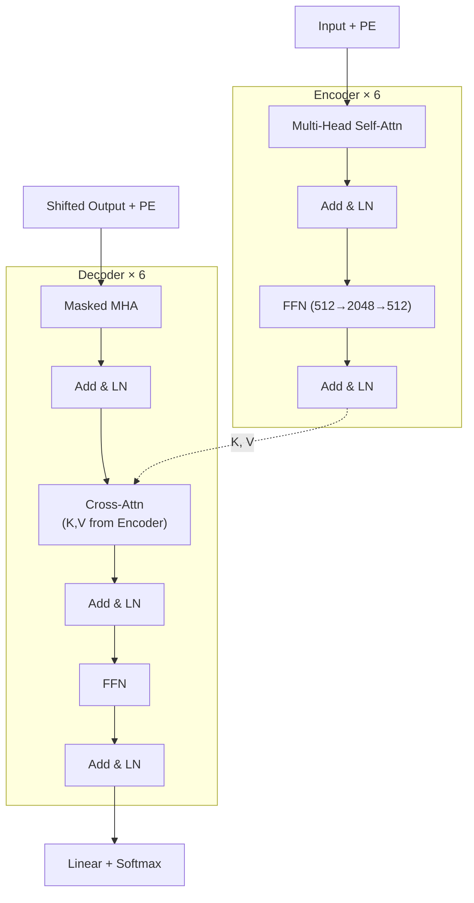

# Attention Is All You Need · 中文精读

> **原文**：Vaswani et al., NIPS 2017, arXiv:1706.03762
> **PDF**：[`../../papers/attention-is-all-you-need-1706.03762.pdf`](../../papers/attention-is-all-you-need-1706.03762.pdf)
> **配套**：[`../01_papers.md`](../01_papers.md)（速读 + Q&A 学习地图）
>
> 本文是**逐节中文化 + 重点提取**，按论文原章节顺序。每节末尾用 `> 💡 重点` 标关键 take-away。

---

## TL;DR（一段话读完整篇）

**抛弃 RNN/CNN，只用 attention 搭一个 encoder-decoder 做机器翻译**。核心创新有四个：
1. **Scaled Dot-Product Attention**：$\text{softmax}(QK^\top / \sqrt{d_k})\,V$，`/√d_k` 防止 softmax 饱和。
2. **Multi-Head Attention**：把 attention 切成 h 个并行子空间，concat 后投影回原维度。
3. **正弦位置编码（Positional Encoding）**：用 sin/cos 不同频率注入位置信息，可外推到训练未见过的长度。
4. **完全并行化**：序列内所有位置一步算完，长程依赖路径长度 O(1)。

效果：WMT14 EN-DE **28.4 BLEU**（big model），EN-FR **41.8 BLEU**，8×P100 训练 3.5 天 —— 是当时 SOTA 训练成本的几分之一。

---

## 摘要

主流的序列转换（sequence transduction）模型都是基于 RNN 或 CNN 的 encoder-decoder 架构，最好的还会通过 attention 把 encoder 和 decoder 连起来。本文提出 **Transformer**：一个**完全基于 attention 的简单网络架构**，彻底抛弃 recurrence 和 convolution。

实验结论：
- WMT 2014 英德翻译：**28.4 BLEU**，比已有最佳（含集成模型）高出 2 BLEU 以上
- WMT 2014 英法翻译：单模型 **41.8 BLEU**（SOTA），8×P100 训了 3.5 天 —— 远低于文献中最佳模型的训练成本
- 在英文成分句法分析任务上也表现良好，证明泛化能力

> 💡 **重点**：Transformer 的卖点不只是质量更高，还有**更易并行**和**训练更快**。

---

## 1 引言

RNN（特别是 LSTM/GRU）一直是序列建模和翻译的 SOTA。但 RNN 的问题是：
- **沿位置串行计算**：$h_t = f(h_{t-1}, x_t)$，本质上无法在单个样本内并行
- 序列长 → 内存约束 → batch 也开不大
- 后来工作（factorization tricks、conditional computation）能提速但没解决根本问题

Attention 早就成了序列建模的标配组件，但**几乎都和 RNN 一起用**。本文要做的：彻底抛掉 RNN，**只靠 attention** 来建模输入输出之间的全局依赖。

> 💡 **重点**：RNN 的根本问题不是"建模能力"，而是"**串行性**" → 无法并行 → 训练慢。Transformer 把这个问题一刀切掉。

---

## 2 背景

减少串行计算的尝试还有 Extended Neural GPU、ByteNet、ConvS2S（都用 CNN 作基础块），它们的问题是：**关联两个远距离位置的操作数随距离增长**（ConvS2S 线性，ByteNet 对数）。这让长程依赖更难学。

Transformer：把"两位置关联"的操作数压到 **O(1)**。代价是 attention-weighted 平均会降低分辨率，用 **Multi-Head Attention** 弥补。

**Self-attention（intra-attention）**：让序列内不同位置互相 attend 来计算自身表示。已在阅读理解、摘要、文本蕴含、句子表示等任务中验证有效。

> 💡 **重点**：Transformer 是**第一个完全基于 self-attention 计算输入输出表示**的转换模型，没有 RNN/CNN。

---

## 3 模型架构

整体仍是 encoder-decoder：
- Encoder 把输入 token 序列 $(x_1, ..., x_n)$ 映射到连续表示 $\mathbf{z} = (z_1, ..., z_n)$
- Decoder 给定 $\mathbf{z}$，**自回归**地一次生成一个输出 token，前面生成的会喂回作为输入

### 3.1 Encoder 和 Decoder 栈

**Encoder**：N=6 个相同层堆叠，每层两个子层：
1. Multi-Head Self-Attention
2. Position-wise Feed-Forward Network

每个子层外都有 **残差连接 + LayerNorm**：
$$\text{output} = \text{LayerNorm}(x + \text{Sublayer}(x))$$

为了能加残差，所有子层和 embedding 输出都用 $d_{\text{model}} = 512$。

**Decoder**：N=6 个相同层，比 encoder 多一个子层（共三个）：
1. **Masked** Multi-Head Self-Attention（防止位置 i 看到位置 >i 的信息）
2. Multi-Head Attention over encoder output（**cross-attention**，query 来自 decoder，K/V 来自 encoder）
3. Position-wise Feed-Forward Network

> 💡 **重点（GPT 视角）**：GPT 系列只用 decoder 的**第 1 和第 3 子层**（去掉中间的 cross-attention）。所以"GPT = decoder-only Transformer"指的就是这个简化。

### 3.2 Attention

**通用定义**：attention 把一个 query 和一组 key-value 对映射成一个输出，输出是 values 的加权和，权重 = `compatibility(query, key)`。

#### 3.2.1 Scaled Dot-Product Attention

输入：维度 $d_k$ 的 queries 和 keys、维度 $d_v$ 的 values。

$$\boxed{\text{Attention}(Q, K, V) = \text{softmax}\left(\frac{QK^\top}{\sqrt{d_k}}\right)V}$$

四步走（脑子里能默写）：
1. $QK^\top$：query 和所有 key 算点积 → 兼容性分数
2. $/\sqrt{d_k}$：缩放
3. softmax：归一化为权重
4. 乘 V：加权求和

**为什么除以 $\sqrt{d_k}$？**
两种最常用的 attention：additive（加性）和 dot-product（乘性）。两者复杂度差不多，但乘性能用高度优化的矩阵乘法，**更快、更省空间**。

但 $d_k$ 大时会出问题：假设 $q, k$ 各分量独立、均值 0、方差 1，则点积 $q \cdot k = \sum_{i=1}^{d_k} q_i k_i$ 的**方差是 $d_k$**。$d_k$ 越大，点积幅值越大 → softmax 进入饱和区 → **梯度极小** → 训不动。

除以 $\sqrt{d_k}$ 把方差压回 1，避免 softmax 饱和。

> 💡 **重点**：`/√d_k` 不是公式美学，是**数值稳定性 + 梯度问题**的工程修复。这是面试常考题。

#### 3.2.2 Multi-Head Attention

不在 $d_{\text{model}}$ 维上做单次 attention，而是**线性投影 h 次**到 $d_k, d_k, d_v$ 维度，并行做 h 次 attention，concat 后再投影：

$$\text{MultiHead}(Q, K, V) = \text{Concat}(\text{head}_1, ..., \text{head}_h) W^O$$
$$\text{head}_i = \text{Attention}(QW_i^Q, KW_i^K, VW_i^V)$$

本文：**h=8**，$d_k = d_v = d_{\text{model}}/h = 64$。

由于每头维度被切小（512/8=64），**总计算量 ≈ 单头满维度的 attention**，但能让模型在不同表示子空间和位置上联合 attend。

> 💡 **重点**：multi-head 跟单头**参数量相同**（$h \cdot d_k = d_{\text{model}}$）。换来的是**功能多样性**：不同头可以学到不同语法/语义关系（论文附录可视化展示了这一点）。

#### 3.2.3 Attention 在模型中的三处应用

| 位置 | Q 来自 | K, V 来自 | 作用 |
|---|---|---|---|
| **encoder-decoder attention**（decoder 中间子层） | 上一层 decoder | encoder 输出 | decoder 的每个位置能看输入序列全部 |
| **encoder self-attention** | 上一层 encoder | 上一层 encoder | encoder 内每个位置能看上一层全部位置 |
| **decoder self-attention（masked）** | 上一层 decoder | 上一层 decoder | 每个位置只能看 ≤ 自己的位置（保自回归） |

**Causal mask 的实现**：在 softmax 输入处把"非法连接"的位置设成 $-\infty$，softmax 后就变成 0 权重。

> 💡 **重点**：causal mask 是在 softmax **之前**加的（mask 成 -∞），不是 softmax 之后清零。这俩在数值上结果一样但梯度行为不同。

### 3.3 Position-wise Feed-Forward Networks

每层除了 attention，还有一个对每个位置**独立施加（不同位置共享参数）**的 FFN：

$$\text{FFN}(x) = \max(0, xW_1 + b_1)W_2 + b_2$$

即：Linear → ReLU → Linear。

- 输入输出维度 $d_{\text{model}} = 512$
- 中间隐层维度 $d_{ff} = 2048$（**4 倍扩张**）
- 不同层的参数不共享
- 等价于两个 kernel size = 1 的 1D 卷积

> 💡 **重点**：FFN 是 **4× 扩张** 的 MLP，是 Transformer 里参数量大头之一。"位置无关"指**位置间共享同一组 W**，不是参数本身和位置无关。

### 3.4 Embeddings 和 Softmax

- 用 learned embeddings 把 input/output token 转成 $d_{\text{model}}$ 维向量
- 用一个线性层 + softmax 把 decoder 输出转成下一 token 概率
- **三处权重共享**：input embedding、output embedding、pre-softmax linear 共用一个矩阵（**weight tying**）
- embedding 层会乘以 $\sqrt{d_{\text{model}}}$（拉大幅值，配合 PE）

> 💡 **重点**：weight tying（权重绑定）能省大量参数（vocab 一般几万），后续 GPT 也继承这个 trick。

### 3.5 Positional Encoding

模型没有 recurrence/convolution，**对位置信息一无所知**。需要主动注入位置信号。

本文用**正弦/余弦不同频率函数**：
$$PE_{(pos, 2i)} = \sin(pos / 10000^{2i/d_{\text{model}}})$$
$$PE_{(pos, 2i+1)} = \cos(pos / 10000^{2i/d_{\text{model}}})$$

- $pos$ = 位置，$i$ = 维度
- 不同维度对应不同波长的正弦，波长从 $2\pi$ 到 $10000 \cdot 2\pi$ 几何级数排列
- **关键性质**：对任意固定偏移 $k$，$PE_{pos+k}$ 可以表示为 $PE_{pos}$ 的**线性变换** —— 这让模型容易学相对位置关系

也试过 learned positional embedding（GPT 用的就是这个），效果几乎一样。选 sin/cos 是**因为它能外推到训练时没见过的更长序列**。

PE 直接和 input embedding **相加**（不是 concat），所以维度必须一致。

> 💡 **重点**：sin/cos PE vs learned PE 在论文里**性能近乎等同**（Table 3 row E）。GPT 选 learned PE，所以 GPT 不能直接外推到超长序列 —— 这埋了后来 RoPE/ALiBi 等长度外推技术的伏笔。

---

## 4 为什么用 Self-Attention

对比 self-attention、recurrent、convolutional 三种层映射 $(x_1,...,x_n) \to (z_1,...,z_n)$ 的能力，三个评价维度：

| 层类型 | 每层复杂度 | 串行操作数 | 最大路径长度 |
|---|---|---|---|
| **Self-Attention** | $O(n^2 \cdot d)$ | $O(1)$ | $O(1)$ |
| Recurrent | $O(n \cdot d^2)$ | $O(n)$ | $O(n)$ |
| Convolutional | $O(k \cdot n \cdot d^2)$ | $O(1)$ | $O(\log_k n)$ |
| Self-Attention（局部 r） | $O(r \cdot n \cdot d)$ | $O(1)$ | $O(n/r)$ |

三个考察点：
1. **每层总计算量**
2. **可并行的计算量**（最少串行操作数衡量）
3. **长程依赖路径长度**：信号正向 + 反向走的路径越短，越容易学长程依赖

关键观察：
- self-attention **任意两位置的路径长度恒为 O(1)** —— RNN 是 O(n)
- 当 **n < d** 时（这是 NLP 里常见情况，比如 word-piece、BPE），self-attention **比 RNN 还快**
- 长序列下可以限制只看局部 r 邻域，路径变成 O(n/r)

**附加好处**：self-attention 模型**更可解释**。论文附录展示了不同 head 学到不同的语法/语义结构（如指代消解、长距离依赖）。

> 💡 **重点**：当 **序列长度 n < 隐藏维度 d** 时，self-attention 不仅效果好，**计算量都比 RNN 小**。这是它能 scale up 的根本原因之一。

---

## 5 Training

### 5.1 数据和 Batching

- **WMT 2014 EN-DE**：~4.5M 句对，BPE，共享 vocab 37k tokens
- **WMT 2014 EN-FR**：~36M 句子，word-piece vocab 32k
- 按近似序列长度分 batch
- 每个 batch ≈ 25k source tokens + 25k target tokens

### 5.2 硬件和时长

- 8× NVIDIA P100
- **Base model**：每 step 0.4 秒，共 100k step ≈ **12 小时**
- **Big model**：每 step 1.0 秒，共 300k step ≈ **3.5 天**

### 5.3 优化器

Adam，$\beta_1 = 0.9$, $\beta_2 = \mathbf{0.98}$, $\epsilon = 10^{-9}$。

**学习率调度**（noam schedule）：
$$\text{lrate} = d_{\text{model}}^{-0.5} \cdot \min(\text{step}^{-0.5},\ \text{step} \cdot \text{warmup}^{-1.5})$$

- 前 `warmup_steps`（=4000）线性升 lr
- 之后按 step 数的 $-0.5$ 次方衰减

> 💡 **重点**：Adam 的 $\beta_2 = 0.98$（不是常用的 0.999），warmup + 平方根衰减是 Transformer 训练稳定的关键。后续 GPT 继承了 warmup + cosine decay 的做法。

### 5.4 正则化

三类正则化：
1. **Residual Dropout**：每个子层输出 dropout 后再加残差；embedding + PE 之和也 dropout。Base 用 $P_{drop} = 0.1$
2. **Label Smoothing**：$\epsilon_{ls} = 0.1$。让模型"不要太自信" → perplexity 变差但**accuracy 和 BLEU 都提升**
3. (Attention dropout 也算，Table 3 里有)

> 💡 **重点**：label smoothing 和 dropout 是 Transformer 不可或缺的两个正则化。

---

## 6 实验结果

### 6.1 机器翻译

**WMT 2014 EN-DE**（Table 2）：
- Transformer (big)：**28.4 BLEU** —— 比之前最好（含集成）高 2.0 BLEU
- Transformer (base) 已经超过所有已发表模型，且训练成本低得多

**WMT 2014 EN-FR**：
- Transformer (big)：**41.8 BLEU**（论文正文写 41.0，Table 2 是 41.8）—— 单模型 SOTA
- 训练成本不到前 SOTA 的 1/4

**推理 trick**：
- Base：取最后 5 个 checkpoint 平均（10 分钟一次）
- Big：取最后 20 个 checkpoint 平均
- Beam search：beam=4，长度惩罚 $\alpha=0.6$，max output length = input length + 50

### 6.2 模型变体（消融）

Table 3 关键发现：

| 改动 | 现象 | 启示 |
|---|---|---|
| h=1（单头） | BLEU -0.9 | 单头不如多头 |
| h 太多（如 32）| BLEU 也降 | 头数有最优值 |
| $d_k$ 缩小 | BLEU 降 | **兼容性函数**（点积）需要足够维度 |
| 模型变大 | 一般更好 | scale 有效 |
| dropout=0 | BLEU 降 | 容易过拟合 |
| sin/cos PE 换 learned PE | **几乎相同** | 两种 PE 等效（Table 3 row E） |

### 6.3 英文成分句法分析（Constituency Parsing）

为了验证 Transformer 不只是翻译专用：
- 4 层 Transformer + $d_{\text{model}}=1024$ 在 WSJ Penn Treebank（~40K 句）训练
- 没怎么调超参，**BLEU 91.3（仅 WSJ）/ 92.7（半监督）** —— 超过当时所有非 RNN-grammar 模型

> 💡 **重点**：Transformer **不专属于翻译**，能迁移到结构化输出任务。这是它后来能成为 NLP 通用骨干的关键证据。

---

## 7 结论

- 提出**首个完全基于 attention 的序列转换模型**，把 encoder-decoder 中常用的 RNN 替换成 multi-head self-attention
- 翻译任务上：训练快、效果 SOTA
- 未来工作：
  - 推广到非文本模态（图像、音频、视频）
  - 研究**局部、受限的 attention** 处理超长输入输出
  - 让生成本身**不再串行**

代码：[tensor2tensor](https://github.com/tensorflow/tensor2tensor)。

---

## 重点提取（一页流）

### 架构记忆点

### 核心公式（必背）

$$\text{Attention}(Q, K, V) = \text{softmax}\left(\frac{QK^\top}{\sqrt{d_k}}\right)V$$

$$\text{MultiHead}(Q, K, V) = \text{Concat}(\text{head}_1, ..., \text{head}_h)W^O,\quad \text{head}_i = \text{Attention}(QW_i^Q, KW_i^K, VW_i^V)$$

$$\text{FFN}(x) = \max(0, xW_1 + b_1)W_2 + b_2$$

$$PE_{(pos, 2i)} = \sin(pos / 10000^{2i/d_{\text{model}}}),\quad PE_{(pos, 2i+1)} = \cos(\cdot)$$

### Base 模型超参

| 项 | 值 |
|---|---|
| N（层数） | 6 |
| $d_{\text{model}}$ | 512 |
| $d_{ff}$（FFN 中间维度） | 2048 |
| h（头数） | 8 |
| $d_k = d_v$ | 64 |
| $P_{drop}$ | 0.1 |
| Label smoothing $\epsilon_{ls}$ | 0.1 |
| 参数量 | ~65M |
| Adam | $\beta_1=0.9, \beta_2=0.98, \epsilon=10^{-9}$ |
| Warmup | 4000 step |

Big 模型：$d_{\text{model}}=1024$, $d_{ff}=4096$, h=16, $P_{drop}=0.3$, ~213M 参数。

### 7 个最容易考的细节

1. **`/√d_k` 的原因**：防止 $d_k$ 大时点积方差爆炸 → softmax 饱和 → 梯度消失
2. **Multi-head 跟单头参数量相同**：$h \cdot d_k = d_{\text{model}}$
3. **Causal mask 在 softmax 之前**加 -∞，不是 softmax 之后清零
4. **三处 attention**：encoder self-attn / decoder masked self-attn / encoder-decoder cross-attn
5. **FFN 4× 扩张**：512 → 2048 → 512
6. **Weight tying**：input embedding、output embedding、pre-softmax linear 三处共享权重
7. **PE 选 sin/cos 不是 learned**：性能等价，但 sin/cos **可外推到更长序列**

### 与 GPT 的对比（向 nanoGPT 过渡）

| 维度 | 原始 Transformer | GPT 系列 |
|---|---|---|
| 架构 | encoder-decoder | **decoder-only**（只留 masked self-attn + FFN） |
| Cross-attention | 有 | **无** |
| 位置编码 | sin/cos | **learned PE** |
| LayerNorm | post-norm（子层之后） | **pre-norm**（子层之前，从 GPT-2 起） |
| 任务 | 翻译 | 自回归语言建模 |
| 推理 | encoder 一次性，decoder 自回归 | 全自回归 |

> 💡 **总结**：Transformer 是"架构起点"，GPT 是"砍掉一半 + 改成纯 LM"。读 nanoGPT `model.py` 时会发现：它就是 Transformer **decoder 的左半边**（mask + FFN）+ pre-norm + learned PE。

---

## 与现有学习路径的衔接

- 速读 cheat sheet：[`../01_papers.md`](../01_papers.md) §"📄 1. Attention is All You Need"
- 待回填的 Q&A：`../01_papers.md` §一（Q1.1 ~ Q1.4）
  - Q1.1 GPT 为什么是 decoder-only → 见上文"与 GPT 的对比"
  - Q1.2 `/√d_k` 是干什么的 → 见 §3.2.1 重点框
  - Q1.3 Multi-Head 为什么比单头好 → 见 §3.2.2 重点框
  - Q1.4 causal mask 在哪一步生效 → 见 §3.2.3 重点框
- 代码对应：[`../../nanoGPT/model.py`](../../nanoGPT/model.py)（`CausalSelfAttention`、`Block`、`MLP`）
