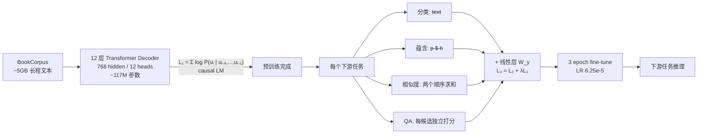

# GPT-1: Improving Language Understanding by Generative Pre-Training · 中文精读

> **原文**：Radford, Narasimhan, Salimans, Sutskever. OpenAI, 2018
> **PDF**：[`../../papers/gpt1-improving-language-understanding-by-generative-pretraining.pdf`](../../papers/gpt1-improving-language-understanding-by-generative-pretraining.pdf)
> **配套**：[`../01_papers.md`](../01_papers.md) §"📄 2. GPT-1" · [`./01-attention-is-all-you-need.md`](./01-attention-is-all-you-need.md)
>
> 本文是**逐节中文化 + 重点提取**，按论文原章节顺序。每节末尾用 `> 💡 重点` 标关键 take-away。

---

## TL;DR（一段话读完整篇）

**先用大规模未标注文本 generative pre-training 一个 Transformer decoder，再在每个下游任务上 discriminative fine-tuning** —— 这套"先生成式预训练，再判别式微调"的两阶段方法（也叫 GPT 范式）在 NLP 上首次大规模成功。

四个核心创新：
1. **架构**：12 层 decoder-only Transformer（768 维、12 头、~117M 参数）—— 把 Vaswani 2017 的 Transformer 砍掉 encoder
2. **预训练目标**：标准的因果语言建模 $L_1 = \sum_i \log P(u_i \mid u_{i-k}, ..., u_{i-1}; \Theta)$
3. **任务输入改造（traversal-style）**：把结构化输入（句对、文档+问题+答案）拼成单个 token 序列 + delimiter，**不改架构**
4. **辅助 LM loss**：fine-tune 时 $L_3 = L_2 + \lambda L_1$，提升泛化和收敛速度

效果：12 个 NLP benchmark 中 **9 个 SOTA**；GLUE 综合分 **72.8**（前最佳 68.9）；commonsense reasoning +8.9%、QA +5.7%。

---

## 摘要

NLU 涵盖文本蕴含、问答、语义相似度、文本分类等多种任务。**未标注文本语料丰富，但标注数据稀缺**，让判别式训练困难。

本文证明：**先在多样化未标注文本上做生成式预训练，再针对每个任务做判别式微调**，能带来巨大提升。和过去方法不同，我们用 **task-aware 的输入改造** 来实现迁移，对模型架构改动极小。

12 个任务里 9 个超过 SOTA，例如：
- 常识推理（Stories Cloze Test）：**+8.9%**
- 问答（RACE）：**+5.7%**
- 文本蕴含（MultiNLI）：**+1.5%**

> 💡 **重点**：GPT-1 的核心卖点是"**单一 task-agnostic 模型**胜过为每个任务专门设计的判别式模型"——预示着后来 GPT-2/3 走向"**通用语言模型**"的方向。

---

## 1 引言

NLP 的核心挑战：**有标注数据稀缺**。能从原始文本学习的方法很关键。

预训练词向量（word2vec、GloVe）证明了无监督学习有用，但只在**词层级**。要利用更高层级（句子、段落）的语义有两个难点：

1. **预训练目标该选什么？** language modeling、machine translation、discourse coherence 各有所长
2. **怎么把学到的表示迁到目标任务？** 之前方法包括：改架构、复杂学习方案、辅助目标 —— 都没有共识

本文方案：**两阶段半监督**
- **阶段 1（无监督预训练）**：在大规模未标注文本上用 LM 目标学初始参数
- **阶段 2（监督微调）**：用对应监督目标适配到目标任务

不要求目标任务和未标注语料同领域。

**架构选择**：用 Transformer，因为它能处理长程依赖（比 RNN 好），迁移性能更稳。

**迁移技巧**：用 traversal-style 把结构化输入转成连续 token 序列 —— 架构基本不动。

> 💡 **重点**：GPT-1 是**第一个把 Transformer + LM pretrain + finetune 这套范式做通**的工作。论文标题里 "**Generative** Pre-Training" 的 G 强调用**生成式（语言建模）目标**预训练，对比 BERT 后来的 masked LM。

---

## 2 相关工作（速览）

三条相关线：

1. **NLP 半监督学习**：早期用未标注数据算词/短语统计当特征；近期主流是 word embedding（word2vec、GloVe），但只到词层级。本文目标是**更高层语义**。

2. **无监督预训练**：本质是找好的初始化。早期用于图像分类、回归。近期 Dai & Le、Howard & Ruder（ULMFiT）也是 LM pretrain + finetune，但用 LSTM —— **预测能力受限于短程**。本文用 Transformer **能捕获更长程的语言结构**，且适配的下游任务范围更广。其他方法（ELMo 等）把预训练表示当**辅助特征**，要为每个任务加大量新参数；本文**只需改极少架构**。

3. **辅助训练目标**：Collobert & Weston 加各种 NLP 辅助任务；Rei 加辅助 LM 目标。本文也用辅助目标，但发现**预训练本身已经学到了任务相关的语言信息**。

> 💡 **重点**：GPT-1 vs ELMo 的关键区别——**ELMo 把预训练表示当 frozen feature**（要为每个任务设计新架构），**GPT-1 把整个预训练模型直接 fine-tune**（架构基本不动）。这是范式上的根本切换。

---

## 3 框架（核心章节）

两阶段：
1. 在大语料上学高容量语言模型
2. 在标注数据上做判别式微调

### 3.1 无监督预训练

给定无监督 token 语料 $\mathcal{U} = \{u_1, ..., u_n\}$，最大化标准 LM 似然：

$$\boxed{L_1(\mathcal{U}) = \sum_i \log P(u_i \mid u_{i-k}, ..., u_{i-1}; \Theta)}$$

- $k$ = 上下文窗口大小
- $P$ 用神经网络建模，参数 $\Theta$
- SGD 优化

模型用**多层 Transformer decoder**：

$$h_0 = U W_e + W_p$$
$$h_l = \text{transformer\_block}(h_{l-1}),\quad \forall l \in [1, n]$$
$$P(u) = \text{softmax}(h_n W_e^\top)$$

- $U = (u_{-k}, ..., u_{-1})$：上下文 token
- $n$：层数
- $W_e$：token embedding 矩阵
- $W_p$：position embedding 矩阵

注意 $P(u) = \text{softmax}(h_n W_e^\top)$ —— **input embedding 和 output projection 共享权重**（weight tying，跟 Attention 论文一致）。

> 💡 **重点**：GPT-1 用的是 **causal LM**（自回归、只看左边），不是 BERT 后来的 masked LM。这是 GPT vs BERT 最根本的差异。

### 3.2 监督微调

预训练完后，监督数据 $\mathcal{C}$：每条样本是 token 序列 $x_1, ..., x_m$ + 标签 $y$。

把输入喂进预训练模型，取**最后一个 token 的最终层激活** $h_l^m$，再接一个新的线性层 $W_y$：

$$P(y \mid x_1, ..., x_m) = \text{softmax}(h_l^m W_y)$$

监督目标：

$$L_2(\mathcal{C}) = \sum_{(x, y)} \log P(y \mid x_1, ..., x_m)$$

**辅助 LM loss**（关键 trick）：

$$\boxed{L_3(\mathcal{C}) = L_2(\mathcal{C}) + \lambda \cdot L_1(\mathcal{C})}$$

带 LM 辅助目标：
- (a) 提升监督模型的**泛化**
- (b) **加速收敛**

整个 fine-tune 阶段**新增参数只有** $W_y$ + delimiter token 的 embedding。

> 💡 **重点**：辅助 LM loss 的物理含义——**别在 fine-tune 时把 LM 能力忘了**。后来叫"continual pretraining"或对抗"catastrophic forgetting"的雏形。论文消融实验（§5）显示：**大数据集**下辅助目标有用，**小数据集**下反而可能伤害。

### 3.3 任务相关的输入改造（traversal-style）

文本分类直接 fine-tune 即可。但很多任务（QA、entailment）输入是结构化的（句对、文档+问题+答案）。

**之前做法**：在迁移表示之上学任务专用架构 —— 引入大量任务专用参数，没法迁移。
**本文做法**：把结构化输入**转成有序 token 序列**（traversal-style），加 start/end token `<s>`、`<e>` 和 delimiter `$`。

四种输入格式（论文 Figure 1 右）：

| 任务 | 输入构造 |
|---|---|
| **分类**（Classification） | `<s> text <e>` → linear |
| **文本蕴含**（Entailment） | `<s> premise $ hypothesis <e>` → linear |
| **相似度**（Similarity） | 两个序列 `<s> A $ B <e>` 和 `<s> B $ A <e>` 各自过模型，**hidden state 相加** → linear（因为相似度无序） |
| **多选 QA / 常识推理**（QA, Multiple Choice） | 每个候选答案构造一条 `<s> z; q $ a_k <e>` → 各自过模型 → softmax over choices |

> 💡 **重点**：Traversal-style 的精髓——**让预训练模型本身就能处理任意结构化输入**，靠 delimiter token 而不是改架构。这个思想到 GPT-3 的 in-context learning 推到极致：**所有任务都是"读一段文本"**。

---

## 4 实验

### 4.1 设置

**预训练数据**：BooksCorpus
- 7000+ 本未发表小说（冒险、幻想、爱情等多种类型）
- 关键：**包含长段连续文本** → 让生成模型学到长程依赖
- 替代品 1B Word Benchmark 大小相当但**句子级 shuffle**了 —— 长程结构被打散
- 在 BooksCorpus 上 token-level perplexity 低至 **18.4**

**模型超参**（必背）：

| 项 | 值 |
|---|---|
| 架构 | **12 层 decoder-only Transformer**（masked self-attention） |
| Hidden dim | **768** |
| 头数 | **12** |
| FFN 中间维度 | **3072**（4× 扩张） |
| 优化器 | Adam，max LR **2.5e-4** |
| LR 调度 | 前 2000 step 线性升 → cosine 衰减到 0 |
| 训练时长 | **100 epochs**，batch=64，序列长度 **512** |
| 权重初始化 | **N(0, 0.02)**（因为 LayerNorm 用得多） |
| Tokenizer | **BPE 40,000 merges** |
| Dropout | residual / embedding / attention 都 0.1 |
| 权重衰减 | **AdamW 风格**（modified L2，w=0.01，不作用于 bias 和 gain） |
| 激活函数 | **GELU**（不是 Vaswani 原版的 ReLU） |
| Position Encoding | **Learned PE**（不是 sin/cos） |
| 文本预处理 | ftfy 清洗 + spaCy 分词 |

**Fine-tune 超参**：
- 大部分超参沿用预训练
- 分类器加 dropout 0.1
- LR **6.25e-5**，batch size **32**
- **3 epoch 就够**（fine-tune 收敛很快）
- LR schedule：前 0.2% step warmup + 线性衰减
- 辅助 LM 权重 **λ = 0.5**

> 💡 **重点（GPT vs Vaswani 2017 的 4 个工程改动）**：
> 1. **Decoder-only**（去掉 encoder 和 cross-attention）
> 2. **Learned PE** 代替 sin/cos
> 3. **GELU** 代替 ReLU
> 4. **AdamW**（带 weight decay）代替原版 Adam
>
> 这 4 个改动后来在 GPT-2/3 都保留了。

### 4.2 监督微调（实验结果）

12 个任务里 **9 个 SOTA**。挑几个最显著的：

**自然语言推理（NLI）**：5 个数据集中 4 个 SOTA
- MNLI: +1.5%
- SciTail: +5%
- QNLI: +5.8%
- SNLI: +0.6%
- RTE 上不行（数据集只 2490 条，太小）

**问答和常识推理**：
- Story Cloze: **+8.9%**（86.5 vs 77.6）
- RACE: **+5.7%**（59.0 vs 53.3）

**语义相似度**：3 个里 2 个 SOTA
- STS-B: +1
- QQP: +4.2%

**分类**：
- CoLA（语言可接受性）：**45.4 vs 35.0**（+10.4）—— 显示模型学到了**语言学先验**
- SST-2（情感）：91.3，与 SOTA 持平

**GLUE 综合**：**72.8 vs 68.9**

> 💡 **重点**：GPT-1 在**有大量样本的任务**上爆杀（Story Cloze、QQP），在**小样本任务**（RTE 2490 条）上反而不如多任务 BiLSTM。说明 LM 预训练 + 单任务 fine-tune 还**不够 sample-efficient**——这正是 GPT-2/3 要解决的问题。

---

## 5 分析

### 迁移的层数影响（Figure 2 left）

把预训练的层逐层加到目标任务上：
- 转移 embedding 就有提升（这是已知的）
- **每加一个 Transformer 层都能继续提升**，MultiNLI 上全部转移能多 9%
- 说明**每一层都学到了下游任务有用的功能**

### 零样本行为（Figure 2 right）

为了理解"为什么 LM 预训练有效"，作者设计启发式 zero-shot 方法（**不微调**，只用预训练 LM）：

| 任务 | Zero-shot 启发式 |
|---|---|
| **CoLA**（语言可接受性） | 用平均 token log-prob 打分 + 阈值 |
| **SST-2**（情感） | 在样本后追加 `very`，限制输出只能是 `positive`/`negative`，看哪个概率高 |
| **RACE**（QA） | 给 doc+question 后，看哪个候选答案的平均 log-prob 最高 |
| **DPRD**（Winograd） | 把代词替换成两个候选 referent，看后续序列哪个 log-prob 高 |

观察：
- 这些启发式的性能**随预训练 step 数稳定上升** → 生成式预训练**确实学到了任务相关的能力**
- **LSTM 的 zero-shot 方差更大** → Transformer 的 inductive bias 更适合迁移

> 💡 **重点**：这是**第一次明确展示 LM 预训练具备 zero-shot 能力**的实验，是 GPT-2 "language models are unsupervised multitask learners" 论点的雏形。GPT-2 把这个思路推到极致：**砍掉 fine-tune，只靠 zero-shot**。

### 消融实验（Table 5）

| 配置 | Avg Score | 结论 |
|---|---|---|
| Transformer w/ aux LM（full） | **74.7** | baseline |
| Transformer **w/o pre-training** | 59.9 | **-14.8** —— 预训练贡献最大 |
| Transformer w/o aux LM | 75.0 | **小数据集上辅助 LM 反而伤害** |
| **LSTM** w/ aux LM | 69.1 | **-5.6** —— Transformer 比 LSTM 强 |

三个核心发现：
1. **预训练贡献 14.8 分**（最大）
2. **辅助 LM**：大数据集（MNLI、QQP）有用，小数据集没用甚至伤害
3. **Transformer > LSTM** 5.6 分

> 💡 **重点**：消融实验把 GPT-1 的成功**拆解**了——**预训练是大头**，**Transformer 架构 vs LSTM** 是次要因素，**辅助 LM 是边角料**。

---

## 6 结论

提出了一个**单一 task-agnostic 模型**框架：generative pre-training + discriminative fine-tuning。

通过在**长程连续文本**上预训练，模型获得了：
- **世界知识**
- **长程依赖处理能力**

然后成功迁移到 QA、相似度、蕴含、分类等任务上，12 个里 9 个 SOTA。

工作启示：
- 用无监督预训练提升判别任务确实可行
- 提示了**模型选择（Transformer）和数据特征（长程文本）**的重要性

---

## 重点提取（一页流）

### 范式记忆图

### 核心公式

**预训练（causal LM）**：
$$L_1 = \sum_i \log P(u_i \mid u_{i-k}, ..., u_{i-1}; \Theta)$$

**Fine-tune（带辅助 LM）**：
$$L_3 = L_2 + \lambda L_1,\quad \lambda = 0.5$$

**前向**：
$$h_0 = U W_e + W_p$$
$$h_l = \text{transformer\_block}(h_{l-1})$$
$$P(u) = \text{softmax}(h_n W_e^\top) \text{（weight tying）}$$

### GPT-1 关键超参（必背）

| 项 | 值 | 备注 |
|---|---|---|
| 层数 N | **12** | decoder-only |
| $d_{\text{model}}$ | **768** | |
| 头数 h | **12** | $d_k = 64$ |
| $d_{ff}$ | **3072** | 4× 扩张 |
| 参数量 | **~117M** | （论文未明写，社区通称） |
| Vocab | BPE **40k merges** | |
| 训练 | 100 epoch, batch 64, seqlen 512 | |
| Optimizer | Adam，max LR **2.5e-4**, warmup 2000 | + cosine decay to 0 |
| Init | **N(0, 0.02)** | |
| Activation | **GELU** | 不是 ReLU |
| PE | **Learned**（不是 sin/cos） | |
| Dropout | 0.1 | |
| Weight decay | AdamW 0.01 | |
| Fine-tune | 3 epoch, batch 32, LR **6.25e-5** | λ=0.5 |

### 7 个最容易考的细节

1. **GPT-1 = decoder-only Transformer**，砍掉 encoder + cross-attention
2. **预训练目标 = causal LM**（自回归，只看左边），不是 BERT 的 masked LM
3. **辅助 LM loss** $L_3 = L_2 + \lambda L_1$，λ=0.5，大数据集有用、小数据集可能伤害
4. **Traversal-style 输入改造**：用 `<s>`, `<e>`, `$` delimiter 把结构化输入拼成单序列 —— 架构基本不动
5. **GELU 代替 ReLU**，**Learned PE 代替 sin/cos**，**AdamW 代替 Adam**
6. **Weight tying**：$P(u) = \text{softmax}(h_n W_e^\top)$，input/output embedding 共享
7. **取最后一个 token 的 final hidden state** 作为分类用的句子表示（不是 mean pool 也不是 CLS）

### GPT-1 vs Attention（Vaswani 2017）

| 维度 | Vaswani 2017 | **GPT-1 2018** |
|---|---|---|
| 架构 | encoder-decoder | **decoder-only** |
| 任务 | 翻译 | LM 预训练 + 下游 fine-tune |
| 层数 | 6+6 | **12** |
| $d_{\text{model}}$ | 512 | **768** |
| 头数 | 8 | **12** |
| FFN 中间维 | 2048 | **3072** |
| Activation | ReLU | **GELU** |
| PE | sin/cos | **Learned** |
| Optimizer | Adam β₂=0.98 | **AdamW** β₂ 默认 |
| Init | Xavier-style | **N(0, 0.02)** |

### 与代码 / 学习路径的衔接

- 速读：[`../01_papers.md`](../01_papers.md) §"📄 2. GPT-1"
- Q&A：`../01_papers.md` §二（Q2.1 ~ Q2.2）
  - Q2.1 GPT-1 预训练目标是什么？为什么是"生成式"？→ §3.1（causal LM = 生成式目标）
  - Q2.2 下游任务怎么"接"GPT-1？→ §3.3（traversal-style + delimiter）
- 代码对应：[`../../nanoGPT/model.py`](../../nanoGPT/model.py) 是 GPT 的精简实现，可以对照看 12 层、768 维、12 头的搭建
- 下一篇：[`./03-gpt2.md`](./03-gpt2.md)（待写） —— 看 GPT-2 怎么把 GPT-1 scale up + 砍掉 fine-tune
