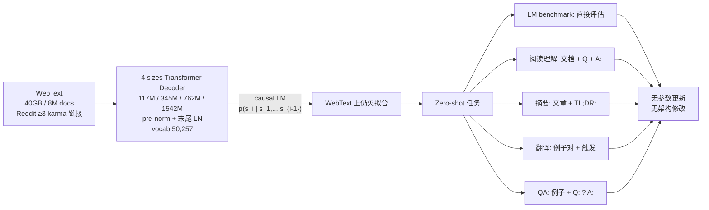

# GPT-2: Language Models are Unsupervised Multitask Learners · 中文精读

> **原文**：Radford, Wu, Child, Luan, Amodei, Sutskever. OpenAI, 2019
> **PDF**：[`../../papers/gpt2-language-models-are-unsupervised-multitask-learners.pdf`](../../papers/gpt2-language-models-are-unsupervised-multitask-learners.pdf)
> **配套**：[`../01_papers.md`](../01_papers.md) §"📄 3. GPT-2" · [`./02-gpt1.md`](./02-gpt1.md)
>
> 本文是**逐节中文化 + 重点提取**，按论文原章节顺序。每节末尾用 `> 💡 重点` 标关键 take-away。

---

## TL;DR（一段话读完整篇）

把 GPT-1 **scale up 到 1.5B 参数 + 40GB WebText 数据**，发现一个惊人现象：**根本不用 fine-tune**——只要在 prompt 里把任务用自然语言描述出来，模型就能 zero-shot 做下游任务。论文标题就是核心论点：**语言模型是无监督的多任务学习者**。

四个核心创新：
1. **数据**：自建 **WebText**（Reddit ≥ 3 karma 链接抓取的 8M 文档，40GB）—— 替代质量低的 Common Crawl
2. **Tokenizer**：**字节级 BPE**，vocab **50,257**，能编码任意 Unicode 字符串
3. **架构改动**（vs GPT-1）：**pre-norm** + 末尾额外 LayerNorm + **残差 init 缩放 1/√N** + context 1024 + batch 512
4. **范式**：**zero-shot task transfer** —— 把任务编码成 prompt，无需任何参数更新

效果：8 个 LM benchmark 中 **7 个 zero-shot SOTA**；CoQA 阅读理解 zero-shot **55 F1**（接近 4 个监督 baseline 中的 3 个，零监督样本）；模型在 WebText 上**仍然欠拟合**——预示着继续 scale 还有空间（→ GPT-3）。

---

## 摘要

NLP 任务（QA、翻译、阅读理解、摘要）通常用任务专用数据集做监督学习。本文证明：**当语言模型在新数据集 WebText（数百万网页）上训练时，开始不靠任何显式监督就学会做这些任务**。

CoQA 阅读理解：给定文档+问题，LM 生成答案达到 **55 F1**——**不用 12.7 万训练样本**就能匹配或超过 4 个监督 baseline 中的 3 个。

**模型容量是 zero-shot 任务迁移成功的关键，且呈 log-linear 提升**。最大的模型 **GPT-2（1.5B 参数）** 在 8 个 LM 数据集中 **7 个 zero-shot SOTA**，但**仍欠拟合 WebText**。生成的样本质量也证明了这点（包含连贯的段落）。

> 💡 **重点**：摘要里有两个关键 finding：(1) **scale 模型容量** → zero-shot 性能 **log-linear 提升**；(2) GPT-2 还**欠拟合 WebText** → 给后续继续 scale（GPT-3）留了空间。

---

## 1 引言

ML 系统在**训练过的任务**上很强，但**对数据分布和任务规格的微小变化非常脆弱**。当前系统更像"狭窄专家"，不是"全能选手"。我们想往**更通用**的方向走——**最终不需要为每个任务手动收集和标注数据集**。

主流范式（**单任务 + IID 测试**）在专家方向走得很好，但**caption 模型、阅读理解系统、图像分类器**在多样化输入上常表现失常，暴露了这套范式的缺陷。

**作者的怀疑**：单任务 + 单领域训练是泛化失败的主要原因。要做鲁棒系统就需要在**多领域、多任务**上训练和评估。GLUE、decaNLP 是这方向的初步尝试。

**多任务学习**有前景，但 NLP 里还很初级——目前最 ambitious 的工作只在 10-17 个 (dataset, objective) 对上训练。从 meta-learning 视角看，**每个 (dataset, objective) 对就是一个训练样本**，要泛化得好得有几百到几千个这样的"样本"——**人工设计这么多任务+数据集成本太高**。

当前最强的 NLP 系统是 **pre-train + supervised fine-tune** 这条线（趋势是迁移越来越灵活）：
1. word vector → 任务专用架构（word2vec, GloVe）
2. 上下文化的 RNN 表示（CoVe, ELMo）
3. 不再需要任务专用架构，**迁移多个 self-attention block 就够**（GPT-1, BERT）

这些方法**仍要监督训练才能完成任务**。当监督数据极少或没有时，另一条线展示了 LM 直接做任务的潜力（commonsense reasoning, sentiment analysis）。

**本文的工作**：把这两条线连起来——**LM 可以在 zero-shot 设置下完成下游任务，无需任何参数或架构修改**。

> 💡 **重点**：GPT-2 的核心论点——**LM 本身就是无监督多任务学习器**。从 GPT-1 的"预训练当初始化、要 fine-tune"过渡到"**预训练就够了，prompt 即任务规约**"。这是范式跳跃。

---

## 2 方法（核心章节）

核心是**语言建模**。LM 通常被表达为从样本 $(x_1, x_2, ..., x_n)$（每个是变长 token 序列）中做无监督的分布估计。语言天然有顺序，常分解为条件概率乘积：

$$p(x) = \prod_{i=1}^n p(s_i \mid s_1, ..., s_{i-1})$$

这种分解既能采样、也能估计任意条件概率 $p(s_{n-k}, ..., s_n \mid s_1, ..., s_{n-k-1})$。Transformer 这类 self-attention 架构大幅提升了对这些条件概率的建模能力。

**关键转折——把任务也编码进 prompt**：

学习单个任务可以表达为估计 $p(\text{output} \mid \text{input})$。但通用系统对**同样的 input 应该能做不同 task**，所以应该建模 $p(\text{output} \mid \text{input}, \text{task})$。

过去的多任务/元学习是怎么实现 task conditioning 的？要么**架构层级**（任务专用 encoder/decoder），要么**算法层级**（MAML 的内外循环）。

**MQAN（McCann 2018）**展示了：**语言本身就是一个灵活的方式来同时指定 task、input、output**。比如：
- 翻译训练样本可以写成 `(translate to french, english text, french text)`
- 阅读理解可以写成 `(answer the question, document, question, answer)`

**关键观察**：语言建模**原则上可以学会** McCann 2018 的所有任务——**不需要显式监督哪些 token 是输出**。因为：

$$\text{监督目标} = \text{无监督目标 在序列子集上的评估}$$

$$\Rightarrow \text{无监督目标的全局最优} = \text{监督目标的全局最优}$$

问题转化为：**实际上能不能把无监督目标优化到收敛？** 初步实验确认：**足够大的 LM 在这种 toy setup 下能做多任务，只是比监督方法慢**。

**核心猜想**：**容量足够大的 LM** 为了更好地预测自然语言序列，**会学会推断和执行序列中所演示的任务**——不管这些任务是怎么获取的。这就等价于**做无监督多任务学习**。本文通过**zero-shot 评估**来检验这个猜想。

> 💡 **重点**：GPT-2 最核心的思想就这个公式——$p(\text{output} \mid \text{input}, \text{task})$。**任务用自然语言描述并放进 prompt 里**，LM 自然会学会"看懂任务再回答"。这是 in-context learning 的雏形（GPT-3 把它推到极致）。

### 2.1 训练数据

**目标**：尽量大、尽量多样的语料 → 收集"自然出现的任务演示"。

**Common Crawl 不行**：内容大量"无法理解"。Trinh & Le 2018 用过，但**只取了和目标任务（Winograd）最相似的子集** —— 这违背了"不假设下游任务"的初衷。

**WebText 怎么造的**（关键）：
- 只爬**人类筛过**的网页
- 起点：抓 Reddit 上**至少 3 karma** 的所有外链（用 karma 作为"有趣/教育/有意义"的启发式信号）
- 4500 万链接 → 用 Dragnet + Newspaper 抽 HTML 文本
- 截止 2017 年 12 月，去重后剩 **8M+ 文档，40GB 文本**
- **去掉所有 Wikipedia 文档**（避免和测试集重叠）

WebText 里**自然包含很多任务演示**——Table 1 展示了英法翻译"自然出现"的例子（人在小说/博客里直接写双语对照）。

> 💡 **重点**：WebText 的设计哲学——**不为任何下游任务定制数据**，靠 Reddit karma 当人工筛选的代理。这种"自然出现的任务示例"是 LM 能 zero-shot 做翻译的根本原因（虽然论文专门 filter 掉了非英文，但 WebText 仍混了 ~10MB 法语，足够学）。

### 2.2 输入表示（字节级 BPE）

**目标**：通用 LM 应该能给**任意字符串**赋概率（也能生成）。但当前 LM 普遍有 lowercase / tokenize / OOV 等预处理 → **限制了能建模的字符串空间**。

**直接用 UTF-8 字节序列**（byte-level）能优雅满足这个要求，但**字节级 LM 在大数据集上比 word-level LM 差**（OBW benchmark 上观察到的差距）。

**BPE（Byte-Pair Encoding）** 是 char 和 word 的实用折中：
- 频繁的符号序列 → 像 word-level（整词一个 token）
- 罕见的符号序列 → 像 char-level（拆成更小单元）

**问题**：标准 BPE 操作的是 **Unicode code points**（不是 byte），要建模所有 Unicode 串得包含 13 万+ 基础字符 —— 远超常用 vocab 的 32k-64k。

**字节级 BPE** 只需 **256 个基础字符**（字节）。但直接用又有问题：BPE 用贪心的频率启发式，会把常见词的多个变体（`dog.` `dog!` `dog?`）当不同 token —— **浪费 vocab 名额**。

**GPT-2 的修复**：
- **禁止 BPE 跨字符类别 merge**（字母不能和标点 merge）
- **空格例外**（保留压缩效率，避免词被空格切碎）

最终 vocab：**50,257**（256 字节 + 50,000 BPE merges + 1 个 `<|endoftext|>`）。

**好处**：能给**任意 Unicode 字符串**赋概率 → 可以在**任何数据集**上评估（不受预处理/tokenization/vocab 大小限制）。

> 💡 **重点**：字节级 BPE 是 GPT-2 的工程关键之一——**vocab 50,257 → "无 OOV" 通用 LM**。后来所有 GPT 模型（GPT-3、GPT-4、ChatGPT）都用这个 vocab。**nanoGPT** 默认 tokenizer 也是这个。

### 2.3 模型

模型基于 Transformer，**大体沿用 GPT-1**，但有几个修改：

| 改动 | GPT-1 | **GPT-2** |
|---|---|---|
| **LayerNorm 位置** | post-norm（子层之后） | **pre-norm**（子层之前，类似 pre-activation ResNet） |
| **末尾 LayerNorm** | 无 | **多加一个**（在最后一个 self-attention block 之后） |
| **残差初始化** | 标准 N(0, 0.02) | 残差层权重**额外缩放 1/√N**（N = 残差层数） |
| **Vocab** | 40,000 | **50,257**（字节级 BPE） |
| **Context 长度** | 512 | **1024** |
| **Batch size** | 64 | **512** |

为什么这些改动有用：
- **Pre-norm**：残差路径上没 LN，梯度直通 → **训更深的模型更稳**
- **末尾 LN**：避免最后一层输出尺度过大
- **残差 init 缩放 1/√N**：累积深度时残差路径方差被压住 → 深模型可控

**4 个模型 size**（Table 2，必背）：

| 参数量 | 层数 N | $d_{\text{model}}$ |
|---|---|---|
| **117M**（≈ GPT-1） | 12 | 768 |
| **345M**（≈ BERT-large） | 24 | 1024 |
| **762M** | 36 | 1280 |
| **1542M（GPT-2）** | 48 | 1600 |

LR 在 5% held-out WebText 上手动调，**所有模型都还在欠拟合 WebText**（held-out perplexity 还在持续改善，给更多训练时间还能更好）。

> 💡 **重点（必背）**：GPT-2 vs GPT-1 的 6 个工程改动——**pre-norm + 末尾 LN + 残差 init 1/√N + 字节级 BPE vocab 50257 + context 1024 + batch 512**。这套配置后来 GPT-3、LLaMA、几乎所有现代 decoder LM 都继承。**nanoGPT 的 model.py 实现的就是这套**。

---

## 3 实验

四个 size 都用 log-uniform 间隔训练。**最小**等于原 GPT-1，**第二小**等于 BERT-large，**最大**（GPT-2）比 GPT-1 大 10 倍。

### 3.1 语言建模（zero-shot 域迁移）

**第一个 zero-shot 实验**：在 WebText 上训练的 LM，能不能 zero-shot 在**其他 LM benchmark** 上跑？

由于模型工作在字节级，**不需要任何 lossy 预处理或 tokenization** → 可以在任何 LM benchmark 上直接评估。

**挑战**：很多 benchmark 做了激进的标准化（断开标点、缩写处理、句子打乱、`<UNK>` token 等）—— WebText 里几乎没这些。`<UNK>` 在 40 亿 byte 中**只出现 26 次**！

**对策**：用**可逆 de-tokenizer** 移除这些预处理 artifact（仍能算 log-prob，相当于一种简单的领域适配）。带 de-tokenizer 后 GPT-2 perplexity 提升 **2.5~5**。

**结果（Table 3，必看）**：8 个数据集中 **7 个 zero-shot SOTA**（不训不微调）。

**特别值得注意**：
- **小数据集**（PTB、WikiText-2，仅 1-2M token）提升巨大 —— LM 自带的语言知识比"在小语料上从头学"强得多
- **长程依赖数据集**（LAMBADA、CBT）提升巨大 —— 因为 WebText 含长程文本
- **1BW**：GPT-2 仍**不如**之前 SOTA —— 因为 1BW 做了句子级 shuffle，**长程结构被破坏**，且数据集太大

> 💡 **重点**：GPT-2 在小数据集上提升爆炸（PTB perplexity 65.85 → 35.76），说明**预训练把语言通识学好了**，下游小语料只是用来"调专域风格"——这预示了后续 LLM 时代"大模型 + 小 prompt"的范式。

### 3.2-3.4 阅读理解 / 长程依赖 / 常识

**Children's Book Test (CBT)**：cloze 测试（10 选 1 预测被挖掉的词）。GPT-2 在 common nouns **93.3%**，named entities **89.1%**——接近人类水平。

**LAMBADA**：要求 50+ token 上下文才能预测最后一个词，专测长程依赖。
- 之前 SOTA：99.8 perplexity / 19% accuracy
- GPT-2：**8.6 perplexity / 52.66% accuracy**（perplexity 量级跳变！）
- 加 stop-word filter：**63.24% accuracy**（前 SOTA +4%）

**Winograd Schema**：常识推理（指代消解）。GPT-2 **70.70%**（前 SOTA +7%）。但数据集仅 273 例，结果要谨慎。

> 💡 **重点**：LAMBADA perplexity 从 99.8 跳到 8.6 是这篇论文最震撼的数字之一——**容量 + 数据规模带来的提升不是线性的，是数量级的**。

### 3.5 阅读理解（CoQA）

CoQA：7 个领域文档 + 多轮对话式问答（要利用对话历史）。

**Greedy decoding**，prompt 是 `document + dialogue history + "A:"` → GPT-2 **55 F1**（dev set）。

对比：
- 监督 SOTA（BERT）：~89 F1（接近人类水平）
- 4 个监督 baseline 中 **3 个不如 GPT-2** —— 而 GPT-2 用了 **0** 训练样本，baseline 用了 **127k+**

但作者警告：**GPT-2 的回答常用简单的检索启发式**（如"who"问题就从文档里找名字）。

### 3.6 摘要

prompt 是 `article + "TL;DR:"`，用 top-k=2 sample 100 token，取前 3 句作摘要。

ROUGE 分数仅勉强超过"随机选 3 句"baseline。**去掉 "TL;DR:" hint 后下降 6.4 分** —— 说明**自然语言 hint 真的能触发任务专用行为**。

### 3.7 翻译

prompt 用 example pair 格式：`"english = french\n english = french\n english ="` → greedy decode。

- WMT-14 EN→FR：**5 BLEU**（不如词典查找）
- WMT-14 FR→EN：**11.5 BLEU**（GPT-2 强大的英文 LM 帮上忙了；但还远不如 SOTA 33.5）

**惊人之处**：作者**故意 filter 了 WebText 的非英文页面**，只剩 ~10MB 法语（比常用法语单语料库小 ~500 倍）—— 用这么少法语就能学到**有意义的翻译能力**。

### 3.8 问答

prompt 用 example QA 对引导。**Natural Questions** exact match：**4.1%**（最小模型 < 1%；GPT-2 是 5.3 倍）。

**最 confident 的 1% 问题上 accuracy 63.1%** —— 概率校准还可以。

仍远不如混合检索 + 抽取式 QA 的 30-50%。

> 💡 **重点（zero-shot 工程模式）**：GPT-2 解决下游任务的统一模式 = "**任务 hint + 例子 + 待解决输入 + 触发 token**"。
> - 摘要：`article + "TL;DR:"`
> - 翻译：`"en1 = fr1\nen2 = fr2\nen3 ="`
> - QA：`example QA pairs + "Q: ? A:"`
>
> **这就是 in-context learning 的雏形**。GPT-3 之后 few-shot prompt 就是把这个推到极致。

---

## 4 泛化 vs 记忆

CV 领域已发现常见数据集有不少**近似重复**（CIFAR-10 train-test 重叠 3.3%）→ 高估泛化性能。WebText 这么大、还是网页爬来的，重叠风险更高。

**做法**：用 **Bloom filter** 存 WebText 训练集的 **8-gram**（false positive rate ≤ 1/10⁸），统计各测试集和 WebText train 的重叠率。

**Table 6 关键发现**：
- 常见 LM 测试集和 WebText train 重叠 **1-6%**（平均 3.2%）
- 但**这些数据集自己的 train-test 重叠还更高**，平均 **5.9%**！1BW 自身重叠 **13.2%**

**结论**：WebText 和测试集的重叠**给报告结果带来微小但一致的好处**，但**不比标准 train-test 重叠更严重**。

**另一个角度——看 WebText 自己的 held-out set**：训练集和测试集 perplexity **共同改善**（Figure 4），说明 **GPT-2 还在欠拟合 WebText**——不是靠记忆训练集。

> 💡 **重点**：作者主动做了重叠分析，承认有数据污染但量化了它的影响。这种透明度在大模型论文里很重要——**很多 benchmark 自身的 train/test 污染就比和 WebText 的重叠更高**。

---

## 5-6 相关工作 & 讨论

主要相关工作：
- **Jozefowicz 2016**：scale RNN LM 到 1B Word —— 类似的 scaling
- **Hestness 2017**：empirical scaling laws —— 本文实验在 1B+ 参数上仍符合趋势
- **Karpathy 2015**：RNN LM 内部 cell 自动学到行宽追踪、引号检测等"功能"——本文展示更宏大的版本

**讨论核心要点**：
- **无监督任务学习**是 promising 的研究方向，可以帮助解释为什么 pretrain 这么有效——**极限情况下，pretrain 本身就开始学会做任务**
- 阅读理解上 zero-shot GPT-2 与监督 baseline 竞争；摘要等任务**质性上能做**但量化指标还很弱
- **实用上 GPT-2 的 zero-shot 仍远不可用**
- **fine-tune 后的天花板还不清楚**——后续会研究 GPT-2 在 GLUE / decaNLP 上 fine-tune 的表现，**特别是看单向表示能否克服 BERT 双向表示的优势**

## 7 结论

**当 LM 在足够大且足够多样的数据集上训练，它能在很多领域和数据集上表现良好**。GPT-2 在 8 个 LM 数据集中 **7 个 zero-shot SOTA**。

**模型在 zero-shot 设置下展示的任务多样性表明：高容量模型在最大化文本似然的过程中，开始学会做大量任务，无需显式监督**。

> 💡 **重点**：GPT-2 论文最后一句是后续整个 LLM 时代的宣言——**"trained to maximize the likelihood of a sufficiently varied text corpus begin to learn how to perform a surprising amount of tasks without the need for explicit supervision"**。这就是 LLM 涌现能力的预言。

---

## 重点提取（一页流）

### 范式记忆图

### 核心思想（一句话）

$$p(\text{output} \mid \text{input}, \mathbf{task})$$

把任务用**自然语言**编码进 prompt，LM 在足够大且多样的数据上训练后，**自动学会条件化于任务**。

### GPT-2 关键超参（必背）

| 项 | GPT-1 | **GPT-2 (1.5B)** | 说明 |
|---|---|---|---|
| 层数 | 12 | **48** | |
| $d_{\text{model}}$ | 768 | **1600** | |
| 头数 h | 12 | 25 | $d_k$ = 64 |
| 参数量 | 117M | **1.5B** | ~13× |
| **LayerNorm 位置** | post-norm | **pre-norm** | 训深模型更稳 |
| **末尾 LN** | 无 | **有** | |
| **残差 init** | N(0, 0.02) | N(0, 0.02) **再 × 1/√N** | 控深度方差 |
| **Vocab** | BPE 40k (Unicode-based) | **字节级 BPE 50,257** | 通用 |
| **Context** | 512 | **1024** | |
| Batch | 64 | **512** | |
| 数据 | BookCorpus 5GB | **WebText 40GB** | 8× |

### 7 个最容易考的细节

1. **GPT-2 = scaled-up GPT-1 + 几个工程改动**，没有架构层面的根本创新
2. **Pre-norm**（vs GPT-1 的 post-norm）—— 残差路径直通，深模型训练稳
3. **末尾额外加一个 LayerNorm** —— 论文专门提了
4. **残差权重 init × 1/√N**（N 是残差层数）—— 控制深度累积方差
5. **字节级 BPE，vocab 50,257** —— 256 字节 + 50,000 merges + 1 个 `<|endoftext|>`
6. **Context 1024**（GPT-1 是 512） + batch 512（GPT-1 是 64）
7. **核心论点**：$p(\text{output} \mid \text{input}, \text{task})$ —— task 用自然语言放进 prompt，LM 自然学会条件化

### Zero-shot prompt 模板速查（GPT-2 时代）

| 任务 | Prompt 形式 |
|---|---|
| LM benchmark | 直接喂数据集，算 perplexity / accuracy |
| 阅读理解（CoQA） | `document + history + "A:"` → greedy decode |
| 摘要（CNN/DM） | `article + "TL;DR:"` → top-k=2 sample 100 tokens |
| 翻译（WMT） | `"en = fr\n en = fr\n en ="` → greedy decode |
| QA（NaturalQ） | `example QA 对 + "Q: ... A:"` → 看生成 |
| Winograd | 把代词换成两个候选，看哪个续写 log-prob 高 |

### GPT-1 → GPT-2 → GPT-3 演化轴

| 维度 | GPT-1 (2018) | **GPT-2 (2019)** | GPT-3 (2020) |
|---|---|---|---|
| 参数量 | 117M | **117M ~ 1.5B** | 125M ~ **175B** |
| 数据 | BookCorpus 5GB | **WebText 40GB** | CC + WebText2 + Books + Wiki ~570GB |
| 范式 | pretrain + **fine-tune** | pretrain + **zero-shot prompt** | pretrain + **few-shot in-context** |
| LayerNorm | post-norm | **pre-norm + 末尾 LN** | 同 GPT-2 |
| Vocab | BPE 40k | **字节级 BPE 50,257** | 同 GPT-2 |
| Context | 512 | **1024** | 2048 |
| 任务实现 | 加任务专用 head + traversal 输入 | **任务编码进 prompt** | **few-shot examples 进 prompt** |
| 关键 take-away | 大模型 + 迁移学习好用 | **scale 起来不需要 fine-tune** | scale 到 175B，**few-shot 涌现** |

### 与代码 / 学习路径的衔接

- 速读：[`../01_papers.md`](../01_papers.md) §"📄 3. GPT-2"
- Q&A：`../01_papers.md` §三（Q3.1 ~ Q3.3）
  - Q3.1 GPT-2 砍掉 fine-tune，zero-shot 怎么做下游 → §2 + §3 prompt 模板速查
  - Q3.2 GPT-2 vs GPT-1 架构差别 → §2.3 + 7 个考点的 #2-#6
  - Q3.3 BPE 的折中 → §2.2 字节级 BPE
- 代码对应：[`../../nanoGPT/model.py`](../../nanoGPT/model.py) **就是 GPT-2 架构**（pre-norm + 末尾 LN + 残差 init 1/√N + vocab 50257）—— 写完这篇笔记后回头读代码，会一一对应
- 上一篇：[`./02-gpt1.md`](./02-gpt1.md)
- 下一篇：[`./04-gpt3.md`](./04-gpt3.md)（待写） —— 看 GPT-3 怎么把 GPT-2 scale 100×，让 in-context learning 涌现
