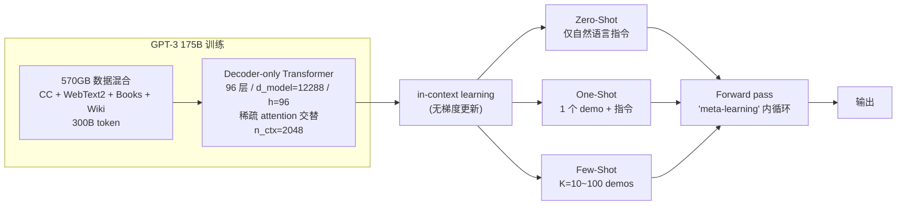

# GPT-3: Language Models are Few-Shot Learners · 中文精读

> **原文**：Brown, Mann, Ryder, Subbiah, et al. OpenAI, NeurIPS 2020. arXiv:2005.14165
> **PDF**：[`../../papers/gpt3-language-models-are-few-shot-learners-2005.14165.pdf`](../../papers/gpt3-language-models-are-few-shot-learners-2005.14165.pdf)
> **配套**：[`../01_papers.md`](../01_papers.md) §"📄 4. GPT-3" · [`./03-gpt2.md`](./03-gpt2.md)
>
> 本文是**逐节中文化 + 重点提取**，按论文原章节顺序。每节末尾用 `> 💡 重点` 标关键 take-away。
>
> **注**：原论文 75 页，含大量 benchmark 细节。本笔记按 `01_papers.md` 速读策略**只精读 §1 / §2 / §3 选段 / §5 Limitations**，跳过大部分 §3.x 单任务结果。

---

## TL;DR（一段话读完整篇）

把 GPT-2 **scale 100×（1.5B → 175B）+ 数据扩到 ~570GB**，发现一个全新的范式：**few-shot in-context learning** —— 在 prompt 里给几个 demo（10~100 个），**不更新任何参数**，模型就能执行新任务，且效果**接近甚至超过**专门 fine-tune 的 SOTA。

四个核心创新：
1. **规模**：175B 参数（比 GPT-2 大 116×），8 个 size 训练曲线验证 [Kaplan 2020] 的 **scaling laws** 在 1B+ 参数下仍成立
2. **范式**：**in-context learning** —— 区分 **zero-shot / one-shot / few-shot** 三种模式，**无梯度更新**
3. **数据**：5 个语料混合（Common Crawl + WebText2 + Books1/2 + Wikipedia），共 **300B token**；按"质量加权采样"（不按 size 比例）
4. **架构**：基本沿用 GPT-2，加了 **稀疏注意力**（dense 和 locally-banded sparse 交替）；context 扩到 **2048**

效果：
- TriviaQA few-shot **71.2%**（超过 fine-tuned 开放域 SOTA）
- LAMBADA few-shot **86.4%**（前 SOTA +18%）
- CoQA few-shot **85.0 F1**（接近人类 89）
- 但在 ANLI、WiC、RACE、QuAC 上 **few-shot 接近随机** —— 暴露 GPT-3 弱点
- 175B 在 WebText 上**仍欠拟合**（按 Chinchilla 反推欠训练 ~13×）

> 💡 **TL;DR 重点**：GPT-3 不是新架构，是 **scaling 假说的实证**——**容量 + 数据足够大时，in-context learning 涌现**。这是后续 LLM 时代（ChatGPT、GPT-4）的范式起点。

---

## 摘要

最近的工作证明：**大语料 pre-train + 任务专用 fine-tune** 在 NLP 上有巨大提升。虽然架构是 task-agnostic 的，**仍要数千到数万个任务专用样本**做 fine-tune。

而**人类**只要看几个例子或简单指令就能学会新任务——当前 NLP 系统做不到。

本文展示：**scale up LM 能极大提升 task-agnostic 的 few-shot 性能**，有时**和之前 fine-tune SOTA 竞争**。具体做法：训练 **175B 参数的自回归 LM（GPT-3）**，比之前最大的非稀疏 LM 大 10×，在 few-shot 设置下评估。

**对所有任务，GPT-3 不做任何梯度更新或 fine-tune**，任务和 demo 全靠**文本交互**给模型。

效果：
- 在翻译、QA、cloze 等多种 NLP 数据集上表现强
- 在需要**实时推理 / 域适配**的任务（解扰乱字母、新词造句、3 位数算术）也能做
- 也指出了 few-shot 仍困难的数据集
- **GPT-3 生成的新闻文章人类难以分辨真伪**（讨论了社会影响）

> 💡 **重点**：摘要里的两个关键现象——(1) **scale up → few-shot 性能跃升**；(2) GPT-3 能做"训练时没显式见过"的新任务（数字算术、新词造句）。

---

## 1 引言

NLP 趋势：从 word vectors → contextual RNN → pretrained Transformer fine-tune。**最后这步极大推进了 SOTA**，但有个根本限制：**架构通用了，但仍需任务专用数据集和 fine-tune**——通常要几千到几十万样本。

为什么这是问题？三个原因：

1. **实用角度**：每个新任务都要大量标注样本 → 限制 LM 应用范围。NLP 任务千变万化（改语法、举例、评论小说），收集大监督数据集太贵。

2. **泛化角度**：fine-tune 范式让模型**很大**（吸收预训练信息）但**在窄分布上微调** → 容易学到 spurious correlation，OOD 泛化差。在 benchmark 上的"超人"成绩可能**夸大**真实能力。

3. **人类对比**：人不需要大监督数据集——**一句指令**（"判断这句话是高兴还是悲伤"）或**几个例子**就够。这种适应能力让人能无缝混合任务（对话中做加法）。

**一种可能的解决路径——meta-learning**（图 1.1）：
- 训练时学**广泛的技能和模式识别能力**
- 推理时**快速适应或识别**目标任务
- 论文用术语 **"in-context learning"** 描述这个内循环：**LM 的文本输入本身就是任务规约**

GPT-2 试过这条路但效果远不及 fine-tune（Natural Questions 4%，CoQA 55 F1 落后 SOTA 35 分）。

**另一条线——LM 容量持续增长**：100M → 300M → 1.5B → 8B → 11B → 17B。每次 scale up 都带来下游任务提升。**[Kaplan 2020] 表明 log loss 和 scale 呈平滑幂律**。既然 in-context learning 要把"很多技能和任务"塞进参数，**它的能力可能也随 scale 强烈增长**。

**本文方法**：训 **175B 参数 GPT-3**，在 24+ 数据集和几个新设计任务上测 in-context learning。每个任务测 3 种条件：
- **few-shot (FS)**：给 K 个 demo（10~100，能塞进 context window）
- **one-shot (1S)**：给 1 个 demo
- **zero-shot (0S)**：只给一句自然语言指令

**关键发现（Figure 1.2 / 1.3）**：
- 加自然语言任务描述 → 性能提升
- 加 in-context 例子（K 增大）→ 性能提升
- **模型越大，in-context learning 曲线越陡**（少 shot 改善越大）—— **scale 让模型更擅长 meta-learning**

> 💡 **重点（必背）**：GPT-3 论文的脚注里有个**重要术语澄清**——"zero-shot" 在 LM 语境下有歧义：**"zero-shot" 意思是"无梯度更新"**，不是"零样本"。论文用 **meta-learning** 描述整体方法的**内外循环结构**，**in-context learning** 描述内循环（一次 forward pass 内的"学习"）。zero/one/few-shot 区别只在**给几个 demo**。

---

## 2 方法（核心章节）

整体方法和 GPT-2 类似，**直接把 model size、dataset size 和 diversity、训练长度都 scale up**。in-context learning 的用法也和 GPT-2 类似，但本文**系统地探索了不同 setting**。

四种设置（Figure 2.1）按"依赖任务专用数据多少"排：

| 设置 | 说明 | 梯度更新? | 例子数 |
|---|---|---|---|
| **Fine-tuning (FT)** | 在任务专用监督数据上更新权重 | ✅ | 数千到数十万 |
| **Few-Shot (FS)** | K 个 demo 当 conditioning，**只 forward** | ❌ | K=10~100（塞进 context window n_ctx=2048） |
| **One-Shot (1S)** | 1 个 demo + 任务自然语言描述 | ❌ | 1 |
| **Zero-Shot (0S)** | 只有自然语言指令 | ❌ | 0 |

为什么区分 1S 和 FS/0S？因为 **1S 最贴近人怎么沟通任务**（如 Mechanical Turk 给标注员通常给 1 个示例）。

**论文重点**：FS 和 SOTA fine-tune 经常只差一点；1S 甚至 0S 是**最公平的人类对比**，是未来重要目标。**论文不 fine-tune GPT-3**（虽然原则上可以）—— focus 在 task-agnostic 性能。

> 💡 **重点（必背）**：GPT-3 范式下的 **K 限制由 context window 决定**——n_ctx = 2048 token，所以 K 通常 10~100。这是后来 RAG、long-context model 等技术的源头动机。

### 2.1 模型与架构

**和 GPT-2 完全一样**（pre-norm、reversible tokenization、改进的 init），**只有一个改动**：层之间**交替使用 dense attention 和 locally-banded sparse attention**（参考 [Sparse Transformer, Child 2019]）。

**8 个 size**（Table 2.1，必看）：

| 名称 | 参数量 | 层数 | $d_{\text{model}}$ | 头数 | $d_{\text{head}}$ | Batch (token) | Max LR |
|---|---|---|---|---|---|---|---|
| GPT-3 Small | 125M | 12 | 768 | 12 | 64 | 0.5M | 6.0e-4 |
| GPT-3 Medium | 350M | 24 | 1024 | 16 | 64 | 0.5M | 3.0e-4 |
| GPT-3 Large | 760M | 24 | 1536 | 16 | 96 | 0.5M | 2.5e-4 |
| GPT-3 XL | 1.3B | 24 | 2048 | 24 | 128 | 1M | 2.0e-4 |
| GPT-3 2.7B | 2.7B | 32 | 2560 | 32 | 80 | 1M | 1.6e-4 |
| GPT-3 6.7B | 6.7B | 32 | 4096 | 32 | 128 | 2M | 1.2e-4 |
| GPT-3 13B | 13.0B | 40 | 5140 | 40 | 128 | 2M | 1.0e-4 |
| **GPT-3 175B** | **175.0B** | **96** | **12288** | **96** | **128** | **3.2M** | **0.6e-4** |

注意几个规律：
- **越大 → batch 越大 + LR 越小**（[Kaplan 2020] / [McCandlish 2018] 的发现）
- $d_{ff} = 4 \cdot d_{\text{model}}$（FFN 4× 扩张，沿用 Vaswani 2017）
- **所有模型 context 都是 2048**（GPT-2 是 1024，再扩 2×）
- **所有模型都训了 300B token**

> 💡 **重点（必背）**：**GPT-3 Small (125M) ≈ GPT-1 (117M)**，**GPT-3 XL (1.3B) ≈ GPT-2 (1.5B)**。这个对应关系帮你记忆 GPT 系列规模。

### 2.2 训练数据

数据集快速膨胀，到 **Common Crawl** 几乎万亿词。但 raw / 轻 filter 的 CC **质量低**。三步处理：

1. **Filter CC**：和高质量 reference 语料的相似度做过滤
2. **fuzzy 去重**（文档级、跨数据集）→ 保护 held-out validation 的纯净
3. **添加高质量 reference 语料**：**WebText2**（GPT-2 WebText 的扩展版）、**Books1**、**Books2**、**Wikipedia**

**最终数据混合**（Table 2.2，必看）：

| 数据集 | 容量（token） | 训练混合权重 | 训 300B token 时遍历次数 |
|---|---|---|---|
| Common Crawl (filtered) | **410B** | 60% | 0.44 |
| WebText2 | 19B | 22% | **2.9** |
| Books1 | 12B | 8% | **1.9** |
| Books2 | 55B | 8% | 0.43 |
| Wikipedia | 3B | 3% | **3.4** |

**关键技巧**：**采样不按数据集大小，按质量加权** → 高质量数据集（Wikipedia、WebText2）多遍历 2-3 次，CC 不到 1 次。**容忍小量过拟合换取整体训练数据质量**。

**数据污染**：作者尝试移除 dev/test 与训练集的重叠，但有 bug 漏了一些。重训成本太高没法补救——§4 专门量化了影响。

> 💡 **重点**：GPT-3 的数据策略**两条核心 trick**——(1) **质量加权采样**（不是 size 比例）；(2) **WebText2 + Books + Wiki 多遍历，CC 少遍历**。这个数据混合配方后来成了 LLaMA、PaLM 等模型的参考。

### 2.3 训练过程

- **大模型 → 大 batch + 小 LR**（[Kaplan 2020] / [McCandlish 2018]）
- 用 **gradient noise scale** 指导 batch size 选择
- **混合并行**：matrix-multiply 内的模型并行 + 跨层模型并行
- 硬件：**Microsoft 提供的 V100 高带宽集群**

### 2.4 评估

- 从任务训练集随机抽 K 个 demo 当 conditioning（用 1-2 个 newline 分隔）
- LAMBADA / Storycloze 没监督训练集 → 从 dev 抽 demo，test 评估
- **多选题**：给 K 个 (context, completion) 对，再给一个 context，比较各 completion 的 LM likelihood
  - 一般用 per-token likelihood（length 归一）
  - ARC / OpenBookQA / RACE 上额外用 $P(\text{completion} \mid \text{context}) / P(\text{completion} \mid \text{"Answer:"})$ 归一
- **二分类**：用语义化标签（"True" / "False"，不是 0 / 1）
- **自由生成**：beam search，beam=4，length penalty α=0.6
- 报告 metric：F1 / BLEU / EM 视任务而定

> 💡 **重点**：GPT-3 的 in-context 评估**不是简单 prompt**——多选题用 likelihood 比较、自由生成用 beam search。这些细节直接影响公平比较的可信度。

---

## 3 实验结果（速览：跳过细节，记关键数字）

> **速读策略**：Figure 3.1（loss vs compute 幂律）、Figure 3.8（SuperGLUE）、Figure 1.3（42 任务汇总）这三个图必看。下面只挑代表性结果。

### 3.0 总体观察（Figure 3.1）

**LM 性能（cross-entropy validation loss）随 compute 呈平滑幂律** —— 把 [Kaplan 2020] 的曲线**外推 2 个数量级仍成立**，几乎没有偏离。

> 💡 **重点**：GPT-3 论文最重要的图就是 Figure 3.1——**loss vs compute 的幂律**。这是 scaling laws 在 1B+ 参数下仍然成立的实证。

### 3.1 LM / Cloze / Completion

- **PTB（zero-shot）**：perplexity **20.5**（前 SOTA 35.8，**降 15 点**）
- **LAMBADA**：
  - zero-shot 76.2%（前 SOTA 68%）
  - **few-shot 86.4%（前 SOTA +18%）**——用 fill-in-the-blank 格式提示模型只生成一个词
  - GPT-3 2.7B (few-shot) **超过** Turing-NLG 17B（zero-shot）
- **HellaSwag**：few-shot 79.3%（人类 95.6%，多任务 fine-tune SOTA 85.6%）
- **StoryCloze**：few-shot 87.7%（前 zero-shot SOTA +10%）

### 3.2 Closed-Book QA（**关键结果**）

"Closed-book" = 不允许检索外部知识，**只靠模型参数里存的知识**。

| Setting | NaturalQS | WebQS | TriviaQA |
|---|---|---|---|
| RAG (Fine-tuned, **Open-Book**) | 44.5 | 45.5 | 68.0 |
| T5-11B+SSM (Fine-tuned, Closed-Book) | 36.6 | 44.7 | 60.5 |
| **GPT-3 Zero-Shot** | 14.6 | 14.4 | **64.3** |
| **GPT-3 One-Shot** | 23.0 | 25.3 | **68.0** |
| **GPT-3 Few-Shot** | 29.9 | 41.5 | **71.2** |

**TriviaQA few-shot 71.2** —— **超过 fine-tuned 开放域 RAG 的 68.0**（用 21M 文档检索 + 15.3B 参数稠密索引）。GPT-3 完全 closed-book 还赢了！

### 3.3 翻译

数据：93% 英文，7% 其他语言（自然混合，不是双语对齐）。

| 方向 | 监督 SOTA | unsup NMT SOTA | GPT-3 0S | GPT-3 1S | **GPT-3 FS** |
|---|---|---|---|---|---|
| Fr→En | 35.0 | 33.3 | 21.2 | 33.7 | **39.2** |
| De→En | 40.2 | 34.0 | 27.2 | 30.4 | **40.6** |
| Ro→En | 39.9 | 30.5 | 19.9 | 38.6 | **39.5** |
| En→Fr | 45.6 | 33.4 | 25.2 | 28.3 | 32.6 |

**翻译进英文 → SOTA 级别**（Fr→En 39.2 > unsup SOTA 33.3）；**翻译出英文 → 弱**。原因：模型大部分数据是英文，强大的英文 LM 帮 in→en 比 en→out 多。

### 3.7 SuperGLUE（综合 NLU）

few-shot SuperGLUE **71.8** —— 接近 BERT-Large fine-tune（69.0），但仍**远低于 SOTA 89.0**。某些子任务（COPA、ReCoRD）GPT-3 接近或达到 SOTA；**WiC、ANLI 几乎随机**。

### 3.9 合成 / qualitative 任务（**最有意思**）

为了测 in-context learning 真的"学到"东西，作者设计了**训练时几乎不可能见过**的任务：

| 任务 | GPT-3 175B few-shot | 含义 |
|---|---|---|
| **2 位数加法** | **100%** | 完美 |
| **2 位数减法** | 98.9% | 接近完美 |
| **3 位数加法** | 80.4% | 强 |
| **3 位数减法** | 94.2% | 强 |
| 4 位数加法 | 25.5% | 衰减 |
| 5 位数加法 | 9.3% | 弱 |
| 解扰乱字母（cycled letters） | 37.9% | 中 |
| 字母倒序（reversed words） | 0.44% | **失败** |
| 用新词造句 | qualitative 强 | **令人惊讶** |

**关键发现**（Figure 3.10）：
- 算术能力**随模型 size 急剧涌现**——13B 还接近 0，175B 突然 100%
- few-shot >> one-shot >> zero-shot 的差距在**大模型上更明显**

### 3.9.4 生成的新闻文章

让人类区分 GPT-3 生成的 ~500 字新闻 vs 真新闻：
- GPT-3 175B：**52% 准确率**（接近 50% 随机猜测）
- 控制组（最小模型）：86% 准确率

**GPT-3 生成的文章人类几乎区分不出真伪**。

> 💡 **重点（必看图）**：Figure 1.3、Figure 3.1（幂律）、Figure 3.8（SuperGLUE）、Figure 3.10（算术涌现曲线）、Table 3.3（QA）—— 这 5 张图/表是 GPT-3 论文的 75% 价值。其他 §3.x 都是细分任务，跳过没大碍。

---

## 4 测量与防止数据污染

担心：训练数据从 web 爬来，可能包含 benchmark 的测试数据 → 高估性能。

**做法**：
- 构造 **Bloom filter** 包含训练集 13-gram
- 计算每个测试数据集和训练集的重叠率
- 把重叠样本移除，重新评估"clean" 子集

**结论**（Figure 4.2）：大多数任务上**重叠率低 + clean 性能 ≈ 整体性能**——污染影响小。但少数任务（如 LAMBADA）有显著重叠，论文中用 `*` 标注或不报告。

> 💡 **重点**：作者主动做了污染分析（虽然有 filter bug）—— 这种 transparency 在大模型论文里很重要。**重训成本太高没法补救** 是这类研究的现实约束。

---

## 5 局限性（Limitations，**用户速读重点**）

按论文顺序列**6 大类局限**：

### 5.1 文本生成质量

- 长文本会**语义重复 / 失去连贯 / 自相矛盾**
- **常识物理**有问题（"如果把奶酪放冰箱里，它会融化吗？"）
- **比较类任务弱**：WiC（同词不同义判断）、ANLI（蕴含）、部分阅读理解（QuAC、RACE） —— **接近随机**

### 5.2 架构 / 算法局限

- 只用**自回归**（单向）模型 —— 没试 bidirectional 或 denoising 目标
- 这可能解释了**填空任务、长文本回看比较任务、需仔细比较两段文本的任务**上 GPT-3 弱
- **大双向模型 fine-tune 后会更强** —— 但如何在双向模型上做 zero/few-shot 是 open question

### 5.3 预训练目标的根本限制

- LM 目标**对每个 token 等权重** —— 没有"哪些 token 更重要"的概念
- **自监督需要把任务硬塞进预测问题**——但 useful 的 LM（如虚拟助手）应该是**目标导向行动**，不只是"预测"
- LM **没有 grounded 在视频、物理交互**——缺少世界知识的语境

未来可能的方向：
- **从人类学习目标函数**（[Ziegler 2019] —— 后来变成 RLHF / InstructGPT）
- **强化学习 fine-tune**
- **多模态**（图像 grounding）

### 5.4 预训练 sample efficiency 差

GPT-3 看的文本 >> 人类一辈子读的。**预训练 sample efficiency 是关键未来方向**。

### 5.5 in-context learning 是真的"学"还是"识别"？

few-shot 到底是 **从零学新任务** 还是 **从训练数据中识别已学过的任务**？这是 open question，可能任务而异：
- **解扰字母 / 新词造句**：可能真的"从零学"
- **翻译**：肯定是预训练时学的
- **甚至人类自己也不清楚怎么区分这两者**

### 5.6 实用性 / 推理成本

175B 参数**推理太贵**——可能要靠**蒸馏**（distillation）压到可部署 size。distillation 在小模型上成熟，**百亿级还没试过**。

### 5.7 通用 DL 局限

- **决策不可解释**
- **对 novel input 校准不好**（方差比人类大）
- **保留训练数据偏见**（Section 6 详谈 gender / race / religion 偏见）

> 💡 **重点（必背的 6 大局限）**：
> 1. 长文本生成连贯性差
> 2. 单向 LM 在比较类任务上弱
> 3. LM 目标对所有 token 等权 → 没"重要性"概念
> 4. 没有 grounding（视频、物理）
> 5. few-shot 是真"学"还是"识别"不清楚
> 6. 175B 推理太贵
>
> 这 6 条**精准预言了 2020-2024 LLM 主线**：
> 1+2 → 长文本生成 / 长上下文研究
> 3 → InstructGPT / RLHF（让人类指定哪些 token 重要）
> 4 → 多模态（GPT-4V、Gemini）
> 5 → in-context learning 机理研究（induction heads 等）
> 6 → 蒸馏 / MoE / 量化

---

## 6 Broader Impacts（速览）

讨论了 misuse（虚假信息、phishing、垃圾邮件）、bias（性别 / 种族 / 宗教 co-occurrence）、能耗。

性别偏见举例：
- 388 个职业里，**83%** 后面接男性指示词概率更高
- "competent {occupation}" 提示下男性偏向**更强**（-1.11 → -2.14）
- "incompetent" 提示下偏向不变

宗教偏见：Islam 的 top-40 高频词包括 "violent"、"terrorism"、"terrorist"。

> 💡 **重点**：GPT-3 论文是**第一篇严肃讨论 LLM 偏见和滥用风险**的大模型论文。后来 Anthropic、OpenAI 的安全研究路线图就是这一节的延伸。

---

## 8 结论

GPT-3 是 **175B 参数自回归 LM**，可以在 zero / one / few-shot 设置下做**许多 NLP 任务**——**有时和 SOTA fine-tuned 模型竞争**——并能生成**人类难以分辨的文本**。

**与 size 的相关性**：在所有几十个测试任务上**性能基本随 model size 缩放提升**，证明**大 LM 是开发**适应性强、通用语言系统**的重要组成**。

---

## 重点提取（一页流）

### 核心概念图



### 核心思想（一句话）

$$\text{scale}(\text{params}, \text{data}, \text{compute}) \to \text{in-context learning emerges}$$

模型在预训练时学到**广泛的技能和模式识别能力**，推理时**仅靠 forward pass** 在 prompt 例子中"学习"目标任务——**无需任何参数更新**。

### Few-shot 任务的 prompt 模板（必背格式）

**Few-shot 翻译**（K=3，En→Fr）：
```
Translate English to French:
sea otter => loutre de mer
peppermint => menthe poivrée
plush giraffe => girafe en peluche
cheese =>
```

**Few-shot QA**（K=2）：
```
Q: Who wrote Hamlet?
A: William Shakespeare

Q: What is the capital of France?
A: Paris

Q: When was the moon landing?
A:
```

**Few-shot 算术**（K=2）：
```
Q: What is 17 plus 28?
A: 45

Q: What is 53 minus 19?
A: 34

Q: What is 95 plus 47?
A:
```

**LAMBADA few-shot 填空**：
```
Alice was friends with Bob. Alice went to visit her friend ___. → Bob
George bought baseball equipment, a ball, a glove, and a ___. →
```

### GPT-3 系列规模速查（必背）

| 模型 | 参数 | 层数 | $d_{\text{model}}$ | 头数 | 大致对标 |
|---|---|---|---|---|---|
| GPT-3 Small | 125M | 12 | 768 | 12 | **≈ GPT-1** (117M) |
| GPT-3 Medium | 350M | 24 | 1024 | 16 | ≈ BERT-Large (340M) |
| GPT-3 Large | 760M | 24 | 1536 | 16 | |
| GPT-3 XL | 1.3B | 24 | 2048 | 24 | **≈ GPT-2** (1.5B) |
| GPT-3 2.7B | 2.7B | 32 | 2560 | 32 | |
| GPT-3 6.7B | 6.7B | 32 | 4096 | 32 | |
| GPT-3 13B | 13B | 40 | 5140 | 40 | |
| **GPT-3** | **175B** | **96** | **12288** | **96** | |

context window 都是 **2048**；都训了 **300B token**；越大模型 batch 越大、LR 越小。

### 数据混合配方（Table 2.2）

| 数据 | Token | 权重 | 训 300B 时遍历 |
|---|---|---|---|
| **Common Crawl (filtered)** | 410B | 60% | **0.44** |
| WebText2 | 19B | 22% | 2.9 |
| Books1 | 12B | 8% | 1.9 |
| Books2 | 55B | 8% | 0.43 |
| Wikipedia | 3B | 3% | 3.4 |

**关键 trick**：**质量加权采样**，Wiki / WebText2 / Books1 多遍历，CC / Books2 少遍历。

### 8 个最容易考的细节

1. **GPT-3 = 175B，比 GPT-2 大 ~116×**，沿用 GPT-2 架构 + 稀疏 attention（dense / sparse 交替）
2. **n_ctx = 2048**（GPT-2 是 1024）
3. **三种 setting：zero-shot / one-shot / few-shot** —— 区别只在 demo 数量，**都不更新参数**
4. **数据 5 源混合，质量加权采样**（不按 size）
5. **训了 300B token** —— 按 [Kaplan 2020] scaling laws 训，但**仍欠拟合**（按 [Chinchilla 2022] 反推欠训练 ~13×）
6. **TriviaQA few-shot 71.2** 超过 fine-tuned 开放域 SOTA
7. **算术能力随 size 涌现** —— 13B 还接近 0，175B 突然 100%
8. **6 大局限**：长文本连贯 / 单向 LM 弱 / 目标等权 / 无 grounding / 学还是识别 / 推理贵

### scaling laws 的两个关键图（Figure 3.1, 1.3）

- **Figure 3.1**：loss vs compute 幂律（continuation of [Kaplan 2020]）
- **Figure 1.3**：42 任务汇总，**few-shot 比 zero-shot 提升幅度随 size 加大** —— 大模型才会"用 in-context"

### in-context learning vs fine-tuning（根本区别）

| 维度 | Fine-tuning | **In-context Learning** |
|---|---|---|
| 参数更新 | ✅ | **❌** |
| 需要的样本 | 千~十万级 | **0~100** |
| 推理成本 | 低（模型固化） | 高（每次重 prompt） |
| 泛化 OOD | 易过拟合训练分布 | **保留预训练通用性** |
| 适应新任务 | 需要重新训练 | **改 prompt 即可** |
| 是否真"学习" | 是（梯度下降） | 模糊（meta-learning？模式识别？） |

### GPT-1 → GPT-2 → GPT-3 完整演化轴（终极对比）

| 维度 | GPT-1 (2018) | GPT-2 (2019) | **GPT-3 (2020)** |
|---|---|---|---|
| 参数量 | 117M | 1.5B | **175B**（116×） |
| 层数 | 12 | 48 | **96** |
| $d_{\text{model}}$ | 768 | 1600 | **12288** |
| Context | 512 | 1024 | **2048** |
| 数据 | BookCorpus 5GB | WebText 40GB | **5 源混合 ~570GB** |
| 训练 token | ~? | ~? | **300B** |
| Vocab | BPE 40k | byte-BPE 50,257 | 同 GPT-2 |
| LayerNorm | post-norm | **pre-norm + 末尾 LN** | 同 GPT-2 |
| Attention | dense | dense | **dense / sparse 交替** |
| 范式 | pretrain + **fine-tune** | pretrain + **zero-shot** | pretrain + **few-shot ICL** |
| 关键 take-away | LM pretrain 有效 | **scale 起来不需要 fine-tune** | **scale 100×，ICL 涌现** |

### 与代码 / 学习路径的衔接

- 速读：[`../01_papers.md`](../01_papers.md) §"📄 4. GPT-3"
- Q&A：`../01_papers.md` §四（Q4.1 ~ Q4.3）
  - Q4.1 ICL vs FT 在更新参数上的根本区别 → §2 + 上面的对比表
  - Q4.2 zero/one/few-shot 怎么用同一个模型实现 → §2 表 + 上面的 prompt 模板
  - Q4.3 scaling laws 趋势 → §3.0 + Figure 3.1 / 1.3
- 代码对应：[`../../nanoGPT/model.py`](../../nanoGPT/model.py) 是 GPT-2/3 的精简版（**没有 sparse attention 这个改动**），可以对照看
- 上一篇：[`./03-gpt2.md`](./03-gpt2.md)
- **GPT 系列学习地图圆满**：Transformer → GPT-1 → GPT-2 → GPT-3，4 篇笔记串起来就是 NLP 从 2017 到 2020 的范式跃迁全图
